``` r
all_times <- list()  # store the time for each chunk
knitr::knit_hooks$set(time_it = local({
  now <- NULL
  function(before, options) {
    if (before) {
      now <<- Sys.time()
    } else {
      res <- difftime(Sys.time(), now, units = "secs")
      all_times[[options$label]] <<- res
    }
  }
}))
knitr::opts_chunk$set(
  tidy = TRUE,
  tidy.opts = list(width.cutoff = 95),
  message = FALSE,
  warning = FALSE,
  time_it = TRUE,
  error = TRUE
)
```

# Setup the Seurat Object

For this tutorial, we will be analyzing the a dataset of Peripheral Blood Mononuclear Cells (PBMC) freely available from 10X Genomics. There are 2,700 single cells that were sequenced on the Illumina NextSeq 500. The raw data can be found [here](https://cf.10xgenomics.com/samples/cell/pbmc3k/pbmc3k_filtered_gene_bc_matrices.tar.gz).

We start by reading in the data. The `Read10X()` function reads in the output of the [cellranger](https://support.10xgenomics.com/single-cell-gene-expression/software/pipelines/latest/what-is-cell-ranger) pipeline from 10X, returning a unique molecular identified (UMI) count matrix. The values in this matrix represent the number of molecules for each feature (i.e. gene; row) that are detected in each cell (column).

We next use the count matrix to create a `Seurat` object. The object serves as a container that contains both data (like the count matrix) and analysis (like PCA, or clustering results) for a single-cell dataset. For a technical discussion of the `Seurat` object structure, check out our [GitHub Wiki](https://github.com/satijalab/seurat/wiki). For example, the count matrix is stored in `pbmc[["RNA"]]@counts`.


``` r
library(dplyr)
library(Seurat)
options(Seurat.object.assay.version = "v5")
library(patchwork)

# Load the PBMC dataset
pbmc.data <- Read10X(data.dir = "D:/Oldroyd_lab/GitHub/SeuratExtend_learning/pbmc3k_filtered_gene_bc_matrices.tar/pbmc3k_filtered_gene_bc_matrices/filtered_gene_bc_matrices/hg19")
# Initialize the Seurat object with the raw (non-normalized data).
pbmc <- CreateSeuratObject(counts = pbmc.data, project = "pbmc3k", min.cells = 3, min.features = 200)
pbmc
```

```
## An object of class Seurat 
## 13714 features across 2700 samples within 1 assay 
## Active assay: RNA (13714 features, 0 variable features)
##  1 layer present: counts
```
<details>
  <summary>**What does data in a count matrix look like?**</summary>


``` r
# Lets examine a few genes in the first thirty cells
pbmc.data[c("CD3D", "TCL1A", "MS4A1"), 1:30]
```

```
## 3 x 30 sparse Matrix of class "dgCMatrix"
```

```
##                                                                    
## CD3D  4 . 10 . . 1 2 3 1 . . 2 7 1 . . 1 3 . 2  3 . . . . . 3 4 1 5
## TCL1A . .  . . . . . . 1 . . . . . . . . . . .  . 1 . . . . . . . .
## MS4A1 . 6  . . . . . . 1 1 1 . . . . . . . . . 36 1 2 . . 2 . . . .
```

The `.` values in the matrix represent 0s (no molecules detected). Since most values in an scRNA-seq matrix are 0,  Seurat uses a sparse-matrix representation whenever possible. This results in significant memory and speed savings for Drop-seq/inDrop/10x data.


``` r
dense.size <- object.size(as.matrix(pbmc.data))
dense.size
```

```
## 709591472 bytes
```

``` r
sparse.size <- object.size(pbmc.data)
sparse.size
```

```
## 29905192 bytes
```

``` r
dense.size/sparse.size
```

```
## 23.7 bytes
```
</details>
\  

# Standard pre-processing workflow

The steps below encompass the standard pre-processing workflow for scRNA-seq data in Seurat. These represent the selection and filtration of cells based on QC metrics, data normalization and scaling, and the detection of highly variable features.

## QC and selecting cells for further analysis

Seurat allows you to easily explore QC metrics and filter cells based on any user-defined criteria. A few QC metrics [commonly used](https://www.ncbi.nlm.nih.gov/pmc/articles/PMC4758103/) by the community include

* The number of unique genes detected in each cell. 
    + Low-quality cells or empty droplets will often have very few genes
    + Cell doublets or multiplets may exhibit an aberrantly high gene count
* Similarly, the total number of molecules detected within a cell (correlates strongly with unique genes)
* The percentage of reads that map to the mitochondrial genome
    + Low-quality / dying cells often exhibit extensive mitochondrial contamination
    + We calculate mitochondrial QC metrics with the `PercentageFeatureSet()` function, which calculates the percentage of counts originating from a set of features
    + We use the set of all genes starting with `MT-` as a set of mitochondrial genes


``` r
# The [[ operator can add columns to object metadata. This is a great place to stash QC stats
pbmc[["percent.mt"]] <- PercentageFeatureSet(pbmc, pattern = "^MT-")
```

<details>
  <summary>**Where are QC metrics stored in Seurat?**</summary>

* The number of unique genes and total molecules are automatically calculated during `CreateSeuratObject()`
    + You can find them stored in the object meta data

``` r
# Show QC metrics for the first 5 cells
head(pbmc@meta.data, 5)
```

```
##                  orig.ident nCount_RNA nFeature_RNA percent.mt
## AAACATACAACCAC-1     pbmc3k       2419          779  3.0177759
## AAACATTGAGCTAC-1     pbmc3k       4903         1352  3.7935958
## AAACATTGATCAGC-1     pbmc3k       3147         1129  0.8897363
## AAACCGTGCTTCCG-1     pbmc3k       2639          960  1.7430845
## AAACCGTGTATGCG-1     pbmc3k        980          521  1.2244898
```
</details>
\  

In the example below, we visualize QC metrics, and use these to filter cells.

* We filter cells that have unique feature counts over 2,500 or less than 200
* We filter cells that have >5% mitochondrial counts
    

``` r
# Visualize QC metrics as a violin plot
VlnPlot(pbmc, features = c("nFeature_RNA", "nCount_RNA", "percent.mt"), ncol = 3)
```

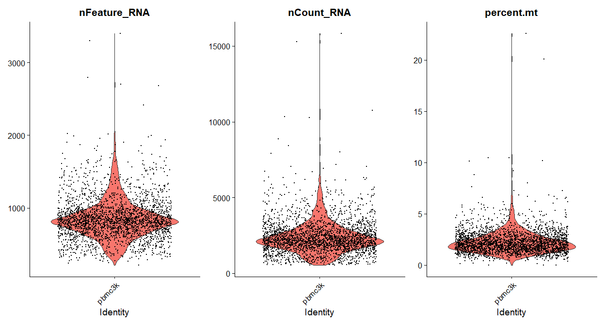<!-- -->


``` r
# FeatureScatter is typically used to visualize feature-feature relationships, but can be used
# for anything calculated by the object, i.e. columns in object metadata, PC scores etc.

plot1 <- FeatureScatter(pbmc, feature1 = "nCount_RNA", feature2 = "percent.mt")
plot2 <- FeatureScatter(pbmc, feature1 = "nCount_RNA", feature2 = "nFeature_RNA")
plot1 + plot2
```

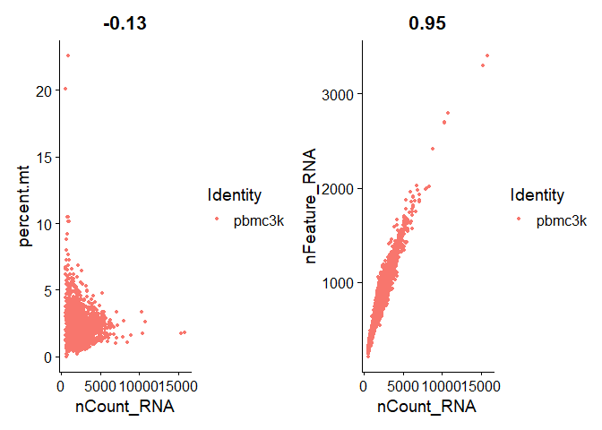<!-- -->

``` r
pbmc <- subset(pbmc, subset = nFeature_RNA > 200 & nFeature_RNA < 2500 & percent.mt < 5)
```


***

# Normalizing the data

After removing unwanted cells from the dataset, the next step is to normalize the data. By default, we employ a global-scaling normalization method "LogNormalize" that normalizes the feature expression measurements for each cell by the total expression, multiplies this by a scale factor (10,000 by default), and log-transforms the result. Normalized values are stored in `pbmc[["RNA"]]@data`.


``` r
pbmc <- NormalizeData(pbmc, normalization.method = "LogNormalize", scale.factor = 10000)
```
For clarity, in this previous line of code (and in future commands), we provide the default values for certain parameters in the function call. However, this isn't required and the same behavior can be achieved with:


``` r
pbmc <- NormalizeData(pbmc)
```

# Identification of highly variable features (feature selection)

We next calculate a subset of features that exhibit high cell-to-cell variation in the dataset (i.e, they are highly expressed in some cells, and lowly expressed in others). We and [others](https://www.nature.com/articles/nmeth.2645) have found that focusing on these genes in downstream analysis helps to highlight biological signal in single-cell datasets.

Our procedure in Seurat is described in detail [here](https://doi.org/10.1016/j.cell.2019.05.031), and improves on previous versions by directly modeling the mean-variance relationship inherent in single-cell data, and is implemented in the `FindVariableFeatures()` function. By default, we return 2,000 features per dataset. These will be used in downstream analysis, like PCA.


``` r
DefaultLayer(pbmc[["RNA"]]) <- "counts"
pbmc <- FindVariableFeatures(pbmc, selection.method = "vst", nfeatures = 2000)

# Identify the 10 most highly variable genes
top10 <- head(VariableFeatures(pbmc), 10)

# plot variable features with and without labels
plot1 <- VariableFeaturePlot(pbmc)
plot2 <- LabelPoints(plot = plot1, points = top10, repel = TRUE)
plot1 + plot2
```

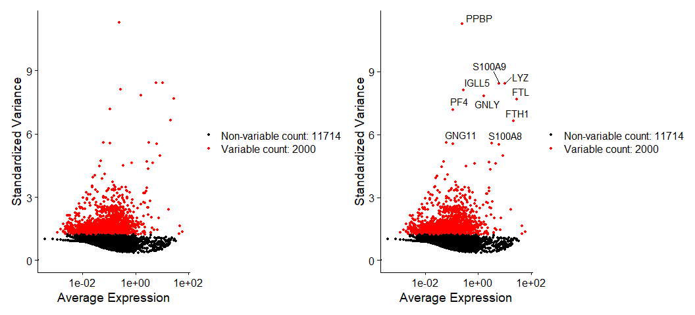<!-- -->

***

# Scaling the data

Next, we apply a linear transformation ('scaling') that is a standard pre-processing step prior to dimensional reduction techniques like PCA. The `ScaleData()` function:

* Shifts the expression of each gene, so that the mean expression across cells is 0
* Scales the expression of each gene, so that the variance across cells is 1
    + This step gives equal weight in downstream analyses, so that highly-expressed genes do not dominate
* The results of this are stored in `pbmc[["RNA"]]@scale.data`


``` r
DefaultLayer(pbmc[["RNA"]]) <- "data"
all.genes <- rownames(pbmc)
pbmc <- ScaleData(pbmc, features = all.genes)
```
<details>
  <summary>**This step takes too long! Can I make it faster?**</summary>

Scaling is an essential step in the Seurat workflow, but only on genes that will be used as input to PCA. Therefore, the default in `ScaleData()` is only to perform scaling on the previously identified variable features (2,000 by default). To do this, omit the `features` argument in the previous function call, i.e.

``` r
pbmc <- ScaleData(pbmc)
```
Your PCA and clustering results will be unaffected. However, Seurat heatmaps (produced as shown below with `DoHeatmap()`) require genes in the heatmap to be scaled, to make sure highly-expressed genes don't dominate the heatmap. To make sure we don't leave any genes out of the heatmap later, we are scaling all genes in this tutorial. 
</details>
\  
<details>
  <summary>**How can I remove unwanted sources of variation, as in Seurat v2?**</summary>

In `Seurat v2` we also use the `ScaleData()` function to remove unwanted sources of variation from a single-cell dataset. For example, we could 'regress out' heterogeneity associated with (for example) cell cycle stage, or mitochondrial contamination. These features are still supported in `ScaleData()` in `Seurat v3`, i.e.: 


``` r
pbmc <- ScaleData(pbmc, vars.to.regress = "percent.mt")
```

> means that Seurat is scaling the gene expression data while also removing the effect of mitochondrial gene content (percent.mt) as an unwanted source of variation.

> In single-cell RNA-seq data, high mitochondrial gene expression often indicates low-quality or dying cells.

> If you don't correct for this, it could introduce unwanted variation in your downstream analyses (like PCA or clustering).

> vars.to.regress = "percent.mt" tells Seurat to regress out (remove the influence of) the mitochondrial percentage before performing scaling.

However, particularly for advanced users who would like to use this functionality, we strongly recommend the use of our new normalization workflow, `SCTransform()`. The method is described in our [paper](https://genomebiology.biomedcentral.com/articles/10.1186/s13059-019-1874-1), with a separate vignette using Seurat v3 [here](sctransform_vignette.html). As with `ScaleData()`, the function `SCTransform()` also includes a `vars.to.regress` parameter.
</details>
\ 

***

# Perform linear dimensional reduction

Next we perform PCA on the scaled data. By default, only the previously determined variable features are used as input, but can be defined using `features` argument if you wish to choose a different subset.


``` r
pbmc <- RunPCA(pbmc, features = VariableFeatures(object = pbmc))
```

Seurat provides several useful ways of visualizing both cells and features that define the PCA, including `VizDimReduction()`, `DimPlot()`, and `DimHeatmap()`


``` r
# Examine and visualize PCA results a few different ways
print(pbmc[["pca"]], dims = 1:5, nfeatures = 5)
```

```
## PC_ 1 
## Positive:  CST3, TYROBP, LST1, AIF1, FTL 
## Negative:  MALAT1, LTB, IL32, IL7R, CD2 
## PC_ 2 
## Positive:  CD79A, MS4A1, TCL1A, HLA-DQA1, HLA-DQB1 
## Negative:  NKG7, PRF1, CST7, GZMB, GZMA 
## PC_ 3 
## Positive:  HLA-DQA1, CD79A, CD79B, HLA-DQB1, HLA-DPB1 
## Negative:  PPBP, PF4, SDPR, SPARC, GNG11 
## PC_ 4 
## Positive:  HLA-DQA1, CD79B, CD79A, MS4A1, HLA-DQB1 
## Negative:  VIM, IL7R, S100A6, IL32, S100A8 
## PC_ 5 
## Positive:  GZMB, NKG7, S100A8, FGFBP2, GNLY 
## Negative:  LTB, IL7R, CKB, VIM, MS4A7
```


``` r
VizDimLoadings(pbmc, dims = 1:2, reduction = "pca")
```

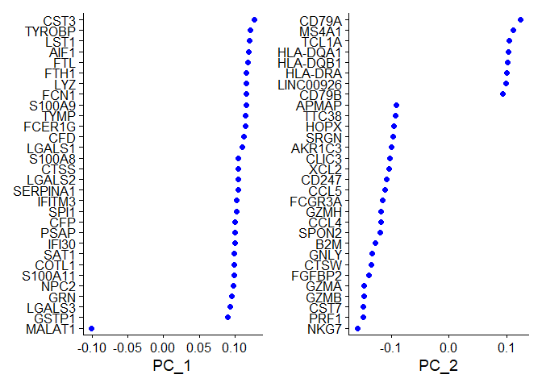<!-- -->


``` r
DimPlot(pbmc, reduction = "pca")
```

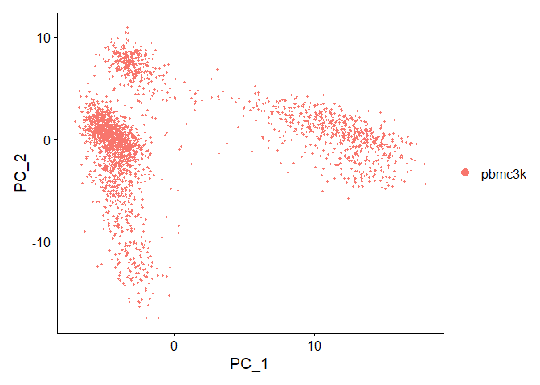<!-- -->


In particular `DimHeatmap()` allows for easy exploration of the primary sources of heterogeneity in a dataset, and can be useful when trying to decide which PCs to include for further downstream analyses. Both cells and features are ordered according to their PCA scores. Setting `cells` to a number plots the 'extreme' cells on both ends of the spectrum, which dramatically speeds plotting for large datasets. Though clearly a supervised analysis, we find this to be a valuable tool for exploring correlated feature sets.


``` r
DimHeatmap(pbmc, dims = 1, cells = 500, balanced = TRUE)
```

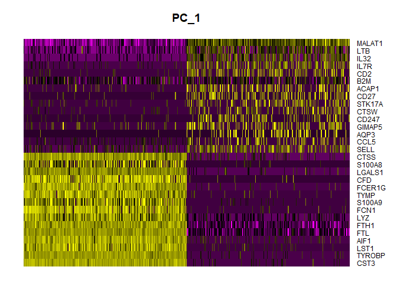<!-- -->

> X-axis: Cells

> *The columns of the heatmap are cells (a subset of 500 in this case).

> *The cells are ordered by their PCA scores along PC 1, which helps you see how gene expression changes across that dimension.

> *If balanced = TRUE, the heatmap selects equal numbers of cells from both extremes of PC1, i.e., from both "sides" of that principal component.

> Y-axis: Genes (Features)

> *The rows are the genes that contribute most to the variation captured by the selected PC (in this case, PC 1).

> *These are typically the top loading genes — the ones that define PC 1 the most.

#### Summary:

| Axis      | Meaning                               |
| --------- | ------------------------------------- |
| **X**     | Cells ordered by PC score (e.g., PC1) |
| **Y**     | Top genes with high loadings on PC1   |
| **Color** | Gene expression intensity (scaled)    |


``` r
DimHeatmap(pbmc, dims = 1:15, cells = 500, balanced = TRUE)
```

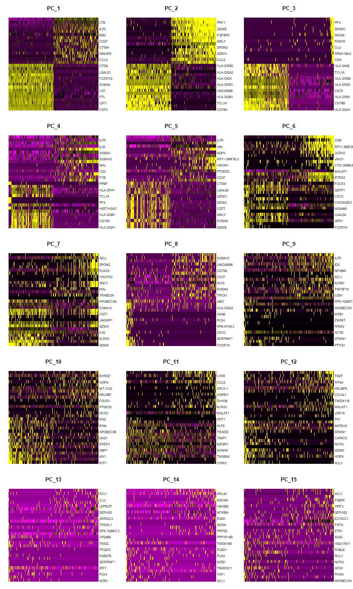<!-- -->

# Determine the 'dimensionality' of the dataset

To overcome the extensive technical noise in any single feature for scRNA-seq data, Seurat clusters cells based on their PCA scores, with each PC essentially representing a 'metafeature' that combines information across a correlated feature set. The top principal components therefore represent a robust compression of the dataset. However, how many components should we choose to include? 10? 20? 100?

In [Macosko *et al*](http://www.cell.com/abstract/S0092-8674(15)00549-8), we implemented a resampling test inspired by the JackStraw procedure. We randomly permute a subset of the data (1% by default) and rerun PCA, constructing a 'null distribution' of feature scores, and repeat this procedure. We identify 'significant' PCs as those who have a strong enrichment of low p-value features.


``` r
# NOTE: This process can take a long time for big datasets, comment out for expediency. More
# approximate techniques such as those implemented in ElbowPlot() can be used to reduce
# computation time pbmc <- JackStraw(pbmc, num.replicate = 100) pbmc <- ScoreJackStraw(pbmc,
# dims = 1:20)
```

The `JackStrawPlot()` function provides a visualization tool for comparing the distribution of p-values for each PC with a uniform distribution (dashed line). 'Significant' PCs will show a strong enrichment of features with low p-values (solid curve above the dashed line). In this case it appears that there is a sharp drop-off in significance after the first 10-12 PCs.


``` r
# JackStrawPlot(pbmc, dims = 1:15)
```

An alternative heuristic method generates an 'Elbow plot': a ranking of principle components based on the percentage of variance explained by each one (`ElbowPlot()` function). In this example, we can observe an 'elbow' around PC9-10, suggesting that the majority of true signal is captured in the first 10 PCs. 


``` r
ElbowPlot(pbmc)
```

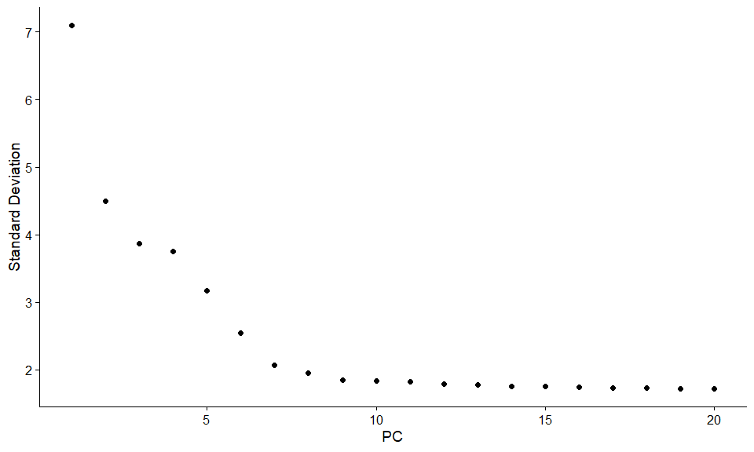<!-- -->

Identifying the true dimensionality of a dataset -- can be challenging/uncertain for the user. We therefore suggest these three approaches to consider. The first is more supervised, exploring PCs to determine relevant sources of heterogeneity, and could be used in conjunction with GSEA for example. The second implements a statistical test based on a random null model, but is time-consuming for large datasets, and may not return a clear PC cutoff. The third is a heuristic that is commonly used, and can be calculated instantly. In this example, all three approaches yielded similar results, but we might have been justified in choosing anything between PC 7-12 as a cutoff. 

We chose 10 here, but encourage users to consider the following:

* Dendritic cell and NK aficionados may recognize that genes strongly associated with PCs 12 and 13 define rare immune subsets (i.e. MZB1 is a marker for plasmacytoid DCs). However, these groups are so rare, they are difficult to distinguish from background noise for a dataset of this size without prior knowledge. 
* We encourage users to repeat downstream analyses with a different number of PCs (10, 15, or even 50!). As you will observe, the results often do not differ dramatically.
* We advise users to err on the higher side when choosing this parameter. For example, performing downstream analyses with only 5 PCs does significantly and adversely affect results.

***

# Cluster the cells

Seurat v3 applies a graph-based clustering approach, building upon initial strategies in ([Macosko *et al*](http://www.cell.com/abstract/S0092-8674(15)00549-8)). Importantly, the *distance metric* which drives the clustering analysis (based on previously identified PCs) remains the same. However, our approach to partitioning the cellular distance matrix into clusters has dramatically improved. Our approach was heavily inspired by recent manuscripts which applied graph-based clustering approaches to scRNA-seq data [[SNN-Cliq, Xu and Su, Bioinformatics, 2015]](http://bioinformatics.oxfordjournals.org/content/early/2015/02/10/bioinformatics.btv088.abstract) and CyTOF data [[PhenoGraph, Levine *et al*., Cell, 2015]](http://www.ncbi.nlm.nih.gov/pubmed/26095251). Briefly, these methods embed cells in a graph structure - for example a K-nearest neighbor (KNN) graph, with edges drawn between cells with similar feature expression patterns, and then attempt to partition this graph into highly interconnected 'quasi-cliques' or 'communities'. 

As in PhenoGraph, we first construct a KNN graph based on the euclidean distance in PCA space, and refine the edge weights between any two cells based on the shared overlap in their local neighborhoods (Jaccard similarity). This step is performed using the `FindNeighbors()` function, and takes as input the previously defined dimensionality of the dataset (first 10 PCs).

To cluster the cells, we next apply modularity optimization techniques such as the Louvain algorithm (default) or SLM [[SLM, Blondel *et al*., Journal of Statistical Mechanics]](http://dx.doi.org/10.1088/1742-5468/2008/10/P10008), to iteratively group cells together, with the goal of optimizing the standard modularity function. The `FindClusters()` function implements this procedure, and contains a resolution parameter that sets the 'granularity' of the downstream clustering, with increased values leading to a greater number of clusters. We find that setting this parameter between 0.4-1.2 typically returns good results for single-cell datasets of around 3K cells. Optimal resolution often increases for larger datasets. The clusters can be found using the `Idents()` function.


``` r
pbmc <- FindNeighbors(pbmc, dims = 1:10)
pbmc <- FindClusters(pbmc, resolution = 0.5)
```

```
## Modularity Optimizer version 1.3.0 by Ludo Waltman and Nees Jan van Eck
## 
## Number of nodes: 2638
## Number of edges: 95927
## 
## Running Louvain algorithm...
## Maximum modularity in 10 random starts: 0.8728
## Number of communities: 9
## Elapsed time: 0 seconds
```

``` r
# Look at cluster IDs of the first 5 cells
head(Idents(pbmc), 5)
```

```
## AAACATACAACCAC-1 AAACATTGAGCTAC-1 AAACATTGATCAGC-1 AAACCGTGCTTCCG-1 
##                2                3                2                1 
## AAACCGTGTATGCG-1 
##                6 
## Levels: 0 1 2 3 4 5 6 7 8
```

> What does resolution do?

It controls how finely Seurat splits your data into clusters:

- Low resolution (e.g., 0.2) → Fewer, broader clusters

- High resolution (e.g., 1.0 or higher) → More, narrower clusters

#### Guidelines for Choosing a Resolution

| Dataset Size   | Recommended Resolution Range |
| -------------- | ---------------------------- |
| ~3,000 cells   | 0.4 to 1.2                   |
| 10,000+ cells  | 1.0 to 2.0+                  |
| 100,000+ cells | 2.0 to 5.0+                  |


***

# Run non-linear dimensional reduction (UMAP/tSNE)

Seurat offers several non-linear dimensional reduction techniques, such as tSNE and UMAP, to visualize and explore these datasets. The goal of these algorithms is to learn the underlying manifold of the data in order to place similar cells together in low-dimensional space. Cells within the graph-based clusters determined above should co-localize on these dimension reduction plots. As input to the UMAP and tSNE, we suggest using the same PCs as input to the clustering analysis.


``` r
# If you haven't installed UMAP, you can do so via reticulate::py_install(packages =
# 'umap-learn')
pbmc <- RunUMAP(pbmc, dims = 1:10)
```


``` r
# note that you can set `label = TRUE` or use the LabelClusters function to help label
# individual clusters
DimPlot(pbmc, reduction = "umap")
```

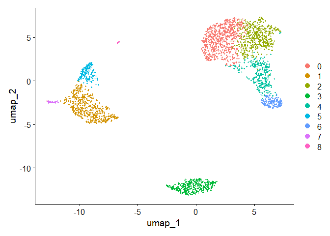<!-- -->

You can save the object at this point so that it can easily be loaded back in without having to rerun the computationally intensive steps performed above, or easily shared with collaborators.


``` r
saveRDS(pbmc, file = "./output/pbmc_tutorial.rds")
```

### Steps to make a 3D UMAP plot

#### Run UMAP in 3D:
Use n.components = 3 to get 3 UMAP dimensions.


``` r
pbmc <- RunUMAP(pbmc, dims = 1:10, n.components = 3)
```

#### Extract UMAP embeddings:


``` r
umap_3d <- Embeddings(pbmc, reduction = "umap")
```

#### Prepare data for plotly:


``` r
library(plotly)

plot_data <- as.data.frame(umap_3d)
plot_data$cluster <- Idents(pbmc)
```

#### Plot with plotly::plot_ly():


``` r
plot_ly(data = plot_data, x = ~umap_1, y = ~umap_2, z = ~umap_3, color = ~cluster, colors = "Set1",
    type = "scatter3d", mode = "markers", marker = list(size = 2))
```

```{=html}
<div class="plotly html-widget html-fill-item" id="htmlwidget-5e6511ce910cf10dc16c" style="width:672px;height:480px;"></div>
<script type="application/json" data-for="htmlwidget-5e6511ce910cf10dc16c">{"x":{"visdat":{"502824283a35":["function () ","plotlyVisDat"]},"cur_data":"502824283a35","attrs":{"502824283a35":{"x":{},"y":{},"z":{},"mode":"markers","marker":{"size":2},"color":{},"colors":"Set1","alpha_stroke":1,"sizes":[10,100],"spans":[1,20],"type":"scatter3d"}},"layout":{"margin":{"b":40,"l":60,"t":25,"r":10},"scene":{"xaxis":{"title":"umap_1"},"yaxis":{"title":"umap_2"},"zaxis":{"title":"umap_3"}},"hovermode":"closest","showlegend":true},"source":"A","config":{"modeBarButtonsToAdd":["hoverclosest","hovercompare"],"showSendToCloud":false},"data":[{"x":[2.0687276719855054,0.88583749521243393,0.25221461046206772,0.21308571088778794,1.5364452971862537,2.2684972881125196,1.5828655193345529,1.4697906075762492,1.9090002178000194,0.84753781545626938,3.0006285308645948,2.5848977564619764,1.2901688216971141,0.79218935955035508,2.6777402757452711,3.3318079112814649,2.0437597035216077,1.1582162081049663,1.886380821351884,3.0511381028937086,1.4743909089611751,4.0001311897085889,1.4947982727335674,3.2320311664389356,0.9068176745222789,0.24174386251437485,1.3339092730330211,1.5911352982530278,2.3587753771589979,3.0250951646612867,1.6724310441659671,1.5162594466255885,0.37807565916049302,2.743458449725984,1.5964026983147395,2.3235529660032972,2.347904980068086,0.94311577070224106,1.0025542377279979,2.2880131005095228,1.5731532889204007,2.8960434793280347,1.1568916736887676,1.6483002937184554,3.5219994186209425,1.9223079680250865,0.46329241979586899,1.0539259313391429,2.8602262138174757,1.7108174859331828,0.51380270708072007,3.2427592872427686,2.9530110954092725,3.4850552676962598,1.1385748683260661,0.5802982448385936,2.6311735509680494,0.41460746515261948,3.0093404649542554,3.090491592769502,1.9821290074633342,1.8642199038313609,3.6456778644369825,1.6243794652419072,0.32925540197360337,3.423745930080293,3.1053413747595533,2.4298201798247083,1.2383085488127452,0.28953069437014878,1.3722113518761379,1.0810343622015697,2.7193607686804517,0.99153858411776841,1.8250772951887828,1.7479119448708278,2.1219406722830518,0.35111647832858384,1.8880076705263835,2.8701456188009962,0.86726307857501328,2.7161760925101026,0.98293972003924668,1.6663143559144717,1.9988772867964488,1.1929920910643321,3.9853628276633009,1.2116775809572917,2.7061188815878614,2.6915882228659376,0.61202681053149521,-7.4978713394356982,1.4793831108854991,0.82763731468188584,1.7267950772093517,1.720499873046754,0.14790481317508042,0.77897548664080918,1.8640698491381389,1.7721378802107555,3.6868022083090528,0.27524524915683091,2.4104059337424024,2.1161451934622511,1.1866525410460216,2.6956101058768018,1.1100397406862956,3.0473404525564893,3.0115849374579176,2.9863962529944166,0.88894075143801987,3.8868256210135206,2.1308633087919935,2.2126973270224317,1.8179421572731715,1.6909987180279475,0.96605789649951279,2.7259501813696607,0.30770558107363999,1.5444014369295818,2.5361135004805311,0.36282628763186753,2.871279060726045,1.9841379820154887,0.95494568336474717,1.8710669873999339,2.6540287135885938,1.7365882246540767,1.2614249883936626,1.967909335975526,0.82102340448367417,2.5897847412871107,2.443338215236543,0.4414880870627147,1.4035285263107997,2.2977520822333082,1.6169697548048478,3.2797678111838087,1.6586803047703487,0.39261955011355698,2.2712756990240797,2.4798021911429151,0.87026524532306015,1.8297063558148128,0.50430637586581528,0.48898500192630112,0.93367707717883408,1.7245163618372661,2.6298683284567579,1.7462181447790843,1.195092260722993,1.9003645478533489,3.0792941449927076,1.8238887636708003,2.8330236076163038,1.7581235318230373,1.1877398489760143,3.0584669708060011,1.7763747720764858,2.1665917037771925,0.80523550498950303,1.8835127948569041,0.7993415592955333,2.9181533454703077,2.6718053220556959,2.319171488170503,3.0176509021567091,1.200587034110902,1.1408995686815959,3.0197593568609937,2.4757444857405408,2.6452681421087965,2.4356785415457471,3.3580867646979078,0.91222327936160386,1.5224615632342082,2.3793084024237379,3.8680501579092725,0.21938127267825425,3.4184361099051221,0.7377910016821605,1.877214401845811,3.1388013957785352,3.3597274421499952,2.3575741051481947,2.492238521461366,3.4441071151541456,1.9706060885237437,2.4973689912604078,2.2363665698813184,0.98650139558780015,3.3241625427054151,1.5394234507130367,1.217167764787553,0.73438662279116929,1.3304559587286693,1.0371217726515514,0.85847622144686997,2.8601327537344678,2.1454699038313612,1.0146800874518138,1.7447672336148006,1.2178093789862376,3.414736091976045,2.249329745654939,1.2611669300841075,1.6362794897304755,1.2533110081003886,1.1390342711256725,0.53076678503024399,2.7510026096152052,2.2866347430990919,2.9137927888678297,2.9337343572424635,3.1599854825781568,0.29042834032046616,1.5984988127620798,1.912928730134843,0.79998952138888657,2.5614342688368543,3.8097282050894483,1.3147475718306285,2.1579314469145521,2.1135925649451002,3.1976928113745435,1.7129030822561961,0.6452805994795543,3.7167151569174512,1.3432008324908,0.48644262540805161,2.4509641526983961,1.913858860616563,2.3579116462515577,3.3803920148657545,2.3468935488508924,3.2143805621908887,2.1426293848799451,2.5583763121412977,1.7392707018898708,1.1073767541693431,3.577516853694795,1.9387624560641032,0.9784804581450206,1.5295650957869273,0.88454264390933335,0.63470113265979111,0.86788076150882065,0.59408992517459214,1.0854927300261241,1.976975977306245,3.0125256179617628,2.3796460627363905,2.9577241538809522,1.5506217925595027,1.4140158890532237,2.6400734781073316,4.0125315784262403,1.9095395802305919,1.5004199295090419,1.1929349898146373,1.1856518088625652,2.2213924526022657,2.9938027261542066,2.3527223466681226,2.7982124685095533,2.3758744000242933,1.920943170671342,1.2703288792418224,1.689009077732442,0.46146887529361069,1.6194386834995729,1.4799749403046352,1.227528989200471,2.0277128218458875,2.0771317778872236,1.9548755286978465,2.0105141996191724,0.86627936351764023,2.7045555709646925,2.0973788498686536,0.4400997756766063,1.6996678783344012,0.75685918319690049,0.24862033117282212,2.0088397561358198,1.4262588917063457,2.2361671923445448,0.74485611904132187,2.567182540778993,2.4760732649611219,1.0315597652243358,1.3855571596668941,1.7687558977650386,2.9848559497641309,1.3654427527235729,0.79420334089267075,2.4705668686674818,3.4113271831320509,1.4055507628964168,1.3800206034229976,0.70807158935534775,2.7484477161215528,1.036988377456544,0.84904205787646592,0.38954514253604233,1.2037594317244273,2.1164170502470716,1.8919457196043712,0.54912835348117173,2.8520044683264478,3.652709782009004,0.32663005578982651,2.7594694494055494,0.33710736024844468,2.5857601760672315,1.4968265219377261,2.5123885272787794,3.1335398553656324,1.771896928434251,0.8057621120260936,0.42974239576327622,0.80173969257342637,2.8032359479712232,1.6365595198022109,2.1610081194685682,2.2918460964010938,1.7795447258995754,3.0386289953039869,2.2546225189017042,3.3323075174139722,3.221832096462129,1.5301511808084232,1.6255554611580354,2.2287445663260206,0.75341778982150376,1.1995686887549144,0.15679615724551499,1.5259342043446285,-7.5568961502267138,0.5843258498953563,3.1585968135641798,1.1804575322912914,1.7117411791132671,1.3563953338907939,1.8997589646624309,2.8692418931769117,1.6913186087058765,1.2743918298529369,2.3504498599814161,1.9912438391493541,3.2872839568899854,1.1417708693789226,1.2181181906508189,2.2113286255644544,2.4443678854750379,3.4470751880453809,0.70748502004611313,1.3067880271719676,3.372677028064607,3.1671120523260816,1.4979484154628497,1.8848116098688823,1.6234110015230161,1.9738572834776622,1.1390284596728069,3.5256091951178297,1.6163001934783441,1.1980130373285991,2.1719723342703565,0.9448118208693248,3.67103201139438,2.4103364347265943,1.1385326086329204,2.0038213132666334,3.0465599893378004,1.7737560122059566,0.84450244892108262,1.2155324219511729,2.3884118198202833,0.75441175687777817,0.23965793836581528,1.7176329715894443,1.8418442307757121,0.28959518659579575,2.6798678039358839,2.6266139148520216,1.6463354750322086,1.7114766760514957,2.9626564382361158,2.7417554258154615,1.8773619531439525,0.54666429746615708,0.49652308214175522,1.2180772124575359,3.0832077859686597,0.99186027038562119,2.8912058471487745,0.72653335321414292,0.47688347089755356,3.3748781083868726,2.9030416606711134,1.0785563586996776,2.555049538497804,1.5130299626635295,1.6734638958023769,0.46346908796298325,3.6088307498739942,1.2878966330336314,3.6511445640372022,3.0012543796347364,3.1754274963186964,1.1395806072996837,2.407977640514253,1.2780021725939494,2.5983539222525343,1.7604413031386119,1.5971545042721462,2.4058281778143629,1.2786529957102519,0.73849165428149521,0.44317859399783432,0.97660839546191514,0.88729977596270859,3.1915146707342847,0.87457370746600449,2.9231616853522047,1.9291803537653667,3.4483804105566724,3.6622598766134962,3.3700328468130811,1.4886734857009631,1.29206797469127,2.570511877422212,2.4601699708746656,3.3469689487265333,3.1621065734671339,2.6397706865118726,1.1810410915659648,1.8211384414480907,1.0091224907683116,2.4774165748404249,2.7022424339102491,2.0783963798331007,3.7697346805380567,0.94731670606601059,3.5374311803625806,2.1802374123381361,2.6493417619513258,2.4025211333082899,2.5891841052817091,1.2929196952627879,1.1347761451052409,2.1346268652724012,2.3421891330527052,1.1283681391524059,1.048810899143098,1.5265702455090266,1.772368147854684,3.4027802346991285,0.80511170614230454,2.2431206702040418,3.1819505094336256,2.5634627937124952,1.8820880948351604,1.492836281542657,2.0989366768645032,2.8940382598685011,1.9612476228522044,3.4407245515631422,1.6735755949066859,1.5447088478850108,0.31920355546939194,1.3700296430634242,2.3912600277708753,3.0052490829275831,2.2059307097243055,2.6791120170401319,2.0344669519709333,2.6744338868902906,2.5168861745642408,1.0145930646704417,0.91142982233035386,0.59902256715762436,2.2748214601324781,1.7787195293949825,2.373665273074983,3.6472838519858106,1.9456582068251354,0.64883017528521836,0.41151052701937973,2.0591448544310316,1.0503916739271861,2.9857839940832838,0.48156386602389634,2.0813174544619306,0.43428903806674302,2.3103663920210584,0.83980441081988633,1.6434543131636363,1.8372470437334758,2.4549328683661207,1.3805020599411708,2.5049952267454847,1.5664912479715329,0.66680765140521348,1.0688332914160472,0.35158807027804673,2.8007695077704176,3.2197026609228834,1.210700273399232,1.7075753806875926,0.74128240335452378,2.2921746968077406,3.3618028758810743,2.5238384603308424,2.7385923265265211,0.26147431123721421,2.5468325613783582,1.539757113789199,1.7450227140234691,0.76049637783038437,2.8719163535879835,0.87806785095202744,0.74172276247012436,0.99219852674472153,0.8812018035696727,1.9984620212362987,2.9788168071554884,1.344776600484727,1.5770853216545564,2.5401811598585828,1.6278138047801238,0.55386453855502427,2.0431075989054426,0.63167101133334458,0.78734642255770981,2.5015552042769178,2.0768528579519971,1.6989862545179111,1.7109820767091495,2.0169421433256849,2.9764693378256544,1.9988876878069621,0.34465783823001206,3.2136041520880445,1.3691314457701427,3.5860751270102247,2.0299675165461286,3.3523700832175001,1.1483819781588298,2.482940494899629,2.3305718301581129,0.28135520208346665,3.6802974342154249,0.81810677040087998,1.9065263568209392,2.7137944101141676,1.3291146754072887,2.0613464413927778,2.0384475587652906,1.9590437709139568,2.1763716934965833,1.7057846559928638,3.6756928561972364,2.7330483793066724,2.2899997829245313,0.71038812387454331,3.0550785659598096,1.0661578177260143,2.6818415521429761,1.7297728209542018,1.1198478339956981,1.0953036843584758,0.21710163343417466,2.0755639671133741,1.8307491688774806,1.0763044952200633,0.88705629098880112,0.28275328863131821,1.814555659775613,2.2790952919768079,1.3198434709357005,3.7053037284659132,0.57051593053805649,1.7858661263035518,1.8397307394789439,2.3525012134360059,1.3546052722977382,1.2803948520468456,1.9683426915453655,1.9161300956057292,0.38307970750796616,0.30534154165255845,2.5221419929312452,2.0661360918329938,2.9598764776037916,1.4621731637762767,1.2295635639475566,3.359925448779939,2.1109278796957716,1.6602229698346835,1.459151103978036,0.90199983108508408,1.3678739665793163,1.0036709903525096,2.6058308481024488,2.1571797727392896,2.4679263232992872,1.9900187252806407,1.4071727095888835,1.2674866317557079,2.1587783097075208,2.6449534295843824,2.5236107109831556,0.89366954553592026,1.5679424925492984,1.9280603824900371,0.51820570219027817,1.0701228975104076,3.0683603881643995,2.082808077220796,2.792677461986421,1.7011104746507388,2.5026798843191846,2.3906406163023695,2.299396097545503,1.5141638218210918,0.22906523931491196,3.93615013349521,1.9170123933600169,2.4682279824064954,3.3320634959982618,1.7804986237333995,2.0090129076288923,0.70464569318759263,1.6907726152585727,1.1891255675600749,1.3733179866121989,3.0193528531836256,1.8404558299826366,1.8990811406420451,-7.3115491272164599,1.7932162581728679,2.2341399191664442,3.168960511569856,-7.5497893692208544,2.0305160878943189,1.4267058073328716,2.7012669442938551,1.9039836524771434,1.0043123363302928,1.442329838757394,3.0505960582541212,1.7864739446686488,2.7895463107870802,1.228549212102769,0.38323241460788071,0.96332252014148056,1.8206311165140849,0.61950600135791123,2.9100788234518751,3.0689701436804517,1.4662810860918742,0.41465121496188462,1.792381450419305,1.3547943978356105,1.0312369464682323,0.30961590993869126,0.77727282035815537,1.8744548856066447,2.7406474946783765,2.4919193385885938,2.5660828946875318,3.185477435474275,0.63517862546908677,2.941433131580232,1.0372105239676219,2.0566304026888593,0.59710437047946274,1.4097864924715739,0.68671274173724473,3.2390181421087965,1.069347381477235,2.4084041713522657],"y":[4.1247904164734432,2.6989238126221249,2.7534265382233212,3.1450078351440975,4.6765057904663632,4.5333454472961972,3.0991093976440975,3.6773526532593319,3.9749386174622128,4.5492985112610409,5.2690951688232968,5.1303193433228085,4.1033694608154843,3.1677605969849179,4.2011840207520077,5.3878710133972714,3.7818801267090389,3.7954923970642636,5.10321401190191,4.0093414647522518,3.9535000188294003,5.400354133361871,4.2623641354981014,5.0511190755310604,4.5705516202393124,2.7979566914978573,4.4747679097595761,3.3332955701294491,4.5851199490967343,3.5451490743103573,4.3725702626648495,3.0934026105347225,2.9898478848877499,5.1806671483460018,2.7762577397766659,5.51422475408941,4.9224622113648007,4.0186874730530331,4.4569370610657284,3.2876617772522518,5.0475118024292538,4.7051064832153866,3.780391917938287,4.4395167691650936,4.0655820233765194,5.23451922964483,3.3035890920105526,3.4470193250122616,4.4747612340393612,3.3627164227905819,3.5831153256836483,5.4440948827210018,4.3611714703980038,5.4678451878967831,3.7681381566467831,3.4949862821045468,3.192506061309869,3.5017464024963925,4.1681578023377011,3.8033463818970272,3.835875259155328,3.5271160466614315,5.0025427205505917,4.4653060300293514,2.7492525441589901,4.7276894910278866,3.4191849095764706,5.2937357289734432,3.5762007100525448,2.7732164723816464,3.5489523274841854,3.5597841603699276,5.0497052533569882,4.0526869161072323,4.342802749389703,4.8042557103577206,3.6203186376038143,3.0017545087280819,4.1011030538025448,4.4665968282166073,3.2159478528442929,3.1586782796326229,3.9178416593018124,3.6321303708496639,3.3206899030151913,4.2996289594116757,4.9835750920715878,5.0728952748718807,4.0259930951538632,4.5725996358337948,2.8089139325562069,-0.44840963054270078,4.466152415985162,4.4773480756226132,3.2267205579224179,3.1949879987183163,3.2191364629211972,3.6553246838989804,4.4958445889893124,3.9233200414124081,5.0555674893799374,3.2842080457153866,4.176756606811578,5.4737999303284237,4.5401356084290097,5.6848208768311093,2.8660409314575741,5.7268831593933651,4.8020470006409237,5.23207782339483,3.5854546887817929,4.2265670163574764,3.798453555816705,5.0889336926880429,3.6548187596741268,3.8739602429810116,4.8247167928162167,3.6917044980469296,3.5229279859009335,3.9325115544739315,3.6757271153870175,2.9537913663330624,4.3767654759827206,4.2239940030518124,4.1419579846802304,5.4182145459595272,4.5966951711121151,3.1750547749939511,3.3086807591858456,4.1862981183472225,4.2684423787537167,4.8701889378967831,3.4431335790100643,3.1019728047791073,3.6636330945435116,4.9141566617432186,3.6377680165710995,5.518396125549371,4.1419250829163143,3.1006491048279354,4.6805879933777401,5.0940320355835507,3.426181541198785,3.4270083768311093,3.1363417966309139,3.1575162274780819,3.3111073834839413,3.828889117950494,4.0429594380798886,3.9015920026245663,4.3255922658386776,3.7871706349793026,4.7041647298279354,3.1901495320740292,4.9355022771301815,3.2004482610169003,4.3175589902344296,4.7391807897034237,3.3359768254700253,2.9577829701843807,3.9133860928955624,3.1441032750549862,3.1650326116028378,3.4566743237915585,5.4355394704285214,4.475831256622369,3.7326166493835995,3.5148031575623104,3.9710171086731503,5.0263626439514706,4.2915518147888729,4.2938449246826718,3.9180581433716366,5.2961480481567929,4.6524817807617733,4.44148944448858,5.2290503842773983,4.6552321774902889,2.8462874753418514,4.9097931249085018,3.8479869229736874,4.4135711057129452,5.0758378369751522,5.3150760991516659,3.3527495725098202,3.7682192189636776,3.8702280385437557,4.34625600408941,5.3377497060242245,4.8416201932373593,4.6003210408630917,3.9262192113342831,3.6735002858582089,3.6947228772583554,2.6586477620544979,5.0523593289795468,4.0637314183655331,3.3027384145203182,3.8362815244141171,3.7628052098694393,3.2533767087402889,3.976528392547662,4.4561173779907772,4.9512297971191952,3.9694115979614804,4.4919102055969784,3.5230615003052304,4.561578498596246,4.4045555455627987,4.1886222226563046,4.8440716130676815,3.2408034665527889,5.5792376859131405,5.3921606404724667,4.9541981084290097,2.8286740643921444,3.3225505216064999,3.0019390447083065,3.5695726735535214,5.3416097028198788,5.5842568738403866,3.1765243871155331,3.1683566434326718,4.0657279355469296,3.9610617024841854,4.4581076962891171,3.6071421964111874,4.3849699361267636,4.372531638855035,2.8200161321106503,4.7128455502930233,4.3942863805237362,3.4022858006897518,4.9451796872559139,5.3089339597168514,5.3650200231018612,5.0677420957031796,5.3911011083069393,2.8571727139893124,3.3541257245483944,5.5796291692200253,3.4718577725830624,4.4236862523499081,4.1622078282776425,3.182768569702203,4.3447291715088436,3.27698110174566,3.1774971349182675,4.4561011655273983,4.9243662221375057,4.87056659292608,5.1938907964172909,5.0699198110046932,3.4028317792358944,2.9986979825439999,5.1381585462036679,5.2305247647705624,4.6844608647766659,3.0968167645874569,3.7577650411072323,3.1847202641907284,4.3166701657715389,4.6845614774170468,4.9313542706909725,4.993529067749078,4.1390492780151913,5.0721161229553768,4.9664080007019589,3.2284343106689999,3.6141249997559139,4.0339739186707089,4.4584205014648983,4.5895931584778378,4.254306541198785,3.5997774465027401,4.324395881408746,4.3889205319824764,2.8582441670837948,4.7893259389343807,5.1798875195923397,3.7849261624756405,5.2637164456787655,2.8429343564453671,3.1867577893677304,4.3576094968262264,4.5868046147766659,3.8317196233215878,3.9473335606995175,5.5048801763001034,3.8863580090942929,4.1932680470886776,3.8095671994629452,4.3675176961365292,3.8483025891724179,3.3138058049622128,3.5014188153687069,5.5873582227173397,5.2726776463928768,3.9580409390869686,4.2097852094116757,3.0671794278564999,4.3921387059631893,3.3740870816650936,3.9559910161438534,2.9233233792725155,3.2476322514954159,4.5713717801514218,4.8571579320374081,2.9201829297485897,5.5839059216919491,5.5622055394592831,3.3319141728821347,3.8531124455872128,3.624109016174371,4.0430209500732968,4.0897571904602597,4.5360214574280331,3.8203546864929745,5.1372177464905331,3.3079488141480038,2.8332927091064999,3.2753441197815487,5.192923770660455,4.5213343961182186,4.7193386418762753,4.7089278562012264,4.1786224706116268,4.3068072659912655,5.3677828175964901,5.5412018163147518,4.7504632337036679,3.7452690465393612,4.4298479421082089,3.4181625707092831,3.8975722653809139,3.180820213073785,2.7544903619232723,3.2448503835144589,-0.47991247344583798,3.5909817082825253,5.1039516789856503,4.9698645932617733,4.1189505917969296,3.8648769719544003,3.7459924085083554,3.6742856366577694,3.55007098745733,3.4545242650452206,3.5632660252991268,4.1448943479004452,5.6516263348999569,3.1310379369202206,2.8259789807739804,3.5152494771423886,4.9733502728882382,4.7645237309876034,3.3895699841919491,4.5863358838501522,3.7954609258118222,5.3512523038330624,3.378595100158746,3.5451433522644589,3.5241682393494198,4.8422324521484921,4.7038638455811093,5.2720634801331112,3.1687052113953182,3.3681189877930233,4.69446157049566,3.9019682271423886,5.3895056111755917,5.4373986585083554,2.9146149022522518,4.5125982625427792,4.3503568036499569,3.1041853291931698,3.1883928639832089,2.8479640347900936,3.9242770535889218,3.4305226666870663,2.86543963980108,4.4966904981079647,3.5814001424255917,3.4352843625488827,5.3753821713867733,3.6808936459961483,3.8506390912476132,4.8976704938355038,4.5067951543274472,4.8870417935791561,4.3935811383667538,2.8315942151489804,3.7166564328613827,3.0074059827271054,3.7726333005371639,3.4831387860718319,4.8056847913208554,3.5315134389343807,3.4868533475342343,4.3974029881897518,4.4386460645142147,3.1162602765503475,3.4204571111145565,3.8957760198059628,3.5743248326721737,3.8318989140930722,4.6505095822754452,3.9136397702637264,3.9707219464722225,4.9798858029785702,4.24237416815191,4.5860016210022518,4.9283664090576718,4.9521539075317929,4.1059038503113339,3.6170194013062069,4.093291030639703,4.7470114095154354,3.6832902295532772,3.6027982098999569,3.6674196584168026,2.6903250081482479,3.8682510716858456,5.3469116551819393,3.5957891805115292,4.5395285947266171,3.5554458959045956,5.6344354016724179,5.767175422424371,4.5896704060974667,3.3792650563660214,3.3467495305481503,5.6250493390503475,4.1881401402893612,4.6479270322266171,4.2352831227722714,3.7059280736389706,3.8528916699829647,3.4565780026856014,3.6870334012451718,4.7493412358704159,5.3771159512939999,4.5221202237549374,4.5460178716126034,3.6065976483765194,4.9343922002258847,3.8888499600830624,4.4809529645386288,3.8495604855957577,3.7156331403198788,3.3493349416199276,3.6232430798950741,3.8370683057251522,4.2883584363403866,4.2928941113892147,3.9341900212708065,3.9140531880798886,4.1991474492493222,4.543054328674371,2.8693029744568417,4.6389281613770077,5.1968204839172909,3.5528781278076718,3.4710152013245175,3.033044563049371,3.8499863011780331,4.3327596051636288,3.2180592877808163,5.6969454152527401,4.3217275006714413,3.4675543172302792,3.2911522252502987,4.4802801473084042,5.0334794385376522,5.017752872222955,4.7371165616455624,3.2956230504456112,4.7550828320923397,3.7854635579529354,4.561153636688287,3.4171244962158749,4.0001394612732479,3.5693461759033749,4.5436503751221249,3.4996793134155819,5.4098012311401913,4.2925002438965389,3.3157164914551327,4.2534267766419003,2.8359982831421444,4.3367369039002011,4.6097719533386776,3.7592871053162167,3.2152693135681698,2.9733221394959042,3.5412742955627987,3.9918334348145077,3.892546401733453,3.6585934026184628,4.1427547795715878,4.2282268865051815,3.9261658055725643,3.6037595136108944,4.4596764905396054,3.3597214085999081,4.3116705281677792,3.5631773335877011,3.9058315617981503,4.94582294058233,4.2285554273071835,4.4194519383850643,3.7547943456116268,3.912326560730035,5.7453687055054257,4.4373690946045468,4.7974116666260311,2.9177696568909237,4.7542917592468807,3.8543703420105526,3.9570114476624081,3.2917072637024472,5.6099521977844784,3.8746964795532772,2.9181396825256893,3.4883873326721737,4.4762899739685604,3.702727065795953,4.8033315999451229,3.9616763455811093,4.0931513173523495,4.7576300961914608,3.8522593839111874,3.6531355245056698,4.4158766133728573,3.5455143315735409,4.4593870503845761,3.7985160214844296,3.7855636937561581,3.7837035520020077,4.0409223897400448,4.6267721517029354,4.2623259885254452,3.4451043469849179,2.9228870732727597,3.9140860898438046,3.2686936719360897,5.0916821820679257,4.1401321752014706,3.8405787808838436,3.4369909627380917,4.4291832311096737,3.3523528439941952,3.1597235066834042,4.1744949681702206,4.0848314626160214,3.0906188352051327,4.6036612851563046,4.8426816327515194,4.3785445554199764,3.7011282308044979,4.5832831723633358,4.2213599545898983,4.1355750424805233,5.7395846707764218,4.0973961217346737,4.467652545684869,3.6609260899963925,5.2443973882141659,3.2082078320923397,5.449426398986871,3.9138109548035214,3.1780111653748104,3.1814710957947323,2.9503791196289608,5.4172904355469296,3.4376284940186093,4.1384398801270077,3.6396934850159237,2.8228518826904843,3.7369687421265194,4.6504356725159237,3.2329399449768612,5.3083722455444882,2.7051925523224423,4.6722862584534237,4.1230280263367245,4.5252997739258358,4.4095656735840389,3.9506151540222714,3.5522177083435604,4.1459829671326229,3.5902502400818417,3.2518842084351132,4.9716379506531307,4.3340217931213925,5.6510155065002987,3.7032744748535702,4.4082734448853085,5.1340563161316464,4.7523858411255429,3.1062390668335507,3.9961635930481503,3.6914536817017147,3.6569940907898495,4.4191048009338925,4.0109794003906796,5.4284551007690975,4.5755026204529354,4.1154668195190975,4.1750285489502499,3.5059072835388729,4.2149522168579647,4.592401252502496,4.1022970540466854,4.5995595319214413,3.6712076528015682,4.8099243504944393,3.1475884778442929,4.5281278951111386,5.3405239446106503,4.1908404691162655,3.4580280644836972,5.0728576047363827,4.7380783421936581,3.9180281026306698,3.2677280766907284,3.7785050733032772,3.1779539449158261,5.2626373631897518,3.807768569702203,4.7732083661499569,5.1439583165588925,4.483941779846246,3.7020966870728085,3.5159284932556698,3.7497441632690975,4.5597436292114804,2.9189116818848202,5.6044318540039608,3.8569943768921444,4.5728857381287167,-0.34076388049692441,5.1485249860230038,4.1568815572205136,5.6042554242554257,-0.4953981773909979,3.9668042523804257,3.8108942372742245,5.0911490781250546,3.2988593442383358,3.9566728932800839,3.2039244039002011,4.9961340291443417,3.56465838980108,4.8602292401733944,4.0473358495178768,2.716610179657037,3.5906684262695858,3.8837444646301815,3.290490852111871,5.388365493530328,5.3418199880066464,4.8990313870850155,3.3968622548523495,4.192956672424371,3.4899594647827694,3.7825105054321835,2.8136427266541073,3.637902961486871,4.6621343953552792,4.4607136113586972,4.9915554387512753,5.2759210927429745,5.5176441533508847,4.0021297795715878,4.7358167035523007,3.5743715627136776,4.8588693005981991,3.6995522839966366,4.4316375119629452,3.089596019500787,4.2281820638123104,4.5002806050720761,3.5692436559143612],"z":[4.3180363029865116,3.0307557434467172,2.8961901516345834,2.9355802387622689,4.8337566704181523,4.5387608856586308,1.5143838972476815,1.9474449009326791,4.020490869942078,3.8674757332233285,4.7764832825092167,4.633391603889832,3.9066774696735238,4.1441476196674198,4.5872056335834355,3.768710359993348,4.7977883667377323,4.8899900764850468,4.2263457626727909,3.685026392403016,4.6596047729877323,4.541939958992371,2.7684264034656381,5.2761628479389042,3.9481060356525277,2.9047162384418344,4.5847122520831913,5.1799490303424687,4.9650561661151738,4.1439096779254765,5.0394370407489628,3.1037340015796517,2.617437109413514,3.8274695724872445,4.3030249924091191,4.3770763725665898,4.5799887031940312,3.7900998443988656,4.5278675407794804,5.1368253082660527,4.2828214020160527,4.577162012520203,3.9964129776386117,4.8080265373615116,5.101573690834412,4.5528480858234257,3.6840865463641976,2.2341303676990365,5.3520634025958866,2.5568849892047738,2.8783588261035775,4.6756646484760136,5.178405031624207,5.0317432732013554,3.3803105205921029,2.6339309067157601,4.6140930504230351,2.8409328312305306,5.3576223701862187,4.1577374786762089,1.759160742226014,5.3376095146564335,4.6056496948627323,3.0573699325946664,2.9809751362232064,4.2624089569476933,4.9480554909137577,4.4166891426471562,2.1302785725025033,3.1803157181171273,1.9053325504688119,4.1899258942035527,4.9167306274799198,2.987166866722474,5.124452337684998,4.6649200767902226,3.9687516540912484,3.042220577659974,2.2908313125995492,3.2101693004993295,3.7606088966754769,4.7148730606464238,4.3175208420184941,4.358010515632996,1.0431543440250253,3.2812611908344125,4.9475295395282597,4.2492625564960331,4.8071844429401249,5.1799986214069218,3.0721096844104623,-0.71312667423211584,4.7164261192706913,4.4247357696918339,4.9082825035480351,5.1305687279132695,3.759545549812684,3.3867091984180306,2.8483245224384164,3.8404319137958383,4.7102458328632206,3.9415385574725961,5.2378289551166386,3.957672819557557,3.5691954941181039,4.0439359993366093,2.9981045574573373,4.68665193027533,4.7958233208087773,4.9948451370624394,3.9117257446674203,4.7353184074786991,3.8451444954303597,3.7180611938861703,5.2575099319843144,5.0184337944415898,4.2164952606586308,4.7553303093341679,3.9688236565021371,2.0051011890796517,4.9330470413593144,3.5956814140704965,4.7765061706928105,2.7485792488483285,4.9232714027789921,4.1907117218402714,4.3137409538654179,4.0648453087238163,3.6572835297016,4.0788209289935917,4.9004194588092655,2.6631965488818978,5.0593025535968632,3.0045978874591683,4.1742279381183476,4.9929735512164921,1.5924992412952279,4.91797517246283,4.7039687485126347,3.292392000618348,3.6043436378864144,4.240541204872498,4.2776009888080448,1.4991539568332528,2.8149549812702035,3.5293958038715219,4.204896673622498,1.9547488541034554,5.2658431381610722,3.5456416458515023,3.3744187206653451,4.2973592132953495,5.2401363701251835,3.0796382278827523,4.9643781036762089,2.4094559997943734,4.2605416626361698,3.8390223831561898,2.8082764000324105,4.6596276611713261,4.3653986305621952,4.996377214851746,4.3871509880451054,4.1971294731525273,4.8738524765399784,5.139502272072205,4.4637086243060917,2.1183917374042367,4.6846716255573124,5.326643213692078,4.6226923317340702,4.7389099449542851,5.2100932449725956,3.471663937034974,4.1986663193134159,5.0140511841205448,4.0656993240741581,4.4857389778522343,2.7680339664844369,3.7913048118976449,4.7985699028400273,3.0939922184375619,5.2182314247516484,4.9239795059589238,5.0810873360065312,4.289956316414246,4.9477073997882695,4.5968048424152226,4.7652366012958378,3.7441007942584847,4.3872854561237187,4.6979143471149296,2.5144247860339974,2.2757658810047006,3.642484888496766,4.3862402290729374,2.8740365356830453,4.6347195953754277,4.3520800918964238,5.3855211586383671,4.4314229339984745,1.8569345325855111,4.6638557762531132,4.6865737289813847,2.0832424015430306,4.9327990860370488,1.4739435762790536,4.7304088920978398,3.3029935211566781,4.4726168960956425,5.3073284477619023,4.5482957214740605,3.3055336326984261,3.5651137680438851,4.7318894714740605,3.1530761570361947,5.1430909485248417,4.9152581543353886,3.6541697830585336,4.1691939682391972,4.8188874573139042,4.7485015243915409,5.0187198967365116,3.4291512817767953,5.1943991035846562,3.9033291191486215,2.717896208229432,4.9863750786212773,4.6116273254779667,3.1981389374164437,5.4251887649921269,4.5952637047199101,4.2863371223834843,4.269072756233582,4.3723614067462773,4.7395617813495488,4.774915918770203,4.3124902099994511,3.9329411835101937,3.4160630554584359,4.9271008819965214,2.9841754288104867,4.7417189926532597,3.8261401504901742,4.4907772392658085,4.3305623382953495,4.4959103912738652,3.3082051128772592,3.9022166580585336,4.1842744202045292,3.5665771812824105,4.5799820274738163,4.8248269409564823,3.9958708137897347,3.4612378925708627,4.9586331695941777,4.9059345573810429,3.8922593445209359,1.4657566399005746,4.8649389595416874,4.2512314171222538,4.6305153221515507,5.5166265816119999,4.4325663895038456,3.7779443115619515,3.1759552807239388,4.7190506309894413,4.418285116615662,5.19031403965033,4.5392720550922245,4.5931017250446171,3.5454075188068246,4.7874977440265507,1.9328162521747445,4.6450445503619999,4.0221965164569706,2.1127312034992074,2.562261328163514,5.0704114288715214,4.0858538002399296,4.0586745590595097,4.0834429115680546,3.8395969719318246,3.7933666557697152,4.8309128136066288,3.4018282741931771,4.3501889557269902,4.7900292724994511,4.0602915138629765,5.1331646294025273,3.720635637703309,4.6234986633685917,3.6442391724017953,4.4044701904682011,4.4600922912982792,3.8646266312030648,4.0997583717731327,4.6327736229328007,3.0365805477527474,5.036507830086121,2.5652980656055306,3.7864649147418832,2.1800231785205697,3.6919467300800179,3.1582383961109017,1.7837447971729135,2.4435942024616097,2.7843298763660287,2.8487324566272592,4.2476899475482792,4.8131935448078007,3.7446667999652719,3.5573856682208871,3.9201791138080453,5.0486047119525761,3.697381243172059,3.3445031494525765,3.6328556389240121,3.9247224182514047,3.381958708229432,2.6929015964893197,3.9720504135516976,4.565257772865662,2.8508982509998178,4.2181699127582402,5.2034785599140019,4.9548899979022831,5.4994809479144902,4.0758545250324101,4.1705200523761601,4.7162110657123417,4.9807503075031132,4.5058953613666386,1.5855305046466683,4.6636578888324589,2.9242617935565804,2.813822254600892,5.0159022659686894,-0.74007771903001318,2.9756026119617318,5.1246540398029179,4.1462032646564335,2.549629196586976,3.1089732498554086,1.4725274891284799,4.7570073456195683,4.3117649406818241,3.465466484489808,1.8969676346210336,3.5143549293903207,4.6261207909015507,4.1887481064227909,3.1115422100452279,4.4492595047382206,3.8044173569110726,4.9081113190082402,4.0072262138751835,4.8459589332965702,4.6350047439960331,4.8770043701557011,2.9688105434802865,5.1162850708392948,4.1162702888873905,3.3536412567523812,4.5714337677387089,4.8517434448627323,4.2891480774310917,2.485730156364808,2.5639731735614633,4.4191443771747441,3.940160498085389,4.2340586037067265,3.6137950271991586,4.7466509193805546,3.6829316467670297,4.9371521324542851,4.086828932228455,3.2099974007037972,3.6756698936847543,4.3656589836505741,3.008872017326722,3.0879525989917611,3.3580813259509896,3.0073160976795053,4.778054460945496,3.6514994949725961,4.210918173256287,3.0511748642352914,4.6548468918231816,4.0704719871906132,4.6674349159625859,2.8658912033466195,4.6466672272113652,1.6795923561481332,5.0235535950092167,3.7158353180316781,4.8168542236713261,2.440040573540101,4.2838179916766972,5.2400500625995488,4.2452084869769902,4.5827438682941288,4.2263362259296269,2.6049337238696908,1.4461800903705453,4.0776603073505253,5.0776755661395878,4.8990018219379277,5.0115110725787968,4.780648455086121,5.4048302025226445,3.8339063972858285,4.148927435341248,4.4821688980487675,5.3400752396015019,1.4345227331546639,3.2271926254657601,4.1028106064227909,3.7341787666705941,4.0107605308917851,4.569898828926453,3.3790030331043099,4.3652827591327519,4.9521391243366093,4.5534264892963261,5.4600088447955937,4.5377299637225956,4.8772513718036503,4.3687980026630253,4.7591960281757206,3.9244282097247933,4.8258225769428105,4.2768442482379765,5.0801732391742558,5.2877447456744999,4.9034287781146855,4.6054975838092655,2.7977011055377816,3.9806959480670785,3.7523438782123422,4.0889355987933964,4.557651743355164,4.501081690254578,4.7172100395587773,3.4375023693469857,4.3338897079852909,3.2479812950519418,3.6474020332721566,4.0465733856586308,4.9503371567157597,4.4976837486652226,3.9120504707721566,4.4027979225543827,4.5135094971088261,4.5854618400958866,3.9839937538532113,3.0295352787402963,4.1600396484760136,4.9837319702533573,3.819644197883973,4.6319200844196171,4.4311296791461796,4.2760412544635624,4.6960360855487675,2.7053625435260629,5.4660231918720097,3.2721433491138314,5.1792538017658085,4.5326640457538456,2.9522280544666146,5.1100571007160038,3.2208199352649545,4.9188563675311894,3.9295317978290414,4.7640950531390995,4.837228044929871,4.9135467857745976,2.7054760307697152,5.1304814667133183,5.301156267586121,2.2636394352344369,4.4390499443439335,2.9031250328449105,4.2420828194049687,4.8254968971637577,3.5824968666461801,4.9045846313861698,5.2662894577411503,4.364597544136414,3.3881888241199349,4.4719259590534062,3.688566431465516,4.2818329185870976,3.1040718407062386,4.8141958565143437,2.8450140804675912,5.5036561340717167,3.2706129402545785,4.0291220993427128,4.7088987678912968,4.0691940636066288,4.6669647545245976,4.7399823517230839,5.0029189438251347,3.8365747780231332,4.7444279045490116,4.0832373947528691,4.1682507843402714,5.2183673233417363,5.024230226936707,2.7405197472003793,3.2597751469043588,5.1550128311542363,4.5249631256488652,5.2940280289081425,4.9051806778339238,3.039469227257142,4.4074523300556034,3.316864714088807,4.9867670387653202,4.1854259819415898,4.243574366035828,3.3287761063007211,3.8801095337299203,3.7241227478412484,3.7223284096149301,3.943944677772889,5.2621328682330937,4.8782570213703007,2.8799977154163217,5.0629165024188847,1.9238378853229379,4.6432626099017948,2.3316290230182504,4.4442770332721562,4.1857964844135136,4.5522506088641972,4.8818847984699101,2.8754601330188607,2.1063828319934701,2.4149887413410043,5.3470513672260136,5.3685004562763066,2.8171691746143197,4.5785481781390995,4.6318123192218632,4.7521869987872929,5.3239953369525761,5.1193783134845585,4.8480002731708378,4.2331907600787968,4.4886710495380253,3.5318190903095101,5.1478679031757206,4.5825741142658085,3.964177832069764,3.9685308784870004,4.1597082466510624,2.7488100380328988,4.1506688446430058,5.1647059769061894,4.1009518951801152,2.9285352081683969,4.313696608009705,5.1844742149738163,4.950837835731873,2.9534690231708383,4.7561528534320683,3.1213514656452035,3.7227618545917367,1.905532345238099,4.618259653511414,4.3330089897540898,3.0629038662341928,4.1171419472125859,5.2896497101215214,4.720103964271912,3.5949041695026254,2.8853876442340707,1.4738613218692636,4.7254431099323124,4.7509353012470097,4.4474589676288456,3.4930381626514291,4.3174426407245488,3.2125189155963754,4.6721699089435429,3.5867693275836801,3.6465647072223519,2.819064363899598,3.0482096523670053,3.0698690266040658,3.5181720108417367,3.7279932350543832,5.3235838264850468,4.3644759506610722,3.9027244896320199,4.77088044590033,4.854259237709412,2.6419010013965463,1.9340977520374154,2.6812290996936654,4.8698789925006718,4.7032430023578495,3.8962304443744515,5.0929205269244999,4.3497774452594609,4.8068883270648808,5.3107549995807499,2.9009518474963998,3.234594091835389,4.7170469612506718,5.1788575500873417,3.424502596321473,4.0521104187396855,4.3664538711932988,4.5541903824237675,3.8810241073993539,4.3266279549030155,5.1371438354877323,4.8578388542560429,3.9105956406024789,3.9223081917194222,4.3829548210529179,5.4688207954791874,4.8050634712604374,4.6674678177265019,3.471581682625184,4.4829928726581425,4.1099188179401249,3.9899461120990609,5.2179415077594609,3.4355325550464486,3.7159311623004769,2.7128105015186166,3.6924292892841195,3.7689587921527719,1.7006330341724252,4.3520686478046269,2.6260378212360238,5.0497634262470097,-0.6212560384842063,4.0920278877643437,3.0308918804553842,4.7504880279926152,-0.75310562544785986,1.7198190540698861,2.2140188068775033,5.0804707855609745,4.0827052444843144,4.3627364487079472,1.5224349350360726,3.6583130211261605,4.9458148331073613,5.2357480377582402,4.5612561554340214,3.0930497497943734,4.5481202453998417,3.9108593315509652,2.4708726257709359,4.8596675247577519,4.3253862709430546,4.1399524063495488,2.7773532719043588,2.938697800102601,2.2060510963825082,4.2590520233539433,2.7060737461475228,3.9849741310504769,3.02217291301764,3.8413436264423226,4.7807590813068241,3.7365386337665414,4.4023258537677616,4.6826550812152714,4.1914517731098027,3.6026418060687875,2.6766033024219369,3.5243248791126107,4.3416044563678593,3.4980931133655404,5.2470285744098515,4.3766333908466191,3.9859711975482797],"mode":"markers","marker":{"color":"rgba(228,26,28,1)","size":2,"line":{"color":"rgba(228,26,28,1)"}},"type":"scatter3d","name":"0","textfont":{"color":"rgba(228,26,28,1)"},"error_y":{"color":"rgba(228,26,28,1)"},"error_x":{"color":"rgba(228,26,28,1)"},"line":{"color":"rgba(228,26,28,1)"},"frame":null},{"x":[-9.7952670456124569,-9.5588321090890194,-9.7399148346139217,-9.8459052444649959,-9.7645320297433162,-9.6305074096871639,-9.7810992599679256,-10.194293916339996,-9.4675368667794491,-9.5237216354562069,-9.4569653869820858,-9.7541274429513241,-9.3858126999093319,-9.8527402282906795,-9.6721152664376522,-10.040193498249176,-10.254830300922515,-9.9477023483468319,-9.5483245254708553,-9.6114053131295467,-9.7063121200753475,-9.6191634536935116,-9.7170962692452694,-9.7344245315743709,-9.490847528095367,-9.8937472702218319,-9.54189866792691,-10.125761926288726,-9.5032195450021053,-8.5454730392648006,-9.6592835785104061,-9.6540583969308162,-9.9327000976754452,-10.475097596759918,-9.2807912231637264,-9.5108146072579647,-9.4917220474435116,-10.101038873310211,-10.192173898334625,-9.7439917923165584,-9.6026181579781795,-9.6821679474068905,-10.373578012104156,-10.070772111530426,-2.7396911979867236,-9.9121236206246639,-9.4711722732735897,-9.2835549713326717,-9.5495175720406795,-9.481804788227203,-10.251414239521148,-9.8181332946969295,-10.145578324909332,-9.7407531143380428,-9.2518996597481991,-9.8879346252633358,-8.7548274398995662,-9.3422698379708553,-9.7977132202340389,-10.157932222004058,-9.7545890213204647,-9.2699059845162655,-9.3915223480416561,-10.077863633747222,-9.653069436664703,-10.086326539631012,-10.088804185505035,-10.093393266315582,-9.784783303852203,-9.3969382644845272,-9.0777091385079647,-9.730161607380035,-9.4077252746773983,-9.3218850494576717,-9.5461692215157772,-9.571078240985992,-9.3326062561227108,-9.8407754303170467,-9.4753941894723202,-9.5622262359811092,-9.657463967914703,-9.7602309585763241,-9.6508197189523006,-9.5609340072823787,-9.4759463669015194,-9.5930098892403866,-9.6458081604195858,-9.7883662582589412,-9.6577634216500545,-9.61575120698941,-9.4287471176339412,-9.8523034454537655,-9.6741189361764217,-9.7792930008126522,-9.5487613083077694,-9.5969066024972225,-9.47628587495816,-9.6765002609444881,-9.7434377075387264,-9.7011374832345272,-9.4126347900582577,-9.4223269821358944,-9.634798944110992,-10.251256883258941,-9.6758012176705623,-9.9759158493233944,-9.7923268676949764,-9.7714576126290584,-10.029116571064117,-9.9968509079171444,-10.000801980610015,-9.4854602218819881,-9.7299661041451717,-9.3904570938302303,-9.7717379928780819,-9.6443251968575741,-9.0043563247872616,-9.6435670257760311,-9.124998033161285,-9.6666688324166561,-10.046419084186676,-9.6647462249947811,-10.099842965717437,-10.067381799335601,-9.750643670673492,-9.7164630294991756,-9.595395982380035,-9.7450417877389217,-9.8042468429757381,-9.7948035598946834,-9.8433741928292537,-10.060303628559234,-9.6262502075387264,-9.2944993377877498,-9.7170915008736873,-9.3074359298898006,-9.5350684524728084,-9.6559647918893123,-9.6209182144356991,-9.6853474975777889,-8.8853682876778866,-10.135158479328277,-9.542931497211578,-9.401604592914703,-10.006202638263824,-9.4175862671090389,-9.8550691009713436,-9.4875029922677303,-9.8090695739938045,-9.4093703628731991,-10.385037362690094,-9.4433898330880428,-9.1043547989083553,-9.5645760894967342,-10.316876351947906,-9.47067064058316,-9.9397267700387264,-9.3740443588448787,-9.5903682113839412,-9.6972264648629452,-10.259572923298004,-9.7082900406075741,-9.4530438781930233,-9.7159337402535702,-9.7240819336129452,-9.4721745849801327,-9.3718881012154842,-10.150219857807281,-10.096624314899566,-10.053866326923492,-9.5825032592965389,-9.195132196064117,-9.7182683349801327,-10.125087678547027,-9.6715821624947811,-9.388247430439117,-9.4093884826852108,-9.5385751129342342,-9.813317239399078,-9.2707576156808162,-10.162060678119781,-9.4242352844430233,-10.147975862140777,-9.1962136627389217,-9.3644675613595272,-9.8774451614571834,-9.9443892837716366,-9.5708426834298397,-9.2556990982247616,-9.5234631897164608,-9.8002814651681209,-9.5034980179024959,-9.9776038528634334,-9.6375474334908748,-9.7744607330514217,-9.4115075470162655,-9.9691237808419491,-9.4034318329049373,-9.4703997970773006,-9.5851106048775936,-9.6301984192086483,-9.3003901840401912,-9.4335440994454647,-9.1515635849190975,-9.6211137176705623,-9.6039866806222225,-9.1266707779122616,-9.6131505371285702,-9.9222144485665584,-9.7439278961373592,-9.9125775695992733,-9.2816933990670467,-9.7129907013131405,-8.8098210693551327,-9.2419881225777889,-9.4328307510567928,-9.9569854141427303,-9.2892474533273006,-10.054554879779937,-9.6249055267525936,-9.6196736694527889,-9.7139739395333553,-9.2889460922433162,-9.4230298401070858,-9.6465186477853084,-9.7261304260445858,-9.8742646576119686,-8.9088715912057186,-10.054635942096832,-9.7537354828072811,-10.211958825702789,-9.7087258697701717,-9.5937327743722225,-9.6830253006173397,-9.4614686371041561,-9.4737510086251522,-10.029517114277008,-9.8971099258614803,-9.14346116792691,-9.6367043853951717,-9.4491767288399959,-9.7976912857247616,-9.4816359878731991,-10.169303834552887,-9.5829791427804256,-10.138306558246734,-9.6882094742013241,-9.3701485992623592,-10.242861688251617,-10.200876176471832,-9.7116917968941952,-9.8564767242623592,-9.3707074524117733,-9.4590234161568905,-9.624819696064117,-9.4726523758126522,-2.8310193420602099,-9.290591180439117,-8.7423161865426327,-9.4467353225899959,-10.043866098041656,-9.9454850555611873,-9.650719583149078,-9.9305247665597225,-10.122773110981109,-9.9643144012643123,-10.250600755329254,-9.8297137619210506,-9.5164698959542537,-9.4913682342721248,-10.36224836122525,-10.179294526691558,-9.9877824188424373,-10.034488618488433,-9.3404025436593319,-9.690798699970367,-9.2351292968941952,-9.9282101989938045,-9.7301511169625545,-9.2905892730904842,-9.5159472824288631,-9.4644479156686092,-9.5897092224313045,-9.8116683365060116,-9.9533204437447811,-10.067549646015289,-8.6671304107857967,-9.5576876999093319,-9.7505883575631405,-9.3898505569649959,-9.5601043106271053,-9.2810859085274959,-9.1909684539986873,-9.5258931518746639,-10.023055017109039,-10.033477723713043,-9.8826035858346248,-9.5170850158883358,-9.2603091598702694,-9.4347600341988827,-9.7866153122140194,-9.5744714142037655,-8.6027240158273006,-9.7082328201485897,-9.4295758606148983,-9.4165191055489803,-9.8364095092965389,-9.6963843704415584,-9.5090302826119686,-9.3646001220895077,-10.050570428485992,-10.110851228351715,-9.0982617737008358,-9.9268321396065975,-9.4628819824410702,-9.3595246673775936,-10.109625756855133,-9.8803624511910702,-9.3453750015450741,-9.6278743148995662,-9.75686448823941,-9.8655833603097225,-9.7869071365548397,-9.6076373459054256,-9.7263669372750545,-9.6453551651192928,-9.5046777130318905,-9.7584914566231991,-10.406420648212555,-10.101475656147125,-10.106715142841461,-9.7590636612130428,-9.7444190384103084,-10.131825387592437,-9.5109824539376522,-9.4886931778146053,-9.4755982757760311,-9.0070752502633358,-9.7980765701485897,-9.2827891708565975,-9.303011834735992,-9.4998416305733944,-9.3958215118600155,-9.9327992798043514,-9.8276328445626522,-9.4143285156441952,-9.4411725403023983,-9.6400880218697811,-9.6608847976876522,-9.4967336059762264,-9.4039344192696834,-9.5921439529610897,-9.5646876693917537,-9.7430676819039608,-9.4126548172189022,-9.9271592498971248,-9.5742625595284725,-10.020096719379547,-9.2014483810616756,-9.4895152450753475,-9.7954358459664608,-10.275158822651031,-9.301572740192535,-9.6197451950265194,-9.7697905899239803,-9.8030471206856991,-10.473222673053863,-10.426951348896148,-9.3771275879098202,-9.7878951431466366,-8.8726367355538631,-9.666135728473785,-9.8180302978707577,-9.9697093368722225,-10.124597489948394,-9.9520425201607967,-10.105734765644195,-9.3052443863106991,-9.4756726623727108,-9.410647332782867,-9.5144557357980037,-9.6319169403268123,-9.6016196609689022,-9.9600724579049373,-9.6302317978097225,-9.7830085159493709,-9.8331460357857967,-9.7122420669747616,-9.3789643646432186,-9.4290427566720272,-9.4898976684762264,-9.3352412582589412,-9.3955792785836483,-9.7630786300851131,-9.6084565521432186,-9.867856919880035,-9.542900979633453,-9.5527381302071834,-9.4362811447335506,-9.2821759582711483,-9.756035745258453,-9.9473485351754452,-9.2652444244576717,-9.6679238678170467,-9.5698584915353084,-9.4956530929757381,-9.2845830322457577,-9.2330617309762264,-9.7119664550973202,-9.4954432846261287,-9.5746726394845272,-9.5039691330148006,-9.9390401245309139,-10.029621064777496,-9.4515303970528866,-9.2403687835885311,-9.2214240432931209,-9.6166447998238827,-9.6142777801705623,-9.7474269272042537,-9.5080460907174373,-9.3986777664376522,-9.6148738266183162,-9.5100955368233944,-9.5158585907174373,-9.727227151508453,-9.3743123413277889,-9.7289275528146053,-9.7600917221261287,-9.5794438720895077,-9.4760884643746639,-10.164222657795074,-9.3285941482735897,-9.5743417144967342,-10.307192742939117,-9.2843818069649959,-9.2873830200387264,-8.6094550491524959,-9.5173282028390194,-9.7406129242135311,-9.972954690570953,-9.7630376220895077,-10.217798173542144,-9.429140985126617,-9.4909133316231991,-10.17127984773648,-9.911065042133453,-9.4492587448312069,-10.165023744220855,-10.219665467853668,-10.174980104084137,-9.4785289169503475,-10.174834191913726,-9.6909646393014217,-9.6071175934029842,-9.522860467548492,-9.7330102325631405,-9.6903437973214412,-9.6219901443673397,-9.2640838028146053,-9.5984315277291561,-9.7569436432076717,-10.067856729145172,-9.5463017822457577,-9.6891612411690975,-10.196874559040191,-9.8427562118722225,-9.5982875229073787,-9.4135083557320858,-9.5454320312691952,-9.6510466934396053,-9.9140643478585506,-9.6947926880074764,-9.38656419527066,-9.2206334472848202,-9.6060609222604061,-10.082335412616851,-9.9033603073312069,-9.5746421219064022,-9.7405318618966366,-8.9242858291817928],"y":[-2.2797814743575504,-2.7502610819396427,-1.6323111193236761,-4.5416758196410587,-2.9338204996642521,-1.9540695087966375,-4.5766716139373234,-2.9192719595488956,-5.576694263702338,-3.716720594650214,-1.839044644123023,-1.3965705471095495,-2.7338142530974796,-4.1225097315368107,-4.0418634550628116,-4.5791983740386417,-3.3793470995482853,-2.492518557792609,-2.4153686897811344,-2.2318372862395695,-3.5555358068999698,-5.4161570208129337,-4.0136218206939152,-5.3027913706359318,-4.9021644728240421,-3.7642324106749943,-2.9389304058608463,-2.2255587713775089,-2.2811085121688297,-1.4377861307916098,-4.3546371595916202,-3.86293269563288,-5.1276087896880558,-2.2222058908996036,-3.5696871416625431,-4.5516123907622745,-4.4126033918914249,-3.0210344927367618,-3.2382953302916935,-5.1345505850371769,-4.5578959124144962,-2.2900319235381534,-2.3611779348906925,-2.2917004959639957,-2.9898351566848209,-2.0261975066718509,-1.7185491459426336,-1.4443735914287024,-3.2164039747771671,-5.3375361101684025,-3.1448789970931461,-3.4337928431090763,-4.1998517649230411,-3.0054224865493229,-3.4423067705687931,-1.6311021583136969,-2.3360139267501285,-4.5527424948272159,-1.504454298501914,-4.4170255796966007,-5.3896172182616642,-3.7906205790099552,-2.8210451738891056,-4.4094421999511173,-2.8913959400710514,-2.408807768112128,-2.3464956419524601,-4.299733175521796,-4.9715082781371525,-3.2688465254363468,-2.1469306485709598,-3.020654691940253,-1.3449473964032583,-2.0457276241836002,-2.6955725090560367,-4.3637187616881778,-2.8899673359450748,-3.3980338709411075,-2.9078283445891788,-1.7761329548415594,-4.2757029669341495,-3.5666566031035831,-2.7828701870498112,-3.7351422445830753,-4.9802615778502872,-3.7664663927611759,-4.4522104399260929,-3.5117197172698429,-3.6806898253020695,-4.4966843264159611,-2.8721902506408146,-3.7443938391265323,-2.7731796639022281,-2.7242382900771549,-4.0882983343657902,-5.4736778872069767,-5.2541082041320255,-4.7348625795897892,-4.8084290163573673,-1.4568098472413473,-3.3875601427611759,-5.4689076082763126,-2.637782229667609,-3.3707234995421818,-5.4761402742919376,-4.2358865873870304,-3.1077352898177555,-3.8623917238768986,-2.1278796927985599,-4.5790224211272648,-2.4703117744979313,-4.1825211184081486,-5.2424924509581974,-5.6784970896300724,-4.7758319513854435,-2.6126790182647159,-1.6707622544822149,-4.3249423639830997,-1.5870123641547613,-1.2833031924423628,-3.4232792990264347,-2.7145890133437565,-2.5440513031539371,-2.6801201241073063,-4.9955642359313419,-3.0654403107222965,-2.9960509674605778,-3.3750417368468693,-2.8242584602889469,-3.6460974352416446,-2.4217149155196598,-3.9995501177367618,-5.4615891115722111,-3.692447437530463,-5.2856471674498966,-2.4008460180816105,-5.5896022455748966,-1.170577576940959,-2.031737639194434,-2.3081517355498722,-1.4849884347972326,-4.035734905487006,-5.5318434374389103,-3.8536138670501163,-2.3167944090423038,-4.079710735565131,-3.0078135864791324,-5.4181192057189396,-4.469570411926215,-5.0864977972564152,-2.2336309092101505,-2.7254037993010929,-3.8690722124633243,-4.3871936934050968,-2.47146381307215,-4.4590056078490665,-2.4401885407027653,-1.7929238216933661,-4.7270617621001652,-3.7588257925567081,-2.4204503433761051,-5.2641995089110782,-1.7088810341414862,-1.8595257537421637,-4.2934820787963321,-5.2345521585997989,-3.5715022223052433,-2.3352291719970157,-4.3431687490996769,-2.0731045739707401,-4.2716255323943546,-4.1901753084716251,-3.2126608030852726,-2.8225885765609195,-4.8305256502685001,-5.4775416986998966,-2.5798980133590153,-5.7286307947692325,-4.9579506056365421,-3.8107040064391544,-3.2363333838042667,-3.941630377059882,-4.559047950988715,-1.8903470771369391,-5.1489753859099796,-1.5462195413169317,-2.3048639433440616,-5.3985149996337345,-4.4281776087340763,-2.1720405356940677,-2.7919187681731632,-1.7990854518470221,-3.6284339563903263,-1.781329287773078,-3.5015590326842716,-2.4628741877135685,-4.20082332063288,-2.6692906754073551,-3.0686808960494449,-5.1437947886046818,-2.7121598856505802,-1.6941645281371527,-5.4274990694579532,-4.0129540102538517,-3.1896996634063175,-5.1464951174315861,-1.6783063547667914,-3.4191904203948429,-2.183250500446265,-3.4201181070861271,-3.6588421003875187,-2.6692932980117252,-5.4904225008544376,-1.5383133428153448,-2.461410536056464,-4.8763647215423038,-2.2346679108199528,-4.7675635950622013,-3.4001858370360782,-5.1007402079162052,-3.3516512053069523,-1.5785672204551153,-2.9353964464721134,-1.4621562944707327,-5.3587196009215763,-1.8893278973159247,-4.3689077036437443,-1.6013065414485388,-2.6011606590804508,-3.018689646011298,-3.5245299475249698,-1.4056894915160589,-2.1143193976935795,-4.3744890825805118,-5.6543476717528751,-5.6274135248717716,-4.6291122572478702,-3.0969448225554874,-3.0803413527068546,-4.3250095980224064,-4.701797498947089,-1.956191553359931,-1.4918233590182715,-4.1906523840484073,-4.5009036200103214,-4.3412139551696232,-4.2477088110503605,-3.0812610523757389,-3.9751832621154239,-2.2844175236281803,-2.7180367844161442,-3.2198271887359073,-1.7739665644225531,-3.9402897493895939,-3.4726896421966007,-5.2065892355498722,-3.0649525063094547,-3.6248657839354923,-1.6340657310542517,-5.7237136499938419,-2.0887925760802677,-3.2009573118743351,-1.6920626895484381,-2.4146745340880802,-3.4231681959685734,-3.5138962404784611,-2.2823841707763126,-3.3827915327605655,-2.8442937271651676,-1.9956994192656927,-2.4427280561980655,-2.972057713752692,-3.6910257475432804,-4.5577039854583195,-2.0637318627890995,-4.746522201782172,-4.1325340406951359,-4.8630187647399357,-2.375058783775275,-2.2639721767959049,-5.4478452341613224,-5.7081201212462833,-5.3583486216124943,-5.3798120157775333,-3.7771437304076603,-3.6543765204009464,-1.8562939302977972,-1.4154997454938345,-3.011946572547858,-4.742869390731757,-2.5540371077117374,-2.948686017280524,-4.0055542128142765,-4.3040030138549259,-3.2066325085219791,-2.4164984362182071,-1.983691884761756,-5.7366464273986271,-5.2952129976806095,-5.6413195269164493,-1.5881206827220373,-1.8122282760199957,-1.8578208820876532,-2.9969138042983463,-5.7635896341857364,-2.8856852190551212,-1.8771070973929815,-2.4053553478774479,-4.33463360238642,-2.34558810163111,-3.865409387832587,-4.1874294416961124,-2.4914169447478702,-5.0375881331023624,-5.651002182250922,-1.8365320103225165,-3.0108610527572086,-4.5595049994048527,-1.4815746979770117,-5.0274076597747257,-4.6671199934539249,-5.2692492144164493,-4.5265259878692081,-5.1996557848510196,-2.6306049959716251,-2.6109104292449405,-4.1020100252685001,-3.1091147797164371,-2.3203306334075382,-3.7868402140197208,-2.9242158072051456,-5.3254978792724064,-1.6749598221835547,-2.6907615797576359,-3.8771543638762882,-5.7138035433349064,-1.5244505541381292,-1.8862717287597113,-3.0681865351256778,-2.665245665794318,-4.3041544096526554,-4.7905087606963566,-3.120510353332465,-2.687903775459235,-4.5625147955474308,-4.2187945978698185,-3.7460787432250431,-4.0986259119567325,-4.4342131750640323,-5.6873166697081974,-4.5680847303924015,-1.4958360033091955,-4.3745334284362247,-5.3930838244018009,-1.8913055198249273,-3.5661590235289982,-3.9616387026366642,-2.8404783146438053,-4.0026147501525333,-5.4160230295714786,-4.6667490141448429,-3.2654578821715763,-4.8929624693450382,-3.3065772192534855,-3.4332556860503605,-1.4588173316773825,-2.3353034393844059,-2.3711151020583561,-4.7036447660979679,-2.4858727591094425,-1.7593576448020392,-2.7449346916732242,-2.2686778442916324,-2.7851029770430973,-2.510394706016486,-4.3747601645049503,-3.5211706297454288,-2.9693168537673404,-5.2645414011535099,-3.5141704218444278,-3.533640875106757,-1.1786890687403135,-2.1751743094977787,-2.5922520296630314,-3.9924323694762638,-3.3194890158233097,-4.5356037752685001,-3.8506782190856388,-1.5375350849685125,-1.4156733291205816,-4.8939054148253849,-3.5257561342772892,-3.9091293947753361,-3.1247942583617618,-3.1058466570434025,-2.5889622108992985,-4.6604387896117618,-2.8660880463179996,-4.876412166839545,-5.2283451693114689,-5.2182386057433536,-3.4373748438414982,-1.4400068955478125,-2.93902231622309,-5.4638283388671329,-4.3170027868804386,-3.0946107046660831,-5.2037072317656925,-1.6383550303039007,-3.1807584898528507,-1.6537563340720587,-2.6208893196639469,-2.7128920691070011,-5.184646620040839,-4.226066126113837,-3.634135259872382,-4.2501320974883487,-3.2513630526122501,-4.6069576876220157,-2.5459822552260807,-4.7219350473937443,-1.6260499196109228,-4.4103219645080021,-3.4006834166106632,-1.4949830906447821,-2.4219864742812565,-4.3120765821990421,-5.0665054457244327,-2.7138928310927799,-4.4769692556914737,-5.757637752777045,-3.2166748182830265,-5.1674926416930607,-3.8381858007964542,-2.4517376558837345,-5.0693960325774601,-4.5453987257537296,-1.9508656995353155,-4.5669798986968448,-1.6793406443652563,-2.9254766838607242,-2.5896167891082218,-2.5458778278884342,-4.1719434397277286,-4.1683845655974796,-3.0608576672133854,-2.7778219120559147,-5.2074988024291446,-3.30149151254267,-3.1333671944198063,-4.3578324453887394,-2.5392578976211002,-3.9284155504760196,-1.0953253345546179,-1.5700972812232428,-5.3045585291442325,-1.4171693460997992,-1.6604582803306036,-4.6823666231688907,-2.3783555166778019,-2.4261556999740055,-5.0663564341124943,-4.52042461801142,-3.0017914907988956,-3.7249260084685734,-3.7254033224639347,-2.1657432453689029,-4.8362190859374454,-1.4646720426139288,-3.1125913994368961,-1.7706026570853644,-3.0252744095382145,-3.3267829554137638,-2.5881213085708072,-3.9709637301024845,-1.6357020573672705,-3.340128912216132,-4.3044495718535831,-1.5148827867564612,-4.7311854498443058,-1.7238151567038946],"z":[-3.3808434157940055,-1.704002395209899,-2.935579076346984,-0.99499131732903967,-2.1329103856655265,-2.3744615464779044,-0.94738958769761572,-1.8220920711132194,-2.7209422736736442,-2.2807804494472648,-2.1436538844677115,-2.6385197787853385,-1.4922357946010734,-1.6446968465419913,-2.8086450248333121,-1.2675272374721671,-1.970856323775878,-2.4069668202968741,-0.96413029724084387,-2.0894314199062491,-1.2762525230022574,-2.7251010089489127,-2.4555922895046378,-1.8570817857357169,-1.7178161292644645,-1.8467443137737418,-2.709753766593566,-2.4129463582607413,-1.0823322086902762,-1.4518767743679191,-0.91348494583093176,-0.62614576512300024,-1.7016742377849723,-2.3036232143016959,-1.4540980010601188,-3.0497083812328483,-0.7498597651096488,-1.9486708789440299,-1.4958211331936027,-1.5659159570308829,-2.7846651225658561,-1.0414091497036124,-2.0059669166179801,-2.5211038737865592,-6.8221352248760372,-1.889119639930358,-2.2927662282558585,-3.2013738303753043,-0.72233395272218237,-2.8629205375286246,-2.0131943374248649,-1.40548582368814,-1.596964254912963,-2.9019570499035026,-1.2286072521778251,-3.1614356189342643,-1.5839427857967521,-2.2331057935329581,-3.0079629569622184,-1.3064457922550345,-2.247458115157714,-1.2932351976009513,-2.4105059056850577,-1.9398634582134391,-1.0865675359340812,-1.9638098626705314,-2.113584652480712,-1.4250099807354117,-1.1624489575000907,-1.0380498319240714,-1.6517861037822867,-2.7944224029155875,-2.7908675819011832,-1.692937269744506,-2.10226716094934,-2.1332811265560294,-0.76087085896455298,-0.62803246074639807,-1.3266123085590507,-2.2674968391033317,-2.8920478969188834,-0.83322001987420569,-2.8310392051311637,-2.5510633140178824,-2.5871143489452506,-2.5682268291088248,-2.4636333137127067,-1.2145637422176505,-0.62271992855988989,-0.72882579260789404,-0.7220982163520957,-2.4267252832027579,-2.0432125478359366,-2.8680939822765494,-2.2964186816784049,-1.8175947814556266,-2.5608816295238639,-1.908763423499694,-1.2305970936390067,-2.754771724280944,-1.3155407457920218,-2.1288930326076652,-2.8269043117138053,-1.8141281753154899,-2.143245354232421,-1.7655009179683829,-1.341995194491973,-2.1531599908443595,-2.1985019593807364,-1.5087698846431876,-1.6029843240352775,-2.0618248134227897,-2.3919110446544791,-2.154519095954528,-1.1653884797664786,-1.7013679891201163,-1.8465681224437858,-2.9452183395000602,-2.0837696939083243,-2.7829897552105094,-0.93642778688394079,-2.920517459449401,-2.501670852241149,-2.1393958478542472,-1.5943393855663444,-0.81834836297952185,-1.1159081011387015,-0.64770498865567694,-0.84164677554093847,-1.9693647771450187,-1.4637453704448844,-2.2093404679866935,-1.9947624354931022,-1.2378446608158256,-2.2373037486644889,-1.2801916151615287,-2.576713576850524,-3.4237120299907828,-2.1564848571392203,-3.1873536258312369,-1.8597060590358878,-1.3130865841480399,-2.8104951530071403,-1.1055895238491202,-2.6999383121105338,-1.0182410030933524,-1.1145844011875297,-2.7466318755718375,-1.3807962685199882,-2.2636360078426505,-2.4034823327633048,-1.5197835116954947,-1.4436102657886649,-2.9912955909343864,-2.2712086587520743,-0.82689143711053381,-2.8779258876415397,-2.6714229732128287,-0.86546008282624731,-2.8493449836345817,-2.3111951499553824,-1.6111523061367179,-2.7152910380931998,-3.5050902515026237,-1.5821083932491447,-2.4249056726070548,-0.94239325815164099,-2.2082834392162467,-1.4156921058269645,-1.9735441356273795,-2.5443158298107291,-1.3909503369899894,-1.2077089100452567,-2.192750707206359,-1.0624826102825309,-1.7188931851955558,-1.9437327533336783,-2.8268695026012565,-1.9694820790859366,-1.0154515057178641,-1.5830320268245841,-1.289638712939849,-1.6396869569393302,-1.636087790069213,-2.3112641721340323,-2.94726969295465,-2.1943595557781364,-2.3564916997524405,-1.2686299234005118,-1.5503280311199332,-0.76261071854554663,-2.595812812385192,-1.142802730140319,-2.1944105773540641,-0.87611918145143042,-1.0901830344768668,-1.6508711724849845,-0.80243949585877905,-1.2403431087108756,-1.3009843974681998,-0.83622945838891516,-2.9753909259411002,-2.5555174499126578,-1.4647965579601432,-1.0236529260250236,-1.519766464767089,-1.8924946933361197,-2.2689290195079947,-2.0537499337764884,-2.8035280852886344,-1.719046249923339,-0.91020362072907934,-1.8314103036495353,-1.6859662681194449,-1.5856110005947257,-1.1035086064907218,-1.8925343900295402,-1.5635947137447501,-1.9523139148327018,-2.1074314265819694,-0.63141413026772986,-3.2722211032482291,-1.8343593030544425,-3.4362836032482291,-1.9037345796199943,-2.810379519996276,-1.3236631303402091,-1.729128733214965,-1.60037507110559,-0.74113576107942114,-2.0920202880474235,-2.5621590762706901,-2.1307242065044547,-1.6365379243465568,-2.697915092048278,-2.6465294509502555,-1.3588484674068595,-0.71198351674996863,-1.4433717280002738,-1.2260516434284354,-2.2527487426372672,-3.2420907168956901,-3.2807672172161246,-1.4972649961086417,-2.8878641276928092,-1.2288952618213798,-2.2758716493221427,-1.3103060274692679,-1.4630314260097648,-2.3665608316036368,-3.1710224299999381,-1.0232768803211356,-2.1912452130886222,-1.3032902031513358,-0.96059758954965124,-1.5751720815273429,-6.7908857017131954,-2.1560672669979239,-1.6069715171428824,-2.7438190131755973,-2.6106882243724967,-1.0714503675075675,-2.2235965877147819,-2.943480744895568,-1.3470101504894401,-2.5414714961620475,-2.5871162562938834,-2.3651942163082267,-1.0984544902416373,-2.2471681981655265,-2.2686123996349479,-1.9210976510616447,-1.3892963080974723,-1.5243401675792838,-2.0516283660503531,-1.1916652470203544,-1.6225458531948234,-1.4915245919796134,-1.8909508138271476,-1.5430096536251212,-2.5752766280742789,-2.6081974654766227,-2.3948069959255363,-1.967188134727111,-2.23064531379663,-1.6948753743740226,-1.4975557475658561,-2.6340110450359489,-0.60883495205365668,-2.2776732593151237,-0.88946144276582251,-1.5564358382793571,-1.9380848556133414,-0.63319094472848425,-1.535019412574401,-1.9210231452556754,-2.1322722583385612,-2.7686998992534781,-1.9892621188732291,-2.2280894666286613,-3.1417296081157828,-2.8489358573528434,-1.4363086968036796,-0.57826834165774832,-2.6508495956035758,-0.69620171183072577,-2.950018659171691,-1.162672594127288,-2.3789861350628043,-2.3216506391140128,-1.3193565159412528,-1.4038580804439689,-1.5771498828502799,-1.5107934623333121,-2.5666294246288444,-2.2750914245220328,-1.3858875780674125,-1.5074013619991447,-3.3155751376720572,-1.445489600238433,-0.99030180269204626,-1.7456864266964103,-2.103929176864257,-2.7950954585643912,-0.84466923767053137,-2.4329825788112784,-2.3822384029003287,-0.87262497836076269,-2.277252808150878,-1.7454188018413688,-1.264060214099517,-1.6599952130886222,-2.6686532645794059,-2.4228081851574088,-2.1049349456401969,-2.7357905059429313,-3.1076009421917106,-1.6406722217174674,-1.7830534129711295,-1.2348260431858207,-1.9832394271465446,-1.680946245727172,-1.2855230122181083,-1.9450911431881095,-2.0520013719173575,-1.7384390979381705,-1.1249356418224479,-2.3722947984310294,-2.117405191001525,-2.7509203105541373,-0.76775719219171057,-2.4485899358364249,-0.67651519173108587,-1.6699650436016227,-2.892075076636901,-2.2770297675701285,-0.70274998241387854,-2.4501425176235343,-1.3577644377323295,-1.7925474792095328,-0.86791132384263525,-1.588668242034545,-2.0802294164272452,-1.0958710461231376,-1.9412639289470817,-2.8398754745098258,-2.3565106540294791,-2.1816897540661002,-1.1576121597858573,-1.1537560372921134,-1.5503821521373893,-0.98456771665536413,-2.0965062528225089,-2.052684321937194,-2.0221069007488395,-1.167515590724578,-1.4318151622387076,-1.188167229232421,-1.6547712236019279,-2.3308874517055655,-1.4837143569561149,-3.1617431789013053,-1.8195433765026237,-2.6881909518810416,-1.1327171474071647,-2.890427127418151,-2.404033198890319,-2.531275048789611,-3.3986437469097281,-3.271676078376403,-1.2335989027591849,-1.0101327448459769,-2.0728396325679923,-1.0252496152492667,-2.1682120709987784,-2.8337922244640494,-1.3799209743114615,-0.66106191271268377,-1.3854913263889457,-1.7614228873821403,-1.9293927102657462,-1.6845928578945304,-2.5570564418407584,-1.4162886887165214,-2.4819839149089957,-1.9211100488277579,-1.9454696326824332,-1.783738747176757,-2.4777479320140983,-0.55665662878476629,-3.4033446460338737,-1.8647432475658561,-1.190600946483245,-1.9203286319347526,-2.1280423551174308,-1.315715327796569,-1.7617402225109244,-0.88635356718026648,-0.97621960931741247,-2.1880054622265006,-0.90667571121179114,-3.0015421062084342,-2.8720007091137076,-0.99237646156274328,-2.7812233119579459,-2.0103204398723746,-1.7732832580181266,-2.1023947148891593,-1.1217391639324332,-0.72303353243791113,-2.8063144832225944,-1.4759509711834098,-1.9326336532207633,-1.7154183536144401,-2.0988201051326896,-1.8291987329097892,-1.1379331498714591,-1.4645328670116569,-2.3575265555950309,-3.3160114436718131,-1.759624019202819,-2.9319796710582877,-2.2535724788280631,-2.1808850913616324,-3.1554601340862418,-2.3063197284313346,-2.7960553317638541,-2.4096323400112296,-0.99187327915154944,-1.367887630996337,-1.303777649936309,-1.1888988762470389,-1.3296488075824882,-3.7431702762218619,-3.4217915683361197,-2.3606122880550529,-3.0790641456218864,-2.4640357642742301,-1.1098158507915641,-1.637113705215087,-2.0166626124950553,-1.3650451450916434,-1.5616415887447501,-2.5804689078899528,-2.2968489080043937,-1.9937528520198966,-2.2538533359142447,-1.2843681722255851,-2.9355704932781364,-1.2670883684726859,-3.0815813689800406,-1.0320564656826163,-0.7489231675239707,-1.1664624958606864,-1.097871556815734,-3.1535160689922477,-2.0391837506862784,-1.5075788646312858,-3.4600670486065055,-1.8810830264660026,-1.7118632941814567],"mode":"markers","marker":{"color":"rgba(55,126,184,1)","size":2,"line":{"color":"rgba(55,126,184,1)"}},"type":"scatter3d","name":"1","textfont":{"color":"rgba(55,126,184,1)"},"error_y":{"color":"rgba(55,126,184,1)"},"error_x":{"color":"rgba(55,126,184,1)"},"line":{"color":"rgba(55,126,184,1)"},"frame":null},{"x":[2.7695900796698316,5.5244911311911329,3.576992213611482,3.4060593246268018,4.4193313716696485,4.8249397872732862,4.0581346153067335,4.4909816383169874,4.979724466686128,4.0427628158377393,2.8744904397772535,3.9222117065237745,3.4094604848669752,4.205418407802461,3.8321140407370313,3.2224468587683424,3.9880777000235303,4.0036118625448927,3.8290191291617139,4.0269601939963087,4.1624973415182813,4.7149651645468458,4.4446981548117384,3.2943691610144361,4.2545960544394239,4.6747921108053907,5.2841573356436475,3.8217175601767286,4.5640466808127149,2.6646615861700758,3.2447910903738721,4.1762748359488233,4.5412970184134229,5.0747733711050733,4.5640264152334913,3.6995039581106886,4.6652324794577344,3.9480710624502882,3.7417240737723096,4.6371021865652784,3.5578311084555372,4.7315524219320997,2.5250439046667799,3.8006947635458692,4.6112442611502393,4.63280540693271,5.3454642890738233,3.5389677881048902,3.2821391223715528,5.0793536304281934,4.0394456981466993,4.0292034744070753,5.3292871116446241,4.2890475391195997,5.7808666824148878,3.876952946071504,4.6137536166952833,4.5621016620444044,4.2673779128836378,4.4752729533957227,3.4686477779196485,2.7321105598257764,4.7388029693411573,4.4178667663382276,5.2260957359122022,4.7235289214895948,3.3812275527762159,4.0554392932699903,5.541461527233003,4.958463013057588,5.7073217033194288,3.5120084880636915,4.757976591472505,3.9738941787527784,4.2257025836752637,4.5264003871725782,3.7085159419821485,4.8045015929983839,2.6213356851385816,2.8863590358542188,4.0623508094595655,3.8276734947012647,4.3846772311972364,4.9132793544577344,4.7953172324942335,4.2237699626730665,4.3891192077444776,4.775730907802461,3.7577109931753858,3.0358222125815137,5.2704504131125196,3.7486718295859083,4.6629245876120313,4.9444137214468702,3.1749176381872877,5.3163407443808302,4.4025617240713819,4.2329564689444288,4.2589641212271436,2.4792779086874708,4.0768802760885938,4.780400097255586,3.1324654220389112,2.2263293861197218,3.6944580673025831,4.0213676093863233,3.6880660651968702,2.543103098754762,3.8682573436545118,4.4152238963888868,3.3533452152060255,4.1135717033194288,3.2149675487326368,4.7925365566061719,2.2996337412642225,2.6940605043219312,4.6394286750601514,4.912402689342378,4.5253494380758985,3.507328808193086,4.4247379897879346,4.8698175548361524,4.7726059554861768,4.9290509818838819,4.0650721191214307,2.7941777108954176,5.3896487354086622,5.033426105861543,3.3295029996680006,4.6066160796927198,4.209531128291963,3.8777564166830762,3.901014864330171,5.0834406017111524,4.5589345096396192,3.9061339496420606,4.9044240115927442,5.0147243140982374,4.1905243991659864,4.6809139846609815,4.2983999847220167,4.492666303996919,4.8329225181387647,3.9931550620840772,4.7486518024252637,5.7517109512137159,3.2142294048117384,4.1637049316214307,2.5717402099417432,3.8386631606863721,4.528756916408418,3.3074005245016798,4.066333353404878,3.3357108234213575,2.7496678232001051,4.2702284454153761,4.2187448142813428,4.3954389690207227,3.9715421794699415,4.0044305919455274,5.0837076305197462,4.5182438491629346,5.5111525653647169,3.7956982253836378,3.4368641971396192,3.5782184003638013,3.8665290473746046,4.1805816291617139,3.9425581096457227,3.7232928870962843,2.5936079620169386,4.3792503474997266,2.8418534396933302,2.5274129508780225,3.3700100778387769,3.8022018073843702,4.0182912944601759,3.6439362167166456,3.6063073276327833,4.9972243903921827,3.0937493442343458,4.2310412524985059,2.7133665679739698,5.0070508121298536,5.1380470393942579,4.7423437236593946,3.6106303333090528,3.0227381585882886,2.7228085397528394,3.0192754863547071,5.1196447013663038,4.0765441058920606,3.0034860967444166,4.4745348094748243,3.8150416015433057,2.9609392284201368,4.3656705020712598,3.7137649654196485,5.6732078193472608,5.5718534587668165,4.6912363170431837,3.4733253120230421,3.1355456708716138,3.6250651477621778,5.7172031997488721,4.9939089416311964,3.4692139028357252,3.766052067165254,3.99093848455417,3.6170595287131055,4.0619333385275587,4.3228202461050733,4.6081023811148389,2.1307961939619764,4.7217121719168409,4.4136500953482374,4.5857723354147657,3.2839382289694532,4.9505782722281202,4.3559132217215284,4.9313254951285108,4.290503799800752,3.3828520177649244,4.6561978458212598,4.4816628097342237,3.5571869014548048,3.9879253505514844,3.1877606509970411,3.8065572379873975,3.662560045604585,2.6961629985617384,3.6686545013235792,4.7169421314047559,3.3918243049429639,5.103374540691255,4.0298543571280225,4.3070815204428419,3.7963891624258741,3.2796468137549146,4.1893783210562452,4.7684867976950391,3.7349768279837354,3.0244674085425123,4.6679854987906202,3.1481447814749464,4.1528313754843458,4.6566439269827589,4.0273609756277784,4.3278053401755079,4.1299250720785841,4.4305749534414991,4.304776489620088,3.0225484966086134,3.562897860889314,3.5506899951742872,4.0264435409353956,5.6524458526419386,3.9932439922140821,4.4807396529959425,3.7900264858053907,3.72455984342563,4.277181684856294,3.5321233867453321,3.9662562011526807,4.930950224285005,2.5345696805762037,5.1482210754202589,5.0235810874747022,4.669069588069795,4.4181080459402784,5.1903396247671827,4.1591401695059522,5.6420879958914503,4.2721808551596387,4.885312378291963,2.8573402761267408,4.5404236911581739,3.4103026984976514,5.5678668617056593,4.8467863200949415,5.3807497619436964,2.9354260562704786,4.1392908691214307,4.068666756038545,4.3249059318350538,4.97940284002292,4.5376113055990919,2.8997792600439771,4.9042420982168897,4.0207574962424024,3.4399197696493848,4.5949457286642774,5.0918133853720411,4.1330149768637403,2.835478484516023,4.2962103484915479,4.91700369108188,4.9255362151907667,4.9839370845602735,4.6337564586447462,3.7575326560782178,3.9783154128836378,4.5831888316916212,4.3604155181692823,3.9375835059927686,3.8197003005789503,4.8120015262411817,4.321446239833711,3.5333083270834669,5.0635238288687452,3.292843043689607,3.470924794559358,4.8267176746176466,4.1195412277029737,5.6979380248831495,4.2107051013754591,3.704453527812837,4.9035401939200147,4.2971296905325636,3.7443800567435011,4.6481176017569288,3.7316268085287794,2.6032215951727613,4.6309035419272169,3.0955440400885328,3.4190174936102613,3.5186858772085889,5.5029967426108106,4.1405962108420118,4.1422348617361768,4.4522367118643507,3.3217661975668653,3.5470764039801344,4.1097746490286573,4.0965242980765089,4.3297746776388868,3.9365621207998975,3.470429599170564,4.8449016212271436,5.7452750800894483,4.4005656837271436,4.4186819194601759,4.4955106376456007,4.0534649490164503,4.1932235358999952,3.2672544120596632,3.2579149602698072,4.0275729297445997,3.7904008029745802,5.2208290694998487,4.2500992416189893,4.63632422674167,4.1013665794180616,3.3244288562582716,2.7917931674765333,4.0226808189200147,4.0764437316702589,4.029867231731294,4.3242824672507032,4.6518321632193311,5.7282410262869581,4.8800509570883497,3.8546121715353712,3.6504779456900343,3.0118067859457716,5.6769466995047315,4.485353767757295,4.7828114627646192,4.3887377380179151,3.1712247728155836,4.3997114299582227,3.1692450641440137,4.3924120067404493,4.3996775745199903,4.6753717063711866,3.8743606208609327,4.1480627654837354,4.819638550166963,4.2205875514792188,5.2220452426718458,4.6572204231070264,2.7013282178686842,4.3782594798849805,2.7712183593558057,3.8400951026724561,3.1712650655554517,2.9762704967306837,5.1437214015768751,4.3236685394095167,4.8174660800741895,5.4622464774893507,4.0580456851767286,3.5959907172964796,3.5127207635687574,4.0530691741751417,4.0673816798971876,3.477421581630586,4.1414209007071241,4.6753130554007276,3.1713176368521436,4.2777374385641798,4.4771261810110792,5.3615177272604688,4.786008179073213,4.39161306608188,2.3091232775496229,3.9964681266592725,2.6421325801657423,3.6884673236654981,3.7517655490683302,4.5031848548697218,4.2918990253256544,4.3245506881521925,4.209073364620088,4.7095249294089063,5.2247255443381055,4.1585066913412794,3.6348000167654737,4.3677330611990675,4.6511891483114942,3.2969211934851392,3.5937796233938917,2.5495195983694776,5.5556114314841016,3.2899288533972486,4.8518732188986524,4.9444575904654249,3.1711724399374708,3.2344059346960767,3.7284477351950391,4.9556186794089063,5.8052840827749952,5.7039976714895948,4.8681364654349073,3.6756699680136427,3.8433182834433302,5.2213519214438184,3.8496971725271925,3.2919180988119825,4.3673053382681593,4.7016258834646925,4.2701357005881055,4.2637963889883741,3.5692589877890333,3.0832169650839552,5.3495343326376661,5.5278921722220167,4.5153117774771436,5.4631882308768018,3.2305185197638258,4.2284467815207227,4.263312637691377,4.7156429885672315,3.3303423522757276,2.5577799676703199,4.4925387500570997,4.8799141048239454,4.6271038650320753,5.4926796554373487,2.443975388889192,4.5457497237967237,4.2116113303946241,3.9523203967856153,3.6208930610464796,4.835709631328462,3.2665423749731763,4.561530411128877,3.5193069576071485,4.5768199561880811,4.6758239864157423,4.9837091563986524,5.368995010738252,4.8361213802145704,3.6418603061484083,3.9988225101279005,4.0802600978659376],"y":[4.5429665906372616,4.8666250569763729,4.0720388753357479,3.8903920514526913,5.4333803517761776,3.0254065854492733,4.7478382451477597,3.901880012268121,5.5792634351196835,3.9221908910217831,4.5149924619141171,4.1342146260681698,3.4947793347778866,4.0859706265869686,4.3689272267761776,4.8813907964172909,3.862214313262994,5.5585734708252499,5.35303090643316,5.4133446080627987,5.0523183209839413,5.131405101532037,4.2657668454590389,4.0001289708557675,5.6240570409241268,3.2333047254028866,5.2231986386719296,5.5752918584290097,3.0920722348633358,4.4261233670654843,4.2925083501282284,4.2370102269592831,4.8025376660767147,3.3247201306763241,4.7194549901428768,5.6403305394592831,3.1028563840332577,4.0817143781128475,3.9232981069031307,4.977843032592828,4.6587064130249569,3.0197088582459042,4.3043339116516659,4.5045630795898983,4.8507211072388241,5.3737814290466854,5.0693080289307186,5.2053010327759335,5.0878217084351132,4.3296363217773983,4.472100959533746,4.1888182027283261,4.0982367856445858,3.3139235837402889,4.020600543731744,4.0393979413452694,4.7309057576599667,4.6893069608154843,4.5016996724548886,3.1622249944153378,3.7842743260803768,4.9097692830505917,4.1432049138489315,4.9241611821594784,4.1032254559937069,5.1315820081177304,4.7481362683716366,3.8094303471985409,4.5669376714172909,5.3583834035339901,4.4610144956055233,4.7784397466126034,3.8240620953980038,4.6465818746033261,5.2709529263916561,5.4812748296204159,4.845389590972955,3.8100941045227597,4.0523741109314511,3.7138516766968319,5.4697286946716854,3.8356234891357968,5.0458247525635311,4.6355912549439022,4.4460227353516171,5.5260908467712948,4.0324685437622616,2.866733299011285,4.9610454900208065,4.2421758038940975,4.0585806233826229,4.4113337857666561,5.2803184850159237,5.6017887456360409,3.8446848256531307,5.1122710568848202,5.8415496213379452,5.6762239797058651,4.4001242978516171,3.9778878552856991,5.4145691258850643,5.6248738629761288,5.1311886174622128,3.5821492536011288,5.516877399200494,4.2195179326477597,3.7913572652283261,4.6819674832764218,4.8573300702515194,4.7990915639343807,3.7475745541992733,5.0095522267761776,4.7563264234009335,5.2008588178101132,3.8124663693848202,4.9400746686401913,5.00051044058233,3.6493308408203671,5.00183461737066,4.8439304692688534,4.860345588439996,4.7477705342712948,4.5571434361877987,5.3919551236572811,4.1331961018982479,4.1184165341797421,5.0893523557129452,4.6353452069702694,4.608455882782037,3.157835708374078,5.3993990285339901,4.4411709172669003,4.7189233167114804,4.4511406285706112,4.7057683331909725,4.4294712407532284,5.1223342282715389,5.3012912137451718,4.9373433453980038,3.5190927846375057,4.6343119008484432,4.7851030690613339,4.8526813847961972,5.0156133038940975,5.2784879071655819,3.8726656300964901,4.109552131408746,5.5043623311462948,4.7922813756409237,4.7253997189941952,4.5817372662964413,5.2679931981506893,4.3043587071838925,3.6763021809998104,3.965697036499078,5.4833981854858944,5.4970390660706112,3.4929458959045956,5.1206028325501034,4.9154417378845761,5.5257460935059139,4.9494936330261776,3.9220688207092831,4.0279686315002987,5.4337880475464413,3.4428779942932675,5.2850696904602597,5.291373477691705,4.4614322049561093,4.1989157063904354,4.7109682424011776,5.5288483960571835,4.8003842694702694,4.4851596219482968,3.7968041760864804,4.5162842137756893,5.1411845548096249,5.4509932858887264,4.5785882337036679,5.316827522033746,4.0082509381714413,5.5975177152100155,4.0417058331909725,4.8768260343018124,4.8648760182800839,4.1985862119141171,4.9449226720276425,4.0518567426148007,4.4811265332642147,3.7532746655884335,4.9768016202393124,4.1731831891480038,3.8069898946228573,5.2029702527466366,4.774781451934869,4.0449755055847714,4.9063875539246151,5.3449551923218319,3.7914249761047909,4.6442839963379452,5.2566473348084042,5.291312442535455,3.9066336018982479,5.2032644612732479,4.0848281247559139,4.7555291516724179,4.5625941617432186,5.5087735516968319,5.3223759992065975,4.1118686063232968,4.2890522344055722,5.3235399587097714,3.8844468457642147,4.4396083218994686,2.9242026669922421,4.1661798818054745,4.865167365783746,4.9824883801880429,5.1884991986694882,5.5178325040283749,5.2791979176941464,4.7319528920593807,3.8820650441589901,5.333612190002496,4.0994093282166073,4.4542863233032772,4.3181159360352108,5.0973832471314022,3.6316912038269589,5.7293531758728573,4.5951583249512264,3.417845473999078,2.9770099980774472,4.0559441907349179,4.5039088590088436,3.4166486127319882,4.8570821149292538,4.9825632436218807,3.5284392697754452,4.1496069295349667,5.317775951141412,4.8006064755859921,4.6987378461304257,5.5363008840027401,5.2160494191589901,5.0883715016785214,4.921448932403619,5.0839936597290585,4.6733004910889218,5.2696235043945858,5.0364243848267147,4.9176251752319882,4.4633133275452206,3.51196645330816,5.2664840085449764,5.077882037872369,4.6948950154724667,4.6020867688599179,4.927244888061578,4.8132154805603573,5.1741664273682186,4.8956415517273495,4.8701064450684139,4.6598822934570858,4.8849909169617245,4.332058177703912,4.0121514661255429,4.776241527313287,2.968415485137994,3.8467638356628964,4.3671266896668026,4.522276626342828,4.3009841306152889,4.5537912709656307,5.0132844312134335,4.4481031758728573,4.5325534207764218,3.6038930280151913,4.1381609303894589,4.8361809117737362,4.1619675023499081,4.1742355687561581,4.9144074780884335,5.2486326558533261,3.9153082234802792,4.7814195020142147,5.5913798673096249,4.9347975118103573,3.1840851170960018,5.4203374249878475,4.83142446112066,5.5908043248596737,5.2187340123596737,5.4159467084351132,4.32771991323858,5.0726454122009823,4.9890887601318905,5.6550152165833065,5.2555191380920956,5.5665371282044003,5.1587483746948788,5.6219327313843319,5.0327322347107479,5.0121748311462948,4.1268217427673886,4.6749827725830624,5.2179367406311581,5.2184970242920468,4.37390492987066,5.4412443501892636,4.4678780896606991,4.4481627805176327,5.2266085011902401,3.503902660125787,3.7475688321533749,4.2522470815125057,3.9261267049255917,4.0819895131531307,5.4661533696594784,4.7411568028870175,3.2816240651550839,3.537044749969537,3.8121383054199764,4.7183019978943417,3.9734828336182186,3.3753635747376034,3.6880352361145565,4.3994862897339413,4.8904073102417538,5.197536693328912,4.4547960622253964,3.9072410924377987,4.9189603192749569,4.8823082311096737,5.3555147511902401,5.2230894429627011,4.1034018857422421,5.5541207654419491,5.6186067922058651,4.1818649632874081,4.2972547872009823,5.5056154591980526,4.3448259694519589,3.8628828389587948,4.3504741055908749,4.2705099446716854,5.2528941495361874,5.4715435368958065,5.5945346219482968,5.1268975598755429,5.2473151547852108,4.787631736511285,5.4190084798279354,4.0776488645020077,3.7275831563416073,4.3842193944397518,3.3644010884705136,4.2718255383911679,5.3580252988281796,4.8486354215088436,3.9626395566406796,5.1077010495606014,4.5425650937500546,5.1207959515991757,3.4492013318481991,4.368712173217828,4.5299589497986386,4.9651987416687557,5.6542494161072323,4.9931084973755429,5.4808432919922421,3.2581646306458065,5.3690202100220272,3.6762821538391659,4.2233159406128475,4.1340596539917538,4.4643618924561093,5.0234343869629452,4.7088601453247616,4.0546157224121639,5.2466986043396542,4.0132300717773983,5.2168400151672909,4.5220701558533261,4.3273665769043514,3.922758804077203,3.8656656606140682,4.1968414647522518,5.7437631947937557,2.9357340199890682,4.737550006622369,5.141412482971246,4.6968548161926815,3.9160897595825741,3.9404046399536679,4.3630912167969296,5.3886887891235897,4.8389823300781796,5.3123700482788632,4.292568431610162,5.5483639104309628,3.8984281880798886,4.322543845886285,4.1781852109375546,5.6218149526062557,4.1761314732971737,4.6846978528442929,3.7706792218628475,3.6588065488281796,4.5359918935242245,5.3884761197510311,4.3889829976502011,5.3328230245056698,3.5328147275391171,5.4736163480225155,5.081231818908746,4.8371932370606014,3.3394582135620663,4.4191734654846737,5.633630500549371,5.1363956792297909,5.3070785863342831,4.7963206632080624,3.7578046185913632,4.5615708692017147,5.5038921697083065,5.5800864560547421,5.1783358914795468,4.6861250264587948,5.4762618405762264,4.6875650746765682,4.0961706502380917,4.2521650655212948,5.3138263089600155,5.075074420684869,5.5905911786499569,5.0360038144531796,5.2074382169189999,4.3596680028381893,5.2886326177063534,5.2961275441589901,4.2224066121521542,4.2143075330200741,5.3270404202881405,3.5006196362915585,4.9507853848877499,4.2131082875671932,4.8333361012878964,4.6147310597839901,4.4256856305542538,4.0373732907715389,5.6656334264221737,4.9797236783447811,5.0930292470398495,3.6294300420227597,5.0263674123230526,5.6280605657044003,5.3611571652832577,4.156129108184869,4.2601544721069882,5.4758760793152401,3.3307669026794979,4.2568433148804257,3.5445663793030331,4.5520717961731503,5.4745590550842831,5.2556793553772518,4.9310805661621639,3.2889740331116268,5.6999590260925839,5.2373111112061093,4.2351181371155331,5.085539565795953,5.1382005078735897,4.125451789611871,5.5127980573120663],"z":[1.7575583309558724,3.049894556465516,3.4673576206592416,3.8951017708209847,2.7935194820789193,3.7201325745014047,3.2619285435108041,3.0526285023120736,2.6603984684375619,3.2128949016956185,2.3092222065357064,4.0009023994830937,4.2622988075641484,4.3365399689105839,3.1368703693775033,1.8624026626972054,3.0294873566058969,3.1546554417041635,2.323595032158265,3.5488355011371469,4.7759559006122441,2.4559635967639779,3.2934257835773324,2.5326106399921273,2.5749950260547494,3.5361575931934213,3.2268607468036508,2.216100439491639,3.6393811554340219,1.6336369366077279,1.3103238195804452,4.2264563888934941,3.9419972748187875,3.5415370315936898,3.8824026436237191,3.2634405941394662,3.4620308727649545,4.2161948532489628,3.1876635403064584,1.9798433632282113,2.2895722240833138,3.6394889206317758,1.8064126819995736,4.2870280594257206,3.1462380737689828,2.1597392410663461,3.3763830513385629,2.4709341377643441,2.3750176281360482,2.8888530582813119,3.6221992821124886,2.9038607925800179,3.566745027962098,3.9676000923541879,2.6315851063159799,1.4220735878375863,2.1769358963397836,2.7373072952655648,4.3588921875385136,3.5344707817462777,3.1095056385425424,2.4541582912830209,3.673251375618348,3.5373079628375863,3.3770358414081429,2.7142560333637094,2.2021524757770394,2.8882751316455697,3.328320488396058,2.3444630951312875,3.100206360283265,2.6698140949634408,3.3239638657001351,2.3377029747394418,3.1435417980579232,2.3054635376361703,3.6861955971149301,3.1436066479114388,2.1452305168536996,2.972455009880433,1.8271288723377084,3.2842829079059457,3.3312468380359506,1.428142413559327,3.1242453903583383,2.2688584179309701,3.9605562538532113,3.7040622085956429,3.7815987915424203,3.0139808506397103,3.3040621132282113,4.3249127716449589,3.1751327366260385,3.2519950718311166,1.883707508507142,3.1075754017261361,2.7051524967578744,2.1192738861469125,3.2677719444660043,3.5826051086810922,2.9162292332080697,3.4626276344684457,2.3337671608356332,2.8968627304462289,3.6730167717365121,3.7367131561664437,2.7803120464710092,2.0110702366260385,2.6461019367603158,2.7580706924823617,3.2494764179614877,2.2088773102191781,2.3701684326557015,4.0494525284198613,2.8782551140216683,2.3583893627551888,3.6831505150226449,3.6796758026508187,4.186471208992371,1.9038688988117074,3.8915827125934457,1.4437663406757211,3.275046333732972,3.6881253570941781,2.9478254169849252,1.5855121464160775,3.1253971905139779,3.9135286659625863,2.553145870628724,3.8297245354083871,2.0745444149402474,3.2941846699146127,3.2051584572223519,3.4850370735553597,3.5874845833209847,2.958348974647889,2.2898688167957162,3.3846604675678109,3.4216289371875619,3.6955687851337289,3.9980861992267465,1.6148731560138558,2.5098869652179574,2.0750744194415902,2.1450331062702035,2.6910850853351449,2.6514353603748178,3.5405201763538217,2.3307776302722787,2.8810617775348519,3.2147941440967416,2.3437223286060189,4.4862491936115116,3.2764277309802865,2.969980701866517,2.1694266647724008,3.2800216526416635,3.5391039699939584,3.7035748810199594,2.4368631691364144,3.1567098946002816,4.255901083412537,2.9688827843097543,3.653313860359559,2.2271842808154916,4.2004301399616093,3.8418028206256722,3.454743132057557,2.9439298958209847,4.8445608467487187,2.0330490917590951,2.530762419166932,2.1669323295978402,1.6621830315021371,2.7021434158710336,4.4867160171893925,4.2298924774555058,3.6466286034015511,3.6599047035602426,3.5964138359454965,2.6898887009052133,2.1251032204059457,1.9796602577594613,3.1202597469714974,3.3603789657977914,2.5448882431415414,2.6584770531085824,3.5935356468585824,2.2406809181598519,3.7368285507587289,3.000038132133851,3.3163349480060433,2.1152124256519174,1.8784184307483529,2.9126131386188363,1.5434778780368661,2.1995184273151254,2.7458767742542123,2.549551948967347,3.0425343365100717,3.6850573868182992,2.5922872871784066,3.0559995026019906,2.9625089020160531,2.8540501446155404,3.8644540161517953,3.6052090973285531,3.2845477909473275,2.2554807514575814,1.2272347063449716,2.1070270389942025,2.7927925438312386,3.7846095413593148,2.130667671623597,3.7622988075641488,3.3058929294971322,2.1373271793750619,3.3189205974963998,1.9123978466419076,2.4015462250141,3.0671093315509652,3.4903061241535043,3.5678336471942758,3.8875505775836801,3.3932139725116586,2.8022305817035531,4.8528010696796269,2.2439553589252328,3.1571786255267953,4.0329181999591679,2.0329181999591683,1.7657911629108285,3.684441790047059,2.3075196594623422,3.7027413696674203,3.7948281616596078,4.554151758613953,2.9430777878192758,3.7724449486163949,4.5177123398212284,3.0314841122058724,4.4940006584552616,2.4206023067859506,2.4084288925556039,2.2935159058002328,2.6176469177631234,3.8133885712055062,3.5883180946735238,3.7566282600787972,2.3072955459979867,3.0480100960162972,3.5086617321399545,2.0282277912525033,3.255613550606141,2.4635987133411263,2.6837878078845834,3.0752930492786263,4.1156112999347538,2.8208432049182748,3.1927063316730355,3.2119290680316781,3.0240332931903695,4.4565322250751347,4.3863813728717655,2.6970918030170297,2.4011185020831918,3.0258052200702523,1.6966619343189095,3.8123094887164926,3.6435954422382211,2.8971121162799691,4.0880882591632695,3.0442898125079965,3.579921469154725,3.9302685112384652,1.6233224720386361,3.5719921440509652,2.7966861576465463,3.3620152325061654,2.8607966751483773,3.1929275841144418,2.7280604690936898,2.1216599792865609,4.1593377441791386,3.2445423454669808,2.3773612827686166,2.0430824608234261,2.2162792534259652,3.6705486626056527,2.3594610542682504,3.6506812424091195,2.4163524956134652,2.0964438766864633,3.4457282871631478,1.7414102405933236,2.9886488766101693,1.760177120628724,2.7424023003009652,2.1353506893543099,3.4761977047351693,2.2163870186237191,3.0181460232166146,2.9919936508563851,3.5693266243366097,2.7662680000690316,4.0849358887103886,2.693207487526307,3.6013018936542367,4.6284124702838749,3.5061850399402474,1.3451155275729989,4.4466507286456913,2.1626977772144174,4.0331103653339238,2.4453503937152719,4.3060428947833866,3.7036449760822152,3.6414668411640023,3.7007744163898324,4.0232541412738652,3.4656936973956918,2.9622535557178353,3.0550069660571908,2.2688374370960092,2.8965914101032113,0.0015325099853371604,3.0546476692584847,3.4490921348956918,3.0032048077014779,2.1692797989276742,2.9139637798694467,2.4143504948047494,2.3252229542163705,2.5277869552997445,3.1491360515979623,4.41077302402533,3.1234128326801156,3.5588610023883676,3.0491328091052865,2.8611326069263314,3.8738958687213754,3.8231694549945687,3.4265339226154183,3.207104668083558,4.6235983223346562,2.0345444530872201,3.0166704506305551,2.5943431705859994,2.2622291893390511,2.8430521339801644,3.4272982925800179,4.3694708198932499,3.1804246754077767,0.57649753994024744,2.8539194912341928,2.9395074695972299,-0.780056193408599,4.4405696243671269,2.4665732235339974,2.3249015659717416,2.8515598625568246,3.1273307651904916,4.4977867454913945,4.3531591743854374,1.9382586330798959,2.9263305515674447,3.0578453392413949,3.7174308151630258,2.2087390274432992,2.2968737930682992,2.3454792351154183,4.4646727890399784,3.0089170784381722,3.0024733395007943,3.4069757313159799,3.8276140541461801,4.6676080078510136,2.9600908607868051,0.95552288002050867,3.3226668686298226,2.0460018963245248,2.0733454079059457,3.1371860355762338,1.8023726791766976,2.9208617062000131,2.5225965828327035,3.283729538383851,3.3568324894336556,2.1311619133380746,3.7839767784503793,2.7424399704364633,3.1779985279468392,2.247059330406556,3.8271128982929086,3.592954859199891,3.2541150898364877,2.5289549679187631,3.3369462341693734,4.0052187294391484,1.454934462967286,2.8813407272724008,3.5228786320117806,3.2194106430438851,3.1664826721576547,3.0243334621814584,3.5823767036823129,3.847011312904725,1.5051532835391854,3.1308085770038461,1.6142260879901742,2.0980834812549447,4.4635193199542851,2.1337175220874642,3.9348714203266,2.1585311741260385,3.2488486618427133,3.3281798214343881,4.1510102600482792,3.1780891270068978,2.218023046913514,2.566676840248475,3.114718660774598,2.284020647468934,3.0190951675800179,2.6904692501453256,3.8690383285907601,2.407335266533265,2.1970941872028207,1.8013822883991097,2.4120921940234994,2.555995687904725,2.7733485550311898,2.8782620281604623,2.052418217125306,2.9810459465411996,2.0521843284992074,2.2116708607105111,4.1541173309711308,3.7899615616229867,2.9457688183215951,3.8233854622272347,4.0392572731403202,3.2072663158801888,3.0563247055438851,2.6855017990497445,3.2536759228137826,3.3238258213428353,3.1010286659625863,3.4875254482654428,2.6318394989398812,3.172171577873597,2.7825715393451547,3.6251079887775277,2.618484005394349,3.0983295292285775,4.5474822372821659,2.6842551082996224,2.3755056709674691,3.2801456303027963,1.9336440414813851,3.6326238960651254,3.8186671585468148,1.3603406996158456,4.1690928787616581,3.7752191872028207,2.966565117302308,2.9029726833728646,2.5686807484058236,3.228497490349183,2.8167970032123422,3.7983906120685433,3.5195474476245736,2.2546200603870248,2.0745627731708383,2.4189414829639291,2.2764446586994027],"mode":"markers","marker":{"color":"rgba(77,175,74,1)","size":2,"line":{"color":"rgba(77,175,74,1)"}},"type":"scatter3d","name":"2","textfont":{"color":"rgba(77,175,74,1)"},"error_y":{"color":"rgba(77,175,74,1)"},"error_x":{"color":"rgba(77,175,74,1)"},"line":{"color":"rgba(77,175,74,1)"},"frame":null},{"x":[5.2977808116720899,5.4629040359305128,5.1501742004202589,4.6664741634176954,5.246255695705293,5.1296711562918409,4.7321589587973341,5.2995095847891553,5.3001716731833204,5.2622728942679151,4.6801617740439161,5.6161947845267042,5.4661677478598341,5.2276831268118604,5.4212792514609083,5.2336905597494825,4.5605691074179395,5.3397498725699171,5.5127654670523389,4.5937817691611036,4.4242032169150098,5.2232745288656934,5.488609850292085,5.02550560224521,4.5860708354758009,5.5820797084616407,4.6210916637228712,5.5912716983603223,4.9452975391195997,4.9667580722616895,5.1624363063620313,4.4636800884054884,5.6651917098807081,5.4566572307394727,5.4501407741354688,5.1288915275381788,5.0056319831656202,4.8009272216604932,5.24193626630771,4.9689486621664747,5.3349896072195753,4.6796863673971876,4.9086070655630811,5.3526037334250196,4.4125216602133497,5.4556193946646436,5.46133643377292,5.3200648425863966,5.4511433242605909,5.4849362968252882,4.8301394580649122,5.3720386623190626,4.6976941226767286,4.9495435355948194,5.1140473483847364,4.3503728507803663,4.9972990154074415,4.6182351707266553,5.458514749889253,4.3566861747549757,5.0029829143332227,4.5822656749533399,5.3302767871664747,4.5840008853720411,4.7208490966604932,5.6012845634268507,5.3362093566702589,5.1255138515280469,5.1116109489248975,4.8136308788107618,5.7216530441092237,5.7111635803030714,4.5738163589285596,4.9698312877463087,5.2066705821799024,4.9412928222464307,5.3469267486380323,4.5528212188528761,5.131702005748628,4.70940452802646,4.8906548618124708,5.3024187682913526,5.3875201343344434,5.384293615703462,5.3313115237997755,4.5601230262564405,5.5745955108450636,5.3466144202994093,4.3904395698355421,4.5260985492514356,5.1688225864218458,5.1964192985342725,4.9777873157309278,4.8706339000509962,5.2093046306418165,4.8546300529288038,4.845350801830171,4.5684931873129591,5.7675691245840772,4.6359048484610303,5.3159542678641065,5.6664009689139112,5.4887772201346143,4.9382026790426954,4.8599842189596876,5.4382467864798292,5.3823772071646436,5.2911925910757764,4.4984751342581495,5.5999489425467237,4.790757238750337,5.0569732784079298,4.6052294372366651,5.6840062736319288,5.3004944919394239,4.9925761817740186,4.5326054691122755,5.2751076816366895,4.9660101531790479,5.4372690318869337,5.0802002548025831,4.6442604659842237,5.1598442195700391,5.0137670635031446,5.4454293845938428,5.259413301830171,4.7071200012015089,4.9445667861746534,4.833416044597505,5.1317129730032667,5.5211983321951612,5.1129844783591016,4.9458606838034376,5.3701933025168165,5.2646699546622022,5.2480953334616407,4.9038088916586622,5.1332312225149854,5.4851868747519239,4.3053818343924268,5.156353056316255,4.4143171905325636,4.8336420654104932,5.687701761608003,5.3685615657614454,4.7238789199637159,5.5206654666708692,4.6315818427847608,4.6843650935934766,5.2350249885367139,4.4650509952353223,4.8229201434897169,4.7308509944723829,4.8089345096396192,4.6979587672995313,4.8476217387961134,5.4242420791434034,4.4832623599814161,4.8865020870016798,5.000227510814546,4.975905001048921,5.2919541000174268,5.3705895541952833,5.4309149383352979,5.2858584522055372,5.1630650161551221,5.1776881812857374,5.2151733039664014,5.082505285625337,5.345914184932588,4.9472447036551221,4.9101288913534864,5.3363884090231641,5.6071310638235792,5.3260219692038282,4.9284463523672803,5.5018087028311475,4.5911572574423536,5.3163760303305372,4.6467655299948438,5.6381278632925733,4.5313873885916456,5.5014362930105909,5.2616708873556837,5.215435087566255,4.8124595283316358,4.9713059066580518,4.7879429458426221,5.1956599353598341,4.8329828380392774,4.8339269756125196,4.5804069637106641,5.256410896663545,5.7694202064322218,4.5550931094931348,5.3325822948263868,5.3725829719351514,5.4628947376059278,5.3528931735800489,4.6530888675497755,4.935434162502168,4.8168573974417432,5.2306459544943555,5.0939128993796094,5.142225801830171,4.8191323875235303,5.3096521495627149,4.8859618305014356,4.923668444042085,4.8919556735800489,5.0746117233084425,5.1743181346701368,5.1481068729208692,5.1988239883230909,5.1958556770132764,5.4018133281515821,5.3554778693960889,5.1370564101980909,5.2039666770743116,5.4636548160361036,4.4350135921286329,5.5306485294150098,4.7642691730307325,4.829289257411836,5.375774443035005,5.1038587688254102,5.6119065879629835,4.9640646575735792,5.2812214492605909,5.5448363422201856,5.3458195327566846,4.9828825591849073,5.1177881358908399,4.612973511104463,4.6434474586294874,5.4812138675497755,4.8975329994009718,4.9622367023276075,5.3907678722189649,4.7570703624533399,4.7124400733755811,5.0309405921744093,4.8487184642599805,4.8649044631766065,4.8450885413931593,5.239267170314668,4.8119922279165968,4.9322708247946485,5.2159934638785108,5.4293530582236036,5.1958704589651807,4.6673083900259718,4.8625186084555372,5.6976662277029737,5.4677675365256055,4.3391566871451124,4.4727256892966016,5.1760542987631544,4.4035626052664503,5.5109916328238233,5.0117238162802442,4.90813499677646,4.6584995387839063,4.5574474929617628,5.3757629989432081,5.025395214443086,4.689288675670503,5.3069308399008497,4.7015276550101026,5.0715582965658887,4.7403803466604932,4.6783273814963087,5.2513604759024366,5.3826237319754346,4.9179390071676954,4.7309888004111036,5.1433163284109815,4.4304471610831007,4.8518574832724317,5.3571410774039014,5.0865107177542432,5.1175048946188673,5.4370048641012891,4.429337561015962,5.0098510383414014,4.9829366802023634,5.6400666831778272,5.3599277137564405,5.1166790126608594,4.9640539287375196,5.2965527175711378,5.4176626800345167,5.4778164027975782,4.8682690261648878,5.0121188758658155,4.3587101100729688,5.4699974654959425,4.8243561385916456,5.4852254985617384,5.2099159358786329,5.4964564441488966,5.3795889018820509,4.9004760383414014,4.789228975658296,4.9946838020132764,4.9648128150747999,5.5680297015951856,5.146993696575044,4.7638862727926954,4.9329732059286817,5.6327796577261671,5.3353813289450391,4.7334755061911329,5.1463447212027296,5.2162912486838087,4.9610694049643262,5.6811605094717725,4.518782198314546,4.5763493179129346,4.8378806709097608,5.4439144729422315,4.9452720283316358,4.9783669112967237,4.5322952865408643,5.0379353164480909,4.6104918121145948,4.5364068149374708,4.7320187686728223,5.3605256675528272,4.9454348682211622,4.733372509364961,5.5169678329275831,5.3078792690085157,5.3921251891897901,4.7761712669180616,4.4469550250815137,5.2897842525290235,5.1690674423025831,5.1062272189902052,4.6343739627646192,4.7093673347281202,5.3418422340201124,5.4811261295126661,4.9118946193503126],"y":[-11.171037925964301,-11.345809234863227,-10.937086357360785,-13.676455749755805,-11.169846786743109,-11.856762184387152,-13.724688781982367,-12.183017982726996,-12.452746643310492,-11.194630874877875,-12.017360939269965,-12.422837509399359,-13.013035072570746,-14.338953270202582,-11.857239021545356,-10.984709991699164,-13.714390053039496,-13.200968994384711,-13.390145553832953,-13.108646644836371,-12.68083025384516,-12.085833801513617,-11.324346794372504,-11.841747535949652,-11.428559555297797,-11.942781700378363,-13.166593803649848,-12.132845176940863,-13.370875610595649,-13.390549911743109,-12.300615562683051,-12.553095115905707,-13.139415992980902,-12.798421158081,-13.35999514031977,-14.436335815673774,-11.566800369506781,-13.995909942871039,-10.990422500854438,-11.794950737243598,-12.949548019653266,-11.12079836297602,-13.163139595275824,-11.493298782592719,-13.155352844482367,-12.037113441711371,-12.518322242980902,-12.323622001892035,-13.291838897949164,-13.551370872741645,-11.851486458068793,-11.631331695800727,-11.076984657531684,-13.023443474060004,-11.344413055664008,-13.14654184747309,-13.684145225768988,-12.007691635375922,-13.233968986755317,-13.360061897521918,-11.065989746337836,-11.949046386962836,-11.386511101013129,-12.515321029907172,-12.773294700866645,-12.916858925109809,-13.54035402703852,-12.646488441711371,-13.273141159301703,-11.531608833557074,-12.547025932556098,-11.932330383544867,-13.651212944274848,-13.097590698486274,-11.691835655456488,-13.124577774291938,-13.470114006286567,-13.303718818908637,-14.120134605651801,-11.565198196655219,-11.915225281005805,-11.213248504882758,-14.040865196472113,-12.701108230834906,-12.051695122009223,-12.377770675903266,-12.461831344848578,-14.636971725707953,-11.993045105224555,-12.684533371215766,-12.436090721374457,-14.524937881713813,-14.465599312072699,-13.293791069274848,-12.741786255126899,-14.039722694641059,-11.174918426757758,-13.544471992736762,-12.13526083398432,-12.27942587304682,-12.325166000610297,-12.274900688415473,-11.468357338195746,-14.293511642700141,-11.786289467101996,-12.864303840881293,-11.988717331176703,-13.884782089477484,-11.572898163085883,-11.966507210021918,-13.464366211181586,-12.283562912231391,-12.660308136230414,-12.860226883178656,-12.129970802551215,-11.811551346069281,-13.642815841918891,-11.240037216430609,-12.21473146844477,-12.102762474304145,-11.602504982238715,-13.526197685485785,-10.937257065063422,-12.286961807495063,-12.668493522888129,-14.61581732202143,-11.305723442321723,-12.151148094421332,-11.919539703613227,-12.925223602539008,-12.302634491210883,-14.387207283264106,-13.711364044433539,-11.92914797235102,-12.226530327087348,-12.077712311035102,-14.342999710327094,-13.461426033264106,-13.672051681762641,-12.870600952392524,-11.924476875549262,-12.718479408508246,-11.599519981628363,-11.878716720825141,-11.885854973083442,-11.363498939758246,-13.08324839044184,-11.794774307495063,-11.648425354247992,-11.954783691650336,-11.930338157897895,-13.854801429992621,-13.035899414306586,-12.405550255065863,-11.216353668456977,-11.874797119384711,-13.463740600830024,-11.544229759460395,-12.025574936157172,-13.472733749633734,-11.552280678039496,-14.558058990722602,-12.937894119506781,-13.257859482055609,-13.098535789733832,-12.787353767639106,-11.139091743713324,-12.932365669494574,-13.15472055841059,-11.449798835998481,-14.124055160766547,-13.64651800561518,-10.862666382080024,-13.134864105468695,-12.187462105041449,-10.981064094787543,-11.409487976318305,-13.25111891198725,-14.568591369872992,-13.43698431420893,-12.812762512451117,-12.892659439331,-12.47565676141352,-14.239670051818793,-12.709032310729926,-12.593426956420844,-13.763768448120063,-11.643288864379828,-11.134727730041449,-11.947802795654242,-11.485375656372016,-12.175823463684027,-13.327687515502875,-12.076169265991156,-11.514124168640082,-13.393257393127387,-13.930364860778754,-13.027215255981391,-14.446924461608832,-13.414282097106879,-12.444835914855902,-14.073783172851508,-12.370219482665961,-12.953919662719672,-12.994326843505805,-13.139159454589789,-12.412135376220649,-12.981248153930609,-11.048877014404242,-12.832181228881781,-13.329612030273383,-11.128184570556586,-13.000199569946234,-14.380593551879828,-13.509825958496039,-14.607414497619574,-13.376653923278754,-14.085221542602484,-14.581812156921332,-12.674486412292426,-13.260780586486762,-12.886220230346625,-12.044131531005805,-11.177871002441352,-14.658965362792914,-11.033938659912055,-12.777899040466254,-14.012167228942817,-12.013174309020942,-12.304461731201117,-13.183821930175727,-13.713180794006293,-12.066785110717719,-11.952960266357367,-12.650783790832465,-12.55285288262934,-13.781811012512152,-11.527699722534125,-12.885343803649848,-12.207165970092719,-12.340647949462836,-13.420580162292426,-11.855856193786567,-13.606652511840766,-12.467222465759223,-10.938460602050727,-13.565598739868109,-14.183506263976996,-13.169286979919379,-11.833957924133246,-11.233053459411567,-11.873981727844184,-11.202902092224067,-12.163411392456,-11.919469131713813,-13.199345840698188,-12.246462120300238,-14.199544204956,-12.782266868835395,-12.735339416747992,-11.837270988708442,-13.403297676330512,-12.84231878686518,-13.497258438354438,-14.602149261718695,-12.743353142028754,-11.641227020507758,-10.807715667968695,-13.673533691650336,-13.383121742492621,-13.147025360351508,-11.773794426208442,-12.975851310974067,-13.094262375122016,-13.735443367248481,-13.497092499023383,-12.733551277404731,-13.194346679931586,-12.86640383172602,-11.088270439392035,-11.459068550353949,-12.657303108459418,-14.657473816162055,-12.64789511132807,-14.402703537231391,-13.393728508239692,-12.695015205627387,-11.760079635864203,-13.018239273315375,-13.931213630920356,-12.169999374633734,-12.079642547851508,-11.94012094903559,-13.108670486694281,-14.236952080017035,-13.376773132568305,-11.917398704772895,-13.743722213989203,-12.521499885803168,-12.243867172485297,-13.261160148864692,-12.590185417419379,-14.06225229669184,-12.566103233581488,-13.339269890075629,-11.592332138305609,-12.807616485839789,-11.18629957604975,-12.242356552368109,-11.595613731628363,-12.843493713622992,-12.557980789428656,-13.828766121154731,-11.464618934875434,-12.261241211181586,-13.771316780334418,-12.660911812072699,-13.192789329772895,-12.74378420281977,-13.953942550903266,-12.863011612182563,-11.636430038696234,-11.256227745300238,-12.850370659118598,-13.245521797424262,-12.539504303222602,-12.367644562011664,-13.818693413024848,-11.379825844055121,-11.791844619995063,-13.142926468139594,-12.384725822692817,-12.995195640808051,-12.602523102050727,-13.309069885497992,-12.441985382324164,-12.975808395629828,-12.37083269525141,-12.338156952148383,-11.46152044702143,-12.099776520019477,-11.058724655395453,-12.876688255554145,-13.400934471374457],"z":[-3.8956403880687858,-4.1001153140636593,-4.2713217883678585,-4.8812272697063595,-4.6331145911785274,-4.3583977370830684,-4.8460872321697384,-4.0237407832714229,-4.1527013927074581,-4.1366768031688839,-4.8782265334697872,-4.4808161407085567,-5.3805773406597286,-5.1464321761699825,-4.383611217078796,-4.3075623660656124,-4.9125168471904903,-5.1696837096782833,-4.4377801566692501,-4.7005398421856075,-4.8166263251873165,-3.8964214473339225,-4.5911438613506466,-4.1009850650402218,-4.5363395362468868,-4.3872079997631221,-4.4039766936870723,-4.4956004767986446,-5.0377199798198848,-4.4724943786235958,-4.9971330314251095,-4.5747106223674923,-4.4495279937359005,-4.579926267203918,-5.0181992202373653,-5.0037548690410762,-3.8692002444835807,-4.9039108901592403,-4.0710773616405636,-3.9653365760418082,-4.4150471835704952,-4.5293939262005001,-4.9133684783550411,-4.1322393565746456,-4.8789250999065548,-4.580745473441711,-5.3046424537273555,-5.2922089248272091,-4.8037660270305782,-5.1606509833904415,-4.0396437793346553,-4.3580460696788936,-4.5121529250713497,-5.1528675704570919,-4.775940671500793,-4.6644604354473262,-5.1711089759441524,-3.985564485129943,-4.4388709216686397,-4.6519372611614376,-4.263778224525085,-4.2638073115917354,-4.3048010020824581,-4.9082329421611934,-5.0176031737896114,-4.4653566032024532,-5.288389459190002,-4.0115792899700313,-4.4667227416607052,-4.5591180472942501,-4.3554406314464718,-4.6287820487590938,-5.113481298026672,-4.8978378921123653,-3.9613061099620963,-4.4078061729046016,-4.6404216437908321,-4.5651686339946895,-4.9997456222149044,-4.4668014197918087,-4.7157724052044063,-4.0266204028698116,-5.1755693107219845,-4.0949037223430782,-5.2059705405803829,-4.7461340575786739,-4.463492169913879,-5.2538416534038692,-4.6148722320171505,-4.7127254157634884,-3.8530814796062614,-5.1329953818889766,-5.0528381019207149,-4.6478803306194454,-3.9140694289775992,-4.8361408858867794,-4.6123912482830196,-4.5786259322734981,-4.54570890956842,-4.1671502738567501,-4.2623810916515499,-4.3355055003734737,-4.3256833701702266,-5.0804441123577266,-4.4284234195324093,-5.359427228507629,-5.1630952506633907,-4.8892457633587032,-4.6300308852764278,-4.8160374312969356,-4.710292592582336,-5.0127380042644649,-4.503172174033752,-4.5138600020977169,-3.8699958472820426,-4.1431262641521602,-4.6658928542705684,-4.7168066650005489,-5.1284816413494259,-5.012625470695129,-4.6978280692669063,-4.4940364509197384,-4.1975476890178829,-4.1864626556011348,-5.1393144279094845,-5.2566063552471309,-4.6763613372417598,-5.0118515639873653,-4.9877941756817012,-5.0124747901531368,-4.761890664634338,-5.1355397849651485,-4.6399338393779903,-5.1188075690838009,-5.1543433814617305,-3.8870923667522574,-5.162189736899963,-5.2742560058208614,-4.8723771720501095,-4.7567336707683712,-4.5891430526348262,-4.4795744567485958,-4.2524051814647823,-4.6804878860088497,-5.1601345687481075,-4.3276517539592891,-4.327919021186462,-4.3261690288158565,-4.5527703910442501,-4.5935962348552852,-4.1796136050792843,-4.8708980231853634,-4.9447953849407345,-4.7415101676555782,-4.478199258384338,-4.5916645675274044,-5.2060053496929317,-4.5195362716289669,-4.1904738097759395,-4.5967443137737423,-4.2899131923290401,-5.1772926002117305,-4.7418553977581173,-4.8548300414653927,-5.0378077178569942,-3.9596877246471549,-4.0496778636547237,-4.022053018149963,-5.1206414847942501,-4.1096875815960079,-5.0522587447734981,-5.3001969009014278,-4.1145897060009151,-4.5738232284160762,-3.9460213332744742,-4.412832990226379,-4.5763118415447384,-4.5816261916729122,-5.2259476333233028,-5.0058696418377071,-4.3826964049907833,-4.418039813575378,-4.7518427520366817,-5.1398551612468868,-5.0290100722881466,-4.1806535869213253,-5.1812017112346798,-4.7197606711956173,-3.9070689826580192,-4.1042153983684688,-4.4339976459118038,-4.5477392821880489,-5.2931878715130001,-4.4386918693157345,-4.5466811805339962,-4.347443357047668,-5.166093602714172,-4.2797968535991817,-5.2408578544231563,-4.8685252814861446,-5.0593445449443966,-5.0577423720928341,-4.3587849288555294,-4.0860364585491329,-4.2123737483593136,-4.3531251102062374,-5.1713268905254512,-4.6260316520305782,-4.4817640929790645,-4.8038189559551387,-5.0183894782634884,-4.5120179801555782,-4.722987905082336,-5.1167147307964473,-4.7303908019634395,-5.2722089439006954,-5.0143101363750606,-5.18267180019342,-5.1924665122600704,-4.1439612060161739,-4.8320119529338985,-4.2194969802471309,-4.2583193927379757,-4.4249859004589229,-5.2492401748272091,-4.2845356612774044,-4.5835402160259395,-4.9544489532085567,-4.8558042197796016,-4.536579385337463,-4.5787365584942012,-4.5544169097515255,-4.0791423469158321,-4.4327340274425655,-4.5540912299724727,-4.5500743537517696,-5.0257537513347774,-4.7281005530925899,-4.1442201285930782,-4.4335775523754268,-4.7732293754192501,-4.815998330649963,-4.0694766193004757,-4.908985391196838,-4.6588494926067501,-4.2252741008373409,-5.2094810157390743,-5.1102621703716427,-4.9762871413799434,-4.2205865531536251,-4.1999962478252559,-4.8677504211040645,-4.4059460311504512,-4.5200383811565548,-5.0972726493450313,-4.5764701514812618,-4.4672453551860958,-5.0977127700420528,-4.528865590629211,-4.6713636069866329,-4.4798877387615352,-4.5211789756389766,-4.449062123832336,-4.6151664405437618,-5.2829096465679317,-4.968440785941711,-4.3818831592174678,-4.1177053599926143,-5.1785953193279415,-4.7994835525127559,-4.7972662597271114,-4.9117443709942012,-4.7335717826458126,-5.0315649657817989,-4.5987365394207149,-5.1882102637859493,-5.1690161376567989,-4.5531366019817501,-4.9795406013103634,-4.2432437091442257,-4.0576303153606563,-4.1448602824779659,-5.3111713080974727,-4.5224673896404415,-5.1657483726116329,-4.5326359420391231,-4.4584276824566036,-5.1075041442485958,-4.7668492942424923,-4.8780024200054317,-4.433026328620544,-5.162565484580627,-4.4866383224102169,-4.5095474868389278,-4.9977181106182247,-4.6607706695171505,-4.1405954509349971,-5.0593273788067012,-4.2637488990398555,-5.1467468886943966,-4.8546621947857052,-5.2757132201763302,-4.9288246780010372,-4.9742653518291622,-4.3714189677807003,-3.9593494086834098,-4.4946549087139278,-4.0477843432994991,-4.8731072097393184,-4.6519158034893184,-4.6408374457927852,-4.15667082363092,-4.8649218230816036,-4.1116874366375118,-4.3875138908001095,-4.6870567947002559,-4.3873000293346553,-5.0035517364116817,-4.593933835563293,-4.8130085616680294,-5.1290366798015743,-4.2928681521984249,-4.5813005118938595,-4.5071866660686641,-4.6450464873882442,-4.3435461669536739,-4.7019169478984981,-4.9593928008648067,-3.9988045840831901,-3.9242308288189078,-4.7201259284588009,-4.1652121692272335,-5.1637466102214962,-3.9940776973339225,-4.5440275817485958,-4.53130461269342,-4.1601326613994747,-5.1755030303569942,-4.0576417594524532,-4.5090167670818477,-4.9014132171245723,-4.0864038615795284,-5.0096976905437618,-4.8628332763286739],"mode":"markers","marker":{"color":"rgba(152,78,163,1)","size":2,"line":{"color":"rgba(152,78,163,1)"}},"type":"scatter3d","name":"3","textfont":{"color":"rgba(152,78,163,1)"},"error_y":{"color":"rgba(152,78,163,1)"},"error_x":{"color":"rgba(152,78,163,1)"},"line":{"color":"rgba(152,78,163,1)"},"frame":null},{"x":[3.0488652585791334,3.9177060722159132,1.8875378369139415,1.7224605082319957,3.3749496339606031,3.551553547267793,3.0862644313620313,1.7649140505837184,2.2820261715697034,3.3282303212927564,3.4623456596182569,2.9980787633703931,2.9424055217550977,3.7848313449667677,2.6195480226324781,3.4875172971533521,3.124256789569734,3.3708791135596021,2.598936736469148,3.503799378757356,3.8677411674307569,3.6536672710226759,3.3886794446753248,4.0959625839041456,4.2928627132223829,3.9131222366141065,3.3132233022497877,3.9519358276175245,3.8952103256033643,3.265339553241609,3.7293592094229444,3.8578611015127882,3.0358019470022901,1.8209060280369502,3.6114948390768751,3.7322488426016553,3.6791623233603223,2.188701152686952,5.6219840644644483,2.5378342269705518,3.3588630555914625,3.885000288371919,3.8648241161154493,3.8915317653464063,4.1661286948965772,4.0130587219046339,3.3980073331640943,4.0314300655173048,3.3870791791723951,3.6180451511191114,3.8857346175955518,3.1898729203985914,3.5777686237143262,3.8688166736410841,3.9466467498587354,3.6654782890127882,3.1224914192007764,3.3786793350027784,3.5060284732626661,4.0610609649466261,2.8090487121390089,3.0625869630621656,4.0141971706198438,3.6262694000052198,2.9588308929251417,3.8930097221182569,3.6578329204367384,4.2302914260672315,3.03675466764438,2.7720519899176344,4.0451062320517286,3.374303758029817,3.722148954753755,3.4559574722098096,1.7196420504497272,3.730010807399629,3.3885616658972486,2.1716907023237928,3.9918172954367384,3.5509149431036695,3.9971113799856886,2.6096969245718702,3.5905116199301466,3.9245164989279493,3.54133230436313,3.8931236861990675,3.6176407932089552,3.1451494096564039,3.4261450170325025,3.2949107288168653,3.6060569881247266,4.1523705123709425,2.854615390186189,1.2327410279558879,3.5811901687430128,3.0448380111502393,3.6352110503958448,3.5617164968298658,3.2196264861868604,3.9534824489401563,3.310856640224336,3.5338200925635084,1.9100522695826274,1.9888980387495738,3.7950623630331739,3.8400345443533643,3.3499800561712965,3.2031549810217603,3.1143158077048048,3.5174588559912427,3.4629464744375928,3.0777423976706251,3.4066687225149854,3.6814156173514112,3.4987927078055128,3.8662763236807569,3.3942666648672803,2.0083556472109541,3.660184204463838,3.6450777648733839,3.7630663512991651,1.7056186943100673,2.997962295894502,3.7449522613333448,4.041609346752046,2.1488947867201551,3.4573745130346998,3.5138631461905225,1.9539218543814403,3.4704343675421461,3.2932873367117628,3.8973732589529737,4.0597413181112989,3.9480078815268262,3.7634494899557813,3.0397241710470899,3.3061426280783399,3.5281644462393507,3.6456161140249952,3.6997070907400831,4.0096557735251173,3.3220710157202467,-2.6259326339913622,3.7493467925833448,3.8274360297964796,3.0558132528113111,3.7688255904959425,3.7918344138907178,3.5819451211737379,3.3096778987692579,3.1112561820791944,3.8791700004385694,4.7047637103842481,3.380238234882234,3.9745019077109083,1.5265861748503429,3.9001410602377637,3.500322759036897,2.9990685581015333,1.6599694563792926,3.6559782623099073,3.7915101646231397,3.6745405792044386,4.0356841682242139,3.7078242896841749,3.9914124606894239,3.8490019439505323,1.8885205982969981,3.9085708259390577,3.906033813838838,3.9761746524618848,3.3853748439596876,3.278553664569734,3.9998798965262159,3.4726458190726026,1.8493597506331187,3.8230386375235303,3.4517472385214552,4.084935009364961,3.1113428472326978,3.9333754180716261,3.1903224586294874,5.4600477813528761,3.4951055644797071,3.1010008453177198,3.6050768493460401,3.2393458484457716,3.0304084419058546,4.1356723903464063,3.342086732272981,2.9308940767096265,3.4929841159628614,4.0130923389242872,3.3756141065405592,3.0743405221747144,2.41686302412021,3.0230192540930494,4.0828607677267774,3.6926434634970411,3.9919560550497755,3.9413366912649854,3.9493857024954542,3.7460733054922803,3.3743548988150343,3.1415053008841261,2.8063542245672926,3.7313681243704542,3.2996197341727003,3.986701309566377,3.4299630521582349,3.029705107097505,3.5063011049078687,4.0006106494711622,3.4292384980963453,3.5146047471808179,3.3979782460974439,4.1360161899374708,3.5050209163473829,3.4192703365133985,3.464098393802522,3.3766215442465528,2.9442841409491285,3.6554298995779737,3.8471694587515577,3.7593625186728223,3.202560365085481,3.593046843891023,3.0629209874914869,3.6935077308462843,3.7585697768973096,2.8077718614386304,3.0857298969076856,1.6807661949442607,3.9693267940329298,2.7897661327170118,3.646646320705293,2.3776251076506361,3.8449357150839552,3.4548905490683302,1.3797162174032909,3.567132651691316,3.3270135520743116,3.3571227191733106,3.3167014716910108,3.5220593808935865,1.8907902835654002,3.0119151471899732,3.5793681739615186,3.0503746866034254,3.2626979945944532,3.3000680803107008,3.2962060569571241,3.1074951289938673,3.6439145206259473,2.9727286695288404,3.9763701556967481,3.266295134906648,3.3795074819372877,4.0603747962759718,3.1960912345694288,3.3518590329931959,2.9882573484228834,2.1416553257750257,3.5083288549231275,3.0240570901678785,3.9369195102499708,2.9437063335226759,2.7955440877722486,3.9031353591727003,3.9198995231436475,2.8317353128241285,3.6024666427420362,3.4936705230520948,3.8739677070425733,1.3940566330002528,3.8780272601889356,4.1981804965780958,2.7234434484289869,4.0997565387533887,3.1074807046698316,2.9184736608313306,3.1459068654822095,3.4301151632117017,3.929262459163545,3.2370483278082594,3.1063547729300245,3.7440641521261915,3.5500455497549757,3.2697345613287672,3.3567435144232496,3.327755153064607],"y":[4.0256636006775448,4.0092289311829159,2.9761416776123593,3.0654799802246639,3.5781810147705624,3.6354000432434628,3.9614541394653866,3.1950170857849667,3.4037034375610897,2.6722755296173641,4.2482611997070858,2.6696464879456112,2.4959933621826718,2.4930822713318417,2.6245591504517147,2.8012449605408261,2.4215555055084774,4.0083644254150936,3.5818078381958554,3.1937200887146542,2.6693992478790829,3.1993920667114804,3.1878115994873593,3.9855658872070858,4.1598894460144589,2.6907274587097714,4.0301534993591854,3.5419394833984921,3.7980439526978085,4.2152464253845761,3.5332090718689511,2.825496898407037,4.098258243316705,3.0641295773926327,2.5331427915039608,4.1795275075378964,2.8669440610352108,3.3419606549683163,3.6301548345032284,2.6307577950897763,3.2790353162231991,3.6661932332459042,3.1797010762634823,3.3691642148438046,3.9171349866333554,2.2950785024109432,2.4112577302399227,4.0458843572083065,2.9920489652100155,4.0576226575317929,2.5466010434570858,2.5567743642273495,2.8002502782288143,3.4483563764038632,3.3944160802307675,2.2553169591370175,4.1630575520935604,3.8575851781311581,2.8611290318909237,3.2464320523682186,3.7261159284058163,2.6717326505127499,3.4663646085205624,3.0739738805237362,2.4683887822571347,2.4531545503082821,3.5873100621643612,4.08734487127691,4.0056850774231503,2.4501058919373104,2.7130286557617733,2.1988251073303768,2.4617831571045468,3.9579160077515194,2.9959604604187557,2.9454724652710507,3.1757948262634823,3.3617641789856503,2.3397335870209286,2.3191792828980038,4.4227602345886776,3.7321283681335995,2.9252006871643612,2.0880200726929257,2.2810151441040585,4.1623351437988827,2.034821735137994,3.6209127767029354,2.5413706166687557,2.3166301114502499,3.9632646901550839,4.3463957173767636,2.6015641553345272,2.9458038670960018,2.1714374883118222,2.5148401124420712,2.1918337209168026,2.7549090249481747,2.787465081924493,2.3969278199616024,2.192184434646661,2.2298307282867977,2.9282948834839413,3.5443441731873104,4.1497957570496151,2.4351062638702938,3.3670990331116268,2.754484878295953,2.3909804685059139,3.7381379468384335,3.3328330380859921,2.8247187001648495,3.8800394399109432,2.1772663457336972,2.6773800713959286,2.4817154271545956,3.6063406331482479,3.1589534146729061,3.9884483678284237,2.1554970605316708,4.0130159718933651,3.1717121465149472,3.9704668385925839,4.1461875302734921,2.90015004705816,3.2984993321838925,2.9797766072693417,2.5893657071533749,2.8377530438843319,2.2586197717133114,4.3234011990967343,2.8828031880798886,3.8038518292847225,4.0638544423523495,3.5720021588745663,2.4432000977936337,2.5031440122070858,1.9447796208801813,3.9517352445068905,3.6529033048096249,2.4325513703766415,2.8186795575562069,-2.8857139484939029,2.4273838860931942,4.0608122212830136,4.3799278600159237,2.2441162927094052,2.1769511563721249,2.1544742448273251,2.2184550626221249,4.0145494801941464,2.4189436299744198,4.5076558453980038,3.0047938687744686,3.674594627136285,3.2957842214050839,2.2649996144714901,2.8817002637329647,2.6661686761322567,3.2998192174377987,2.5792033536377499,3.6645877225342343,3.0208904607239315,4.1364695889893124,3.7918917996826718,3.8035199506226132,3.440306411499078,3.4065964085999081,2.2528810365143368,2.5219073159637997,2.7463006837311337,2.169458137268121,4.141785846466119,3.3313958508911679,4.4314882619324276,3.1649992330017636,4.216971622222955,4.1407682759705136,3.8670070035400936,3.9685447080078671,3.5447699887695858,2.3349406583252499,3.6731569631043026,3.0118234021606991,2.450372443908746,3.9016311032715389,2.6728310449066708,2.6512901647034237,3.3803269727173397,2.1989340646210263,3.8536603314819882,3.0088951451721737,3.9812710149231503,2.4866926534119198,3.6504599912109921,2.8060319287720272,4.011163459533746,3.0355884892883847,4.1183888776245663,3.6339862210693905,3.4357678754273007,2.282704339736993,3.7101366383972714,4.3051807744446347,2.3784630162659237,3.7642686231079647,3.1331512792053768,2.3524131638947079,3.6410882337036679,2.3835890157166073,2.5334992272797177,4.0350067479553768,2.310266242736871,2.8702995641174862,2.9724185330811093,2.9483978612366268,3.77657245230108,2.243824945205743,3.070405231231744,3.4687774045410702,2.7473542554321835,3.9363639218750546,2.5953016145172665,3.1442892415466854,2.9299466473999569,3.7716247899475643,3.7059848172607968,2.3548402650299618,3.1907904012146542,3.4261991841736386,4.2287742955627987,2.4533190591278622,2.9189913136902401,4.0886685712280819,3.5421421391907284,3.1668960912170956,3.5792658193054745,3.5503771169128964,3.2235734326782772,3.0800530774536679,2.931425796264703,4.1153113706055233,3.0326936109009335,4.2192222936096737,2.4056517941895077,3.0318977696838925,2.5122492177429745,2.3731291158142636,3.9786960942688534,3.1470081670227597,3.9045312268677304,4.1505400998535702,2.4985210759583065,2.6686539514008114,4.0851714475098202,2.359216438049371,2.3241443498077938,2.4068541390839169,4.1568515164795468,4.1699406964722225,3.869803653472955,2.4166095120850155,2.9766843182983944,2.2019672257843563,3.9658787114563534,3.3018801076355526,2.7200677258911679,3.7575542790833065,4.0268699986877987,3.914890037292535,4.1786858899536679,3.6268694264832089,2.1974248750153134,3.9440395696106503,2.9575312001648495,3.8805043561401913,3.0134184224548886,2.6130983693543026,3.7404272420349667,2.488831744903619,2.3835196359100888,3.8400275571289608,3.0060803754273007,3.9075820310059139,4.0765507085266659,2.4869084222260067,2.7846243245544979,2.1021814210358212,2.6293351514282772,3.0700361592712948,4.1755549771729061],"z":[0.68917606777227869,1.0370883793262338,0.72452043003118982,1.2806523889926766,0.4725261778262948,0.98711656040228357,0.15643666690863123,1.0385151953128671,1.5139028877643441,-1.0808376222225333,-0.093055322703948118,-1.1348523049923087,-1.9766544252010489,-1.1199869065853263,-0.63791169219933996,-2.3286143689724113,-1.4683559089275504,0.022427186432251833,1.199144348564515,-0.50274064013086806,-1.1820987015339042,-0.89499275380097876,-0.036904826697936155,-0.4053352102013732,-0.0089067965122366921,-0.97722150379144201,0.47575800127066126,-0.36466906213485251,0.20009009546316614,0.84448061889685144,-0.56589057290278921,-1.5654938369365836,0.43151979154623499,0.97825346893347254,-1.6376494317623282,0.75225912040747156,-1.4548982530208732,0.60617576545752039,2.2404508442310189,-0.44443916988842735,-0.40333469205819616,-0.8250885158153678,-0.91636209183656225,-0.47419314452730665,-0.24152515822373877,-3.1199133544536735,-1.0055748372646476,-0.34866181009732733,-0.28952796750985632,-0.38712560379230032,-1.0684600024791862,-0.47698779397927771,-0.55087259405576239,-0.38292489939652929,-0.50944064178787718,-1.6299203782650138,0.22724740213430872,0.41633628315008631,-0.79676811390840063,-0.98668046289407263,0.49157451099432459,-1.2211750298114921,-0.27955344313107977,-0.44606529915057669,-1.0697198658558036,-1.1826458125682975,-0.21107177430116186,-0.23684497171365271,0.17994056648291101,-0.83871118718110571,-0.74173893028222571,-1.491191402015319,-1.0643531232448722,-0.38551849120580206,0.94406519836462488,-0.98624898487054358,-0.94276116782151709,0.82620881504095545,-1.8717308192821647,-1.5123740583034659,0.81669913238562097,1.3530058712390756,-2.4104343801113273,-2.6641400008770133,-1.7871443181606437,0.13417457050360193,-3.0153088718029166,0.91260562843359461,-1.8894826322170402,-1.656991019782653,0.31218348449743738,0.35657344764746179,-1.3125387578579093,1.6271192879108285,-1.3718845396610404,-1.7765494733425284,-2.5644681602092887,-1.6837160735698844,-0.57187353813373099,-1.4447277336689139,-1.2714226990314628,-1.2385287433239127,0.80466781562841883,1.0636286587146615,0.12046574062384119,-1.2365955262752677,0.11978225416220178,-1.2502092271419669,-2.2672336249920035,-0.50624063977324019,-0.16174428158723364,-0.76674257212602148,-0.43585806333743582,-1.8641982226940299,-2.7449340968700553,-1.7824359088512565,0.30168674892462244,0.79390810436285486,-0.29976314300023565,-1.4635782390209342,0.00249718135870447,1.1240218729404305,0.49085591739691248,-0.038984969195952512,-0.89882059389077673,0.60210691398657312,-0.92825274163209448,-1.910876288947692,0.43917755788839807,-1.3601280003162528,0.92518506950415125,-1.067546382484069,-0.79351635271035681,0.65293346351660242,-0.16606204205476294,-2.1348409801098014,-1.6898253112407828,-2.9910323768230582,-0.26226618879758368,0.17521415657080164,-1.8601592927547599,-1.2139228134723807,-6.7343957572551876,-1.4073831587406302,-0.21434329443894873,1.2979645580676888,-1.6613321452709342,-1.7740587144466544,-1.6111240535350944,-1.6162946372600699,0.7106015533832406,-1.7117625623317863,1.1118436903385018,-0.24678997689210425,0.047132417621979616,1.3988904804614877,-1.5522728114696647,-1.3670926838489676,-1.1051463633152152,1.1307655424503182,-1.6906850486370231,0.52054886526144495,-0.44406249461047897,0.032977685394654177,-0.53941886120759497,-0.14342458539926062,-0.26291197532140265,1.0293783993152474,-1.6572368293377067,-0.92630691820107947,-1.2447286992641593,-1.6214234977337028,0.61102758354223718,-0.9533824771019126,1.7547759861377572,1.1639482826618051,0.41764478391684046,-0.0789802222820426,-0.188370242652526,0.27323941892660608,-0.78948821121179114,-1.5989319234462882,2.2686099857715463,-0.50287217640601645,-2.3552543073269034,0.30944196886099329,-0.43443305970453272,-0.59606154256783972,-0.99610532813989172,-1.4684211164089347,0.41388927406347742,-1.1925358324619437,-0.10719938569985876,-1.0522897391887809,0.34096370643652429,-0.23212772601567755,0.78194855159796228,-2.4361322074504996,0.15562401718176355,-0.35945775353633413,-0.29302467399560461,-1.6133483796688224,0.062880560818085574,0.63892184204138269,-2.4562025218578483,1.0366201252368783,-2.4978943019481803,-1.945343628463378,-0.69291718297921667,-2.0079337506862784,-0.84673713141404638,0.0898316354183053,-1.8043406158062125,-0.4610731195966209,-0.59255385392629156,-0.42479808249794493,-0.70029930764161596,-1.9360629468532706,-0.67774274939023504,-0.26861843460523138,-2.4528138785930778,0.29486195749319544,-2.6611201911541129,-1.0303586869808341,-1.0627888589473868,0.59791909164465418,0.49445848173178186,-1.9571736007305289,-2.7580828815075065,-0.37194062018119345,1.4213135094074105,-1.9471674113842155,1.079859361114869,-0.33291232579671393,1.5909371227649545,-0.58169093721829901,0.64658258861578455,-0.58898064487897406,-0.65912865096055517,1.3096923679736947,-0.60944518440686712,0.23442290729559412,-3.004792943534484,0.22245429462469568,-1.2861136346431876,0.71405743068731775,-1.0485425739856864,-1.3748101144405509,0.065397903385529421,-0.21625252061807165,0.16653750843084802,0.18410144752539148,-1.8688401132198478,-1.8345879464718009,0.35225449508703699,-2.0368770509334708,-1.3269485979648734,-1.4931981711956168,-0.0047951787086630837,0.12659738964117517,0.65403305000341883,-3.0579631476970817,0.33612726635015955,-1.2751372604938651,-0.04112692171060095,-1.3916162996860648,-0.82693998509370337,0.43559984869040003,0.57760463661230554,-0.39339912676536093,0.84147678321875086,0.80690978473700037,-1.1640504747005607,-0.0041680782409811989,1.4215894789127206,-0.45556037133377592,-0.76537223154031286,-0.71712814265214453,-0.19698400789224157,-2.8193700461956168,-1.15893961482965,0.46202026313818445,-3.092631831702819,-0.15220482641183386,0.17747561639822473,-1.6589064746471549,-1.5502754598232413,-2.623083844718566,-0.62684036785089026,-0.22825363272153387,0.33598493045843592],"mode":"markers","marker":{"color":"rgba(255,127,0,1)","size":2,"line":{"color":"rgba(255,127,0,1)"}},"type":"scatter3d","name":"4","textfont":{"color":"rgba(255,127,0,1)"},"error_y":{"color":"rgba(255,127,0,1)"},"error_x":{"color":"rgba(255,127,0,1)"},"line":{"color":"rgba(255,127,0,1)"},"frame":null},{"x":[-9.4524049164010311,-9.4205703140450741,-9.7102193237496639,-9.7625607849313045,-9.5793914200021053,-9.4725188614083553,-9.6241511703683162,-9.5631961227608944,-9.3804206253243709,-9.4247025848580623,-9.6572169662667537,-9.2844418884469295,-9.6135138870431209,-9.672030389423492,-9.3629893661690975,-9.6298207641793514,-9.5955047012521053,-9.5305289627267147,-9.8597096801949764,-9.5150412918282772,-9.7544335724068905,-9.4351643921090389,-9.3148888946725155,-9.5471228958321834,-9.913577020282867,-9.4468259216500545,-9.2711696029855037,-9.881615579242828,-9.3546285034371639,-9.6600922943307186,-9.699984490985992,-9.5116385818673397,-9.528048455829742,-9.3506688476754452,-9.5391253830148006,-9.4780291916085506,-9.7696904541207577,-9.9139108062936092,-9.4854087234689022,-9.3959884048653866,-9.643308580036285,-9.7885217071725155,-9.3895205856515194,-9.7261933685494686,-9.720025003070953,-9.6286763549996639,-9.8013400436593319,-9.3668717743111873,-9.8296965957833553,-9.5884827972604061,-9.7755393387032772,-9.918114602680328,-9.4135970474435116,-9.8215979934884334,-9.4050330520821834,-9.3256587387276912,-9.6452130676461483,-9.3858374954415584,-9.7649812103463436,-9.5200185180856014,-9.5839061142159725,-9.74929612886441,-9.4460210205270077,-9.8838700653268123,-9.7319697738839412,-9.6455563904000545,-9.8706845642281795,-9.6762084366036678,-9.6527757049752498,-9.5922355056954647,-9.4577903152657772,-9.6180600525094295,-9.6491364837838436,-9.8606967331124569,-9.4222726226998592,-9.4680690170480037,-9.8561419845773006,-9.3612431884957577,-9.6635188461495662,-9.5451726318551327,-9.3563956619454647,-9.504702508564117,-9.6682814956856991,-9.9320592285348202,-9.6885566116524959,-9.7650899292184139,-9.7019805313302303,-9.3443116546822811,-9.8661326767159725,-9.5601252914620662,-9.6624040008736873,-9.4227380157662655,-9.7326678634835506,-9.9327868820382381,-9.8680791259957577,-9.9500836731148983,-9.8256368042184139,-9.9680356384469295,-9.8134993911935116,-9.6028918625069881,-9.9734715820504452,-9.4207362533761287,-9.4913243652535702,-9.8148764969064022,-9.7502316833688045,-9.6517743469430233,-9.5550078750802303,-9.5812844635201717,-9.4450377823067928,-9.6274623275948787,-9.871767938251617,-9.7895287872506405,-9.6627721191598202,-9.3937930465890194,-9.5621051193429256,-9.9893988968087459,-9.8704680801583553,-9.3718881012154842,-9.60397142183316,-9.869103372211578,-9.9937381149483944,-9.6002759338570858,-9.716210305805328,-9.7633475662423397,-9.5551003814889217,-9.4409980179024959,-9.8169497848702694,-9.4436253906441952,-9.5924558044625545,-9.8100795150948787,-9.5698766113473202,-9.5434798599435116,-9.8376159073067928,-9.8519429565621639,-9.3992699981881405,-9.6156453491402889,-9.8150605560494686,-9.6797189117623592,-9.4718331695748592,-9.6426476837350155,-9.5670613647652889,-9.5594395996285702,-9.9053162933541561,-9.4558371902657772,-9.6605777145577694,-9.540612161274078,-9.8209332824898983,-9.9606494308663631,-9.8388289810372616,-9.384402215595367,-9.3699025512887264,-9.4463242889596248,-9.5360059143258358,-9.4714202285958553,-9.4651898742867733,-9.5051583648873592,-9.501340806598785,-9.6014365555001522,-9.4809369445992733,-9.6790618301583553,-9.3020762802315975,-9.3990487457467342],"y":[-2.3137226240691593,-0.70641346145242978,-0.88086525965303708,-1.6077655093726568,-1.1322106556949072,-0.7594711320456915,-1.0494578765687399,-1.8049249785003119,-0.82000405955881406,-1.5673257844504767,-1.2131453988590144,-1.8288467066344671,-0.97278332579702664,-0.82356946039766599,-0.9217638509330206,-1.0594138490018301,-0.74716327953905393,-3.3328380720672062,-0.83497093487352658,-1.0419517444428854,-1.0966099562105589,-1.4331542687472754,-1.488611830955451,-1.2042893623915367,-1.4114492224511557,-2.4041429894027164,-1.7623316185531073,-0.88435895610422421,-1.1434132965263777,-1.586539967542594,-1.1582844691333227,-1.0487670140323095,-1.064513577705329,-1.7146368758735113,-0.89926729965776731,-0.72388370204538632,-1.0332470672187262,-1.0074770288524084,-2.2843272821959903,-0.98937246072859097,-0.72588176894754697,-1.0412000553664618,-0.89047689605325986,-0.88790543246835996,-1.1047775806841307,-1.6053566472587042,-1.6358105080184393,-1.3798221038636618,-1.4503497468289785,-0.82421894240946103,-0.77038617301554013,-1.0847847299632483,-1.4263839559611731,-0.98477737475008298,-2.0197199122962406,-1.694169624334281,-1.030263020282691,-1.2116726209391706,-2.0316447751578739,-0.8256233172473364,-0.7659696774539404,-0.65331704784006406,-1.1046317281183653,-1.3125912087020331,-1.007261453753417,-0.98507138956159879,-1.606344415431922,-1.1197440238651686,-1.0964917229470663,-2.7197718756255558,-2.044733597522681,-2.3510959284362247,-1.0623710142430716,-1.6264834539946966,-0.6717403667029791,-1.0814932571706228,-1.5773488121089392,-1.4146786170062475,-0.98175752032369901,-0.71132798362345029,-0.85993201900095273,-1.772126509433692,-1.4237478809413366,-1.0980627598223143,-0.96202148366541196,-0.60904158521265317,-0.88928596544832517,-0.57260162997812558,-0.88372801113695432,-1.1364146532473021,-1.032915203457778,-0.84386347103685666,-0.66415198016733457,-0.96138109136194516,-0.83172510433763791,-1.1266945140418463,-0.82015119362444211,-0.93839232493013669,-0.8574504690226965,-0.84117452669710446,-1.0900075273570471,-1.0478889482078009,-1.3640419082698279,-1.7459726469573431,-0.99728031325907041,-0.89876688886255551,-0.83762054014772702,-1.306605568712657,-1.7221146361884527,-0.72051693368524838,-0.97292001414865781,-0.93939225245088864,-0.74680210519403745,-0.93731383848757077,-1.5726949410495215,-0.97916133571237851,-1.0776973055657797,-0.88541076946825314,-1.1142221601662092,-0.7637397186812811,-0.84491596985430051,-0.90794910359949399,-1.1830658284929447,-1.0744045959767752,-0.92092962432474423,-0.93070907760233212,-0.79985530543894101,-1.2705034339782648,-1.1123085008916311,-0.94483904409975339,-1.6121631102618628,-0.65924091506571103,-1.0089716302213125,-1.2362951735016756,-0.928174956327384,-0.86743588615030576,-1.743656529670661,-1.132781250959342,-1.0520749675092154,-1.578581644779151,-0.95558757949442197,-0.66230209041208554,-0.80664081740946103,-2.1156649725493839,-1.7801030414161139,-1.489286287313407,-0.74217198658556272,-1.0818719701823645,-0.90860809255213071,-0.70700670648187924,-1.7019458251056128,-1.006280510312026,-1.5494105653819494,-2.0528246896323612,-1.3940950619038992,-2.2287711041030338,-1.4760928885993414,-1.8441622989234381,-1.979120864158576,-1.6236843900737219,-1.8552626507338934,-0.98933562505811978],"z":[-4.7556812911602169,-5.4328859000774532,-5.8763873725505977,-4.2210796027752071,-5.5274322181316524,-4.8094027190776973,-4.6902911811443477,-4.8758318572612911,-5.0146563201519161,-4.6083762794109493,-4.5667736678692012,-4.4158628135296016,-5.7767288833233028,-4.7342341094585567,-6.001892819938293,-4.2120776324840694,-5.5826852470012813,-3.8458440452190543,-5.1227944045635372,-3.9460909514995719,-5.2315247207256466,-5.3468835502239376,-4.9329717307659298,-4.9835560470195919,-5.024717584190002,-4.6256845145794063,-4.7860686927410274,-5.3397066741558223,-5.2504379897686153,-5.1364348083110958,-4.0091967731090694,-5.1391093879314571,-5.0579779296489864,-4.6307852416607052,-4.7591431289287716,-5.0971863418193966,-3.9358244090648795,-4.9647910743328243,-4.6715948730083614,-5.0457327514263302,-5.3109247832866817,-5.4646227508159786,-5.8456151633831173,-5.6072232871624141,-3.8586592822643424,-3.8803792148204947,-4.4147565513225704,-5.5296967177959591,-4.4076869636150509,-5.7220571189495235,-5.1337454467388302,-4.5564353614421993,-4.2052376418682247,-5.5609824805828243,-4.3437843471141964,-4.7690069823833614,-4.6235363631817012,-4.4813788085552364,-4.3031933456035762,-5.8775761275859981,-5.6229880004497677,-5.5319998412700802,-5.4023931174846798,-4.4566071181865841,-4.1982798724743038,-4.0881569533916622,-4.2341754584880977,-4.6672589927288204,-3.7785988002391959,-4.052281871375671,-4.8841145186992794,-3.7233543544384147,-3.8494503646465446,-4.5205524116130977,-4.9165094047161251,-4.8211143165203243,-4.722534909782043,-4.9095971732708126,-3.9391179233165885,-4.9532926230999141,-4.7889754920574337,-3.7638702540966178,-5.0183437018963009,-4.3847177177044063,-3.7686560302349235,-5.339259877738586,-4.4239106326671749,-5.4435627608867794,-5.3334777503582149,-3.7906096129985953,-5.2815020232769161,-4.9675243049236446,-5.2740557342144161,-4.7208149581524044,-5.3757403045269161,-4.7557799964519649,-5.7758686690899044,-5.3322026877971798,-5.6352102904888302,-4.4895393996807247,-4.8329417853923946,-5.8412811904522091,-4.4501269012066036,-4.2927975802990108,-5.7897150664898067,-4.2419665008159786,-4.55577971034967,-4.8576815276714473,-5.2180278449627071,-5.5912101417156368,-5.6771395354839473,-5.7365548759075313,-4.7766206412883907,-4.9012224822612911,-4.34516860538446,-4.9295241981121212,-5.5455320029827266,-5.8571512847515255,-4.0887515693279415,-5.522083535728088,-5.4403207450481563,-5.8509891181560665,-5.1510856299968868,-5.4211514144512325,-5.8761713653179317,-5.9265344291301876,-5.4851710944744259,-4.1602711825939327,-4.3604736476513057,-5.5602677016826778,-4.5932657867046505,-5.274283185538879,-5.3539769797893673,-4.3992908149334102,-4.8386361747356563,-5.4655845313640743,-4.4021277576061397,-5.0543058066936641,-5.7807963042827755,-4.392355695304504,-5.0650475173565059,-5.1344406753154903,-5.349546685752502,-4.6530406623455196,-4.0961618571849971,-5.0414869933696895,-5.3420012145610958,-5.4566214233013302,-5.646961465415588,-5.4377639442058712,-4.6012351661296993,-4.4662549644085079,-4.2660391479107052,-4.1507158427807003,-4.2237382083507686,-4.6810505538555294,-5.1212370544048458,-4.9455669074627071,-4.9242751746746212,-4.8998382239910274,-4.5636108069988399,-5.9798171668621212],"mode":"markers","marker":{"color":"rgba(255,255,51,1)","size":2,"line":{"color":"rgba(255,255,51,1)"}},"type":"scatter3d","name":"5","textfont":{"color":"rgba(255,255,51,1)"},"error_y":{"color":"rgba(255,255,51,1)"},"error_x":{"color":"rgba(255,255,51,1)"},"line":{"color":"rgba(255,255,51,1)"},"frame":null},{"x":[2.7996076940344556,3.7943099139975294,3.0653942226217969,3.6953683494375928,3.8214665054129346,3.4745503066824659,3.1965466140555128,3.7080910800741895,3.345793425922273,2.8580715059088453,3.2241542934225782,2.8238851426886304,3.7459734081076368,3.8911305068777784,3.5734164117621168,2.906351983432649,4.0779476760672315,3.2946813701437696,3.8487518428610548,3.574482619647859,2.892232954387544,3.8620122073935255,3.5838105081366285,3.6259463428305372,3.6081688998984083,3.484623730068086,3.2190116046713575,2.7926556466864332,3.5053258537100538,3.7831764816092237,3.6264930366324171,3.7020891307638868,3.2799522279547437,2.8537195323752149,3.7728918193625196,3.0284239648627027,3.8976464866446241,3.6311443446921094,3.6477270721243604,3.5399546026037916,3.8430960773276075,3.5344873069571241,3.8783419727133497,3.7230425475882276,3.6156290172384962,3.2371645568655714,3.1966237424658521,3.150173365955232,3.5257799028204664,3.7567597030447706,3.7742450832175001,3.6535125373648389,3.3954169153021558,3.7336602805899366,3.4575446246908887,2.9971719383047803,3.6677923797415479,4.1050725578116163,3.6291626094626173,3.0282296537207349,3.0961639283941969,3.9673216937826856,3.7392228244589552,3.396841108684419,3.4414615033911451,3.9381721614645704,2.9762528537558302,3.9211998580740675,3.6973872779654249,3.4141647218512281,3.7582142947958692,3.8790405391501173,3.5770254730032667,3.4813311694906934,3.6218362449454053,3.9481673835562452,4.048522770290254,3.7740579246329053,3.7609899638937696,3.2509264348791822,3.6891883014487012,3.207171976451753,3.4293114541815504,3.0018873809622511,3.6192529796408399,3.3404613136099561,3.2081035970495924,3.2196788190649732,2.826496779804109,3.7223547099875196,3.4500111936377271,3.5813483594702467,3.3009845613287672,3.5705960391806348,3.8921311496542677,2.8469484447287305,3.6947165130423292,3.7876310943411573,3.7133465408133253,3.3903387187765821,3.431316435222505,3.2700650094794019,4.080594360713838,3.281798064594148,3.4334438442038282,3.5690307019995435,3.886396944408296,3.6145513652609571,3.0348256229208692,3.7416949867056593,3.8623395561026319,3.5759947894858106,3.9187706111716016,3.3661336301611646,3.2096561788367017,4.0311840175436719,3.4304153322027906,3.0438068507956251,3.7126055358694776,3.1787444948004469,3.4364030956076368,3.9049606918143018,3.0698267816351636,3.9151189922140821,3.0555066465185865,3.0890139936255201,3.2702915071295484,3.9317713378714307,3.4324635862158521,3.8362775443838819,3.365093290691255,3.5507614015387281,4.0018630622671827,3.9442496894644483,3.8578932880209669,3.7206271289633497,3.3854644893454298,3.1429381965445264,3.7050831912802442,2.8439020513342603,3.666266739253877,4.1423512100027784,3.488864362125276,3.5937408803747877,3.731222212200044,3.6949265598105177,3.0698614715384229,2.7855020164297803,3.9059458373831495,3.2601040004538282,3.2126930354880079,3.4370099901007398,3.7350819705771192,4.0602954028891309,3.9361432193564161],"y":[2.2634291512909481,3.0584099156799862,2.3230049474182675,1.7834985120239801,2.0579817159119198,2.5893185002747128,1.9553892476502008,2.4023992879334042,2.5728235108795712,2.1452176434937069,2.3576946122589657,2.2797436578217098,1.8308012349548883,2.7863676412048886,2.7008499963226864,2.2263104779663632,1.8881404263916559,2.6099655492249081,1.9461736543121881,3.249994025939996,2.4875089986267636,2.2165915830078671,1.6102418763580866,2.5934643609467098,2.2597563130798886,2.4906637532654354,2.7168574197235653,2.434669957870538,1.8053614957275934,1.7755277020874567,2.4868228299561093,2.6717262132111141,1.723549829238946,2.3546299798431942,1.8528356416168756,2.5086350305023739,1.9734003407898493,3.2409775121155331,3.1374585492554257,2.604014383071954,1.715159879440362,2.4539582593384335,2.2601380212250302,2.4557692868652889,2.1331009728851864,2.4960300786438534,2.432224021667535,2.8941781384888241,2.9162461621704647,2.5014512402954647,1.8740692002716608,3.1281893117371151,2.7969062192383358,1.6733834607544489,2.3911356790009091,2.4712433679047177,1.6477131707611627,1.9099738461914606,2.2235772473755429,1.9784314496460504,2.4901811940613339,1.917902217620904,1.6039700372162409,2.1348736150208065,1.6861414773407526,2.42732928823858,2.5785076482239315,1.9147178990784235,2.4145648343506405,2.6434302194061825,2.9958636624756405,2.0416560037079403,3.141417251342828,1.8976807458344049,2.626050458663995,1.8196277482452936,1.888236985916192,2.0493543012085507,1.6453127725067682,1.701539741272027,2.3976185185852597,2.2314174039307186,2.2114100320282528,2.3865239484253475,2.1567542416992733,2.5147831304016659,2.0762164456787655,2.4388635022583554,2.4057612283173153,2.5793161256256649,2.8185264928284237,2.2583758695068905,1.6709151132050104,2.1716911656799862,1.8002467019501276,2.1469595296326229,1.8138060433807917,2.8524491651001522,2.2826557023468563,2.5220811231079647,2.2590651376190731,1.7589795453491754,1.7738342149200983,2.3098771436157772,2.2460560662689755,2.094849811309869,1.6770081384125299,2.6993980271759579,2.2215947968903134,3.0475642545166561,2.4728770120087216,2.8868248326721737,2.3023922307434628,2.2713575227203915,2.5641143186035702,2.5886597497406552,2.2230512959900448,1.9818143708649225,1.8282451493683405,1.9877340657654352,2.6997945172730038,1.6305360658112116,2.078893647903497,1.9245605332794733,2.5677869183960507,2.1017436845245907,1.7372770173492975,1.9005925519409723,1.8588123185577936,1.6741118295136042,1.8126673562470026,2.5764701230469296,1.6329593522491999,1.9723324639740534,2.0508842332306454,1.6535072190704889,1.8148293359222956,2.4102945191803524,2.6088602406921932,2.4467179639282772,2.8560688359680722,1.9620530469360895,1.720901952499444,1.6833877427521295,2.3799085481110165,2.0005721909943173,2.508867727035577,2.5415007932129452,1.7784285409393854,2.3275935513916561,2.8129818303528378,1.7111487252655573,2.1715974671783993,1.9757656915131159,1.7617258889618463],"z":[-3.6730599551769401,-3.2322399764629508,-3.4377801566692496,-3.9314861445995475,-3.7143643050762321,-4.104030385551086,-3.1936674266430045,-3.204852119025817,-3.6797950416179801,-3.5496893077465201,-4.2298054843517452,-3.7028832583995963,-3.762171044883361,-3.5974273830028678,-3.4834654479595328,-3.6345398574443961,-4.0835333018871456,-4.1032219081493526,-3.3846705108257438,-3.1075434833141471,-3.2228820472332145,-3.225451484260192,-4.2871000915142208,-3.6349489837261344,-3.7338972240062858,-3.958704248008361,-3.8535978942485953,-3.6261358409496451,-3.7033631949993278,-3.6372406631084586,-3.9456083922954703,-3.9785485416027213,-3.6255436091991569,-3.7414629607769156,-4.3463890700908809,-3.9491529613109733,-3.9470806270214225,-3.1467793136211539,-3.2485220580669547,-3.2064786105724479,-4.1933512836071163,-4.1592359691234737,-3.989071622428527,-3.6104715018840934,-4.1925079970928341,-3.651962771949401,-4.0439086108776241,-3.4135871081920768,-3.6970863490673209,-3.8952851443859244,-3.4804444461437369,-3.2414274364086295,-2.9601271300884391,-3.7893002181621696,-3.960850015220275,-3.843066230353942,-4.1449320464702755,-3.712497964439025,-4.2644279151531368,-3.6578917651744987,-3.6431617885204459,-3.7369227557750846,-3.9899413734050895,-4.0055976062389522,-3.7505865245433951,-3.8927855640026237,-3.6179039626690055,-4.2604108005138546,-3.8292620330425406,-3.9746081977459098,-3.2724099307628776,-4.1280200629802852,-3.0490408092113639,-3.9548835902782584,-3.4635541587444449,-4.2776031642528682,-4.1255788951488643,-3.2255363612743522,-3.9180538802715446,-3.8387544303508903,-3.926874414023986,-4.165757909354797,-4.3753864913555294,-3.7295251041027213,-3.4625752120586539,-3.96848870807611,-4.1939523368450313,-3.9412758498760367,-3.675766482886901,-3.5318317561718131,-3.820523038444152,-3.6915748267742301,-3.9396906047435905,-3.3084080367656852,-4.420166745719543,-3.6903739123912955,-4.2634866386028438,-3.1239729076000358,-3.7633037715526725,-4.0009188800426632,-3.9014802127452994,-4.0297556071849971,-3.7765154986950065,-4.1084599643322139,-3.7464478164287711,-3.6593284755321647,-3.7648828178020621,-3.8528402000042106,-3.219045177039733,-3.4690771251293326,-3.8763108401867057,-3.6539280562969352,-3.630579248008361,-3.3785896449657584,-3.2944016604992057,-3.100768342551818,-3.8242001681896354,-3.6988461165996696,-4.1238880305858761,-3.5844245105358268,-2.9557979255291129,-3.71728922420465,-3.736334577140441,-3.4547329097362662,-3.8519802241893912,-3.9997689872356559,-3.7067251353832389,-3.1031179576488639,-3.6168022304149772,-4.1122291236492305,-3.9739096313091422,-3.0708995013805533,-3.5233702807994987,-2.889075055656066,-3.7033884673687125,-4.1831710486980587,-4.2262454181286007,-2.6853974013897086,-3.6873328834148551,-3.3794138579937125,-3.0792567878338004,-3.9256899505230094,-3.8013413100811149,-4.0424206405254512,-3.5853526740642692,-3.2040453105541373,-3.7699346690746451,-3.5829169898601676,-3.8306987434002067,-3.6176591067882682,-3.6797461658092643,-4.1761970668407589,-3.7370674758525992,-4.1290252357097774,-3.9354562907787467],"mode":"markers","marker":{"color":"rgba(166,86,40,1)","size":2,"line":{"color":"rgba(166,86,40,1)"}},"type":"scatter3d","name":"6","textfont":{"color":"rgba(166,86,40,1)"},"error_y":{"color":"rgba(166,86,40,1)"},"error_x":{"color":"rgba(166,86,40,1)"},"line":{"color":"rgba(166,86,40,1)"},"frame":null},{"x":[-8.1269893051339412,-7.7997159362984911,-8.2906970382882381,-7.6100825668526904,-7.8355759979439989,-8.0474728943063045,-8.0446967483712459,-7.7646550537301318,-8.0239858032418514,-7.8309649826241747,-8.1637496353341366,-8.0720509887887264,-8.0762032867623592,-7.7311076523019091,-7.9797934890939013,-7.8561791778756396,-7.883284509296538,-7.8598498703194872,-7.8012351394845263,-8.0271033645821834,-7.7428197265816943,-7.918497026081206,-7.6782817245675341,-7.9004907013131396,-7.8467053772164599,-7.7302789093209521,-7.8532370926095263,-7.8341960312081591,-8.2383746505929256,-7.7887563110543505,-7.9607610107613818,-7.6435965896798388],"y":[-1.0401789532956534,-0.66251785922617246,-1.1366767572221212,-0.51675404477686215,-0.68153728414148618,-1.0052875416335516,-0.98372337091535855,-0.64982260633081723,-0.90660787988275815,-0.70705158877939511,-1.0555881397780829,-0.90139381456941892,-0.99732453990549375,-0.63172347713083554,-0.8498646752890997,-0.73986999559969235,-0.75073547530741025,-0.69297821689218808,-0.65917773414224912,-0.92292247582048703,-0.5794941918906622,-0.79125676918596555,-0.58034731317133237,-0.80415747929186154,-0.63845498729318906,-0.7052304880675726,-0.72873695064157773,-0.70320714879602719,-1.2659068578836374,-0.65554292369455625,-0.83887146282762814,-0.54134119916528989],"z":[-1.1499375253292228,-0.94907747202836523,-1.2921024709316398,-0.77940748625718603,-0.99490286403619299,-1.0805573015781547,-1.0766567736240531,-0.89957602315866003,-1.0826487093540336,-0.96013100439034949,-1.1830756812664176,-1.1301898508640433,-1.1096418052288199,-0.88394056254350195,-1.0484474449726249,-0.94685186439477453,-0.98763562732659826,-0.96630825096093664,-0.94114731245957861,-1.0823257117839957,-0.84387703233682165,-1.0119986682506705,-0.83240644627534399,-0.96422578388177405,-0.93356172734223852,-0.88727839284860144,-0.89824597531281958,-0.96049864583932409,-1.2127194552990104,-0.91107697778665075,-1.0236824899288322,-0.80582447343789587],"mode":"markers","marker":{"color":"rgba(247,129,191,1)","size":2,"line":{"color":"rgba(247,129,191,1)"}},"type":"scatter3d","name":"7","textfont":{"color":"rgba(247,129,191,1)"},"error_y":{"color":"rgba(247,129,191,1)"},"error_x":{"color":"rgba(247,129,191,1)"},"line":{"color":"rgba(247,129,191,1)"},"frame":null},{"x":[-2.7528437973214404,-2.8254308105660693,-2.6785630584908739,-2.7533845306588427,-2.68445533525479,-2.7249130607796923,-2.7349857689095751,-2.6710314155770556,-2.6694993377877489,-2.6785411239815966,-2.8011893631173388,-2.7082166076852099,-2.7169904113961474],"y":[-2.9932710068282535,-2.896985544448798,-2.9333205359038761,-2.996856822257941,-2.9389299290236881,-2.9905637638625553,-2.9689870016631534,-2.9226994650420597,-2.9212513105925968,-2.9358034269866398,-3.0523098843154362,-2.9583575861510685,-2.9723953144606998],"z":[-6.8538229613872677,-6.7460601478191524,-6.8058045058818966,-6.8603704124065548,-6.8172605186077266,-6.8643605857463985,-6.8231866508098751,-6.8336455970379024,-6.891689076957336,-6.8357708602520137,-6.9226749091716915,-6.8325774818035274,-6.8214199691387325],"mode":"markers","marker":{"color":"rgba(153,153,153,1)","size":2,"line":{"color":"rgba(153,153,153,1)"}},"type":"scatter3d","name":"8","textfont":{"color":"rgba(153,153,153,1)"},"error_y":{"color":"rgba(153,153,153,1)"},"error_x":{"color":"rgba(153,153,153,1)"},"line":{"color":"rgba(153,153,153,1)"},"frame":null}],"highlight":{"on":"plotly_click","persistent":false,"dynamic":false,"selectize":false,"opacityDim":0.20000000000000001,"selected":{"opacity":1},"debounce":0},"shinyEvents":["plotly_hover","plotly_click","plotly_selected","plotly_relayout","plotly_brushed","plotly_brushing","plotly_clickannotation","plotly_doubleclick","plotly_deselect","plotly_afterplot","plotly_sunburstclick"],"base_url":"https://plot.ly"},"evals":[],"jsHooks":[]}</script>
```


***

# Finding differentially expressed features (cluster biomarkers)

Seurat can help you find markers that define clusters via differential expression. By default, it identifies positive and negative markers of a single cluster (specified in `ident.1`), compared to all other cells.  `FindAllMarkers()` automates this process for all clusters, but you can also test groups of clusters vs. each other, or against all cells.

The `min.pct` argument requires a feature to be detected at a minimum percentage in either of the two groups of cells, and the thresh.test argument requires a feature to be differentially expressed (on average) by some amount between the two groups. You can set both of these to 0, but with a dramatic increase in time - since this will test a large number of features that are unlikely to be highly discriminatory. As another option to speed up these computations, `max.cells.per.ident` can be set. This will downsample each identity class to have no more cells than whatever this is set to. While there is generally going to be a loss in power, the speed increases can be significant and the most highly differentially expressed features will likely still rise to the top.


``` r
# find all markers of cluster 2
cluster2.markers <- FindMarkers(pbmc, ident.1 = 2, min.pct = 0.25)
head(cluster2.markers, n = 5)
```

```
##             p_val avg_log2FC pct.1 pct.2    p_val_adj
## IL32 2.892340e-90  1.3070772 0.947 0.465 3.966555e-86
## LTB  1.060121e-86  1.3312674 0.981 0.643 1.453850e-82
## CD3D 8.794641e-71  1.0597620 0.922 0.432 1.206097e-66
## IL7R 3.516098e-68  1.4377848 0.750 0.326 4.821977e-64
## LDHB 1.642480e-67  0.9911924 0.954 0.614 2.252497e-63
```


``` r
# find all markers distinguishing cluster 5 from clusters 0 and 3
cluster5.markers <- FindMarkers(pbmc, ident.1 = 5, ident.2 = c(0, 3), min.pct = 0.25)
head(cluster5.markers, n = 5)
```

```
##                       p_val avg_log2FC pct.1 pct.2     p_val_adj
## FCGR3A        8.246578e-205   6.794969 0.975 0.040 1.130936e-200
## IFITM3        1.677613e-195   6.192558 0.975 0.049 2.300678e-191
## CFD           2.401156e-193   6.015172 0.938 0.038 3.292945e-189
## CD68          2.900384e-191   5.530330 0.926 0.035 3.977587e-187
## RP11-290F20.3 2.513244e-186   6.297999 0.840 0.017 3.446663e-182
```


``` r
# find markers for every cluster compared to all remaining cells, report only the positive
# ones
pbmc.markers <- FindAllMarkers(pbmc, only.pos = TRUE, min.pct = 0.25, logfc.threshold = 0.25)
pbmc.markers %>%
    group_by(cluster) %>%
    slice_max(n = 2, order_by = avg_log2FC)
```

```
## # A tibble: 18 × 7
## # Groups:   cluster [9]
##        p_val avg_log2FC pct.1 pct.2 p_val_adj cluster gene         
##        <dbl>      <dbl> <dbl> <dbl>     <dbl> <fct>   <chr>        
##  1 9.57e- 88       2.40 0.447 0.108 1.31e- 83 0       CCR7         
##  2 1.35e- 51       2.14 0.342 0.103 1.86e- 47 0       LEF1         
##  3 7.07e-139       7.28 0.299 0.004 9.70e-135 1       FOLR3        
##  4 3.38e-121       6.74 0.277 0.006 4.64e-117 1       S100A12      
##  5 2.97e- 58       2.09 0.42  0.111 4.07e- 54 2       AQP3         
##  6 5.03e- 34       1.87 0.263 0.07  6.90e- 30 2       CD40LG       
##  7 2.40e-272       7.38 0.564 0.009 3.29e-268 3       LINC00926    
##  8 2.75e-237       7.14 0.488 0.007 3.76e-233 3       VPREB3       
##  9 7.25e-165       4.41 0.577 0.055 9.95e-161 4       GZMK         
## 10 3.27e- 88       3.74 0.419 0.061 4.48e- 84 4       GZMH         
## 11 8.23e-168       5.88 0.37  0.005 1.13e-163 5       CKB          
## 12 1.69e-212       5.43 0.506 0.01  2.32e-208 5       CDKN1C       
## 13 8.10e-179       6.22 0.471 0.013 1.11e-174 6       AKR1C3       
## 14 5.38e-112       6.07 0.29  0.007 7.38e-108 6       SH2D1B       
## 15 1.46e-207       8.03 0.5   0.002 2.00e-203 7       SERPINF1     
## 16 1.48e-220       7.63 0.812 0.011 2.03e-216 7       FCER1A       
## 17 0              14.4  0.615 0     0         8       LY6G6F       
## 18 7.32e-222      13.9  0.385 0     1.00e-217 8       RP11-879F14.2
```

#### What does it mean in practice?

* Positive markers = genes that are more highly expressed in a cluster.

* If you set only.pos = FALSE (default), Seurat will return both:

- Positive markers (higher in the cluster)

- Negative markers (lower in the cluster)

#### Why use only.pos = TRUE?

1. Focus on defining markers:

Most researchers are interested in genes that define a cluster (i.e., highly expressed).

2. Saves memory and runtime:

Only testing for upregulation reduces the number of comparisons.

3. Simplifies interpretation and plotting:

Easier to visualize top markers in heatmaps or violin plots.


Seurat has several tests for differential expression which can be set with the test.use parameter (see our [DE vignette](de_vignette.html) for details). For example, the ROC test returns the 'classification power' for any individual marker (ranging from 0 - random, to 1 - perfect).


``` r
cluster0.markers <- FindMarkers(pbmc, ident.1 = 0, logfc.threshold = 0.25, test.use = "roc", only.pos = TRUE)
```

We include several tools for visualizing marker expression. `VlnPlot()` (shows expression probability distributions across clusters), and `FeaturePlot()` (visualizes feature expression on a tSNE or PCA plot) are our most commonly used visualizations. We also suggest exploring `RidgePlot()`, `CellScatter()`, and `DotPlot()` as additional methods to view your dataset.


``` r
VlnPlot(pbmc, features = c("MS4A1", "CD79A"))
```

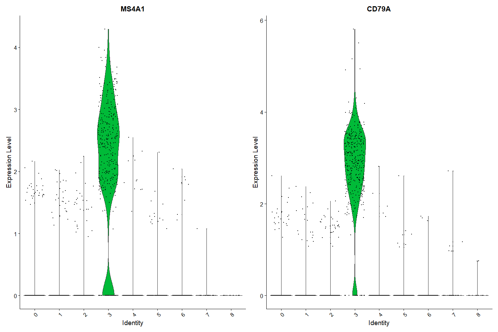<!-- -->


``` r
# you can plot raw counts as well
VlnPlot(pbmc, features = c("NKG7", "PF4"), slot = "counts", log = TRUE)
```

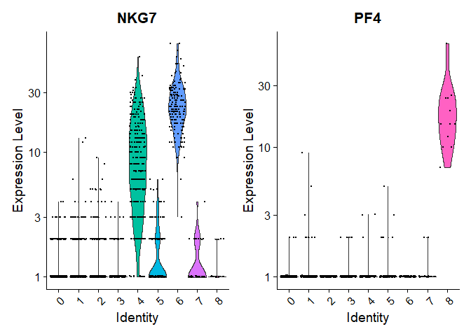<!-- -->


``` r
FeaturePlot(pbmc, features = c("MS4A1", "GNLY", "CD3E", "CD14", "FCER1A", "FCGR3A", "LYZ", "PPBP",
    "CD8A"))
```

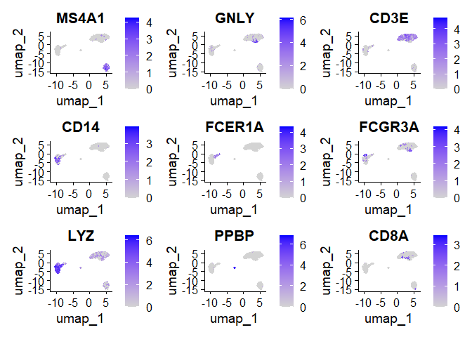<!-- -->


`DoHeatmap()` generates an expression heatmap for given cells and features. In this case, we are plotting the top 20 markers (or all markers if less than 20) for each cluster.


``` r
pbmc.markers %>%
    group_by(cluster) %>%
    top_n(n = 10, wt = avg_log2FC) -> top10

# DoHeatmap doesn't automatically use the correct slot/layer anymore. need to figure out to
# make this occur automatically.
DefaultLayer(pbmc[["RNA"]]) <- "scale.data"
DoHeatmap(pbmc, features = top10$gene) + NoLegend()
```

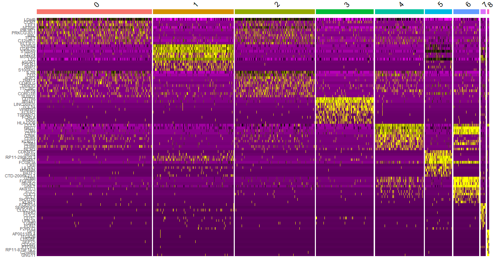<!-- -->

***
# Assigning cell type identity to clusters

Fortunately in the case of this dataset, we can use canonical markers to easily match the unbiased clustering to known cell types:

Cluster ID | Markers       | Cell Type
-----------|---------------|----------
0          | IL7R, CCR7    | Naive CD4+ T 
1          | CD14, LYZ     | CD14+ Mono
2          | IL7R, S100A4  | Memory CD4+ 
3          | MS4A1         | B 
4          | CD8A          | CD8+ T 
5          | FCGR3A, MS4A7 | FCGR3A+ Mono
6          | GNLY, NKG7    | NK 
7          | FCER1A, CST3  | DC
8          | PPBP          | Platelet


``` r
new.cluster.ids <- c("Naive CD4 T", "CD14+ Mono", "Memory CD4 T", "B", "CD8 T", "FCGR3A+ Mono",
    "NK", "DC", "Platelet")
names(new.cluster.ids) <- levels(pbmc)
pbmc <- RenameIdents(pbmc, new.cluster.ids)
DimPlot(pbmc, reduction = "umap", label = TRUE, pt.size = 0.5) + NoLegend()
```

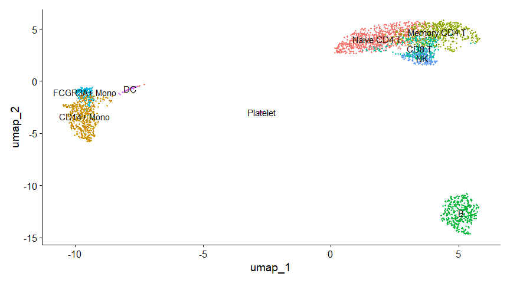<!-- -->


``` r
library(ggplot2)
plot <- DimPlot(pbmc, reduction = "umap", label = TRUE, label.size = 4.5) + xlab("UMAP 1") + ylab("UMAP 2") +
    theme(axis.title = element_text(size = 18), legend.text = element_text(size = 18)) + guides(colour = guide_legend(override.aes = list(size = 10)))
ggsave(filename = "./output/images/pbmc3k_umap.jpg", height = 7, width = 12, plot = plot, quality = 50)
```


``` r
plot
```

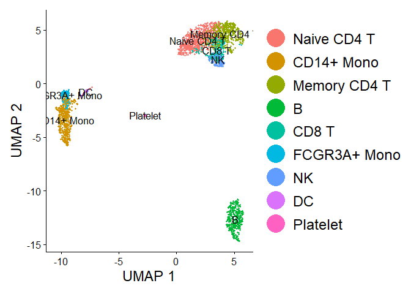<!-- -->


``` r
saveRDS(pbmc, file = "./output/pbmc3k_final.rds")
```


``` r
saveRDS(pbmc, file = "./data/pbmc3k_final.rds")
```


``` r
write.csv(x = t(as.data.frame(all_times)), file = "./output/timings/seurat5_pbmc3k_tutorial_times.csv")
```

<details>
  <summary>**Session Info**</summary>

``` r
sessionInfo()
```

```
## R version 4.5.1 (2025-06-13 ucrt)
## Platform: x86_64-w64-mingw32/x64
## Running under: Windows 11 x64 (build 22631)
## 
## Matrix products: default
##   LAPACK version 3.12.1
## 
## locale:
## [1] LC_COLLATE=English_United Kingdom.utf8 
## [2] LC_CTYPE=English_United Kingdom.utf8   
## [3] LC_MONETARY=English_United Kingdom.utf8
## [4] LC_NUMERIC=C                           
## [5] LC_TIME=English_United Kingdom.utf8    
## 
## time zone: Europe/London
## tzcode source: internal
## 
## attached base packages:
## [1] stats     graphics  grDevices utils     datasets  methods   base     
## 
## other attached packages:
## [1] plotly_4.11.0      ggplot2_4.0.0      future_1.67.0      patchwork_1.3.2   
## [5] Seurat_5.3.0       SeuratObject_5.2.0 sp_2.2-0           dplyr_1.1.4       
## 
## loaded via a namespace (and not attached):
##   [1] RColorBrewer_1.1-3     rstudioapi_0.17.1      jsonlite_2.0.0        
##   [4] magrittr_2.0.4         spatstat.utils_3.2-0   ggbeeswarm_0.7.2      
##   [7] farver_2.1.2           rmarkdown_2.30         ragg_1.5.0            
##  [10] vctrs_0.6.5            ROCR_1.0-11            spatstat.explore_3.5-3
##  [13] htmltools_0.5.8.1      sass_0.4.10            sctransform_0.4.2     
##  [16] parallelly_1.45.1      KernSmooth_2.23-26     bslib_0.9.0           
##  [19] htmlwidgets_1.6.4      ica_1.0-3              plyr_1.8.9            
##  [22] zoo_1.8-14             cachem_1.1.0           igraph_2.1.4          
##  [25] mime_0.13              lifecycle_1.0.4        pkgconfig_2.0.3       
##  [28] Matrix_1.7-4           R6_2.6.1               fastmap_1.2.0         
##  [31] fitdistrplus_1.2-4     shiny_1.11.1           digest_0.6.37         
##  [34] tensor_1.5.1           RSpectra_0.16-2        irlba_2.3.5.1         
##  [37] textshaping_1.0.3      crosstalk_1.2.2        labeling_0.4.3        
##  [40] progressr_0.16.0       spatstat.sparse_3.1-0  httr_1.4.7            
##  [43] polyclip_1.10-7        abind_1.4-8            compiler_4.5.1        
##  [46] withr_3.0.2            S7_0.2.0               fastDummies_1.7.5     
##  [49] R.utils_2.13.0         MASS_7.3-65            tools_4.5.1           
##  [52] vipor_0.4.7            lmtest_0.9-40          beeswarm_0.4.0        
##  [55] httpuv_1.6.16          future.apply_1.20.0    goftest_1.2-3         
##  [58] R.oo_1.27.1            glue_1.8.0             nlme_3.1-168          
##  [61] promises_1.3.3         grid_4.5.1             Rtsne_0.17            
##  [64] cluster_2.1.8.1        reshape2_1.4.4         generics_0.1.4        
##  [67] gtable_0.3.6           spatstat.data_3.1-8    R.methodsS3_1.8.2     
##  [70] tidyr_1.3.1            data.table_1.17.8      utf8_1.2.6            
##  [73] spatstat.geom_3.6-0    RcppAnnoy_0.0.22       ggrepel_0.9.6         
##  [76] RANN_2.6.2             pillar_1.11.1          stringr_1.5.2         
##  [79] spam_2.11-1            RcppHNSW_0.6.0         limma_3.65.4          
##  [82] later_1.4.4            splines_4.5.1          lattice_0.22-7        
##  [85] survival_3.8-3         deldir_2.0-4           tidyselect_1.2.1      
##  [88] miniUI_0.1.2           pbapply_1.7-4          knitr_1.50            
##  [91] gridExtra_2.3          scattermore_1.2        xfun_0.53             
##  [94] statmod_1.5.0          matrixStats_1.5.0      stringi_1.8.7         
##  [97] lazyeval_0.2.2         yaml_2.3.10            evaluate_1.0.5        
## [100] codetools_0.2-20       tibble_3.3.0           cli_3.6.5             
## [103] uwot_0.2.3             systemfonts_1.2.3      xtable_1.8-4          
## [106] reticulate_1.43.0      jquerylib_0.1.4        dichromat_2.0-0.1     
## [109] Rcpp_1.1.0             globals_0.18.0         spatstat.random_3.4-2 
## [112] png_0.1-8              ggrastr_1.0.2          spatstat.univar_3.1-4 
## [115] parallel_4.5.1         presto_1.0.0           dotCall64_1.2         
## [118] listenv_0.9.1          viridisLite_0.4.2      scales_1.4.0          
## [121] ggridges_0.5.7         purrr_1.1.0            rlang_1.1.6           
## [124] cowplot_1.2.0          formatR_1.14
```
</details>
