``` r
library(Seurat)
```

```
## Loading required package: SeuratObject
```

```
## Loading required package: sp
```

```
## 
## Attaching package: 'SeuratObject'
```

```
## The following objects are masked from 'package:base':
## 
##     intersect, t
```

``` r
library(SeuratExtend)
```

```
## Loading required package: SeuratExtendData
```

``` r
set.seed(2025)
```


## Quick Start-Up Guide {#quick-start-up-guide}

This quick start-up guide provides an overview of the most frequently used functions in single-cell RNA sequencing (scRNA-seq) analysis. After running the standard Seurat pipeline (refer to this [Seurat pbmc3k tutorial](https://satijalab.org/seurat/articles/pbmc3k_tutorial)), you should have a Seurat object ready for further analysis. Below, we illustrate the use of a subset of the pbmc dataset as an example to demonstrate various functionalities of the `SeuratExtend` package.


``` r
pbmc <- readRDS("./output/pbmc3k_final.rds")
```


``` r
pbmc$cluster <- Idents(pbmc)
```


### Visualizing Clusters


``` r
# Visualizing cell clusters using DimPlot2
DimPlot2(pbmc, theme = theme_umap_arrows())
```

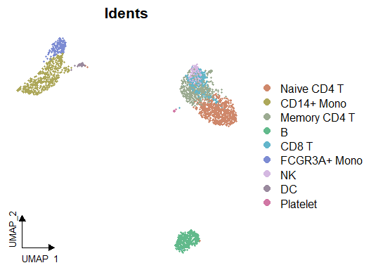<!-- -->

### Analyzing Cluster Distribution

To check the percentage of each cluster within different samples:


``` r
colnames(pbmc@meta.data)
```

```
## [1] "orig.ident"      "nCount_RNA"      "nFeature_RNA"    "percent.mt"     
## [5] "RNA_snn_res.0.5" "seurat_clusters" "cluster"
```


``` r
summary(pbmc$cluster)
```

```
##  Naive CD4 T   CD14+ Mono Memory CD4 T            B        CD8 T FCGR3A+ Mono 
##          692          483          449          342          313          159 
##           NK           DC     Platelet 
##          154           32           14
```


``` r
# Cluster distribution bar plot
ClusterDistrBar(pbmc$orig.ident, pbmc$cluster)
```

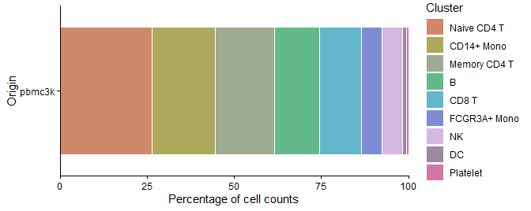<!-- -->

### Marker Gene Analysis with Heatmap

To examine the marker genes of each cluster and visualize them using a heatmap:


``` r
# Calculating z-scores for variable features
genes.zscore <- CalcStats(
  pbmc,
  features = VariableFeatures(pbmc),
  group.by = "cluster",
  order = "p",
  n = 4)
  
# Displaying heatmap
Heatmap(genes.zscore, lab_fill = "zscore")
```

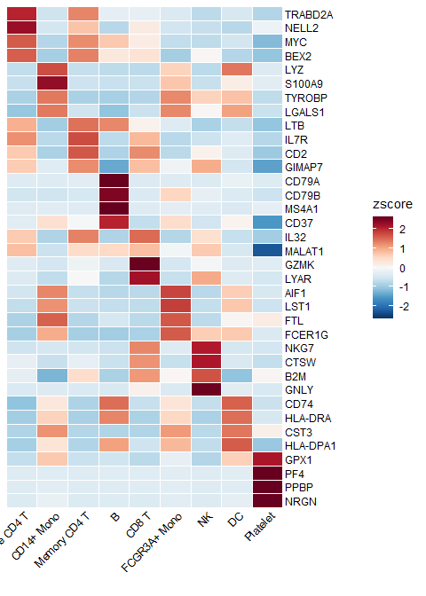<!-- -->

### Enhanced Dot Plots (New in v1.1.0)


``` r
# Create grouped features
grouped_features <- list(
  "B_cell_markers" = c("MS4A1", "CD79A"),
  "T_cell_markers" = c("CD3D", "CD8A", "IL7R"),
  "Myeloid_markers" = c("CD14", "FCGR3A", "S100A8")
)

DotPlot2(pbmc, features = grouped_features)
```

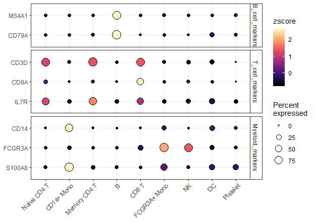<!-- -->

### Enhanced Visualization of Marker Genes

For visualizing specific markers via a violin plot that incorporates box plots, median lines, and performs statistical testing:


``` r
levels(Idents(pbmc))
```

```
## [1] "Naive CD4 T"  "CD14+ Mono"   "Memory CD4 T" "B"            "CD8 T"       
## [6] "FCGR3A+ Mono" "NK"           "DC"           "Platelet"
```


``` r
# Specifying genes and cells of interest
genes <- c("CD3D", "CD14", "CD79A")
cells <- WhichCells(pbmc, idents = c("B", "CD8 T", "CD14+ Mono"))

# Violin plot with statistical analysis
VlnPlot2(
  pbmc,
  features = genes,
  group.by = "cluster",
  cells = cells,
  stat.method = "wilcox.test")
```

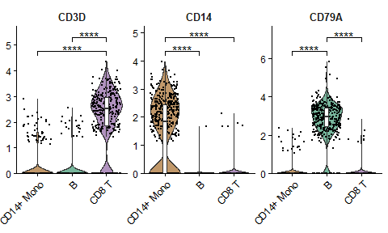<!-- -->

### Visualizing Multiple Markers on UMAP

Displaying three markers on a single UMAP, using RYB coloring for each marker:


``` r
FeaturePlot3(pbmc, feature.1 = "CD3D", feature.2 = "CD14", feature.3 = "CD79A", pt.size = 1)
```

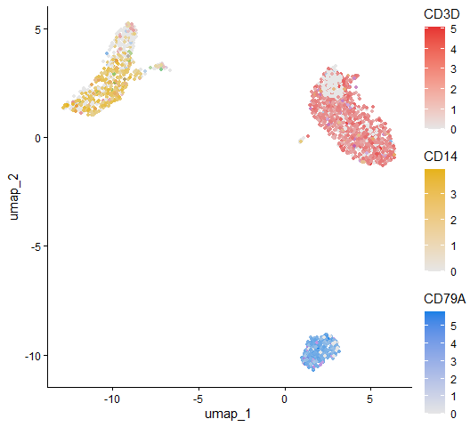<!-- -->

### Create Volcano Plots (New in v1.1.0)

Create a basic volcano plot comparing two cell types:


``` r
VolcanoPlot(pbmc, 
            ident.1 = "B",
            ident.2 = "CD8 T")
```

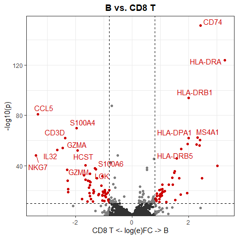<!-- -->

- ident.1 ("B cell") → the "test group": genes more expressed in this group will appear on the right side of the volcano.

- ident.2 ("CD8 T cell") → the "reference group": genes more expressed in this group will appear on the left side.

> The function internally runs differential expression analysis (like FindMarkers() in Seurat) and then visualizes the results.

#### Interpreting the volcano plot

* X-axis = log fold change (log2FC)

Positive (right): genes higher in B cells

Negative (left): genes higher in CD8 T cells

* Y-axis = –log10(p-value)

Higher = more statistically significant

* Each point = one gene

- Genes at the top are strongly significant

- Genes far left or far right are strongly differentially expressed between the two cell types

So, the "classic" volcano shape shows:

* Left side = genes up in CD8 T cells

* Right side = genes up in B cells

* Middle = not significantly different


### Conducting Geneset Enrichment Analysis (GSEA)

Examining all the pathways of the immune process in the Gene Ontology (GO) database, and visualizing by a heatmap that displays the top pathways of each cluster across multiple cell types:


``` r
options(spe = "human")
pbmc <- GeneSetAnalysisGO(pbmc, parent = "immune_system_process", n.min = 5)
matr <- RenameGO(pbmc@misc$AUCell$GO$immune_system_process)
go_zscore <- CalcStats(
  matr,
  f = pbmc$cluster,
  order = "p",
  n = 3)
Heatmap(go_zscore, lab_fill = "zscore")
```

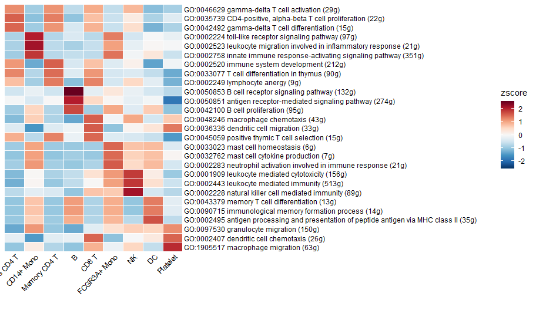<!-- -->

### Detailed Comparison of Two Cell Types

Using a GSEA plot to focus on a specific pathway for deeper comparative analysis:


``` r
GSEAplot(
  pbmc,
  ident.1 = "B",
  ident.2 = "CD8 T",
  title = "GO:0042113 B cell activation (335g)",
  geneset = GO_Data$human$GO2Gene[["GO:0042113"]])
```

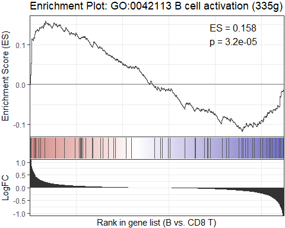<!-- -->

> That command is generating a Gene Set Enrichment Analysis (GSEA) plot to visualize whether a particular biological pathway (in this case, B cell activation) is enriched in one cell type versus another.

### Importing and Visualizing SCENIC Analysis

After conducting Gene Regulatory Networks Analysis using pySCENIC, import the output and visualize various aspects within Seurat:


``` r
# # Downloading a pre-computed SCENIC loom file
# scenic_loom_path <- file.path(tempdir(), "pyscenic_integrated-output.loom")
# download.file("https://zenodo.org/records/10944066/files/pbmc3k_small_pyscenic_integrated-output.loom", scenic_loom_path, mode = "wb")
# 
# # Importing SCENIC Loom Files into Seurat
# pbmc <- ImportPyscenicLoom(scenic_loom_path, seu = pbmc)
# 
# # Visualizing variables such as cluster, gene expression, and SCENIC regulon activity with customized colors
# DimPlot2(
#   pbmc,
#   features = c("cluster", "orig.ident", "CEBPA", "tf_CEBPA"),
#   cols = list("tf_CEBPA" = "OrRd"),
#   theme = NoAxes()
# ) + theme_umap_arrows()
```


``` r
# # Creating a waterfall plot to compare regulon activity between cell types
# DefaultAssay(pbmc) <- "TF"
# WaterfallPlot(
#   pbmc,
#   features = rownames(pbmc),
#   ident.1 = "Mono CD14",
#   ident.2 = "CD8 T cell",
#   exp.transform = FALSE,
#   top.n = 20)
```

### Trajectory Analysis with Palantir in R

Trajectory analysis helps identify developmental pathways and transitions between different cell states. In this section, we demonstrate how to perform trajectory analysis using the Palantir algorithm on a subset of myeloid cells, integrating everything within the R environment.

#### Download and Prepare the Data

First, we download a small subset of myeloid cells to illustrate the analysis:


``` r
# Download the example Seurat Object with myeloid cells
mye_small <- readRDS(url("https://zenodo.org/records/10944066/files/pbmc10k_mye_small_velocyto.rds", "rb"))
```

#### Diffusion Map Calculation

Palantir uses diffusion maps for dimensionality reduction to infer trajectories. Here's how to compute and visualize them:


``` r
# Compute diffusion map
mye_small <- Palantir.RunDM(mye_small, n_components = 20)

# Visualize the first two diffusion map dimensions
DimPlot2(mye_small, reduction = "ms")
```

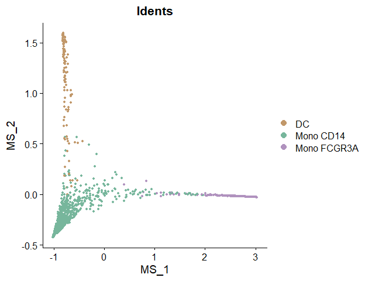<!-- -->

#### Pseudotime Calculation

Pseudotime ordering assigns each cell a time point in a trajectory, indicating its progression along a developmental path:


``` r
# Calculate pseudotime with a specified start cell
mye_small <- Palantir.Pseudotime(mye_small, start_cell = "sample1_GAGAGGTAGCAGTACG-1")
```

```
## Sampling and flocking waypoints...
## Time for determining waypoints: 0.0006499687830607096 minutes
## Determining pseudotime...
## Shortest path distances using 30-nearest neighbor graph...
## Time for shortest paths: 0.011342140038808186 minutes
## Iteratively refining the pseudotime...
## Correlation at iteration 1: 1.0000
## Entropy and branch probabilities...
## Markov chain construction...
## Identification of terminal states...
## Computing fundamental matrix and absorption probabilities...
## Project results to all cells...
```


``` r
# Store pseudotime results in meta.data for easy plotting
ps <- mye_small@misc$Palantir$Pseudotime
colnames(ps)[3:4] <- c("fate1", "fate2")
mye_small@meta.data[,colnames(ps)] <- ps

# Visualize pseudotime and cell fates
DimPlot2(
  mye_small,
  features = colnames(ps),
  reduction = "ms",
  cols = list(continuous = "A", Entropy = "D"),
  theme = NoAxes())
```

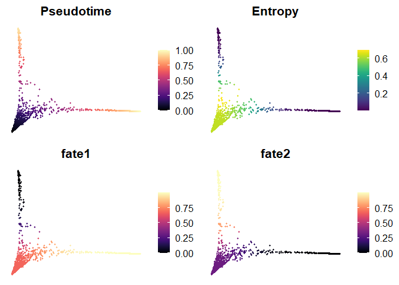<!-- -->


#### Visualization Along Trajectories

Visualizing gene expression or regulon activity along calculated trajectories can provide insights into dynamic changes:


``` r
# Create smoothed gene expression curves along trajectory
GeneTrendCurve.Palantir(
  mye_small,
  pseudotime.data = ps,
  features = c("CD14", "FCGR3A")
)
```

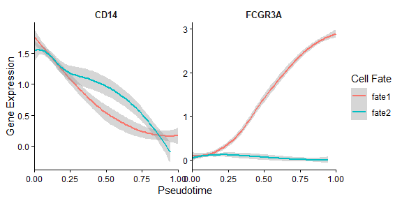<!-- -->


``` r
# Create a gene trend heatmap for different fates
GeneTrendHeatmap.Palantir(
  mye_small,
  features = VariableFeatures(mye_small)[1:10],
  pseudotime.data = ps,
  lineage = "fate1"
)
```

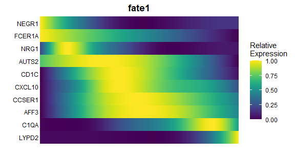<!-- -->

### scVelo Analysis

scVelo is a Python tool used for RNA velocity analysis. We demonstrate how to integrate and analyze velocyto-generated data within the Seurat workflow using scVelo.

#### Preparing for scVelo

First, download the pre-calculated velocyto loom file:


``` r
# Download velocyto loom file
loom_path <- file.path(tempdir(), "pbmc10k_mye_small.loom")
download.file("https://zenodo.org/records/10944066/files/pbmc10k_mye_small.loom", 
              loom_path,
              mode = "wb")  # Use binary mode for Windows compatibility

# Set up the path for saving the AnnData object in the HDF5 (h5ad) format
if (.Platform$OS.type == "windows") {
    adata_path <- normalizePath(file.path(tempdir(), "mye_small.h5ad"), winslash = "/")
} else {
    adata_path <- file.path(tempdir(), "mye_small.h5ad")
}

# Integrate Seurat Object and velocyto loom into an AnnData object
scVelo.SeuratToAnndata(
  mye_small,
  filename = adata_path,
  velocyto.loompath = loom_path,
  prefix = "sample1_",
  postfix = "-1"
)
```

```
## scVelo version: 0.3.0
## Filtered out 10891 genes that are detected 20 counts (shared).
## Normalized count data: X, spliced, unspliced.
## Extracted 2000 highly variable genes.
## Logarithmized X.
## computing neighbors
##     finished (0:00:00) --> added 
##     'distances' and 'connectivities', weighted adjacency matrices (adata.obsp)
## computing moments based on connectivities
##     finished (0:00:00) --> added 
##     'Ms' and 'Mu', moments of un/spliced abundances (adata.layers)
## computing velocities
##     finished (0:00:00) --> added 
##     'velocity', velocity vectors for each individual cell (adata.layers)
## computing velocity graph (using 1/16 cores)
##   0%|          | 0/1000 [00:00<?, ?cells/s]
##     finished (0:00:01) --> added 
##     'velocity_graph', sparse matrix with cosine correlations (adata.uns)
```

```
## NULL
```

#### Plotting scVelo Results

Once the data is processed, visualize the RNA velocity:


``` r
# Plot RNA velocity
scVelo.Plot(color = "cluster", basis = "ms_cell_embeddings", 
            save = "quick_start_scvelo.png", figsize = c(5,4))
```

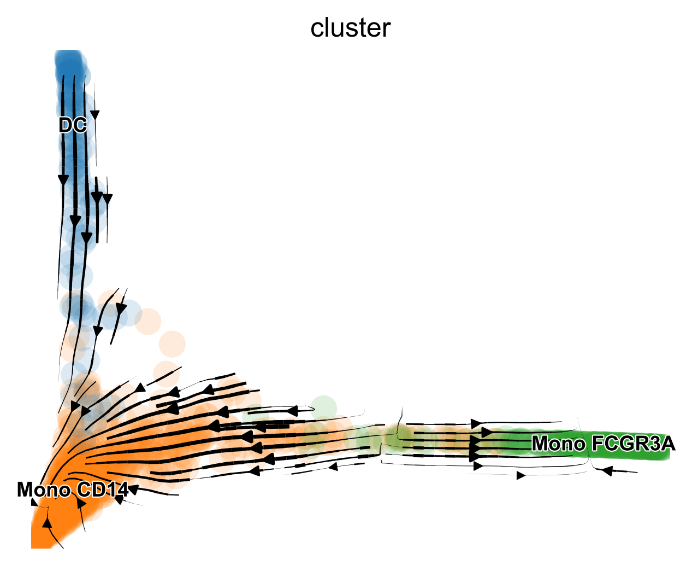{width=700px}
