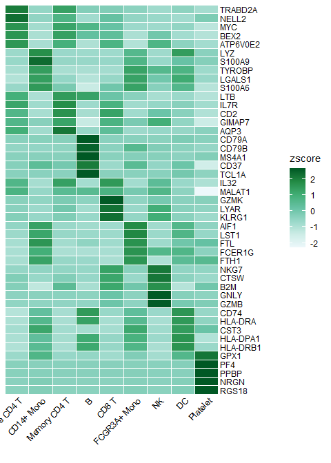
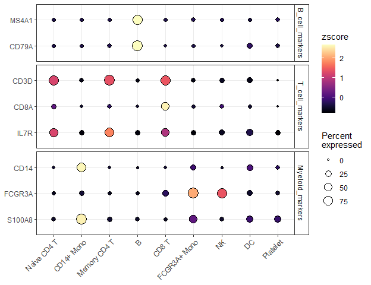
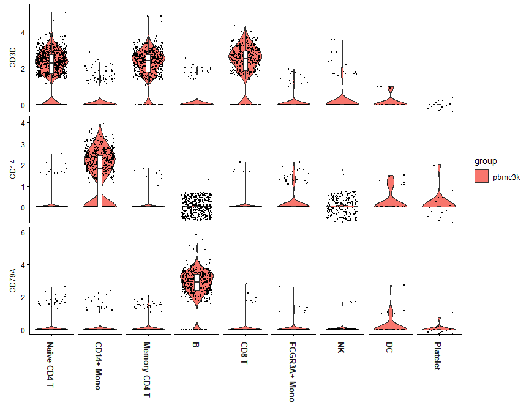
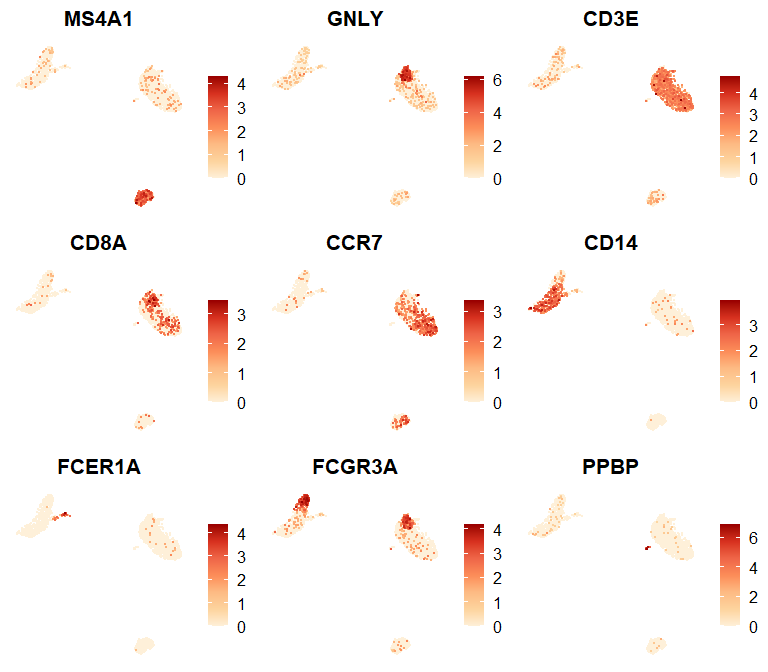
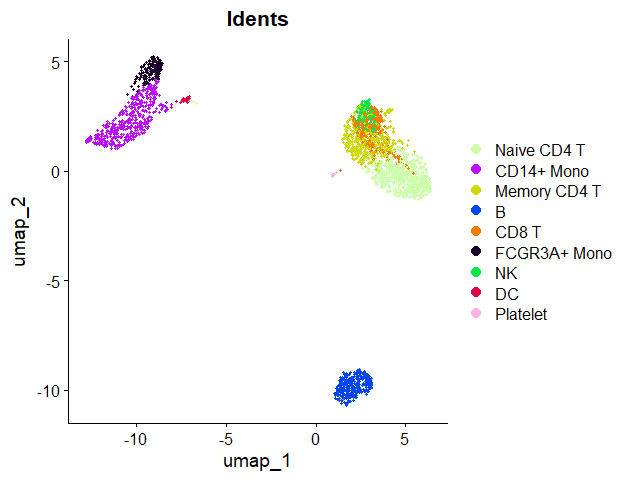

## Table of Contents

1. [Create an Enhanced Dimensional Reduction Plot](#create-an-enhanced-dimensional-reduction-plot)
2. [Generate a Heatmap Plot](#generate-a-heatmap-plot)
3. [Create Enhanced Dot Plots](#create-enhanced-dot-plots-new-in-v110) (New in v1.1.0)
4. [Create an Enhanced Violin Plot](#create-an-enhanced-violin-plot)
5. [Visualize Cluster Distribution in Samples](#visualize-cluster-distribution-in-samples)
6. [Generate a Waterfall Plot](#generate-a-waterfall-plot)
7. [Create Volcano Plots](#create-volcano-plots-new-in-v110) (New in v1.1.0)
8. [Explore Color Functions](#explore-color-functions)

## Create an Enhanced Dimensional Reduction Plot {#create-an-enhanced-dimensional-reduction-plot}


``` r
library(Seurat)
```

```
## Loading required package: SeuratObject
```

```
## Loading required package: sp
```

```
## 
## Attaching package: 'SeuratObject'
```

```
## The following objects are masked from 'package:base':
## 
##     intersect, t
```

``` r
library(SeuratExtend)
```

```
## Loading required package: SeuratExtendData
```

``` r
set.seed(2025)
```


``` r
pbmc <- readRDS("./output/pbmc3k_final.rds")
```


``` r
pbmc$cluster <- Idents(pbmc)
```

### Introduction

In Seurat, dimension reduction plots such as UMAP are typically created using `DimPlot` for discrete variables and `FeaturePlot` for continuous variables. `SeuratExtend` simplifies this process with `DimPlot2`, which automatically handles both types of variables without requiring different functions. The function retains most of the usage conventions of both `DimPlot` and `FeaturePlot` while introducing numerous additional parameters for enhanced customization.

### Basic Usage

To generate a basic dimension reduction plot, simply call `DimPlot2` with your Seurat object:


``` r
DimPlot2(pbmc)
```

<!-- -->

### Visualizing Different Variables

`DimPlot2` can handle both discrete and continuous variables seamlessly. Here's how to input different variables into the plot:


``` r
DimPlot2(pbmc, features = c("cluster", "orig.ident", "CD14", "CD3D"))
```

<!-- -->

**Note**: Starting from v1.1.0, the default color scheme for continuous variables has changed from viridis "A" to RColorBrewer "Blues". This change was made because the previous viridis-A series used black for low expression and red-yellow for high expression, which could be visually problematic - black tends to be too eye-catching while yellow can be hard to see against a white background. The new default uses light blue for low expression and deep blue for high expression, providing better visual clarity. If you prefer the previous color scheme, simply set `cols = "A"` in your function call.


``` r
DimPlot2(pbmc, features = c("CD14", "CD3D"), cols = "A")
```

<!-- -->

### Splitting by Variable

You can split the visualization by a specific variable, which is particularly useful for comparative analysis across conditions or identities:


``` r
DimPlot2(pbmc, features = c("cluster", "CD14"), split.by = "orig.ident", ncol = 1)
```

<!-- -->

### Highlighting Specific Cells

To highlight cells of interest, such as a specific cluster, you can define the cells explicitly and use them in your plot:


``` r
b_cells <- colnames(pbmc)[pbmc$cluster == "B"]
DimPlot2(pbmc, cells.highlight = b_cells)
```

<!-- -->

### Advanced Customization

For each variable, you can specify custom colors and adjust themes. For detailed information on color customization, refer to the [Explore Color Functions](#explore-color-functions) section:


``` r
DimPlot2(
  pbmc,
  features = c("cluster", "orig.ident", "CD14", "CD3D"),
  cols = list(
    "cluster" = "default", # dark theme
    "CD14" = "D",
    "CD3D" = "OrRd"
  ))
```

<!-- -->

### Adding Labels and Boxes

To further enhance the plot, you can add labels and bounding boxes to clearly delineate different groups or points of interest:


``` r
DimPlot2(pbmc, label = TRUE, box = TRUE, label.color = "black", repel = TRUE, theme = NoLegend())
```

<!-- -->

### Simplifying Labels with Indices

For plots with lengthy cluster names, you can use indices to create cleaner visualizations:


``` r
DimPlot2(pbmc, index.title = "C", box = TRUE, label.color = "black")
```

<!-- -->

### Adding UMAP Arrows (New in v1.1.0)

Starting from v1.1.0, you can add simplified axis indicators to your dimension reduction plots using the `theme_umap_arrows` function. This is particularly useful for UMAP or t-SNE plots where traditional axes are often removed to reduce visual clutter:


``` r
# Add simplified axis indicators
DimPlot2(
  pbmc, 
  features = c("cluster", "orig.ident", "CD14", "CD3D"),
  theme = NoAxes()
) + theme_umap_arrows()
```

<!-- -->

The `theme_umap_arrows` function provides several parameters for customization:

- `anchor_x/y`: Position of the arrow origin
- `line_length`: Length of the arrow lines
- `arrow_length`: Size of arrowheads
- `text_offset_x/y`: Position of axis labels
- `text_size`: Font size for labels
- `line_width`: Width of arrow lines
- `x_label/y_label`: Custom axis labels

### Multiple Feature Visualization

When visualizing multiple features simultaneously, you might want to add arrows to each subplot:


``` r
# Add arrows to each subplot
DimPlot2(
  pbmc, 
  features = c("cluster", "orig.ident", "CD14", "CD3D"),
  theme = theme_umap_arrows()
)
```

<!-- -->

### Simultaneous Display of Three Features on a Dimension Reduction Plot

In `SeuratExtend`, a unique visualization method allows for the simultaneous display of three features on the same dimension reduction plot. The functions `FeaturePlot3` and `FeaturePlot3.grid` employ a color mixing system (either RYB or RGB) to represent three different genes (or other continuous variables). This method uses the principles of color mixing to quantitatively display the expression levels or intensities of these three features in each cell.

#### RYB and RGB Color Systems

In the RGB system, black represents no or low expression, and brighter colors indicate higher levels:
{width=500px}

In the RYB system, white represents no expression, and deeper colors indicate higher expression levels:
{width=500px}

#### Examples Using RYB and RGB Systems

Here's how to display three markers using the RYB system, with red for CD3D, yellow for CD14, and blue for CD79A:

``` r
FeaturePlot3(pbmc, color = "ryb", feature.1 = "CD3D", feature.2 = "CD14", feature.3 = "CD79A", pt.size = 0.5)
```

<!-- -->

For the RGB system, with red for CD3D, green for CD14, and blue for CD79A:

``` r
FeaturePlot3(pbmc, color = "rgb", feature.1 = "CD3D", feature.2 = "CD14", feature.3 = "CD79A", pt.size = 1)
```

<!-- -->

#### Using Dark Theme (New in v1.2.0)

For improved visualization in presentations or in low-light environments, you can use the dark theme option:


``` r
FeaturePlot3(
  pbmc, 
  color = "rgb", 
  feature.1 = "CD3D", 
  feature.2 = "CD14", 
  feature.3 = "CD79A", 
  pt.size = 1,
  dark.theme = TRUE
)
```

<!-- -->

This dark theme provides better contrast for visualizing gene expression patterns, particularly when using the RGB color system where brighter colors represent higher expression levels.

#### Batch Visualization with `FeaturePlot3.grid`

`FeaturePlot3.grid` extends `FeaturePlot3` by allowing multiple plots to be generated in one go. The `features` parameter requires a vector where every three values are assigned a color (RYB or RGB) and placed together in one plot. If you wish to skip a color, use `NA` as a placeholder.

For instance, to place the following five genes into two plots using the RYB system, and skip yellow in the second plot:


``` r
DefaultAssay(pbmc) <- "RNA"

genes <- c("CD3D", "CD14", "CD79A", "FCGR3A", "LYZ")
setdiff(genes, rownames(pbmc))  # should print character(0)
```

```
## character(0)
```


``` r
DefaultAssay(pbmc)
```

```
## [1] "RNA"
```

``` r
sapply(c("CD3D","CD14","CD79A","FCGR3A","LYZ"), \(g) g %in% rownames(pbmc))
```

```
##   CD3D   CD14  CD79A FCGR3A    LYZ 
##   TRUE   TRUE   TRUE   TRUE   TRUE
```

``` r
sessionInfo()$otherPkgs[c("Seurat","SeuratObject","SeuratExtend")]
```

```
## $Seurat
## Package: Seurat
## Version: 5.3.0
## Title: Tools for Single Cell Genomics
## Description: A toolkit for quality control, analysis, and exploration
##         of single cell RNA sequencing data. 'Seurat' aims to enable
##         users to identify and interpret sources of heterogeneity from
##         single cell transcriptomic measurements, and to integrate
##         diverse types of single cell data. See Satija R, Farrell J,
##         Gennert D, et al (2015) <doi:10.1038/nbt.3192>, Macosko E, Basu
##         A, Satija R, et al (2015) <doi:10.1016/j.cell.2015.05.002>,
##         Stuart T, Butler A, et al (2019)
##         <doi:10.1016/j.cell.2019.05.031>, and Hao, Hao, et al (2020)
##         <doi:10.1101/2020.10.12.335331> for more details.
## Authors@R: c( person(given = "Andrew", family = "Butler", email =
##         "abutler@nygenome.org", role = "ctb", comment = c(ORCID =
##         "0000-0003-3608-0463")), person(given = "Saket", family =
##         "Choudhary", email = "schoudhary@nygenome.org", role = "ctb",
##         comment = c(ORCID = "0000-0001-5202-7633")), person(given =
##         'David', family = 'Collins', email = 'dcollins@nygenome.org',
##         role = 'ctb', comment = c(ORCID = '0000-0001-9243-7821')),
##         person(given = "Charlotte", family = "Darby", email =
##         "cdarby@nygenome.org", role = "ctb", comment = c(ORCID =
##         "0000-0003-2195-5300")), person(given = "Jeff", family =
##         "Farrell", email = "jfarrell@g.harvard.edu", role = "ctb"),
##         person(given = "Isabella", family = "Grabski", email =
##         "igrabski@nygenome.org", role = "ctb", comment = c(ORCID =
##         "0000-0002-0616-5469")), person(given = "Christoph", family =
##         "Hafemeister", email = "chafemeister@nygenome.org", role =
##         "ctb", comment = c(ORCID = "0000-0001-6365-8254")),
##         person(given = "Yuhan", family = "Hao", email =
##         "yhao@nygenome.org", role = "ctb", comment = c(ORCID =
##         "0000-0002-1810-0822")), person(given = "Austin", family =
##         "Hartman", email = "ahartman@nygenome.org", role = "ctb",
##         comment = c(ORCID = "0000-0001-7278-1852")), person(given =
##         "Paul", family = "Hoffman", email = "hoff0792@umn.edu", role =
##         "ctb", comment = c(ORCID = "0000-0002-7693-8957")),
##         person(given = "Jaison", family = "Jain", email =
##         "jjain@nygenome.org", role = "ctb", comment = c(ORCID =
##         "0000-0002-9478-5018")), person(given = "Longda", family =
##         "Jiang", email = "ljiang@nygenome.org", role = "ctb", comment =
##         c(ORCID = "0000-0003-4964-6497")), person(given = "Madeline",
##         family = "Kowalski", email = "mkowalski@nygenome.org", role =
##         "ctb", comment = c(ORCID = "0000-0002-5655-7620")),
##         person(given = "Skylar", family = "Li", email =
##         "sli@nygenome.org", role = "ctb"), person(given = "Gesmira",
##         family = "Molla", email = 'gmolla@nygenome.org', role = 'ctb',
##         comment = c(ORCID = '0000-0002-8628-5056')), person(given =
##         "Efthymia", family = "Papalexi", email =
##         "epapalexi@nygenome.org", role = "ctb", comment = c(ORCID =
##         "0000-0001-5898-694X")), person(given = "Patrick", family =
##         "Roelli", email = "proelli@nygenome.org", role = "ctb"),
##         person(given = "Rahul", family = "Satija", email =
##         "seurat@nygenome.org", role = c("aut", "cre"), comment =
##         c(ORCID = "0000-0001-9448-8833")), person(given = "Karthik",
##         family = "Shekhar", email = "kshekhar@berkeley.edu", role =
##         "ctb"), person(given = "Avi", family = "Srivastava", email =
##         "asrivastava@nygenome.org", role = "ctb", comment = c(ORCID =
##         "0000-0001-9798-2079")), person(given = "Tim", family =
##         "Stuart", email = "tstuart@nygenome.org", role = "ctb", comment
##         = c(ORCID = "0000-0002-3044-0897")), person(given = "Kristof",
##         family = "Torkenczy", email = "", role = "ctb", comment =
##         c(ORCID = "0000-0002-4869-7957")), person(given = "Shiwei",
##         family = "Zheng", email = "szheng@nygenome.org", role = "ctb",
##         comment = c(ORCID = "0000-0001-6682-6743")), person("Satija Lab
##         and Collaborators", role = "fnd") )
## License: MIT + file LICENSE
## URL: https://satijalab.org/seurat, https://github.com/satijalab/seurat
## BugReports: https://github.com/satijalab/seurat/issues
## Additional_repositories: https://satijalab.r-universe.dev,
##         https://bnprks.r-universe.dev
## Depends: R (>= 4.0.0), methods, SeuratObject (>= 5.0.2)
## Imports: cluster, cowplot, fastDummies, fitdistrplus, future,
##         future.apply, generics (>= 0.1.3), ggplot2 (>= 3.3.0), ggrepel,
##         ggridges, graphics, grDevices, grid, httr, ica, igraph, irlba,
##         jsonlite, KernSmooth, leidenbase, lifecycle, lmtest, MASS,
##         Matrix (>= 1.5-0), matrixStats, miniUI, patchwork, pbapply,
##         plotly (>= 4.9.0), png, progressr, RANN, RColorBrewer, Rcpp (>=
##         1.0.7), RcppAnnoy (>= 0.0.18), RcppHNSW, reticulate, rlang,
##         ROCR, RSpectra, Rtsne, scales, scattermore (>= 1.2),
##         sctransform (>= 0.4.1), shiny, spatstat.explore, spatstat.geom,
##         stats, tibble, tools, utils, uwot (>= 0.1.10)
## Suggests: ape, arrow, Biobase, BiocGenerics, BPCells, data.table,
##         DESeq2, DelayedArray, enrichR, GenomicRanges, GenomeInfoDb,
##         glmGamPoi, ggrastr, harmony, hdf5r, IRanges, limma, MAST,
##         metap, mixtools, monocle, presto, rsvd, R.utils, Rfast2,
##         rtracklayer, S4Vectors, sf (>= 1.0.0), SingleCellExperiment,
##         SummarizedExperiment, testthat, VGAM
## LinkingTo: Rcpp (>= 0.11.0), RcppEigen, RcppProgress
## BuildManual: true
## Encoding: UTF-8
## LazyData: true
## RoxygenNote: 7.3.2
## Collate: 'RcppExports.R' 'reexports.R' 'generics.R' 'clustering.R'
##         .....
## NeedsCompilation: yes
## Packaged: 2025-04-23 19:32:38 UTC; root
## Author: Andrew Butler [ctb] (<https://orcid.org/0000-0003-3608-0463>),
##         Saket Choudhary [ctb]
##         (<https://orcid.org/0000-0001-5202-7633>), David Collins [ctb]
##         (<https://orcid.org/0000-0001-9243-7821>), Charlotte Darby
##         [ctb] (<https://orcid.org/0000-0003-2195-5300>), Jeff Farrell
##         [ctb], Isabella Grabski [ctb]
##         (<https://orcid.org/0000-0002-0616-5469>), Christoph
##         Hafemeister [ctb] (<https://orcid.org/0000-0001-6365-8254>),
##         Yuhan Hao [ctb] (<https://orcid.org/0000-0002-1810-0822>),
##         Austin Hartman [ctb] (<https://orcid.org/0000-0001-7278-1852>),
##         Paul Hoffman [ctb] (<https://orcid.org/0000-0002-7693-8957>),
##         Jaison Jain [ctb] (<https://orcid.org/0000-0002-9478-5018>),
##         Longda Jiang [ctb] (<https://orcid.org/0000-0003-4964-6497>),
##         Madeline Kowalski [ctb]
##         (<https://orcid.org/0000-0002-5655-7620>), Skylar Li [ctb],
##         Gesmira Molla [ctb] (<https://orcid.org/0000-0002-8628-5056>),
##         Efthymia Papalexi [ctb]
##         (<https://orcid.org/0000-0001-5898-694X>), Patrick Roelli
##         [ctb], Rahul Satija [aut, cre]
##         (<https://orcid.org/0000-0001-9448-8833>), Karthik Shekhar
##         [ctb], Avi Srivastava [ctb]
##         (<https://orcid.org/0000-0001-9798-2079>), Tim Stuart [ctb]
##         (<https://orcid.org/0000-0002-3044-0897>), Kristof Torkenczy
##         [ctb] (<https://orcid.org/0000-0002-4869-7957>), Shiwei Zheng
##         [ctb] (<https://orcid.org/0000-0001-6682-6743>), Satija Lab and
##         Collaborators [fnd]
## Maintainer: Rahul Satija <seurat@nygenome.org>
## Repository: CRAN
## Date/Publication: 2025-04-23 22:10:02 UTC
## Built: R 4.5.0; x86_64-w64-mingw32; 2025-06-27 03:12:13 UTC; windows
## Archs: x64
## 
## -- File: C:/Users/myj23/AppData/Local/Programs/R/R-4.5.1/library/Seurat/Meta/package.rds 
## 
## $SeuratObject
## Package: SeuratObject
## Title: Data Structures for Single Cell Data
## Version: 5.2.0
## Authors@R: c( person(given = 'Paul', family = 'Hoffman', email =
##         'hoff0792@alumni.umn.edu', role = 'aut', comment = c(ORCID =
##         '0000-0002-7693-8957')), person(given = 'Rahul', family =
##         'Satija', email = 'seurat@nygenome.org', role = c('aut',
##         'cre'), comment = c(ORCID = '0000-0001-9448-8833')),
##         person(given = 'David', family = 'Collins', email =
##         'dcollins@nygenome.org', role = 'aut', comment = c(ORCID =
##         '0000-0001-9243-7821')), person(given = "Yuhan", family =
##         "Hao", email = 'yhao@nygenome.org', role = 'aut', comment =
##         c(ORCID = '0000-0002-1810-0822')), person(given = "Austin",
##         family = "Hartman", email = 'ahartman@nygenome.org', role =
##         'aut', comment = c(ORCID = '0000-0001-7278-1852')),
##         person(given = "Gesmira", family = "Molla", email =
##         'gmolla@nygenome.org', role = 'aut', comment = c(ORCID =
##         '0000-0002-8628-5056')), person(given = 'Andrew', family =
##         'Butler', email = 'abutler@nygenome.org', role = 'aut', comment
##         = c(ORCID = '0000-0003-3608-0463')), person(given = 'Tim',
##         family = 'Stuart', email = 'tstuart@nygenome.org', role =
##         'aut', comment = c(ORCID = '0000-0002-3044-0897')),
##         person(given = "Madeline", family = "Kowalski", email =
##         "mkowalski@nygenome.org", role = "ctb", comment = c(ORCID =
##         "0000-0002-5655-7620")), person(given = "Saket", family =
##         "Choudhary", email = "schoudhary@nygenome.org", role = "ctb",
##         comment = c(ORCID = "0000-0001-5202-7633")), person(given =
##         "Skylar", family = "Li", email = "sli@nygenome.org", role =
##         "ctb"), person(given = "Longda", family = "Jiang", email =
##         "ljiang@nygenome.org", role = "ctb", comment = c(ORCID =
##         "0000-0003-4964-6497")), person(given = "Anagha", family =
##         "Shenoy", email = "ashenoy@nygenome.org", role = "ctb", comment
##         = c(ORCID = "0000-0002-0537-6862")), person(given = 'Jeff',
##         family = 'Farrell', email = 'jfarrell@g.harvard.edu', role =
##         'ctb'), person(given = 'Shiwei', family = 'Zheng', email =
##         'szheng@nygenome.org', role = 'ctb', comment = c(ORCID =
##         '0000-0001-6682-6743')), person(given = 'Christoph', family =
##         'Hafemeister', email = 'chafemeister@nygenome.org', role =
##         'ctb', comment = c(ORCID = '0000-0001-6365-8254')),
##         person(given = 'Patrick', family = 'Roelli', email =
##         'proelli@nygenome.org', role = 'ctb') )
## Description: Defines S4 classes for single-cell genomic data and
##         associated information, such as dimensionality reduction
##         embeddings, nearest-neighbor graphs, and spatially-resolved
##         coordinates. Provides data access methods and R-native hooks to
##         ensure the Seurat object is familiar to other R users. See
##         Satija R, Farrell J, Gennert D, et al (2015)
##         <doi:10.1038/nbt.3192>, Macosko E, Basu A, Satija R, et al
##         (2015) <doi:10.1016/j.cell.2015.05.002>, and Stuart T, Butler
##         A, et al (2019) <doi:10.1016/j.cell.2019.05.031>, Hao Y, Hao S,
##         et al (2021) <doi:10.1016/j.cell.2021.04.048> and Hao Y, et al
##         (2023) <doi:10.1101/2022.02.24.481684> for more details.
## License: MIT + file LICENSE
## URL: https://satijalab.github.io/seurat-object/,
##         https://github.com/satijalab/seurat-object
## BugReports: https://github.com/satijalab/seurat-object/issues
## Additional_repositories: https://bnprks.r-universe.dev
## Depends: R (>= 4.1.0), sp (>= 1.5.0)
## Imports: future, future.apply, generics, grDevices, grid, lifecycle,
##         Matrix (>= 1.6.4), methods, progressr, Rcpp (>= 1.0.5), rlang
##         (>= 0.4.7), spam, stats, tools, utils
## Suggests: BPCells, DelayedArray, fs (>= 1.5.2), sf (>= 1.0.0), ggplot2,
##         HDF5Array, rmarkdown, testthat
## LinkingTo: Rcpp, RcppEigen
## Config/Needs/website: pkgdown
## BuildManual: true
## Encoding: UTF-8
## LazyData: true
## RoxygenNote: 7.3.2
## Collate: 'RcppExports.R' 'zzz.R' 'generics.R' 'keymixin.R' 'graph.R'
##         .....
## NeedsCompilation: yes
## Packaged: 2025-08-27 21:37:49 UTC; root
## Author: Paul Hoffman [aut] (ORCID:
##         <https://orcid.org/0000-0002-7693-8957>), Rahul Satija [aut,
##         cre] (ORCID: <https://orcid.org/0000-0001-9448-8833>), David
##         Collins [aut] (ORCID: <https://orcid.org/0000-0001-9243-7821>),
##         Yuhan Hao [aut] (ORCID:
##         <https://orcid.org/0000-0002-1810-0822>), Austin Hartman [aut]
##         (ORCID: <https://orcid.org/0000-0001-7278-1852>), Gesmira Molla
##         [aut] (ORCID: <https://orcid.org/0000-0002-8628-5056>), Andrew
##         Butler [aut] (ORCID: <https://orcid.org/0000-0003-3608-0463>),
##         Tim Stuart [aut] (ORCID:
##         <https://orcid.org/0000-0002-3044-0897>), Madeline Kowalski
##         [ctb] (ORCID: <https://orcid.org/0000-0002-5655-7620>), Saket
##         Choudhary [ctb] (ORCID:
##         <https://orcid.org/0000-0001-5202-7633>), Skylar Li [ctb],
##         Longda Jiang [ctb] (ORCID:
##         <https://orcid.org/0000-0003-4964-6497>), Anagha Shenoy [ctb]
##         (ORCID: <https://orcid.org/0000-0002-0537-6862>), Jeff Farrell
##         [ctb], Shiwei Zheng [ctb] (ORCID:
##         <https://orcid.org/0000-0001-6682-6743>), Christoph Hafemeister
##         [ctb] (ORCID: <https://orcid.org/0000-0001-6365-8254>), Patrick
##         Roelli [ctb]
## Maintainer: Rahul Satija <seurat@nygenome.org>
## Repository: CRAN
## Date/Publication: 2025-08-27 22:30:01 UTC
## Built: R 4.5.1; x86_64-w64-mingw32; 2025-09-24 01:57:49 UTC; windows
## Archs: x64
## 
## -- File: C:/Users/myj23/AppData/Local/Programs/R/R-4.5.1/library/SeuratObject/Meta/package.rds 
## 
## $SeuratExtend
## Package: SeuratExtend
## Type: Package
## Title: SeuratExtend
## Version: 1.2.5
## Author: Yichao Hua
## Maintainer: Yichao Hua <yichao.hua@uk-essen.de>
## Description: SeuratExtend is an R package designed to improve and
##         simplify the analysis of scRNA-seq data using the Seurat
##         object. It provides an array of enhanced visualization tools,
##         an integrated functional and pathway analysis pipeline,
##         seamless integration with popular Python tools, and a suite of
##         utility functions to aid in data manipulation and presentation.
## License: GPL (>= 3)
## Encoding: UTF-8
## LazyData: true
## RoxygenNote: 7.3.2
## VignetteBuilder: knitr
## Imports: Seurat, dplyr, remotes, rlist, mosaic, ggplot2, reshape2,
##         purrr, magrittr, tidyr, scales, ggpubr, BiocManager,
##         reticulate, glue, hdf5r
## Suggests: rgl, GSVA, GSVAdata, slingshot, AUCell, biomaRt,
##         ontologyIndex, viridis, doMC, doRNG, doParallel, foreach, mgsa,
##         GSEABase, egg, loomR, mgsa, knitr, rmarkdown, RColorBrewer
## Depends: R (>= 3.6), SeuratExtendData, SeuratObject
## Remotes: huayc09/SeuratExtendData
## Collate: 'AUCell_basic.R' 'Anndata.R' 'generics.R' 'CalcStats.R' .....
## RemoteType: github
## RemoteHost: api.github.com
## RemoteRepo: SeuratExtend
## RemoteUsername: huayc09
## RemoteRef: HEAD
## RemoteSha: 5dacd7c1e1da3bc0e78ab81d60056f6d7da3d386
## GithubRepo: SeuratExtend
## GithubUsername: huayc09
## GithubRef: HEAD
## GithubSHA1: 5dacd7c1e1da3bc0e78ab81d60056f6d7da3d386
## NeedsCompilation: no
## Packaged: 2025-09-29 18:17:19 UTC; myj23
## Built: R 4.5.1; ; 2025-09-29 18:17:24 UTC; windows
## 
## -- File: C:/Users/myj23/AppData/Local/Programs/R/R-4.5.1/library/SeuratExtend/Meta/package.rds
```


``` r
DefaultAssay(pbmc)
```

```
## [1] "RNA"
```

``` r
setdiff(c("CD3D","CD14","CD79A","FCGR3A","LYZ","NKG7"), rownames(pbmc))
```

```
## character(0)
```


``` r
p1 <- FeaturePlot3(pbmc, feature.1 = "CD3D", feature.2 = "CD14", feature.3 = "CD79A",
                   color = "ryb", pt.size = 0.5)

p2 <- FeaturePlot3(pbmc, feature.1 = "FCGR3A", feature.2 = "LYZ", feature.3 = "RPLP0",
                   color = "ryb", pt.size = 0.5)

p1 + p2 # patchwork
```

<!-- -->


``` r
library(patchwork)
```

```
## 
## Attaching package: 'patchwork'
```

```
## The following object is masked from 'package:cowplot':
## 
##     align_plots
```

``` r
library(grid)    # for unit()

# collect legends, move to bottom, add margins, prevent clipping
(p1 + p2) +
  plot_layout(guides = "collect") &
  theme(
    legend.position = "bottom",
    legend.justification = c(0.5, 0),
    legend.box.margin = margin(t = 4, r = 20, b = 12, l = 20),
    legend.key.width  = unit(12, "mm"),
    legend.key.height = unit(4,  "mm"),
    plot.margin = margin(t = 10, r = 30, b = 30, l = 10)
  ) &
  coord_cartesian(clip = "off")
```

```
## Coordinate system already present.
## ℹ Adding new coordinate system, which will replace the existing one.
```

```
## Coordinate system already present.
## ℹ Adding new coordinate system, which will replace the existing one.
```

<!-- -->


Using the RGB system:

``` r
# FeaturePlot3.grid(
#   pbmc,
#   features = c("CD3D","CD14","CD79A",   # panel 1
#                "FCGR3A","LYZ","RPLP0"), # panel 2 (unique 3rd)
#   color = "rgb",
#   pt.size = 0.5
# )
```

#### Using Dark Theme with Grid Layout (New in v1.2.0)

You can also apply the dark theme to FeaturePlot3.grid for enhanced visualization:


``` r
# FeaturePlot3.grid(
#   pbmc,
#   features = c("CD3D", "CD14", "CD79A", "FCGR3A", "RPLP0", "LYZ"),
#   color = "rgb",
#   pt.size = 1,
#   dark.theme = TRUE,
#   legend = TRUE
# )
```

The dark theme with legend enabled provides an elegant visualization that works well in presentations and publications.

#### Tips on Point Size

The background is usually white, so the choice of color system and point size can significantly affect visual perception. In the RYB system, where higher expression results in darker colors, a smaller `pt.size` is preferable to prevent overlapping points. In contrast, in the RGB system, higher expressions result in lighter colors, potentially leading to visibility issues for highly expressed cells that may blend into the white background. Here, a larger `pt.size` is recommended so that the darker, low-expression points can form a "background" to highlight the lighter, high-expression points.

## Generate a Heatmap Plot {#generate-a-heatmap-plot}

### Introduction

The `Heatmap` function provides a flexible and comprehensive way to visualize matrices, especially those produced by the `CalcStats` function. While heatmaps are excellent for visualizing overall patterns across multiple groups and features, they represent average expression levels through color intensity.

**Note:** Starting from v1.1.0, the default color scheme has changed from `c(low = muted("blue"), mid = "white", high = muted("red"))` to `"BuRd"`. This change was made to provide more vibrant visualization using RColorBrewer palettes. To revert to the previous color scheme, simply set `color_scheme = c(low = muted("blue"), mid = "white", high = muted("red"))`.

### Basic Usage

First, let's generate a sample matrix using the `CalcStats` function:


``` r
# Calculate z-scores for variable features
genes <- VariableFeatures(pbmc)
toplot <- CalcStats(pbmc, features = genes, method = "zscore", order = "p", n = 5)
```

> Calculate Matrix Statistics Grouped by Clusters
Computes various statistics (mean, median, zscore, tscore, etc.) on a matrix, grouped by clusters.

> CalcStats(object, ...)

Now, we can produce a basic heatmap:


``` r
# Create a basic heatmap
Heatmap(toplot, lab_fill = "zscore")
```

<!-- -->

### Adjusting Color Schemes

The `color_scheme` parameter allows for flexibility in visualizing data. Here are some ways to change the color theme of your heatmap:


``` r
# Viridis-A theme
Heatmap(toplot, lab_fill = "zscore", color_scheme = "A")
```

<!-- -->


``` r
# White - blue - dark green
Heatmap(toplot, lab_fill = "zscore", color_scheme = "BuGn")
```

<!-- -->

For detailed information on color customization, refer to the [Explore Color Functions](#explore-color-functions) section.

### Modifying Axis and Labels

Sometimes, the first name on the x-axis might be too long and exceed the left boundary of the plot. To prevent this issue and ensure all labels are fully visible, you can increase the space on the left side of the plot by adjusting the `plot.margin` parameter. For example, to add more space, you can specify a larger value for the left margin (`l`) like this:


``` r
Heatmap(toplot, lab_fill = "zscore", plot.margin = margin(l = 50))
```

<!-- -->

For dense matrices with many features, you might want to show only a subset of gene names:


``` r
toplot2 <- CalcStats(pbmc, features = genes[1:500], method = "zscore", order = "p")
Heatmap(toplot2, lab_fill = "zscore", feature_text_subset = genes[1:20], expand_limits_x = c(-0.5, 11))
```

<!-- -->

### Faceting the Heatmap

You can split the heatmap based on gene groups:


``` r
gene_groups <- sample(c("group1", "group2", "group3"), nrow(toplot2), replace = TRUE)
Heatmap(toplot2, lab_fill = "zscore", facet_row = gene_groups) +
  theme(axis.text.y = element_blank())
```

<!-- -->

## Create Enhanced Dot Plots (New in v1.1.0) {#create-enhanced-dot-plots-new-in-v110} 

### Introduction

While heatmaps are excellent for visualizing overall patterns, dot plots offer a complementary visualization that combines two key pieces of information:

1. The percentage of cells expressing each feature (represented by dot size)

2. The average expression level in expressing cells (represented by color intensity)

This dual representation can provide more detailed insights than a standard heatmap, particularly when expression patterns vary between cell populations.

### Basic Usage

Let's create a basic dot plot for some variable features:


``` r
# Select some variable features
genes <- VariableFeatures(pbmc)[1:10]
genes
```

```
##  [1] "PPBP"   "LYZ"    "S100A9" "IGLL5"  "GNLY"   "FTL"    "PF4"    "FTH1"  
##  [9] "GNG11"  "S100A8"
```

``` r
DotPlot2(pbmc, features = genes)
```

<!-- -->

### Grouped Features

You can organize features into groups for clearer visualization:


``` r
# Create grouped features
grouped_features <- list(
  "B_cell_markers" = c("MS4A1", "CD79A"),
  "T_cell_markers" = c("CD3D", "CD8A", "IL7R"),
  "Myeloid_markers" = c("CD14", "FCGR3A", "S100A8")
)
grouped_features
```

```
## $B_cell_markers
## [1] "MS4A1" "CD79A"
## 
## $T_cell_markers
## [1] "CD3D" "CD8A" "IL7R"
## 
## $Myeloid_markers
## [1] "CD14"   "FCGR3A" "S100A8"
```

``` r
DotPlot2(pbmc, features = grouped_features)
```

<!-- -->

### Split Visualization

You can split the visualization by a metadata column to compare expression patterns across different conditions:


``` r
# Basic split visualization
DotPlot2(
  pbmc,
  features = genes,
  group.by = "cluster",
  split.by = "orig.ident",
  show_grid = FALSE
)
```

<!-- -->

### Alternative Split Visualization

The split groups can be represented either by border colors (default) or by dot colors:


``` r
# Using colors instead of borders for split groups
DotPlot2(
  pbmc,
  features = genes,
  group.by = "cluster",
  split.by = "orig.ident",
  split.by.method = "color",
  show_grid = FALSE
)
```

<!-- -->

### Customizing Appearance

You can customize various aspects of the plot, including color schemes, dot sizes, and grid lines:


``` r
DotPlot2(
  pbmc,
  features = grouped_features,
  color_scheme = "BuRd",
  border = FALSE,
  # Remove dot borders
  show_grid = FALSE,
  # Remove grid lines
  flip = TRUE
)          # Flip coordinates
```

<!-- -->

## Create an Enhanced Violin Plot {#create-an-enhanced-violin-plot}

### Introduction

The `VlnPlot2` function offers a revamped version of the traditional violin plot, designed to be more space-efficient while introducing additional visualization features. Unlike the original `VlnPlot` in Seurat, this enhanced version integrates boxplots, statistical annotations, and greater flexibility in plot presentation.

### Basic Usage

Let's start with some common gene markers:


``` r
library(Seurat)
library(SeuratExtend)

genes <- c("CD3D","CD14","CD79A")
VlnPlot2(pbmc, features = genes, ncol = 1)
```

<!-- -->

### Customizing Plot Elements

You can create different variations of the plot by adjusting its components. For instance, you might want to show only the box plot with quasirandom point distribution:


``` r
VlnPlot2(pbmc, features = genes, violin = FALSE, pt.style = "quasirandom", ncol = 1)
```

<!-- -->

### Managing Point Display

For cleaner visualization, you can hide individual points while still showing outliers:


``` r
VlnPlot2(pbmc, features = genes, pt = FALSE, ncol = 1)
```

<!-- -->

Or hide both points and outliers for a minimal appearance:


``` r
VlnPlot2(pbmc, features = genes, pt = FALSE, hide.outlier = TRUE, ncol = 1)
```

<!-- -->

### Outline Style (New in v1.2.0)

You can change the violin plot style from filled to outline:


``` r
VlnPlot2(pbmc, features = genes, style = "outline", ncol = 1)
```

<!-- -->

### Adding Mean and Median Lines (New in v1.1.0)

For genes with low expression where boxplot might be hard to interpret (e.g., when median and quartiles overlap at zero), you can add mean/median lines for better visualization:


``` r
lowExprGenes <- c("CCR7", "IL7R", "TCF7")
VlnPlot2(pbmc, 
         features = lowExprGenes, 
         show.mean = TRUE,      # Show mean and median lines
         mean_colors = c("red", "blue"),  # Colors for mean and median
         cols = "light",        # Light color scheme for better visibility
         ncol = 1)
```

<!-- -->

### Split Visualization

You can group by cluster and split each cluster by samples:


``` r
VlnPlot2(pbmc,
         features = genes,
         group.by = "cluster",
         split.by = "orig.ident")
```

<!-- -->

### Subset Analysis

You can focus on specific cell types and arrange plots in columns:


``` r
cells <- colnames(pbmc)[pbmc$cluster %in% c("B", "CD14+ Mono", "CD8 T")]
VlnPlot2(pbmc,
         features = genes,
         group.by = "cluster",
         cells = cells)
```

<!-- -->

### Statistical Analysis

Add statistical annotations using the Wilcoxon test, hiding non-significant results:


``` r
VlnPlot2(
  pbmc,
  features = genes,
  group.by = "cluster",
  cells = cells,
  stat.method = "wilcox.test",
  hide.ns = TRUE
)
```

<!-- -->

Or specify particular comparisons using t-test:


``` r
VlnPlot2(
  pbmc,
  features = genes,
  group.by = "cluster",
  cells = cells,
  stat.method = "t.test",
  comparisons = list(c(1, 2), c(1, 3)),
  hide.ns = FALSE
)
```

<!-- -->

### Using Matrix Input

You can also use `VlnPlot2` with matrices, such as AUCell scores from gene set enrichment analysis:


``` r
# Perform gene set analysis
pbmc <- GeneSetAnalysis(pbmc, genesets = hall50$human)
matr <- pbmc@misc$AUCell$genesets

# Plot the first three pathways
VlnPlot2(matr[1:3, ], f = pbmc$cluster, ncol = 1)
```

<!-- -->

> **Note on Statistical Testing:** When using `stat.method` to add statistical annotations to violin plots, be aware that p-values can be artificially inflated in large single-cell datasets due to the high number of cells. This may result in statistically significant differences (small p-values) even when the biological effect size is minimal. We recommend being cautious with statistical interpretations, especially when visual differences are subtle. Consider examining log fold changes (logFC) between groups to better assess the magnitude of biological differences. Additionally, the percentage of cells expressing a marker (similar to the pct.1 and pct.2 values in Seurat's FindMarkers) is an important metric - if the difference in percentage between groups is minimal, the expression difference may be biologically negligible despite a significant p-value. Parameters like min.pct in differential expression analysis can help filter out features with low expression prevalence. For a comprehensive visualization of differences between two groups, `WaterfallPlot()` (see [Generate a Waterfall Plot](#generate-a-waterfall-plot)) can provide logFC values along with statistical significance. By default, `VlnPlot2` uses the Holm method (`p.adjust.method = "holm"`) to adjust p-values for multiple comparisons.

## Visualize Cluster Distribution in Samples {#visualize-cluster-distribution-in-samples}

### Introduction

The `ClusterDistrBar` function visualizes how clusters are distributed across different samples. It can show both absolute counts and proportions, with various customization options.

### Basic Usage

Create a basic bar plot showing cluster distribution within samples:


``` r
ClusterDistrBar(origin = pbmc$orig.ident, cluster = pbmc$cluster)
```

<!-- -->

### Absolute Cell Counts

To show absolute cell counts instead of proportions:


``` r
ClusterDistrBar(
  origin = pbmc$orig.ident,
  cluster = pbmc$cluster,
  percent = FALSE
)
```

<!-- -->

### Normalized Proportions with Reversed Axes

For normalized data with reversed axes:


``` r
# ClusterDistrBar(origin = pbmc$orig.ident, cluster = pbmc$cluster, rev = TRUE, normalize = TRUE)
```

### Vertical Orientation

Create a vertical bar plot:


``` r
ClusterDistrBar(
  origin = pbmc$orig.ident,
  cluster = pbmc$cluster,
  flip = FALSE,
  reverse_order = FALSE
)
```

<!-- -->

### Non-Stacked Display

Show bars side by side instead of stacked:


``` r
ClusterDistrBar(
  origin = pbmc$orig.ident,
  cluster = pbmc$cluster,
  flip = FALSE,
  stack = FALSE
)
```

<!-- -->

### Comparing Cluster Distribution Between Conditions (New in v1.2.0)

For comparing cluster distribution patterns between experimental conditions, `SeuratExtend` offers the `ClusterDistrPlot` function. This function extends `ClusterDistrBar` functionality by adding the ability to group samples by a condition variable, creating boxplots grouped by condition instead of stacked bars.

The function supports all parameters from `ClusterDistrBar` when using the standard bar plot mode, and inherits styling options from `VlnPlot2` when using the boxplot mode with conditions. This makes it highly versatile for different visualization needs.


``` r
# # Compare cluster distribution between conditions
# ClusterDistrPlot(
#   origin = pbmc$sample_id,
#   cluster = pbmc$cluster,
#   condition = pbmc$condition
# )
```

When the `condition` parameter is not provided, `ClusterDistrPlot` behaves exactly like `ClusterDistrBar`, providing seamless backward compatibility.

## Generate a Waterfall Plot {#generate-a-waterfall-plot}

### Introduction

Waterfall plots are powerful tools for visualizing differences between two conditions, effectively displaying metrics like gene expression differences or pathway enrichment scores. Note that starting from v1.1.0, similar to other visualization functions, the default color scheme has been updated to use more vibrant RColorBrewer palettes.

### Basic Usage

First, let's create a matrix using the `GeneSetAnalysis()` function:


``` r
pbmc <- GeneSetAnalysis(pbmc, genesets = hall50$human)
matr <- pbmc@misc$AUCell$genesets
str(matr)
```

```
##  num [1:48, 1:2638] 0.1016 0.09272 0.02363 0.00286 0.01119 ...
##  - attr(*, "dimnames")=List of 2
##   ..$ gene sets: chr [1:48] "HALLMARK_TNFA_SIGNALING_VIA_NFKB" "HALLMARK_HYPOXIA" "HALLMARK_CHOLESTEROL_HOMEOSTASIS" "HALLMARK_MITOTIC_SPINDLE" ...
##   ..$ cells    : chr [1:2638] "AAACATACAACCAC-1" "AAACATTGAGCTAC-1" "AAACATTGATCAGC-1" "AAACCGTGCTTCCG-1" ...
```

``` r
head(matr)
```

```
##                                      cells
## gene sets                             AAACATACAACCAC-1 AAACATTGAGCTAC-1
##   HALLMARK_TNFA_SIGNALING_VIA_NFKB          0.10159629       0.04688015
##   HALLMARK_HYPOXIA                          0.09271601       0.07950445
##   HALLMARK_CHOLESTEROL_HOMEOSTASIS          0.02363291       0.02902979
##   HALLMARK_MITOTIC_SPINDLE                  0.00285891       0.02724870
##   HALLMARK_WNT_BETA_CATENIN_SIGNALING       0.01118811       0.00987453
##   HALLMARK_TGF_BETA_SIGNALING               0.07726425       0.06485826
##                                      cells
## gene sets                             AAACATTGATCAGC-1 AAACCGTGCTTCCG-1
##   HALLMARK_TNFA_SIGNALING_VIA_NFKB          0.10751207      0.098260178
##   HALLMARK_HYPOXIA                          0.10450533      0.064294698
##   HALLMARK_CHOLESTEROL_HOMEOSTASIS          0.02597403      0.036915646
##   HALLMARK_MITOTIC_SPINDLE                  0.02228075      0.029563946
##   HALLMARK_WNT_BETA_CATENIN_SIGNALING       0.02799293      0.007156769
##   HALLMARK_TGF_BETA_SIGNALING               0.05094170      0.076300058
##                                      cells
## gene sets                             AAACCGTGTATGCG-1 AAACGCACTGGTAC-1
##   HALLMARK_TNFA_SIGNALING_VIA_NFKB          0.06215451       0.04642435
##   HALLMARK_HYPOXIA                          0.05130646       0.04301985
##   HALLMARK_CHOLESTEROL_HOMEOSTASIS          0.03178984       0.05253949
##   HALLMARK_MITOTIC_SPINDLE                  0.02802670       0.02054666
##   HALLMARK_WNT_BETA_CATENIN_SIGNALING       0.02359922       0.00000000
##   HALLMARK_TGF_BETA_SIGNALING               0.06382979       0.03914636
##                                      cells
## gene sets                             AAACGCTGACCAGT-1 AAACGCTGGTTCTT-1
##   HALLMARK_TNFA_SIGNALING_VIA_NFKB         0.044125919       0.07415094
##   HALLMARK_HYPOXIA                         0.046792905       0.08233718
##   HALLMARK_CHOLESTEROL_HOMEOSTASIS         0.009463023       0.02055250
##   HALLMARK_MITOTIC_SPINDLE                 0.026170747       0.02684564
##   HALLMARK_WNT_BETA_CATENIN_SIGNALING      0.019160212       0.01648775
##   HALLMARK_TGF_BETA_SIGNALING              0.049720383       0.03654304
##                                      cells
## gene sets                             AAACGCTGTAGCCA-1 AAACGCTGTTTCTG-1
##   HALLMARK_TNFA_SIGNALING_VIA_NFKB          0.06213511       0.06433656
##   HALLMARK_HYPOXIA                          0.08720336       0.03896470
##   HALLMARK_CHOLESTEROL_HOMEOSTASIS          0.03060696       0.05564455
##   HALLMARK_MITOTIC_SPINDLE                  0.01939372       0.02031232
##   HALLMARK_WNT_BETA_CATENIN_SIGNALING       0.02427866       0.00000000
##   HALLMARK_TGF_BETA_SIGNALING               0.04477084       0.06858649
##                                      cells
## gene sets                             AAACTTGAAAAACG-1 AAACTTGATCCAGA-1
##   HALLMARK_TNFA_SIGNALING_VIA_NFKB          0.05910934       0.07416064
##   HALLMARK_HYPOXIA                          0.05578476       0.06765636
##   HALLMARK_CHOLESTEROL_HOMEOSTASIS          0.04140072       0.04751226
##   HALLMARK_MITOTIC_SPINDLE                  0.01074200       0.01927187
##   HALLMARK_WNT_BETA_CATENIN_SIGNALING       0.00000000       0.01671423
##   HALLMARK_TGF_BETA_SIGNALING               0.06026226       0.04361381
##                                      cells
## gene sets                             AAAGAGACGAGATA-1 AAAGAGACGCGAGA-1
##   HALLMARK_TNFA_SIGNALING_VIA_NFKB          0.06721687       0.07379211
##   HALLMARK_HYPOXIA                          0.09908671       0.08827298
##   HALLMARK_CHOLESTEROL_HOMEOSTASIS          0.02841371       0.04440721
##   HALLMARK_MITOTIC_SPINDLE                  0.01708785       0.01385400
##   HALLMARK_WNT_BETA_CATENIN_SIGNALING       0.02935181       0.00000000
##   HALLMARK_TGF_BETA_SIGNALING               0.05296651       0.06685094
##                                      cells
## gene sets                             AAAGAGACGGACTT-1 AAAGAGACGGCATT-1
##   HALLMARK_TNFA_SIGNALING_VIA_NFKB          0.05238862       0.03518436
##   HALLMARK_HYPOXIA                          0.07191133       0.06360121
##   HALLMARK_CHOLESTEROL_HOMEOSTASIS          0.01350452       0.02728012
##   HALLMARK_MITOTIC_SPINDLE                  0.01995613       0.02378988
##   HALLMARK_WNT_BETA_CATENIN_SIGNALING       0.00000000       0.02224034
##   HALLMARK_TGF_BETA_SIGNALING               0.01105612       0.01738767
##                                      cells
## gene sets                             AAAGCAGATATCGG-1 AAAGCCTGTATGCG-1
##   HALLMARK_TNFA_SIGNALING_VIA_NFKB         0.111788894      0.079746688
##   HALLMARK_HYPOXIA                         0.116482716      0.094432103
##   HALLMARK_CHOLESTEROL_HOMEOSTASIS         0.070849454      0.000345006
##   HALLMARK_MITOTIC_SPINDLE                 0.009157887      0.021821454
##   HALLMARK_WNT_BETA_CATENIN_SIGNALING      0.000000000      0.015853603
##   HALLMARK_TGF_BETA_SIGNALING              0.066272418      0.063669088
##                                      cells
## gene sets                             AAAGGCCTGTCTAG-1 AAAGTTTGATCACG-1
##   HALLMARK_TNFA_SIGNALING_VIA_NFKB          0.06930194      0.037647652
##   HALLMARK_HYPOXIA                          0.08241946      0.032182611
##   HALLMARK_CHOLESTEROL_HOMEOSTASIS          0.02767441      0.028512285
##   HALLMARK_MITOTIC_SPINDLE                  0.01095759      0.015147539
##   HALLMARK_WNT_BETA_CATENIN_SIGNALING       0.01617068      0.003125425
##   HALLMARK_TGF_BETA_SIGNALING               0.04084978      0.052130874
##                                      cells
## gene sets                             AAAGTTTGGGGTGA-1 AAAGTTTGTAGAGA-1
##   HALLMARK_TNFA_SIGNALING_VIA_NFKB          0.09992823       0.05840138
##   HALLMARK_HYPOXIA                          0.09661836       0.05908765
##   HALLMARK_CHOLESTEROL_HOMEOSTASIS          0.02954730       0.01877819
##   HALLMARK_MITOTIC_SPINDLE                  0.02086536       0.02231825
##   HALLMARK_WNT_BETA_CATENIN_SIGNALING       0.01155048       0.02618109
##   HALLMARK_TGF_BETA_SIGNALING               0.04682779       0.06096934
##                                      cells
## gene sets                             AAAGTTTGTAGCGT-1 AAATCAACAATGCC-1
##   HALLMARK_TNFA_SIGNALING_VIA_NFKB         0.088116066      0.050623582
##   HALLMARK_HYPOXIA                         0.074826334      0.061685297
##   HALLMARK_CHOLESTEROL_HOMEOSTASIS         0.060474630      0.006456542
##   HALLMARK_MITOTIC_SPINDLE                 0.008529864      0.021071576
##   HALLMARK_WNT_BETA_CATENIN_SIGNALING      0.005344929      0.018979028
##   HALLMARK_TGF_BETA_SIGNALING              0.055826959      0.064247606
##                                      cells
## gene sets                             AAATCAACACCAGT-1 AAATCAACCAGGAG-1
##   HALLMARK_TNFA_SIGNALING_VIA_NFKB          0.07305507       0.05357177
##   HALLMARK_HYPOXIA                          0.05805329       0.06447101
##   HALLMARK_CHOLESTEROL_HOMEOSTASIS          0.02124251       0.03388452
##   HALLMARK_MITOTIC_SPINDLE                  0.01015148       0.02086536
##   HALLMARK_WNT_BETA_CATENIN_SIGNALING       0.01526476       0.02260271
##   HALLMARK_TGF_BETA_SIGNALING               0.03239699       0.05418783
##                                      cells
## gene sets                             AAATCAACCCTATT-1 AAATCAACGGAAGC-1
##   HALLMARK_TNFA_SIGNALING_VIA_NFKB          0.10412747      0.078670210
##   HALLMARK_HYPOXIA                          0.11688235      0.055596695
##   HALLMARK_CHOLESTEROL_HOMEOSTASIS          0.04490007      0.039207472
##   HALLMARK_MITOTIC_SPINDLE                  0.01773462      0.007901841
##   HALLMARK_WNT_BETA_CATENIN_SIGNALING       0.00000000      0.027766454
##   HALLMARK_TGF_BETA_SIGNALING               0.11380729      0.046570676
##                                      cells
## gene sets                             AAATCAACTCGCAA-1 AAATCATGACCACA-1
##   HALLMARK_TNFA_SIGNALING_VIA_NFKB          0.06165021      0.064569312
##   HALLMARK_HYPOXIA                          0.06959578      0.082478226
##   HALLMARK_CHOLESTEROL_HOMEOSTASIS          0.03970034      0.036718500
##   HALLMARK_MITOTIC_SPINDLE                  0.02076225      0.021915189
##   HALLMARK_WNT_BETA_CATENIN_SIGNALING       0.00000000      0.007655026
##   HALLMARK_TGF_BETA_SIGNALING               0.03365045      0.091437938
##                                      cells
## gene sets                             AAATCCCTCCACAA-1 AAATCCCTGCTATG-1
##   HALLMARK_TNFA_SIGNALING_VIA_NFKB          0.07492678       0.04044068
##   HALLMARK_HYPOXIA                          0.08220788       0.03827121
##   HALLMARK_CHOLESTEROL_HOMEOSTASIS          0.02092215       0.03117376
##   HALLMARK_MITOTIC_SPINDLE                  0.02064040       0.01498819
##   HALLMARK_WNT_BETA_CATENIN_SIGNALING       0.01567242       0.03166191
##   HALLMARK_TGF_BETA_SIGNALING               0.03892139       0.04766343
##                                      cells
## gene sets                             AAATGTTGAACGAA-1 AAATGTTGCCACAA-1
##   HALLMARK_TNFA_SIGNALING_VIA_NFKB         0.113272688       0.07600326
##   HALLMARK_HYPOXIA                         0.089695217       0.05250538
##   HALLMARK_CHOLESTEROL_HOMEOSTASIS         0.053500579       0.02323862
##   HALLMARK_MITOTIC_SPINDLE                 0.006730156       0.02276818
##   HALLMARK_WNT_BETA_CATENIN_SIGNALING      0.000000000       0.04067582
##   HALLMARK_TGF_BETA_SIGNALING              0.071993315       0.07035418
##                                      cells
## gene sets                             AAATGTTGTGGCAT-1 AAATTCGAAGGTTC-1
##   HALLMARK_TNFA_SIGNALING_VIA_NFKB         0.063667397      0.039897589
##   HALLMARK_HYPOXIA                         0.080679855      0.055255827
##   HALLMARK_CHOLESTEROL_HOMEOSTASIS         0.050789817      0.022696469
##   HALLMARK_MITOTIC_SPINDLE                 0.018250159      0.025027183
##   HALLMARK_WNT_BETA_CATENIN_SIGNALING      0.008334466      0.002536577
##   HALLMARK_TGF_BETA_SIGNALING              0.048338369      0.029632963
##                                      cells
## gene sets                             AAATTCGAATCACG-1 AAATTCGAGCTGAT-1
##   HALLMARK_TNFA_SIGNALING_VIA_NFKB         0.055724732       0.07541168
##   HALLMARK_HYPOXIA                         0.086157246       0.09762921
##   HALLMARK_CHOLESTEROL_HOMEOSTASIS         0.061780724       0.06362897
##   HALLMARK_MITOTIC_SPINDLE                 0.007039481       0.01985302
##   HALLMARK_WNT_BETA_CATENIN_SIGNALING      0.030801286       0.00000000
##   HALLMARK_TGF_BETA_SIGNALING              0.069647104       0.07736067
##                                      cells
## gene sets                             AAATTCGAGGAGTG-1 AAATTCGATTCTCA-1
##   HALLMARK_TNFA_SIGNALING_VIA_NFKB         0.070281436      0.087796032
##   HALLMARK_HYPOXIA                         0.056642806      0.102424862
##   HALLMARK_CHOLESTEROL_HOMEOSTASIS         0.036891003      0.052366988
##   HALLMARK_MITOTIC_SPINDLE                 0.007292565      0.009401597
##   HALLMARK_WNT_BETA_CATENIN_SIGNALING      0.019749060      0.011822258
##   HALLMARK_TGF_BETA_SIGNALING              0.048434788      0.032493411
##                                      cells
## gene sets                             AAATTGACACGACT-1 AAATTGACTCGCTC-1
##   HALLMARK_TNFA_SIGNALING_VIA_NFKB          0.08706868       0.12358167
##   HALLMARK_HYPOXIA                          0.08586339       0.11427295
##   HALLMARK_CHOLESTEROL_HOMEOSTASIS          0.03353952       0.05542276
##   HALLMARK_MITOTIC_SPINDLE                  0.02487721       0.01793146
##   HALLMARK_WNT_BETA_CATENIN_SIGNALING       0.03727862       0.01173167
##   HALLMARK_TGF_BETA_SIGNALING               0.06418333       0.06026226
##                                      cells
## gene sets                             AACAAACTCATTTC-1 AACAAACTTTCGTT-1
##   HALLMARK_TNFA_SIGNALING_VIA_NFKB          0.07928118      0.079213298
##   HALLMARK_HYPOXIA                          0.08726213      0.074062320
##   HALLMARK_CHOLESTEROL_HOMEOSTASIS          0.04073536      0.030163385
##   HALLMARK_MITOTIC_SPINDLE                  0.01381650      0.008614225
##   HALLMARK_WNT_BETA_CATENIN_SIGNALING       0.04597545      0.000000000
##   HALLMARK_TGF_BETA_SIGNALING               0.04984894      0.021180176
##                                      cells
## gene sets                             AACAATACGACGAG-1 AACACGTGCAGAGG-1
##   HALLMARK_TNFA_SIGNALING_VIA_NFKB          0.06686774       0.06403592
##   HALLMARK_HYPOXIA                          0.07517896       0.08660390
##   HALLMARK_CHOLESTEROL_HOMEOSTASIS          0.01101555       0.01752138
##   HALLMARK_MITOTIC_SPINDLE                  0.03196356       0.02247760
##   HALLMARK_WNT_BETA_CATENIN_SIGNALING       0.01653304       0.00000000
##   HALLMARK_TGF_BETA_SIGNALING               0.08497782       0.03503246
##                                      cells
## gene sets                             AACACGTGGAAAGT-1 AACACGTGGAACCT-1
##   HALLMARK_TNFA_SIGNALING_VIA_NFKB          0.05906085       0.10987839
##   HALLMARK_HYPOXIA                          0.06943122       0.09881637
##   HALLMARK_CHOLESTEROL_HOMEOSTASIS          0.03336701       0.03607777
##   HALLMARK_MITOTIC_SPINDLE                  0.02115594       0.02058416
##   HALLMARK_WNT_BETA_CATENIN_SIGNALING       0.02391629       0.01757485
##   HALLMARK_TGF_BETA_SIGNALING               0.03075786       0.06273703
##                                      cells
## gene sets                             AACACGTGGCTACA-1 AACACGTGTACGAC-1
##   HALLMARK_TNFA_SIGNALING_VIA_NFKB          0.07505285      0.061068332
##   HALLMARK_HYPOXIA                          0.07409758      0.074320909
##   HALLMARK_CHOLESTEROL_HOMEOSTASIS          0.03479632      0.046033663
##   HALLMARK_MITOTIC_SPINDLE                  0.01044205      0.008773574
##   HALLMARK_WNT_BETA_CATENIN_SIGNALING       0.00000000      0.011188114
##   HALLMARK_TGF_BETA_SIGNALING               0.04981680      0.064247606
##                                      cells
## gene sets                             AACAGCACAAGAGT-1 AACATTGATGGGAG-1
##   HALLMARK_TNFA_SIGNALING_VIA_NFKB          0.05659755       0.06628586
##   HALLMARK_HYPOXIA                          0.06462381       0.09198726
##   HALLMARK_CHOLESTEROL_HOMEOSTASIS          0.03755637       0.05544740
##   HALLMARK_MITOTIC_SPINDLE                  0.02121218       0.00587717
##   HALLMARK_WNT_BETA_CATENIN_SIGNALING       0.03610092       0.00000000
##   HALLMARK_TGF_BETA_SIGNALING               0.02738317       0.08112104
##                                      cells
## gene sets                             AACCAGTGATACCG-1 AACCCAGATCGCTC-1
##   HALLMARK_TNFA_SIGNALING_VIA_NFKB         0.079989138      0.056287216
##   HALLMARK_HYPOXIA                         0.058993618      0.066821820
##   HALLMARK_CHOLESTEROL_HOMEOSTASIS         0.046009019      0.018778186
##   HALLMARK_MITOTIC_SPINDLE                 0.009926512      0.029423344
##   HALLMARK_WNT_BETA_CATENIN_SIGNALING      0.013679395      0.006567921
##   HALLMARK_TGF_BETA_SIGNALING              0.047888410      0.064665424
##                                      cells
## gene sets                             AACCGATGCTCCCA-1 AACCGATGGTCATG-1
##   HALLMARK_TNFA_SIGNALING_VIA_NFKB         0.083005218       0.04169172
##   HALLMARK_HYPOXIA                         0.056866133       0.06564641
##   HALLMARK_CHOLESTEROL_HOMEOSTASIS         0.006801548       0.03450060
##   HALLMARK_MITOTIC_SPINDLE                 0.026733156       0.01820329
##   HALLMARK_WNT_BETA_CATENIN_SIGNALING      0.000000000       0.00000000
##   HALLMARK_TGF_BETA_SIGNALING              0.039210645       0.10207624
##                                      cells
## gene sets                             AACCGATGTTCTAC-1 AACCGCCTAGCGTT-1
##   HALLMARK_TNFA_SIGNALING_VIA_NFKB          0.08392653      0.093750606
##   HALLMARK_HYPOXIA                          0.12733171      0.097758501
##   HALLMARK_CHOLESTEROL_HOMEOSTASIS          0.04642796      0.012715937
##   HALLMARK_MITOTIC_SPINDLE                  0.02105283      0.009720295
##   HALLMARK_WNT_BETA_CATENIN_SIGNALING       0.02862708      0.005662001
##   HALLMARK_TGF_BETA_SIGNALING               0.08642412      0.073118210
##                                      cells
## gene sets                             AACCGCCTCTACGA-1 AACCTACTGTGAGG-1
##   HALLMARK_TNFA_SIGNALING_VIA_NFKB         0.078670210      0.093576042
##   HALLMARK_HYPOXIA                         0.093950186      0.106515274
##   HALLMARK_CHOLESTEROL_HOMEOSTASIS         0.066413662      0.085315064
##   HALLMARK_MITOTIC_SPINDLE                 0.009289116      0.008595478
##   HALLMARK_WNT_BETA_CATENIN_SIGNALING      0.018027812      0.000000000
##   HALLMARK_TGF_BETA_SIGNALING              0.077971331      0.073375329
##                                      cells
## gene sets                             AACCTACTGTGTTG-1 AACCTTACGAGACG-1
##   HALLMARK_TNFA_SIGNALING_VIA_NFKB         0.069398918       0.05723762
##   HALLMARK_HYPOXIA                         0.084041515       0.07414460
##   HALLMARK_CHOLESTEROL_HOMEOSTASIS         0.023090761       0.03580670
##   HALLMARK_MITOTIC_SPINDLE                 0.026630048       0.01355405
##   HALLMARK_WNT_BETA_CATENIN_SIGNALING      0.004212529       0.03718802
##   HALLMARK_TGF_BETA_SIGNALING              0.059812303       0.04975252
##                                      cells
## gene sets                             AACCTTACGCGAGA-1 AACCTTACTAACGC-1
##   HALLMARK_TNFA_SIGNALING_VIA_NFKB          0.06419109       0.05446399
##   HALLMARK_HYPOXIA                          0.09600715       0.07830553
##   HALLMARK_CHOLESTEROL_HOMEOSTASIS          0.05497918       0.03588063
##   HALLMARK_MITOTIC_SPINDLE                  0.01843763       0.02069664
##   HALLMARK_WNT_BETA_CATENIN_SIGNALING       0.00000000       0.01173167
##   HALLMARK_TGF_BETA_SIGNALING               0.05826959       0.06701163
##                                      cells
## gene sets                             AACCTTTGGACGGA-1 AACCTTTGTACGCA-1
##   HALLMARK_TNFA_SIGNALING_VIA_NFKB          0.09040479       0.06926315
##   HALLMARK_HYPOXIA                          0.08352434       0.10072052
##   HALLMARK_CHOLESTEROL_HOMEOSTASIS          0.02557973       0.06651224
##   HALLMARK_MITOTIC_SPINDLE                  0.02580518       0.02024671
##   HALLMARK_WNT_BETA_CATENIN_SIGNALING       0.02101735       0.00000000
##   HALLMARK_TGF_BETA_SIGNALING               0.02413704       0.06116218
##                                      cells
## gene sets                             AACGCAACAAGTAG-1 AACGCATGACCCAA-1
##   HALLMARK_TNFA_SIGNALING_VIA_NFKB         0.076226313      0.086399519
##   HALLMARK_HYPOXIA                         0.098052353      0.090541509
##   HALLMARK_CHOLESTEROL_HOMEOSTASIS         0.025456517      0.032898790
##   HALLMARK_MITOTIC_SPINDLE                 0.005314761      0.008689213
##   HALLMARK_WNT_BETA_CATENIN_SIGNALING      0.022829189      0.010418082
##   HALLMARK_TGF_BETA_SIGNALING              0.080317542      0.019091084
##                                      cells
## gene sets                             AACGCATGCCTTCG-1 AACGCATGTACTTC-1
##   HALLMARK_TNFA_SIGNALING_VIA_NFKB          0.09312024       0.08508059
##   HALLMARK_HYPOXIA                          0.09988599       0.10089683
##   HALLMARK_CHOLESTEROL_HOMEOSTASIS          0.03331773       0.05160305
##   HALLMARK_MITOTIC_SPINDLE                  0.01364778       0.02244948
##   HALLMARK_WNT_BETA_CATENIN_SIGNALING       0.01639716       0.01598949
##   HALLMARK_TGF_BETA_SIGNALING               0.05990872       0.04326027
##                                      cells
## gene sets                             AACGCCCTCGGGAA-1 AACGCCCTCGTACA-1
##   HALLMARK_TNFA_SIGNALING_VIA_NFKB          0.07640088      0.072958085
##   HALLMARK_HYPOXIA                          0.09266899      0.070829954
##   HALLMARK_CHOLESTEROL_HOMEOSTASIS          0.03174056      0.026762611
##   HALLMARK_MITOTIC_SPINDLE                  0.02761426      0.030829365
##   HALLMARK_WNT_BETA_CATENIN_SIGNALING       0.02464103      0.005933777
##   HALLMARK_TGF_BETA_SIGNALING               0.05939448      0.078035611
##                                      cells
## gene sets                             AACGCCCTGGCATT-1 AACGTCGAGTATCG-1
##   HALLMARK_TNFA_SIGNALING_VIA_NFKB          0.05757705       0.07917451
##   HALLMARK_HYPOXIA                          0.07687154       0.07571964
##   HALLMARK_CHOLESTEROL_HOMEOSTASIS          0.02139037       0.03516597
##   HALLMARK_MITOTIC_SPINDLE                  0.01513817       0.01223239
##   HALLMARK_WNT_BETA_CATENIN_SIGNALING       0.00000000       0.00000000
##   HALLMARK_TGF_BETA_SIGNALING               0.03818217       0.04425660
##                                      cells
## gene sets                             AACGTGTGAAAGCA-1 AACGTGTGGCGGAA-1
##   HALLMARK_TNFA_SIGNALING_VIA_NFKB          0.07607114      0.069428012
##   HALLMARK_HYPOXIA                          0.09062379      0.064623811
##   HALLMARK_CHOLESTEROL_HOMEOSTASIS          0.03935533      0.043963627
##   HALLMARK_MITOTIC_SPINDLE                  0.02277755      0.017172210
##   HALLMARK_WNT_BETA_CATENIN_SIGNALING       0.02722290      0.006069665
##   HALLMARK_TGF_BETA_SIGNALING               0.04843479      0.060872919
##                                      cells
## gene sets                             AACGTGTGTCCAAG-1 AACGTGTGTGCTTT-1
##   HALLMARK_TNFA_SIGNALING_VIA_NFKB          0.05457067       0.06347344
##   HALLMARK_HYPOXIA                          0.04955511       0.08230191
##   HALLMARK_CHOLESTEROL_HOMEOSTASIS          0.03696493       0.06143572
##   HALLMARK_MITOTIC_SPINDLE                  0.02416482       0.01180121
##   HALLMARK_WNT_BETA_CATENIN_SIGNALING       0.00000000       0.00000000
##   HALLMARK_TGF_BETA_SIGNALING               0.05656618       0.08337083
##                                      cells
## gene sets                             AACTACCTTAGAGA-1 AACTCACTCAAGCT-1
##   HALLMARK_TNFA_SIGNALING_VIA_NFKB          0.06568458      0.085216362
##   HALLMARK_HYPOXIA                          0.06799723      0.085005348
##   HALLMARK_CHOLESTEROL_HOMEOSTASIS          0.01668351      0.066339732
##   HALLMARK_MITOTIC_SPINDLE                  0.02827978      0.013001012
##   HALLMARK_WNT_BETA_CATENIN_SIGNALING       0.01834488      0.002717761
##   HALLMARK_TGF_BETA_SIGNALING               0.01989458      0.056212637
##                                      cells
## gene sets                             AACTCACTTGGAGG-1 AACTCGGAAAGTGA-1
##   HALLMARK_TNFA_SIGNALING_VIA_NFKB         0.080551622       0.09612662
##   HALLMARK_HYPOXIA                         0.072992701       0.07889324
##   HALLMARK_CHOLESTEROL_HOMEOSTASIS         0.051381256       0.03021267
##   HALLMARK_MITOTIC_SPINDLE                 0.002690188       0.01134191
##   HALLMARK_WNT_BETA_CATENIN_SIGNALING      0.010191602       0.01925080
##   HALLMARK_TGF_BETA_SIGNALING              0.092209295       0.05585910
##                                      cells
## gene sets                             AACTCGGAAGGTCT-1 AACTCTTGCAGGAG-1
##   HALLMARK_TNFA_SIGNALING_VIA_NFKB          0.12444479       0.06684834
##   HALLMARK_HYPOXIA                          0.10155506       0.06886703
##   HALLMARK_CHOLESTEROL_HOMEOSTASIS          0.04948372       0.02619582
##   HALLMARK_MITOTIC_SPINDLE                  0.01274793       0.01310412
##   HALLMARK_WNT_BETA_CATENIN_SIGNALING       0.00000000       0.01807311
##   HALLMARK_TGF_BETA_SIGNALING               0.07806775       0.04801697
##                                      cells
## gene sets                             AACTGTCTCCCTTG-1 AACTTGCTACGCTA-1
##   HALLMARK_TNFA_SIGNALING_VIA_NFKB          0.08851368      0.077089435
##   HALLMARK_HYPOXIA                          0.08124405      0.078093962
##   HALLMARK_CHOLESTEROL_HOMEOSTASIS          0.04041499      0.049606940
##   HALLMARK_MITOTIC_SPINDLE                  0.01421956      0.025533351
##   HALLMARK_WNT_BETA_CATENIN_SIGNALING       0.00000000      0.009829234
##   HALLMARK_TGF_BETA_SIGNALING               0.03596452      0.077939191
##                                      cells
## gene sets                             AACTTGCTGGGACA-1 AAGAACGAGTGTTG-1
##   HALLMARK_TNFA_SIGNALING_VIA_NFKB          0.06980623       0.05158368
##   HALLMARK_HYPOXIA                          0.06219072       0.07564912
##   HALLMARK_CHOLESTEROL_HOMEOSTASIS          0.01892605       0.04063678
##   HALLMARK_MITOTIC_SPINDLE                  0.01502568       0.01534438
##   HALLMARK_WNT_BETA_CATENIN_SIGNALING       0.01879784       0.04271414
##   HALLMARK_TGF_BETA_SIGNALING               0.03680015       0.08558848
##                                      cells
## gene sets                             AAGAAGACGTAGGG-1 AAGACAGAAGTCTG-1
##   HALLMARK_TNFA_SIGNALING_VIA_NFKB          0.03370056       0.03518436
##   HALLMARK_HYPOXIA                          0.07650716       0.06961929
##   HALLMARK_CHOLESTEROL_HOMEOSTASIS          0.03307129       0.02323862
##   HALLMARK_MITOTIC_SPINDLE                  0.01599115       0.02137153
##   HALLMARK_WNT_BETA_CATENIN_SIGNALING       0.00000000       0.01028219
##   HALLMARK_TGF_BETA_SIGNALING               0.01928392       0.02516552
##                                      cells
## gene sets                             AAGACAGAGGATCT-1 AAGACAGATTACCT-1
##   HALLMARK_TNFA_SIGNALING_VIA_NFKB         0.071387009      0.103826832
##   HALLMARK_HYPOXIA                         0.077036097      0.118610200
##   HALLMARK_CHOLESTEROL_HOMEOSTASIS         0.046649745      0.049582296
##   HALLMARK_MITOTIC_SPINDLE                 0.006448952      0.004386787
##   HALLMARK_WNT_BETA_CATENIN_SIGNALING      0.020700276      0.035285591
##   HALLMARK_TGF_BETA_SIGNALING              0.043999486      0.074596645
##                                      cells
## gene sets                             AAGAGATGGGTAGG-1 AAGATGGAAAACAG-1
##   HALLMARK_TNFA_SIGNALING_VIA_NFKB          0.08055162       0.06110712
##   HALLMARK_HYPOXIA                          0.08353609       0.06333086
##   HALLMARK_CHOLESTEROL_HOMEOSTASIS          0.03073018       0.01774317
##   HALLMARK_MITOTIC_SPINDLE                  0.02019984       0.01296352
##   HALLMARK_WNT_BETA_CATENIN_SIGNALING       0.00000000       0.01059927
##   HALLMARK_TGF_BETA_SIGNALING               0.02275503       0.02211223
##                                      cells
## gene sets                             AAGATGGAGAACTC-1 AAGATGGAGATAAG-1
##   HALLMARK_TNFA_SIGNALING_VIA_NFKB          0.07017476      0.117481622
##   HALLMARK_HYPOXIA                          0.07769432      0.097358863
##   HALLMARK_CHOLESTEROL_HOMEOSTASIS          0.06648759      0.063850760
##   HALLMARK_MITOTIC_SPINDLE                  0.00808931      0.008454876
##   HALLMARK_WNT_BETA_CATENIN_SIGNALING       0.00000000      0.000000000
##   HALLMARK_TGF_BETA_SIGNALING               0.07973902      0.051809475
##                                      cells
## gene sets                             AAGATTACAACCTG-1 AAGATTACAGATCC-1
##   HALLMARK_TNFA_SIGNALING_VIA_NFKB         0.025961557       0.10267277
##   HALLMARK_HYPOXIA                         0.041773922       0.10287152
##   HALLMARK_CHOLESTEROL_HOMEOSTASIS         0.009339806       0.05756672
##   HALLMARK_MITOTIC_SPINDLE                 0.009523452       0.01902816
##   HALLMARK_WNT_BETA_CATENIN_SIGNALING      0.000000000       0.00000000
##   HALLMARK_TGF_BETA_SIGNALING              0.031689915       0.08452787
##                                      cells
## gene sets                             AAGATTACCCGTTC-1 AAGATTACCGCCTT-1
##   HALLMARK_TNFA_SIGNALING_VIA_NFKB         0.098095312      0.107347208
##   HALLMARK_HYPOXIA                         0.097464650      0.090788345
##   HALLMARK_CHOLESTEROL_HOMEOSTASIS         0.087015451      0.055225609
##   HALLMARK_MITOTIC_SPINDLE                 0.006880132      0.002690188
##   HALLMARK_WNT_BETA_CATENIN_SIGNALING      0.015310051      0.008606242
##   HALLMARK_TGF_BETA_SIGNALING              0.071511217      0.074950183
##                                      cells
## gene sets                             AAGATTACCTCAAG-1 AAGATTACTCCTCG-1
##   HALLMARK_TNFA_SIGNALING_VIA_NFKB         0.091869193       0.06256182
##   HALLMARK_HYPOXIA                         0.097829025       0.09154060
##   HALLMARK_CHOLESTEROL_HOMEOSTASIS         0.012173784       0.02673797
##   HALLMARK_MITOTIC_SPINDLE                 0.009373477       0.02828915
##   HALLMARK_WNT_BETA_CATENIN_SIGNALING      0.000000000       0.01173167
##   HALLMARK_TGF_BETA_SIGNALING              0.083595809       0.01774121
##                                      cells
## gene sets                             AAGCAAGAGCGAGA-1 AAGCAAGAGCTTAG-1
##   HALLMARK_TNFA_SIGNALING_VIA_NFKB          0.09663091      0.050730260
##   HALLMARK_HYPOXIA                          0.10403517      0.058335390
##   HALLMARK_CHOLESTEROL_HOMEOSTASIS          0.01993642      0.023337194
##   HALLMARK_MITOTIC_SPINDLE                  0.01524127      0.009748416
##   HALLMARK_WNT_BETA_CATENIN_SIGNALING       0.00000000      0.000000000
##   HALLMARK_TGF_BETA_SIGNALING               0.02429774      0.030307900
##                                      cells
## gene sets                             AAGCAAGAGGTGTT-1 AAGCACTGAGCAAA-1
##   HALLMARK_TNFA_SIGNALING_VIA_NFKB          0.05798437       0.06672227
##   HALLMARK_HYPOXIA                          0.05967535       0.09262198
##   HALLMARK_CHOLESTEROL_HOMEOSTASIS          0.01840854       0.01404667
##   HALLMARK_MITOTIC_SPINDLE                  0.03411008       0.02327434
##   HALLMARK_WNT_BETA_CATENIN_SIGNALING       0.05299633       0.02156090
##   HALLMARK_TGF_BETA_SIGNALING               0.06521180       0.02937584
##                                      cells
## gene sets                             AAGCACTGCATACG-1 AAGCACTGGTTCTT-1
##   HALLMARK_TNFA_SIGNALING_VIA_NFKB          0.07884477       0.06633435
##   HALLMARK_HYPOXIA                          0.05889959       0.08928383
##   HALLMARK_CHOLESTEROL_HOMEOSTASIS          0.03388452       0.02848764
##   HALLMARK_MITOTIC_SPINDLE                  0.01853136       0.02034044
##   HALLMARK_WNT_BETA_CATENIN_SIGNALING       0.02975948       0.03976990
##   HALLMARK_TGF_BETA_SIGNALING               0.07260397       0.05010606
##                                      cells
## gene sets                             AAGCCAACGTGTTG-1 AAGCCATGAACTGC-1
##   HALLMARK_TNFA_SIGNALING_VIA_NFKB          0.08899858       0.09141339
##   HALLMARK_HYPOXIA                          0.05737156       0.09185796
##   HALLMARK_CHOLESTEROL_HOMEOSTASIS          0.03415560       0.04901550
##   HALLMARK_MITOTIC_SPINDLE                  0.02045293       0.01474448
##   HALLMARK_WNT_BETA_CATENIN_SIGNALING       0.00000000       0.00000000
##   HALLMARK_TGF_BETA_SIGNALING               0.07276467       0.06469756
##                                      cells
## gene sets                             AAGCCATGACACGT-1 AAGCCATGCGTGAT-1
##   HALLMARK_TNFA_SIGNALING_VIA_NFKB         0.086263747       0.08543942
##   HALLMARK_HYPOXIA                         0.097652715       0.06770337
##   HALLMARK_CHOLESTEROL_HOMEOSTASIS         0.057221716       0.04620617
##   HALLMARK_MITOTIC_SPINDLE                 0.002240261       0.01821267
##   HALLMARK_WNT_BETA_CATENIN_SIGNALING      0.000000000       0.05118449
##   HALLMARK_TGF_BETA_SIGNALING              0.053320049       0.05814103
##                                      cells
## gene sets                             AAGCCATGTCTCGC-1 AAGCCTGACATGCA-1
##   HALLMARK_TNFA_SIGNALING_VIA_NFKB          0.08140505       0.05637450
##   HALLMARK_HYPOXIA                          0.10096736       0.07291042
##   HALLMARK_CHOLESTEROL_HOMEOSTASIS          0.02456936       0.05113482
##   HALLMARK_MITOTIC_SPINDLE                  0.02377114       0.01295414
##   HALLMARK_WNT_BETA_CATENIN_SIGNALING       0.00000000       0.01164107
##   HALLMARK_TGF_BETA_SIGNALING               0.04403163       0.06170856
##                                      cells
## gene sets                             AAGCCTGACCGAAT-1 AAGCGACTCCTCAC-1
##   HALLMARK_TNFA_SIGNALING_VIA_NFKB          0.07220164       0.07842776
##   HALLMARK_HYPOXIA                          0.04970791       0.08603971
##   HALLMARK_CHOLESTEROL_HOMEOSTASIS          0.06032677       0.04021785
##   HALLMARK_MITOTIC_SPINDLE                  0.01747216       0.03719396
##   HALLMARK_WNT_BETA_CATENIN_SIGNALING       0.00000000       0.00000000
##   HALLMARK_TGF_BETA_SIGNALING               0.05528058       0.05470206
##                                      cells
## gene sets                             AAGCGACTGTGTCA-1 AAGCGACTTACAGC-1
##   HALLMARK_TNFA_SIGNALING_VIA_NFKB          0.06689683       0.05830440
##   HALLMARK_HYPOXIA                          0.06391857       0.06387155
##   HALLMARK_CHOLESTEROL_HOMEOSTASIS          0.03437739       0.01690530
##   HALLMARK_MITOTIC_SPINDLE                  0.01799708       0.02291815
##   HALLMARK_WNT_BETA_CATENIN_SIGNALING       0.04547719       0.01299995
##   HALLMARK_TGF_BETA_SIGNALING               0.05733753       0.05248441
##                                      cells
## gene sets                             AAGCGACTTTGACG-1 AAGCGTACGTCTTT-1
##   HALLMARK_TNFA_SIGNALING_VIA_NFKB          0.08554609       0.07758403
##   HALLMARK_HYPOXIA                          0.11238055       0.10027387
##   HALLMARK_CHOLESTEROL_HOMEOSTASIS          0.06032677       0.02617117
##   HALLMARK_MITOTIC_SPINDLE                  0.01452889       0.01156687
##   HALLMARK_WNT_BETA_CATENIN_SIGNALING       0.00000000       0.03116365
##   HALLMARK_TGF_BETA_SIGNALING               0.06926143       0.06158000
##                                      cells
## gene sets                             AAGGCTTGCGAACT-1 AAGGTCACGGTTAC-1
##   HALLMARK_TNFA_SIGNALING_VIA_NFKB          0.06832244       0.08445022
##   HALLMARK_HYPOXIA                          0.06778565       0.06960753
##   HALLMARK_CHOLESTEROL_HOMEOSTASIS          0.06799083       0.05308164
##   HALLMARK_MITOTIC_SPINDLE                  0.01377901       0.01781898
##   HALLMARK_WNT_BETA_CATENIN_SIGNALING       0.00000000       0.00000000
##   HALLMARK_TGF_BETA_SIGNALING               0.03888925       0.05878383
##                                      cells
## gene sets                             AAGGTCACTGTTTC-1 AAGGTCACTTCCCG-1
##   HALLMARK_TNFA_SIGNALING_VIA_NFKB          0.06789573       0.07592567
##   HALLMARK_HYPOXIA                          0.06517625       0.08268980
##   HALLMARK_CHOLESTEROL_HOMEOSTASIS          0.01392346       0.02969516
##   HALLMARK_MITOTIC_SPINDLE                  0.01707847       0.02068726
##   HALLMARK_WNT_BETA_CATENIN_SIGNALING       0.02423337       0.04235177
##   HALLMARK_TGF_BETA_SIGNALING               0.04033554       0.05470206
##                                      cells
## gene sets                             AAGGTCTGACAGTC-1 AAGGTCTGCAGATC-1
##   HALLMARK_TNFA_SIGNALING_VIA_NFKB         0.102042400       0.04705472
##   HALLMARK_HYPOXIA                         0.083900467       0.05515004
##   HALLMARK_CHOLESTEROL_HOMEOSTASIS         0.004583652       0.00000000
##   HALLMARK_MITOTIC_SPINDLE                 0.015128792       0.01657231
##   HALLMARK_WNT_BETA_CATENIN_SIGNALING      0.026271685       0.01893373
##   HALLMARK_TGF_BETA_SIGNALING              0.057176834       0.01719483
##                                      cells
## gene sets                             AAGTAACTCTGAAC-1 AAGTAACTGAGATA-1
##   HALLMARK_TNFA_SIGNALING_VIA_NFKB          0.10695929      0.068283647
##   HALLMARK_HYPOXIA                          0.11488416      0.058253112
##   HALLMARK_CHOLESTEROL_HOMEOSTASIS          0.07715814      0.007023337
##   HALLMARK_MITOTIC_SPINDLE                  0.01701286      0.019103146
##   HALLMARK_WNT_BETA_CATENIN_SIGNALING       0.02504869      0.022240341
##   HALLMARK_TGF_BETA_SIGNALING               0.09352703      0.026868934
##                                      cells
## gene sets                             AAGTAGGATACAGC-1 AAGTATACCGAACT-1
##   HALLMARK_TNFA_SIGNALING_VIA_NFKB          0.09276141       0.07939756
##   HALLMARK_HYPOXIA                          0.06732724       0.05612563
##   HALLMARK_CHOLESTEROL_HOMEOSTASIS          0.04179502       0.01256808
##   HALLMARK_MITOTIC_SPINDLE                  0.01556934       0.02452102
##   HALLMARK_WNT_BETA_CATENIN_SIGNALING       0.00000000       0.02151560
##   HALLMARK_TGF_BETA_SIGNALING               0.07437167       0.04477084
##                                      cells
## gene sets                             AAGTCCGACTTGTT-1 AAGTCCGATAGAAG-1
##   HALLMARK_TNFA_SIGNALING_VIA_NFKB          0.08441143      0.091791609
##   HALLMARK_HYPOXIA                          0.06482363      0.096900455
##   HALLMARK_CHOLESTEROL_HOMEOSTASIS          0.03043446      0.012691294
##   HALLMARK_MITOTIC_SPINDLE                  0.02303063      0.019000037
##   HALLMARK_WNT_BETA_CATENIN_SIGNALING       0.02432396      0.008560946
##   HALLMARK_TGF_BETA_SIGNALING               0.05913737      0.043645947
##                                      cells
## gene sets                             AAGTCTCTAGTCGT-1 AAGTCTCTCGGAGA-1
##   HALLMARK_TNFA_SIGNALING_VIA_NFKB          0.06467599      0.072318017
##   HALLMARK_HYPOXIA                          0.09031818      0.082290161
##   HALLMARK_CHOLESTEROL_HOMEOSTASIS          0.03388452      0.048645851
##   HALLMARK_MITOTIC_SPINDLE                  0.01279480      0.021155937
##   HALLMARK_WNT_BETA_CATENIN_SIGNALING       0.02482221      0.003080129
##   HALLMARK_TGF_BETA_SIGNALING               0.06389407      0.063444109
##                                      cells
## gene sets                             AAGTGGCTTGGAGG-1 AAGTTCCTCATTCT-1
##   HALLMARK_TNFA_SIGNALING_VIA_NFKB          0.06276548       0.08597281
##   HALLMARK_HYPOXIA                          0.06177933       0.08754422
##   HALLMARK_CHOLESTEROL_HOMEOSTASIS          0.03787673       0.06621652
##   HALLMARK_MITOTIC_SPINDLE                  0.01277605       0.01854074
##   HALLMARK_WNT_BETA_CATENIN_SIGNALING       0.01983965       0.00000000
##   HALLMARK_TGF_BETA_SIGNALING               0.04515652       0.06781513
##                                      cells
## gene sets                             AAGTTCCTTCTTAC-1 AATAAGCTCGAATC-1
##   HALLMARK_TNFA_SIGNALING_VIA_NFKB          0.08940590      0.090802413
##   HALLMARK_HYPOXIA                          0.06441224      0.104282003
##   HALLMARK_CHOLESTEROL_HOMEOSTASIS          0.02619582      0.070455162
##   HALLMARK_MITOTIC_SPINDLE                  0.00372127      0.008258033
##   HALLMARK_WNT_BETA_CATENIN_SIGNALING       0.01648775      0.000000000
##   HALLMARK_TGF_BETA_SIGNALING               0.05193803      0.078453429
##                                      cells
## gene sets                             AATAAGCTCGTTGA-1 AATACCCTGGACGA-1
##   HALLMARK_TNFA_SIGNALING_VIA_NFKB          0.04468840       0.09129701
##   HALLMARK_HYPOXIA                          0.04635801       0.07798818
##   HALLMARK_CHOLESTEROL_HOMEOSTASIS          0.04307647       0.03381059
##   HALLMARK_MITOTIC_SPINDLE                  0.02191519       0.01501631
##   HALLMARK_WNT_BETA_CATENIN_SIGNALING       0.04814966       0.00000000
##   HALLMARK_TGF_BETA_SIGNALING               0.02391207       0.03766793
##                                      cells
## gene sets                             AATACCCTGGCATT-1 AATACTGAAAGGGC-1
##   HALLMARK_TNFA_SIGNALING_VIA_NFKB         0.066838645       0.04912039
##   HALLMARK_HYPOXIA                         0.064905909       0.07823501
##   HALLMARK_CHOLESTEROL_HOMEOSTASIS         0.008723724       0.03080411
##   HALLMARK_MITOTIC_SPINDLE                 0.019412470       0.01486633
##   HALLMARK_WNT_BETA_CATENIN_SIGNALING      0.024188069       0.02024732
##   HALLMARK_TGF_BETA_SIGNALING              0.054830623       0.07478948
##                                      cells
## gene sets                             AATACTGAATTGGC-1 AATAGGGAACCCTC-1
##   HALLMARK_TNFA_SIGNALING_VIA_NFKB          0.05593809      0.028269682
##   HALLMARK_HYPOXIA                          0.06355419      0.055984579
##   HALLMARK_CHOLESTEROL_HOMEOSTASIS          0.02508687      0.026688681
##   HALLMARK_MITOTIC_SPINDLE                  0.02556147      0.020771625
##   HALLMARK_WNT_BETA_CATENIN_SIGNALING       0.01707660      0.005571409
##   HALLMARK_TGF_BETA_SIGNALING               0.06489040      0.025454779
##                                      cells
## gene sets                             AATAGGGAGAATGA-1 AATCAAACTATCGG-1
##   HALLMARK_TNFA_SIGNALING_VIA_NFKB          0.06071920      0.101460519
##   HALLMARK_HYPOXIA                          0.06120338      0.092727764
##   HALLMARK_CHOLESTEROL_HOMEOSTASIS          0.02390399      0.048374775
##   HALLMARK_MITOTIC_SPINDLE                  0.02529901      0.018437629
##   HALLMARK_WNT_BETA_CATENIN_SIGNALING       0.00000000      0.003397201
##   HALLMARK_TGF_BETA_SIGNALING               0.05936234      0.057305393
##                                      cells
## gene sets                             AATCCGGAATGCTG-1 AATCCTACCGGTAT-1
##   HALLMARK_TNFA_SIGNALING_VIA_NFKB          0.04445565       0.07035902
##   HALLMARK_HYPOXIA                          0.06522327       0.05981640
##   HALLMARK_CHOLESTEROL_HOMEOSTASIS          0.02427364       0.03952783
##   HALLMARK_MITOTIC_SPINDLE                  0.01786585       0.01419144
##   HALLMARK_WNT_BETA_CATENIN_SIGNALING       0.01807311       0.02282919
##   HALLMARK_TGF_BETA_SIGNALING               0.01189175       0.03348975
##                                      cells
## gene sets                             AATCCTTGACGGGA-1 AATCCTTGGTGAGG-1
##   HALLMARK_TNFA_SIGNALING_VIA_NFKB          0.07256047       0.06891402
##   HALLMARK_HYPOXIA                          0.04835619       0.08511113
##   HALLMARK_CHOLESTEROL_HOMEOSTASIS          0.05152912       0.05150447
##   HALLMARK_MITOTIC_SPINDLE                  0.02378988       0.02264632
##   HALLMARK_WNT_BETA_CATENIN_SIGNALING       0.01485709       0.01503828
##   HALLMARK_TGF_BETA_SIGNALING               0.06858649       0.01510574
##                                      cells
## gene sets                             AATCGGTGGAACTC-1 AATCGGTGTGCTTT-1
##   HALLMARK_TNFA_SIGNALING_VIA_NFKB          0.07406366      0.069854724
##   HALLMARK_HYPOXIA                          0.09489051      0.078493600
##   HALLMARK_CHOLESTEROL_HOMEOSTASIS          0.05202198      0.015549915
##   HALLMARK_MITOTIC_SPINDLE                  0.01202617      0.005952158
##   HALLMARK_WNT_BETA_CATENIN_SIGNALING       0.01309055      0.048919690
##   HALLMARK_TGF_BETA_SIGNALING               0.04506010      0.048595488
##                                      cells
## gene sets                             AATCTAGAAAAGTG-1 AATCTAGAATCGGT-1
##   HALLMARK_TNFA_SIGNALING_VIA_NFKB         0.057586749       0.05346510
##   HALLMARK_HYPOXIA                         0.080820903       0.06515274
##   HALLMARK_CHOLESTEROL_HOMEOSTASIS         0.048670495       0.02323862
##   HALLMARK_MITOTIC_SPINDLE                 0.004921075       0.02444603
##   HALLMARK_WNT_BETA_CATENIN_SIGNALING      0.000000000       0.01567242
##   HALLMARK_TGF_BETA_SIGNALING              0.043228129       0.04914187
##                                      cells
## gene sets                             AATCTCACAGCCTA-1 AATCTCACTCTAGG-1
##   HALLMARK_TNFA_SIGNALING_VIA_NFKB         0.056801210      0.077845879
##   HALLMARK_HYPOXIA                         0.078352551      0.069078599
##   HALLMARK_CHOLESTEROL_HOMEOSTASIS         0.048769068      0.014219177
##   HALLMARK_MITOTIC_SPINDLE                 0.008923550      0.022065164
##   HALLMARK_WNT_BETA_CATENIN_SIGNALING      0.001857136      0.007519138
##   HALLMARK_TGF_BETA_SIGNALING              0.034711063      0.043485248
##                                      cells
## gene sets                             AATCTCTGAACAGA-1 AATCTCTGCTTTAC-1
##   HALLMARK_TNFA_SIGNALING_VIA_NFKB          0.08201602       0.05340691
##   HALLMARK_HYPOXIA                          0.07560210       0.06226125
##   HALLMARK_CHOLESTEROL_HOMEOSTASIS          0.03565884       0.06781833
##   HALLMARK_MITOTIC_SPINDLE                  0.02020922       0.01457576
##   HALLMARK_WNT_BETA_CATENIN_SIGNALING       0.05032387       0.01612538
##   HALLMARK_TGF_BETA_SIGNALING               0.05177733       0.03056502
##                                      cells
## gene sets                             AATGATACACCAAC-1 AATGATACGGTCAT-1
##   HALLMARK_TNFA_SIGNALING_VIA_NFKB          0.05234983      0.071066974
##   HALLMARK_HYPOXIA                          0.06421242      0.085898657
##   HALLMARK_CHOLESTEROL_HOMEOSTASIS          0.03984820      0.088420119
##   HALLMARK_MITOTIC_SPINDLE                  0.02860785      0.031644858
##   HALLMARK_WNT_BETA_CATENIN_SIGNALING       0.01526476      0.009557458
##   HALLMARK_TGF_BETA_SIGNALING               0.04856335      0.047856270
##                                      cells
## gene sets                             AATGCGTGACACCA-1 AATGCGTGGACGGA-1
##   HALLMARK_TNFA_SIGNALING_VIA_NFKB        0.0979983319      0.069874120
##   HALLMARK_HYPOXIA                        0.0592169447      0.095631017
##   HALLMARK_CHOLESTEROL_HOMEOSTASIS        0.0102269647      0.063283965
##   HALLMARK_MITOTIC_SPINDLE                0.0110513292      0.013666529
##   HALLMARK_WNT_BETA_CATENIN_SIGNALING     0.0005435521      0.003306609
##   HALLMARK_TGF_BETA_SIGNALING             0.0781963103      0.039435624
##                                      cells
## gene sets                             AATGCGTGGCTATG-1 AATGGAGAATCGTG-1
##   HALLMARK_TNFA_SIGNALING_VIA_NFKB          0.07062087       0.09766860
##   HALLMARK_HYPOXIA                          0.07399180       0.08708582
##   HALLMARK_CHOLESTEROL_HOMEOSTASIS          0.01712709       0.05904532
##   HALLMARK_MITOTIC_SPINDLE                  0.01782835       0.01687226
##   HALLMARK_WNT_BETA_CATENIN_SIGNALING       0.03089188       0.00000000
##   HALLMARK_TGF_BETA_SIGNALING               0.05261297       0.06003728
##                                      cells
## gene sets                             AATGGAGATCCTTA-1 AATGGCTGACACCA-1
##   HALLMARK_TNFA_SIGNALING_VIA_NFKB          0.10190663       0.05981729
##   HALLMARK_HYPOXIA                          0.09585434       0.05551442
##   HALLMARK_CHOLESTEROL_HOMEOSTASIS          0.02010892       0.02656546
##   HALLMARK_MITOTIC_SPINDLE                  0.01796896       0.01385400
##   HALLMARK_WNT_BETA_CATENIN_SIGNALING       0.00000000       0.00000000
##   HALLMARK_TGF_BETA_SIGNALING               0.04509224       0.06778299
##                                      cells
## gene sets                             AATGGCTGCGTGAT-1 AATGGCTGTAAAGG-1
##   HALLMARK_TNFA_SIGNALING_VIA_NFKB          0.06209632       0.05564715
##   HALLMARK_HYPOXIA                          0.06993665       0.04857952
##   HALLMARK_CHOLESTEROL_HOMEOSTASIS          0.01653565       0.02930087
##   HALLMARK_MITOTIC_SPINDLE                  0.02249634       0.03079187
##   HALLMARK_WNT_BETA_CATENIN_SIGNALING       0.01327173       0.00000000
##   HALLMARK_TGF_BETA_SIGNALING               0.08259947       0.03670373
##                                      cells
## gene sets                             AATGGCTGTACTCT-1 AATGGCTGTGAAGA-1
##   HALLMARK_TNFA_SIGNALING_VIA_NFKB         0.059235409       0.06284307
##   HALLMARK_HYPOXIA                         0.043219672       0.05098910
##   HALLMARK_CHOLESTEROL_HOMEOSTASIS         0.048818354       0.02755120
##   HALLMARK_MITOTIC_SPINDLE                 0.031541749       0.02195268
##   HALLMARK_WNT_BETA_CATENIN_SIGNALING      0.006522625       0.00022648
##   HALLMARK_TGF_BETA_SIGNALING              0.048274089       0.03101498
##                                      cells
## gene sets                             AATGTAACGGTGGA-1 AATGTCCTCTTCTA-1
##   HALLMARK_TNFA_SIGNALING_VIA_NFKB          0.08392653       0.09836686
##   HALLMARK_HYPOXIA                          0.07782362       0.10582178
##   HALLMARK_CHOLESTEROL_HOMEOSTASIS          0.04844870       0.03275093
##   HALLMARK_MITOTIC_SPINDLE                  0.02124967       0.02035919
##   HALLMARK_WNT_BETA_CATENIN_SIGNALING       0.01245640       0.03990578
##   HALLMARK_TGF_BETA_SIGNALING               0.05312721       0.08870605
##                                      cells
## gene sets                             AATGTTGACAGTCA-1 AATGTTGAGTTGAC-1
##   HALLMARK_TNFA_SIGNALING_VIA_NFKB          0.08543942      0.051069690
##   HALLMARK_HYPOXIA                          0.06525853      0.091223245
##   HALLMARK_CHOLESTEROL_HOMEOSTASIS          0.03459918      0.057689938
##   HALLMARK_MITOTIC_SPINDLE                  0.02952645      0.005389749
##   HALLMARK_WNT_BETA_CATENIN_SIGNALING       0.00000000      0.016578339
##   HALLMARK_TGF_BETA_SIGNALING               0.03567526      0.046795655
##                                      cells
## gene sets                             AATGTTGATCTACT-1 AATTACGAATTCCT-1
##   HALLMARK_TNFA_SIGNALING_VIA_NFKB          0.07405396       0.08900828
##   HALLMARK_HYPOXIA                          0.10973589       0.10323589
##   HALLMARK_CHOLESTEROL_HOMEOSTASIS          0.04218931       0.04514650
##   HALLMARK_MITOTIC_SPINDLE                  0.01637546       0.01080762
##   HALLMARK_WNT_BETA_CATENIN_SIGNALING       0.00000000       0.00000000
##   HALLMARK_TGF_BETA_SIGNALING               0.03885711       0.06791155
##                                      cells
## gene sets                             AATTACGACTTCTA-1 AATTACGAGTGAGG-1
##   HALLMARK_TNFA_SIGNALING_VIA_NFKB          0.05409547       0.04971197
##   HALLMARK_HYPOXIA                          0.07654243       0.06552887
##   HALLMARK_CHOLESTEROL_HOMEOSTASIS          0.04677296       0.03045910
##   HALLMARK_MITOTIC_SPINDLE                  0.01612238       0.01586930
##   HALLMARK_WNT_BETA_CATENIN_SIGNALING       0.02695113       0.01454002
##   HALLMARK_TGF_BETA_SIGNALING               0.05585910       0.04647426
##                                      cells
## gene sets                             AATTACGATTGGCA-1 AATTCCTGCTCAGA-1
##   HALLMARK_TNFA_SIGNALING_VIA_NFKB         0.076866381      0.042196016
##   HALLMARK_HYPOXIA                         0.088966466      0.047521657
##   HALLMARK_CHOLESTEROL_HOMEOSTASIS         0.026885828      0.015599202
##   HALLMARK_MITOTIC_SPINDLE                 0.009607814      0.007330059
##   HALLMARK_WNT_BETA_CATENIN_SIGNALING      0.000000000      0.000000000
##   HALLMARK_TGF_BETA_SIGNALING              0.032686251      0.020601658
##                                      cells
## gene sets                             AATTGATGTCGCAA-1 AATTGTGACTTGGA-1
##   HALLMARK_TNFA_SIGNALING_VIA_NFKB          0.08210330      0.062561825
##   HALLMARK_HYPOXIA                          0.10340045      0.070442070
##   HALLMARK_CHOLESTEROL_HOMEOSTASIS          0.04361862      0.009610882
##   HALLMARK_MITOTIC_SPINDLE                  0.01506318      0.022158899
##   HALLMARK_WNT_BETA_CATENIN_SIGNALING       0.00000000      0.000000000
##   HALLMARK_TGF_BETA_SIGNALING               0.10715434      0.054959182
##                                      cells
## gene sets                             ACAAAGGAGGGTGA-1 ACAAATTGATTCTC-1
##   HALLMARK_TNFA_SIGNALING_VIA_NFKB          0.04726807       0.07662393
##   HALLMARK_HYPOXIA                          0.05710121       0.10469340
##   HALLMARK_CHOLESTEROL_HOMEOSTASIS          0.02996624       0.05170162
##   HALLMARK_MITOTIC_SPINDLE                  0.02511154       0.02424918
##   HALLMARK_WNT_BETA_CATENIN_SIGNALING       0.05458169       0.00000000
##   HALLMARK_TGF_BETA_SIGNALING               0.02828309       0.09002378
##                                      cells
## gene sets                             ACAAATTGCTCAGA-1 ACAAATTGTTGCGA-1
##   HALLMARK_TNFA_SIGNALING_VIA_NFKB          0.05995306      0.072094963
##   HALLMARK_HYPOXIA                          0.05438603      0.092986354
##   HALLMARK_CHOLESTEROL_HOMEOSTASIS          0.04679760      0.014958476
##   HALLMARK_MITOTIC_SPINDLE                  0.01321660      0.008961044
##   HALLMARK_WNT_BETA_CATENIN_SIGNALING       0.05557820      0.000000000
##   HALLMARK_TGF_BETA_SIGNALING               0.02375137      0.039821302
##                                      cells
## gene sets                             ACAACCGAGGGATG-1 ACAACCGAGTTACG-1
##   HALLMARK_TNFA_SIGNALING_VIA_NFKB         0.061126520       0.08981322
##   HALLMARK_HYPOXIA                         0.064847138       0.08070336
##   HALLMARK_CHOLESTEROL_HOMEOSTASIS         0.036915646       0.04980409
##   HALLMARK_MITOTIC_SPINDLE                 0.021230925       0.03408196
##   HALLMARK_WNT_BETA_CATENIN_SIGNALING      0.003804865       0.00000000
##   HALLMARK_TGF_BETA_SIGNALING              0.058623128       0.04007842
##                                      cells
## gene sets                             ACAAGAGAAGTCGT-1 ACAAGAGACTTATC-1
##   HALLMARK_TNFA_SIGNALING_VIA_NFKB         0.098570514       0.03876292
##   HALLMARK_HYPOXIA                         0.090423969       0.05198820
##   HALLMARK_CHOLESTEROL_HOMEOSTASIS         0.069370857       0.01914784
##   HALLMARK_MITOTIC_SPINDLE                 0.005033557       0.02074350
##   HALLMARK_WNT_BETA_CATENIN_SIGNALING      0.009557458       0.03401730
##   HALLMARK_TGF_BETA_SIGNALING              0.076814296       0.03760365
##                                      cells
## gene sets                             ACAAGAGAGTTGAC-1 ACAATCCTAACCGT-1
##   HALLMARK_TNFA_SIGNALING_VIA_NFKB          0.07905813       0.08555579
##   HALLMARK_HYPOXIA                          0.10089683       0.09912197
##   HALLMARK_CHOLESTEROL_HOMEOSTASIS          0.03827103       0.04019320
##   HALLMARK_MITOTIC_SPINDLE                  0.03126992       0.01250422
##   HALLMARK_WNT_BETA_CATENIN_SIGNALING       0.00000000       0.01988495
##   HALLMARK_TGF_BETA_SIGNALING               0.04219965       0.04596002
##                                      cells
## gene sets                             ACAATCCTTAGCGT-1 ACAATTGACTGACA-1
##   HALLMARK_TNFA_SIGNALING_VIA_NFKB         0.059603934       0.07025234
##   HALLMARK_HYPOXIA                         0.056372463       0.06816178
##   HALLMARK_CHOLESTEROL_HOMEOSTASIS         0.001798960       0.04645260
##   HALLMARK_MITOTIC_SPINDLE                 0.007742492       0.01985302
##   HALLMARK_WNT_BETA_CATENIN_SIGNALING      0.000000000       0.01222992
##   HALLMARK_TGF_BETA_SIGNALING              0.063444109       0.02889375
##                                      cells
## gene sets                             ACAATTGATGACTG-1 ACACAGACCATACG-1
##   HALLMARK_TNFA_SIGNALING_VIA_NFKB          0.05782920      0.041361988
##   HALLMARK_HYPOXIA                          0.06519976      0.053892356
##   HALLMARK_CHOLESTEROL_HOMEOSTASIS          0.02671332      0.025210084
##   HALLMARK_MITOTIC_SPINDLE                  0.02212141      0.018043943
##   HALLMARK_WNT_BETA_CATENIN_SIGNALING       0.00000000      0.007473842
##   HALLMARK_TGF_BETA_SIGNALING               0.04997750      0.054380665
##                                      cells
## gene sets                             ACACCAGAGGGCAA-1 ACACCCTGGTGTTG-1
##   HALLMARK_TNFA_SIGNALING_VIA_NFKB          0.08541032       0.07051419
##   HALLMARK_HYPOXIA                          0.07554333       0.07737696
##   HALLMARK_CHOLESTEROL_HOMEOSTASIS          0.01404667       0.02434757
##   HALLMARK_MITOTIC_SPINDLE                  0.01167935       0.01546624
##   HALLMARK_WNT_BETA_CATENIN_SIGNALING       0.01435883       0.00000000
##   HALLMARK_TGF_BETA_SIGNALING               0.01925178       0.06550106
##                                      cells
## gene sets                             ACACGAACAGTTCG-1 ACACGATGACGCAT-1
##   HALLMARK_TNFA_SIGNALING_VIA_NFKB         0.059497255      0.093256008
##   HALLMARK_HYPOXIA                         0.056560528      0.081396852
##   HALLMARK_CHOLESTEROL_HOMEOSTASIS         0.028955864      0.022671825
##   HALLMARK_MITOTIC_SPINDLE                 0.022215140      0.008136178
##   HALLMARK_WNT_BETA_CATENIN_SIGNALING      0.004393713      0.007745618
##   HALLMARK_TGF_BETA_SIGNALING              0.072025455      0.082149515
##                                      cells
## gene sets                             ACACGATGATGTGC-1 ACACGATGTCGTAG-1
##   HALLMARK_TNFA_SIGNALING_VIA_NFKB          0.09627209      0.097862560
##   HALLMARK_HYPOXIA                          0.10707947      0.086098475
##   HALLMARK_CHOLESTEROL_HOMEOSTASIS          0.03398309      0.018630326
##   HALLMARK_MITOTIC_SPINDLE                  0.01920625      0.020471673
##   HALLMARK_WNT_BETA_CATENIN_SIGNALING       0.01390587      0.005344929
##   HALLMARK_TGF_BETA_SIGNALING               0.09355917      0.059973003
##                                      cells
## gene sets                             ACACGATGTGGTCA-1 ACAGACACGGCATT-1
##   HALLMARK_TNFA_SIGNALING_VIA_NFKB        0.0656263941       0.09085090
##   HALLMARK_HYPOXIA                        0.0699483997       0.08451168
##   HALLMARK_CHOLESTEROL_HOMEOSTASIS        0.0406614259       0.04709332
##   HALLMARK_MITOTIC_SPINDLE                0.0098608976       0.01671291
##   HALLMARK_WNT_BETA_CATENIN_SIGNALING     0.0007247362       0.00000000
##   HALLMARK_TGF_BETA_SIGNALING             0.0505560198       0.06749373
##                                      cells
## gene sets                             ACAGACACGTTGTG-1 ACAGCAACACCTAG-1
##   HALLMARK_TNFA_SIGNALING_VIA_NFKB          0.07375332       0.08297612
##   HALLMARK_HYPOXIA                          0.09206954       0.06283719
##   HALLMARK_CHOLESTEROL_HOMEOSTASIS          0.02565366       0.03745780
##   HALLMARK_MITOTIC_SPINDLE                  0.01917813       0.01681602
##   HALLMARK_WNT_BETA_CATENIN_SIGNALING       0.00000000       0.01644245
##   HALLMARK_TGF_BETA_SIGNALING               0.07041846       0.05013820
##                                      cells
## gene sets                             ACAGCAACCTCAAG-1 ACAGGTACCCCACT-1
##   HALLMARK_TNFA_SIGNALING_VIA_NFKB          0.08398472      0.069117676
##   HALLMARK_HYPOXIA                          0.10190768      0.068349848
##   HALLMARK_CHOLESTEROL_HOMEOSTASIS          0.06939550      0.032504497
##   HALLMARK_MITOTIC_SPINDLE                  0.02086536      0.011473136
##   HALLMARK_WNT_BETA_CATENIN_SIGNALING       0.00000000      0.003940753
##   HALLMARK_TGF_BETA_SIGNALING               0.10098348      0.071511217
##                                      cells
## gene sets                             ACAGGTACGCTGTA-1 ACAGGTACTGGTGT-1
##   HALLMARK_TNFA_SIGNALING_VIA_NFKB          0.07465524       0.05658785
##   HALLMARK_HYPOXIA                          0.08592216       0.07868166
##   HALLMARK_CHOLESTEROL_HOMEOSTASIS          0.05719707       0.03400774
##   HALLMARK_MITOTIC_SPINDLE                  0.01696599       0.01427581
##   HALLMARK_WNT_BETA_CATENIN_SIGNALING       0.00000000       0.02033791
##   HALLMARK_TGF_BETA_SIGNALING               0.02522980       0.04846693
##                                      cells
## gene sets                             ACAGTCGACCCAAA-1 ACAGTCGACCGATA-1
##   HALLMARK_TNFA_SIGNALING_VIA_NFKB          0.06659619       0.06484086
##   HALLMARK_HYPOXIA                          0.07610753       0.08629829
##   HALLMARK_CHOLESTEROL_HOMEOSTASIS          0.03479632       0.02412578
##   HALLMARK_MITOTIC_SPINDLE                  0.02131529       0.02148401
##   HALLMARK_WNT_BETA_CATENIN_SIGNALING       0.00000000       0.00000000
##   HALLMARK_TGF_BETA_SIGNALING               0.05184161       0.05084528
##                                      cells
## gene sets                             ACAGTGACTCACCC-1 ACAGTGACTCTATC-1
##   HALLMARK_TNFA_SIGNALING_VIA_NFKB          0.09055996       0.08866885
##   HALLMARK_HYPOXIA                          0.08871963       0.07509668
##   HALLMARK_CHOLESTEROL_HOMEOSTASIS          0.02750191       0.01552527
##   HALLMARK_MITOTIC_SPINDLE                  0.01524127       0.01660980
##   HALLMARK_WNT_BETA_CATENIN_SIGNALING       0.02183268       0.00000000
##   HALLMARK_TGF_BETA_SIGNALING               0.07597866       0.07440381
##                                      cells
## gene sets                             ACAGTGTGGTCACA-1 ACAGTGTGTTGCGA-1
##   HALLMARK_TNFA_SIGNALING_VIA_NFKB          0.06195085      0.059206315
##   HALLMARK_HYPOXIA                          0.07245201      0.091599375
##   HALLMARK_CHOLESTEROL_HOMEOSTASIS          0.01914784      0.030434461
##   HALLMARK_MITOTIC_SPINDLE                  0.01561621      0.004424281
##   HALLMARK_WNT_BETA_CATENIN_SIGNALING       0.03225076      0.000000000
##   HALLMARK_TGF_BETA_SIGNALING               0.01571640      0.047342033
##                                      cells
## gene sets                             ACATCACTCTACTT-1 ACATGGTGAAGCCT-1
##   HALLMARK_TNFA_SIGNALING_VIA_NFKB          0.09756192       0.07159067
##   HALLMARK_HYPOXIA                          0.09150534       0.05832364
##   HALLMARK_CHOLESTEROL_HOMEOSTASIS          0.04632938       0.01774317
##   HALLMARK_MITOTIC_SPINDLE                  0.01964681       0.01783773
##   HALLMARK_WNT_BETA_CATENIN_SIGNALING       0.01195815       0.01843548
##   HALLMARK_TGF_BETA_SIGNALING               0.11628206       0.10439031
##                                      cells
## gene sets                             ACATGGTGCAACCA-1 ACATGGTGCGAGTT-1
##   HALLMARK_TNFA_SIGNALING_VIA_NFKB          0.08849429      0.063085517
##   HALLMARK_HYPOXIA                          0.06784442      0.062096689
##   HALLMARK_CHOLESTEROL_HOMEOSTASIS          0.01402203      0.003918283
##   HALLMARK_MITOTIC_SPINDLE                  0.02116531      0.018231412
##   HALLMARK_WNT_BETA_CATENIN_SIGNALING       0.00158536      0.000000000
##   HALLMARK_TGF_BETA_SIGNALING               0.08889889      0.032172013
##                                      cells
## gene sets                             ACATTCTGGCATAC-1 ACATTCTGGGAACG-1
##   HALLMARK_TNFA_SIGNALING_VIA_NFKB          0.08753419       0.08189965
##   HALLMARK_HYPOXIA                          0.07892850       0.09561926
##   HALLMARK_CHOLESTEROL_HOMEOSTASIS          0.01789103       0.02910372
##   HALLMARK_MITOTIC_SPINDLE                  0.02913277       0.01104196
##   HALLMARK_WNT_BETA_CATENIN_SIGNALING       0.01200344       0.03750510
##   HALLMARK_TGF_BETA_SIGNALING               0.03985344       0.06190139
##                                      cells
## gene sets                             ACCAACGACATGCA-1 ACCACAGAAAGTAG-1
##   HALLMARK_TNFA_SIGNALING_VIA_NFKB         0.045687298       0.08239424
##   HALLMARK_HYPOXIA                         0.059722369       0.10194295
##   HALLMARK_CHOLESTEROL_HOMEOSTASIS         0.028536928       0.02180931
##   HALLMARK_MITOTIC_SPINDLE                 0.034916201       0.02900154
##   HALLMARK_WNT_BETA_CATENIN_SIGNALING      0.005979073       0.01721248
##   HALLMARK_TGF_BETA_SIGNALING              0.012920229       0.09445909
##                                      cells
## gene sets                             ACCACAGAGTTGGT-1 ACCACCTGTGTGCA-1
##   HALLMARK_TNFA_SIGNALING_VIA_NFKB          0.05300929       0.07579960
##   HALLMARK_HYPOXIA                          0.05122419       0.08122054
##   HALLMARK_CHOLESTEROL_HOMEOSTASIS          0.02496365       0.05497918
##   HALLMARK_MITOTIC_SPINDLE                  0.01653481       0.01063890
##   HALLMARK_WNT_BETA_CATENIN_SIGNALING       0.00000000       0.04620193
##   HALLMARK_TGF_BETA_SIGNALING               0.03079000       0.05068458
##                                      cells
## gene sets                             ACCACGCTACAGCT-1 ACCACGCTACCCAA-1
##   HALLMARK_TNFA_SIGNALING_VIA_NFKB          0.07446128       0.03988789
##   HALLMARK_HYPOXIA                          0.08737967       0.04016362
##   HALLMARK_CHOLESTEROL_HOMEOSTASIS          0.01365238       0.03008946
##   HALLMARK_MITOTIC_SPINDLE                  0.02212141       0.02434292
##   HALLMARK_WNT_BETA_CATENIN_SIGNALING       0.07600670       0.01037279
##   HALLMARK_TGF_BETA_SIGNALING               0.06415119       0.04123546
##                                      cells
## gene sets                             ACCACGCTGCGAGA-1 ACCACGCTGCTGTA-1
##   HALLMARK_TNFA_SIGNALING_VIA_NFKB         0.073763020       0.07595477
##   HALLMARK_HYPOXIA                         0.089189793       0.09032994
##   HALLMARK_CHOLESTEROL_HOMEOSTASIS         0.022548609       0.02089751
##   HALLMARK_MITOTIC_SPINDLE                 0.025598965       0.01578493
##   HALLMARK_WNT_BETA_CATENIN_SIGNALING      0.007972098       0.00000000
##   HALLMARK_TGF_BETA_SIGNALING              0.048563348       0.12675966
##                                      cells
## gene sets                             ACCAGCCTGACAGG-1 ACCAGTGAACGGTT-1
##   HALLMARK_TNFA_SIGNALING_VIA_NFKB         0.060302190      0.029608007
##   HALLMARK_HYPOXIA                         0.073169012      0.047886033
##   HALLMARK_CHOLESTEROL_HOMEOSTASIS         0.036644570      0.014785973
##   HALLMARK_MITOTIC_SPINDLE                 0.028345394      0.017228450
##   HALLMARK_WNT_BETA_CATENIN_SIGNALING      0.007247362      0.000000000
##   HALLMARK_TGF_BETA_SIGNALING              0.043967346      0.009738381
##                                      cells
## gene sets                             ACCAGTGAATACCG-1 ACCAGTGAGGGATG-1
##   HALLMARK_TNFA_SIGNALING_VIA_NFKB         0.070679054       0.04399984
##   HALLMARK_HYPOXIA                         0.093867908       0.05061297
##   HALLMARK_CHOLESTEROL_HOMEOSTASIS         0.058429237       0.03100126
##   HALLMARK_MITOTIC_SPINDLE                 0.006420832       0.02874845
##   HALLMARK_WNT_BETA_CATENIN_SIGNALING      0.000000000       0.03736921
##   HALLMARK_TGF_BETA_SIGNALING              0.058558848       0.04451372
##                                      cells
## gene sets                             ACCAGTGATGACTG-1 ACCATTACCTTCTA-1
##   HALLMARK_TNFA_SIGNALING_VIA_NFKB          0.06328918       0.07347208
##   HALLMARK_HYPOXIA                          0.09479648       0.05559669
##   HALLMARK_CHOLESTEROL_HOMEOSTASIS          0.03208556       0.03060696
##   HALLMARK_MITOTIC_SPINDLE                  0.01537250       0.02109970
##   HALLMARK_WNT_BETA_CATENIN_SIGNALING       0.00000000       0.01494768
##   HALLMARK_TGF_BETA_SIGNALING               0.01459150       0.05839815
##                                      cells
## gene sets                             ACCATTACGAGATA-1 ACCATTTGTCATTC-1
##   HALLMARK_TNFA_SIGNALING_VIA_NFKB          0.06405532       0.08646741
##   HALLMARK_HYPOXIA                          0.05524407       0.07636612
##   HALLMARK_CHOLESTEROL_HOMEOSTASIS          0.02937480       0.03294808
##   HALLMARK_MITOTIC_SPINDLE                  0.01898129       0.01214803
##   HALLMARK_WNT_BETA_CATENIN_SIGNALING       0.00000000       0.03632740
##   HALLMARK_TGF_BETA_SIGNALING               0.02905444       0.03017934
##                                      cells
## gene sets                             ACCCAAGAACTGTG-1 ACCCAAGAATTCCT-1
##   HALLMARK_TNFA_SIGNALING_VIA_NFKB          0.05554047       0.06515119
##   HALLMARK_HYPOXIA                          0.07748275       0.08290137
##   HALLMARK_CHOLESTEROL_HOMEOSTASIS          0.04189359       0.02395328
##   HALLMARK_MITOTIC_SPINDLE                  0.03141989       0.01332908
##   HALLMARK_WNT_BETA_CATENIN_SIGNALING       0.00000000       0.00000000
##   HALLMARK_TGF_BETA_SIGNALING               0.08266375       0.07864627
##                                      cells
## gene sets                             ACCCAAGAGGACAG-1 ACCCAAGATTCACT-1
##   HALLMARK_TNFA_SIGNALING_VIA_NFKB          0.08490603      0.067604787
##   HALLMARK_HYPOXIA                          0.11154601      0.059828156
##   HALLMARK_CHOLESTEROL_HOMEOSTASIS          0.04531901      0.034747037
##   HALLMARK_MITOTIC_SPINDLE                  0.02105283      0.012054291
##   HALLMARK_WNT_BETA_CATENIN_SIGNALING       0.03573855      0.006522625
##   HALLMARK_TGF_BETA_SIGNALING               0.03011506      0.004274603
##                                      cells
## gene sets                             ACCCACTGCGCCTT-1 ACCCACTGGACAGG-1
##   HALLMARK_TNFA_SIGNALING_VIA_NFKB          0.07247319      0.069486200
##   HALLMARK_HYPOXIA                          0.05933449      0.047886033
##   HALLMARK_CHOLESTEROL_HOMEOSTASIS          0.02545652      0.032750930
##   HALLMARK_MITOTIC_SPINDLE                  0.03501931      0.023208729
##   HALLMARK_WNT_BETA_CATENIN_SIGNALING       0.01716719      0.009965122
##   HALLMARK_TGF_BETA_SIGNALING               0.07228257      0.045510060
##                                      cells
## gene sets                             ACCCACTGGTTCAG-1 ACCCACTGTCGTAG-1
##   HALLMARK_TNFA_SIGNALING_VIA_NFKB          0.04924647       0.05209768
##   HALLMARK_HYPOXIA                          0.02225043       0.07944568
##   HALLMARK_CHOLESTEROL_HOMEOSTASIS          0.01633850       0.04610759
##   HALLMARK_MITOTIC_SPINDLE                  0.01988114       0.01243860
##   HALLMARK_WNT_BETA_CATENIN_SIGNALING       0.02097205       0.00000000
##   HALLMARK_TGF_BETA_SIGNALING               0.04271389       0.05319149
##                                      cells
## gene sets                             ACCCAGCTCAGAAA-1 ACCCAGCTGTTAGC-1
##   HALLMARK_TNFA_SIGNALING_VIA_NFKB          0.08657408       0.08509999
##   HALLMARK_HYPOXIA                          0.08837876       0.08903699
##   HALLMARK_CHOLESTEROL_HOMEOSTASIS          0.04058750       0.04817763
##   HALLMARK_MITOTIC_SPINDLE                  0.01351655       0.01041393
##   HALLMARK_WNT_BETA_CATENIN_SIGNALING       0.03134484       0.00000000
##   HALLMARK_TGF_BETA_SIGNALING               0.04869191       0.06669024
##                                      cells
## gene sets                             ACCCAGCTTGCTTT-1 ACCCGTTGATGACC-1
##   HALLMARK_TNFA_SIGNALING_VIA_NFKB          0.05490040       0.04662800
##   HALLMARK_HYPOXIA                          0.05971062       0.03486254
##   HALLMARK_CHOLESTEROL_HOMEOSTASIS          0.03151877       0.02868479
##   HALLMARK_MITOTIC_SPINDLE                  0.01736905       0.01286978
##   HALLMARK_WNT_BETA_CATENIN_SIGNALING       0.02400688       0.00000000
##   HALLMARK_TGF_BETA_SIGNALING               0.07421097       0.02950440
##                                      cells
## gene sets                             ACCCGTTGCTGCAA-1 ACCCGTTGCTTCTA-1
##   HALLMARK_TNFA_SIGNALING_VIA_NFKB          0.08792211       0.06120410
##   HALLMARK_HYPOXIA                          0.07423863       0.09044748
##   HALLMARK_CHOLESTEROL_HOMEOSTASIS          0.02666404       0.04083393
##   HALLMARK_MITOTIC_SPINDLE                  0.01421956       0.01189494
##   HALLMARK_WNT_BETA_CATENIN_SIGNALING       0.00000000       0.00000000
##   HALLMARK_TGF_BETA_SIGNALING               0.07244327       0.05566626
##                                      cells
## gene sets                             ACCCTCGACCTATT-1 ACCCTCGACGGTAT-1
##   HALLMARK_TNFA_SIGNALING_VIA_NFKB          0.08077468       0.03070388
##   HALLMARK_HYPOXIA                          0.07884622       0.04109219
##   HALLMARK_CHOLESTEROL_HOMEOSTASIS          0.03782745       0.03506740
##   HALLMARK_MITOTIC_SPINDLE                  0.01228863       0.01050767
##   HALLMARK_WNT_BETA_CATENIN_SIGNALING       0.03025773       0.02310096
##   HALLMARK_TGF_BETA_SIGNALING               0.02265861       0.05971588
##                                      cells
## gene sets                             ACCCTCGATAAGGA-1 ACCCTCGATCAAGC-1
##   HALLMARK_TNFA_SIGNALING_VIA_NFKB          0.07918420       0.08000853
##   HALLMARK_HYPOXIA                          0.10061474       0.04822690
##   HALLMARK_CHOLESTEROL_HOMEOSTASIS          0.04157323       0.03625028
##   HALLMARK_MITOTIC_SPINDLE                  0.01614113       0.01011398
##   HALLMARK_WNT_BETA_CATENIN_SIGNALING       0.01336232       0.01521946
##   HALLMARK_TGF_BETA_SIGNALING               0.06900431       0.05550556
##                                      cells
## gene sets                             ACCGTGCTACCAGT-1 ACCGTGCTGGAACG-1
##   HALLMARK_TNFA_SIGNALING_VIA_NFKB          0.04442656       0.03451520
##   HALLMARK_HYPOXIA                          0.10164909       0.03013740
##   HALLMARK_CHOLESTEROL_HOMEOSTASIS          0.03750708       0.04016856
##   HALLMARK_MITOTIC_SPINDLE                  0.01759402       0.01949683
##   HALLMARK_WNT_BETA_CATENIN_SIGNALING       0.00000000       0.00000000
##   HALLMARK_TGF_BETA_SIGNALING               0.04207109       0.04923829
##                                      cells
## gene sets                             ACCTATTGCTGAGT-1 ACCTATTGTGCCCT-1
##   HALLMARK_TNFA_SIGNALING_VIA_NFKB          0.06065132       0.07235681
##   HALLMARK_HYPOXIA                          0.06511748       0.06367173
##   HALLMARK_CHOLESTEROL_HOMEOSTASIS          0.03832031       0.05145519
##   HALLMARK_MITOTIC_SPINDLE                  0.02484909       0.01063890
##   HALLMARK_WNT_BETA_CATENIN_SIGNALING       0.01630656       0.00000000
##   HALLMARK_TGF_BETA_SIGNALING               0.04820981       0.10760429
##                                      cells
## gene sets                             ACCTCCGAGTCCTC-1 ACCTCCGATATGCG-1
##   HALLMARK_TNFA_SIGNALING_VIA_NFKB         0.065597300      0.047180790
##   HALLMARK_HYPOXIA                         0.071335379      0.068161783
##   HALLMARK_CHOLESTEROL_HOMEOSTASIS         0.048276202      0.050518741
##   HALLMARK_MITOTIC_SPINDLE                 0.037878220      0.010770125
##   HALLMARK_WNT_BETA_CATENIN_SIGNALING      0.008425058      0.002898945
##   HALLMARK_TGF_BETA_SIGNALING              0.042006814      0.033682587
##                                      cells
## gene sets                             ACCTCCGATGCTGA-1 ACCTCGTGAACCAC-1
##   HALLMARK_TNFA_SIGNALING_VIA_NFKB          0.09496286       0.09443916
##   HALLMARK_HYPOXIA                          0.08038600       0.08238419
##   HALLMARK_CHOLESTEROL_HOMEOSTASIS          0.05468346       0.00000000
##   HALLMARK_MITOTIC_SPINDLE                  0.02377114       0.01127629
##   HALLMARK_WNT_BETA_CATENIN_SIGNALING       0.00000000       0.02332744
##   HALLMARK_TGF_BETA_SIGNALING               0.04129974       0.09494118
##                                      cells
## gene sets                             ACCTGAGATATCGG-1 ACCTGGCTAAGTAG-1
##   HALLMARK_TNFA_SIGNALING_VIA_NFKB          0.08387804       0.07068875
##   HALLMARK_HYPOXIA                          0.07099451       0.09308039
##   HALLMARK_CHOLESTEROL_HOMEOSTASIS          0.04391434       0.03814781
##   HALLMARK_MITOTIC_SPINDLE                  0.01877507       0.01782835
##   HALLMARK_WNT_BETA_CATENIN_SIGNALING       0.02482221       0.01743896
##   HALLMARK_TGF_BETA_SIGNALING               0.02124446       0.05515202
##                                      cells
## gene sets                             ACCTTTGACTCCCA-1 ACCTTTGAGGAACG-1
##   HALLMARK_TNFA_SIGNALING_VIA_NFKB          0.09278081     0.0336520744
##   HALLMARK_HYPOXIA                          0.11212196     0.0620026564
##   HALLMARK_CHOLESTEROL_HOMEOSTASIS          0.05561990     0.0352399024
##   HALLMARK_MITOTIC_SPINDLE                  0.01999363     0.0250834239
##   HALLMARK_WNT_BETA_CATENIN_SIGNALING       0.00000000     0.0009512162
##   HALLMARK_TGF_BETA_SIGNALING               0.10625442     0.0616121360
##                                      cells
## gene sets                             ACCTTTGAGGAAGC-1 ACGAACACCTTGTT-1
##   HALLMARK_TNFA_SIGNALING_VIA_NFKB          0.08759237       0.05126365
##   HALLMARK_HYPOXIA                          0.10608037       0.05573774
##   HALLMARK_CHOLESTEROL_HOMEOSTASIS          0.05867567       0.03760566
##   HALLMARK_MITOTIC_SPINDLE                  0.01773462       0.02858910
##   HALLMARK_WNT_BETA_CATENIN_SIGNALING       0.01730308       0.00000000
##   HALLMARK_TGF_BETA_SIGNALING               0.06948640       0.02834737
##                                      cells
## gene sets                             ACGAACTGGCTATG-1 ACGAAGCTCTCCAC-1
##   HALLMARK_TNFA_SIGNALING_VIA_NFKB          0.07749675       0.06338616
##   HALLMARK_HYPOXIA                          0.08345381       0.04111570
##   HALLMARK_CHOLESTEROL_HOMEOSTASIS          0.03913354       0.02343577
##   HALLMARK_MITOTIC_SPINDLE                  0.01430393       0.01875633
##   HALLMARK_WNT_BETA_CATENIN_SIGNALING       0.00000000       0.03428908
##   HALLMARK_TGF_BETA_SIGNALING               0.08353153       0.04448158
##                                      cells
## gene sets                             ACGAAGCTCTGAGT-1 ACGACCCTATCTCT-1
##   HALLMARK_TNFA_SIGNALING_VIA_NFKB          0.07468433       0.09052117
##   HALLMARK_HYPOXIA                          0.08098546       0.08591041
##   HALLMARK_CHOLESTEROL_HOMEOSTASIS          0.03238128       0.05234234
##   HALLMARK_MITOTIC_SPINDLE                  0.01352593       0.01287916
##   HALLMARK_WNT_BETA_CATENIN_SIGNALING       0.00000000       0.00000000
##   HALLMARK_TGF_BETA_SIGNALING               0.06074436       0.09686958
##                                      cells
## gene sets                             ACGACCCTGATGAA-1 ACGACCCTTGACAC-1
##   HALLMARK_TNFA_SIGNALING_VIA_NFKB         0.048528813      0.077748899
##   HALLMARK_HYPOXIA                         0.068208799      0.068385110
##   HALLMARK_CHOLESTEROL_HOMEOSTASIS         0.043298258      0.000000000
##   HALLMARK_MITOTIC_SPINDLE                 0.011810581      0.009298489
##   HALLMARK_WNT_BETA_CATENIN_SIGNALING      0.003533089      0.018979028
##   HALLMARK_TGF_BETA_SIGNALING              0.011506074      0.052387993
##                                      cells
## gene sets                             ACGACCCTTGACCA-1 ACGAGGGACAGGAG-1
##   HALLMARK_TNFA_SIGNALING_VIA_NFKB         0.059148127      0.083344648
##   HALLMARK_HYPOXIA                         0.065881496      0.092469175
##   HALLMARK_CHOLESTEROL_HOMEOSTASIS         0.007935139      0.070011582
##   HALLMARK_MITOTIC_SPINDLE                 0.024492895      0.016459825
##   HALLMARK_WNT_BETA_CATENIN_SIGNALING      0.010508674      0.002219504
##   HALLMARK_TGF_BETA_SIGNALING              0.040849778      0.071157678
##                                      cells
## gene sets                             ACGAGGGACGAACT-1 ACGAGGGATGTAGC-1
##   HALLMARK_TNFA_SIGNALING_VIA_NFKB          0.05964273       0.10624164
##   HALLMARK_HYPOXIA                          0.06035709       0.10392938
##   HALLMARK_CHOLESTEROL_HOMEOSTASIS          0.03016339       0.03629956
##   HALLMARK_MITOTIC_SPINDLE                  0.01013273       0.01810956
##   HALLMARK_WNT_BETA_CATENIN_SIGNALING       0.00000000       0.02373511
##   HALLMARK_TGF_BETA_SIGNALING               0.03509674       0.05132738
##                                      cells
## gene sets                             ACGAGTACCCTAAG-1 ACGAGTACGAATCC-1
##   HALLMARK_TNFA_SIGNALING_VIA_NFKB         0.068623077       0.07942665
##   HALLMARK_HYPOXIA                         0.043490015       0.09705326
##   HALLMARK_CHOLESTEROL_HOMEOSTASIS         0.005273664       0.02491436
##   HALLMARK_MITOTIC_SPINDLE                 0.007995576       0.01552248
##   HALLMARK_WNT_BETA_CATENIN_SIGNALING      0.010689858       0.01449472
##   HALLMARK_TGF_BETA_SIGNALING              0.068168670       0.07411455
##                                      cells
## gene sets                             ACGATCGAGGACTT-1 ACGATCGAGTCACA-1
##   HALLMARK_TNFA_SIGNALING_VIA_NFKB          0.09834746       0.09235409
##   HALLMARK_HYPOXIA                          0.06584623       0.09099992
##   HALLMARK_CHOLESTEROL_HOMEOSTASIS          0.03585598       0.04743833
##   HALLMARK_MITOTIC_SPINDLE                  0.00870796       0.02386487
##   HALLMARK_WNT_BETA_CATENIN_SIGNALING       0.00000000       0.01272818
##   HALLMARK_TGF_BETA_SIGNALING               0.10107990       0.07157550
##                                      cells
## gene sets                             ACGATGACAATGCC-1 ACGATGACTGGTCA-1
##   HALLMARK_TNFA_SIGNALING_VIA_NFKB          0.07845685       0.07812712
##   HALLMARK_HYPOXIA                          0.10399991       0.09740588
##   HALLMARK_CHOLESTEROL_HOMEOSTASIS          0.04041499       0.02479115
##   HALLMARK_MITOTIC_SPINDLE                  0.02403359       0.02399610
##   HALLMARK_WNT_BETA_CATENIN_SIGNALING       0.03111836       0.01435883
##   HALLMARK_TGF_BETA_SIGNALING               0.04191039       0.04364595
##                                      cells
## gene sets                             ACGATTCTACGGGA-1 ACGCAATGGTTCAG-1
##   HALLMARK_TNFA_SIGNALING_VIA_NFKB         0.039257521       0.05387241
##   HALLMARK_HYPOXIA                         0.046158186       0.06645744
##   HALLMARK_CHOLESTEROL_HOMEOSTASIS         0.009931245       0.02114394
##   HALLMARK_MITOTIC_SPINDLE                 0.004368040       0.02942334
##   HALLMARK_WNT_BETA_CATENIN_SIGNALING      0.000000000       0.01558183
##   HALLMARK_TGF_BETA_SIGNALING              0.046409976       0.04946326
##                                      cells
## gene sets                             ACGCACCTGTTAGC-1 ACGCCACTGAACTC-1
##   HALLMARK_TNFA_SIGNALING_VIA_NFKB          0.03526194       0.03916054
##   HALLMARK_HYPOXIA                          0.06978384       0.06531730
##   HALLMARK_CHOLESTEROL_HOMEOSTASIS          0.00554474       0.04871978
##   HALLMARK_MITOTIC_SPINDLE                  0.01681602       0.02734243
##   HALLMARK_WNT_BETA_CATENIN_SIGNALING       0.01784663       0.01254699
##   HALLMARK_TGF_BETA_SIGNALING               0.03088642       0.04975252
##                                      cells
## gene sets                             ACGCCGGAAACCAC-1 ACGCCGGAAAGCCT-1
##   HALLMARK_TNFA_SIGNALING_VIA_NFKB          0.10542700      0.074664934
##   HALLMARK_HYPOXIA                          0.09389142      0.062014410
##   HALLMARK_CHOLESTEROL_HOMEOSTASIS          0.02898051      0.013923458
##   HALLMARK_MITOTIC_SPINDLE                  0.02182145      0.016750403
##   HALLMARK_WNT_BETA_CATENIN_SIGNALING       0.00000000      0.008379762
##   HALLMARK_TGF_BETA_SIGNALING               0.10310471      0.048499068
##                                      cells
## gene sets                             ACGCCGGAAATGCC-1 ACGCCTTGCTCCCA-1
##   HALLMARK_TNFA_SIGNALING_VIA_NFKB         0.107056268       0.07321993
##   HALLMARK_HYPOXIA                         0.078869730       0.07747100
##   HALLMARK_CHOLESTEROL_HOMEOSTASIS         0.009561596       0.05899603
##   HALLMARK_MITOTIC_SPINDLE                 0.010404559       0.01198868
##   HALLMARK_WNT_BETA_CATENIN_SIGNALING      0.000000000       0.00000000
##   HALLMARK_TGF_BETA_SIGNALING              0.046120717       0.07941763
##                                      cells
## gene sets                             ACGCGGTGGCGAGA-1 ACGCGGTGTGTGGT-1
##   HALLMARK_TNFA_SIGNALING_VIA_NFKB          0.09081211      0.043757395
##   HALLMARK_HYPOXIA                          0.07931638      0.058664504
##   HALLMARK_CHOLESTEROL_HOMEOSTASIS          0.03846817      0.037137436
##   HALLMARK_MITOTIC_SPINDLE                  0.01977804      0.006167748
##   HALLMARK_WNT_BETA_CATENIN_SIGNALING       0.00000000      0.037595688
##   HALLMARK_TGF_BETA_SIGNALING               0.02667609      0.014912901
##                                      cells
## gene sets                             ACGCGGTGTTTGCT-1 ACGCTCACAGTACC-1
##   HALLMARK_TNFA_SIGNALING_VIA_NFKB         0.052020094      0.050885428
##   HALLMARK_HYPOXIA                         0.066986377      0.047392362
##   HALLMARK_CHOLESTEROL_HOMEOSTASIS         0.036472067      0.016387787
##   HALLMARK_MITOTIC_SPINDLE                 0.020218589      0.002333996
##   HALLMARK_WNT_BETA_CATENIN_SIGNALING      0.006975585      0.009738642
##   HALLMARK_TGF_BETA_SIGNALING              0.023108568      0.061001478
##                                      cells
## gene sets                             ACGCTCACCCTTGC-1 ACGCTGCTGTTCTT-1
##   HALLMARK_TNFA_SIGNALING_VIA_NFKB         0.107337510       0.04116803
##   HALLMARK_HYPOXIA                         0.090071347       0.08380643
##   HALLMARK_CHOLESTEROL_HOMEOSTASIS         0.020675719       0.02545652
##   HALLMARK_MITOTIC_SPINDLE                 0.005492857       0.02383675
##   HALLMARK_WNT_BETA_CATENIN_SIGNALING      0.000000000       0.00000000
##   HALLMARK_TGF_BETA_SIGNALING              0.074339526       0.03326477
##                                      cells
## gene sets                             ACGGAACTCAGATC-1 ACGGAACTGTCGTA-1
##   HALLMARK_TNFA_SIGNALING_VIA_NFKB          0.04129410      0.085507303
##   HALLMARK_HYPOXIA                          0.05409218      0.091916734
##   HALLMARK_CHOLESTEROL_HOMEOSTASIS          0.01557456      0.063481111
##   HALLMARK_MITOTIC_SPINDLE                  0.01625361      0.004077462
##   HALLMARK_WNT_BETA_CATENIN_SIGNALING       0.00000000      0.031344839
##   HALLMARK_TGF_BETA_SIGNALING               0.04541364      0.073889567
##                                      cells
## gene sets                             ACGGAGGACTCTTA-1 ACGGATTGGGAGGT-1
##   HALLMARK_TNFA_SIGNALING_VIA_NFKB         0.116763970      0.081802665
##   HALLMARK_HYPOXIA                         0.093374237      0.062801932
##   HALLMARK_CHOLESTEROL_HOMEOSTASIS         0.082604303      0.019689987
##   HALLMARK_MITOTIC_SPINDLE                 0.004161824      0.015475610
##   HALLMARK_WNT_BETA_CATENIN_SIGNALING      0.000000000      0.003578385
##   HALLMARK_TGF_BETA_SIGNALING              0.090441602      0.049881082
##                                      cells
## gene sets                             ACGGATTGGTTAGC-1 ACGGCTCTGAGCAG-1
##   HALLMARK_TNFA_SIGNALING_VIA_NFKB         0.083005218      0.095564133
##   HALLMARK_HYPOXIA                         0.071147314      0.081831752
##   HALLMARK_CHOLESTEROL_HOMEOSTASIS         0.014416324      0.023066118
##   HALLMARK_MITOTIC_SPINDLE                 0.021530876      0.029704548
##   HALLMARK_WNT_BETA_CATENIN_SIGNALING      0.007926802      0.001947728
##   HALLMARK_TGF_BETA_SIGNALING              0.068265090      0.039178505
##                                      cells
## gene sets                             ACGGCTCTTGCACA-1 ACGGTAACCGCTAA-1
##   HALLMARK_TNFA_SIGNALING_VIA_NFKB          0.07251198       0.08069709
##   HALLMARK_HYPOXIA                          0.07006594       0.09772324
##   HALLMARK_CHOLESTEROL_HOMEOSTASIS          0.01532813       0.05281057
##   HALLMARK_MITOTIC_SPINDLE                  0.02571145       0.02565521
##   HALLMARK_WNT_BETA_CATENIN_SIGNALING       0.02183268       0.00000000
##   HALLMARK_TGF_BETA_SIGNALING               0.05335219       0.10107990
##                                      cells
## gene sets                             ACGGTAACCTTCGC-1 ACGGTAACGGTGGA-1
##   HALLMARK_TNFA_SIGNALING_VIA_NFKB          0.09133580      0.079310278
##   HALLMARK_HYPOXIA                          0.08749721      0.074567745
##   HALLMARK_CHOLESTEROL_HOMEOSTASIS          0.02784692      0.027871559
##   HALLMARK_MITOTIC_SPINDLE                  0.02416482      0.015850549
##   HALLMARK_WNT_BETA_CATENIN_SIGNALING       0.04303121      0.009466866
##   HALLMARK_TGF_BETA_SIGNALING               0.06672238      0.109596966
##                                      cells
## gene sets                             ACGGTAACTCGCAA-1 ACGGTATGAGTCGT-1
##   HALLMARK_TNFA_SIGNALING_VIA_NFKB         0.099123300       0.08960956
##   HALLMARK_HYPOXIA                         0.081725966       0.09216357
##   HALLMARK_CHOLESTEROL_HOMEOSTASIS         0.007861209       0.06200251
##   HALLMARK_MITOTIC_SPINDLE                 0.013750890       0.01424768
##   HALLMARK_WNT_BETA_CATENIN_SIGNALING      0.018073108       0.03179780
##   HALLMARK_TGF_BETA_SIGNALING              0.071061259       0.05299865
##                                      cells
## gene sets                             ACGGTATGGGTATC-1 ACGGTATGGTTGTG-1
##   HALLMARK_TNFA_SIGNALING_VIA_NFKB          0.04104195      0.058430475
##   HALLMARK_HYPOXIA                          0.06723321      0.055902300
##   HALLMARK_CHOLESTEROL_HOMEOSTASIS          0.05576776      0.007171197
##   HALLMARK_MITOTIC_SPINDLE                  0.01352593      0.018746954
##   HALLMARK_WNT_BETA_CATENIN_SIGNALING       0.00000000      0.000000000
##   HALLMARK_TGF_BETA_SIGNALING               0.05894453      0.041653275
##                                      cells
## gene sets                             ACGGTCCTAACGGG-1 ACGGTCCTCGGGAA-1
##   HALLMARK_TNFA_SIGNALING_VIA_NFKB          0.07023295      0.063415249
##   HALLMARK_HYPOXIA                          0.09480823      0.075425791
##   HALLMARK_CHOLESTEROL_HOMEOSTASIS          0.04039035      0.019887134
##   HALLMARK_MITOTIC_SPINDLE                  0.01606614      0.009973379
##   HALLMARK_WNT_BETA_CATENIN_SIGNALING       0.02482221      0.020156724
##   HALLMARK_TGF_BETA_SIGNALING               0.08504210      0.048659767
##                                      cells
## gene sets                             ACGTAGACAACCAC-1 ACGTAGACTACAGC-1
##   HALLMARK_TNFA_SIGNALING_VIA_NFKB          0.08553640       0.07620692
##   HALLMARK_HYPOXIA                          0.07015997       0.08323049
##   HALLMARK_CHOLESTEROL_HOMEOSTASIS          0.04435792       0.02991695
##   HALLMARK_MITOTIC_SPINDLE                  0.01970305       0.02282442
##   HALLMARK_WNT_BETA_CATENIN_SIGNALING       0.01947728       0.01168637
##   HALLMARK_TGF_BETA_SIGNALING               0.05495918       0.04599216
##                                      cells
## gene sets                             ACGTCAGAAACGAA-1 ACGTCAGAGAGCTT-1
##   HALLMARK_TNFA_SIGNALING_VIA_NFKB         0.077283395       0.06127199
##   HALLMARK_HYPOXIA                         0.092187078       0.06377752
##   HALLMARK_CHOLESTEROL_HOMEOSTASIS         0.019246408       0.06473792
##   HALLMARK_MITOTIC_SPINDLE                 0.008548611       0.02500844
##   HALLMARK_WNT_BETA_CATENIN_SIGNALING      0.000000000       0.00000000
##   HALLMARK_TGF_BETA_SIGNALING              0.075560841       0.07989972
##                                      cells
## gene sets                             ACGTCAGAGGGATG-1 ACGTCCTGATAAGG-1
##   HALLMARK_TNFA_SIGNALING_VIA_NFKB          0.07449037       0.09465252
##   HALLMARK_HYPOXIA                          0.07132362       0.10490497
##   HALLMARK_CHOLESTEROL_HOMEOSTASIS          0.04593509       0.08171714
##   HALLMARK_MITOTIC_SPINDLE                  0.03709085       0.01512879
##   HALLMARK_WNT_BETA_CATENIN_SIGNALING       0.01657834       0.00000000
##   HALLMARK_TGF_BETA_SIGNALING               0.03699299       0.05971588
##                                      cells
## gene sets                             ACGTCCTGTGAACC-1 ACGTCGCTCCTGAA-1
##   HALLMARK_TNFA_SIGNALING_VIA_NFKB          0.06379347       0.04803421
##   HALLMARK_HYPOXIA                          0.10442305       0.05831188
##   HALLMARK_CHOLESTEROL_HOMEOSTASIS          0.05414130       0.03398309
##   HALLMARK_MITOTIC_SPINDLE                  0.02110907       0.02780173
##   HALLMARK_WNT_BETA_CATENIN_SIGNALING       0.00000000       0.00203832
##   HALLMARK_TGF_BETA_SIGNALING               0.08205310       0.06453686
##                                      cells
## gene sets                             ACGTCGCTCTATTC-1 ACGTCGCTTCTCAT-1
##   HALLMARK_TNFA_SIGNALING_VIA_NFKB          0.06050585       0.06068041
##   HALLMARK_HYPOXIA                          0.05266993       0.05779470
##   HALLMARK_CHOLESTEROL_HOMEOSTASIS          0.04766012       0.03753173
##   HALLMARK_MITOTIC_SPINDLE                  0.02483034       0.02984515
##   HALLMARK_WNT_BETA_CATENIN_SIGNALING       0.00000000       0.00000000
##   HALLMARK_TGF_BETA_SIGNALING               0.06627242       0.04621714
##                                      cells
## gene sets                             ACGTGATGCCATGA-1 ACGTGATGGGTCTA-1
##   HALLMARK_TNFA_SIGNALING_VIA_NFKB         0.095845375      0.057974669
##   HALLMARK_HYPOXIA                         0.092739518      0.077882389
##   HALLMARK_CHOLESTEROL_HOMEOSTASIS         0.041918234      0.035535622
##   HALLMARK_MITOTIC_SPINDLE                 0.015831802      0.017594016
##   HALLMARK_WNT_BETA_CATENIN_SIGNALING      0.006024369      0.003216017
##   HALLMARK_TGF_BETA_SIGNALING              0.085620621      0.046731375
##                                      cells
## gene sets                             ACGTGATGTAACCG-1 ACGTGATGTGACAC-1
##   HALLMARK_TNFA_SIGNALING_VIA_NFKB          0.04576488      0.100461625
##   HALLMARK_HYPOXIA                          0.07302796      0.105210574
##   HALLMARK_CHOLESTEROL_HOMEOSTASIS          0.04310111      0.015599202
##   HALLMARK_MITOTIC_SPINDLE                  0.02217765      0.015250647
##   HALLMARK_WNT_BETA_CATENIN_SIGNALING       0.00000000      0.009330978
##   HALLMARK_TGF_BETA_SIGNALING               0.07135052      0.053480748
##                                      cells
## gene sets                             ACGTGCCTCCGTAA-1 ACGTGCCTTCTATC-1
##   HALLMARK_TNFA_SIGNALING_VIA_NFKB          0.06956378      0.081928739
##   HALLMARK_HYPOXIA                          0.08058582      0.084605710
##   HALLMARK_CHOLESTEROL_HOMEOSTASIS          0.05221913      0.002291826
##   HALLMARK_MITOTIC_SPINDLE                  0.01473511      0.024586630
##   HALLMARK_WNT_BETA_CATENIN_SIGNALING       0.00000000      0.008878018
##   HALLMARK_TGF_BETA_SIGNALING               0.05518416      0.041171177
##                                      cells
## gene sets                             ACGTTACTTTCCAT-1 ACGTTGGAAAAGCA-1
##   HALLMARK_TNFA_SIGNALING_VIA_NFKB          0.07795256       0.05470644
##   HALLMARK_HYPOXIA                          0.09258672       0.02647014
##   HALLMARK_CHOLESTEROL_HOMEOSTASIS          0.00000000       0.01313487
##   HALLMARK_MITOTIC_SPINDLE                  0.01720033       0.02159649
##   HALLMARK_WNT_BETA_CATENIN_SIGNALING       0.05462699       0.02975948
##   HALLMARK_TGF_BETA_SIGNALING               0.05717683       0.05405927
##                                      cells
## gene sets                             ACGTTGGAAACCTG-1 ACGTTGGACCGTAA-1
##   HALLMARK_TNFA_SIGNALING_VIA_NFKB          0.06401653       0.07076634
##   HALLMARK_HYPOXIA                          0.06414189       0.06424768
##   HALLMARK_CHOLESTEROL_HOMEOSTASIS          0.03521526       0.01412060
##   HALLMARK_MITOTIC_SPINDLE                  0.02320873       0.01424768
##   HALLMARK_WNT_BETA_CATENIN_SIGNALING       0.01771074       0.00000000
##   HALLMARK_TGF_BETA_SIGNALING               0.04734203       0.07475734
##                                      cells
## gene sets                             ACGTTGGAGCCAAT-1 ACGTTGGATATGGC-1
##   HALLMARK_TNFA_SIGNALING_VIA_NFKB         0.052611673     0.0549585895
##   HALLMARK_HYPOXIA                         0.058629242     0.0617323131
##   HALLMARK_CHOLESTEROL_HOMEOSTASIS         0.033564159     0.0006160822
##   HALLMARK_MITOTIC_SPINDLE                 0.016038019     0.0285047430
##   HALLMARK_WNT_BETA_CATENIN_SIGNALING      0.009376274     0.0000000000
##   HALLMARK_TGF_BETA_SIGNALING              0.070868419     0.0290544449
##                                      cells
## gene sets                             ACGTTGGATCAGGT-1 ACGTTTACATCAGC-1
##   HALLMARK_TNFA_SIGNALING_VIA_NFKB          0.05459976       0.06967046
##   HALLMARK_HYPOXIA                          0.08515815       0.11135795
##   HALLMARK_CHOLESTEROL_HOMEOSTASIS          0.07306735       0.02742798
##   HALLMARK_MITOTIC_SPINDLE                  0.01098571       0.02080912
##   HALLMARK_WNT_BETA_CATENIN_SIGNALING       0.00000000       0.07482901
##   HALLMARK_TGF_BETA_SIGNALING               0.05216301       0.09410555
##                                      cells
## gene sets                             ACTAAAACCCACAA-1 ACTAAAACTCGACA-1
##   HALLMARK_TNFA_SIGNALING_VIA_NFKB          0.05480342       0.11200225
##   HALLMARK_HYPOXIA                          0.05596107       0.10818435
##   HALLMARK_CHOLESTEROL_HOMEOSTASIS          0.03102590       0.05539811
##   HALLMARK_MITOTIC_SPINDLE                  0.02536463       0.01753778
##   HALLMARK_WNT_BETA_CATENIN_SIGNALING       0.01055397       0.01318114
##   HALLMARK_TGF_BETA_SIGNALING               0.06476184       0.08034968
##                                      cells
## gene sets                             ACTACGGAATTTCC-1 ACTACGGACCTATT-1
##   HALLMARK_TNFA_SIGNALING_VIA_NFKB          0.07168765     0.0762457086
##   HALLMARK_HYPOXIA                          0.07442670     0.0704420701
##   HALLMARK_CHOLESTEROL_HOMEOSTASIS          0.02986767     0.0356588383
##   HALLMARK_MITOTIC_SPINDLE                  0.03813130     0.0218589479
##   HALLMARK_WNT_BETA_CATENIN_SIGNALING       0.02491281     0.0004529601
##   HALLMARK_TGF_BETA_SIGNALING               0.04782413     0.0451565212
##                                      cells
## gene sets                             ACTACGGATCGCTC-1 ACTACTACTAAGGA-1
##   HALLMARK_TNFA_SIGNALING_VIA_NFKB          0.07840836       0.05952635
##   HALLMARK_HYPOXIA                          0.08486430       0.07915183
##   HALLMARK_CHOLESTEROL_HOMEOSTASIS          0.03013874       0.05133197
##   HALLMARK_MITOTIC_SPINDLE                  0.03164486       0.02221514
##   HALLMARK_WNT_BETA_CATENIN_SIGNALING       0.03976990       0.01155048
##   HALLMARK_TGF_BETA_SIGNALING               0.03213987       0.02458700
##                                      cells
## gene sets                             ACTAGGTGGAACCT-1 ACTAGGTGGAACTC-1
##   HALLMARK_TNFA_SIGNALING_VIA_NFKB          0.09976337       0.07424792
##   HALLMARK_HYPOXIA                          0.09537243       0.06705690
##   HALLMARK_CHOLESTEROL_HOMEOSTASIS          0.05340201       0.05941497
##   HALLMARK_MITOTIC_SPINDLE                  0.02008736       0.01680664
##   HALLMARK_WNT_BETA_CATENIN_SIGNALING       0.00000000       0.03188839
##   HALLMARK_TGF_BETA_SIGNALING               0.06074436       0.05843029
##                                      cells
## gene sets                             ACTATCACCTTGGA-1 ACTATCACTGCCAA-1
##   HALLMARK_TNFA_SIGNALING_VIA_NFKB        0.1002676649       0.07462614
##   HALLMARK_HYPOXIA                        0.0938796620       0.05958132
##   HALLMARK_CHOLESTEROL_HOMEOSTASIS        0.0001232164       0.03405702
##   HALLMARK_MITOTIC_SPINDLE                0.0239586067       0.02448352
##   HALLMARK_WNT_BETA_CATENIN_SIGNALING     0.0000000000       0.00000000
##   HALLMARK_TGF_BETA_SIGNALING             0.0375393713       0.05958732
##                                      cells
## gene sets                             ACTCAGGACTGAAC-1 ACTCAGGATCTATC-1
##   HALLMARK_TNFA_SIGNALING_VIA_NFKB          0.07038811       0.04846093
##   HALLMARK_HYPOXIA                          0.06536432       0.06712743
##   HALLMARK_CHOLESTEROL_HOMEOSTASIS          0.02703369       0.03031124
##   HALLMARK_MITOTIC_SPINDLE                  0.02635822       0.01795021
##   HALLMARK_WNT_BETA_CATENIN_SIGNALING       0.03016714       0.02029261
##   HALLMARK_TGF_BETA_SIGNALING               0.04390307       0.06106576
##                                      cells
## gene sets                             ACTCAGGATTCGTT-1 ACTCCTCTCAACTG-1
##   HALLMARK_TNFA_SIGNALING_VIA_NFKB          0.07887387       0.07375332
##   HALLMARK_HYPOXIA                          0.06934894       0.09283355
##   HALLMARK_CHOLESTEROL_HOMEOSTASIS          0.02338648       0.04263289
##   HALLMARK_MITOTIC_SPINDLE                  0.03943422       0.01372277
##   HALLMARK_WNT_BETA_CATENIN_SIGNALING       0.01431354       0.01182226
##   HALLMARK_TGF_BETA_SIGNALING               0.08742045       0.06482612
##                                      cells
## gene sets                             ACTCGCACGAAAGT-1 ACTCGCACTACGAC-1
##   HALLMARK_TNFA_SIGNALING_VIA_NFKB          0.06477297       0.08963865
##   HALLMARK_HYPOXIA                          0.08908401       0.09216357
##   HALLMARK_CHOLESTEROL_HOMEOSTASIS          0.09056408       0.05103625
##   HALLMARK_MITOTIC_SPINDLE                  0.01959994       0.01727532
##   HALLMARK_WNT_BETA_CATENIN_SIGNALING       0.00000000       0.00000000
##   HALLMARK_TGF_BETA_SIGNALING               0.09349489       0.06845793
##                                      cells
## gene sets                             ACTCTCCTGACACT-1 ACTCTCCTGCATAC-1
##   HALLMARK_TNFA_SIGNALING_VIA_NFKB         0.052572881       0.06664468
##   HALLMARK_HYPOXIA                         0.050718761       0.09389142
##   HALLMARK_CHOLESTEROL_HOMEOSTASIS         0.012839153       0.05322950
##   HALLMARK_MITOTIC_SPINDLE                 0.001227925       0.01090135
##   HALLMARK_WNT_BETA_CATENIN_SIGNALING      0.000000000       0.00000000
##   HALLMARK_TGF_BETA_SIGNALING              0.028090249       0.06823295
##                                      cells
## gene sets                             ACTCTCCTGTTTGG-1 ACTGAGACAACCAC-1
##   HALLMARK_TNFA_SIGNALING_VIA_NFKB          0.06756599      0.106513180
##   HALLMARK_HYPOXIA                          0.09272776      0.084018007
##   HALLMARK_CHOLESTEROL_HOMEOSTASIS          0.02732941      0.009512309
##   HALLMARK_MITOTIC_SPINDLE                  0.01595366      0.006514566
##   HALLMARK_WNT_BETA_CATENIN_SIGNALING       0.02142501      0.000000000
##   HALLMARK_TGF_BETA_SIGNALING               0.04721347      0.054734203
##                                      cells
## gene sets                             ACTGAGACCCATAG-1 ACTGAGACGTTGGT-1
##   HALLMARK_TNFA_SIGNALING_VIA_NFKB          0.08908587       0.08606009
##   HALLMARK_HYPOXIA                          0.09025941       0.06717444
##   HALLMARK_CHOLESTEROL_HOMEOSTASIS          0.07770029       0.04514650
##   HALLMARK_MITOTIC_SPINDLE                  0.02107158       0.01118256
##   HALLMARK_WNT_BETA_CATENIN_SIGNALING       0.00000000       0.01435883
##   HALLMARK_TGF_BETA_SIGNALING               0.10287973       0.05438066
##                                      cells
## gene sets                             ACTGCCACACACGT-1 ACTGCCACTCCGTC-1
##   HALLMARK_TNFA_SIGNALING_VIA_NFKB          0.11808290      0.065820354
##   HALLMARK_HYPOXIA                          0.09250444      0.070982757
##   HALLMARK_CHOLESTEROL_HOMEOSTASIS          0.03164198      0.015549915
##   HALLMARK_MITOTIC_SPINDLE                  0.01747216      0.009195381
##   HALLMARK_WNT_BETA_CATENIN_SIGNALING       0.00000000      0.000000000
##   HALLMARK_TGF_BETA_SIGNALING               0.09310921      0.022369351
##                                      cells
## gene sets                             ACTGGCCTTCAGTG-1 ACTGTGGACGTGTA-1
##   HALLMARK_TNFA_SIGNALING_VIA_NFKB         0.083558004       0.09788196
##   HALLMARK_HYPOXIA                         0.101966454       0.08230191
##   HALLMARK_CHOLESTEROL_HOMEOSTASIS         0.032356638       0.03639814
##   HALLMARK_MITOTIC_SPINDLE                 0.009467212       0.01667542
##   HALLMARK_WNT_BETA_CATENIN_SIGNALING      0.016623635       0.00000000
##   HALLMARK_TGF_BETA_SIGNALING              0.043806647       0.05971588
##                                      cells
## gene sets                             ACTGTGGATCTAGG-1 ACTGTTACCCACAA-1
##   HALLMARK_TNFA_SIGNALING_VIA_NFKB          0.08751479       0.09802743
##   HALLMARK_HYPOXIA                          0.07689505       0.08497009
##   HALLMARK_CHOLESTEROL_HOMEOSTASIS          0.01843318       0.03568348
##   HALLMARK_MITOTIC_SPINDLE                  0.02546774       0.01381650
##   HALLMARK_WNT_BETA_CATENIN_SIGNALING       0.01096163       0.01213933
##   HALLMARK_TGF_BETA_SIGNALING               0.05720897       0.03763579
##                                      cells
## gene sets                             ACTGTTACTGCAGT-1 ACTTAAGAACCACA-1
##   HALLMARK_TNFA_SIGNALING_VIA_NFKB          0.08509999       0.09161705
##   HALLMARK_HYPOXIA                          0.06552887       0.05793575
##   HALLMARK_CHOLESTEROL_HOMEOSTASIS          0.03095197       0.03048375
##   HALLMARK_MITOTIC_SPINDLE                  0.01785647       0.02877657
##   HALLMARK_WNT_BETA_CATENIN_SIGNALING       0.03487793       0.02196856
##   HALLMARK_TGF_BETA_SIGNALING               0.03300765       0.07398599
##                                      cells
## gene sets                             ACTTAAGATTACTC-1 ACTTAGCTGCGTAT-1
##   HALLMARK_TNFA_SIGNALING_VIA_NFKB          0.08316039       0.08267549
##   HALLMARK_HYPOXIA                          0.08513464       0.07241675
##   HALLMARK_CHOLESTEROL_HOMEOSTASIS          0.04918800       0.03871461
##   HALLMARK_MITOTIC_SPINDLE                  0.02668629       0.02056541
##   HALLMARK_WNT_BETA_CATENIN_SIGNALING       0.00000000       0.00000000
##   HALLMARK_TGF_BETA_SIGNALING               0.09381629       0.06595102
##                                      cells
## gene sets                             ACTTAGCTGGGAGT-1 ACTTCAACAAGCAA-1
##   HALLMARK_TNFA_SIGNALING_VIA_NFKB          0.08496421      0.055036174
##   HALLMARK_HYPOXIA                          0.07191133      0.073063225
##   HALLMARK_CHOLESTEROL_HOMEOSTASIS          0.02025678      0.066389019
##   HALLMARK_MITOTIC_SPINDLE                  0.02307750      0.017537775
##   HALLMARK_WNT_BETA_CATENIN_SIGNALING       0.00000000      0.006930289
##   HALLMARK_TGF_BETA_SIGNALING               0.04808125      0.057466092
##                                      cells
## gene sets                             ACTTCAACGTAGGG-1 ACTTCCCTTTCCGC-1
##   HALLMARK_TNFA_SIGNALING_VIA_NFKB         0.071183350       0.08090075
##   HALLMARK_HYPOXIA                         0.089025236       0.07095925
##   HALLMARK_CHOLESTEROL_HOMEOSTASIS         0.009980532       0.02503758
##   HALLMARK_MITOTIC_SPINDLE                 0.025364628       0.01890630
##   HALLMARK_WNT_BETA_CATENIN_SIGNALING      0.020790868       0.02378040
##   HALLMARK_TGF_BETA_SIGNALING              0.074725204       0.05103812
##                                      cells
## gene sets                             ACTTCTGACATGCA-1 ACTTGACTCCACAA-1
##   HALLMARK_TNFA_SIGNALING_VIA_NFKB          0.06251333       0.07439339
##   HALLMARK_HYPOXIA                          0.07765906       0.07768257
##   HALLMARK_CHOLESTEROL_HOMEOSTASIS          0.02952266       0.01569777
##   HALLMARK_MITOTIC_SPINDLE                  0.02195268       0.02466162
##   HALLMARK_WNT_BETA_CATENIN_SIGNALING       0.04171762       0.00000000
##   HALLMARK_TGF_BETA_SIGNALING               0.03313621       0.04782413
##                                      cells
## gene sets                             ACTTGGGAGAAAGT-1 ACTTGGGAGGTTTG-1
##   HALLMARK_TNFA_SIGNALING_VIA_NFKB          0.05583141      0.077739201
##   HALLMARK_HYPOXIA                          0.09998002      0.075355266
##   HALLMARK_CHOLESTEROL_HOMEOSTASIS          0.03846817      0.008871584
##   HALLMARK_MITOTIC_SPINDLE                  0.01816580      0.028701586
##   HALLMARK_WNT_BETA_CATENIN_SIGNALING       0.01155048      0.018208996
##   HALLMARK_TGF_BETA_SIGNALING               0.08349939      0.063508389
##                                      cells
## gene sets                             ACTTGGGATGTGAC-1 ACTTGGGATTGACG-1
##   HALLMARK_TNFA_SIGNALING_VIA_NFKB         0.032371938       0.10449599
##   HALLMARK_HYPOXIA                         0.052963786       0.09844024
##   HALLMARK_CHOLESTEROL_HOMEOSTASIS         0.064688632       0.06422041
##   HALLMARK_MITOTIC_SPINDLE                 0.006992614       0.01276668
##   HALLMARK_WNT_BETA_CATENIN_SIGNALING      0.012365811       0.00000000
##   HALLMARK_TGF_BETA_SIGNALING              0.088513209       0.05325577
##                                      cells
## gene sets                             ACTTGTACCTGTCC-1 ACTTTGTGGAAAGT-1
##   HALLMARK_TNFA_SIGNALING_VIA_NFKB          0.06489904       0.06387106
##   HALLMARK_HYPOXIA                          0.05404516       0.07742398
##   HALLMARK_CHOLESTEROL_HOMEOSTASIS          0.03920747       0.02952266
##   HALLMARK_MITOTIC_SPINDLE                  0.02940460       0.01419144
##   HALLMARK_WNT_BETA_CATENIN_SIGNALING       0.03909046       0.01485709
##   HALLMARK_TGF_BETA_SIGNALING               0.04882047       0.04444944
##                                      cells
## gene sets                             ACTTTGTGGATAGA-1 AGAAACGAAAGTAG-1
##   HALLMARK_TNFA_SIGNALING_VIA_NFKB          0.09126792      0.073937584
##   HALLMARK_HYPOXIA                          0.10584529      0.082842601
##   HALLMARK_CHOLESTEROL_HOMEOSTASIS          0.07587668      0.020601789
##   HALLMARK_MITOTIC_SPINDLE                  0.01862510      0.016309850
##   HALLMARK_WNT_BETA_CATENIN_SIGNALING       0.00000000      0.002763057
##   HALLMARK_TGF_BETA_SIGNALING               0.08112104      0.065083242
##                                      cells
## gene sets                             AGAAAGTGCGCAAT-1 AGAAAGTGGGGATG-1
##   HALLMARK_TNFA_SIGNALING_VIA_NFKB          0.09537017       0.09384759
##   HALLMARK_HYPOXIA                          0.08541674       0.06377752
##   HALLMARK_CHOLESTEROL_HOMEOSTASIS          0.03247985       0.05966140
##   HALLMARK_MITOTIC_SPINDLE                  0.01387275       0.00870796
##   HALLMARK_WNT_BETA_CATENIN_SIGNALING       0.00000000       0.00000000
##   HALLMARK_TGF_BETA_SIGNALING               0.05023462       0.06865077
##                                      cells
## gene sets                             AGAACAGAAATGCC-1 AGAACAGACGACTA-1
##   HALLMARK_TNFA_SIGNALING_VIA_NFKB          0.05613205       0.06347344
##   HALLMARK_HYPOXIA                          0.05606686       0.07255780
##   HALLMARK_CHOLESTEROL_HOMEOSTASIS          0.03676779       0.02949802
##   HALLMARK_MITOTIC_SPINDLE                  0.02166210       0.01229800
##   HALLMARK_WNT_BETA_CATENIN_SIGNALING       0.00000000       0.01580831
##   HALLMARK_TGF_BETA_SIGNALING               0.01896252       0.07279681
##                                      cells
## gene sets                             AGAACAGAGACAAA-1 AGAACGCTTTGCTT-1
##   HALLMARK_TNFA_SIGNALING_VIA_NFKB         0.072958085       0.04447505
##   HALLMARK_HYPOXIA                         0.095266641       0.04783902
##   HALLMARK_CHOLESTEROL_HOMEOSTASIS         0.028783361       0.01803889
##   HALLMARK_MITOTIC_SPINDLE                 0.011145064       0.02962956
##   HALLMARK_WNT_BETA_CATENIN_SIGNALING      0.003850161       0.03927164
##   HALLMARK_TGF_BETA_SIGNALING              0.039660603       0.02191939
##                                      cells
## gene sets                             AGAAGATGTGACTG-1 AGAATGGAAGAAGT-1
##   HALLMARK_TNFA_SIGNALING_VIA_NFKB          0.10469965       0.06978684
##   HALLMARK_HYPOXIA                          0.12288868       0.06374226
##   HALLMARK_CHOLESTEROL_HOMEOSTASIS          0.03669386       0.04716725
##   HALLMARK_MITOTIC_SPINDLE                  0.01936560       0.01432267
##   HALLMARK_WNT_BETA_CATENIN_SIGNALING       0.00000000       0.00000000
##   HALLMARK_TGF_BETA_SIGNALING               0.08086392       0.09416983
##                                      cells
## gene sets                             AGAATTTGTAACCG-1 AGAATTTGTAGAGA-1
##   HALLMARK_TNFA_SIGNALING_VIA_NFKB          0.07891266       0.03042264
##   HALLMARK_HYPOXIA                          0.09617170       0.05283449
##   HALLMARK_CHOLESTEROL_HOMEOSTASIS          0.05460953       0.02326326
##   HALLMARK_MITOTIC_SPINDLE                  0.02461475       0.01652544
##   HALLMARK_WNT_BETA_CATENIN_SIGNALING       0.02477692       0.01331703
##   HALLMARK_TGF_BETA_SIGNALING               0.05820531       0.01542714
##                                      cells
## gene sets                             AGACACACTGTAGC-1 AGACACTGTCAAGC-1
##   HALLMARK_TNFA_SIGNALING_VIA_NFKB          0.08469267      0.082481525
##   HALLMARK_HYPOXIA                          0.07470879      0.084417645
##   HALLMARK_CHOLESTEROL_HOMEOSTASIS          0.02306612      0.054387737
##   HALLMARK_MITOTIC_SPINDLE                  0.01473511      0.009148513
##   HALLMARK_WNT_BETA_CATENIN_SIGNALING       0.03628210      0.000000000
##   HALLMARK_TGF_BETA_SIGNALING               0.04477084      0.054991322
##                                      cells
## gene sets                             AGACCTGAAGTAGA-1 AGACCTGACCAACA-1
##   HALLMARK_TNFA_SIGNALING_VIA_NFKB         0.104854821       0.07801075
##   HALLMARK_HYPOXIA                         0.098193401       0.09419702
##   HALLMARK_CHOLESTEROL_HOMEOSTASIS         0.028339782       0.02242539
##   HALLMARK_MITOTIC_SPINDLE                 0.005567845       0.01193244
##   HALLMARK_WNT_BETA_CATENIN_SIGNALING      0.002355392       0.02151560
##   HALLMARK_TGF_BETA_SIGNALING              0.070868419       0.05862313
##                                      cells
## gene sets                             AGACCTGAGGAAGC-1 AGACGTACAGAGGC-1
##   HALLMARK_TNFA_SIGNALING_VIA_NFKB          0.10594100       0.08458599
##   HALLMARK_HYPOXIA                          0.08873138       0.08462922
##   HALLMARK_CHOLESTEROL_HOMEOSTASIS          0.04576259       0.03543705
##   HALLMARK_MITOTIC_SPINDLE                  0.01411646       0.02103408
##   HALLMARK_WNT_BETA_CATENIN_SIGNALING       0.00000000       0.00000000
##   HALLMARK_TGF_BETA_SIGNALING               0.03590024       0.03599666
##                                      cells
## gene sets                             AGACGTACCCCTAC-1 AGACGTACCTCTTA-1
##   HALLMARK_TNFA_SIGNALING_VIA_NFKB         0.068196365       0.09971488
##   HALLMARK_HYPOXIA                         0.069301926       0.08553428
##   HALLMARK_CHOLESTEROL_HOMEOSTASIS         0.003252914       0.02639296
##   HALLMARK_MITOTIC_SPINDLE                 0.011885569       0.02383675
##   HALLMARK_WNT_BETA_CATENIN_SIGNALING      0.000000000       0.00000000
##   HALLMARK_TGF_BETA_SIGNALING              0.039692743       0.05145594
##                                      cells
## gene sets                             AGACGTACTCGTGA-1 AGACTGACCATCAG-1
##   HALLMARK_TNFA_SIGNALING_VIA_NFKB          0.07462614       0.07912602
##   HALLMARK_HYPOXIA                          0.06932543       0.09003608
##   HALLMARK_CHOLESTEROL_HOMEOSTASIS          0.06101678       0.01200128
##   HALLMARK_MITOTIC_SPINDLE                  0.03036069       0.02442728
##   HALLMARK_WNT_BETA_CATENIN_SIGNALING       0.02282919       0.00000000
##   HALLMARK_TGF_BETA_SIGNALING               0.04489940       0.02558334
##                                      cells
## gene sets                             AGACTGACCCTTTA-1 AGACTTCTCATGCA-1
##   HALLMARK_TNFA_SIGNALING_VIA_NFKB          0.09023993      0.038888997
##   HALLMARK_HYPOXIA                          0.06202616      0.031841743
##   HALLMARK_CHOLESTEROL_HOMEOSTASIS          0.02801942      0.020552503
##   HALLMARK_MITOTIC_SPINDLE                  0.01172622      0.020340445
##   HALLMARK_WNT_BETA_CATENIN_SIGNALING       0.01562712      0.011006930
##   HALLMARK_TGF_BETA_SIGNALING               0.03570740      0.007906409
##                                      cells
## gene sets                             AGAGATGACAGTCA-1 AGAGATGACTGAAC-1
##   HALLMARK_TNFA_SIGNALING_VIA_NFKB          0.03643540       0.07220164
##   HALLMARK_HYPOXIA                          0.04145656       0.05389236
##   HALLMARK_CHOLESTEROL_HOMEOSTASIS          0.03008946       0.03708815
##   HALLMARK_MITOTIC_SPINDLE                  0.01306663       0.02342432
##   HALLMARK_WNT_BETA_CATENIN_SIGNALING       0.00000000       0.00000000
##   HALLMARK_TGF_BETA_SIGNALING               0.02432988       0.04332455
##                                      cells
## gene sets                             AGAGATGAGGTTTG-1 AGAGATGATCTCGC-1
##   HALLMARK_TNFA_SIGNALING_VIA_NFKB          0.06333767       0.05946816
##   HALLMARK_HYPOXIA                          0.08364188       0.06878475
##   HALLMARK_CHOLESTEROL_HOMEOSTASIS          0.04738904       0.03013874
##   HALLMARK_MITOTIC_SPINDLE                  0.01726594       0.01577556
##   HALLMARK_WNT_BETA_CATENIN_SIGNALING       0.00000000       0.01444943
##   HALLMARK_TGF_BETA_SIGNALING               0.02854021       0.05415569
##                                      cells
## gene sets                             AGAGATGATTGTGG-1 AGAGCGGAGGCAAG-1
##   HALLMARK_TNFA_SIGNALING_VIA_NFKB          0.07309386       0.07092150
##   HALLMARK_HYPOXIA                          0.06516450       0.07026576
##   HALLMARK_CHOLESTEROL_HOMEOSTASIS          0.01429311       0.06399862
##   HALLMARK_MITOTIC_SPINDLE                  0.02583330       0.02202767
##   HALLMARK_WNT_BETA_CATENIN_SIGNALING       0.03175250       0.00000000
##   HALLMARK_TGF_BETA_SIGNALING               0.03509674       0.06630456
##                                      cells
## gene sets                             AGAGTCTGGTCGTA-1 AGAGTGCTCAGCTA-1
##   HALLMARK_TNFA_SIGNALING_VIA_NFKB         0.081278973      0.031460325
##   HALLMARK_HYPOXIA                         0.092692502      0.065552382
##   HALLMARK_CHOLESTEROL_HOMEOSTASIS         0.047881909      0.040513566
##   HALLMARK_MITOTIC_SPINDLE                 0.009176634      0.014997563
##   HALLMARK_WNT_BETA_CATENIN_SIGNALING      0.000000000      0.005073153
##   HALLMARK_TGF_BETA_SIGNALING              0.064119046      0.009963361
##                                      cells
## gene sets                             AGAGTGCTCGAATC-1 AGAGTGCTGTCATG-1
##   HALLMARK_TNFA_SIGNALING_VIA_NFKB          0.06642163       0.10391411
##   HALLMARK_HYPOXIA                          0.09097641       0.07691856
##   HALLMARK_CHOLESTEROL_HOMEOSTASIS          0.04233717       0.01532813
##   HALLMARK_MITOTIC_SPINDLE                  0.01887818       0.02476473
##   HALLMARK_WNT_BETA_CATENIN_SIGNALING       0.01938669       0.02169679
##   HALLMARK_TGF_BETA_SIGNALING               0.05203445       0.06575818
##                                      cells
## gene sets                             AGAGTGCTGTCCTC-1 AGAGTGCTGTGTTG-1
##   HALLMARK_TNFA_SIGNALING_VIA_NFKB          0.08142444       0.07951394
##   HALLMARK_HYPOXIA                          0.08203157       0.09387966
##   HALLMARK_CHOLESTEROL_HOMEOSTASIS          0.01683137       0.01202592
##   HALLMARK_MITOTIC_SPINDLE                  0.02225263       0.02571145
##   HALLMARK_WNT_BETA_CATENIN_SIGNALING       0.02708701       0.02210445
##   HALLMARK_TGF_BETA_SIGNALING               0.03888925       0.06296201
##                                      cells
## gene sets                             AGATATACCCGTAA-1 AGATATACGATGAA-1
##   HALLMARK_TNFA_SIGNALING_VIA_NFKB          0.05254379      0.039364199
##   HALLMARK_HYPOXIA                          0.06511748      0.067256720
##   HALLMARK_CHOLESTEROL_HOMEOSTASIS          0.03016339      0.003622563
##   HALLMARK_MITOTIC_SPINDLE                  0.02995763      0.026780023
##   HALLMARK_WNT_BETA_CATENIN_SIGNALING       0.01517416      0.000000000
##   HALLMARK_TGF_BETA_SIGNALING               0.06987208      0.060969339
##                                      cells
## gene sets                             AGATATACTGTTCT-1 AGATATTGCCTACC-1
##   HALLMARK_TNFA_SIGNALING_VIA_NFKB          0.04301065       0.10100471
##   HALLMARK_HYPOXIA                          0.07785888       0.10183716
##   HALLMARK_CHOLESTEROL_HOMEOSTASIS          0.02550580       0.04945908
##   HALLMARK_MITOTIC_SPINDLE                  0.01487571       0.02153088
##   HALLMARK_WNT_BETA_CATENIN_SIGNALING       0.00113240       0.01413235
##   HALLMARK_TGF_BETA_SIGNALING               0.04689207       0.04907759
##                                      cells
## gene sets                             AGATATTGGCCAAT-1 AGATCGTGTCTGGA-1
##   HALLMARK_TNFA_SIGNALING_VIA_NFKB          0.07450007      0.085662471
##   HALLMARK_HYPOXIA                          0.09529015      0.077729586
##   HALLMARK_CHOLESTEROL_HOMEOSTASIS          0.06547722      0.044210059
##   HALLMARK_MITOTIC_SPINDLE                  0.01892505      0.015719321
##   HALLMARK_WNT_BETA_CATENIN_SIGNALING       0.00000000      0.002581873
##   HALLMARK_TGF_BETA_SIGNALING               0.09860513      0.066336697
##                                      cells
## gene sets                             AGATCGTGTTTGTC-1 AGATCTCTATCACG-1
##   HALLMARK_TNFA_SIGNALING_VIA_NFKB          0.06133988      0.071241538
##   HALLMARK_HYPOXIA                          0.07090048      0.079821808
##   HALLMARK_CHOLESTEROL_HOMEOSTASIS          0.02907908      0.017127085
##   HALLMARK_MITOTIC_SPINDLE                  0.01329159      0.007658131
##   HALLMARK_WNT_BETA_CATENIN_SIGNALING       0.00000000      0.013905875
##   HALLMARK_TGF_BETA_SIGNALING               0.06138716      0.050170341
##                                      cells
## gene sets                             AGATTAACGTTCTT-1 AGATTCCTATCGTG-1
##   HALLMARK_TNFA_SIGNALING_VIA_NFKB          0.08284035       0.07143550
##   HALLMARK_HYPOXIA                          0.11828109       0.07962199
##   HALLMARK_CHOLESTEROL_HOMEOSTASIS          0.07378201       0.01968999
##   HALLMARK_MITOTIC_SPINDLE                  0.00498669       0.01934686
##   HALLMARK_WNT_BETA_CATENIN_SIGNALING       0.01073515       0.00000000
##   HALLMARK_TGF_BETA_SIGNALING               0.10062994       0.05852671
##                                      cells
## gene sets                             AGATTCCTCACTTT-1 AGATTCCTGACGAG-1
##   HALLMARK_TNFA_SIGNALING_VIA_NFKB         0.117151890       0.11344725
##   HALLMARK_HYPOXIA                         0.105645474       0.10993571
##   HALLMARK_CHOLESTEROL_HOMEOSTASIS         0.034599177       0.04817763
##   HALLMARK_MITOTIC_SPINDLE                 0.008004949       0.03221664
##   HALLMARK_WNT_BETA_CATENIN_SIGNALING      0.000000000       0.00000000
##   HALLMARK_TGF_BETA_SIGNALING              0.099922864       0.06135502
##                                      cells
## gene sets                             AGATTCCTGTTCAG-1 AGCAAAGATATGCG-1
##   HALLMARK_TNFA_SIGNALING_VIA_NFKB          0.06504451       0.09097698
##   HALLMARK_HYPOXIA                          0.09506682       0.08746195
##   HALLMARK_CHOLESTEROL_HOMEOSTASIS          0.02240075       0.01002982
##   HALLMARK_MITOTIC_SPINDLE                  0.02208391       0.02240261
##   HALLMARK_WNT_BETA_CATENIN_SIGNALING       0.01730308       0.03428908
##   HALLMARK_TGF_BETA_SIGNALING               0.08407791       0.08465642
##                                      cells
## gene sets                             AGCACAACAGTCTG-1 AGCACTGAGGGAGT-1
##   HALLMARK_TNFA_SIGNALING_VIA_NFKB          0.06618888       0.02946254
##   HALLMARK_HYPOXIA                          0.07931638       0.04689869
##   HALLMARK_CHOLESTEROL_HOMEOSTASIS          0.03947855       0.02360827
##   HALLMARK_MITOTIC_SPINDLE                  0.01924375       0.01746279
##   HALLMARK_WNT_BETA_CATENIN_SIGNALING       0.00919509       0.00000000
##   HALLMARK_TGF_BETA_SIGNALING               0.09211288       0.07286109
##                                      cells
## gene sets                             AGCACTGATATGCG-1 AGCACTGATGCTTT-1
##   HALLMARK_TNFA_SIGNALING_VIA_NFKB          0.10317707       0.05219466
##   HALLMARK_HYPOXIA                          0.11898633       0.07025401
##   HALLMARK_CHOLESTEROL_HOMEOSTASIS          0.05175091       0.02814264
##   HALLMARK_MITOTIC_SPINDLE                  0.02685501       0.02082787
##   HALLMARK_WNT_BETA_CATENIN_SIGNALING       0.02432396       0.00000000
##   HALLMARK_TGF_BETA_SIGNALING               0.03487176       0.06158000
##                                      cells
## gene sets                             AGCACTGATTGCGA-1 AGCATCGAAGATCC-1
##   HALLMARK_TNFA_SIGNALING_VIA_NFKB         0.068467909       0.08079407
##   HALLMARK_HYPOXIA                         0.067233212       0.07160572
##   HALLMARK_CHOLESTEROL_HOMEOSTASIS         0.022400749       0.01954213
##   HALLMARK_MITOTIC_SPINDLE                 0.007030108       0.02756740
##   HALLMARK_WNT_BETA_CATENIN_SIGNALING      0.014087059       0.03062010
##   HALLMARK_TGF_BETA_SIGNALING              0.054284245       0.06276917
##                                      cells
## gene sets                             AGCATCGAAGGGTG-1 AGCATCGAGCTTCC-1
##   HALLMARK_TNFA_SIGNALING_VIA_NFKB          0.05541440       0.03969393
##   HALLMARK_HYPOXIA                          0.06387155       0.07858763
##   HALLMARK_CHOLESTEROL_HOMEOSTASIS          0.01315952       0.04852263
##   HALLMARK_MITOTIC_SPINDLE                  0.01221364       0.02129654
##   HALLMARK_WNT_BETA_CATENIN_SIGNALING       0.00000000       0.01870725
##   HALLMARK_TGF_BETA_SIGNALING               0.03403613       0.05621264
##                                      cells
## gene sets                             AGCATCGAGTGAGG-1 AGCATCGATAACCG-1
##   HALLMARK_TNFA_SIGNALING_VIA_NFKB          0.06699381       0.11229319
##   HALLMARK_HYPOXIA                          0.06675130       0.11353245
##   HALLMARK_CHOLESTEROL_HOMEOSTASIS          0.03772887       0.06017891
##   HALLMARK_MITOTIC_SPINDLE                  0.01508192       0.01074200
##   HALLMARK_WNT_BETA_CATENIN_SIGNALING       0.01843548       0.00000000
##   HALLMARK_TGF_BETA_SIGNALING               0.03278267       0.10120846
##                                      cells
## gene sets                             AGCATGACGATGAA-1 AGCCAATGGGGAGT-1
##   HALLMARK_TNFA_SIGNALING_VIA_NFKB          0.04955680       0.06878794
##   HALLMARK_HYPOXIA                          0.05726577       0.07420337
##   HALLMARK_CHOLESTEROL_HOMEOSTASIS          0.04051357       0.04344612
##   HALLMARK_MITOTIC_SPINDLE                  0.02489595       0.02600202
##   HALLMARK_WNT_BETA_CATENIN_SIGNALING       0.01485709       0.01585360
##   HALLMARK_TGF_BETA_SIGNALING               0.04502796       0.06726875
##                                      cells
## gene sets                             AGCCAATGTATCTC-1 AGCCACCTGGATCT-1
##   HALLMARK_TNFA_SIGNALING_VIA_NFKB          0.06456931       0.07170704
##   HALLMARK_HYPOXIA                          0.09087062       0.08512289
##   HALLMARK_CHOLESTEROL_HOMEOSTASIS          0.01941891       0.02994160
##   HALLMARK_MITOTIC_SPINDLE                  0.01777211       0.02122155
##   HALLMARK_WNT_BETA_CATENIN_SIGNALING       0.03967930       0.00000000
##   HALLMARK_TGF_BETA_SIGNALING               0.07639648       0.05531272
##                                      cells
## gene sets                             AGCCGGTGCCAATG-1 AGCCGGTGTGTTTC-1
##   HALLMARK_TNFA_SIGNALING_VIA_NFKB         0.082345753      0.051758248
##   HALLMARK_HYPOXIA                         0.087015292      0.058676258
##   HALLMARK_CHOLESTEROL_HOMEOSTASIS         0.030459104      0.025653663
##   HALLMARK_MITOTIC_SPINDLE                 0.012522965      0.025364628
##   HALLMARK_WNT_BETA_CATENIN_SIGNALING      0.007655026      0.008606242
##   HALLMARK_TGF_BETA_SIGNALING              0.036060937      0.003021148
##                                      cells
## gene sets                             AGCCGTCTCAATCG-1 AGCCGTCTGAGAGC-1
##   HALLMARK_TNFA_SIGNALING_VIA_NFKB          0.05565685       0.11115852
##   HALLMARK_HYPOXIA                          0.09427930       0.10007405
##   HALLMARK_CHOLESTEROL_HOMEOSTASIS          0.02900515       0.01599349
##   HALLMARK_MITOTIC_SPINDLE                  0.01719096       0.01180121
##   HALLMARK_WNT_BETA_CATENIN_SIGNALING       0.00000000       0.01263759
##   HALLMARK_TGF_BETA_SIGNALING               0.05190589       0.06424761
##                                      cells
## gene sets                             AGCCTCACGTTCGA-1 AGCCTCACTGTCAG-1
##   HALLMARK_TNFA_SIGNALING_VIA_NFKB          0.06486995      0.073530267
##   HALLMARK_HYPOXIA                          0.05573774      0.098792858
##   HALLMARK_CHOLESTEROL_HOMEOSTASIS          0.02538259      0.065329358
##   HALLMARK_MITOTIC_SPINDLE                  0.01912189      0.007011361
##   HALLMARK_WNT_BETA_CATENIN_SIGNALING       0.00000000      0.000000000
##   HALLMARK_TGF_BETA_SIGNALING               0.02654753      0.062672752
##                                      cells
## gene sets                             AGCCTCTGCAGTTG-1 AGCCTCTGCCAATG-1
##   HALLMARK_TNFA_SIGNALING_VIA_NFKB         0.045221793       0.06645072
##   HALLMARK_HYPOXIA                         0.027786593       0.08659215
##   HALLMARK_CHOLESTEROL_HOMEOSTASIS         0.000000000       0.01668351
##   HALLMARK_MITOTIC_SPINDLE                 0.009870271       0.01315099
##   HALLMARK_WNT_BETA_CATENIN_SIGNALING      0.001585360       0.02106264
##   HALLMARK_TGF_BETA_SIGNALING              0.060937199       0.03181847
##                                      cells
## gene sets                             AGCGAACTGGATCT-1 AGCGAACTTACTGG-1
##   HALLMARK_TNFA_SIGNALING_VIA_NFKB          0.05643269       0.07759373
##   HALLMARK_HYPOXIA                          0.06891404       0.09941582
##   HALLMARK_CHOLESTEROL_HOMEOSTASIS          0.03006481       0.04181966
##   HALLMARK_MITOTIC_SPINDLE                  0.00938285       0.02528027
##   HALLMARK_WNT_BETA_CATENIN_SIGNALING       0.02495810       0.00000000
##   HALLMARK_TGF_BETA_SIGNALING               0.04264961       0.05489490
##                                      cells
## gene sets                             AGCGATACGGAGCA-1 AGCGATTGAGATCC-1
##   HALLMARK_TNFA_SIGNALING_VIA_NFKB          0.07774890       0.04625948
##   HALLMARK_HYPOXIA                          0.10651527       0.06204967
##   HALLMARK_CHOLESTEROL_HOMEOSTASIS          0.05022302       0.06495971
##   HALLMARK_MITOTIC_SPINDLE                  0.01044205       0.01767838
##   HALLMARK_WNT_BETA_CATENIN_SIGNALING       0.03591974       0.00000000
##   HALLMARK_TGF_BETA_SIGNALING               0.06611172       0.04232821
##                                      cells
## gene sets                             AGCGCCGAATCTCT-1 AGCGCCGACAGAGG-1
##   HALLMARK_TNFA_SIGNALING_VIA_NFKB          0.09153946       0.08713657
##   HALLMARK_HYPOXIA                          0.09342125       0.08841402
##   HALLMARK_CHOLESTEROL_HOMEOSTASIS          0.01744745       0.04610759
##   HALLMARK_MITOTIC_SPINDLE                  0.02638634       0.02937648
##   HALLMARK_WNT_BETA_CATENIN_SIGNALING       0.04108348       0.01440413
##   HALLMARK_TGF_BETA_SIGNALING               0.05113454       0.04088192
##                                      cells
## gene sets                             AGCGCTCTACCTTT-1 AGCGGCACCGGGAA-1
##   HALLMARK_TNFA_SIGNALING_VIA_NFKB          0.04969257       0.06868127
##   HALLMARK_HYPOXIA                          0.05520881       0.07976304
##   HALLMARK_CHOLESTEROL_HOMEOSTASIS          0.01993642       0.02666404
##   HALLMARK_MITOTIC_SPINDLE                  0.01556934       0.03678152
##   HALLMARK_WNT_BETA_CATENIN_SIGNALING       0.03890927       0.03822983
##   HALLMARK_TGF_BETA_SIGNALING               0.07183262       0.03618950
##                                      cells
## gene sets                             AGCGGCTGATGTGC-1 AGCGGGCTTGCCAA-1
##   HALLMARK_TNFA_SIGNALING_VIA_NFKB          0.07556685      0.075809298
##   HALLMARK_HYPOXIA                          0.06810301      0.091752177
##   HALLMARK_CHOLESTEROL_HOMEOSTASIS          0.03307129      0.030631607
##   HALLMARK_MITOTIC_SPINDLE                  0.01218552      0.012785422
##   HALLMARK_WNT_BETA_CATENIN_SIGNALING       0.02500340      0.006794401
##   HALLMARK_TGF_BETA_SIGNALING               0.05174520      0.050331041
##                                      cells
## gene sets                             AGCGTAACATGCTG-1 AGCGTAACTGAGAA-1
##   HALLMARK_TNFA_SIGNALING_VIA_NFKB          0.09244138      0.054667649
##   HALLMARK_HYPOXIA                          0.09866356      0.082372439
##   HALLMARK_CHOLESTEROL_HOMEOSTASIS          0.05229306      0.047044038
##   HALLMARK_MITOTIC_SPINDLE                  0.02202767      0.007151963
##   HALLMARK_WNT_BETA_CATENIN_SIGNALING       0.01444943      0.013362323
##   HALLMARK_TGF_BETA_SIGNALING               0.04962396      0.071414797
##                                      cells
## gene sets                             AGCTCGCTACTGGT-1 AGCTCGCTCTGCTC-1
##   HALLMARK_TNFA_SIGNALING_VIA_NFKB          0.08135656      0.049624687
##   HALLMARK_HYPOXIA                          0.09578382      0.077459243
##   HALLMARK_CHOLESTEROL_HOMEOSTASIS          0.02626975      0.009487666
##   HALLMARK_MITOTIC_SPINDLE                  0.02124030      0.021437141
##   HALLMARK_WNT_BETA_CATENIN_SIGNALING       0.03283961      0.029759478
##   HALLMARK_TGF_BETA_SIGNALING               0.05781963      0.077424953
##                                      cells
## gene sets                             AGCTGAACCATACG-1 AGCTGAACCTCTCG-1
##   HALLMARK_TNFA_SIGNALING_VIA_NFKB          0.09400275      0.077409469
##   HALLMARK_HYPOXIA                          0.09564277      0.065352563
##   HALLMARK_CHOLESTEROL_HOMEOSTASIS          0.07873531      0.049040144
##   HALLMARK_MITOTIC_SPINDLE                  0.01706910      0.034691238
##   HALLMARK_WNT_BETA_CATENIN_SIGNALING       0.00000000      0.003623681
##   HALLMARK_TGF_BETA_SIGNALING               0.09066658      0.044481584
##                                      cells
## gene sets                             AGCTGCCTTGGGAG-1 AGCTGCCTTTCATC-1
##   HALLMARK_TNFA_SIGNALING_VIA_NFKB          0.04796633       0.08225847
##   HALLMARK_HYPOXIA                          0.07924586       0.08870788
##   HALLMARK_CHOLESTEROL_HOMEOSTASIS          0.05633456       0.04576259
##   HALLMARK_MITOTIC_SPINDLE                  0.01873758       0.01855948
##   HALLMARK_WNT_BETA_CATENIN_SIGNALING       0.00896861       0.04611134
##   HALLMARK_TGF_BETA_SIGNALING               0.08545992       0.03933920
##                                      cells
## gene sets                             AGCTGCCTTTCTGT-1 AGCTGTGATCCAAG-1
##   HALLMARK_TNFA_SIGNALING_VIA_NFKB         0.075770506     8.399441e-02
##   HALLMARK_HYPOXIA                         0.094937527     9.183446e-02
##   HALLMARK_CHOLESTEROL_HOMEOSTASIS         0.010226965     2.873407e-02
##   HALLMARK_MITOTIC_SPINDLE                 0.019637434     2.886094e-02
##   HALLMARK_WNT_BETA_CATENIN_SIGNALING      0.002717761     4.529601e-05
##   HALLMARK_TGF_BETA_SIGNALING              0.052259433     9.204860e-02
##                                      cells
## gene sets                             AGCTTTACAAGTAG-1 AGCTTTACACCAAC-1
##   HALLMARK_TNFA_SIGNALING_VIA_NFKB         0.059448765       0.10894738
##   HALLMARK_HYPOXIA                         0.088637352       0.08796737
##   HALLMARK_CHOLESTEROL_HOMEOSTASIS         0.037679588       0.05096232
##   HALLMARK_MITOTIC_SPINDLE                 0.007583143       0.03727832
##   HALLMARK_WNT_BETA_CATENIN_SIGNALING      0.056801196       0.01363410
##   HALLMARK_TGF_BETA_SIGNALING              0.082053095       0.05791605
##                                      cells
## gene sets                             AGCTTTACTCTCAT-1 AGGAAATGAGGAGC-1
##   HALLMARK_TNFA_SIGNALING_VIA_NFKB         0.061398064       0.06911768
##   HALLMARK_HYPOXIA                         0.068302832       0.11546011
##   HALLMARK_CHOLESTEROL_HOMEOSTASIS         0.024766505       0.05919318
##   HALLMARK_MITOTIC_SPINDLE                 0.002887031       0.01626298
##   HALLMARK_WNT_BETA_CATENIN_SIGNALING      0.017756036       0.04167233
##   HALLMARK_TGF_BETA_SIGNALING              0.040528380       0.04596002
##                                      cells
## gene sets                             AGGAACCTCTTAGG-1 AGGAACCTTGCCTC-1
##   HALLMARK_TNFA_SIGNALING_VIA_NFKB         0.097144908       0.11140097
##   HALLMARK_HYPOXIA                         0.087285635       0.08864911
##   HALLMARK_CHOLESTEROL_HOMEOSTASIS         0.054658814       0.02513615
##   HALLMARK_MITOTIC_SPINDLE                 0.008511117       0.02806419
##   HALLMARK_WNT_BETA_CATENIN_SIGNALING      0.000000000       0.00000000
##   HALLMARK_TGF_BETA_SIGNALING              0.067397313       0.07639648
##                                      cells
## gene sets                             AGGAATGATAACGC-1 AGGAATGATTTGTC-1
##   HALLMARK_TNFA_SIGNALING_VIA_NFKB          0.04513451       0.07675000
##   HALLMARK_HYPOXIA                          0.04745113       0.07975128
##   HALLMARK_CHOLESTEROL_HOMEOSTASIS          0.03575741       0.04043964
##   HALLMARK_MITOTIC_SPINDLE                  0.02017172       0.02525215
##   HALLMARK_WNT_BETA_CATENIN_SIGNALING       0.01934140       0.00000000
##   HALLMARK_TGF_BETA_SIGNALING               0.03911423       0.05868741
##                                      cells
## gene sets                             AGGAGTCTGGTTTG-1 AGGAGTCTTGTCAG-1
##   HALLMARK_TNFA_SIGNALING_VIA_NFKB         0.062920651       0.07265745
##   HALLMARK_HYPOXIA                         0.076871540       0.08709757
##   HALLMARK_CHOLESTEROL_HOMEOSTASIS         0.036496710       0.04943444
##   HALLMARK_MITOTIC_SPINDLE                 0.005324135       0.01474448
##   HALLMARK_WNT_BETA_CATENIN_SIGNALING      0.000000000       0.00000000
##   HALLMARK_TGF_BETA_SIGNALING              0.027865270       0.07851771
##                                      cells
## gene sets                             AGGATAGACATTTC-1 AGGATAGAGGATTC-1
##   HALLMARK_TNFA_SIGNALING_VIA_NFKB         0.089900498       0.06545183
##   HALLMARK_HYPOXIA                         0.104587609       0.06348367
##   HALLMARK_CHOLESTEROL_HOMEOSTASIS         0.038049237       0.01554991
##   HALLMARK_MITOTIC_SPINDLE                 0.007948708       0.02777361
##   HALLMARK_WNT_BETA_CATENIN_SIGNALING      0.000000000       0.01721248
##   HALLMARK_TGF_BETA_SIGNALING              0.062190654       0.10786141
##                                      cells
## gene sets                             AGGATGCTACTAGC-1 AGGATGCTTTAGGC-1
##   HALLMARK_TNFA_SIGNALING_VIA_NFKB          0.07195919       0.06684834
##   HALLMARK_HYPOXIA                          0.10076754       0.06501170
##   HALLMARK_CHOLESTEROL_HOMEOSTASIS          0.01197664       0.02511151
##   HALLMARK_MITOTIC_SPINDLE                  0.01490383       0.02344307
##   HALLMARK_WNT_BETA_CATENIN_SIGNALING       0.02994066       0.01884314
##   HALLMARK_TGF_BETA_SIGNALING               0.04917401       0.02034454
##                                      cells
## gene sets                             AGGCAACTGAAGGC-1 AGGCAGGAGTACCA-1
##   HALLMARK_TNFA_SIGNALING_VIA_NFKB          0.08335435      0.098560816
##   HALLMARK_HYPOXIA                          0.10539864      0.089636447
##   HALLMARK_CHOLESTEROL_HOMEOSTASIS          0.02907908      0.002439686
##   HALLMARK_MITOTIC_SPINDLE                  0.01553185      0.020087361
##   HALLMARK_WNT_BETA_CATENIN_SIGNALING       0.03496852      0.000000000
##   HALLMARK_TGF_BETA_SIGNALING               0.04319599      0.070868419
##                                      cells
## gene sets                             AGGCCTCTAGTCGT-1 AGGCCTCTCGGAGA-1
##   HALLMARK_TNFA_SIGNALING_VIA_NFKB          0.06946680       0.07969820
##   HALLMARK_HYPOXIA                          0.08641584       0.08331276
##   HALLMARK_CHOLESTEROL_HOMEOSTASIS          0.03445132       0.03984820
##   HALLMARK_MITOTIC_SPINDLE                  0.01708785       0.03683776
##   HALLMARK_WNT_BETA_CATENIN_SIGNALING       0.00000000       0.01802781
##   HALLMARK_TGF_BETA_SIGNALING               0.04107476       0.07459664
##                                      cells
## gene sets                             AGGCCTCTCGTAAC-1 AGGGACGACGTTGA-1
##   HALLMARK_TNFA_SIGNALING_VIA_NFKB          0.08485754       0.07216285
##   HALLMARK_HYPOXIA                          0.09060028       0.07248728
##   HALLMARK_CHOLESTEROL_HOMEOSTASIS          0.02070036       0.01453954
##   HALLMARK_MITOTIC_SPINDLE                  0.04530201       0.02170897
##   HALLMARK_WNT_BETA_CATENIN_SIGNALING       0.03551207       0.04207999
##   HALLMARK_TGF_BETA_SIGNALING               0.07099698       0.04268175
##                                      cells
## gene sets                             AGGGACGAGTCAAC-1 AGGGACGAGTTGTG-1
##   HALLMARK_TNFA_SIGNALING_VIA_NFKB          0.05046841      0.095447757
##   HALLMARK_HYPOXIA                          0.06556414      0.082348931
##   HALLMARK_CHOLESTEROL_HOMEOSTASIS          0.06986372      0.035313832
##   HALLMARK_MITOTIC_SPINDLE                  0.01257921      0.020602902
##   HALLMARK_WNT_BETA_CATENIN_SIGNALING       0.00000000      0.004439009
##   HALLMARK_TGF_BETA_SIGNALING               0.02931156      0.037410812
##                                      cells
## gene sets                             AGGGACGATAGAGA-1 AGGGACGATGCATG-1
##   HALLMARK_TNFA_SIGNALING_VIA_NFKB          0.05400819       0.07560564
##   HALLMARK_HYPOXIA                          0.06799723       0.06462381
##   HALLMARK_CHOLESTEROL_HOMEOSTASIS          0.03634885       0.02299219
##   HALLMARK_MITOTIC_SPINDLE                  0.03776574       0.01110757
##   HALLMARK_WNT_BETA_CATENIN_SIGNALING       0.00000000       0.04275943
##   HALLMARK_TGF_BETA_SIGNALING               0.03149708       0.06787941
##                                      cells
## gene sets                             AGGGAGTGAGCCTA-1 AGGGCCACCATACG-1
##   HALLMARK_TNFA_SIGNALING_VIA_NFKB         0.084556898       0.07545047
##   HALLMARK_HYPOXIA                         0.088895941       0.08593392
##   HALLMARK_CHOLESTEROL_HOMEOSTASIS         0.047389044       0.00000000
##   HALLMARK_MITOTIC_SPINDLE                 0.030510667       0.03316336
##   HALLMARK_WNT_BETA_CATENIN_SIGNALING      0.005797889       0.05340400
##   HALLMARK_TGF_BETA_SIGNALING              0.045285081       0.09214502
##                                      cells
## gene sets                             AGGGCGCTAACCAC-1 AGGGCGCTATGGTC-1
##   HALLMARK_TNFA_SIGNALING_VIA_NFKB          0.10323525       0.03835561
##   HALLMARK_HYPOXIA                          0.08178474       0.08347732
##   HALLMARK_CHOLESTEROL_HOMEOSTASIS          0.06813869       0.01424382
##   HALLMARK_MITOTIC_SPINDLE                  0.01121068       0.01312287
##   HALLMARK_WNT_BETA_CATENIN_SIGNALING       0.00000000       0.03591974
##   HALLMARK_TGF_BETA_SIGNALING               0.07565726       0.05573054
##                                      cells
## gene sets                             AGGGTGGACAGTCA-1 AGGGTGGACTCAAG-1
##   HALLMARK_TNFA_SIGNALING_VIA_NFKB          0.06840972     0.0900847606
##   HALLMARK_HYPOXIA                          0.08220788     0.0771066211
##   HALLMARK_CHOLESTEROL_HOMEOSTASIS          0.05438774     0.0392814017
##   HALLMARK_MITOTIC_SPINDLE                  0.01742529     0.0150444303
##   HALLMARK_WNT_BETA_CATENIN_SIGNALING       0.00000000     0.0006794401
##   HALLMARK_TGF_BETA_SIGNALING               0.08922029     0.1058687408
##                                      cells
## gene sets                             AGGGTGGAGTTGCA-1 AGGGTTTGTTCATC-1
##   HALLMARK_TNFA_SIGNALING_VIA_NFKB         0.045153907      0.090084761
##   HALLMARK_HYPOXIA                         0.064952925      0.073838993
##   HALLMARK_CHOLESTEROL_HOMEOSTASIS         0.023830060      0.028265852
##   HALLMARK_MITOTIC_SPINDLE                 0.009879645      0.007845600
##   HALLMARK_WNT_BETA_CATENIN_SIGNALING      0.003850161      0.008153282
##   HALLMARK_TGF_BETA_SIGNALING              0.010766857      0.061740696
##                                      cells
## gene sets                             AGGTCATGAGTGTC-1 AGGTCATGCTTATC-1
##   HALLMARK_TNFA_SIGNALING_VIA_NFKB          0.04174021      0.078893264
##   HALLMARK_HYPOXIA                          0.05649000      0.081902277
##   HALLMARK_CHOLESTEROL_HOMEOSTASIS          0.00000000      0.027378693
##   HALLMARK_MITOTIC_SPINDLE                  0.01036707      0.004461775
##   HALLMARK_WNT_BETA_CATENIN_SIGNALING       0.00135888      0.043076505
##   HALLMARK_TGF_BETA_SIGNALING               0.04039982      0.063540528
##                                      cells
## gene sets                             AGGTCTGATTCTCA-1 AGGTGGGAAGAATG-1
##   HALLMARK_TNFA_SIGNALING_VIA_NFKB         0.079930950       0.05658785
##   HALLMARK_HYPOXIA                         0.092821797       0.08340680
##   HALLMARK_CHOLESTEROL_HOMEOSTASIS         0.060868922       0.03799995
##   HALLMARK_MITOTIC_SPINDLE                 0.012101159       0.01043268
##   HALLMARK_WNT_BETA_CATENIN_SIGNALING      0.002219504       0.00000000
##   HALLMARK_TGF_BETA_SIGNALING              0.035450280       0.05187375
##                                      cells
## gene sets                             AGGTGGGAAGTTCG-1 AGGTGTTGGTTACG-1
##   HALLMARK_TNFA_SIGNALING_VIA_NFKB          0.07052389       0.10798728
##   HALLMARK_HYPOXIA                          0.08996556       0.08077389
##   HALLMARK_CHOLESTEROL_HOMEOSTASIS          0.02639296       0.04068607
##   HALLMARK_MITOTIC_SPINDLE                  0.01816580       0.01691913
##   HALLMARK_WNT_BETA_CATENIN_SIGNALING       0.02359922       0.00000000
##   HALLMARK_TGF_BETA_SIGNALING               0.05177733       0.02471556
##                                      cells
## gene sets                             AGGTTCGAACCTCC-1 AGGTTCGAACGTAC-1
##   HALLMARK_TNFA_SIGNALING_VIA_NFKB         0.094613728       0.08495452
##   HALLMARK_HYPOXIA                         0.064506271       0.09351529
##   HALLMARK_CHOLESTEROL_HOMEOSTASIS         0.025037581       0.02996624
##   HALLMARK_MITOTIC_SPINDLE                 0.004002475       0.03015447
##   HALLMARK_WNT_BETA_CATENIN_SIGNALING      0.019749060       0.00000000
##   HALLMARK_TGF_BETA_SIGNALING              0.042167513       0.06922929
##                                      cells
## gene sets                             AGGTTCGAGGGTGA-1 AGTAAGGAGTTTGG-1
##   HALLMARK_TNFA_SIGNALING_VIA_NFKB         0.069689858       0.07258956
##   HALLMARK_HYPOXIA                         0.075754904       0.08245472
##   HALLMARK_CHOLESTEROL_HOMEOSTASIS         0.020749649       0.02683654
##   HALLMARK_MITOTIC_SPINDLE                 0.013591541       0.01804394
##   HALLMARK_WNT_BETA_CATENIN_SIGNALING      0.008425058       0.03732391
##   HALLMARK_TGF_BETA_SIGNALING              0.036414476       0.06582246
##                                      cells
## gene sets                             AGTAAGGATTCTTG-1 AGTAATACATCACG-1
##   HALLMARK_TNFA_SIGNALING_VIA_NFKB          0.07546017      0.088038482
##   HALLMARK_HYPOXIA                          0.11436699      0.061132856
##   HALLMARK_CHOLESTEROL_HOMEOSTASIS          0.04228788      0.004657582
##   HALLMARK_MITOTIC_SPINDLE                  0.01517566      0.013928987
##   HALLMARK_WNT_BETA_CATENIN_SIGNALING       0.03392671      0.000000000
##   HALLMARK_TGF_BETA_SIGNALING               0.05659832      0.064183326
##                                      cells
## gene sets                             AGTAATACCGAACT-1 AGTAATTGTCCCAC-1
##   HALLMARK_TNFA_SIGNALING_VIA_NFKB         0.065723374      0.067517505
##   HALLMARK_HYPOXIA                         0.069901383      0.074744055
##   HALLMARK_CHOLESTEROL_HOMEOSTASIS         0.021168585      0.004016856
##   HALLMARK_MITOTIC_SPINDLE                 0.002690188      0.029545199
##   HALLMARK_WNT_BETA_CATENIN_SIGNALING      0.017710740      0.000000000
##   HALLMARK_TGF_BETA_SIGNALING              0.054252105      0.043549528
##                                      cells
## gene sets                             AGTACGTGAGGGTG-1 AGTACGTGCTGCAA-1
##   HALLMARK_TNFA_SIGNALING_VIA_NFKB         0.085420021       0.08048374
##   HALLMARK_HYPOXIA                         0.089836266       0.10204873
##   HALLMARK_CHOLESTEROL_HOMEOSTASIS         0.046033663       0.03898568
##   HALLMARK_MITOTIC_SPINDLE                 0.006992614       0.01546624
##   HALLMARK_WNT_BETA_CATENIN_SIGNALING      0.000000000       0.05258867
##   HALLMARK_TGF_BETA_SIGNALING              0.052837951       0.04165328
##                                      cells
## gene sets                             AGTACGTGCTTGGA-1 AGTACTCTACGTGT-1
##   HALLMARK_TNFA_SIGNALING_VIA_NFKB          0.08479935       0.06714898
##   HALLMARK_HYPOXIA                          0.11943298       0.07651892
##   HALLMARK_CHOLESTEROL_HOMEOSTASIS          0.05212055       0.01276522
##   HALLMARK_MITOTIC_SPINDLE                  0.02881407       0.01822204
##   HALLMARK_WNT_BETA_CATENIN_SIGNALING       0.00000000       0.00000000
##   HALLMARK_TGF_BETA_SIGNALING               0.04049624       0.03625378
##                                      cells
## gene sets                             AGTACTCTCAACCA-1 AGTACTCTCGGTAT-1
##   HALLMARK_TNFA_SIGNALING_VIA_NFKB          0.04026611       0.08937681
##   HALLMARK_HYPOXIA                          0.03689599       0.08609848
##   HALLMARK_CHOLESTEROL_HOMEOSTASIS          0.02449543       0.04231253
##   HALLMARK_MITOTIC_SPINDLE                  0.03194481       0.04173072
##   HALLMARK_WNT_BETA_CATENIN_SIGNALING       0.02871767       0.00000000
##   HALLMARK_TGF_BETA_SIGNALING               0.03564312       0.04531722
##                                      cells
## gene sets                             AGTAGGCTTGCCTC-1 AGTATAACTTGTCT-1
##   HALLMARK_TNFA_SIGNALING_VIA_NFKB         0.100733169       0.05265046
##   HALLMARK_HYPOXIA                         0.092339880       0.07134713
##   HALLMARK_CHOLESTEROL_HOMEOSTASIS         0.061977870       0.05860174
##   HALLMARK_MITOTIC_SPINDLE                 0.018053316       0.01932811
##   HALLMARK_WNT_BETA_CATENIN_SIGNALING      0.007655026       0.00000000
##   HALLMARK_TGF_BETA_SIGNALING              0.081699556       0.08706692
##                                      cells
## gene sets                             AGTATCCTAGAACA-1 AGTCACGATGAGCT-1
##   HALLMARK_TNFA_SIGNALING_VIA_NFKB         0.051923114      0.077176717
##   HALLMARK_HYPOXIA                         0.066057806      0.074932120
##   HALLMARK_CHOLESTEROL_HOMEOSTASIS         0.003868996      0.012099855
##   HALLMARK_MITOTIC_SPINDLE                 0.034560009      0.023330584
##   HALLMARK_WNT_BETA_CATENIN_SIGNALING      0.008289170      0.009557458
##   HALLMARK_TGF_BETA_SIGNALING              0.042296073      0.069775664
##                                      cells
## gene sets                             AGTCAGACGAATAG-1 AGTCAGACGCTTAG-1
##   HALLMARK_TNFA_SIGNALING_VIA_NFKB          0.09122913       0.04551273
##   HALLMARK_HYPOXIA                          0.08367714       0.05902888
##   HALLMARK_CHOLESTEROL_HOMEOSTASIS          0.03154341       0.02878336
##   HALLMARK_MITOTIC_SPINDLE                  0.01174497       0.01592554
##   HALLMARK_WNT_BETA_CATENIN_SIGNALING       0.00000000       0.02160620
##   HALLMARK_TGF_BETA_SIGNALING               0.04123546       0.03708941
##                                      cells
## gene sets                             AGTCAGACTAGAGA-1 AGTCAGACTGCACA-1
##   HALLMARK_TNFA_SIGNALING_VIA_NFKB        7.740947e-02      0.085778847
##   HALLMARK_HYPOXIA                        1.072558e-01      0.078035192
##   HALLMARK_CHOLESTEROL_HOMEOSTASIS        1.971463e-02      0.031370906
##   HALLMARK_MITOTIC_SPINDLE                8.276780e-03      0.009935885
##   HALLMARK_WNT_BETA_CATENIN_SIGNALING     4.529601e-05      0.008289170
##   HALLMARK_TGF_BETA_SIGNALING             4.496368e-02      0.037442952
##                                      cells
## gene sets                             AGTCCAGATATCTC-1 AGTCCAGATTTCAC-1
##   HALLMARK_TNFA_SIGNALING_VIA_NFKB          0.05223345       0.05454158
##   HALLMARK_HYPOXIA                          0.05254064       0.07261657
##   HALLMARK_CHOLESTEROL_HOMEOSTASIS          0.02656546       0.02560438
##   HALLMARK_MITOTIC_SPINDLE                  0.01260733       0.01657231
##   HALLMARK_WNT_BETA_CATENIN_SIGNALING       0.01630656       0.02187797
##   HALLMARK_TGF_BETA_SIGNALING               0.03265411       0.05325577
##                                      cells
## gene sets                             AGTCGAACCAACCA-1 AGTCGCCTCCGTAA-1
##   HALLMARK_TNFA_SIGNALING_VIA_NFKB          0.04852881       0.04357313
##   HALLMARK_HYPOXIA                          0.05310483       0.06530555
##   HALLMARK_CHOLESTEROL_HOMEOSTASIS          0.02989231       0.05690135
##   HALLMARK_MITOTIC_SPINDLE                  0.02019047       0.02317123
##   HALLMARK_WNT_BETA_CATENIN_SIGNALING       0.03383612       0.02156090
##   HALLMARK_TGF_BETA_SIGNALING               0.08353153       0.01828759
##                                      cells
## gene sets                             AGTCTACTAGGGTG-1 AGTCTACTTGCATG-1
##   HALLMARK_TNFA_SIGNALING_VIA_NFKB          0.06343465      0.078961150
##   HALLMARK_HYPOXIA                          0.05620791      0.083406796
##   HALLMARK_CHOLESTEROL_HOMEOSTASIS          0.02814264      0.065132211
##   HALLMARK_MITOTIC_SPINDLE                  0.02126842      0.014219564
##   HALLMARK_WNT_BETA_CATENIN_SIGNALING       0.01322643      0.003986049
##   HALLMARK_TGF_BETA_SIGNALING               0.05871955      0.080156843
##                                      cells
## gene sets                             AGTCTTACACCACA-1 AGTCTTACTTCGCC-1
##   HALLMARK_TNFA_SIGNALING_VIA_NFKB          0.07460675      0.056374498
##   HALLMARK_HYPOXIA                          0.06199090      0.039505389
##   HALLMARK_CHOLESTEROL_HOMEOSTASIS          0.02434757      0.049261934
##   HALLMARK_MITOTIC_SPINDLE                  0.01099509      0.011557497
##   HALLMARK_WNT_BETA_CATENIN_SIGNALING       0.02799293      0.005390225
##   HALLMARK_TGF_BETA_SIGNALING               0.05823745      0.035868098
##                                      cells
## gene sets                             AGTCTTACTTCGGA-1 AGTGACTGCAACTG-1
##   HALLMARK_TNFA_SIGNALING_VIA_NFKB          0.05778071       0.08580794
##   HALLMARK_HYPOXIA                          0.05003703       0.09706501
##   HALLMARK_CHOLESTEROL_HOMEOSTASIS          0.06348111       0.06426970
##   HALLMARK_MITOTIC_SPINDLE                  0.04650182       0.01026396
##   HALLMARK_WNT_BETA_CATENIN_SIGNALING       0.01685012       0.00000000
##   HALLMARK_TGF_BETA_SIGNALING               0.03043646       0.08150672
##                                      cells
## gene sets                             AGTGTTCTAACCTG-1 AGTGTTCTATAAGG-1
##   HALLMARK_TNFA_SIGNALING_VIA_NFKB          0.09091879       0.04025642
##   HALLMARK_HYPOXIA                          0.08036250       0.04988422
##   HALLMARK_CHOLESTEROL_HOMEOSTASIS          0.05236699       0.02469257
##   HALLMARK_MITOTIC_SPINDLE                  0.01011398       0.01579431
##   HALLMARK_WNT_BETA_CATENIN_SIGNALING       0.00000000       0.03596503
##   HALLMARK_TGF_BETA_SIGNALING               0.06479398       0.05441280
##                                      cells
## gene sets                             AGTGTTCTCACTTT-1 AGTTAAACCACTTT-1
##   HALLMARK_TNFA_SIGNALING_VIA_NFKB          0.08381985       0.06999050
##   HALLMARK_HYPOXIA                          0.09941582       0.06867896
##   HALLMARK_CHOLESTEROL_HOMEOSTASIS          0.05497918       0.01648636
##   HALLMARK_MITOTIC_SPINDLE                  0.01604739       0.01218552
##   HALLMARK_WNT_BETA_CATENIN_SIGNALING       0.00000000       0.02658876
##   HALLMARK_TGF_BETA_SIGNALING               0.05036318       0.03361831
##                                      cells
## gene sets                             AGTTATGAACAGTC-1 AGTTATGACTGAGT-1
##   HALLMARK_TNFA_SIGNALING_VIA_NFKB          0.07988246       0.08215179
##   HALLMARK_HYPOXIA                          0.09806411       0.09785253
##   HALLMARK_CHOLESTEROL_HOMEOSTASIS          0.03469775       0.04788191
##   HALLMARK_MITOTIC_SPINDLE                  0.01057328       0.01850324
##   HALLMARK_WNT_BETA_CATENIN_SIGNALING       0.00000000       0.02151560
##   HALLMARK_TGF_BETA_SIGNALING               0.12602044       0.09272353
##                                      cells
## gene sets                             AGTTATGAGTTCAG-1 AGTTCTACCAGCTA-1
##   HALLMARK_TNFA_SIGNALING_VIA_NFKB         0.083247668      0.047898443
##   HALLMARK_HYPOXIA                         0.095325411      0.064306452
##   HALLMARK_CHOLESTEROL_HOMEOSTASIS         0.058626383      0.022178960
##   HALLMARK_MITOTIC_SPINDLE                 0.016741030      0.012635447
##   HALLMARK_WNT_BETA_CATENIN_SIGNALING      0.006160257      0.005571409
##   HALLMARK_TGF_BETA_SIGNALING              0.069325705      0.014977181
##                                      cells
## gene sets                             AGTTCTTGAAGCCT-1 AGTTGTCTACTACG-1
##   HALLMARK_TNFA_SIGNALING_VIA_NFKB          0.06572337     0.0624551467
##   HALLMARK_HYPOXIA                          0.07236974     0.0737919767
##   HALLMARK_CHOLESTEROL_HOMEOSTASIS          0.01515562     0.0002710762
##   HALLMARK_MITOTIC_SPINDLE                  0.01951558     0.0110138353
##   HALLMARK_WNT_BETA_CATENIN_SIGNALING       0.00828917     0.0000000000
##   HALLMARK_TGF_BETA_SIGNALING               0.11223244     0.0292794241
##                                      cells
## gene sets                             AGTTTAGATGGTCA-1 AGTTTCACGGTCTA-1
##   HALLMARK_TNFA_SIGNALING_VIA_NFKB          0.03607658       0.07689547
##   HALLMARK_HYPOXIA                          0.04026940       0.08321873
##   HALLMARK_CHOLESTEROL_HOMEOSTASIS          0.03898568       0.03161734
##   HALLMARK_MITOTIC_SPINDLE                  0.03185107       0.00803307
##   HALLMARK_WNT_BETA_CATENIN_SIGNALING       0.02971418       0.01458532
##   HALLMARK_TGF_BETA_SIGNALING               0.04049624       0.05010606
##                                      cells
## gene sets                             AGTTTGCTACAGTC-1 AGTTTGCTACTGGT-1
##   HALLMARK_TNFA_SIGNALING_VIA_NFKB          0.05983669       0.05832380
##   HALLMARK_HYPOXIA                          0.06569343       0.05266993
##   HALLMARK_CHOLESTEROL_HOMEOSTASIS          0.03260307       0.01397274
##   HALLMARK_MITOTIC_SPINDLE                  0.01601927       0.02899216
##   HALLMARK_WNT_BETA_CATENIN_SIGNALING       0.00000000       0.02196856
##   HALLMARK_TGF_BETA_SIGNALING               0.04348525       0.05743395
##                                      cells
## gene sets                             AGTTTGCTCCAAGT-1 ATAAACACAGTGCT-1
##   HALLMARK_TNFA_SIGNALING_VIA_NFKB         0.078592626      0.045949144
##   HALLMARK_HYPOXIA                         0.081338082      0.043478261
##   HALLMARK_CHOLESTEROL_HOMEOSTASIS         0.004361862      0.046575815
##   HALLMARK_MITOTIC_SPINDLE                 0.022327622      0.019637434
##   HALLMARK_WNT_BETA_CATENIN_SIGNALING      0.000000000      0.006975585
##   HALLMARK_TGF_BETA_SIGNALING              0.051680915      0.059748023
##                                      cells
## gene sets                             ATAAACACCACCAA-1 ATAACAACATGCTG-1
##   HALLMARK_TNFA_SIGNALING_VIA_NFKB         0.054871307       0.05345540
##   HALLMARK_HYPOXIA                         0.061979148       0.05761839
##   HALLMARK_CHOLESTEROL_HOMEOSTASIS         0.012099855       0.03765494
##   HALLMARK_MITOTIC_SPINDLE                 0.029095272       0.01239174
##   HALLMARK_WNT_BETA_CATENIN_SIGNALING      0.006794401       0.00000000
##   HALLMARK_TGF_BETA_SIGNALING              0.073761008       0.05589124
##                                      cells
## gene sets                             ATAACAACGTCTAG-1 ATAACAACTTTGTC-1
##   HALLMARK_TNFA_SIGNALING_VIA_NFKB          0.03889869      0.107676940
##   HALLMARK_HYPOXIA                          0.04204427      0.086439343
##   HALLMARK_CHOLESTEROL_HOMEOSTASIS          0.03999606      0.015796348
##   HALLMARK_MITOTIC_SPINDLE                  0.01537250      0.007695624
##   HALLMARK_WNT_BETA_CATENIN_SIGNALING       0.01866196      0.052724555
##   HALLMARK_TGF_BETA_SIGNALING               0.02702963      0.058398149
##                                      cells
## gene sets                             ATAACATGTACTCT-1 ATAACCCTGTTGGT-1
##   HALLMARK_TNFA_SIGNALING_VIA_NFKB          0.07721551       0.03533953
##   HALLMARK_HYPOXIA                          0.07566087       0.06456504
##   HALLMARK_CHOLESTEROL_HOMEOSTASIS          0.02592474       0.02587545
##   HALLMARK_MITOTIC_SPINDLE                  0.03314461       0.01617862
##   HALLMARK_WNT_BETA_CATENIN_SIGNALING       0.02251212       0.05340400
##   HALLMARK_TGF_BETA_SIGNALING               0.07752137       0.05473420
##                                      cells
## gene sets                             ATAACCCTTGGTAC-1 ATAAGTACGAATGA-1
##   HALLMARK_TNFA_SIGNALING_VIA_NFKB          0.09324631       0.05987548
##   HALLMARK_HYPOXIA                          0.09580733       0.06321332
##   HALLMARK_CHOLESTEROL_HOMEOSTASIS          0.02496365       0.01621528
##   HALLMARK_MITOTIC_SPINDLE                  0.01574744       0.03144801
##   HALLMARK_WNT_BETA_CATENIN_SIGNALING       0.04285002       0.00000000
##   HALLMARK_TGF_BETA_SIGNALING               0.05701613       0.03943562
##                                      cells
## gene sets                             ATAAGTTGGTACGT-1 ATAAGTTGTCTAGG-1
##   HALLMARK_TNFA_SIGNALING_VIA_NFKB          0.07373393       0.08491572
##   HALLMARK_HYPOXIA                          0.04944932       0.10588056
##   HALLMARK_CHOLESTEROL_HOMEOSTASIS          0.01466276       0.01727495
##   HALLMARK_MITOTIC_SPINDLE                  0.01866259       0.02060290
##   HALLMARK_WNT_BETA_CATENIN_SIGNALING       0.00000000       0.01857136
##   HALLMARK_TGF_BETA_SIGNALING               0.03985344       0.06640098
##                                      cells
## gene sets                             ATAATCGAGCTGAT-1 ATAATCGATGGTTG-1
##   HALLMARK_TNFA_SIGNALING_VIA_NFKB         0.033943015      0.052398316
##   HALLMARK_HYPOXIA                         0.038365246      0.050366139
##   HALLMARK_CHOLESTEROL_HOMEOSTASIS         0.016954582      0.008871584
##   HALLMARK_MITOTIC_SPINDLE                 0.020743504      0.015006936
##   HALLMARK_WNT_BETA_CATENIN_SIGNALING      0.008198578      0.040404040
##   HALLMARK_TGF_BETA_SIGNALING              0.041106897      0.071896895
##                                      cells
## gene sets                             ATAATGACCTACTT-1 ATAATGACTCGTGA-1
##   HALLMARK_TNFA_SIGNALING_VIA_NFKB          0.05573443       0.09678608
##   HALLMARK_HYPOXIA                          0.07889324       0.07494387
##   HALLMARK_CHOLESTEROL_HOMEOSTASIS          0.04482614       0.04472757
##   HALLMARK_MITOTIC_SPINDLE                  0.01698474       0.02099659
##   HALLMARK_WNT_BETA_CATENIN_SIGNALING       0.01993024       0.00000000
##   HALLMARK_TGF_BETA_SIGNALING               0.04682779       0.05945876
##                                      cells
## gene sets                             ATACAATGTTAGGC-1 ATACCACTCGTACA-1
##   HALLMARK_TNFA_SIGNALING_VIA_NFKB         0.060728902      0.088154858
##   HALLMARK_HYPOXIA                         0.076671721      0.106385980
##   HALLMARK_CHOLESTEROL_HOMEOSTASIS         0.044234703      0.030927327
##   HALLMARK_MITOTIC_SPINDLE                 0.018109557      0.002812043
##   HALLMARK_WNT_BETA_CATENIN_SIGNALING      0.002898945      0.039181048
##   HALLMARK_TGF_BETA_SIGNALING              0.041974674      0.092402134
##                                      cells
## gene sets                             ATACCACTCTAAGC-1 ATACCACTGCCAAT-1
##   HALLMARK_TNFA_SIGNALING_VIA_NFKB        0.1231646527      0.053426305
##   HALLMARK_HYPOXIA                        0.0883199925      0.058476439
##   HALLMARK_CHOLESTEROL_HOMEOSTASIS        0.0898001429      0.029596589
##   HALLMARK_MITOTIC_SPINDLE                0.0067207829      0.007489408
##   HALLMARK_WNT_BETA_CATENIN_SIGNALING     0.0006794401      0.000000000
##   HALLMARK_TGF_BETA_SIGNALING             0.0354181397      0.066208138
##                                      cells
## gene sets                             ATACCGGAATGCTG-1 ATACCGGACATTTC-1
##   HALLMARK_TNFA_SIGNALING_VIA_NFKB          0.07483950       0.08270458
##   HALLMARK_HYPOXIA                          0.09452614       0.08437063
##   HALLMARK_CHOLESTEROL_HOMEOSTASIS          0.05401809       0.05608812
##   HALLMARK_MITOTIC_SPINDLE                  0.01691913       0.01353530
##   HALLMARK_WNT_BETA_CATENIN_SIGNALING       0.00000000       0.00000000
##   HALLMARK_TGF_BETA_SIGNALING               0.07572154       0.04027126
##                                      cells
## gene sets                             ATACCGGACTTCGC-1 ATACCGGAGGTGTT-1
##   HALLMARK_TNFA_SIGNALING_VIA_NFKB          0.08979382       0.09562232
##   HALLMARK_HYPOXIA                          0.08974223       0.08351258
##   HALLMARK_CHOLESTEROL_HOMEOSTASIS          0.04849799       0.02484043
##   HALLMARK_MITOTIC_SPINDLE                  0.02011548       0.01222301
##   HALLMARK_WNT_BETA_CATENIN_SIGNALING       0.00000000       0.00000000
##   HALLMARK_TGF_BETA_SIGNALING               0.05524844       0.02860449
##                                      cells
## gene sets                             ATACCGGATCTCGC-1 ATACCTACGCATCA-1
##   HALLMARK_TNFA_SIGNALING_VIA_NFKB          0.08500301       0.10774483
##   HALLMARK_HYPOXIA                          0.06396558       0.08053881
##   HALLMARK_CHOLESTEROL_HOMEOSTASIS          0.02417507       0.03787673
##   HALLMARK_MITOTIC_SPINDLE                  0.02633010       0.01986240
##   HALLMARK_WNT_BETA_CATENIN_SIGNALING       0.01313584       0.05132038
##   HALLMARK_TGF_BETA_SIGNALING               0.04017484       0.05569840
##                                      cells
## gene sets                             ATACCTTGGGGCAA-1 ATACGGACAGACTC-1
##   HALLMARK_TNFA_SIGNALING_VIA_NFKB          0.05702426       0.06664468
##   HALLMARK_HYPOXIA                          0.06397734       0.07162923
##   HALLMARK_CHOLESTEROL_HOMEOSTASIS          0.03206092       0.06562508
##   HALLMARK_MITOTIC_SPINDLE                  0.02530839       0.01731281
##   HALLMARK_WNT_BETA_CATENIN_SIGNALING       0.01041808       0.01911492
##   HALLMARK_TGF_BETA_SIGNALING               0.04139616       0.11014334
##                                      cells
## gene sets                             ATACGGACCTACTT-1 ATACGGACGAGGTG-1
##   HALLMARK_TNFA_SIGNALING_VIA_NFKB          0.08282096       0.07282231
##   HALLMARK_HYPOXIA                          0.07602525       0.05411568
##   HALLMARK_CHOLESTEROL_HOMEOSTASIS          0.05005052       0.00569260
##   HALLMARK_MITOTIC_SPINDLE                  0.02038731       0.01273855
##   HALLMARK_WNT_BETA_CATENIN_SIGNALING       0.02291978       0.00000000
##   HALLMARK_TGF_BETA_SIGNALING               0.05463778       0.05229157
##                                      cells
## gene sets                             ATACGGACTATGCG-1 ATACGGACTCTGGA-1
##   HALLMARK_TNFA_SIGNALING_VIA_NFKB         0.041866284       0.10424385
##   HALLMARK_HYPOXIA                         0.063413143       0.06161477
##   HALLMARK_CHOLESTEROL_HOMEOSTASIS         0.044653639       0.07708421
##   HALLMARK_MITOTIC_SPINDLE                 0.004714859       0.01137003
##   HALLMARK_WNT_BETA_CATENIN_SIGNALING      0.004756081       0.01725778
##   HALLMARK_TGF_BETA_SIGNALING              0.020215980       0.10471171
##                                      cells
## gene sets                             ATACGTCTTAACGC-1 ATACTCTGCTTCGC-1
##   HALLMARK_TNFA_SIGNALING_VIA_NFKB          0.11252594      0.096660007
##   HALLMARK_HYPOXIA                          0.10329466      0.094667184
##   HALLMARK_CHOLESTEROL_HOMEOSTASIS          0.06651224      0.046896178
##   HALLMARK_MITOTIC_SPINDLE                  0.01833452      0.011632485
##   HALLMARK_WNT_BETA_CATENIN_SIGNALING       0.02518458      0.003578385
##   HALLMARK_TGF_BETA_SIGNALING               0.03773221      0.094041268
##                                      cells
## gene sets                             ATACTCTGGTATGC-1 ATAGATACCATGGT-1
##   HALLMARK_TNFA_SIGNALING_VIA_NFKB          0.07599356       0.06911768
##   HALLMARK_HYPOXIA                          0.06494117       0.07751801
##   HALLMARK_CHOLESTEROL_HOMEOSTASIS          0.03984820       0.03859139
##   HALLMARK_MITOTIC_SPINDLE                  0.03484121       0.02488658
##   HALLMARK_WNT_BETA_CATENIN_SIGNALING       0.00000000       0.01481180
##   HALLMARK_TGF_BETA_SIGNALING               0.03901781       0.05441280
##                                      cells
## gene sets                             ATAGATACGACGAG-1 ATAGATTGGTGTAC-1
##   HALLMARK_TNFA_SIGNALING_VIA_NFKB          0.05989487      0.082229377
##   HALLMARK_HYPOXIA                          0.09822866      0.065646414
##   HALLMARK_CHOLESTEROL_HOMEOSTASIS          0.02819192      0.016560290
##   HALLMARK_MITOTIC_SPINDLE                  0.03056691      0.007245698
##   HALLMARK_WNT_BETA_CATENIN_SIGNALING       0.02917063      0.033111383
##   HALLMARK_TGF_BETA_SIGNALING               0.04650640      0.035096741
##                                      cells
## gene sets                             ATAGCCGAACGGAG-1 ATAGCGTGCAGATC-1
##   HALLMARK_TNFA_SIGNALING_VIA_NFKB         0.069728650       0.09286809
##   HALLMARK_HYPOXIA                         0.049061438       0.08238419
##   HALLMARK_CHOLESTEROL_HOMEOSTASIS         0.013036300       0.05029695
##   HALLMARK_MITOTIC_SPINDLE                 0.015138165       0.02774549
##   HALLMARK_WNT_BETA_CATENIN_SIGNALING      0.008878018       0.00226480
##   HALLMARK_TGF_BETA_SIGNALING              0.067943691       0.06379765
##                                      cells
## gene sets                             ATAGCGTGCCCTTG-1 ATAGCGTGGTATCG-1
##   HALLMARK_TNFA_SIGNALING_VIA_NFKB         0.077312489      0.098298970
##   HALLMARK_HYPOXIA                         0.082842601      0.068667207
##   HALLMARK_CHOLESTEROL_HOMEOSTASIS         0.056285271      0.046107593
##   HALLMARK_MITOTIC_SPINDLE                 0.005324135      0.009992126
##   HALLMARK_WNT_BETA_CATENIN_SIGNALING      0.000000000      0.000000000
##   HALLMARK_TGF_BETA_SIGNALING              0.078678408      0.041331876
##                                      cells
## gene sets                             ATAGCGTGTCTCTA-1 ATAGCTCTCTGATG-1
##   HALLMARK_TNFA_SIGNALING_VIA_NFKB          0.07043660      0.087495393
##   HALLMARK_HYPOXIA                          0.08605146      0.091646391
##   HALLMARK_CHOLESTEROL_HOMEOSTASIS          0.04016856      0.005939033
##   HALLMARK_MITOTIC_SPINDLE                  0.02693000      0.017903341
##   HALLMARK_WNT_BETA_CATENIN_SIGNALING       0.01571772      0.012501699
##   HALLMARK_TGF_BETA_SIGNALING               0.07736067      0.062544192
##                                      cells
## gene sets                             ATAGCTCTGAGGTG-1 ATAGGAGAAACAGA-1
##   HALLMARK_TNFA_SIGNALING_VIA_NFKB         0.082733673       0.09789165
##   HALLMARK_HYPOXIA                         0.071476427       0.07502615
##   HALLMARK_CHOLESTEROL_HOMEOSTASIS         0.002291826       0.07489095
##   HALLMARK_MITOTIC_SPINDLE                 0.009448465       0.02257133
##   HALLMARK_WNT_BETA_CATENIN_SIGNALING      0.000000000       0.00000000
##   HALLMARK_TGF_BETA_SIGNALING              0.075528701       0.09150222
##                                      cells
## gene sets                             ATAGGCTGTCAGAC-1 ATAGTCCTAGTGTC-1
##   HALLMARK_TNFA_SIGNALING_VIA_NFKB         0.075392284       0.10529123
##   HALLMARK_HYPOXIA                         0.091011672       0.07881096
##   HALLMARK_CHOLESTEROL_HOMEOSTASIS         0.021784667       0.05966140
##   HALLMARK_MITOTIC_SPINDLE                 0.034044468       0.01233550
##   HALLMARK_WNT_BETA_CATENIN_SIGNALING      0.009149794       0.00000000
##   HALLMARK_TGF_BETA_SIGNALING              0.067943691       0.05933021
##                                      cells
## gene sets                             ATAGTCCTTGCATG-1 ATAGTCCTTGTCGA-1
##   HALLMARK_TNFA_SIGNALING_VIA_NFKB          0.03875322       0.09161705
##   HALLMARK_HYPOXIA                          0.07709487       0.08192578
##   HALLMARK_CHOLESTEROL_HOMEOSTASIS          0.04862121       0.03541241
##   HALLMARK_MITOTIC_SPINDLE                  0.02141839       0.01075138
##   HALLMARK_WNT_BETA_CATENIN_SIGNALING       0.02880826       0.05286044
##   HALLMARK_TGF_BETA_SIGNALING               0.02073022       0.08754901
##                                      cells
## gene sets                             ATAGTTGACAACTG-1 ATAGTTGACCCTCA-1
##   HALLMARK_TNFA_SIGNALING_VIA_NFKB          0.08573036       0.08337374
##   HALLMARK_HYPOXIA                          0.07977479       0.10168436
##   HALLMARK_CHOLESTEROL_HOMEOSTASIS          0.04053821       0.06690653
##   HALLMARK_MITOTIC_SPINDLE                  0.01122943       0.01449140
##   HALLMARK_WNT_BETA_CATENIN_SIGNALING       0.02364452       0.01630656
##   HALLMARK_TGF_BETA_SIGNALING               0.03307193       0.09526258
##                                      cells
## gene sets                             ATAGTTGAGACGTT-1 ATAGTTGATAAGCC-1
##   HALLMARK_TNFA_SIGNALING_VIA_NFKB         0.037987082       0.03639661
##   HALLMARK_HYPOXIA                         0.044536126       0.06294298
##   HALLMARK_CHOLESTEROL_HOMEOSTASIS         0.023238621       0.02464329
##   HALLMARK_MITOTIC_SPINDLE                 0.004349293       0.02234637
##   HALLMARK_WNT_BETA_CATENIN_SIGNALING      0.024097477       0.00000000
##   HALLMARK_TGF_BETA_SIGNALING              0.045510060       0.01227743
##                                      cells
## gene sets                             ATATACGAAGCCAT-1 ATATACGAATTGGC-1
##   HALLMARK_TNFA_SIGNALING_VIA_NFKB         0.082937331       0.06957348
##   HALLMARK_HYPOXIA                         0.078505354       0.09078834
##   HALLMARK_CHOLESTEROL_HOMEOSTASIS         0.015574558       0.02725548
##   HALLMARK_MITOTIC_SPINDLE                 0.008333021       0.01632860
##   HALLMARK_WNT_BETA_CATENIN_SIGNALING      0.040857000       0.01281877
##   HALLMARK_TGF_BETA_SIGNALING              0.065340361       0.02384779
##                                      cells
## gene sets                             ATATAGTGGAATGA-1 ATATGCCTAGATCC-1
##   HALLMARK_TNFA_SIGNALING_VIA_NFKB          0.06252303       0.09063755
##   HALLMARK_HYPOXIA                          0.06538783       0.08433537
##   HALLMARK_CHOLESTEROL_HOMEOSTASIS          0.03817245       0.05096232
##   HALLMARK_MITOTIC_SPINDLE                  0.01354467       0.01380713
##   HALLMARK_WNT_BETA_CATENIN_SIGNALING       0.02753997       0.02291978
##   HALLMARK_TGF_BETA_SIGNALING               0.02956868       0.06193353
##                                      cells
## gene sets                             ATATGCCTGGACAG-1 ATATGCCTTCTCTA-1
##   HALLMARK_TNFA_SIGNALING_VIA_NFKB          0.08609888      0.056946680
##   HALLMARK_HYPOXIA                          0.08029197      0.067315491
##   HALLMARK_CHOLESTEROL_HOMEOSTASIS          0.03945390      0.018556396
##   HALLMARK_MITOTIC_SPINDLE                  0.02552398      0.007789359
##   HALLMARK_WNT_BETA_CATENIN_SIGNALING       0.02871767      0.029215926
##   HALLMARK_TGF_BETA_SIGNALING               0.03885711      0.042585331
##                                      cells
## gene sets                             ATATGCCTTGGTAC-1 ATCAAATGAGCCTA-1
##   HALLMARK_TNFA_SIGNALING_VIA_NFKB          0.07443218       0.08739841
##   HALLMARK_HYPOXIA                          0.06220248       0.06691585
##   HALLMARK_CHOLESTEROL_HOMEOSTASIS          0.01375095       0.04494936
##   HALLMARK_MITOTIC_SPINDLE                  0.02525215       0.01615987
##   HALLMARK_WNT_BETA_CATENIN_SIGNALING       0.03338316       0.00000000
##   HALLMARK_TGF_BETA_SIGNALING               0.06427975       0.05916951
##                                      cells
## gene sets                             ATCAAATGGGTAAA-1 ATCAACCTAAACGA-1
##   HALLMARK_TNFA_SIGNALING_VIA_NFKB          0.08353861       0.06335706
##   HALLMARK_HYPOXIA                          0.09409123       0.10494023
##   HALLMARK_CHOLESTEROL_HOMEOSTASIS          0.07673920       0.03252914
##   HALLMARK_MITOTIC_SPINDLE                  0.01173559       0.01151063
##   HALLMARK_WNT_BETA_CATENIN_SIGNALING       0.00000000       0.00000000
##   HALLMARK_TGF_BETA_SIGNALING               0.07491804       0.02751173
##                                      cells
## gene sets                             ATCAACCTGAGGAC-1 ATCAACCTTCTCTA-1
##   HALLMARK_TNFA_SIGNALING_VIA_NFKB          0.08885311       0.12686929
##   HALLMARK_HYPOXIA                          0.06658674       0.10019159
##   HALLMARK_CHOLESTEROL_HOMEOSTASIS          0.04403756       0.05239163
##   HALLMARK_MITOTIC_SPINDLE                  0.01360091       0.01923437
##   HALLMARK_WNT_BETA_CATENIN_SIGNALING       0.05825067       0.00000000
##   HALLMARK_TGF_BETA_SIGNALING               0.05515202       0.05672688
##                                      cells
## gene sets                             ATCAACCTTTGTCT-1 ATCACACTTTGTCT-1
##   HALLMARK_TNFA_SIGNALING_VIA_NFKB         0.074286712       0.07819501
##   HALLMARK_HYPOXIA                         0.079187089       0.07359216
##   HALLMARK_CHOLESTEROL_HOMEOSTASIS         0.018038887       0.01347988
##   HALLMARK_MITOTIC_SPINDLE                 0.008998538       0.01409771
##   HALLMARK_WNT_BETA_CATENIN_SIGNALING      0.000000000       0.02260271
##   HALLMARK_TGF_BETA_SIGNALING              0.026611815       0.05573054
##                                      cells
## gene sets                             ATCACGGATTTCGT-1 ATCATCTGACACCA-1
##   HALLMARK_TNFA_SIGNALING_VIA_NFKB          0.06445294       0.06465659
##   HALLMARK_HYPOXIA                          0.07305147       0.05583178
##   HALLMARK_CHOLESTEROL_HOMEOSTASIS          0.03701422       0.04857192
##   HALLMARK_MITOTIC_SPINDLE                  0.01361029       0.02923587
##   HALLMARK_WNT_BETA_CATENIN_SIGNALING       0.00000000       0.01956788
##   HALLMARK_TGF_BETA_SIGNALING               0.04290673       0.09632320
##                                      cells
## gene sets                             ATCATGCTAGAGTA-1 ATCATGCTGAACCT-1
##   HALLMARK_TNFA_SIGNALING_VIA_NFKB          0.07114456       0.08962895
##   HALLMARK_HYPOXIA                          0.06034533       0.06905509
##   HALLMARK_CHOLESTEROL_HOMEOSTASIS          0.02787156       0.01574706
##   HALLMARK_MITOTIC_SPINDLE                  0.02094972       0.01544749
##   HALLMARK_WNT_BETA_CATENIN_SIGNALING       0.01014631       0.00000000
##   HALLMARK_TGF_BETA_SIGNALING               0.08947741       0.06678666
##                                      cells
## gene sets                             ATCCAGGACGCTAA-1 ATCCAGGATGGAAA-1
##   HALLMARK_TNFA_SIGNALING_VIA_NFKB          0.08096864       0.07819501
##   HALLMARK_HYPOXIA                          0.08481728       0.07504966
##   HALLMARK_CHOLESTEROL_HOMEOSTASIS          0.05522561       0.02917765
##   HALLMARK_MITOTIC_SPINDLE                  0.01692850       0.03952795
##   HALLMARK_WNT_BETA_CATENIN_SIGNALING       0.00000000       0.03043892
##   HALLMARK_TGF_BETA_SIGNALING               0.06804011       0.09108440
##                                      cells
## gene sets                             ATCCATACTCCTTA-1 ATCCATACTTCATC-1
##   HALLMARK_TNFA_SIGNALING_VIA_NFKB          0.06475357      0.066305254
##   HALLMARK_HYPOXIA                          0.08330101      0.068867026
##   HALLMARK_CHOLESTEROL_HOMEOSTASIS          0.04103108      0.060548560
##   HALLMARK_MITOTIC_SPINDLE                  0.01158562      0.013057253
##   HALLMARK_WNT_BETA_CATENIN_SIGNALING       0.01490239      0.007972098
##   HALLMARK_TGF_BETA_SIGNALING               0.04403163      0.054477084
##                                      cells
## gene sets                             ATCCCGTGCAGTCA-1 ATCCCGTGCATGCA-1
##   HALLMARK_TNFA_SIGNALING_VIA_NFKB          0.06941831       0.03881141
##   HALLMARK_HYPOXIA                          0.08658039       0.04183269
##   HALLMARK_CHOLESTEROL_HOMEOSTASIS          0.04043964       0.02506222
##   HALLMARK_MITOTIC_SPINDLE                  0.02151213       0.02444603
##   HALLMARK_WNT_BETA_CATENIN_SIGNALING       0.00964805       0.02015672
##   HALLMARK_TGF_BETA_SIGNALING               0.06961496       0.01905894
##                                      cells
## gene sets                             ATCCCGTGGCTGAT-1 ATCCGCACGCATCA-1
##   HALLMARK_TNFA_SIGNALING_VIA_NFKB         0.055433792       0.04826697
##   HALLMARK_HYPOXIA                         0.090976410       0.05379832
##   HALLMARK_CHOLESTEROL_HOMEOSTASIS         0.022893615       0.02737869
##   HALLMARK_MITOTIC_SPINDLE                 0.017125342       0.02900154
##   HALLMARK_WNT_BETA_CATENIN_SIGNALING      0.004257825       0.01277347
##   HALLMARK_TGF_BETA_SIGNALING              0.091791477       0.05515202
##                                      cells
## gene sets                             ATCCTAACGACGGA-1 ATCCTAACGCTACA-1
##   HALLMARK_TNFA_SIGNALING_VIA_NFKB          0.07096030      0.051729154
##   HALLMARK_HYPOXIA                          0.07241675      0.069407713
##   HALLMARK_CHOLESTEROL_HOMEOSTASIS          0.03058232      0.044456492
##   HALLMARK_MITOTIC_SPINDLE                  0.01033894      0.007330059
##   HALLMARK_WNT_BETA_CATENIN_SIGNALING       0.00000000      0.000000000
##   HALLMARK_TGF_BETA_SIGNALING               0.06672238      0.076525037
##                                      cells
## gene sets                             ATCGACGAAACTGC-1 ATCGACGAATGACC-1
##   HALLMARK_TNFA_SIGNALING_VIA_NFKB         0.079484842       0.05209768
##   HALLMARK_HYPOXIA                         0.104023414       0.08240770
##   HALLMARK_CHOLESTEROL_HOMEOSTASIS         0.041597871       0.03178984
##   HALLMARK_MITOTIC_SPINDLE                 0.009457838       0.01992801
##   HALLMARK_WNT_BETA_CATENIN_SIGNALING      0.007836210       0.02658876
##   HALLMARK_TGF_BETA_SIGNALING              0.053866427       0.04390307
##                                      cells
## gene sets                             ATCGAGTGGACGTT-1 ATCGCAGAATCTCT-1
##   HALLMARK_TNFA_SIGNALING_VIA_NFKB          0.09814380       0.08270458
##   HALLMARK_HYPOXIA                          0.08983627       0.09887514
##   HALLMARK_CHOLESTEROL_HOMEOSTASIS          0.01121270       0.04137608
##   HALLMARK_MITOTIC_SPINDLE                  0.01890630       0.02330246
##   HALLMARK_WNT_BETA_CATENIN_SIGNALING       0.00000000       0.00000000
##   HALLMARK_TGF_BETA_SIGNALING               0.06440830       0.05357717
##                                      cells
## gene sets                             ATCGCAGAGTGTCA-1 ATCGCCACTGAGGG-1
##   HALLMARK_TNFA_SIGNALING_VIA_NFKB         0.068506701       0.05692728
##   HALLMARK_HYPOXIA                         0.086404081       0.05024860
##   HALLMARK_CHOLESTEROL_HOMEOSTASIS         0.057246359       0.02666404
##   HALLMARK_MITOTIC_SPINDLE                 0.004030595       0.02012485
##   HALLMARK_WNT_BETA_CATENIN_SIGNALING      0.000000000       0.00000000
##   HALLMARK_TGF_BETA_SIGNALING              0.020087420       0.02500482
##                                      cells
## gene sets                             ATCGCCTGGGTCAT-1 ATCGCCTGTGGCAT-1
##   HALLMARK_TNFA_SIGNALING_VIA_NFKB          0.09696065       0.06782784
##   HALLMARK_HYPOXIA                          0.10678562       0.06698638
##   HALLMARK_CHOLESTEROL_HOMEOSTASIS          0.04820227       0.02065108
##   HALLMARK_MITOTIC_SPINDLE                  0.03209478       0.01214803
##   HALLMARK_WNT_BETA_CATENIN_SIGNALING       0.04040404       0.00000000
##   HALLMARK_TGF_BETA_SIGNALING               0.04023912       0.04949540
##                                      cells
## gene sets                             ATCGCGCTCAGAGG-1 ATCGCGCTGGGATG-1
##   HALLMARK_TNFA_SIGNALING_VIA_NFKB         0.066615591       0.08352891
##   HALLMARK_HYPOXIA                         0.069278418       0.10881907
##   HALLMARK_CHOLESTEROL_HOMEOSTASIS         0.044357919       0.03634885
##   HALLMARK_MITOTIC_SPINDLE                 0.039190507       0.01687226
##   HALLMARK_WNT_BETA_CATENIN_SIGNALING      0.002445985       0.00000000
##   HALLMARK_TGF_BETA_SIGNALING              0.062447773       0.09632320
##                                      cells
## gene sets                             ATCGCGCTTTTCGT-1 ATCGGAACCAGTCA-1
##   HALLMARK_TNFA_SIGNALING_VIA_NFKB          0.06260062      0.043282193
##   HALLMARK_HYPOXIA                          0.07329831      0.055878792
##   HALLMARK_CHOLESTEROL_HOMEOSTASIS          0.05162769      0.046526528
##   HALLMARK_MITOTIC_SPINDLE                  0.02261820      0.009767163
##   HALLMARK_WNT_BETA_CATENIN_SIGNALING       0.00000000      0.032160167
##   HALLMARK_TGF_BETA_SIGNALING               0.05296651      0.067300893
##                                      cells
## gene sets                             ATCGGTGAGTCAAC-1 ATCGGTGATTGCAG-1
##   HALLMARK_TNFA_SIGNALING_VIA_NFKB         0.094410070       0.09397366
##   HALLMARK_HYPOXIA                         0.080679855       0.09766447
##   HALLMARK_CHOLESTEROL_HOMEOSTASIS         0.038123167       0.03925676
##   HALLMARK_MITOTIC_SPINDLE                 0.009635934       0.01120130
##   HALLMARK_WNT_BETA_CATENIN_SIGNALING      0.024369253       0.01254699
##   HALLMARK_TGF_BETA_SIGNALING              0.081281738       0.05270939
##                                      cells
## gene sets                             ATCGTTTGCCTACC-1 ATCGTTTGGGTACT-1
##   HALLMARK_TNFA_SIGNALING_VIA_NFKB          0.04888764       0.05889598
##   HALLMARK_HYPOXIA                          0.07282814       0.06688059
##   HALLMARK_CHOLESTEROL_HOMEOSTASIS          0.04854728       0.03804924
##   HALLMARK_MITOTIC_SPINDLE                  0.02620824       0.01426643
##   HALLMARK_WNT_BETA_CATENIN_SIGNALING       0.02301037       0.02006613
##   HALLMARK_TGF_BETA_SIGNALING               0.04152472       0.10570804
##                                      cells
## gene sets                             ATCGTTTGTGCCAA-1 ATCTACACCCGCTT-1
##   HALLMARK_TNFA_SIGNALING_VIA_NFKB          0.05966212       0.05697577
##   HALLMARK_HYPOXIA                          0.05782997       0.07047733
##   HALLMARK_CHOLESTEROL_HOMEOSTASIS          0.01254343       0.04652653
##   HALLMARK_MITOTIC_SPINDLE                  0.01842826       0.01428518
##   HALLMARK_WNT_BETA_CATENIN_SIGNALING       0.00000000       0.01617068
##   HALLMARK_TGF_BETA_SIGNALING               0.01941248       0.01459150
##                                      cells
## gene sets                             ATCTACACCGGGAA-1 ATCTCAACAGGAGC-1
##   HALLMARK_TNFA_SIGNALING_VIA_NFKB         0.062319375       0.04929496
##   HALLMARK_HYPOXIA                         0.093609319       0.05781821
##   HALLMARK_CHOLESTEROL_HOMEOSTASIS         0.021193228       0.03183913
##   HALLMARK_MITOTIC_SPINDLE                 0.007489408       0.02191519
##   HALLMARK_WNT_BETA_CATENIN_SIGNALING      0.005209041       0.00000000
##   HALLMARK_TGF_BETA_SIGNALING              0.059233785       0.03811789
##                                      cells
## gene sets                             ATCTCAACCTCGAA-1 ATCTCAACCTTGTT-1
##   HALLMARK_TNFA_SIGNALING_VIA_NFKB          0.02338189      0.049634385
##   HALLMARK_HYPOXIA                          0.02545929      0.058852569
##   HALLMARK_CHOLESTEROL_HOMEOSTASIS          0.04297789      0.033071293
##   HALLMARK_MITOTIC_SPINDLE                  0.01314161      0.009664055
##   HALLMARK_WNT_BETA_CATENIN_SIGNALING       0.02609050      0.000000000
##   HALLMARK_TGF_BETA_SIGNALING               0.05303079      0.070836279
##                                      cells
## gene sets                             ATCTGGGAAACCAC-1 ATCTGGGAAGTGTC-1
##   HALLMARK_TNFA_SIGNALING_VIA_NFKB          0.04469810       0.09347906
##   HALLMARK_HYPOXIA                          0.07535527       0.07148818
##   HALLMARK_CHOLESTEROL_HOMEOSTASIS          0.06345647       0.06316075
##   HALLMARK_MITOTIC_SPINDLE                  0.01369465       0.01429455
##   HALLMARK_WNT_BETA_CATENIN_SIGNALING       0.02627169       0.00000000
##   HALLMARK_TGF_BETA_SIGNALING               0.09069872       0.08417433
##                                      cells
## gene sets                             ATCTGGGATTCCGC-1 ATCTGTTGAACGGG-1
##   HALLMARK_TNFA_SIGNALING_VIA_NFKB          0.08489633       0.08332525
##   HALLMARK_HYPOXIA                          0.09697098       0.10198996
##   HALLMARK_CHOLESTEROL_HOMEOSTASIS          0.02700904       0.01739816
##   HALLMARK_MITOTIC_SPINDLE                  0.02737055       0.02202767
##   HALLMARK_WNT_BETA_CATENIN_SIGNALING       0.01091634       0.00000000
##   HALLMARK_TGF_BETA_SIGNALING               0.05123096       0.03612522
##                                      cells
## gene sets                             ATCTGTTGACCTCC-1 ATCTGTTGCCTTCG-1
##   HALLMARK_TNFA_SIGNALING_VIA_NFKB          0.09059875      0.075431076
##   HALLMARK_HYPOXIA                          0.08572235      0.092821797
##   HALLMARK_CHOLESTEROL_HOMEOSTASIS          0.04263289      0.054215234
##   HALLMARK_MITOTIC_SPINDLE                  0.01119193      0.003871246
##   HALLMARK_WNT_BETA_CATENIN_SIGNALING       0.02273860      0.000000000
##   HALLMARK_TGF_BETA_SIGNALING               0.03410040      0.061033618
##                                      cells
## gene sets                             ATCTGTTGGTTGCA-1 ATCTTGACACCAAC-1
##   HALLMARK_TNFA_SIGNALING_VIA_NFKB          0.05407607       0.06582035
##   HALLMARK_HYPOXIA                          0.08975399       0.07249903
##   HALLMARK_CHOLESTEROL_HOMEOSTASIS          0.04418542       0.02836442
##   HALLMARK_MITOTIC_SPINDLE                  0.01655356       0.02002175
##   HALLMARK_WNT_BETA_CATENIN_SIGNALING       0.01802781       0.00000000
##   HALLMARK_TGF_BETA_SIGNALING               0.02805811       0.02657967
##                                      cells
## gene sets                             ATCTTGACCTCCCA-1 ATCTTTCTGCATCA-1
##   HALLMARK_TNFA_SIGNALING_VIA_NFKB          0.03904416       0.07872840
##   HALLMARK_HYPOXIA                          0.05184715       0.07336883
##   HALLMARK_CHOLESTEROL_HOMEOSTASIS          0.02072501       0.02074965
##   HALLMARK_MITOTIC_SPINDLE                  0.01314161       0.01520378
##   HALLMARK_WNT_BETA_CATENIN_SIGNALING       0.02282919       0.00000000
##   HALLMARK_TGF_BETA_SIGNALING               0.06479398       0.05736967
##                                      cells
## gene sets                             ATCTTTCTGTTTCT-1 ATCTTTCTTGTCCC-1
##   HALLMARK_TNFA_SIGNALING_VIA_NFKB          0.10456388       0.05133154
##   HALLMARK_HYPOXIA                          0.08238419       0.05207048
##   HALLMARK_CHOLESTEROL_HOMEOSTASIS          0.03329308       0.02592474
##   HALLMARK_MITOTIC_SPINDLE                  0.01476323       0.01125755
##   HALLMARK_WNT_BETA_CATENIN_SIGNALING       0.00000000       0.00000000
##   HALLMARK_TGF_BETA_SIGNALING               0.03943562       0.03953204
##                                      cells
## gene sets                             ATGAAACTCTGTGA-1 ATGAAACTGAGGCA-1
##   HALLMARK_TNFA_SIGNALING_VIA_NFKB         0.075799600      0.102187870
##   HALLMARK_HYPOXIA                         0.088719630      0.080021627
##   HALLMARK_CHOLESTEROL_HOMEOSTASIS         0.016732793      0.002316469
##   HALLMARK_MITOTIC_SPINDLE                 0.012813543      0.007648757
##   HALLMARK_WNT_BETA_CATENIN_SIGNALING      0.003351905      0.000000000
##   HALLMARK_TGF_BETA_SIGNALING              0.043838786      0.078421289
##                                      cells
## gene sets                             ATGAAGGAACAGCT-1 ATGAAGGACCTGTC-1
##   HALLMARK_TNFA_SIGNALING_VIA_NFKB        0.0686230774       0.06703260
##   HALLMARK_HYPOXIA                        0.0636129624       0.07948094
##   HALLMARK_CHOLESTEROL_HOMEOSTASIS        0.0243475689       0.02084822
##   HALLMARK_MITOTIC_SPINDLE                0.0305294140       0.02913277
##   HALLMARK_WNT_BETA_CATENIN_SIGNALING     0.0008606242       0.02042850
##   HALLMARK_TGF_BETA_SIGNALING             0.0359645176       0.09381629
##                                      cells
## gene sets                             ATGAAGGACCTTAT-1 ATGAAGGACTAGTG-1
##   HALLMARK_TNFA_SIGNALING_VIA_NFKB          0.06337646       0.04756871
##   HALLMARK_HYPOXIA                          0.06314280       0.05517355
##   HALLMARK_CHOLESTEROL_HOMEOSTASIS          0.01155770       0.01362774
##   HALLMARK_MITOTIC_SPINDLE                  0.01960931       0.01721908
##   HALLMARK_WNT_BETA_CATENIN_SIGNALING       0.01390587       0.04439009
##   HALLMARK_TGF_BETA_SIGNALING               0.04451372       0.04759915
##                                      cells
## gene sets                             ATGAAGGACTTGCC-1 ATGACGTGACGACT-1
##   HALLMARK_TNFA_SIGNALING_VIA_NFKB          0.06065132      0.079203600
##   HALLMARK_HYPOXIA                          0.08408853      0.083371534
##   HALLMARK_CHOLESTEROL_HOMEOSTASIS          0.03092733      0.004977944
##   HALLMARK_MITOTIC_SPINDLE                  0.01570995      0.016759777
##   HALLMARK_WNT_BETA_CATENIN_SIGNALING       0.00000000      0.000000000
##   HALLMARK_TGF_BETA_SIGNALING               0.06550106      0.037475092
##                                      cells
## gene sets                             ATGACGTGATCGGT-1 ATGAGAGAAAGTGA-1
##   HALLMARK_TNFA_SIGNALING_VIA_NFKB         0.083422232       0.10583432
##   HALLMARK_HYPOXIA                         0.094584905       0.08753247
##   HALLMARK_CHOLESTEROL_HOMEOSTASIS         0.054634170       0.02686118
##   HALLMARK_MITOTIC_SPINDLE                 0.016600427       0.02389299
##   HALLMARK_WNT_BETA_CATENIN_SIGNALING      0.005118449       0.02396159
##   HALLMARK_TGF_BETA_SIGNALING              0.089477406       0.07716783
##                                      cells
## gene sets                             ATGAGAGAACGCAT-1 ATGAGAGAAGTAGA-1
##   HALLMARK_TNFA_SIGNALING_VIA_NFKB          0.11705491      0.082384545
##   HALLMARK_HYPOXIA                          0.09846374      0.087814568
##   HALLMARK_CHOLESTEROL_HOMEOSTASIS          0.02055250      0.017669238
##   HALLMARK_MITOTIC_SPINDLE                  0.02353680      0.018906303
##   HALLMARK_WNT_BETA_CATENIN_SIGNALING       0.02695113      0.003442497
##   HALLMARK_TGF_BETA_SIGNALING               0.04239249      0.057594652
##                                      cells
## gene sets                             ATGAGCACACAGCT-1 ATGAGCACATCTTC-1
##   HALLMARK_TNFA_SIGNALING_VIA_NFKB          0.04431988       0.07655604
##   HALLMARK_HYPOXIA                          0.07421512       0.07700083
##   HALLMARK_CHOLESTEROL_HOMEOSTASIS          0.01924641       0.01978856
##   HALLMARK_MITOTIC_SPINDLE                  0.00587717       0.01097634
##   HALLMARK_WNT_BETA_CATENIN_SIGNALING       0.00000000       0.03107306
##   HALLMARK_TGF_BETA_SIGNALING               0.03207559       0.08574918
##                                      cells
## gene sets                             ATGATAACTTCACT-1 ATGATATGAAACAG-1
##   HALLMARK_TNFA_SIGNALING_VIA_NFKB          0.07613903       0.08299552
##   HALLMARK_HYPOXIA                          0.12779012       0.10880732
##   HALLMARK_CHOLESTEROL_HOMEOSTASIS          0.03841889       0.03915819
##   HALLMARK_MITOTIC_SPINDLE                  0.02494282       0.01929999
##   HALLMARK_WNT_BETA_CATENIN_SIGNALING       0.01304525       0.00000000
##   HALLMARK_TGF_BETA_SIGNALING               0.08362795       0.07045060
##                                      cells
## gene sets                             ATGATATGACTGGT-1 ATGATATGAGCACT-1
##   HALLMARK_TNFA_SIGNALING_VIA_NFKB          0.07412185       0.07997944
##   HALLMARK_HYPOXIA                          0.11151075       0.08733265
##   HALLMARK_CHOLESTEROL_HOMEOSTASIS          0.01281451       0.01096626
##   HALLMARK_MITOTIC_SPINDLE                  0.02269319       0.01499756
##   HALLMARK_WNT_BETA_CATENIN_SIGNALING       0.04398243       0.04203470
##   HALLMARK_TGF_BETA_SIGNALING               0.04576718       0.03612522
##                                      cells
## gene sets                             ATGATATGGTCATG-1 ATGATATGGTGCTA-1
##   HALLMARK_TNFA_SIGNALING_VIA_NFKB         0.062920651       0.10503908
##   HALLMARK_HYPOXIA                         0.067468293       0.08145562
##   HALLMARK_CHOLESTEROL_HOMEOSTASIS         0.033761305       0.02774834
##   HALLMARK_MITOTIC_SPINDLE                 0.020827865       0.01744404
##   HALLMARK_WNT_BETA_CATENIN_SIGNALING      0.003895457       0.00000000
##   HALLMARK_TGF_BETA_SIGNALING              0.071993315       0.06064794
##                                      cells
## gene sets                             ATGATATGTTGTCT-1 ATGCACGAATGTCG-1
##   HALLMARK_TNFA_SIGNALING_VIA_NFKB          0.07921330       0.04903311
##   HALLMARK_HYPOXIA                          0.08861384       0.07725942
##   HALLMARK_CHOLESTEROL_HOMEOSTASIS          0.05147983       0.01153306
##   HALLMARK_MITOTIC_SPINDLE                  0.01104196       0.02829853
##   HALLMARK_WNT_BETA_CATENIN_SIGNALING       0.00000000       0.03216017
##   HALLMARK_TGF_BETA_SIGNALING               0.05033104       0.05524844
##                                      cells
## gene sets                             ATGCACGACTGTAG-1 ATGCACGAGAACCT-1
##   HALLMARK_TNFA_SIGNALING_VIA_NFKB          0.07569292       0.04538666
##   HALLMARK_HYPOXIA                          0.10577477       0.04865005
##   HALLMARK_CHOLESTEROL_HOMEOSTASIS          0.02545652       0.03832031
##   HALLMARK_MITOTIC_SPINDLE                  0.02027483       0.01054516
##   HALLMARK_WNT_BETA_CATENIN_SIGNALING       0.02500340       0.00738325
##   HALLMARK_TGF_BETA_SIGNALING               0.05653404       0.03146494
##                                      cells
## gene sets                             ATGCACGAGTTCGA-1 ATGCACGATTGGTG-1
##   HALLMARK_TNFA_SIGNALING_VIA_NFKB         0.086205559      0.093731210
##   HALLMARK_HYPOXIA                         0.075049661      0.111416717
##   HALLMARK_CHOLESTEROL_HOMEOSTASIS         0.043988270      0.081470711
##   HALLMARK_MITOTIC_SPINDLE                 0.006505193      0.012851037
##   HALLMARK_WNT_BETA_CATENIN_SIGNALING      0.020745572      0.008878018
##   HALLMARK_TGF_BETA_SIGNALING              0.039210645      0.084977823
##                                      cells
## gene sets                             ATGCAGTGTTACCT-1 ATGCAGTGTTCTAC-1
##   HALLMARK_TNFA_SIGNALING_VIA_NFKB         0.055928390      0.050536300
##   HALLMARK_HYPOXIA                         0.053786570      0.079257614
##   HALLMARK_CHOLESTEROL_HOMEOSTASIS         0.015697775      0.040193203
##   HALLMARK_MITOTIC_SPINDLE                 0.003037006      0.018915676
##   HALLMARK_WNT_BETA_CATENIN_SIGNALING      0.036327400      0.016215971
##   HALLMARK_TGF_BETA_SIGNALING              0.018287588      0.005367359
##                                      cells
## gene sets                             ATGCCAGAACGACT-1 ATGCCAGACAGTCA-1
##   HALLMARK_TNFA_SIGNALING_VIA_NFKB         0.097174002       0.06250364
##   HALLMARK_HYPOXIA                         0.057665409       0.07871693
##   HALLMARK_CHOLESTEROL_HOMEOSTASIS         0.035190616       0.04682225
##   HALLMARK_MITOTIC_SPINDLE                 0.019103146       0.02065914
##   HALLMARK_WNT_BETA_CATENIN_SIGNALING      0.006613217       0.00000000
##   HALLMARK_TGF_BETA_SIGNALING              0.104454586       0.06787941
##                                      cells
## gene sets                             ATGCCGCTTGAACC-1 ATGCGATGCTATGG-1
##   HALLMARK_TNFA_SIGNALING_VIA_NFKB          0.10846248       0.06591733
##   HALLMARK_HYPOXIA                          0.08051530       0.07472055
##   HALLMARK_CHOLESTEROL_HOMEOSTASIS          0.07740457       0.03620099
##   HALLMARK_MITOTIC_SPINDLE                  0.01391961       0.02357429
##   HALLMARK_WNT_BETA_CATENIN_SIGNALING       0.01517416       0.01549124
##   HALLMARK_TGF_BETA_SIGNALING               0.06315485       0.06463328
##                                      cells
## gene sets                             ATGCGATGCTGAGT-1 ATGCGATGGTTACG-1
##   HALLMARK_TNFA_SIGNALING_VIA_NFKB          0.09567081       0.06707140
##   HALLMARK_HYPOXIA                          0.10041492       0.07623682
##   HALLMARK_CHOLESTEROL_HOMEOSTASIS          0.01032554       0.04778334
##   HALLMARK_MITOTIC_SPINDLE                  0.01708785       0.02079975
##   HALLMARK_WNT_BETA_CATENIN_SIGNALING       0.02282919       0.00000000
##   HALLMARK_TGF_BETA_SIGNALING               0.04872405       0.02741531
##                                      cells
## gene sets                             ATGCGCCTTCATTC-1 ATGCTTTGCGAATC-1
##   HALLMARK_TNFA_SIGNALING_VIA_NFKB          0.08570126       0.07168765
##   HALLMARK_HYPOXIA                          0.09588961       0.06921965
##   HALLMARK_CHOLESTEROL_HOMEOSTASIS          0.03109983       0.03442667
##   HALLMARK_MITOTIC_SPINDLE                  0.01607551       0.02179333
##   HALLMARK_WNT_BETA_CATENIN_SIGNALING       0.00000000       0.01807311
##   HALLMARK_TGF_BETA_SIGNALING               0.07221829       0.02208009
##                                      cells
## gene sets                             ATGCTTTGGGCGAA-1 ATGCTTTGTAGTCG-1
##   HALLMARK_TNFA_SIGNALING_VIA_NFKB          0.05468705       0.07309386
##   HALLMARK_HYPOXIA                          0.06638692       0.08497009
##   HALLMARK_CHOLESTEROL_HOMEOSTASIS          0.01330738       0.05059267
##   HALLMARK_MITOTIC_SPINDLE                  0.03106370       0.03575044
##   HALLMARK_WNT_BETA_CATENIN_SIGNALING       0.00000000       0.00000000
##   HALLMARK_TGF_BETA_SIGNALING               0.03310407       0.03239699
##                                      cells
## gene sets                             ATGGACACATCGGT-1 ATGGACACGCATCA-1
##   HALLMARK_TNFA_SIGNALING_VIA_NFKB         0.081143201      0.058508059
##   HALLMARK_HYPOXIA                         0.090553264      0.075966477
##   HALLMARK_CHOLESTEROL_HOMEOSTASIS         0.039453905      0.069272284
##   HALLMARK_MITOTIC_SPINDLE                 0.007620637      0.021962056
##   HALLMARK_WNT_BETA_CATENIN_SIGNALING      0.028310006      0.004484305
##   HALLMARK_TGF_BETA_SIGNALING              0.031914894      0.042649611
##                                      cells
## gene sets                             ATGGGTACAACCTG-1 ATGGGTACATCGGT-1
##   HALLMARK_TNFA_SIGNALING_VIA_NFKB         0.079543030      0.049983513
##   HALLMARK_HYPOXIA                         0.094620168      0.059440272
##   HALLMARK_CHOLESTEROL_HOMEOSTASIS         0.013627738      0.018211390
##   HALLMARK_MITOTIC_SPINDLE                 0.021277792      0.017959582
##   HALLMARK_WNT_BETA_CATENIN_SIGNALING      0.005526113      0.002853649
##   HALLMARK_TGF_BETA_SIGNALING              0.067879411      0.051038118
##                                      cells
## gene sets                             ATGGGTACTATTCC-1 ATGGGTACTGGGAG-1
##   HALLMARK_TNFA_SIGNALING_VIA_NFKB         0.075469868       0.06657680
##   HALLMARK_HYPOXIA                         0.080350741       0.06668077
##   HALLMARK_CHOLESTEROL_HOMEOSTASIS         0.030286601       0.03573277
##   HALLMARK_MITOTIC_SPINDLE                 0.020921600       0.02600202
##   HALLMARK_WNT_BETA_CATENIN_SIGNALING      0.006930289       0.00000000
##   HALLMARK_TGF_BETA_SIGNALING              0.051873755       0.06874719
##                                      cells
## gene sets                             ATGTAAACACCTCC-1 ATGTAAACCCGCTT-1
##   HALLMARK_TNFA_SIGNALING_VIA_NFKB         0.054813119       0.06880734
##   HALLMARK_HYPOXIA                         0.065093974       0.09382089
##   HALLMARK_CHOLESTEROL_HOMEOSTASIS         0.021193228       0.01759531
##   HALLMARK_MITOTIC_SPINDLE                 0.014528889       0.03122305
##   HALLMARK_WNT_BETA_CATENIN_SIGNALING      0.005843185       0.02821941
##   HALLMARK_TGF_BETA_SIGNALING              0.026611815       0.02134088
##                                      cells
## gene sets                             ATGTAAACGGGATG-1 ATGTAAACTCTCCG-1
##   HALLMARK_TNFA_SIGNALING_VIA_NFKB         0.099724577       0.08839731
##   HALLMARK_HYPOXIA                         0.088696122       0.09727658
##   HALLMARK_CHOLESTEROL_HOMEOSTASIS         0.046230809       0.03962641
##   HALLMARK_MITOTIC_SPINDLE                 0.002174647       0.01521315
##   HALLMARK_WNT_BETA_CATENIN_SIGNALING      0.016578339       0.01467591
##   HALLMARK_TGF_BETA_SIGNALING              0.082438774       0.07684644
##                                      cells
## gene sets                             ATGTAAACTTCACT-1 ATGTACCTCAGTCA-1
##   HALLMARK_TNFA_SIGNALING_VIA_NFKB          0.04607522      0.044698101
##   HALLMARK_HYPOXIA                          0.07969251      0.062225984
##   HALLMARK_CHOLESTEROL_HOMEOSTASIS          0.02912837      0.037088149
##   HALLMARK_MITOTIC_SPINDLE                  0.01494132      0.001490383
##   HALLMARK_WNT_BETA_CATENIN_SIGNALING       0.00000000      0.000000000
##   HALLMARK_TGF_BETA_SIGNALING               0.03053288      0.017741210
##                                      cells
## gene sets                             ATGTACCTTAGTCG-1 ATGTACCTTTATCC-1
##   HALLMARK_TNFA_SIGNALING_VIA_NFKB          0.05458037       0.08921194
##   HALLMARK_HYPOXIA                          0.06764460       0.06314280
##   HALLMARK_CHOLESTEROL_HOMEOSTASIS          0.01964070       0.02309076
##   HALLMARK_MITOTIC_SPINDLE                  0.02850474       0.02293690
##   HALLMARK_WNT_BETA_CATENIN_SIGNALING       0.00000000       0.00783621
##   HALLMARK_TGF_BETA_SIGNALING               0.05383429       0.03429324
##                                      cells
## gene sets                             ATGTACCTTTCACT-1 ATGTCACTAATGCC-1
##   HALLMARK_TNFA_SIGNALING_VIA_NFKB          0.07491708       0.09556413
##   HALLMARK_HYPOXIA                          0.07556684       0.09246917
##   HALLMARK_CHOLESTEROL_HOMEOSTASIS          0.02691047       0.05103625
##   HALLMARK_MITOTIC_SPINDLE                  0.02417420       0.01385400
##   HALLMARK_WNT_BETA_CATENIN_SIGNALING       0.00000000       0.00000000
##   HALLMARK_TGF_BETA_SIGNALING               0.04840265       0.07655718
##                                      cells
## gene sets                             ATGTCACTCTGCTC-1 ATGTCGGAGGTGAG-1
##   HALLMARK_TNFA_SIGNALING_VIA_NFKB        0.0850224024      0.064947534
##   HALLMARK_HYPOXIA                        0.0868859974      0.104822690
##   HALLMARK_CHOLESTEROL_HOMEOSTASIS        0.0134305922      0.001429311
##   HALLMARK_MITOTIC_SPINDLE                0.0112294252      0.029798283
##   HALLMARK_WNT_BETA_CATENIN_SIGNALING     0.0009512162      0.002989537
##   HALLMARK_TGF_BETA_SIGNALING             0.0617085556      0.062415633
##                                      cells
## gene sets                             ATGTTCACAGTCTG-1 ATGTTCACCGTAGT-1
##   HALLMARK_TNFA_SIGNALING_VIA_NFKB          0.04081890       0.04881975
##   HALLMARK_HYPOXIA                          0.05919344       0.08884893
##   HALLMARK_CHOLESTEROL_HOMEOSTASIS          0.05064196       0.03427881
##   HALLMARK_MITOTIC_SPINDLE                  0.01087323       0.03244160
##   HALLMARK_WNT_BETA_CATENIN_SIGNALING       0.01100693       0.01852607
##   HALLMARK_TGF_BETA_SIGNALING               0.03966060       0.03188275
##                                      cells
## gene sets                             ATGTTGCTTTCAGG-1 ATTAACGATGAGAA-1
##   HALLMARK_TNFA_SIGNALING_VIA_NFKB          0.06846791       0.06636344
##   HALLMARK_HYPOXIA                          0.08743844       0.07621331
##   HALLMARK_CHOLESTEROL_HOMEOSTASIS          0.03270164       0.01554991
##   HALLMARK_MITOTIC_SPINDLE                  0.01545686       0.02550523
##   HALLMARK_WNT_BETA_CATENIN_SIGNALING       0.01136930       0.01503828
##   HALLMARK_TGF_BETA_SIGNALING               0.05630906       0.02044096
##                                      cells
## gene sets                             ATTAACGATGCAAC-1 ATTAAGACTGCAGT-1
##   HALLMARK_TNFA_SIGNALING_VIA_NFKB        0.0793005799       0.09696065
##   HALLMARK_HYPOXIA                        0.0812322955       0.09550172
##   HALLMARK_CHOLESTEROL_HOMEOSTASIS        0.0277483427       0.03193770
##   HALLMARK_MITOTIC_SPINDLE                0.0169941135       0.01705035
##   HALLMARK_WNT_BETA_CATENIN_SIGNALING     0.0005888481       0.02917063
##   HALLMARK_TGF_BETA_SIGNALING             0.0340361252       0.05434852
##                                      cells
## gene sets                             ATTACCTGCCTTAT-1 ATTACCTGGAGGAC-1
##   HALLMARK_TNFA_SIGNALING_VIA_NFKB         0.088950094       0.08572066
##   HALLMARK_HYPOXIA                         0.084335367       0.10623318
##   HALLMARK_CHOLESTEROL_HOMEOSTASIS         0.069617290       0.04588580
##   HALLMARK_MITOTIC_SPINDLE                 0.007526902       0.01806269
##   HALLMARK_WNT_BETA_CATENIN_SIGNALING      0.003623681       0.00000000
##   HALLMARK_TGF_BETA_SIGNALING              0.072411133       0.09259497
##                                      cells
## gene sets                             ATTAGATGTTTCAC-1 ATTATGGAATCTCT-1
##   HALLMARK_TNFA_SIGNALING_VIA_NFKB          0.09051147       0.10810365
##   HALLMARK_HYPOXIA                          0.08935435       0.09433807
##   HALLMARK_CHOLESTEROL_HOMEOSTASIS          0.02008428       0.02895586
##   HALLMARK_MITOTIC_SPINDLE                  0.01465074       0.01780961
##   HALLMARK_WNT_BETA_CATENIN_SIGNALING       0.00000000       0.01562712
##   HALLMARK_TGF_BETA_SIGNALING               0.02580832       0.07842129
##                                      cells
## gene sets                             ATTCAAGAACGGGA-1 ATTCAAGACCTTTA-1
##   HALLMARK_TNFA_SIGNALING_VIA_NFKB         0.054405803      0.090734527
##   HALLMARK_HYPOXIA                         0.095031560      0.085416740
##   HALLMARK_CHOLESTEROL_HOMEOSTASIS         0.014785973      0.022671825
##   HALLMARK_MITOTIC_SPINDLE                 0.007367553      0.032047917
##   HALLMARK_WNT_BETA_CATENIN_SIGNALING      0.000000000      0.003034833
##   HALLMARK_TGF_BETA_SIGNALING              0.019798162      0.064504725
##                                      cells
## gene sets                             ATTCAGCTCATTGG-1 ATTCCAACCATTGG-1
##   HALLMARK_TNFA_SIGNALING_VIA_NFKB          0.04043098       0.09410943
##   HALLMARK_HYPOXIA                          0.07467353       0.08179649
##   HALLMARK_CHOLESTEROL_HOMEOSTASIS          0.04876907       0.06818798
##   HALLMARK_MITOTIC_SPINDLE                  0.04067152       0.01566308
##   HALLMARK_WNT_BETA_CATENIN_SIGNALING       0.00000000       0.00000000
##   HALLMARK_TGF_BETA_SIGNALING               0.04811339       0.05708041
##                                      cells
## gene sets                             ATTCCAACTTAGGC-1 ATTCGACTCACTAG-1
##   HALLMARK_TNFA_SIGNALING_VIA_NFKB          0.09217953       0.08547821
##   HALLMARK_HYPOXIA                          0.11491943       0.06329560
##   HALLMARK_CHOLESTEROL_HOMEOSTASIS          0.06836048       0.04642796
##   HALLMARK_MITOTIC_SPINDLE                  0.01238236       0.03120430
##   HALLMARK_WNT_BETA_CATENIN_SIGNALING       0.00000000       0.02296508
##   HALLMARK_TGF_BETA_SIGNALING               0.04869191       0.05618050
##                                      cells
## gene sets                             ATTCGACTGAATAG-1 ATTCGACTTTTGTC-1
##   HALLMARK_TNFA_SIGNALING_VIA_NFKB          0.08603099       0.12773241
##   HALLMARK_HYPOXIA                          0.08831999       0.10602160
##   HALLMARK_CHOLESTEROL_HOMEOSTASIS          0.05002588       0.06515685
##   HALLMARK_MITOTIC_SPINDLE                  0.01521315       0.02665817
##   HALLMARK_WNT_BETA_CATENIN_SIGNALING       0.01934140       0.00000000
##   HALLMARK_TGF_BETA_SIGNALING               0.06479398       0.09773735
##                                      cells
## gene sets                             ATTCGGGAAAGGCG-1 ATTCGGGATTAGGC-1
##   HALLMARK_TNFA_SIGNALING_VIA_NFKB         0.099171790      0.059613632
##   HALLMARK_HYPOXIA                         0.101167178      0.086580392
##   HALLMARK_CHOLESTEROL_HOMEOSTASIS         0.053894872      0.056556347
##   HALLMARK_MITOTIC_SPINDLE                 0.013300964      0.003590042
##   HALLMARK_WNT_BETA_CATENIN_SIGNALING      0.005571409      0.025637541
##   HALLMARK_TGF_BETA_SIGNALING              0.057273253      0.046474256
##                                      cells
## gene sets                             ATTCTTCTGATACC-1 ATTGAATGGACGGA-1
##   HALLMARK_TNFA_SIGNALING_VIA_NFKB          0.09405124      0.070058382
##   HALLMARK_HYPOXIA                          0.07865816      0.086897751
##   HALLMARK_CHOLESTEROL_HOMEOSTASIS          0.04448114      0.014736686
##   HALLMARK_MITOTIC_SPINDLE                  0.02670504      0.008342394
##   HALLMARK_WNT_BETA_CATENIN_SIGNALING       0.03080129      0.000000000
##   HALLMARK_TGF_BETA_SIGNALING               0.05933021      0.030597159
##                                      cells
## gene sets                             ATTGATGAAGGTTC-1 ATTGATGACTGAGT-1
##   HALLMARK_TNFA_SIGNALING_VIA_NFKB         0.115163799       0.08082317
##   HALLMARK_HYPOXIA                         0.099744937       0.10275398
##   HALLMARK_CHOLESTEROL_HOMEOSTASIS         0.002464329       0.01185342
##   HALLMARK_MITOTIC_SPINDLE                 0.011473136       0.01154812
##   HALLMARK_WNT_BETA_CATENIN_SIGNALING      0.003714273       0.02355392
##   HALLMARK_TGF_BETA_SIGNALING              0.042842450       0.04628142
##                                      cells
## gene sets                             ATTGATGAGCGAAG-1 ATTGATGATCTATC-1
##   HALLMARK_TNFA_SIGNALING_VIA_NFKB        0.0952440988       0.06818667
##   HALLMARK_HYPOXIA                        0.1144610177       0.07535527
##   HALLMARK_CHOLESTEROL_HOMEOSTASIS        0.0328248601       0.02646689
##   HALLMARK_MITOTIC_SPINDLE                0.0231243673       0.01805332
##   HALLMARK_WNT_BETA_CATENIN_SIGNALING     0.0007700322       0.03945282
##   HALLMARK_TGF_BETA_SIGNALING             0.0385678473       0.04036768
##                                      cells
## gene sets                             ATTGCACTGACGGA-1 ATTGCACTGAGAGC-1
##   HALLMARK_TNFA_SIGNALING_VIA_NFKB         0.059953062       0.05122486
##   HALLMARK_HYPOXIA                         0.073216028       0.07669523
##   HALLMARK_CHOLESTEROL_HOMEOSTASIS         0.014539540       0.03896104
##   HALLMARK_MITOTIC_SPINDLE                 0.004564883       0.01593491
##   HALLMARK_WNT_BETA_CATENIN_SIGNALING      0.000000000       0.00000000
##   HALLMARK_TGF_BETA_SIGNALING              0.080413962       0.08292087
##                                      cells
## gene sets                             ATTGCACTGGAGCA-1 ATTGCACTTAGCCA-1
##   HALLMARK_TNFA_SIGNALING_VIA_NFKB         0.089890800       0.06321159
##   HALLMARK_HYPOXIA                         0.103235892       0.07262832
##   HALLMARK_CHOLESTEROL_HOMEOSTASIS         0.071539466       0.03105054
##   HALLMARK_MITOTIC_SPINDLE                 0.005211653       0.01601927
##   HALLMARK_WNT_BETA_CATENIN_SIGNALING      0.047515514       0.00000000
##   HALLMARK_TGF_BETA_SIGNALING              0.068040111       0.09002378
##                                      cells
## gene sets                             ATTGCACTTGCTTT-1 ATTGCTTGTTACTC-1
##   HALLMARK_TNFA_SIGNALING_VIA_NFKB          0.07860232       0.05160308
##   HALLMARK_HYPOXIA                          0.10234258       0.08343030
##   HALLMARK_CHOLESTEROL_HOMEOSTASIS          0.05675349       0.03270164
##   HALLMARK_MITOTIC_SPINDLE                  0.02003112       0.01530689
##   HALLMARK_WNT_BETA_CATENIN_SIGNALING       0.00000000       0.03546678
##   HALLMARK_TGF_BETA_SIGNALING               0.09478048       0.05174520
##                                      cells
## gene sets                             ATTGGTCTGACTAC-1 ATTGGTCTTGTCTT-1
##   HALLMARK_TNFA_SIGNALING_VIA_NFKB          0.08212270      0.039771515
##   HALLMARK_HYPOXIA                          0.07499089      0.070524349
##   HALLMARK_CHOLESTEROL_HOMEOSTASIS          0.01463811      0.019443555
##   HALLMARK_MITOTIC_SPINDLE                  0.02187769      0.023602415
##   HALLMARK_WNT_BETA_CATENIN_SIGNALING       0.00000000      0.030303030
##   HALLMARK_TGF_BETA_SIGNALING               0.06652954      0.006652954
##                                      cells
## gene sets                             ATTGTAGATTCCCG-1 ATTGTAGATTGCAG-1
##   HALLMARK_TNFA_SIGNALING_VIA_NFKB        0.0784859476       0.10824912
##   HALLMARK_HYPOXIA                        0.0796807598       0.10296555
##   HALLMARK_CHOLESTEROL_HOMEOSTASIS        0.0684836985       0.04455507
##   HALLMARK_MITOTIC_SPINDLE                0.0234993064       0.01835327
##   HALLMARK_WNT_BETA_CATENIN_SIGNALING     0.0003170721       0.00000000
##   HALLMARK_TGF_BETA_SIGNALING             0.0393713441       0.09204860
##                                      cells
## gene sets                             ATTGTCTGCGTACA-1 ATTTAGGAACCATG-1
##   HALLMARK_TNFA_SIGNALING_VIA_NFKB          0.09370212     0.0549488915
##   HALLMARK_HYPOXIA                          0.08631005     0.0792341056
##   HALLMARK_CHOLESTEROL_HOMEOSTASIS          0.03873925     0.0686808448
##   HALLMARK_MITOTIC_SPINDLE                  0.01988114     0.0279048405
##   HALLMARK_WNT_BETA_CATENIN_SIGNALING       0.03560266     0.0004982561
##   HALLMARK_TGF_BETA_SIGNALING               0.04470656     0.0903451822
##                                      cells
## gene sets                             ATTTAGGACAGAGG-1 ATTTCCGAGATGAA-1
##   HALLMARK_TNFA_SIGNALING_VIA_NFKB          0.08041585       0.07311325
##   HALLMARK_HYPOXIA                          0.10228381       0.06566992
##   HALLMARK_CHOLESTEROL_HOMEOSTASIS          0.05332808       0.04221395
##   HALLMARK_MITOTIC_SPINDLE                  0.01860635       0.01800645
##   HALLMARK_WNT_BETA_CATENIN_SIGNALING       0.01435883       0.01906962
##   HALLMARK_TGF_BETA_SIGNALING               0.06829723       0.06251205
##                                      cells
## gene sets                             ATTTCCGAGTGCTA-1 ATTTCGTGTATGGC-1
##   HALLMARK_TNFA_SIGNALING_VIA_NFKB          0.08516787       0.09237349
##   HALLMARK_HYPOXIA                          0.08803790       0.07731819
##   HALLMARK_CHOLESTEROL_HOMEOSTASIS          0.03777816       0.01890140
##   HALLMARK_MITOTIC_SPINDLE                  0.01762214       0.01260733
##   HALLMARK_WNT_BETA_CATENIN_SIGNALING       0.00000000       0.02024732
##   HALLMARK_TGF_BETA_SIGNALING               0.04547792       0.05338433
##                                      cells
## gene sets                             ATTTCTCTACTTTC-1 ATTTCTCTAGCAAA-1
##   HALLMARK_TNFA_SIGNALING_VIA_NFKB          0.07212406       0.09666001
##   HALLMARK_HYPOXIA                          0.07222869       0.09386791
##   HALLMARK_CHOLESTEROL_HOMEOSTASIS          0.03972498       0.05276128
##   HALLMARK_MITOTIC_SPINDLE                  0.01928124       0.02214015
##   HALLMARK_WNT_BETA_CATENIN_SIGNALING       0.00000000       0.00000000
##   HALLMARK_TGF_BETA_SIGNALING               0.07093270       0.02137302
##                                      cells
## gene sets                             ATTTCTCTCACTTT-1 ATTTCTCTTCCCAC-1
##   HALLMARK_TNFA_SIGNALING_VIA_NFKB          0.07299688      0.076866381
##   HALLMARK_HYPOXIA                          0.10499900      0.058699766
##   HALLMARK_CHOLESTEROL_HOMEOSTASIS          0.06715296      0.058897459
##   HALLMARK_MITOTIC_SPINDLE                  0.01862510      0.007292565
##   HALLMARK_WNT_BETA_CATENIN_SIGNALING       0.00000000      0.043937129
##   HALLMARK_TGF_BETA_SIGNALING               0.07822845      0.050331041
##                                      cells
## gene sets                             ATTTGCACAAGATG-1 CAAAGCACAGCTCA-1
##   HALLMARK_TNFA_SIGNALING_VIA_NFKB          0.09185950       0.06643133
##   HALLMARK_HYPOXIA                          0.08484079       0.06504696
##   HALLMARK_CHOLESTEROL_HOMEOSTASIS          0.03809852       0.01705316
##   HALLMARK_MITOTIC_SPINDLE                  0.01710660       0.02406171
##   HALLMARK_WNT_BETA_CATENIN_SIGNALING       0.02373511       0.01250170
##   HALLMARK_TGF_BETA_SIGNALING               0.04377451       0.08327441
##                                      cells
## gene sets                             CAAAGCACCGTAAC-1 CAAAGCACGGTAAA-1
##   HALLMARK_TNFA_SIGNALING_VIA_NFKB         0.053406909       0.06194115
##   HALLMARK_HYPOXIA                         0.085980935       0.09406773
##   HALLMARK_CHOLESTEROL_HOMEOSTASIS         0.064688632       0.05078982
##   HALLMARK_MITOTIC_SPINDLE                 0.005520978       0.02048105
##   HALLMARK_WNT_BETA_CATENIN_SIGNALING      0.000000000       0.00000000
##   HALLMARK_TGF_BETA_SIGNALING              0.062254933       0.05100598
##                                      cells
## gene sets                             CAAAGCTGAAAGTG-1 CAAAGCTGTTGCTT-1
##   HALLMARK_TNFA_SIGNALING_VIA_NFKB          0.09298446       0.09337238
##   HALLMARK_HYPOXIA                          0.08431186       0.06976033
##   HALLMARK_CHOLESTEROL_HOMEOSTASIS          0.03928140       0.06190394
##   HALLMARK_MITOTIC_SPINDLE                  0.02563646       0.02413670
##   HALLMARK_WNT_BETA_CATENIN_SIGNALING       0.00000000       0.02219504
##   HALLMARK_TGF_BETA_SIGNALING               0.04380665       0.09825159
##                                      cells
## gene sets                             CAAATATGTGACAC-1 CAAATTGAGGGCAA-1
##   HALLMARK_TNFA_SIGNALING_VIA_NFKB          0.06502512       0.09603934
##   HALLMARK_HYPOXIA                          0.05169435       0.07687154
##   HALLMARK_CHOLESTEROL_HOMEOSTASIS          0.02930087       0.04842406
##   HALLMARK_MITOTIC_SPINDLE                  0.02566458       0.01702223
##   HALLMARK_WNT_BETA_CATENIN_SIGNALING       0.03881868       0.00000000
##   HALLMARK_TGF_BETA_SIGNALING               0.05907309       0.05820531
##                                      cells
## gene sets                             CAAATTGATGGAGG-1 CAACCAGAAAAGTG-1
##   HALLMARK_TNFA_SIGNALING_VIA_NFKB          0.09479799       0.06046706
##   HALLMARK_HYPOXIA                          0.07422688       0.07618980
##   HALLMARK_CHOLESTEROL_HOMEOSTASIS          0.05729565       0.01131127
##   HALLMARK_MITOTIC_SPINDLE                  0.02173709       0.01556934
##   HALLMARK_WNT_BETA_CATENIN_SIGNALING       0.00000000       0.04497894
##   HALLMARK_TGF_BETA_SIGNALING               0.05534486       0.06273703
##                                      cells
## gene sets                             CAACCAGAAGTGCT-1 CAACCAGAGTTCAG-1
##   HALLMARK_TNFA_SIGNALING_VIA_NFKB          0.07491708      0.094836783
##   HALLMARK_HYPOXIA                          0.08348907      0.089119268
##   HALLMARK_CHOLESTEROL_HOMEOSTASIS          0.04953301      0.052490204
##   HALLMARK_MITOTIC_SPINDLE                  0.01785647      0.005595966
##   HALLMARK_WNT_BETA_CATENIN_SIGNALING       0.00000000      0.000000000
##   HALLMARK_TGF_BETA_SIGNALING               0.03377901      0.062029954
##                                      cells
## gene sets                             CAACCAGATAGAAG-1 CAACCGCTGTTCAG-1
##   HALLMARK_TNFA_SIGNALING_VIA_NFKB         0.093139632       0.07229862
##   HALLMARK_HYPOXIA                         0.074849842       0.07090048
##   HALLMARK_CHOLESTEROL_HOMEOSTASIS         0.059341038       0.03080411
##   HALLMARK_MITOTIC_SPINDLE                 0.019168760       0.01220427
##   HALLMARK_WNT_BETA_CATENIN_SIGNALING      0.009059202       0.03451556
##   HALLMARK_TGF_BETA_SIGNALING              0.046345696       0.04059266
##                                      cells
## gene sets                             CAACCGCTTTGAGC-1 CAACGATGCGCAAT-1
##   HALLMARK_TNFA_SIGNALING_VIA_NFKB          0.05784859       0.10090773
##   HALLMARK_HYPOXIA                          0.05451532       0.09979195
##   HALLMARK_CHOLESTEROL_HOMEOSTASIS          0.02060179       0.05352522
##   HALLMARK_MITOTIC_SPINDLE                  0.02111844       0.01407896
##   HALLMARK_WNT_BETA_CATENIN_SIGNALING       0.03700684       0.00000000
##   HALLMARK_TGF_BETA_SIGNALING               0.02336569       0.07887125
##                                      cells
## gene sets                             CAACGTGACTCCAC-1 CAACGTGAGCCATA-1
##   HALLMARK_TNFA_SIGNALING_VIA_NFKB         0.063483135       0.05667514
##   HALLMARK_HYPOXIA                         0.066657263       0.06859668
##   HALLMARK_CHOLESTEROL_HOMEOSTASIS         0.065329358       0.03588063
##   HALLMARK_MITOTIC_SPINDLE                 0.009795283       0.03111057
##   HALLMARK_WNT_BETA_CATENIN_SIGNALING      0.000000000       0.00000000
##   HALLMARK_TGF_BETA_SIGNALING              0.072893231       0.01526644
##                                      cells
## gene sets                             CAACGTGATCAAGC-1 CAAGAAGACCACAA-1
##   HALLMARK_TNFA_SIGNALING_VIA_NFKB         0.090462983       0.09374091
##   HALLMARK_HYPOXIA                         0.097970074       0.08079740
##   HALLMARK_CHOLESTEROL_HOMEOSTASIS         0.059143892       0.03206092
##   HALLMARK_MITOTIC_SPINDLE                 0.022786922       0.02222451
##   HALLMARK_WNT_BETA_CATENIN_SIGNALING      0.003261313       0.04144585
##   HALLMARK_TGF_BETA_SIGNALING              0.063829787       0.04830623
##                                      cells
## gene sets                             CAAGAAGACGTCTC-1 CAAGAAGATTCTAC-1
##   HALLMARK_TNFA_SIGNALING_VIA_NFKB          0.07488799     0.0746746320
##   HALLMARK_HYPOXIA                          0.07400355     0.0703245295
##   HALLMARK_CHOLESTEROL_HOMEOSTASIS          0.04647724     0.0007639419
##   HALLMARK_MITOTIC_SPINDLE                  0.01808144     0.0194874583
##   HALLMARK_WNT_BETA_CATENIN_SIGNALING       0.01884314     0.0182542918
##   HALLMARK_TGF_BETA_SIGNALING               0.08555634     0.0609693386
##                                      cells
## gene sets                             CAAGACTGACCTGA-1 CAAGACTGAGTAGA-1
##   HALLMARK_TNFA_SIGNALING_VIA_NFKB         0.047355354       0.05143821
##   HALLMARK_HYPOXIA                         0.055467400       0.05877029
##   HALLMARK_CHOLESTEROL_HOMEOSTASIS         0.012715937       0.02841371
##   HALLMARK_MITOTIC_SPINDLE                 0.006477072       0.01966555
##   HALLMARK_WNT_BETA_CATENIN_SIGNALING      0.033201975       0.01155048
##   HALLMARK_TGF_BETA_SIGNALING              0.027351032       0.02857235
##                                      cells
## gene sets                             CAAGCTGACCATAG-1 CAAGCTGATCTATC-1
##   HALLMARK_TNFA_SIGNALING_VIA_NFKB          0.06513180       0.03726943
##   HALLMARK_HYPOXIA                          0.08368889       0.08126756
##   HALLMARK_CHOLESTEROL_HOMEOSTASIS          0.06592080       0.01692994
##   HALLMARK_MITOTIC_SPINDLE                  0.01517566       0.01886881
##   HALLMARK_WNT_BETA_CATENIN_SIGNALING       0.00000000       0.01037279
##   HALLMARK_TGF_BETA_SIGNALING               0.05679116       0.03168991
##                                      cells
## gene sets                             CAAGGACTGTTCAG-1 CAAGGACTTCTTTG-1
##   HALLMARK_TNFA_SIGNALING_VIA_NFKB          0.05222375       0.09797894
##   HALLMARK_HYPOXIA                          0.07434442       0.09237514
##   HALLMARK_CHOLESTEROL_HOMEOSTASIS          0.01725030       0.02678725
##   HALLMARK_MITOTIC_SPINDLE                  0.02719246       0.01034832
##   HALLMARK_WNT_BETA_CATENIN_SIGNALING       0.02359922       0.00000000
##   HALLMARK_TGF_BETA_SIGNALING               0.03348975       0.07597866
##                                      cells
## gene sets                             CAAGGTTGCTCCAC-1 CAAGGTTGTCATTC-1
##   HALLMARK_TNFA_SIGNALING_VIA_NFKB          0.05474523      0.048131195
##   HALLMARK_HYPOXIA                          0.05747734      0.036249515
##   HALLMARK_CHOLESTEROL_HOMEOSTASIS          0.02863550      0.006308682
##   HALLMARK_MITOTIC_SPINDLE                  0.01846575      0.013038506
##   HALLMARK_WNT_BETA_CATENIN_SIGNALING       0.00000000      0.000000000
##   HALLMARK_TGF_BETA_SIGNALING               0.04640998      0.034325384
##                                      cells
## gene sets                             CAAGGTTGTCTGGA-1 CAAGTCGAAACAGA-1
##   HALLMARK_TNFA_SIGNALING_VIA_NFKB          0.10737630       0.08954167
##   HALLMARK_HYPOXIA                          0.11011202       0.07925761
##   HALLMARK_CHOLESTEROL_HOMEOSTASIS          0.03203627       0.03376131
##   HALLMARK_MITOTIC_SPINDLE                  0.01045143       0.02153088
##   HALLMARK_WNT_BETA_CATENIN_SIGNALING       0.00000000       0.00000000
##   HALLMARK_TGF_BETA_SIGNALING               0.07057916       0.08105676
##                                      cells
## gene sets                             CAAGTCGATAGCGT-1 CAATAAACGCCATA-1
##   HALLMARK_TNFA_SIGNALING_VIA_NFKB          0.10240123       0.06692593
##   HALLMARK_HYPOXIA                          0.07556684       0.08548726
##   HALLMARK_CHOLESTEROL_HOMEOSTASIS          0.02387935       0.02885729
##   HALLMARK_MITOTIC_SPINDLE                  0.02490533       0.01002962
##   HALLMARK_WNT_BETA_CATENIN_SIGNALING       0.01603479       0.01979436
##   HALLMARK_TGF_BETA_SIGNALING               0.04178183       0.06466542
##                                      cells
## gene sets                             CAATAATGAACTGC-1 CAATATGACATGGT-1
##   HALLMARK_TNFA_SIGNALING_VIA_NFKB          0.07554745       0.07630390
##   HALLMARK_HYPOXIA                          0.06219072       0.08156141
##   HALLMARK_CHOLESTEROL_HOMEOSTASIS          0.05458488       0.04731511
##   HALLMARK_MITOTIC_SPINDLE                  0.01642233       0.01778149
##   HALLMARK_WNT_BETA_CATENIN_SIGNALING       0.01657834       0.02912533
##   HALLMARK_TGF_BETA_SIGNALING               0.10570804       0.08083178
##                                      cells
## gene sets                             CAATATGACCTTCG-1 CAATATGACGTTAG-1
##   HALLMARK_TNFA_SIGNALING_VIA_NFKB         0.055908994      0.053804527
##   HALLMARK_HYPOXIA                         0.058276620      0.056196152
##   HALLMARK_CHOLESTEROL_HOMEOSTASIS         0.061632864      0.001478597
##   HALLMARK_MITOTIC_SPINDLE                 0.025880169      0.025252147
##   HALLMARK_WNT_BETA_CATENIN_SIGNALING      0.000000000      0.014449427
##   HALLMARK_TGF_BETA_SIGNALING              0.003310407      0.053673587
##                                      cells
## gene sets                             CAATATGAGGAGCA-1 CAATCGGAGAAACA-1
##   HALLMARK_TNFA_SIGNALING_VIA_NFKB          0.07977578       0.09414822
##   HALLMARK_HYPOXIA                          0.10059123       0.07249903
##   HALLMARK_CHOLESTEROL_HOMEOSTASIS          0.01646172       0.06195323
##   HALLMARK_MITOTIC_SPINDLE                  0.02455851       0.02010611
##   HALLMARK_WNT_BETA_CATENIN_SIGNALING       0.04733433       0.02065498
##   HALLMARK_TGF_BETA_SIGNALING               0.03962846       0.06787941
##                                      cells
## gene sets                             CAATCTACTGACTG-1 CAATTCACCCAACA-1
##   HALLMARK_TNFA_SIGNALING_VIA_NFKB         0.073636946       0.07230832
##   HALLMARK_HYPOXIA                         0.082536996       0.07829378
##   HALLMARK_CHOLESTEROL_HOMEOSTASIS         0.034451317       0.02523473
##   HALLMARK_MITOTIC_SPINDLE                 0.009129766       0.01854074
##   HALLMARK_WNT_BETA_CATENIN_SIGNALING      0.000000000       0.00000000
##   HALLMARK_TGF_BETA_SIGNALING              0.080188982       0.03085428
##                                      cells
## gene sets                             CAATTCACGATAGA-1 CAATTCACTTGTGG-1
##   HALLMARK_TNFA_SIGNALING_VIA_NFKB          0.09401245       0.04575518
##   HALLMARK_HYPOXIA                          0.09586610       0.04466542
##   HALLMARK_CHOLESTEROL_HOMEOSTASIS          0.03398309       0.02405185
##   HALLMARK_MITOTIC_SPINDLE                  0.01251359       0.02614263
##   HALLMARK_WNT_BETA_CATENIN_SIGNALING       0.05091271       0.02690583
##   HALLMARK_TGF_BETA_SIGNALING               0.07771421       0.02028026
##                                      cells
## gene sets                             CAATTCTGCTTGTT-1 CAATTCTGGCGTAT-1
##   HALLMARK_TNFA_SIGNALING_VIA_NFKB         0.097571620      0.045590318
##   HALLMARK_HYPOXIA                         0.095548738      0.052669934
##   HALLMARK_CHOLESTEROL_HOMEOSTASIS         0.080879273      0.060080337
##   HALLMARK_MITOTIC_SPINDLE                 0.006195868      0.006420832
##   HALLMARK_WNT_BETA_CATENIN_SIGNALING      0.009013906      0.000000000
##   HALLMARK_TGF_BETA_SIGNALING              0.073311050      0.058719547
##                                      cells
## gene sets                             CACAACGATACGAC-1 CACAATCTTGTTCT-1
##   HALLMARK_TNFA_SIGNALING_VIA_NFKB         0.065510018       0.10211998
##   HALLMARK_HYPOXIA                         0.073451109       0.09417351
##   HALLMARK_CHOLESTEROL_HOMEOSTASIS         0.037063506       0.06101678
##   HALLMARK_MITOTIC_SPINDLE                 0.014060215       0.01186682
##   HALLMARK_WNT_BETA_CATENIN_SIGNALING      0.008832722       0.03243194
##   HALLMARK_TGF_BETA_SIGNALING              0.124027769       0.06029440
##                                      cells
## gene sets                             CACAATCTTTCCAT-1 CACACCTGCTTGAG-1
##   HALLMARK_TNFA_SIGNALING_VIA_NFKB         0.072773823       0.04694804
##   HALLMARK_HYPOXIA                         0.097993582       0.07513194
##   HALLMARK_CHOLESTEROL_HOMEOSTASIS         0.013972745       0.05224377
##   HALLMARK_MITOTIC_SPINDLE                 0.004396161       0.01946871
##   HALLMARK_WNT_BETA_CATENIN_SIGNALING      0.059337772       0.00000000
##   HALLMARK_TGF_BETA_SIGNALING              0.057948191       0.02972938
##                                      cells
## gene sets                             CACACCTGTATGGC-1 CACAGAACCCTTGC-1
##   HALLMARK_TNFA_SIGNALING_VIA_NFKB          0.04284578       0.07256047
##   HALLMARK_HYPOXIA                          0.08209034       0.07074768
##   HALLMARK_CHOLESTEROL_HOMEOSTASIS          0.02447079       0.01939427
##   HALLMARK_MITOTIC_SPINDLE                  0.01086386       0.03590979
##   HALLMARK_WNT_BETA_CATENIN_SIGNALING       0.01662364       0.02667935
##   HALLMARK_TGF_BETA_SIGNALING               0.01394870       0.06080864
##                                      cells
## gene sets                             CACAGAACCTGATG-1 CACAGATGGGATTC-1
##   HALLMARK_TNFA_SIGNALING_VIA_NFKB         0.102653374       0.08037706
##   HALLMARK_HYPOXIA                         0.098922153       0.07990409
##   HALLMARK_CHOLESTEROL_HOMEOSTASIS         0.034944183       0.02171074
##   HALLMARK_MITOTIC_SPINDLE                 0.021905815       0.02604889
##   HALLMARK_WNT_BETA_CATENIN_SIGNALING      0.006432033       0.00000000
##   HALLMARK_TGF_BETA_SIGNALING              0.050106062       0.05107026
##                                      cells
## gene sets                             CACAGATGGTTTCT-1 CACAGCCTGATACC-1
##   HALLMARK_TNFA_SIGNALING_VIA_NFKB          0.08009582       0.09992823
##   HALLMARK_HYPOXIA                          0.09847550       0.12434618
##   HALLMARK_CHOLESTEROL_HOMEOSTASIS          0.07782350       0.04470293
##   HALLMARK_MITOTIC_SPINDLE                  0.01963743       0.02259008
##   HALLMARK_WNT_BETA_CATENIN_SIGNALING       0.00000000       0.00000000
##   HALLMARK_TGF_BETA_SIGNALING               0.05798033       0.06354053
##                                      cells
## gene sets                             CACAGCCTTGCCAA-1 CACAGCCTTGTAGC-1
##   HALLMARK_TNFA_SIGNALING_VIA_NFKB         0.087592373       0.06755630
##   HALLMARK_HYPOXIA                         0.097782009       0.06268439
##   HALLMARK_CHOLESTEROL_HOMEOSTASIS         0.052761280       0.03950319
##   HALLMARK_MITOTIC_SPINDLE                 0.007480034       0.02144651
##   HALLMARK_WNT_BETA_CATENIN_SIGNALING      0.000000000       0.00000000
##   HALLMARK_TGF_BETA_SIGNALING              0.092112875       0.03377901
##                                      cells
## gene sets                             CACAGTGATGAAGA-1 CACATACTACAGCT-1
##   HALLMARK_TNFA_SIGNALING_VIA_NFKB         0.101984212      0.043272495
##   HALLMARK_HYPOXIA                         0.092022521      0.060886021
##   HALLMARK_CHOLESTEROL_HOMEOSTASIS         0.054880603      0.019887134
##   HALLMARK_MITOTIC_SPINDLE                 0.021896442      0.003205729
##   HALLMARK_WNT_BETA_CATENIN_SIGNALING      0.006522625      0.000000000
##   HALLMARK_TGF_BETA_SIGNALING              0.090891560      0.045927878
##                                      cells
## gene sets                             CACATGGAACACGT-1 CACATGGAAGTCGT-1
##   HALLMARK_TNFA_SIGNALING_VIA_NFKB         0.079513936      0.090860601
##   HALLMARK_HYPOXIA                         0.070594873      0.068455634
##   HALLMARK_CHOLESTEROL_HOMEOSTASIS         0.034574534      0.002513615
##   HALLMARK_MITOTIC_SPINDLE                 0.009992126      0.016797270
##   HALLMARK_WNT_BETA_CATENIN_SIGNALING      0.021651493      0.041853513
##   HALLMARK_TGF_BETA_SIGNALING              0.056726875      0.071929035
##                                      cells
## gene sets                             CACCACTGCCAACA-1 CACCACTGGCGAAG-1
##   HALLMARK_TNFA_SIGNALING_VIA_NFKB         0.072007681       0.04092558
##   HALLMARK_HYPOXIA                         0.075907707       0.07481458
##   HALLMARK_CHOLESTEROL_HOMEOSTASIS         0.013356662       0.02989231
##   HALLMARK_MITOTIC_SPINDLE                 0.012635447       0.03310712
##   HALLMARK_WNT_BETA_CATENIN_SIGNALING      0.002310096       0.00000000
##   HALLMARK_TGF_BETA_SIGNALING              0.026772514       0.02812239
##                                      cells
## gene sets                             CACCCATGTTCTGT-1 CACCGGGAATCGAC-1
##   HALLMARK_TNFA_SIGNALING_VIA_NFKB          0.03610567       0.07096030
##   HALLMARK_HYPOXIA                          0.03868261       0.09594838
##   HALLMARK_CHOLESTEROL_HOMEOSTASIS          0.02375613       0.05251485
##   HALLMARK_MITOTIC_SPINDLE                  0.03131679       0.03126992
##   HALLMARK_WNT_BETA_CATENIN_SIGNALING       0.00000000       0.03360964
##   HALLMARK_TGF_BETA_SIGNALING               0.04685993       0.07180048
##                                      cells
## gene sets                             CACCGGGACGAGAG-1 CACCGGGACGTGTA-1
##   HALLMARK_TNFA_SIGNALING_VIA_NFKB          0.04529938       0.06866187
##   HALLMARK_HYPOXIA                          0.06142671       0.05770067
##   HALLMARK_CHOLESTEROL_HOMEOSTASIS          0.02762513       0.03381059
##   HALLMARK_MITOTIC_SPINDLE                  0.03636909       0.01255109
##   HALLMARK_WNT_BETA_CATENIN_SIGNALING       0.00000000       0.00000000
##   HALLMARK_TGF_BETA_SIGNALING               0.02105162       0.05132738
##                                      cells
## gene sets                             CACCGGGACTTCTA-1 CACCGGGACTTGCC-1
##   HALLMARK_TNFA_SIGNALING_VIA_NFKB          0.05555987      0.080338266
##   HALLMARK_HYPOXIA                          0.08016268      0.099803707
##   HALLMARK_CHOLESTEROL_HOMEOSTASIS          0.03955248      0.038492816
##   HALLMARK_MITOTIC_SPINDLE                  0.01861572      0.013704023
##   HALLMARK_WNT_BETA_CATENIN_SIGNALING       0.00000000      0.001494768
##   HALLMARK_TGF_BETA_SIGNALING               0.05479848      0.060808639
##                                      cells
## gene sets                             CACCGGGATTCGGA-1 CACCGTACTAAGGA-1
##   HALLMARK_TNFA_SIGNALING_VIA_NFKB          0.07128033       0.07663363
##   HALLMARK_HYPOXIA                          0.09095290       0.08152615
##   HALLMARK_CHOLESTEROL_HOMEOSTASIS          0.02902979       0.01734888
##   HALLMARK_MITOTIC_SPINDLE                  0.02085599       0.01878445
##   HALLMARK_WNT_BETA_CATENIN_SIGNALING       0.00000000       0.00000000
##   HALLMARK_TGF_BETA_SIGNALING               0.05264511       0.05511988
##                                      cells
## gene sets                             CACCGTACTAGCGT-1 CACCTGACACCCAA-1
##   HALLMARK_TNFA_SIGNALING_VIA_NFKB         0.064113505       0.09006536
##   HALLMARK_HYPOXIA                         0.065176252       0.08203157
##   HALLMARK_CHOLESTEROL_HOMEOSTASIS         0.040414993       0.04894157
##   HALLMARK_MITOTIC_SPINDLE                 0.004855461       0.02072476
##   HALLMARK_WNT_BETA_CATENIN_SIGNALING      0.009512162       0.00000000
##   HALLMARK_TGF_BETA_SIGNALING              0.048209809       0.03725011
##                                      cells
## gene sets                             CACCTGACCAGAAA-1 CACCTGACCTCAAG-1
##   HALLMARK_TNFA_SIGNALING_VIA_NFKB          0.07934907       0.07863142
##   HALLMARK_HYPOXIA                          0.07441494       0.05919344
##   HALLMARK_CHOLESTEROL_HOMEOSTASIS          0.02792085       0.04083393
##   HALLMARK_MITOTIC_SPINDLE                  0.01373214       0.01241048
##   HALLMARK_WNT_BETA_CATENIN_SIGNALING       0.02228564       0.00000000
##   HALLMARK_TGF_BETA_SIGNALING               0.03789291       0.04955968
##                                      cells
## gene sets                             CACCTGACGAAAGT-1 CACCTGACTCGTAG-1
##   HALLMARK_TNFA_SIGNALING_VIA_NFKB         0.073287817      0.089735632
##   HALLMARK_HYPOXIA                         0.081867015      0.104446560
##   HALLMARK_CHOLESTEROL_HOMEOSTASIS         0.043002538      0.036324207
##   HALLMARK_MITOTIC_SPINDLE                 0.004977316      0.015644333
##   HALLMARK_WNT_BETA_CATENIN_SIGNALING      0.011414594      0.005163745
##   HALLMARK_TGF_BETA_SIGNALING              0.037282252      0.068232950
##                                      cells
## gene sets                             CACGAAACTTCCGC-1 CACGACCTCGATAC-1
##   HALLMARK_TNFA_SIGNALING_VIA_NFKB          0.06747871       0.05325174
##   HALLMARK_HYPOXIA                          0.06181459       0.04809761
##   HALLMARK_CHOLESTEROL_HOMEOSTASIS          0.04581187       0.03201163
##   HALLMARK_MITOTIC_SPINDLE                  0.02733306       0.01354467
##   HALLMARK_WNT_BETA_CATENIN_SIGNALING       0.04017756       0.01499298
##   HALLMARK_TGF_BETA_SIGNALING               0.04380665       0.03230057
##                                      cells
## gene sets                             CACGCTACAGAAGT-1 CACGCTACTGTTCT-1
##   HALLMARK_TNFA_SIGNALING_VIA_NFKB         0.107870900       0.05088543
##   HALLMARK_HYPOXIA                         0.080879674       0.08076213
##   HALLMARK_CHOLESTEROL_HOMEOSTASIS         0.004756155       0.02673797
##   HALLMARK_MITOTIC_SPINDLE                 0.038412508       0.02897342
##   HALLMARK_WNT_BETA_CATENIN_SIGNALING      0.022512117       0.00000000
##   HALLMARK_TGF_BETA_SIGNALING              0.033650447       0.07327891
##                                      cells
## gene sets                             CACGGGACAGAGTA-1 CACGGGACATAAGG-1
##   HALLMARK_TNFA_SIGNALING_VIA_NFKB          0.07461644       0.04463991
##   HALLMARK_HYPOXIA                          0.06967806       0.05054245
##   HALLMARK_CHOLESTEROL_HOMEOSTASIS          0.01688065       0.03203627
##   HALLMARK_MITOTIC_SPINDLE                  0.01464137       0.01173559
##   HALLMARK_WNT_BETA_CATENIN_SIGNALING       0.02020202       0.04257825
##   HALLMARK_TGF_BETA_SIGNALING               0.05653404       0.05521630
##                                      cells
## gene sets                             CACGGGACGTAGGG-1 CACGGGTGCTTCGC-1
##   HALLMARK_TNFA_SIGNALING_VIA_NFKB          0.09076362       0.07079543
##   HALLMARK_HYPOXIA                          0.10222504       0.05189417
##   HALLMARK_CHOLESTEROL_HOMEOSTASIS          0.02333719       0.03546169
##   HALLMARK_MITOTIC_SPINDLE                  0.02360241       0.02506468
##   HALLMARK_WNT_BETA_CATENIN_SIGNALING       0.02536577       0.00000000
##   HALLMARK_TGF_BETA_SIGNALING               0.02821881       0.04326027
##                                      cells
## gene sets                             CACGGGTGGAGGAC-1 CACGGGTGTGTTTC-1
##   HALLMARK_TNFA_SIGNALING_VIA_NFKB        0.0628430669       0.06081618
##   HALLMARK_HYPOXIA                        0.0816789497       0.07651892
##   HALLMARK_CHOLESTEROL_HOMEOSTASIS        0.0158209912       0.02713226
##   HALLMARK_MITOTIC_SPINDLE                0.0227213078       0.01875633
##   HALLMARK_WNT_BETA_CATENIN_SIGNALING     0.0006341441       0.02269330
##   HALLMARK_TGF_BETA_SIGNALING             0.0807675002       0.06193353
##                                      cells
## gene sets                             CACTAACTCCTAAG-1 CACTAACTGAAAGT-1
##   HALLMARK_TNFA_SIGNALING_VIA_NFKB          0.06575247       0.07206587
##   HALLMARK_HYPOXIA                          0.07553158       0.05815908
##   HALLMARK_CHOLESTEROL_HOMEOSTASIS          0.01508169       0.04393898
##   HALLMARK_MITOTIC_SPINDLE                  0.01845638       0.02416482
##   HALLMARK_WNT_BETA_CATENIN_SIGNALING       0.02142501       0.04031345
##   HALLMARK_TGF_BETA_SIGNALING               0.06437617       0.04589574
##                                      cells
## gene sets                             CACTAGGATGATGC-1 CACTATACCCCGTT-1
##   HALLMARK_TNFA_SIGNALING_VIA_NFKB         0.051826134       0.08376166
##   HALLMARK_HYPOXIA                         0.074344417       0.08326575
##   HALLMARK_CHOLESTEROL_HOMEOSTASIS         0.027600483       0.01845782
##   HALLMARK_MITOTIC_SPINDLE                 0.007864347       0.01114506
##   HALLMARK_WNT_BETA_CATENIN_SIGNALING      0.010553970       0.00000000
##   HALLMARK_TGF_BETA_SIGNALING              0.020473099       0.04068908
##                                      cells
## gene sets                             CACTATACGTTTGG-1 CACTGAGACAGTCA-1
##   HALLMARK_TNFA_SIGNALING_VIA_NFKB          0.07578020       0.08857187
##   HALLMARK_HYPOXIA                          0.06018078       0.07469704
##   HALLMARK_CHOLESTEROL_HOMEOSTASIS          0.04315040       0.03881318
##   HALLMARK_MITOTIC_SPINDLE                  0.01358217       0.02305875
##   HALLMARK_WNT_BETA_CATENIN_SIGNALING       0.01762015       0.00000000
##   HALLMARK_TGF_BETA_SIGNALING               0.05396285       0.01452722
##                                      cells
## gene sets                             CACTGCACTTCATC-1 CACTGCTGAGACTC-1
##   HALLMARK_TNFA_SIGNALING_VIA_NFKB          0.08088135      0.094041546
##   HALLMARK_HYPOXIA                          0.05078929      0.112286517
##   HALLMARK_CHOLESTEROL_HOMEOSTASIS          0.01269129      0.057837798
##   HALLMARK_MITOTIC_SPINDLE                  0.02457726      0.007048855
##   HALLMARK_WNT_BETA_CATENIN_SIGNALING       0.00000000      0.014721203
##   HALLMARK_TGF_BETA_SIGNALING               0.02269075      0.077939191
##                                      cells
## gene sets                             CACTGCTGGAAAGT-1 CACTTAACCGAATC-1
##   HALLMARK_TNFA_SIGNALING_VIA_NFKB          0.08298582       0.08986171
##   HALLMARK_HYPOXIA                          0.08046828       0.11241581
##   HALLMARK_CHOLESTEROL_HOMEOSTASIS          0.05207127       0.03164198
##   HALLMARK_MITOTIC_SPINDLE                  0.02776424       0.03390387
##   HALLMARK_WNT_BETA_CATENIN_SIGNALING       0.02844589       0.00000000
##   HALLMARK_TGF_BETA_SIGNALING               0.05788391       0.04759915
##                                      cells
## gene sets                             CACTTAACCGTACA-1 CACTTTGACTCTAT-1
##   HALLMARK_TNFA_SIGNALING_VIA_NFKB         0.055996276       0.04953741
##   HALLMARK_HYPOXIA                         0.083559599       0.06658674
##   HALLMARK_CHOLESTEROL_HOMEOSTASIS         0.009512309       0.02013357
##   HALLMARK_MITOTIC_SPINDLE                 0.026901878       0.02110907
##   HALLMARK_WNT_BETA_CATENIN_SIGNALING      0.004076641       0.02590932
##   HALLMARK_TGF_BETA_SIGNALING              0.037892910       0.05348075
##                                      cells
## gene sets                             CACTTTGAGCTGTA-1 CAGAAGCTCTCAAG-1
##   HALLMARK_TNFA_SIGNALING_VIA_NFKB          0.09396396       0.07797195
##   HALLMARK_HYPOXIA                          0.07302796       0.07752977
##   HALLMARK_CHOLESTEROL_HOMEOSTASIS          0.03824638       0.03289879
##   HALLMARK_MITOTIC_SPINDLE                  0.02529901       0.01396648
##   HALLMARK_WNT_BETA_CATENIN_SIGNALING       0.01064456       0.02210445
##   HALLMARK_TGF_BETA_SIGNALING               0.03609308       0.05065244
##                                      cells
## gene sets                             CAGACATGAACGGG-1 CAGACATGTCGACA-1
##   HALLMARK_TNFA_SIGNALING_VIA_NFKB          0.07458735      0.055666544
##   HALLMARK_HYPOXIA                          0.08592216      0.065082220
##   HALLMARK_CHOLESTEROL_HOMEOSTASIS          0.01269129      0.036200991
##   HALLMARK_MITOTIC_SPINDLE                  0.01810018      0.027211203
##   HALLMARK_WNT_BETA_CATENIN_SIGNALING       0.00000000      0.005118449
##   HALLMARK_TGF_BETA_SIGNALING               0.02092306      0.051455936
##                                      cells
## gene sets                             CAGACCCTAAGGTA-1 CAGACCCTAATGCC-1
##   HALLMARK_TNFA_SIGNALING_VIA_NFKB          0.06902070      0.093304498
##   HALLMARK_HYPOXIA                          0.07419161      0.101319981
##   HALLMARK_CHOLESTEROL_HOMEOSTASIS          0.05574312      0.037679588
##   HALLMARK_MITOTIC_SPINDLE                  0.01234487      0.006505193
##   HALLMARK_WNT_BETA_CATENIN_SIGNALING       0.02074557      0.014811795
##   HALLMARK_TGF_BETA_SIGNALING               0.06595102      0.050202481
##                                      cells
## gene sets                             CAGACCCTAGGAGC-1 CAGACTGAGTATGC-1
##   HALLMARK_TNFA_SIGNALING_VIA_NFKB          0.03774463       0.08002793
##   HALLMARK_HYPOXIA                          0.04867355       0.07916358
##   HALLMARK_CHOLESTEROL_HOMEOSTASIS          0.02493901       0.05002588
##   HALLMARK_MITOTIC_SPINDLE                  0.01253234       0.01705035
##   HALLMARK_WNT_BETA_CATENIN_SIGNALING       0.01743896       0.01005571
##   HALLMARK_TGF_BETA_SIGNALING               0.05020248       0.07450022
##                                      cells
## gene sets                             CAGATCGAATGTCG-1 CAGATCGACCTGAA-1
##   HALLMARK_TNFA_SIGNALING_VIA_NFKB         0.024109238       0.05760614
##   HALLMARK_HYPOXIA                         0.039246800       0.06730374
##   HALLMARK_CHOLESTEROL_HOMEOSTASIS         0.025752236       0.02005964
##   HALLMARK_MITOTIC_SPINDLE                 0.044889580       0.01654419
##   HALLMARK_WNT_BETA_CATENIN_SIGNALING      0.008243874       0.00000000
##   HALLMARK_TGF_BETA_SIGNALING              0.016198496       0.09516616
##                                      cells
## gene sets                             CAGATCGATATGGC-1 CAGATGACATTCTC-1
##   HALLMARK_TNFA_SIGNALING_VIA_NFKB          0.07937816      0.063279477
##   HALLMARK_HYPOXIA                          0.07296919      0.081467377
##   HALLMARK_CHOLESTEROL_HOMEOSTASIS          0.01828532      0.045466867
##   HALLMARK_MITOTIC_SPINDLE                  0.01267294      0.023593041
##   HALLMARK_WNT_BETA_CATENIN_SIGNALING       0.00000000      0.009965122
##   HALLMARK_TGF_BETA_SIGNALING               0.04239249      0.037764350
##                                      cells
## gene sets                             CAGCAATGCCTTCG-1 CAGCAATGGAGGGT-1
##   HALLMARK_TNFA_SIGNALING_VIA_NFKB          0.06236786       0.06526757
##   HALLMARK_HYPOXIA                          0.09923951       0.07047733
##   HALLMARK_CHOLESTEROL_HOMEOSTASIS          0.03467311       0.02153823
##   HALLMARK_MITOTIC_SPINDLE                  0.01644108       0.02568333
##   HALLMARK_WNT_BETA_CATENIN_SIGNALING       0.00000000       0.01367939
##   HALLMARK_TGF_BETA_SIGNALING               0.06849007       0.08668124
##                                      cells
## gene sets                             CAGCAATGGTGCTA-1 CAGCAATGTCTACT-1
##   HALLMARK_TNFA_SIGNALING_VIA_NFKB          0.09141339      0.085390927
##   HALLMARK_HYPOXIA                          0.06844388      0.080668101
##   HALLMARK_CHOLESTEROL_HOMEOSTASIS          0.02863550      0.046033663
##   HALLMARK_MITOTIC_SPINDLE                  0.02471786      0.007639384
##   HALLMARK_WNT_BETA_CATENIN_SIGNALING       0.02097205      0.000000000
##   HALLMARK_TGF_BETA_SIGNALING               0.07842129      0.055955518
##                                      cells
## gene sets                             CAGCAATGTGACCA-1 CAGCAATGTGAGGG-1
##   HALLMARK_TNFA_SIGNALING_VIA_NFKB          0.08286945      0.093546948
##   HALLMARK_HYPOXIA                          0.05855872      0.088778401
##   HALLMARK_CHOLESTEROL_HOMEOSTASIS          0.05714779      0.051085537
##   HALLMARK_MITOTIC_SPINDLE                  0.03668779      0.018896929
##   HALLMARK_WNT_BETA_CATENIN_SIGNALING       0.02233093      0.008923314
##   HALLMARK_TGF_BETA_SIGNALING               0.03207559      0.022144372
##                                      cells
## gene sets                             CAGCACCTAAGCCT-1 CAGCACCTAGGCGA-1
##   HALLMARK_TNFA_SIGNALING_VIA_NFKB          0.03036445       0.06850670
##   HALLMARK_HYPOXIA                          0.05653702       0.08247823
##   HALLMARK_CHOLESTEROL_HOMEOSTASIS          0.00000000       0.04243574
##   HALLMARK_MITOTIC_SPINDLE                  0.03152300       0.01598178
##   HALLMARK_WNT_BETA_CATENIN_SIGNALING       0.04556779       0.02880826
##   HALLMARK_TGF_BETA_SIGNALING               0.03882497       0.04329241
##                                      cells
## gene sets                             CAGCACCTGTAGGG-1 CAGCATGACAACCA-1
##   HALLMARK_TNFA_SIGNALING_VIA_NFKB          0.05573443       0.10425354
##   HALLMARK_HYPOXIA                          0.06374226       0.08023320
##   HALLMARK_CHOLESTEROL_HOMEOSTASIS          0.03987284       0.04164716
##   HALLMARK_MITOTIC_SPINDLE                  0.01548498       0.01807206
##   HALLMARK_WNT_BETA_CATENIN_SIGNALING       0.01404176       0.00000000
##   HALLMARK_TGF_BETA_SIGNALING               0.04939898       0.10124060
##                                      cells
## gene sets                             CAGCATGAGACGTT-1 CAGCCTACCCAACA-1
##   HALLMARK_TNFA_SIGNALING_VIA_NFKB          0.11192467      0.063037027
##   HALLMARK_HYPOXIA                          0.10133173      0.085593051
##   HALLMARK_CHOLESTEROL_HOMEOSTASIS          0.05732029      0.071169817
##   HALLMARK_MITOTIC_SPINDLE                  0.01198868      0.007845600
##   HALLMARK_WNT_BETA_CATENIN_SIGNALING       0.01897903      0.002853649
##   HALLMARK_TGF_BETA_SIGNALING               0.06479398      0.068457929
##                                      cells
## gene sets                             CAGCCTTGCTACCC-1 CAGCCTTGGGGACA-1
##   HALLMARK_TNFA_SIGNALING_VIA_NFKB         0.092693524       0.07196889
##   HALLMARK_HYPOXIA                         0.068925797       0.07532000
##   HALLMARK_CHOLESTEROL_HOMEOSTASIS         0.043643264       0.00000000
##   HALLMARK_MITOTIC_SPINDLE                 0.009701548       0.03222601
##   HALLMARK_WNT_BETA_CATENIN_SIGNALING      0.000000000       0.04072111
##   HALLMARK_TGF_BETA_SIGNALING              0.093719869       0.05483062
##                                      cells
## gene sets                             CAGCGGACACCCTC-1 CAGCGGACCTTTAC-1
##   HALLMARK_TNFA_SIGNALING_VIA_NFKB          0.08187055       0.07952363
##   HALLMARK_HYPOXIA                          0.06483538       0.10001528
##   HALLMARK_CHOLESTEROL_HOMEOSTASIS          0.04058750       0.03625028
##   HALLMARK_MITOTIC_SPINDLE                  0.03299464       0.01788459
##   HALLMARK_WNT_BETA_CATENIN_SIGNALING       0.00000000       0.01327173
##   HALLMARK_TGF_BETA_SIGNALING               0.05370573       0.03676801
##                                      cells
## gene sets                             CAGCGTCTAAAGCA-1 CAGCGTCTTATCGG-1
##   HALLMARK_TNFA_SIGNALING_VIA_NFKB          0.07679849      0.095205307
##   HALLMARK_HYPOXIA                          0.09197550      0.113626480
##   HALLMARK_CHOLESTEROL_HOMEOSTASIS          0.03070554      0.056359201
##   HALLMARK_MITOTIC_SPINDLE                  0.01463200      0.001602865
##   HALLMARK_WNT_BETA_CATENIN_SIGNALING       0.00000000      0.022602709
##   HALLMARK_TGF_BETA_SIGNALING               0.03323263      0.067397313
##                                      cells
## gene sets                             CAGCTAGATGTGAC-1 CAGCTCTGAGGCGA-1
##   HALLMARK_TNFA_SIGNALING_VIA_NFKB         0.078757492       0.08262700
##   HALLMARK_HYPOXIA                         0.077036097       0.07933989
##   HALLMARK_CHOLESTEROL_HOMEOSTASIS         0.039848197       0.02760048
##   HALLMARK_MITOTIC_SPINDLE                 0.028420382       0.01826891
##   HALLMARK_WNT_BETA_CATENIN_SIGNALING      0.002310096       0.04117407
##   HALLMARK_TGF_BETA_SIGNALING              0.060744359       0.04650640
##                                      cells
## gene sets                             CAGCTCTGCAAGCT-1 CAGCTCTGTCGTAG-1
##   HALLMARK_TNFA_SIGNALING_VIA_NFKB          0.05005140      0.090870299
##   HALLMARK_HYPOXIA                          0.05671333      0.110876030
##   HALLMARK_CHOLESTEROL_HOMEOSTASIS          0.02528401      0.048005126
##   HALLMARK_MITOTIC_SPINDLE                  0.03790634      0.010038994
##   HALLMARK_WNT_BETA_CATENIN_SIGNALING       0.00000000      0.002581873
##   HALLMARK_TGF_BETA_SIGNALING               0.03943562      0.091309378
##                                      cells
## gene sets                             CAGCTCTGTGTGGT-1 CAGGAACTAACTGC-1
##   HALLMARK_TNFA_SIGNALING_VIA_NFKB          0.05185523      0.060050042
##   HALLMARK_HYPOXIA                          0.07479107      0.069748581
##   HALLMARK_CHOLESTEROL_HOMEOSTASIS          0.03652135      0.032307351
##   HALLMARK_MITOTIC_SPINDLE                  0.03736268      0.012579206
##   HALLMARK_WNT_BETA_CATENIN_SIGNALING       0.01598949      0.009829234
##   HALLMARK_TGF_BETA_SIGNALING               0.11001478      0.047020634
##                                      cells
## gene sets                             CAGGAACTCTCAGA-1 CAGGCCGAACACCA-1
##   HALLMARK_TNFA_SIGNALING_VIA_NFKB         0.086894117       0.05684000
##   HALLMARK_HYPOXIA                         0.091399556       0.05217626
##   HALLMARK_CHOLESTEROL_HOMEOSTASIS         0.070060869       0.02281969
##   HALLMARK_MITOTIC_SPINDLE                 0.009579693       0.01349781
##   HALLMARK_WNT_BETA_CATENIN_SIGNALING      0.000000000       0.02301037
##   HALLMARK_TGF_BETA_SIGNALING              0.064890403       0.04946326
##                                      cells
## gene sets                             CAGGCCGAACACGT-1 CAGGCCGAACGACT-1
##   HALLMARK_TNFA_SIGNALING_VIA_NFKB         0.088727040       0.07583839
##   HALLMARK_HYPOXIA                         0.096724144       0.07408583
##   HALLMARK_CHOLESTEROL_HOMEOSTASIS         0.029571946       0.02479115
##   HALLMARK_MITOTIC_SPINDLE                 0.020640396       0.03132616
##   HALLMARK_WNT_BETA_CATENIN_SIGNALING      0.001902432       0.02495810
##   HALLMARK_TGF_BETA_SIGNALING              0.058494568       0.05209873
##                                      cells
## gene sets                             CAGGCCGAATCTCT-1 CAGGCCGACTAGCA-1
##   HALLMARK_TNFA_SIGNALING_VIA_NFKB          0.05081754      0.065830052
##   HALLMARK_HYPOXIA                          0.08455869      0.066539723
##   HALLMARK_CHOLESTEROL_HOMEOSTASIS          0.04544222      0.060326770
##   HALLMARK_MITOTIC_SPINDLE                  0.01159499      0.010995088
##   HALLMARK_WNT_BETA_CATENIN_SIGNALING       0.00000000      0.003895457
##   HALLMARK_TGF_BETA_SIGNALING               0.08182812      0.076203638
##                                      cells
## gene sets                             CAGGGCACCATACG-1 CAGGGCACCCAACA-1
##   HALLMARK_TNFA_SIGNALING_VIA_NFKB          0.04206994       0.07654635
##   HALLMARK_HYPOXIA                          0.05545565       0.07908130
##   HALLMARK_CHOLESTEROL_HOMEOSTASIS          0.01266665       0.02843835
##   HALLMARK_MITOTIC_SPINDLE                  0.02298377       0.02580518
##   HALLMARK_WNT_BETA_CATENIN_SIGNALING       0.00000000       0.02590932
##   HALLMARK_TGF_BETA_SIGNALING               0.01713055       0.04753487
##                                      cells
## gene sets                             CAGGGCACTCCCGT-1 CAGGTAACAGACTC-1
##   HALLMARK_TNFA_SIGNALING_VIA_NFKB          0.07575111       0.07400547
##   HALLMARK_HYPOXIA                          0.09396194       0.08922505
##   HALLMARK_CHOLESTEROL_HOMEOSTASIS          0.04421006       0.03506740
##   HALLMARK_MITOTIC_SPINDLE                  0.01967493       0.02081849
##   HALLMARK_WNT_BETA_CATENIN_SIGNALING       0.02378040       0.00000000
##   HALLMARK_TGF_BETA_SIGNALING               0.03438966       0.09706242
##                                      cells
## gene sets                             CAGGTATGAGTCGT-1 CAGGTATGTGCTTT-1
##   HALLMARK_TNFA_SIGNALING_VIA_NFKB         0.089842310       0.04692864
##   HALLMARK_HYPOXIA                         0.084499924       0.06710392
##   HALLMARK_CHOLESTEROL_HOMEOSTASIS         0.023657557       0.04214002
##   HALLMARK_MITOTIC_SPINDLE                 0.020977841       0.01860635
##   HALLMARK_WNT_BETA_CATENIN_SIGNALING      0.009965122       0.04891969
##   HALLMARK_TGF_BETA_SIGNALING              0.074307386       0.07157550
##                                      cells
## gene sets                             CAGGTTGAGGATCT-1 CAGTGATGGACGGA-1
##   HALLMARK_TNFA_SIGNALING_VIA_NFKB         0.085526699       0.03625114
##   HALLMARK_HYPOXIA                         0.094902265       0.04773323
##   HALLMARK_CHOLESTEROL_HOMEOSTASIS         0.015549915       0.01971463
##   HALLMARK_MITOTIC_SPINDLE                 0.015260020       0.02905778
##   HALLMARK_WNT_BETA_CATENIN_SIGNALING      0.009104498       0.01023690
##   HALLMARK_TGF_BETA_SIGNALING              0.076942855       0.02384779
##                                      cells
## gene sets                             CAGTGATGGCTAAC-1 CAGTGATGGGACAG-1
##   HALLMARK_TNFA_SIGNALING_VIA_NFKB          0.03737611       0.07587718
##   HALLMARK_HYPOXIA                          0.04499453       0.08931909
##   HALLMARK_CHOLESTEROL_HOMEOSTASIS          0.03652135       0.02580152
##   HALLMARK_MITOTIC_SPINDLE                  0.03165423       0.02284316
##   HALLMARK_WNT_BETA_CATENIN_SIGNALING       0.00000000       0.00000000
##   HALLMARK_TGF_BETA_SIGNALING               0.04451372       0.05364145
##                                      cells
## gene sets                             CAGTGATGTAAGGA-1 CAGTGATGTACGCA-1
##   HALLMARK_TNFA_SIGNALING_VIA_NFKB         0.070087476       0.05019687
##   HALLMARK_HYPOXIA                         0.088919449       0.03455693
##   HALLMARK_CHOLESTEROL_HOMEOSTASIS         0.024051849       0.00000000
##   HALLMARK_MITOTIC_SPINDLE                 0.008539237       0.01292602
##   HALLMARK_WNT_BETA_CATENIN_SIGNALING      0.000000000       0.00000000
##   HALLMARK_TGF_BETA_SIGNALING              0.039435624       0.02532622
##                                      cells
## gene sets                             CAGTGTGATGTCAG-1 CAGTTACTAAGGTA-1
##   HALLMARK_TNFA_SIGNALING_VIA_NFKB          0.03268227       0.05343600
##   HALLMARK_HYPOXIA                          0.05272870       0.04933178
##   HALLMARK_CHOLESTEROL_HOMEOSTASIS          0.01084305       0.02318933
##   HALLMARK_MITOTIC_SPINDLE                  0.02492407       0.01133253
##   HALLMARK_WNT_BETA_CATENIN_SIGNALING       0.03976990       0.03143543
##   HALLMARK_TGF_BETA_SIGNALING               0.01844829       0.04984894
##                                      cells
## gene sets                             CAGTTACTGATAGA-1 CAGTTGGAAAGAGT-1
##   HALLMARK_TNFA_SIGNALING_VIA_NFKB          0.08344163      0.071784627
##   HALLMARK_HYPOXIA                          0.06521151      0.085287445
##   HALLMARK_CHOLESTEROL_HOMEOSTASIS          0.02200646      0.055841692
##   HALLMARK_MITOTIC_SPINDLE                  0.01776274      0.004836714
##   HALLMARK_WNT_BETA_CATENIN_SIGNALING       0.00000000      0.000000000
##   HALLMARK_TGF_BETA_SIGNALING               0.04444944      0.092305714
##                                      cells
## gene sets                             CAGTTGGACATACG-1 CAGTTTACACACGT-1
##   HALLMARK_TNFA_SIGNALING_VIA_NFKB          0.05710185       0.09693155
##   HALLMARK_HYPOXIA                          0.08004514       0.12080821
##   HALLMARK_CHOLESTEROL_HOMEOSTASIS          0.03686636       0.04457971
##   HALLMARK_MITOTIC_SPINDLE                  0.01566308       0.01113569
##   HALLMARK_WNT_BETA_CATENIN_SIGNALING       0.02708701       0.00000000
##   HALLMARK_TGF_BETA_SIGNALING               0.03252555       0.06427975
##                                      cells
## gene sets                             CAGTTTACCCCAAA-1 CATAAAACGGAGCA-1
##   HALLMARK_TNFA_SIGNALING_VIA_NFKB          0.05763524       0.07772950
##   HALLMARK_HYPOXIA                          0.08774404       0.09449087
##   HALLMARK_CHOLESTEROL_HOMEOSTASIS          0.02629439       0.04349540
##   HALLMARK_MITOTIC_SPINDLE                  0.03301339       0.01158562
##   HALLMARK_WNT_BETA_CATENIN_SIGNALING       0.01454002       0.01675952
##   HALLMARK_TGF_BETA_SIGNALING               0.06858649       0.04319599
##                                      cells
## gene sets                             CATAAATGAACTGC-1 CATAACCTTCTCCG-1
##   HALLMARK_TNFA_SIGNALING_VIA_NFKB         0.096010241       0.09757162
##   HALLMARK_HYPOXIA                         0.098475499       0.10256591
##   HALLMARK_CHOLESTEROL_HOMEOSTASIS         0.007984425       0.03398309
##   HALLMARK_MITOTIC_SPINDLE                 0.017153463       0.01398523
##   HALLMARK_WNT_BETA_CATENIN_SIGNALING      0.025682837       0.04198940
##   HALLMARK_TGF_BETA_SIGNALING              0.035932378       0.06669024
##                                      cells
## gene sets                             CATACTACCTCGAA-1 CATACTACCTGAAC-1
##   HALLMARK_TNFA_SIGNALING_VIA_NFKB         0.080949241       0.09298446
##   HALLMARK_HYPOXIA                         0.072369736       0.05234082
##   HALLMARK_CHOLESTEROL_HOMEOSTASIS         0.011385199       0.04352005
##   HALLMARK_MITOTIC_SPINDLE                 0.023461812       0.01526939
##   HALLMARK_WNT_BETA_CATENIN_SIGNALING      0.003442497       0.02595461
##   HALLMARK_TGF_BETA_SIGNALING              0.051166677       0.03734653
##                                      cells
## gene sets                             CATACTACGTACCA-1 CATACTTGGGTTAC-1
##   HALLMARK_TNFA_SIGNALING_VIA_NFKB          0.10143143       0.07904843
##   HALLMARK_HYPOXIA                          0.08983627       0.09319793
##   HALLMARK_CHOLESTEROL_HOMEOSTASIS          0.06096750       0.04529436
##   HALLMARK_MITOTIC_SPINDLE                  0.03006074       0.01452889
##   HALLMARK_WNT_BETA_CATENIN_SIGNALING       0.00000000       0.00000000
##   HALLMARK_TGF_BETA_SIGNALING               0.05785177       0.08327441
##                                      cells
## gene sets                             CATAGTCTAATCGC-1 CATAGTCTCACTTT-1
##   HALLMARK_TNFA_SIGNALING_VIA_NFKB         0.078204705      0.078592626
##   HALLMARK_HYPOXIA                         0.095090330      0.051894166
##   HALLMARK_CHOLESTEROL_HOMEOSTASIS         0.020010350      0.025629020
##   HALLMARK_MITOTIC_SPINDLE                 0.005755315      0.016009898
##   HALLMARK_WNT_BETA_CATENIN_SIGNALING      0.013588803      0.005662001
##   HALLMARK_TGF_BETA_SIGNALING              0.046924214      0.064183326
##                                      cells
## gene sets                             CATATAGACTAAGC-1 CATATAGATCAGGT-1
##   HALLMARK_TNFA_SIGNALING_VIA_NFKB          0.07762283       0.06568458
##   HALLMARK_HYPOXIA                          0.06796196       0.06879650
##   HALLMARK_CHOLESTEROL_HOMEOSTASIS          0.04825156       0.02651618
##   HALLMARK_MITOTIC_SPINDLE                  0.01691913       0.02074350
##   HALLMARK_WNT_BETA_CATENIN_SIGNALING       0.01141459       0.00874213
##   HALLMARK_TGF_BETA_SIGNALING               0.04174969       0.02706177
##                                      cells
## gene sets                             CATCAACTAGAAGT-1 CATCAACTCCCTCA-1
##   HALLMARK_TNFA_SIGNALING_VIA_NFKB          0.06981593      0.082898539
##   HALLMARK_HYPOXIA                          0.08303067      0.105328115
##   HALLMARK_CHOLESTEROL_HOMEOSTASIS          0.02816728      0.036669213
##   HALLMARK_MITOTIC_SPINDLE                  0.01819392      0.003889993
##   HALLMARK_WNT_BETA_CATENIN_SIGNALING       0.02341804      0.019386692
##   HALLMARK_TGF_BETA_SIGNALING               0.02857235      0.067654432
##                                      cells
## gene sets                             CATCAGGACTTCCG-1 CATCAGGATAGCCA-1
##   HALLMARK_TNFA_SIGNALING_VIA_NFKB          0.06559730       0.03644510
##   HALLMARK_HYPOXIA                          0.05232907       0.05024860
##   HALLMARK_CHOLESTEROL_HOMEOSTASIS          0.04189359       0.07259913
##   HALLMARK_MITOTIC_SPINDLE                  0.02224326       0.01138877
##   HALLMARK_WNT_BETA_CATENIN_SIGNALING       0.00000000       0.00000000
##   HALLMARK_TGF_BETA_SIGNALING               0.04454586       0.03230057
##                                      cells
## gene sets                             CATCAGGATCCTAT-1 CATCAGGATGCACA-1
##   HALLMARK_TNFA_SIGNALING_VIA_NFKB          0.07196889       0.09245107
##   HALLMARK_HYPOXIA                          0.08734441       0.08911927
##   HALLMARK_CHOLESTEROL_HOMEOSTASIS          0.06495971       0.04613224
##   HALLMARK_MITOTIC_SPINDLE                  0.01892505       0.01787522
##   HALLMARK_WNT_BETA_CATENIN_SIGNALING       0.00000000       0.02251212
##   HALLMARK_TGF_BETA_SIGNALING               0.07909623       0.09002378
##                                      cells
## gene sets                             CATCAGGATTTCGT-1 CATCATACCGCATA-1
##   HALLMARK_TNFA_SIGNALING_VIA_NFKB         0.103429214       0.08456660
##   HALLMARK_HYPOXIA                         0.078999024       0.08292488
##   HALLMARK_CHOLESTEROL_HOMEOSTASIS         0.039059612       0.06301289
##   HALLMARK_MITOTIC_SPINDLE                 0.022515091       0.02450227
##   HALLMARK_WNT_BETA_CATENIN_SIGNALING      0.003080129       0.01974906
##   HALLMARK_TGF_BETA_SIGNALING              0.046634955       0.08333869
##                                      cells
## gene sets                             CATCATACGGAGCA-1 CATCATACTCAAGC-1
##   HALLMARK_TNFA_SIGNALING_VIA_NFKB         0.074509766       0.06036038
##   HALLMARK_HYPOXIA                         0.058182588       0.06792670
##   HALLMARK_CHOLESTEROL_HOMEOSTASIS         0.028561571       0.03523990
##   HALLMARK_MITOTIC_SPINDLE                 0.007226951       0.02079975
##   HALLMARK_WNT_BETA_CATENIN_SIGNALING      0.000000000       0.03836572
##   HALLMARK_TGF_BETA_SIGNALING              0.037121553       0.02146943
##                                      cells
## gene sets                             CATCGCTGGGATCT-1 CATCGCTGTGGCAT-1
##   HALLMARK_TNFA_SIGNALING_VIA_NFKB          0.07717672       0.06380317
##   HALLMARK_HYPOXIA                          0.12151345       0.07519071
##   HALLMARK_CHOLESTEROL_HOMEOSTASIS          0.02686118       0.04467828
##   HALLMARK_MITOTIC_SPINDLE                  0.02710809       0.01345094
##   HALLMARK_WNT_BETA_CATENIN_SIGNALING       0.00000000       0.04085700
##   HALLMARK_TGF_BETA_SIGNALING               0.04171755       0.04200681
##                                      cells
## gene sets                             CATCGGCTATGCTG-1 CATCGGCTTTGGCA-1
##   HALLMARK_TNFA_SIGNALING_VIA_NFKB         0.077331885       0.10002521
##   HALLMARK_HYPOXIA                         0.089753988       0.09331547
##   HALLMARK_CHOLESTEROL_HOMEOSTASIS         0.040587496       0.06606866
##   HALLMARK_MITOTIC_SPINDLE                 0.008895429       0.01459450
##   HALLMARK_WNT_BETA_CATENIN_SIGNALING      0.040721112       0.01698600
##   HALLMARK_TGF_BETA_SIGNALING              0.041717555       0.06000514
##                                      cells
## gene sets                             CATCTCCTATGTGC-1 CATCTCCTCGAACT-1
##   HALLMARK_TNFA_SIGNALING_VIA_NFKB          0.07083422      0.088242140
##   HALLMARK_HYPOXIA                          0.06181459      0.090988164
##   HALLMARK_CHOLESTEROL_HOMEOSTASIS          0.04987802      0.056802780
##   HALLMARK_MITOTIC_SPINDLE                  0.02848600      0.014332046
##   HALLMARK_WNT_BETA_CATENIN_SIGNALING       0.04380124      0.005163745
##   HALLMARK_TGF_BETA_SIGNALING               0.06444044      0.109082728
##                                      cells
## gene sets                             CATGAGACACGGGA-1 CATGAGACGTTGAC-1
##   HALLMARK_TNFA_SIGNALING_VIA_NFKB          0.05763524      0.082510619
##   HALLMARK_HYPOXIA                          0.06364822      0.078869730
##   HALLMARK_CHOLESTEROL_HOMEOSTASIS          0.01404667      0.012075211
##   HALLMARK_MITOTIC_SPINDLE                  0.02776424      0.008961044
##   HALLMARK_WNT_BETA_CATENIN_SIGNALING       0.06853286      0.010236898
##   HALLMARK_TGF_BETA_SIGNALING               0.08574918      0.083692229
##                                      cells
## gene sets                             CATGAGACTCGCCT-1 CATGCCACGGGTGA-1
##   HALLMARK_TNFA_SIGNALING_VIA_NFKB          0.08192874       0.05037143
##   HALLMARK_HYPOXIA                          0.07579017       0.07554333
##   HALLMARK_CHOLESTEROL_HOMEOSTASIS          0.02476650       0.01301166
##   HALLMARK_MITOTIC_SPINDLE                  0.01896254       0.01996551
##   HALLMARK_WNT_BETA_CATENIN_SIGNALING       0.03347375       0.01947728
##   HALLMARK_TGF_BETA_SIGNALING               0.05801247       0.06296201
##                                      cells
## gene sets                             CATGCCACTGCCAA-1 CATGCGCTAGTCAC-1
##   HALLMARK_TNFA_SIGNALING_VIA_NFKB          0.08979382       0.08444052
##   HALLMARK_HYPOXIA                          0.07504966       0.11325035
##   HALLMARK_CHOLESTEROL_HOMEOSTASIS          0.01557456       0.07336307
##   HALLMARK_MITOTIC_SPINDLE                  0.01077950       0.02153088
##   HALLMARK_WNT_BETA_CATENIN_SIGNALING       0.02128912       0.00000000
##   HALLMARK_TGF_BETA_SIGNALING               0.07131838       0.05907309
##                                      cells
## gene sets                             CATGCGCTCAGATC-1 CATGCGCTTTGCAG-1
##   HALLMARK_TNFA_SIGNALING_VIA_NFKB          0.09212134      0.083839246
##   HALLMARK_HYPOXIA                          0.08909576      0.083007158
##   HALLMARK_CHOLESTEROL_HOMEOSTASIS          0.04231253      0.063752187
##   HALLMARK_MITOTIC_SPINDLE                  0.01845638      0.006833265
##   HALLMARK_WNT_BETA_CATENIN_SIGNALING       0.01888844      0.001811840
##   HALLMARK_TGF_BETA_SIGNALING               0.10641512      0.083210130
##                                      cells
## gene sets                             CATGGCCTAGGGTG-1 CATGGCCTGTGCAT-1
##   HALLMARK_TNFA_SIGNALING_VIA_NFKB          0.04759780       0.06766297
##   HALLMARK_HYPOXIA                          0.05954606       0.07601349
##   HALLMARK_CHOLESTEROL_HOMEOSTASIS          0.02769906       0.02205574
##   HALLMARK_MITOTIC_SPINDLE                  0.01845638       0.01285104
##   HALLMARK_WNT_BETA_CATENIN_SIGNALING       0.01979436       0.03075599
##   HALLMARK_TGF_BETA_SIGNALING               0.06003728       0.05868741
##                                      cells
## gene sets                             CATGTACTATCGTG-1 CATGTTACAGTCGT-1
##   HALLMARK_TNFA_SIGNALING_VIA_NFKB        0.0519425102      0.087282037
##   HALLMARK_HYPOXIA                        0.0597458773      0.082772077
##   HALLMARK_CHOLESTEROL_HOMEOSTASIS        0.0001232164      0.024643288
##   HALLMARK_MITOTIC_SPINDLE                0.0162348618      0.005267894
##   HALLMARK_WNT_BETA_CATENIN_SIGNALING     0.0000000000      0.000000000
##   HALLMARK_TGF_BETA_SIGNALING             0.0493025648      0.070707720
##                                      cells
## gene sets                             CATGTTACCTGAGT-1 CATGTTTGGGGATG-1
##   HALLMARK_TNFA_SIGNALING_VIA_NFKB         0.070601470      0.078030141
##   HALLMARK_HYPOXIA                         0.064482763      0.076753999
##   HALLMARK_CHOLESTEROL_HOMEOSTASIS         0.013405949      0.049976589
##   HALLMARK_MITOTIC_SPINDLE                 0.008623599      0.007489408
##   HALLMARK_WNT_BETA_CATENIN_SIGNALING      0.021198532      0.004665489
##   HALLMARK_TGF_BETA_SIGNALING              0.036510895      0.039564183
##                                      cells
## gene sets                             CATTACACACGGAG-1 CATTACACCAACTG-1
##   HALLMARK_TNFA_SIGNALING_VIA_NFKB          0.06945711       0.04519270
##   HALLMARK_HYPOXIA                          0.06261387       0.05459760
##   HALLMARK_CHOLESTEROL_HOMEOSTASIS          0.00741763       0.02890658
##   HALLMARK_MITOTIC_SPINDLE                  0.01635672       0.02322748
##   HALLMARK_WNT_BETA_CATENIN_SIGNALING       0.02083616       0.00000000
##   HALLMARK_TGF_BETA_SIGNALING               0.04608858       0.05142380
##                                      cells
## gene sets                             CATTACACGGAGTG-1 CATTACACTACTCT-1
##   HALLMARK_TNFA_SIGNALING_VIA_NFKB          0.07044630      0.087495393
##   HALLMARK_HYPOXIA                          0.06378927      0.095301903
##   HALLMARK_CHOLESTEROL_HOMEOSTASIS          0.03011410      0.026935114
##   HALLMARK_MITOTIC_SPINDLE                  0.01684414      0.007330059
##   HALLMARK_WNT_BETA_CATENIN_SIGNALING       0.01222992      0.006884993
##   HALLMARK_TGF_BETA_SIGNALING               0.08407791      0.057080414
##                                      cells
## gene sets                             CATTAGCTCCACAA-1 CATTGACTAGCGGA-1
##   HALLMARK_TNFA_SIGNALING_VIA_NFKB          0.12038133       0.10396260
##   HALLMARK_HYPOXIA                          0.09157587       0.12550983
##   HALLMARK_CHOLESTEROL_HOMEOSTASIS          0.06670938       0.07400380
##   HALLMARK_MITOTIC_SPINDLE                  0.01667542       0.01305725
##   HALLMARK_WNT_BETA_CATENIN_SIGNALING       0.00113240       0.00000000
##   HALLMARK_TGF_BETA_SIGNALING               0.06832937       0.05801247
##                                      cells
## gene sets                             CATTGGGACTCGAA-1 CATTGTACAGCGTT-1
##   HALLMARK_TNFA_SIGNALING_VIA_NFKB        0.0436798107       0.07497527
##   HALLMARK_HYPOXIA                        0.0698191050       0.06360121
##   HALLMARK_CHOLESTEROL_HOMEOSTASIS        0.0008871584       0.03585598
##   HALLMARK_MITOTIC_SPINDLE                0.0295826928       0.03004199
##   HALLMARK_WNT_BETA_CATENIN_SIGNALING     0.0081532817       0.01730308
##   HALLMARK_TGF_BETA_SIGNALING             0.0217265540       0.06035868
##                                      cells
## gene sets                             CATTGTACTCGATG-1 CATTGTACTTATCC-1
##   HALLMARK_TNFA_SIGNALING_VIA_NFKB          0.06715868      0.076381481
##   HALLMARK_HYPOXIA                          0.05758313      0.041867955
##   HALLMARK_CHOLESTEROL_HOMEOSTASIS          0.02644225      0.010818404
##   HALLMARK_MITOTIC_SPINDLE                  0.02174647      0.005511604
##   HALLMARK_WNT_BETA_CATENIN_SIGNALING       0.00000000      0.009919826
##   HALLMARK_TGF_BETA_SIGNALING               0.03538600      0.055473420
##                                      cells
## gene sets                             CATTGTACTTTGCT-1 CATTGTTGCTAGTG-1
##   HALLMARK_TNFA_SIGNALING_VIA_NFKB          0.06768237       0.06861338
##   HALLMARK_HYPOXIA                          0.08497009       0.09785253
##   HALLMARK_CHOLESTEROL_HOMEOSTASIS          0.05083910       0.02518544
##   HALLMARK_MITOTIC_SPINDLE                  0.01170747       0.01197930
##   HALLMARK_WNT_BETA_CATENIN_SIGNALING       0.00000000       0.03850161
##   HALLMARK_TGF_BETA_SIGNALING               0.09217715       0.03429324
##                                      cells
## gene sets                             CATTTCGACTCTAT-1 CATTTCGAGATACC-1
##   HALLMARK_TNFA_SIGNALING_VIA_NFKB          0.10347770       0.04929496
##   HALLMARK_HYPOXIA                          0.11414366       0.06974858
##   HALLMARK_CHOLESTEROL_HOMEOSTASIS          0.01456418       0.05697528
##   HALLMARK_MITOTIC_SPINDLE                  0.02006861       0.02017172
##   HALLMARK_WNT_BETA_CATENIN_SIGNALING       0.00000000       0.00000000
##   HALLMARK_TGF_BETA_SIGNALING               0.08597416       0.05280581
##                                      cells
## gene sets                             CATTTGACCACACA-1 CATTTGACCCTGAA-1
##   HALLMARK_TNFA_SIGNALING_VIA_NFKB          0.04702562       0.07354966
##   HALLMARK_HYPOXIA                          0.06816178       0.07819975
##   HALLMARK_CHOLESTEROL_HOMEOSTASIS          0.02518544       0.04657582
##   HALLMARK_MITOTIC_SPINDLE                  0.02028420       0.02661130
##   HALLMARK_WNT_BETA_CATENIN_SIGNALING       0.01834488       0.00000000
##   HALLMARK_TGF_BETA_SIGNALING               0.03834287       0.02410490
##                                      cells
## gene sets                             CATTTGTGACGACT-1 CATTTGTGCATTGG-1
##   HALLMARK_TNFA_SIGNALING_VIA_NFKB          0.05587020       0.05768373
##   HALLMARK_HYPOXIA                          0.05808856       0.03139509
##   HALLMARK_CHOLESTEROL_HOMEOSTASIS          0.01816210       0.03013874
##   HALLMARK_MITOTIC_SPINDLE                  0.02513029       0.02278692
##   HALLMARK_WNT_BETA_CATENIN_SIGNALING       0.00000000       0.01032749
##   HALLMARK_TGF_BETA_SIGNALING               0.03757151       0.04377451
##                                      cells
## gene sets                             CATTTGTGCGGAGA-1 CATTTGTGGGATCT-1
##   HALLMARK_TNFA_SIGNALING_VIA_NFKB         0.089182846      0.061378668
##   HALLMARK_HYPOXIA                         0.084605710      0.061544248
##   HALLMARK_CHOLESTEROL_HOMEOSTASIS         0.029596589      0.018137460
##   HALLMARK_MITOTIC_SPINDLE                 0.024361666      0.011698099
##   HALLMARK_WNT_BETA_CATENIN_SIGNALING      0.001857136      0.004393713
##   HALLMARK_TGF_BETA_SIGNALING              0.092402134      0.035032461
##                                      cells
## gene sets                             CCAAAGTGCTACGA-1 CCAAAGTGTGAGAA-1
##   HALLMARK_TNFA_SIGNALING_VIA_NFKB          0.10018038     0.0924122816
##   HALLMARK_HYPOXIA                          0.09820516     0.0569954277
##   HALLMARK_CHOLESTEROL_HOMEOSTASIS          0.07802065     0.0585770965
##   HALLMARK_MITOTIC_SPINDLE                  0.01645983     0.0213434067
##   HALLMARK_WNT_BETA_CATENIN_SIGNALING       0.01879784     0.0008153282
##   HALLMARK_TGF_BETA_SIGNALING               0.07890339     0.0800282831
##                                      cells
## gene sets                             CCAACCTGAAGTAG-1 CCAACCTGACGTAC-1
##   HALLMARK_TNFA_SIGNALING_VIA_NFKB          0.05493919       0.07481040
##   HALLMARK_HYPOXIA                          0.06568168       0.09925127
##   HALLMARK_CHOLESTEROL_HOMEOSTASIS          0.04556544       0.04871978
##   HALLMARK_MITOTIC_SPINDLE                  0.02087473       0.02049042
##   HALLMARK_WNT_BETA_CATENIN_SIGNALING       0.00000000       0.01068986
##   HALLMARK_TGF_BETA_SIGNALING               0.04981680       0.04882047
##                                      cells
## gene sets                             CCAACCTGTTCGCC-1 CCAAGAACCCAATG-1
##   HALLMARK_TNFA_SIGNALING_VIA_NFKB          0.10025797      0.074587350
##   HALLMARK_HYPOXIA                          0.09727658      0.093150910
##   HALLMARK_CHOLESTEROL_HOMEOSTASIS          0.04147465      0.034426674
##   HALLMARK_MITOTIC_SPINDLE                  0.01707847      0.005127292
##   HALLMARK_WNT_BETA_CATENIN_SIGNALING       0.03732391      0.000000000
##   HALLMARK_TGF_BETA_SIGNALING               0.06492254      0.048113389
##                                      cells
## gene sets                             CCAAGAACGTAGCT-1 CCAAGAACGTGTCA-1
##   HALLMARK_TNFA_SIGNALING_VIA_NFKB          0.07134822       0.07939756
##   HALLMARK_HYPOXIA                          0.11087603       0.09665362
##   HALLMARK_CHOLESTEROL_HOMEOSTASIS          0.04359398       0.03176520
##   HALLMARK_MITOTIC_SPINDLE                  0.01066702       0.02226201
##   HALLMARK_WNT_BETA_CATENIN_SIGNALING       0.00000000       0.02029261
##   HALLMARK_TGF_BETA_SIGNALING               0.05888025       0.03692871
##                                      cells
## gene sets                             CCAAGAACTACTGG-1 CCAAGAACTCCTAT-1
##   HALLMARK_TNFA_SIGNALING_VIA_NFKB          0.09871598      0.056199934
##   HALLMARK_HYPOXIA                          0.08527569      0.044054210
##   HALLMARK_CHOLESTEROL_HOMEOSTASIS          0.05022302      0.016979226
##   HALLMARK_MITOTIC_SPINDLE                  0.01350718      0.015953658
##   HALLMARK_WNT_BETA_CATENIN_SIGNALING       0.00000000      0.004167233
##   HALLMARK_TGF_BETA_SIGNALING               0.03410040      0.040881918
##                                      cells
## gene sets                             CCAAGATGTCATTC-1 CCAAGATGTTTCAC-1
##   HALLMARK_TNFA_SIGNALING_VIA_NFKB          0.05871172       0.07498497
##   HALLMARK_HYPOXIA                          0.05156505       0.08659215
##   HALLMARK_CHOLESTEROL_HOMEOSTASIS          0.01619064       0.03299736
##   HALLMARK_MITOTIC_SPINDLE                  0.01979678       0.01976866
##   HALLMARK_WNT_BETA_CATENIN_SIGNALING       0.03533089       0.00000000
##   HALLMARK_TGF_BETA_SIGNALING               0.08002828       0.03885711
##                                      cells
## gene sets                             CCAAGTGAGGAACG-1 CCAAGTGATCAAGC-1
##   HALLMARK_TNFA_SIGNALING_VIA_NFKB         0.068894621      0.084285354
##   HALLMARK_HYPOXIA                         0.069407713      0.090459231
##   HALLMARK_CHOLESTEROL_HOMEOSTASIS         0.025604377      0.047857266
##   HALLMARK_MITOTIC_SPINDLE                 0.005802182      0.018222039
##   HALLMARK_WNT_BETA_CATENIN_SIGNALING      0.020745572      0.005480817
##   HALLMARK_TGF_BETA_SIGNALING              0.055987658      0.059844443
##                                      cells
## gene sets                             CCAATTTGAACGTC-1 CCACCATGAACGTC-1
##   HALLMARK_TNFA_SIGNALING_VIA_NFKB         0.099918537       0.04340827
##   HALLMARK_HYPOXIA                         0.094984543       0.04572329
##   HALLMARK_CHOLESTEROL_HOMEOSTASIS         0.047413687       0.01498312
##   HALLMARK_MITOTIC_SPINDLE                 0.005736568       0.01763151
##   HALLMARK_WNT_BETA_CATENIN_SIGNALING      0.000000000       0.05077683
##   HALLMARK_TGF_BETA_SIGNALING              0.073857428       0.02754387
##                                      cells
## gene sets                             CCACCATGATCGGT-1 CCACCATGGACGAG-1
##   HALLMARK_TNFA_SIGNALING_VIA_NFKB          0.06944741       0.06513180
##   HALLMARK_HYPOXIA                          0.07403881       0.06190862
##   HALLMARK_CHOLESTEROL_HOMEOSTASIS          0.02291826       0.04849799
##   HALLMARK_MITOTIC_SPINDLE                  0.01633797       0.02054666
##   HALLMARK_WNT_BETA_CATENIN_SIGNALING       0.05376636       0.00000000
##   HALLMARK_TGF_BETA_SIGNALING               0.05573054       0.09638748
##                                      cells
## gene sets                             CCACCATGGGGAGT-1 CCACCATGTCCTGC-1
##   HALLMARK_TNFA_SIGNALING_VIA_NFKB          0.09366332       0.07452916
##   HALLMARK_HYPOXIA                          0.07459125       0.09087062
##   HALLMARK_CHOLESTEROL_HOMEOSTASIS          0.01340595       0.03763030
##   HALLMARK_MITOTIC_SPINDLE                  0.01656293       0.01043268
##   HALLMARK_WNT_BETA_CATENIN_SIGNALING       0.03827513       0.04674548
##   HALLMARK_TGF_BETA_SIGNALING               0.04261747       0.06376551
##                                      cells
## gene sets                             CCACTGACCCGCTT-1 CCACTGTGGGAAGC-1
##   HALLMARK_TNFA_SIGNALING_VIA_NFKB         0.092955370       0.08248153
##   HALLMARK_HYPOXIA                         0.127484514       0.07014822
##   HALLMARK_CHOLESTEROL_HOMEOSTASIS         0.056162054       0.03235664
##   HALLMARK_MITOTIC_SPINDLE                 0.009560946       0.01967493
##   HALLMARK_WNT_BETA_CATENIN_SIGNALING      0.021515604       0.00000000
##   HALLMARK_TGF_BETA_SIGNALING              0.052677251       0.02760815
##                                      cells
## gene sets                             CCACTGTGTGTAGC-1 CCACTTCTCGGGAA-1
##   HALLMARK_TNFA_SIGNALING_VIA_NFKB          0.10231394       0.10717264
##   HALLMARK_HYPOXIA                          0.09108220       0.09935705
##   HALLMARK_CHOLESTEROL_HOMEOSTASIS          0.02619582       0.07814387
##   HALLMARK_MITOTIC_SPINDLE                  0.01175434       0.01588804
##   HALLMARK_WNT_BETA_CATENIN_SIGNALING       0.04502423       0.03958871
##   HALLMARK_TGF_BETA_SIGNALING               0.04470656       0.09339847
##                                      cells
## gene sets                             CCAGAAACCCTGTC-1 CCAGAAACGAACTC-1
##   HALLMARK_TNFA_SIGNALING_VIA_NFKB         0.032885932       0.08666137
##   HALLMARK_HYPOXIA                         0.058488193       0.09635977
##   HALLMARK_CHOLESTEROL_HOMEOSTASIS         0.009019444       0.01907391
##   HALLMARK_MITOTIC_SPINDLE                 0.026255109       0.01624424
##   HALLMARK_WNT_BETA_CATENIN_SIGNALING      0.002627169       0.02183268
##   HALLMARK_TGF_BETA_SIGNALING              0.010316899       0.05425211
##                                      cells
## gene sets                             CCAGAAACGGTCTA-1 CCAGACCTCTGAGT-1
##   HALLMARK_TNFA_SIGNALING_VIA_NFKB         0.083984716       0.05515255
##   HALLMARK_HYPOXIA                         0.096782914       0.07333357
##   HALLMARK_CHOLESTEROL_HOMEOSTASIS         0.031715912       0.05815816
##   HALLMARK_MITOTIC_SPINDLE                 0.023714896       0.02057478
##   HALLMARK_WNT_BETA_CATENIN_SIGNALING      0.009919826       0.00000000
##   HALLMARK_TGF_BETA_SIGNALING              0.039532043       0.05634120
##                                      cells
## gene sets                             CCAGACCTTGTGGT-1 CCAGCACTGCGATT-1
##   HALLMARK_TNFA_SIGNALING_VIA_NFKB          0.06884613       0.07248288
##   HALLMARK_HYPOXIA                          0.09816989       0.08896647
##   HALLMARK_CHOLESTEROL_HOMEOSTASIS          0.02166145       0.04241110
##   HALLMARK_MITOTIC_SPINDLE                  0.02361179       0.01784710
##   HALLMARK_WNT_BETA_CATENIN_SIGNALING       0.02459573       0.00000000
##   HALLMARK_TGF_BETA_SIGNALING               0.04412805       0.11271453
##                                      cells
## gene sets                             CCAGCGGAAAGGCG-1 CCAGCGGACGACTA-1
##   HALLMARK_TNFA_SIGNALING_VIA_NFKB          0.07230832       0.08421747
##   HALLMARK_HYPOXIA                          0.08634531       0.10020335
##   HALLMARK_CHOLESTEROL_HOMEOSTASIS          0.04430863       0.08898691
##   HALLMARK_MITOTIC_SPINDLE                  0.01506318       0.01164186
##   HALLMARK_WNT_BETA_CATENIN_SIGNALING       0.00000000       0.02373511
##   HALLMARK_TGF_BETA_SIGNALING               0.02461914       0.09304493
##                                      cells
## gene sets                             CCAGCGGATGGGAG-1 CCAGCTACACAGTC-1
##   HALLMARK_TNFA_SIGNALING_VIA_NFKB          0.07044630       0.08875613
##   HALLMARK_HYPOXIA                          0.10923046       0.08211385
##   HALLMARK_CHOLESTEROL_HOMEOSTASIS          0.02521008       0.02678725
##   HALLMARK_MITOTIC_SPINDLE                  0.01311349       0.02358367
##   HALLMARK_WNT_BETA_CATENIN_SIGNALING       0.00000000       0.01349821
##   HALLMARK_TGF_BETA_SIGNALING               0.04454586       0.08452787
##                                      cells
## gene sets                             CCAGCTACCAGCTA-1 CCAGGTCTACACCA-1
##   HALLMARK_TNFA_SIGNALING_VIA_NFKB          0.04926586      0.086806835
##   HALLMARK_HYPOXIA                          0.05480917      0.070159973
##   HALLMARK_CHOLESTEROL_HOMEOSTASIS          0.01991178      0.002365756
##   HALLMARK_MITOTIC_SPINDLE                  0.02336808      0.014763226
##   HALLMARK_WNT_BETA_CATENIN_SIGNALING       0.00000000      0.003850161
##   HALLMARK_TGF_BETA_SIGNALING               0.04390307      0.081956675
##                                      cells
## gene sets                             CCAGGTCTAGCATC-1 CCAGGTCTATGGTC-1
##   HALLMARK_TNFA_SIGNALING_VIA_NFKB          0.08876583      0.085672169
##   HALLMARK_HYPOXIA                          0.07501440      0.084159056
##   HALLMARK_CHOLESTEROL_HOMEOSTASIS          0.04761083      0.013874171
##   HALLMARK_MITOTIC_SPINDLE                  0.01346969      0.002146526
##   HALLMARK_WNT_BETA_CATENIN_SIGNALING       0.00000000      0.000000000
##   HALLMARK_TGF_BETA_SIGNALING               0.06206209      0.039017805
##                                      cells
## gene sets                             CCAGTCACACTGGT-1 CCAGTCACACTGTG-1
##   HALLMARK_TNFA_SIGNALING_VIA_NFKB         0.068729755       0.06431716
##   HALLMARK_HYPOXIA                         0.086509868       0.04957862
##   HALLMARK_CHOLESTEROL_HOMEOSTASIS         0.037679588       0.02905444
##   HALLMARK_MITOTIC_SPINDLE                 0.010788872       0.01010461
##   HALLMARK_WNT_BETA_CATENIN_SIGNALING      0.002355392       0.02740409
##   HALLMARK_TGF_BETA_SIGNALING              0.062801311       0.09137366
##                                      cells
## gene sets                             CCAGTCACGTTGTG-1 CCAGTGCTAACCAC-1
##   HALLMARK_TNFA_SIGNALING_VIA_NFKB          0.06890432       0.07358846
##   HALLMARK_HYPOXIA                          0.10033264       0.08980100
##   HALLMARK_CHOLESTEROL_HOMEOSTASIS          0.02486508       0.04297789
##   HALLMARK_MITOTIC_SPINDLE                  0.02204642       0.02651757
##   HALLMARK_WNT_BETA_CATENIN_SIGNALING       0.03329257       0.03338316
##   HALLMARK_TGF_BETA_SIGNALING               0.06652954       0.06601530
##                                      cells
## gene sets                             CCAGTGCTCGTAGT-1 CCATCCGAAAGCAA-1
##   HALLMARK_TNFA_SIGNALING_VIA_NFKB          0.05440580      0.121263844
##   HALLMARK_HYPOXIA                          0.08091494      0.091011672
##   HALLMARK_CHOLESTEROL_HOMEOSTASIS          0.03750708      0.055274896
##   HALLMARK_MITOTIC_SPINDLE                  0.01918751      0.018259533
##   HALLMARK_WNT_BETA_CATENIN_SIGNALING       0.00828917      0.006024369
##   HALLMARK_TGF_BETA_SIGNALING               0.05254869      0.084881404
##                                      cells
## gene sets                             CCATCCGAACGACT-1 CCATCCGAAGGTTC-1
##   HALLMARK_TNFA_SIGNALING_VIA_NFKB          0.09339178      0.067061699
##   HALLMARK_HYPOXIA                          0.10536338      0.051988199
##   HALLMARK_CHOLESTEROL_HOMEOSTASIS          0.02077429      0.006924764
##   HALLMARK_MITOTIC_SPINDLE                  0.02515841      0.016534813
##   HALLMARK_WNT_BETA_CATENIN_SIGNALING       0.01177696      0.000000000
##   HALLMARK_TGF_BETA_SIGNALING               0.06938999      0.050041782
##                                      cells
## gene sets                             CCATCCGATTCGCC-1 CCATCGTGAACGGG-1
##   HALLMARK_TNFA_SIGNALING_VIA_NFKB          0.09532168       0.06987412
##   HALLMARK_HYPOXIA                          0.07301621       0.08607497
##   HALLMARK_CHOLESTEROL_HOMEOSTASIS          0.03575741       0.03506740
##   HALLMARK_MITOTIC_SPINDLE                  0.02064977       0.02602077
##   HALLMARK_WNT_BETA_CATENIN_SIGNALING       0.01703130       0.00000000
##   HALLMARK_TGF_BETA_SIGNALING               0.03355403       0.07533586
##                                      cells
## gene sets                             CCATCGTGCTAGAC-1 CCCAACACCTCGCT-1
##   HALLMARK_TNFA_SIGNALING_VIA_NFKB          0.09231530       0.02991834
##   HALLMARK_HYPOXIA                          0.10636247       0.03470973
##   HALLMARK_CHOLESTEROL_HOMEOSTASIS          0.01636314       0.04701939
##   HALLMARK_MITOTIC_SPINDLE                  0.01130441       0.02146526
##   HALLMARK_WNT_BETA_CATENIN_SIGNALING       0.00000000       0.04076641
##   HALLMARK_TGF_BETA_SIGNALING               0.04480298       0.01034904
##                                      cells
## gene sets                             CCCAACACGCATCA-1 CCCAACACTTTGTC-1
##   HALLMARK_TNFA_SIGNALING_VIA_NFKB          0.08072619      0.050807844
##   HALLMARK_HYPOXIA                          0.10938326      0.085111135
##   HALLMARK_CHOLESTEROL_HOMEOSTASIS          0.03117376      0.064442199
##   HALLMARK_MITOTIC_SPINDLE                  0.01292602      0.004949196
##   HALLMARK_WNT_BETA_CATENIN_SIGNALING       0.00000000      0.000000000
##   HALLMARK_TGF_BETA_SIGNALING               0.08767757      0.061547856
##                                      cells
## gene sets                             CCCAACTGCAATCG-1 CCCAGACTGCCTTC-1
##   HALLMARK_TNFA_SIGNALING_VIA_NFKB          0.06119441      0.097542526
##   HALLMARK_HYPOXIA                          0.05204697      0.097782009
##   HALLMARK_CHOLESTEROL_HOMEOSTASIS          0.05147983      0.079597822
##   HALLMARK_MITOTIC_SPINDLE                  0.02055603      0.005249147
##   HALLMARK_WNT_BETA_CATENIN_SIGNALING       0.01762015      0.000000000
##   HALLMARK_TGF_BETA_SIGNALING               0.08063894      0.086424118
##                                      cells
## gene sets                             CCCAGACTGGTTTG-1 CCCAGACTTTCGCC-1
##   HALLMARK_TNFA_SIGNALING_VIA_NFKB          0.09629148       0.04970227
##   HALLMARK_HYPOXIA                          0.08248998       0.05928747
##   HALLMARK_CHOLESTEROL_HOMEOSTASIS          0.04048892       0.04034106
##   HALLMARK_MITOTIC_SPINDLE                  0.01746279       0.01312287
##   HALLMARK_WNT_BETA_CATENIN_SIGNALING       0.01916021       0.00000000
##   HALLMARK_TGF_BETA_SIGNALING               0.06961496       0.06074436
##                                      cells
## gene sets                             CCCAGTTGCAGTTG-1 CCCAGTTGGGTACT-1
##   HALLMARK_TNFA_SIGNALING_VIA_NFKB         0.088474892      0.085487907
##   HALLMARK_HYPOXIA                         0.077623800      0.078999024
##   HALLMARK_CHOLESTEROL_HOMEOSTASIS         0.056038838      0.006160822
##   HALLMARK_MITOTIC_SPINDLE                 0.011538750      0.015119418
##   HALLMARK_WNT_BETA_CATENIN_SIGNALING      0.005435521      0.014902387
##   HALLMARK_TGF_BETA_SIGNALING              0.094426946      0.068940027
##                                      cells
## gene sets                             CCCAGTTGTCTATC-1 CCCGATTGTGTTTC-1
##   HALLMARK_TNFA_SIGNALING_VIA_NFKB          0.07175553       0.10114049
##   HALLMARK_HYPOXIA                          0.07079469       0.10662106
##   HALLMARK_CHOLESTEROL_HOMEOSTASIS          0.02626975       0.02419971
##   HALLMARK_MITOTIC_SPINDLE                  0.02557084       0.01591616
##   HALLMARK_WNT_BETA_CATENIN_SIGNALING       0.05865833       0.02885356
##   HALLMARK_TGF_BETA_SIGNALING               0.11997814       0.05434852
##                                      cells
## gene sets                             CCCGGAGAAGGGTG-1 CCCTACGAATTGGC-1
##   HALLMARK_TNFA_SIGNALING_VIA_NFKB          0.08836821       0.09395426
##   HALLMARK_HYPOXIA                          0.09185796       0.09092939
##   HALLMARK_CHOLESTEROL_HOMEOSTASIS          0.04997659       0.05071589
##   HALLMARK_MITOTIC_SPINDLE                  0.02272131       0.01052641
##   HALLMARK_WNT_BETA_CATENIN_SIGNALING       0.00000000       0.01540064
##   HALLMARK_TGF_BETA_SIGNALING               0.03651090       0.07633220
##                                      cells
## gene sets                             CCCTAGTGCAAAGA-1 CCCTCAGACACTTT-1
##   HALLMARK_TNFA_SIGNALING_VIA_NFKB          0.06590764       0.05590899
##   HALLMARK_HYPOXIA                          0.09367984       0.08894296
##   HALLMARK_CHOLESTEROL_HOMEOSTASIS          0.03410631       0.01175485
##   HALLMARK_MITOTIC_SPINDLE                  0.01549436       0.01642233
##   HALLMARK_WNT_BETA_CATENIN_SIGNALING       0.03012185       0.00000000
##   HALLMARK_TGF_BETA_SIGNALING               0.05287009       0.06161214
##                                      cells
## gene sets                             CCCTCAGACGAGAG-1 CCCTCAGAGGTCAT-1
##   HALLMARK_TNFA_SIGNALING_VIA_NFKB         0.103138274       0.07121244
##   HALLMARK_HYPOXIA                         0.072205179       0.08546376
##   HALLMARK_CHOLESTEROL_HOMEOSTASIS         0.035116686       0.04334754
##   HALLMARK_MITOTIC_SPINDLE                 0.007845600       0.02014360
##   HALLMARK_WNT_BETA_CATENIN_SIGNALING      0.001177696       0.01762015
##   HALLMARK_TGF_BETA_SIGNALING              0.059715884       0.05939448
##                                      cells
## gene sets                             CCCTGAACTAAAGG-1 CCCTGATGCAACCA-1
##   HALLMARK_TNFA_SIGNALING_VIA_NFKB         0.028415152       0.04359253
##   HALLMARK_HYPOXIA                         0.025177192       0.06763285
##   HALLMARK_CHOLESTEROL_HOMEOSTASIS         0.004977944       0.01308559
##   HALLMARK_MITOTIC_SPINDLE                 0.024455401       0.01346031
##   HALLMARK_WNT_BETA_CATENIN_SIGNALING      0.004801377       0.06228201
##   HALLMARK_TGF_BETA_SIGNALING              0.014623642       0.08218165
##                                      cells
## gene sets                             CCCTGATGCAAGCT-1 CCCTTACTAACCAC-1
##   HALLMARK_TNFA_SIGNALING_VIA_NFKB          0.07732219       0.06434626
##   HALLMARK_HYPOXIA                          0.07930463       0.07032453
##   HALLMARK_CHOLESTEROL_HOMEOSTASIS          0.02594938       0.05318022
##   HALLMARK_MITOTIC_SPINDLE                  0.01035769       0.01024521
##   HALLMARK_WNT_BETA_CATENIN_SIGNALING       0.00000000       0.01304525
##   HALLMARK_TGF_BETA_SIGNALING               0.06678666       0.07739281
##                                      cells
## gene sets                             CCCTTACTGCAGTT-1 CCGAAAACCTTGTT-1
##   HALLMARK_TNFA_SIGNALING_VIA_NFKB          0.07040751       0.07681789
##   HALLMARK_HYPOXIA                          0.06655148       0.10334168
##   HALLMARK_CHOLESTEROL_HOMEOSTASIS          0.01485990       0.06175608
##   HALLMARK_MITOTIC_SPINDLE                  0.01487571       0.02097784
##   HALLMARK_WNT_BETA_CATENIN_SIGNALING       0.00000000       0.00000000
##   HALLMARK_TGF_BETA_SIGNALING               0.04039982       0.06517966
##                                      cells
## gene sets                             CCGACACTGGTTTG-1 CCGACTACCCAGTA-1
##   HALLMARK_TNFA_SIGNALING_VIA_NFKB          0.07092150     6.840972e-02
##   HALLMARK_HYPOXIA                          0.08099721     8.828473e-02
##   HALLMARK_CHOLESTEROL_HOMEOSTASIS          0.04324897     4.623081e-02
##   HALLMARK_MITOTIC_SPINDLE                  0.01524127     4.686738e-05
##   HALLMARK_WNT_BETA_CATENIN_SIGNALING       0.01490239     1.965847e-02
##   HALLMARK_TGF_BETA_SIGNALING               0.06784727     6.244777e-02
##                                      cells
## gene sets                             CCGACTACCGTGTA-1 CCGACTACTGAGGG-1
##   HALLMARK_TNFA_SIGNALING_VIA_NFKB          0.06355102       0.03466067
##   HALLMARK_HYPOXIA                          0.07015997       0.05656053
##   HALLMARK_CHOLESTEROL_HOMEOSTASIS          0.01890140       0.02769906
##   HALLMARK_MITOTIC_SPINDLE                  0.01166061       0.00978591
##   HALLMARK_WNT_BETA_CATENIN_SIGNALING       0.01023690       0.01376999
##   HALLMARK_TGF_BETA_SIGNALING               0.03255769       0.04441730
##                                      cells
## gene sets                             CCGATAGACCTAAG-1 CCGATAGAGTTGGT-1
##   HALLMARK_TNFA_SIGNALING_VIA_NFKB          0.05887658       0.08258820
##   HALLMARK_HYPOXIA                          0.07088872       0.08993030
##   HALLMARK_CHOLESTEROL_HOMEOSTASIS          0.04645260       0.05904532
##   HALLMARK_MITOTIC_SPINDLE                  0.01293540       0.01354467
##   HALLMARK_WNT_BETA_CATENIN_SIGNALING       0.02599991       0.01001042
##   HALLMARK_TGF_BETA_SIGNALING               0.03760365       0.06543678
##                                      cells
## gene sets                             CCGCGAGACACACA-1 CCGCGAGAGGTTCA-1
##   HALLMARK_TNFA_SIGNALING_VIA_NFKB          0.09759102       0.10576643
##   HALLMARK_HYPOXIA                          0.10743209       0.07897552
##   HALLMARK_CHOLESTEROL_HOMEOSTASIS          0.04955765       0.02121787
##   HALLMARK_MITOTIC_SPINDLE                  0.01369465       0.02346181
##   HALLMARK_WNT_BETA_CATENIN_SIGNALING       0.01363410       0.00000000
##   HALLMARK_TGF_BETA_SIGNALING               0.08292087       0.08009256
##                                      cells
## gene sets                             CCGCTATGGGACGA-1 CCGCTATGTGCAAC-1
##   HALLMARK_TNFA_SIGNALING_VIA_NFKB          0.06583005      0.055307718
##   HALLMARK_HYPOXIA                          0.08437063      0.062355278
##   HALLMARK_CHOLESTEROL_HOMEOSTASIS          0.01552527      0.026294389
##   HALLMARK_MITOTIC_SPINDLE                  0.01695662      0.007611263
##   HALLMARK_WNT_BETA_CATENIN_SIGNALING       0.01571772      0.016759523
##   HALLMARK_TGF_BETA_SIGNALING               0.04779199      0.064986823
##                                      cells
## gene sets                             CCGCTATGTGCACA-1 CCGGTACTGTCCTC-1
##   HALLMARK_TNFA_SIGNALING_VIA_NFKB          0.05481312       0.04341796
##   HALLMARK_HYPOXIA                          0.08498184       0.06503520
##   HALLMARK_CHOLESTEROL_HOMEOSTASIS          0.04029178       0.02139037
##   HALLMARK_MITOTIC_SPINDLE                  0.02268381       0.02857973
##   HALLMARK_WNT_BETA_CATENIN_SIGNALING       0.00000000       0.01780133
##   HALLMARK_TGF_BETA_SIGNALING               0.06906859       0.05332005
##                                      cells
## gene sets                             CCGTACACAAGCAA-1 CCGTACACAGCGTT-1
##   HALLMARK_TNFA_SIGNALING_VIA_NFKB          0.07275443      0.076342689
##   HALLMARK_HYPOXIA                          0.07626033      0.061332675
##   HALLMARK_CHOLESTEROL_HOMEOSTASIS          0.02166145      0.030804111
##   HALLMARK_MITOTIC_SPINDLE                  0.01703161      0.017622136
##   HALLMARK_WNT_BETA_CATENIN_SIGNALING       0.05988132      0.007156769
##   HALLMARK_TGF_BETA_SIGNALING               0.06376551      0.058783827
##                                      cells
## gene sets                             CCGTACACGTCATG-1 CCGTACACGTTGGT-1
##   HALLMARK_TNFA_SIGNALING_VIA_NFKB         0.036842718       0.04891673
##   HALLMARK_HYPOXIA                         0.059745877       0.07497914
##   HALLMARK_CHOLESTEROL_HOMEOSTASIS         0.021390374       0.04576259
##   HALLMARK_MITOTIC_SPINDLE                 0.007086348       0.01559747
##   HALLMARK_WNT_BETA_CATENIN_SIGNALING      0.000000000       0.00000000
##   HALLMARK_TGF_BETA_SIGNALING              0.030950697       0.02548692
##                                      cells
## gene sets                             CCGTACACTAACGC-1 CCTAAACTTTCGTT-1
##   HALLMARK_TNFA_SIGNALING_VIA_NFKB         0.084120488       0.08774754
##   HALLMARK_HYPOXIA                         0.077506259       0.09440859
##   HALLMARK_CHOLESTEROL_HOMEOSTASIS         0.030582321       0.03013874
##   HALLMARK_MITOTIC_SPINDLE                 0.007245698       0.02253384
##   HALLMARK_WNT_BETA_CATENIN_SIGNALING      0.012592291       0.00000000
##   HALLMARK_TGF_BETA_SIGNALING              0.064665424       0.04978466
##                                      cells
## gene sets                             CCTAAGGACCCAAA-1 CCTAAGGACTAGCA-1
##   HALLMARK_TNFA_SIGNALING_VIA_NFKB          0.08308280       0.07655604
##   HALLMARK_HYPOXIA                          0.06937245       0.06538783
##   HALLMARK_CHOLESTEROL_HOMEOSTASIS          0.03489490       0.04448114
##   HALLMARK_MITOTIC_SPINDLE                  0.02614263       0.02248697
##   HALLMARK_WNT_BETA_CATENIN_SIGNALING       0.03573855       0.01531005
##   HALLMARK_TGF_BETA_SIGNALING               0.05643762       0.03365045
##                                      cells
## gene sets                             CCTAAGGAGGGCAA-1 CCTAAGGATGATGC-1
##   HALLMARK_TNFA_SIGNALING_VIA_NFKB          0.07872840     0.0683030432
##   HALLMARK_HYPOXIA                          0.09070607     0.1105939326
##   HALLMARK_CHOLESTEROL_HOMEOSTASIS          0.04958230     0.0253825871
##   HALLMARK_MITOTIC_SPINDLE                  0.01484759     0.0194780848
##   HALLMARK_WNT_BETA_CATENIN_SIGNALING       0.03854690     0.0004982561
##   HALLMARK_TGF_BETA_SIGNALING               0.03255769     0.0643118853
##                                      cells
## gene sets                             CCTAAGGATGTCAG-1 CCTACCGACTCTTA-1
##   HALLMARK_TNFA_SIGNALING_VIA_NFKB          0.09408034      0.070058382
##   HALLMARK_HYPOXIA                          0.10110841      0.064858893
##   HALLMARK_CHOLESTEROL_HOMEOSTASIS          0.03464846      0.018260677
##   HALLMARK_MITOTIC_SPINDLE                  0.01515691      0.011960556
##   HALLMARK_WNT_BETA_CATENIN_SIGNALING       0.01037279      0.006975585
##   HALLMARK_TGF_BETA_SIGNALING               0.06431189      0.045638619
##                                      cells
## gene sets                             CCTACCGAGGGATG-1 CCTAGAGAGGTGAG-1
##   HALLMARK_TNFA_SIGNALING_VIA_NFKB          0.06897221       0.06741083
##   HALLMARK_HYPOXIA                          0.07543754       0.06383629
##   HALLMARK_CHOLESTEROL_HOMEOSTASIS          0.01202592       0.04825156
##   HALLMARK_MITOTIC_SPINDLE                  0.02277755       0.02021859
##   HALLMARK_WNT_BETA_CATENIN_SIGNALING       0.01938669       0.00000000
##   HALLMARK_TGF_BETA_SIGNALING               0.05042746       0.05679116
##                                      cells
## gene sets                             CCTATAACCAAAGA-1 CCTATAACGAGACG-1
##   HALLMARK_TNFA_SIGNALING_VIA_NFKB          0.09918149       0.09356634
##   HALLMARK_HYPOXIA                          0.08853157       0.07633085
##   HALLMARK_CHOLESTEROL_HOMEOSTASIS          0.02708297       0.05571848
##   HALLMARK_MITOTIC_SPINDLE                  0.01522253       0.01785647
##   HALLMARK_WNT_BETA_CATENIN_SIGNALING       0.02486751       0.00000000
##   HALLMARK_TGF_BETA_SIGNALING               0.09545542       0.08905959
##                                      cells
## gene sets                             CCTATAACTCAGAC-1 CCTATAACTGCATG-1
##   HALLMARK_TNFA_SIGNALING_VIA_NFKB          0.09175282      0.084101092
##   HALLMARK_HYPOXIA                          0.09824042      0.093421254
##   HALLMARK_CHOLESTEROL_HOMEOSTASIS          0.01367703      0.051652332
##   HALLMARK_MITOTIC_SPINDLE                  0.01974992      0.007489408
##   HALLMARK_WNT_BETA_CATENIN_SIGNALING       0.00000000      0.000000000
##   HALLMARK_TGF_BETA_SIGNALING               0.02616186      0.050748859
##                                      cells
## gene sets                             CCTCGAACACTTTC-1 CCTCGAACCCGTAA-1
##   HALLMARK_TNFA_SIGNALING_VIA_NFKB         0.067110189      0.093159028
##   HALLMARK_HYPOXIA                         0.091552358      0.082113850
##   HALLMARK_CHOLESTEROL_HOMEOSTASIS         0.028068705      0.091845536
##   HALLMARK_MITOTIC_SPINDLE                 0.013450939      0.009157887
##   HALLMARK_WNT_BETA_CATENIN_SIGNALING      0.005707297      0.016533043
##   HALLMARK_TGF_BETA_SIGNALING              0.074757344      0.056887575
##                                      cells
## gene sets                             CCTCGAACGTATCG-1 CCTCGAACTTACTC-1
##   HALLMARK_TNFA_SIGNALING_VIA_NFKB         0.113311480      0.074044262
##   HALLMARK_HYPOXIA                         0.095125592      0.087755798
##   HALLMARK_CHOLESTEROL_HOMEOSTASIS         0.029941595      0.015697775
##   HALLMARK_MITOTIC_SPINDLE                 0.016038019      0.016656668
##   HALLMARK_WNT_BETA_CATENIN_SIGNALING      0.006160257      0.004710785
##   HALLMARK_TGF_BETA_SIGNALING              0.062962011      0.048691907
##                                      cells
## gene sets                             CCTCTACTCTTCGC-1 CCTCTACTGGCATT-1
##   HALLMARK_TNFA_SIGNALING_VIA_NFKB         0.085613981       0.07382121
##   HALLMARK_HYPOXIA                         0.102612927       0.10466989
##   HALLMARK_CHOLESTEROL_HOMEOSTASIS         0.049409793       0.01239557
##   HALLMARK_MITOTIC_SPINDLE                 0.015681827       0.01638484
##   HALLMARK_WNT_BETA_CATENIN_SIGNALING      0.002989537       0.04774199
##   HALLMARK_TGF_BETA_SIGNALING              0.089895224       0.06633670
##                                      cells
## gene sets                             CCTGACTGAAGTAG-1 CCTGACTGGGGAGT-1
##   HALLMARK_TNFA_SIGNALING_VIA_NFKB          0.07186221       0.06354132
##   HALLMARK_HYPOXIA                          0.08820245       0.07035979
##   HALLMARK_CHOLESTEROL_HOMEOSTASIS          0.03610242       0.02659011
##   HALLMARK_MITOTIC_SPINDLE                  0.02107158       0.03177609
##   HALLMARK_WNT_BETA_CATENIN_SIGNALING       0.00000000       0.00000000
##   HALLMARK_TGF_BETA_SIGNALING               0.04615286       0.04454586
##                                      cells
## gene sets                             CCTGACTGTGTCTT-1 CCTGCAACACGTTG-1
##   HALLMARK_TNFA_SIGNALING_VIA_NFKB          0.08629284      0.099782765
##   HALLMARK_HYPOXIA                          0.07202887      0.102671697
##   HALLMARK_CHOLESTEROL_HOMEOSTASIS          0.01562384      0.060449986
##   HALLMARK_MITOTIC_SPINDLE                  0.01994676      0.009260995
##   HALLMARK_WNT_BETA_CATENIN_SIGNALING       0.00000000      0.010780450
##   HALLMARK_TGF_BETA_SIGNALING               0.02844379      0.038857106
##                                      cells
## gene sets                             CCTGGACTCGTGAT-1 CCTTAATGCCCAAA-1
##   HALLMARK_TNFA_SIGNALING_VIA_NFKB         0.100888337      0.061320480
##   HALLMARK_HYPOXIA                         0.101402259      0.078235011
##   HALLMARK_CHOLESTEROL_HOMEOSTASIS         0.061830011      0.027033687
##   HALLMARK_MITOTIC_SPINDLE                 0.006823891      0.009007911
##   HALLMARK_WNT_BETA_CATENIN_SIGNALING      0.042125289      0.000000000
##   HALLMARK_TGF_BETA_SIGNALING              0.071704056      0.053062930
##                                      cells
## gene sets                             CCTTAATGTTCTAC-1 CCTTCACTACGACT-1
##   HALLMARK_TNFA_SIGNALING_VIA_NFKB          0.08085226       0.05536591
##   HALLMARK_HYPOXIA                          0.11049990       0.06514099
##   HALLMARK_CHOLESTEROL_HOMEOSTASIS          0.03908426       0.03021267
##   HALLMARK_MITOTIC_SPINDLE                  0.01019834       0.02286191
##   HALLMARK_WNT_BETA_CATENIN_SIGNALING       0.00000000       0.02495810
##   HALLMARK_TGF_BETA_SIGNALING               0.07964260       0.03467892
##                                      cells
## gene sets                             CCTTCACTCAGTCA-1 CCTTCACTGGAGTG-1
##   HALLMARK_TNFA_SIGNALING_VIA_NFKB          0.07894175       0.04624978
##   HALLMARK_HYPOXIA                          0.07657769       0.07427389
##   HALLMARK_CHOLESTEROL_HOMEOSTASIS          0.04526972       0.01976392
##   HALLMARK_MITOTIC_SPINDLE                  0.02074350       0.01262607
##   HALLMARK_WNT_BETA_CATENIN_SIGNALING       0.01087104       0.01349821
##   HALLMARK_TGF_BETA_SIGNALING               0.04788841       0.03403613
##                                      cells
## gene sets                             CCTTTAGATTCATC-1 CGAACATGCCCTAC-1
##   HALLMARK_TNFA_SIGNALING_VIA_NFKB         0.110450569      0.071629459
##   HALLMARK_HYPOXIA                         0.101837159      0.065223268
##   HALLMARK_CHOLESTEROL_HOMEOSTASIS         0.046674388      0.029621233
##   HALLMARK_MITOTIC_SPINDLE                 0.007836227      0.006486446
##   HALLMARK_WNT_BETA_CATENIN_SIGNALING      0.009557458      0.000000000
##   HALLMARK_TGF_BETA_SIGNALING              0.075239442      0.061033618
##                                      cells
## gene sets                             CGAACATGTCAGAC-1 CGAAGACTGGAACG-1
##   HALLMARK_TNFA_SIGNALING_VIA_NFKB          0.07021355      0.109102547
##   HALLMARK_HYPOXIA                          0.07673049      0.090741328
##   HALLMARK_CHOLESTEROL_HOMEOSTASIS          0.05157840      0.016067424
##   HALLMARK_MITOTIC_SPINDLE                  0.01145439      0.030491920
##   HALLMARK_WNT_BETA_CATENIN_SIGNALING       0.03836572      0.001721248
##   HALLMARK_TGF_BETA_SIGNALING               0.06151572      0.066047438
##                                      cells
## gene sets                             CGAAGACTGTTACG-1 CGAAGGGAAACCTG-1
##   HALLMARK_TNFA_SIGNALING_VIA_NFKB          0.06354132       0.08274337
##   HALLMARK_HYPOXIA                          0.08864911       0.06816178
##   HALLMARK_CHOLESTEROL_HOMEOSTASIS          0.04775869       0.01633850
##   HALLMARK_MITOTIC_SPINDLE                  0.03843125       0.03604102
##   HALLMARK_WNT_BETA_CATENIN_SIGNALING       0.03732391       0.02418807
##   HALLMARK_TGF_BETA_SIGNALING               0.04650640       0.05479848
##                                      cells
## gene sets                             CGAAGGGATCCGAA-1 CGAAGTACCAACTG-1
##   HALLMARK_TNFA_SIGNALING_VIA_NFKB         0.093420874       0.06192176
##   HALLMARK_HYPOXIA                         0.096641866       0.06945473
##   HALLMARK_CHOLESTEROL_HOMEOSTASIS         0.023041475       0.03223342
##   HALLMARK_MITOTIC_SPINDLE                 0.013300964       0.03174797
##   HALLMARK_WNT_BETA_CATENIN_SIGNALING      0.003306609       0.01571772
##   HALLMARK_TGF_BETA_SIGNALING              0.074403805       0.06415119
##                                      cells
## gene sets                             CGAATCGAGGAGCA-1 CGAATCGAGGAGGT-1
##   HALLMARK_TNFA_SIGNALING_VIA_NFKB         0.089493182       0.06821576
##   HALLMARK_HYPOXIA                         0.083747664       0.06450627
##   HALLMARK_CHOLESTEROL_HOMEOSTASIS         0.019640701       0.05966140
##   HALLMARK_MITOTIC_SPINDLE                 0.003636909       0.02152150
##   HALLMARK_WNT_BETA_CATENIN_SIGNALING      0.028627078       0.02205916
##   HALLMARK_TGF_BETA_SIGNALING              0.034453944       0.07883911
##                                      cells
## gene sets                             CGACAAACCCATAG-1 CGACAAACCGACAT-1
##   HALLMARK_TNFA_SIGNALING_VIA_NFKB          0.03966484       0.07142580
##   HALLMARK_HYPOXIA                          0.06637517       0.06690410
##   HALLMARK_CHOLESTEROL_HOMEOSTASIS          0.02585081       0.04576259
##   HALLMARK_MITOTIC_SPINDLE                  0.02711747       0.01582243
##   HALLMARK_WNT_BETA_CATENIN_SIGNALING       0.03510441       0.00000000
##   HALLMARK_TGF_BETA_SIGNALING               0.05335219       0.03811789
##                                      cells
## gene sets                             CGACCACTAAAGTG-1 CGACCACTGCCAAT-1
##   HALLMARK_TNFA_SIGNALING_VIA_NFKB          0.05582171       0.04497934
##   HALLMARK_HYPOXIA                          0.07201711       0.04046922
##   HALLMARK_CHOLESTEROL_HOMEOSTASIS          0.06081964       0.04063678
##   HALLMARK_MITOTIC_SPINDLE                  0.01256983       0.02104346
##   HALLMARK_WNT_BETA_CATENIN_SIGNALING       0.03062010       0.00000000
##   HALLMARK_TGF_BETA_SIGNALING               0.03750723       0.02963296
##                                      cells
## gene sets                             CGACCGGAAGGTCT-1 CGACCGGATGGAAA-1
##   HALLMARK_TNFA_SIGNALING_VIA_NFKB          0.08699110       0.06872006
##   HALLMARK_HYPOXIA                          0.07034804       0.09481999
##   HALLMARK_CHOLESTEROL_HOMEOSTASIS          0.04830085       0.03440203
##   HALLMARK_MITOTIC_SPINDLE                  0.01233550       0.01885944
##   HALLMARK_WNT_BETA_CATENIN_SIGNALING       0.01562712       0.02038320
##   HALLMARK_TGF_BETA_SIGNALING               0.04952754       0.04637784
##                                      cells
## gene sets                             CGACCTTGCTAGTG-1 CGACGTCTATCGTG-1
##   HALLMARK_TNFA_SIGNALING_VIA_NFKB          0.06021491       0.07345268
##   HALLMARK_HYPOXIA                          0.09216357       0.07101802
##   HALLMARK_CHOLESTEROL_HOMEOSTASIS          0.04332290       0.03144484
##   HALLMARK_MITOTIC_SPINDLE                  0.02268381       0.01935623
##   HALLMARK_WNT_BETA_CATENIN_SIGNALING       0.01843548       0.00000000
##   HALLMARK_TGF_BETA_SIGNALING               0.06228707       0.05650190
##                                      cells
## gene sets                             CGACGTCTCGTGTA-1 CGACGTCTGAGGCA-1
##   HALLMARK_TNFA_SIGNALING_VIA_NFKB         0.047830556       0.05334872
##   HALLMARK_HYPOXIA                         0.076119280       0.05047193
##   HALLMARK_CHOLESTEROL_HOMEOSTASIS         0.034130954       0.06210109
##   HALLMARK_MITOTIC_SPINDLE                 0.015625586       0.02892655
##   HALLMARK_WNT_BETA_CATENIN_SIGNALING      0.021198532       0.04747022
##   HALLMARK_TGF_BETA_SIGNALING              0.009609822       0.01995886
##                                      cells
## gene sets                             CGACTCACGTCGTA-1 CGACTCACGTTGCA-1
##   HALLMARK_TNFA_SIGNALING_VIA_NFKB          0.05783890       0.04027581
##   HALLMARK_HYPOXIA                          0.06706866       0.04852075
##   HALLMARK_CHOLESTEROL_HOMEOSTASIS          0.01978856       0.03876389
##   HALLMARK_MITOTIC_SPINDLE                  0.01404147       0.02770800
##   HALLMARK_WNT_BETA_CATENIN_SIGNALING       0.01630656       0.00000000
##   HALLMARK_TGF_BETA_SIGNALING               0.04830623       0.01793405
##                                      cells
## gene sets                             CGACTCTGTGTGAC-1 CGACTGCTTCCTCG-1
##   HALLMARK_TNFA_SIGNALING_VIA_NFKB         0.087214151       0.11154644
##   HALLMARK_HYPOXIA                         0.106468258       0.09599539
##   HALLMARK_CHOLESTEROL_HOMEOSTASIS         0.036964933       0.05037088
##   HALLMARK_MITOTIC_SPINDLE                 0.009645308       0.01744404
##   HALLMARK_WNT_BETA_CATENIN_SIGNALING      0.017756036       0.00000000
##   HALLMARK_TGF_BETA_SIGNALING              0.083435110       0.06652954
##                                      cells
## gene sets                             CGAGAACTAAGGCG-1 CGAGAACTACGTTG-1
##   HALLMARK_TNFA_SIGNALING_VIA_NFKB         0.040043059       0.08357740
##   HALLMARK_HYPOXIA                         0.039646438       0.05672508
##   HALLMARK_CHOLESTEROL_HOMEOSTASIS         0.020971438       0.01355381
##   HALLMARK_MITOTIC_SPINDLE                 0.023396198       0.02527089
##   HALLMARK_WNT_BETA_CATENIN_SIGNALING      0.004710785       0.03768628
##   HALLMARK_TGF_BETA_SIGNALING              0.008645626       0.03323263
##                                      cells
## gene sets                             CGAGAACTTGTTCT-1 CGAGATTGGACACT-1
##   HALLMARK_TNFA_SIGNALING_VIA_NFKB          0.10501969       0.07806893
##   HALLMARK_HYPOXIA                          0.09771148       0.09611293
##   HALLMARK_CHOLESTEROL_HOMEOSTASIS          0.05534883       0.00000000
##   HALLMARK_MITOTIC_SPINDLE                  0.01013273       0.01815642
##   HALLMARK_WNT_BETA_CATENIN_SIGNALING       0.00000000       0.01395117
##   HALLMARK_TGF_BETA_SIGNALING               0.04596002       0.05315935
##                                      cells
## gene sets                             CGAGATTGGCCATA-1 CGAGCCGAACACCA-1
##   HALLMARK_TNFA_SIGNALING_VIA_NFKB          0.02521481       0.07337510
##   HALLMARK_HYPOXIA                          0.02922059       0.08982451
##   HALLMARK_CHOLESTEROL_HOMEOSTASIS          0.05091303       0.04578723
##   HALLMARK_MITOTIC_SPINDLE                  0.01320723       0.02228075
##   HALLMARK_WNT_BETA_CATENIN_SIGNALING       0.00000000       0.02020202
##   HALLMARK_TGF_BETA_SIGNALING               0.00000000       0.07935335
##                                      cells
## gene sets                             CGAGCCGAGGCGAA-1 CGAGCGTGCTCCAC-1
##   HALLMARK_TNFA_SIGNALING_VIA_NFKB         0.054667649       0.09702853
##   HALLMARK_HYPOXIA                         0.075766658       0.11051165
##   HALLMARK_CHOLESTEROL_HOMEOSTASIS         0.028044062       0.04504793
##   HALLMARK_MITOTIC_SPINDLE                 0.014622624       0.01292602
##   HALLMARK_WNT_BETA_CATENIN_SIGNALING      0.000000000       0.03723332
##   HALLMARK_TGF_BETA_SIGNALING              0.002764029       0.05553770
##                                      cells
## gene sets                             CGAGCGTGGATACC-1 CGAGCGTGTATGCG-1
##   HALLMARK_TNFA_SIGNALING_VIA_NFKB          0.08787362      0.081201389
##   HALLMARK_HYPOXIA                          0.10478743      0.080162676
##   HALLMARK_CHOLESTEROL_HOMEOSTASIS          0.02745262      0.058848173
##   HALLMARK_MITOTIC_SPINDLE                  0.01443515      0.006477072
##   HALLMARK_WNT_BETA_CATENIN_SIGNALING       0.00000000      0.044571273
##   HALLMARK_TGF_BETA_SIGNALING               0.05637334      0.111525358
##                                      cells
## gene sets                             CGAGGAGACCTCCA-1 CGAGGAGATGTCGA-1
##   HALLMARK_TNFA_SIGNALING_VIA_NFKB          0.05708245       0.06738173
##   HALLMARK_HYPOXIA                          0.06344841       0.07857588
##   HALLMARK_CHOLESTEROL_HOMEOSTASIS          0.02565366       0.01101555
##   HALLMARK_MITOTIC_SPINDLE                  0.02799858       0.02220577
##   HALLMARK_WNT_BETA_CATENIN_SIGNALING       0.02455044       0.02291978
##   HALLMARK_TGF_BETA_SIGNALING               0.02510124       0.04493154
##                                      cells
## gene sets                             CGAGGCACCTATGG-1 CGAGGCACTATGCG-1
##   HALLMARK_TNFA_SIGNALING_VIA_NFKB        0.0341369746      0.068768547
##   HALLMARK_HYPOXIA                        0.0668335743      0.078975516
##   HALLMARK_CHOLESTEROL_HOMEOSTASIS        0.0327262870      0.053648439
##   HALLMARK_MITOTIC_SPINDLE                0.0228712834      0.007742492
##   HALLMARK_WNT_BETA_CATENIN_SIGNALING     0.0009512162      0.015264755
##   HALLMARK_TGF_BETA_SIGNALING             0.0091920036      0.077617793
##                                      cells
## gene sets                             CGAGGCACTCTTCA-1 CGAGGCTGACGCTA-1
##   HALLMARK_TNFA_SIGNALING_VIA_NFKB          0.08017340       0.04486297
##   HALLMARK_HYPOXIA                          0.09824042       0.05740682
##   HALLMARK_CHOLESTEROL_HOMEOSTASIS          0.02168609       0.00892087
##   HALLMARK_MITOTIC_SPINDLE                  0.02461475       0.01635672
##   HALLMARK_WNT_BETA_CATENIN_SIGNALING       0.02350863       0.00000000
##   HALLMARK_TGF_BETA_SIGNALING               0.05373787       0.04428874
##                                      cells
## gene sets                             CGAGGCTGGCAGTT-1 CGAGGGCTACGACT-1
##   HALLMARK_TNFA_SIGNALING_VIA_NFKB          0.10574704       0.06368679
##   HALLMARK_HYPOXIA                          0.08345381       0.07218167
##   HALLMARK_CHOLESTEROL_HOMEOSTASIS          0.05103625       0.03551098
##   HALLMARK_MITOTIC_SPINDLE                  0.01799708       0.01084511
##   HALLMARK_WNT_BETA_CATENIN_SIGNALING       0.00000000       0.01395117
##   HALLMARK_TGF_BETA_SIGNALING               0.05531272       0.02076236
##                                      cells
## gene sets                             CGAGGGCTCGAATC-1 CGAGTATGTCACCC-1
##   HALLMARK_TNFA_SIGNALING_VIA_NFKB          0.08847489       0.09125822
##   HALLMARK_HYPOXIA                          0.06422417       0.10666808
##   HALLMARK_CHOLESTEROL_HOMEOSTASIS          0.01234629       0.06325932
##   HALLMARK_MITOTIC_SPINDLE                  0.01553185       0.01623486
##   HALLMARK_WNT_BETA_CATENIN_SIGNALING       0.03293020       0.02002084
##   HALLMARK_TGF_BETA_SIGNALING               0.05004178       0.07983544
##                                      cells
## gene sets                             CGATACGAACAGTC-1 CGATACGACAGGAG-1
##   HALLMARK_TNFA_SIGNALING_VIA_NFKB        0.0794072580       0.02428380
##   HALLMARK_HYPOXIA                        0.0839474829       0.07618980
##   HALLMARK_CHOLESTEROL_HOMEOSTASIS        0.0572956455       0.04904014
##   HALLMARK_MITOTIC_SPINDLE                0.0046679915       0.02588017
##   HALLMARK_WNT_BETA_CATENIN_SIGNALING     0.0003623681       0.00000000
##   HALLMARK_TGF_BETA_SIGNALING             0.0384071479       0.07440381
##                                      cells
## gene sets                             CGATACGATTCACT-1 CGATAGACCCGTAA-1
##   HALLMARK_TNFA_SIGNALING_VIA_NFKB        0.0326240860       0.06822546
##   HALLMARK_HYPOXIA                        0.0590053716       0.07517896
##   HALLMARK_CHOLESTEROL_HOMEOSTASIS        0.0242982824       0.05672885
##   HALLMARK_MITOTIC_SPINDLE                0.0217089723       0.02967643
##   HALLMARK_WNT_BETA_CATENIN_SIGNALING     0.0006794401       0.00000000
##   HALLMARK_TGF_BETA_SIGNALING             0.0518416147       0.03242913
##                                      cells
## gene sets                             CGATAGACCGTACA-1 CGATAGACGTAGGG-1
##   HALLMARK_TNFA_SIGNALING_VIA_NFKB          0.06728475      0.090084761
##   HALLMARK_HYPOXIA                          0.08207859      0.074050566
##   HALLMARK_CHOLESTEROL_HOMEOSTASIS          0.06796619      0.033243796
##   HALLMARK_MITOTIC_SPINDLE                  0.01849387      0.006636422
##   HALLMARK_WNT_BETA_CATENIN_SIGNALING       0.00000000      0.000000000
##   HALLMARK_TGF_BETA_SIGNALING               0.05566626      0.070161342
##                                      cells
## gene sets                             CGATAGACTGTTCT-1 CGATCAGAAGAACA-1
##   HALLMARK_TNFA_SIGNALING_VIA_NFKB          0.09477859       0.07683729
##   HALLMARK_HYPOXIA                          0.10283625       0.08136159
##   HALLMARK_CHOLESTEROL_HOMEOSTASIS          0.02521008       0.04881835
##   HALLMARK_MITOTIC_SPINDLE                  0.02465224       0.02333996
##   HALLMARK_WNT_BETA_CATENIN_SIGNALING       0.05267926       0.00828917
##   HALLMARK_TGF_BETA_SIGNALING               0.05907309       0.04120332
##                                      cells
## gene sets                             CGATCAGAGAGGGT-1 CGATCAGAGGTACT-1
##   HALLMARK_TNFA_SIGNALING_VIA_NFKB          0.06893341       0.07886417
##   HALLMARK_HYPOXIA                          0.09143482       0.09827568
##   HALLMARK_CHOLESTEROL_HOMEOSTASIS          0.04061214       0.03304665
##   HALLMARK_MITOTIC_SPINDLE                  0.02153088       0.01355405
##   HALLMARK_WNT_BETA_CATENIN_SIGNALING       0.01363410       0.06758165
##   HALLMARK_TGF_BETA_SIGNALING               0.03271839       0.05158450
##                                      cells
## gene sets                             CGATCAGATGTGAC-1 CGATCCACCGGGAA-1
##   HALLMARK_TNFA_SIGNALING_VIA_NFKB          0.07060147      0.084857536
##   HALLMARK_HYPOXIA                          0.10335343      0.075519823
##   HALLMARK_CHOLESTEROL_HOMEOSTASIS          0.05414130      0.049754799
##   HALLMARK_MITOTIC_SPINDLE                  0.01384463      0.011088823
##   HALLMARK_WNT_BETA_CATENIN_SIGNALING       0.02504869      0.002672465
##   HALLMARK_TGF_BETA_SIGNALING               0.06402263      0.050363181
##                                      cells
## gene sets                             CGATCCACTTCCAT-1 CGCAAATGCTCGAA-1
##   HALLMARK_TNFA_SIGNALING_VIA_NFKB          0.06143686      0.051680664
##   HALLMARK_HYPOXIA                          0.03877664      0.089119268
##   HALLMARK_CHOLESTEROL_HOMEOSTASIS          0.01274058      0.002587545
##   HALLMARK_MITOTIC_SPINDLE                  0.01110757      0.020968468
##   HALLMARK_WNT_BETA_CATENIN_SIGNALING       0.01657834      0.027947638
##   HALLMARK_TGF_BETA_SIGNALING               0.05338433      0.030886418
##                                      cells
## gene sets                             CGCAACCTCCTTGC-1 CGCAACCTGGACGA-1
##   HALLMARK_TNFA_SIGNALING_VIA_NFKB          0.06904009       0.06315340
##   HALLMARK_HYPOXIA                          0.08479378       0.03353433
##   HALLMARK_CHOLESTEROL_HOMEOSTASIS          0.01222307       0.02708297
##   HALLMARK_MITOTIC_SPINDLE                  0.02127779       0.01742529
##   HALLMARK_WNT_BETA_CATENIN_SIGNALING       0.01730308       0.00000000
##   HALLMARK_TGF_BETA_SIGNALING               0.04274603       0.07838915
##                                      cells
## gene sets                             CGCACGGAGGACGA-1 CGCACGGATCTTTG-1
##   HALLMARK_TNFA_SIGNALING_VIA_NFKB          0.05155459       0.06305642
##   HALLMARK_HYPOXIA                          0.05207048       0.04263197
##   HALLMARK_CHOLESTEROL_HOMEOSTASIS          0.01835925       0.01421918
##   HALLMARK_MITOTIC_SPINDLE                  0.01780961       0.02094972
##   HALLMARK_WNT_BETA_CATENIN_SIGNALING       0.01404176       0.00000000
##   HALLMARK_TGF_BETA_SIGNALING               0.04856335       0.06341197
##                                      cells
## gene sets                             CGCACTACAGAATG-1 CGCACTACAGCCAT-1
##   HALLMARK_TNFA_SIGNALING_VIA_NFKB          0.10804546       0.07277382
##   HALLMARK_HYPOXIA                          0.08937786       0.09952161
##   HALLMARK_CHOLESTEROL_HOMEOSTASIS          0.03430346       0.03649671
##   HALLMARK_MITOTIC_SPINDLE                  0.00000000       0.01470699
##   HALLMARK_WNT_BETA_CATENIN_SIGNALING       0.01834488       0.02391629
##   HALLMARK_TGF_BETA_SIGNALING               0.07478948       0.05772321
##                                      cells
## gene sets                             CGCACTACATTGGC-1 CGCACTACTCGCCT-1
##   HALLMARK_TNFA_SIGNALING_VIA_NFKB          0.04666680       0.06072890
##   HALLMARK_HYPOXIA                          0.07716539       0.05125945
##   HALLMARK_CHOLESTEROL_HOMEOSTASIS          0.03065625       0.01786638
##   HALLMARK_MITOTIC_SPINDLE                  0.01969367       0.02221514
##   HALLMARK_WNT_BETA_CATENIN_SIGNALING       0.00000000       0.00000000
##   HALLMARK_TGF_BETA_SIGNALING               0.04711705       0.05248441
##                                      cells
## gene sets                             CGCACTACTCGTGA-1 CGCACTTGTCACGA-1
##   HALLMARK_TNFA_SIGNALING_VIA_NFKB          0.09171403       0.10569855
##   HALLMARK_HYPOXIA                          0.09490227       0.10829014
##   HALLMARK_CHOLESTEROL_HOMEOSTASIS          0.03038517       0.08117499
##   HALLMARK_MITOTIC_SPINDLE                  0.01972180       0.01181995
##   HALLMARK_WNT_BETA_CATENIN_SIGNALING       0.02609050       0.00000000
##   HALLMARK_TGF_BETA_SIGNALING               0.04753487       0.05315935
##                                      cells
## gene sets                             CGCAGGACAGATCC-1 CGCAGGACCTACTT-1
##   HALLMARK_TNFA_SIGNALING_VIA_NFKB          0.05337781       0.06310491
##   HALLMARK_HYPOXIA                          0.06742128       0.06101532
##   HALLMARK_CHOLESTEROL_HOMEOSTASIS          0.03378595       0.01298701
##   HALLMARK_MITOTIC_SPINDLE                  0.02052791       0.01551310
##   HALLMARK_WNT_BETA_CATENIN_SIGNALING       0.00000000       0.00000000
##   HALLMARK_TGF_BETA_SIGNALING               0.07202545       0.04618500
##                                      cells
## gene sets                             CGCAGGACTTGTCT-1 CGCAGGTGCACTGA-1
##   HALLMARK_TNFA_SIGNALING_VIA_NFKB          0.05031325       0.08802878
##   HALLMARK_HYPOXIA                          0.09105869       0.09154060
##   HALLMARK_CHOLESTEROL_HOMEOSTASIS          0.08036176       0.03413095
##   HALLMARK_MITOTIC_SPINDLE                  0.02134341       0.01899066
##   HALLMARK_WNT_BETA_CATENIN_SIGNALING       0.00000000       0.00000000
##   HALLMARK_TGF_BETA_SIGNALING               0.07125410       0.05942662
##                                      cells
## gene sets                             CGCAGGTGCCATAG-1 CGCAGGTGGGAACG-1
##   HALLMARK_TNFA_SIGNALING_VIA_NFKB          0.10668774       0.03597960
##   HALLMARK_HYPOXIA                          0.10144928       0.06276667
##   HALLMARK_CHOLESTEROL_HOMEOSTASIS          0.05722172       0.04428399
##   HALLMARK_MITOTIC_SPINDLE                  0.01772524       0.02633947
##   HALLMARK_WNT_BETA_CATENIN_SIGNALING       0.01123341       0.02554695
##   HALLMARK_TGF_BETA_SIGNALING               0.06916501       0.01786977
##                                      cells
## gene sets                             CGCATAGATCACGA-1 CGCCATACTGCAAC-1
##   HALLMARK_TNFA_SIGNALING_VIA_NFKB          0.09651454       0.08108501
##   HALLMARK_HYPOXIA                          0.07241675       0.07886973
##   HALLMARK_CHOLESTEROL_HOMEOSTASIS          0.01466276       0.04913872
##   HALLMARK_MITOTIC_SPINDLE                  0.01454764       0.01451952
##   HALLMARK_WNT_BETA_CATENIN_SIGNALING       0.00000000       0.03071069
##   HALLMARK_TGF_BETA_SIGNALING               0.06132288       0.07964260
##                                      cells
## gene sets                             CGCCATTGAGAGGC-1 CGCCATTGCTATGG-1
##   HALLMARK_TNFA_SIGNALING_VIA_NFKB          0.05076905       0.08156021
##   HALLMARK_HYPOXIA                          0.06601079       0.08841402
##   HALLMARK_CHOLESTEROL_HOMEOSTASIS          0.01835925       0.02432293
##   HALLMARK_MITOTIC_SPINDLE                  0.01030145       0.02271193
##   HALLMARK_WNT_BETA_CATENIN_SIGNALING       0.00806269       0.02667935
##   HALLMARK_TGF_BETA_SIGNALING               0.02976152       0.06543678
##                                      cells
## gene sets                             CGCCATTGGAGACG-1 CGCCATTGGAGCAG-1
##   HALLMARK_TNFA_SIGNALING_VIA_NFKB          0.08506119       0.05476463
##   HALLMARK_HYPOXIA                          0.08839052       0.06153249
##   HALLMARK_CHOLESTEROL_HOMEOSTASIS          0.01340595       0.02227753
##   HALLMARK_MITOTIC_SPINDLE                  0.02102471       0.02172772
##   HALLMARK_WNT_BETA_CATENIN_SIGNALING       0.00000000       0.00000000
##   HALLMARK_TGF_BETA_SIGNALING               0.03737867       0.08542778
##                                      cells
## gene sets                             CGCCATTGTACTGG-1 CGCCGAGAGCTTAG-1
##   HALLMARK_TNFA_SIGNALING_VIA_NFKB          0.02523421       0.08386834
##   HALLMARK_HYPOXIA                          0.05047193       0.06230826
##   HALLMARK_CHOLESTEROL_HOMEOSTASIS          0.02644225       0.03681707
##   HALLMARK_MITOTIC_SPINDLE                  0.01129504       0.02515841
##   HALLMARK_WNT_BETA_CATENIN_SIGNALING       0.00000000       0.00000000
##   HALLMARK_TGF_BETA_SIGNALING               0.06003728       0.08533136
##                                      cells
## gene sets                             CGCCTAACGAATGA-1 CGCCTAACTGCTCC-1
##   HALLMARK_TNFA_SIGNALING_VIA_NFKB         0.107308416       0.09558353
##   HALLMARK_HYPOXIA                         0.109183446       0.08093844
##   HALLMARK_CHOLESTEROL_HOMEOSTASIS         0.070085512       0.01037482
##   HALLMARK_MITOTIC_SPINDLE                 0.007470661       0.02031232
##   HALLMARK_WNT_BETA_CATENIN_SIGNALING      0.000000000       0.01558183
##   HALLMARK_TGF_BETA_SIGNALING              0.037732211       0.06350839
##                                      cells
## gene sets                             CGCGAGACACAGCT-1 CGCGAGACAGGTCT-1
##   HALLMARK_TNFA_SIGNALING_VIA_NFKB         0.056636344       0.06547123
##   HALLMARK_HYPOXIA                         0.067244966       0.07702434
##   HALLMARK_CHOLESTEROL_HOMEOSTASIS         0.030040169       0.03772887
##   HALLMARK_MITOTIC_SPINDLE                 0.020443553       0.02280567
##   HALLMARK_WNT_BETA_CATENIN_SIGNALING      0.002808353       0.00000000
##   HALLMARK_TGF_BETA_SIGNALING              0.085492061       0.05225943
##                                      cells
## gene sets                             CGCGAGACGCTACA-1 CGCGATCTCAGTCA-1
##   HALLMARK_TNFA_SIGNALING_VIA_NFKB          0.06238726       0.08246213
##   HALLMARK_HYPOXIA                          0.09617170       0.08881366
##   HALLMARK_CHOLESTEROL_HOMEOSTASIS          0.02222825       0.05781315
##   HALLMARK_MITOTIC_SPINDLE                  0.01761276       0.01682539
##   HALLMARK_WNT_BETA_CATENIN_SIGNALING       0.02604521       0.00000000
##   HALLMARK_TGF_BETA_SIGNALING               0.08179598       0.10165842
##                                      cells
## gene sets                             CGCGATCTGTTGAC-1 CGCGATCTTTCTTG-1
##   HALLMARK_TNFA_SIGNALING_VIA_NFKB          0.09802743       0.05729581
##   HALLMARK_HYPOXIA                          0.08971873       0.07207588
##   HALLMARK_CHOLESTEROL_HOMEOSTASIS          0.04214002       0.02178467
##   HALLMARK_MITOTIC_SPINDLE                  0.01146376       0.02093097
##   HALLMARK_WNT_BETA_CATENIN_SIGNALING       0.00000000       0.00000000
##   HALLMARK_TGF_BETA_SIGNALING               0.08799897       0.04068908
##                                      cells
## gene sets                             CGCGGATGGCCAAT-1 CGCTAAGAATGTCG-1
##   HALLMARK_TNFA_SIGNALING_VIA_NFKB         0.094507050      0.087970596
##   HALLMARK_HYPOXIA                         0.084217826      0.108196105
##   HALLMARK_CHOLESTEROL_HOMEOSTASIS         0.045491510      0.045319007
##   HALLMARK_MITOTIC_SPINDLE                 0.022805669      0.009364103
##   HALLMARK_WNT_BETA_CATENIN_SIGNALING      0.009466866      0.040041672
##   HALLMARK_TGF_BETA_SIGNALING              0.048691907      0.031175677
##                                      cells
## gene sets                             CGCTAAGACAACTG-1 CGCTAAGACCCTTG-1
##   HALLMARK_TNFA_SIGNALING_VIA_NFKB         0.113563629       0.08414958
##   HALLMARK_HYPOXIA                         0.086063213       0.06706866
##   HALLMARK_CHOLESTEROL_HOMEOSTASIS         0.040661426       0.01067054
##   HALLMARK_MITOTIC_SPINDLE                 0.009279742       0.01172622
##   HALLMARK_WNT_BETA_CATENIN_SIGNALING      0.000000000       0.00000000
##   HALLMARK_TGF_BETA_SIGNALING              0.082406634       0.03885711
##                                      cells
## gene sets                             CGCTACTGAACAGA-1 CGCTACTGAGAACA-1
##   HALLMARK_TNFA_SIGNALING_VIA_NFKB          0.08353861       0.11235138
##   HALLMARK_HYPOXIA                          0.09534892       0.09511384
##   HALLMARK_CHOLESTEROL_HOMEOSTASIS          0.06200251       0.01665886
##   HALLMARK_MITOTIC_SPINDLE                  0.01200742       0.02333058
##   HALLMARK_WNT_BETA_CATENIN_SIGNALING       0.01372469       0.01893373
##   HALLMARK_TGF_BETA_SIGNALING               0.08227807       0.05814103
##                                      cells
## gene sets                             CGCTACTGTGAGCT-1 CGCTACTGTTCCCG-1
##   HALLMARK_TNFA_SIGNALING_VIA_NFKB          0.08153112       0.08704929
##   HALLMARK_HYPOXIA                          0.09188147       0.08647461
##   HALLMARK_CHOLESTEROL_HOMEOSTASIS          0.03846817       0.01759531
##   HALLMARK_MITOTIC_SPINDLE                  0.01778149       0.02809231
##   HALLMARK_WNT_BETA_CATENIN_SIGNALING       0.02414277       0.00000000
##   HALLMARK_TGF_BETA_SIGNALING               0.04457800       0.10599730
##                                      cells
## gene sets                             CGCTCATGCATTTC-1 CGGAATTGGTTTGG-1
##   HALLMARK_TNFA_SIGNALING_VIA_NFKB          0.09114184      0.046724984
##   HALLMARK_HYPOXIA                          0.07999812      0.082819093
##   HALLMARK_CHOLESTEROL_HOMEOSTASIS          0.02898051      0.067744400
##   HALLMARK_MITOTIC_SPINDLE                  0.02455851      0.019637434
##   HALLMARK_WNT_BETA_CATENIN_SIGNALING       0.00000000      0.004167233
##   HALLMARK_TGF_BETA_SIGNALING               0.05817317      0.046088577
##                                      cells
## gene sets                             CGGAATTGTGGAGG-1 CGGACCGATGCGTA-1
##   HALLMARK_TNFA_SIGNALING_VIA_NFKB          0.05385302      0.050225963
##   HALLMARK_HYPOXIA                          0.07392127      0.053986389
##   HALLMARK_CHOLESTEROL_HOMEOSTASIS          0.02346041      0.037901378
##   HALLMARK_MITOTIC_SPINDLE                  0.01358217      0.006673915
##   HALLMARK_WNT_BETA_CATENIN_SIGNALING       0.03279431      0.000000000
##   HALLMARK_TGF_BETA_SIGNALING               0.03725011      0.037025133
##                                      cells
## gene sets                             CGGACCGATGGGAG-1 CGGACTCTAAACAG-1
##   HALLMARK_TNFA_SIGNALING_VIA_NFKB          0.03476734      0.064035921
##   HALLMARK_HYPOXIA                          0.06759759      0.106891404
##   HALLMARK_CHOLESTEROL_HOMEOSTASIS          0.01261736      0.011311269
##   HALLMARK_MITOTIC_SPINDLE                  0.01592554      0.009007911
##   HALLMARK_WNT_BETA_CATENIN_SIGNALING       0.04525071      0.000000000
##   HALLMARK_TGF_BETA_SIGNALING               0.03593238      0.022272932
##                                      cells
## gene sets                             CGGACTCTCCAATG-1 CGGACTCTCCTCGT-1
##   HALLMARK_TNFA_SIGNALING_VIA_NFKB          0.06274609      0.072647749
##   HALLMARK_HYPOXIA                          0.09915723      0.075131939
##   HALLMARK_CHOLESTEROL_HOMEOSTASIS          0.04472757      0.034525247
##   HALLMARK_MITOTIC_SPINDLE                  0.02876720      0.005802182
##   HALLMARK_WNT_BETA_CATENIN_SIGNALING       0.00000000      0.000000000
##   HALLMARK_TGF_BETA_SIGNALING               0.03789291      0.030243620
##                                      cells
## gene sets                             CGGAGGCTATTCCT-1 CGGAGGCTTGGATC-1
##   HALLMARK_TNFA_SIGNALING_VIA_NFKB          0.07887387       0.03644510
##   HALLMARK_HYPOXIA                          0.10170786       0.04787428
##   HALLMARK_CHOLESTEROL_HOMEOSTASIS          0.02885729       0.03642278
##   HALLMARK_MITOTIC_SPINDLE                  0.03009823       0.01439766
##   HALLMARK_WNT_BETA_CATENIN_SIGNALING       0.03682566       0.05480817
##   HALLMARK_TGF_BETA_SIGNALING               0.06331555       0.07340747
##                                      cells
## gene sets                             CGGATAACAACGAA-1 CGGATAACAGCTCA-1
##   HALLMARK_TNFA_SIGNALING_VIA_NFKB         0.114242489       0.09089939
##   HALLMARK_HYPOXIA                         0.116858846       0.10314186
##   HALLMARK_CHOLESTEROL_HOMEOSTASIS         0.082628946       0.02193253
##   HALLMARK_MITOTIC_SPINDLE                 0.030407559       0.01686288
##   HALLMARK_WNT_BETA_CATENIN_SIGNALING      0.009376274       0.00000000
##   HALLMARK_TGF_BETA_SIGNALING              0.072507553       0.04441730
##                                      cells
## gene sets                             CGGATAACTCAGTG-1 CGGCACGAACTCAG-1
##   HALLMARK_TNFA_SIGNALING_VIA_NFKB         0.103118878       0.06633435
##   HALLMARK_HYPOXIA                         0.091199737       0.07356865
##   HALLMARK_CHOLESTEROL_HOMEOSTASIS         0.043396831       0.02939944
##   HALLMARK_MITOTIC_SPINDLE                 0.017575269       0.02652694
##   HALLMARK_WNT_BETA_CATENIN_SIGNALING      0.009149794       0.00000000
##   HALLMARK_TGF_BETA_SIGNALING              0.016648454       0.08398149
##                                      cells
## gene sets                             CGGCACGAAGGGTG-1 CGGCACGACTACGA-1
##   HALLMARK_TNFA_SIGNALING_VIA_NFKB          0.08099773      0.062629711
##   HALLMARK_HYPOXIA                          0.06957227      0.080926690
##   HALLMARK_CHOLESTEROL_HOMEOSTASIS          0.01412060      0.061682151
##   HALLMARK_MITOTIC_SPINDLE                  0.01941247      0.005080424
##   HALLMARK_WNT_BETA_CATENIN_SIGNALING       0.01363410      0.002944241
##   HALLMARK_TGF_BETA_SIGNALING               0.07948191      0.081346018
##                                      cells
## gene sets                             CGGCATCTTAGAAG-1 CGGCATCTTCGTAG-1
##   HALLMARK_TNFA_SIGNALING_VIA_NFKB          0.08940590       0.10397230
##   HALLMARK_HYPOXIA                          0.10162559       0.08961294
##   HALLMARK_CHOLESTEROL_HOMEOSTASIS          0.05754208       0.07782350
##   HALLMARK_MITOTIC_SPINDLE                  0.02519591       0.01084511
##   HALLMARK_WNT_BETA_CATENIN_SIGNALING       0.00738325       0.03628210
##   HALLMARK_TGF_BETA_SIGNALING               0.05544128       0.07115768
##                                      cells
## gene sets                             CGGCCAGAAAGGTA-1 CGGCCAGAGAGGCA-1
##   HALLMARK_TNFA_SIGNALING_VIA_NFKB          0.08570126       0.05419245
##   HALLMARK_HYPOXIA                          0.09659485       0.05780646
##   HALLMARK_CHOLESTEROL_HOMEOSTASIS          0.04610759       0.01774317
##   HALLMARK_MITOTIC_SPINDLE                  0.02318998       0.01122943
##   HALLMARK_WNT_BETA_CATENIN_SIGNALING       0.00000000       0.00000000
##   HALLMARK_TGF_BETA_SIGNALING               0.06768657       0.03496818
##                                      cells
## gene sets                             CGGCGAACCAGTCA-1 CGGCGAACGACAAA-1
##   HALLMARK_TNFA_SIGNALING_VIA_NFKB         0.108666137       0.06930194
##   HALLMARK_HYPOXIA                         0.097840780       0.07345111
##   HALLMARK_CHOLESTEROL_HOMEOSTASIS         0.050469455       0.03085340
##   HALLMARK_MITOTIC_SPINDLE                 0.006683289       0.01817517
##   HALLMARK_WNT_BETA_CATENIN_SIGNALING      0.000000000       0.00000000
##   HALLMARK_TGF_BETA_SIGNALING              0.059394485       0.08661696
##                                      cells
## gene sets                             CGGCGAACGGTCTA-1 CGGCGAACTACTTC-1
##   HALLMARK_TNFA_SIGNALING_VIA_NFKB          0.07448067       0.07684698
##   HALLMARK_HYPOXIA                          0.07677751       0.09812288
##   HALLMARK_CHOLESTEROL_HOMEOSTASIS          0.02146430       0.03563420
##   HALLMARK_MITOTIC_SPINDLE                  0.02641446       0.01937498
##   HALLMARK_WNT_BETA_CATENIN_SIGNALING       0.00000000       0.01621597
##   HALLMARK_TGF_BETA_SIGNALING               0.06154786       0.08610272
##                                      cells
## gene sets                             CGGGACTGCGTGTA-1 CGGGACTGGAATAG-1
##   HALLMARK_TNFA_SIGNALING_VIA_NFKB         0.077719805       0.06863278
##   HALLMARK_HYPOXIA                         0.085205167       0.09457315
##   HALLMARK_CHOLESTEROL_HOMEOSTASIS         0.023337194       0.03395845
##   HALLMARK_MITOTIC_SPINDLE                 0.002718308       0.02257133
##   HALLMARK_WNT_BETA_CATENIN_SIGNALING      0.032160167       0.01100693
##   HALLMARK_TGF_BETA_SIGNALING              0.053577168       0.05010606
##                                      cells
## gene sets                             CGGGCATGACCCAA-1 CGGGCATGTCTCTA-1
##   HALLMARK_TNFA_SIGNALING_VIA_NFKB         0.037812518     0.0928195977
##   HALLMARK_HYPOXIA                         0.021439402     0.0802096924
##   HALLMARK_CHOLESTEROL_HOMEOSTASIS         0.036693856     0.0228936149
##   HALLMARK_MITOTIC_SPINDLE                 0.011810581     0.0192343744
##   HALLMARK_WNT_BETA_CATENIN_SIGNALING      0.005707297     0.0006341441
##   HALLMARK_TGF_BETA_SIGNALING              0.035610979     0.0735681687
##                                      cells
## gene sets                             CGGGCATGTTGTGG-1 CGGTAAACTCGCAA-1
##   HALLMARK_TNFA_SIGNALING_VIA_NFKB          0.08113350      0.119343639
##   HALLMARK_HYPOXIA                          0.08203157      0.116553240
##   HALLMARK_CHOLESTEROL_HOMEOSTASIS          0.01306094      0.039601764
##   HALLMARK_MITOTIC_SPINDLE                  0.02905778      0.006327097
##   HALLMARK_WNT_BETA_CATENIN_SIGNALING       0.00000000      0.023825701
##   HALLMARK_TGF_BETA_SIGNALING               0.07758565      0.085877740
##                                      cells
## gene sets                             CGGTCACTGTTTGG-1 CGGTCACTTACTTC-1
##   HALLMARK_TNFA_SIGNALING_VIA_NFKB          0.06264911       0.07459705
##   HALLMARK_HYPOXIA                          0.06255510       0.07783537
##   HALLMARK_CHOLESTEROL_HOMEOSTASIS          0.03235664       0.03666921
##   HALLMARK_MITOTIC_SPINDLE                  0.02665817       0.01779086
##   HALLMARK_WNT_BETA_CATENIN_SIGNALING       0.00000000       0.02341804
##   HALLMARK_TGF_BETA_SIGNALING               0.04820981       0.06238349
##                                      cells
## gene sets                             CGTAACGATCGCCT-1 CGTACCACACACAC-1
##   HALLMARK_TNFA_SIGNALING_VIA_NFKB         0.093479062       0.09330450
##   HALLMARK_HYPOXIA                         0.068878780       0.08682723
##   HALLMARK_CHOLESTEROL_HOMEOSTASIS         0.033194509       0.03472239
##   HALLMARK_MITOTIC_SPINDLE                 0.021952683       0.01633797
##   HALLMARK_WNT_BETA_CATENIN_SIGNALING      0.007020881       0.00000000
##   HALLMARK_TGF_BETA_SIGNALING              0.039307064       0.10763643
##                                      cells
## gene sets                             CGTACCACACGTTG-1 CGTACCACCTCATT-1
##   HALLMARK_TNFA_SIGNALING_VIA_NFKB         0.066470120       0.06262971
##   HALLMARK_HYPOXIA                         0.052787475       0.05874678
##   HALLMARK_CHOLESTEROL_HOMEOSTASIS         0.013085586       0.03804924
##   HALLMARK_MITOTIC_SPINDLE                 0.012419857       0.01940310
##   HALLMARK_WNT_BETA_CATENIN_SIGNALING      0.002808353       0.02400688
##   HALLMARK_TGF_BETA_SIGNALING              0.024297744       0.04332455
##                                      cells
## gene sets                             CGTACCACGGAGCA-1 CGTACCTGGCATCA-1
##   HALLMARK_TNFA_SIGNALING_VIA_NFKB          0.06587854       0.06689683
##   HALLMARK_HYPOXIA                          0.08207859       0.11195740
##   HALLMARK_CHOLESTEROL_HOMEOSTASIS          0.04159787       0.03378595
##   HALLMARK_MITOTIC_SPINDLE                  0.01970305       0.02714559
##   HALLMARK_WNT_BETA_CATENIN_SIGNALING       0.00000000       0.00000000
##   HALLMARK_TGF_BETA_SIGNALING               0.04647426       0.06000514
##                                      cells
## gene sets                             CGTAGCCTCTCTCG-1 CGTAGCCTGCGAAG-1
##   HALLMARK_TNFA_SIGNALING_VIA_NFKB         0.094119130       0.08955137
##   HALLMARK_HYPOXIA                         0.106421242       0.08687424
##   HALLMARK_CHOLESTEROL_HOMEOSTASIS         0.039404618       0.03942926
##   HALLMARK_MITOTIC_SPINDLE                 0.012860410       0.01464137
##   HALLMARK_WNT_BETA_CATENIN_SIGNALING      0.002491281       0.00760973
##   HALLMARK_TGF_BETA_SIGNALING              0.068715048       0.05270939
##                                      cells
## gene sets                             CGTAGCCTGTATGC-1 CGTCAAGAAAGGTA-1
##   HALLMARK_TNFA_SIGNALING_VIA_NFKB          0.05602537      0.059962760
##   HALLMARK_HYPOXIA                          0.07566087      0.054914959
##   HALLMARK_CHOLESTEROL_HOMEOSTASIS          0.04610759      0.063973977
##   HALLMARK_MITOTIC_SPINDLE                  0.02184020      0.005024184
##   HALLMARK_WNT_BETA_CATENIN_SIGNALING       0.00000000      0.000000000
##   HALLMARK_TGF_BETA_SIGNALING               0.07475734      0.044256605
##                                      cells
## gene sets                             CGTCAAGAACGTGT-1 CGTCAAGACAGAGG-1
##   HALLMARK_TNFA_SIGNALING_VIA_NFKB          0.07668212       0.06309522
##   HALLMARK_HYPOXIA                          0.07430916       0.07734170
##   HALLMARK_CHOLESTEROL_HOMEOSTASIS          0.05160305       0.02681190
##   HALLMARK_MITOTIC_SPINDLE                  0.00852049       0.01003899
##   HALLMARK_WNT_BETA_CATENIN_SIGNALING       0.01372469       0.02332744
##   HALLMARK_TGF_BETA_SIGNALING               0.05971588       0.04252105
##                                      cells
## gene sets                             CGTCAAGACAGGAG-1 CGTCCATGCTCTTA-1
##   HALLMARK_TNFA_SIGNALING_VIA_NFKB          0.06949590       0.05609326
##   HALLMARK_HYPOXIA                          0.08313645       0.07405057
##   HALLMARK_CHOLESTEROL_HOMEOSTASIS          0.01651100       0.01927105
##   HALLMARK_MITOTIC_SPINDLE                  0.02513966       0.01962806
##   HALLMARK_WNT_BETA_CATENIN_SIGNALING       0.01222992       0.02246682
##   HALLMARK_TGF_BETA_SIGNALING               0.04004628       0.02664395
##                                      cells
## gene sets                             CGTCGACTTTCCGC-1 CGTGATGACGCTAA-1
##   HALLMARK_TNFA_SIGNALING_VIA_NFKB          0.09699944      0.080958939
##   HALLMARK_HYPOXIA                          0.07497914      0.101743127
##   HALLMARK_CHOLESTEROL_HOMEOSTASIS          0.02257325      0.045047931
##   HALLMARK_MITOTIC_SPINDLE                  0.02201830      0.027961081
##   HALLMARK_WNT_BETA_CATENIN_SIGNALING       0.02201386      0.009965122
##   HALLMARK_TGF_BETA_SIGNALING               0.07061130      0.057626792
##                                      cells
## gene sets                             CGTGATGAGGTTCA-1 CGTGCACTTATGGC-1
##   HALLMARK_TNFA_SIGNALING_VIA_NFKB          0.06943771      0.065015420
##   HALLMARK_HYPOXIA                          0.07762380      0.072510784
##   HALLMARK_CHOLESTEROL_HOMEOSTASIS          0.02358363      0.047044038
##   HALLMARK_MITOTIC_SPINDLE                  0.01113569      0.019843650
##   HALLMARK_WNT_BETA_CATENIN_SIGNALING       0.00851565      0.006341441
##   HALLMARK_TGF_BETA_SIGNALING               0.04120332      0.072636112
##                                      cells
## gene sets                             CGTGTAGAAAAACG-1 CGTGTAGACGATAC-1
##   HALLMARK_TNFA_SIGNALING_VIA_NFKB          0.08114320       0.09596175
##   HALLMARK_HYPOXIA                          0.08421783       0.09119974
##   HALLMARK_CHOLESTEROL_HOMEOSTASIS          0.03294808       0.02161216
##   HALLMARK_MITOTIC_SPINDLE                  0.01494132       0.02349931
##   HALLMARK_WNT_BETA_CATENIN_SIGNALING       0.00000000       0.00000000
##   HALLMARK_TGF_BETA_SIGNALING               0.08427075       0.07893553
##                                      cells
## gene sets                             CGTGTAGAGTTACG-1 CGTGTAGAGTTCAG-1
##   HALLMARK_TNFA_SIGNALING_VIA_NFKB          0.06781814       0.08261730
##   HALLMARK_HYPOXIA                          0.07990409       0.08681547
##   HALLMARK_CHOLESTEROL_HOMEOSTASIS          0.01779245       0.05502846
##   HALLMARK_MITOTIC_SPINDLE                  0.01895317       0.02358367
##   HALLMARK_WNT_BETA_CATENIN_SIGNALING       0.00000000       0.00000000
##   HALLMARK_TGF_BETA_SIGNALING               0.08150672       0.06508324
##                                      cells
## gene sets                             CGTGTAGATTCGGA-1 CGTTAGGAAACCAC-1
##   HALLMARK_TNFA_SIGNALING_VIA_NFKB          0.08558489       0.03876292
##   HALLMARK_HYPOXIA                          0.06661025       0.04634625
##   HALLMARK_CHOLESTEROL_HOMEOSTASIS          0.04214002       0.01116341
##   HALLMARK_MITOTIC_SPINDLE                  0.02417420       0.01354467
##   HALLMARK_WNT_BETA_CATENIN_SIGNALING       0.00000000       0.02291978
##   HALLMARK_TGF_BETA_SIGNALING               0.06013370       0.02150157
##                                      cells
## gene sets                             CGTTAGGATCATTC-1 CGTTATACCCTGAA-1
##   HALLMARK_TNFA_SIGNALING_VIA_NFKB          0.10357468       0.03982001
##   HALLMARK_HYPOXIA                          0.09725308       0.05286975
##   HALLMARK_CHOLESTEROL_HOMEOSTASIS          0.06451613       0.01582099
##   HALLMARK_MITOTIC_SPINDLE                  0.01172622       0.01316973
##   HALLMARK_WNT_BETA_CATENIN_SIGNALING       0.00000000       0.01589890
##   HALLMARK_TGF_BETA_SIGNALING               0.10782927       0.04515652
##                                      cells
## gene sets                             CGTTTAACTGGTCA-1 CTAAACCTCTGACA-1
##   HALLMARK_TNFA_SIGNALING_VIA_NFKB          0.07277382       0.04494055
##   HALLMARK_HYPOXIA                          0.08948364       0.06933719
##   HALLMARK_CHOLESTEROL_HOMEOSTASIS          0.02819192       0.04618152
##   HALLMARK_MITOTIC_SPINDLE                  0.01089198       0.01916876
##   HALLMARK_WNT_BETA_CATENIN_SIGNALING       0.01345291       0.00000000
##   HALLMARK_TGF_BETA_SIGNALING               0.04515652       0.04146044
##                                      cells
## gene sets                             CTAAACCTGTGCAT-1 CTAACACTAACGTC-1
##   HALLMARK_TNFA_SIGNALING_VIA_NFKB          0.08155052       0.08116260
##   HALLMARK_HYPOXIA                          0.07065364       0.08053881
##   HALLMARK_CHOLESTEROL_HOMEOSTASIS          0.02656546       0.05059267
##   HALLMARK_MITOTIC_SPINDLE                  0.01215740       0.01747216
##   HALLMARK_WNT_BETA_CATENIN_SIGNALING       0.00000000       0.00000000
##   HALLMARK_TGF_BETA_SIGNALING               0.06411905       0.08205310
##                                      cells
## gene sets                             CTAACACTAGTGCT-1 CTAACGGAACCGAT-1
##   HALLMARK_TNFA_SIGNALING_VIA_NFKB         0.060408868      0.048538511
##   HALLMARK_HYPOXIA                         0.087661765      0.061344429
##   HALLMARK_CHOLESTEROL_HOMEOSTASIS         0.034229528      0.027329407
##   HALLMARK_MITOTIC_SPINDLE                 0.004949196      0.005924037
##   HALLMARK_WNT_BETA_CATENIN_SIGNALING      0.000000000      0.000000000
##   HALLMARK_TGF_BETA_SIGNALING              0.051198817      0.085717041
##                                      cells
## gene sets                             CTAACGGATTTCTG-1 CTAACTACGGCAAG-1
##   HALLMARK_TNFA_SIGNALING_VIA_NFKB         0.083276762      0.090269023
##   HALLMARK_HYPOXIA                         0.086662670      0.095936622
##   HALLMARK_CHOLESTEROL_HOMEOSTASIS         0.009635526      0.017693881
##   HALLMARK_MITOTIC_SPINDLE                 0.007470661      0.019121893
##   HALLMARK_WNT_BETA_CATENIN_SIGNALING      0.069031118      0.004167233
##   HALLMARK_TGF_BETA_SIGNALING              0.043903066      0.048531208
##                                      cells
## gene sets                             CTAAGGACACCATG-1 CTAAGGACCGTTAG-1
##   HALLMARK_TNFA_SIGNALING_VIA_NFKB         0.058866885       0.09759102
##   HALLMARK_HYPOXIA                         0.070277513       0.06963104
##   HALLMARK_CHOLESTEROL_HOMEOSTASIS         0.027033687       0.01855640
##   HALLMARK_MITOTIC_SPINDLE                 0.009607814       0.01612238
##   HALLMARK_WNT_BETA_CATENIN_SIGNALING      0.014313539       0.02382570
##   HALLMARK_TGF_BETA_SIGNALING              0.056244777       0.06170856
##                                      cells
## gene sets                             CTAAGGACGCCATA-1 CTAAGGTGCCTAAG-1
##   HALLMARK_TNFA_SIGNALING_VIA_NFKB          0.08866885       0.05821712
##   HALLMARK_HYPOXIA                          0.08873138       0.04326669
##   HALLMARK_CHOLESTEROL_HOMEOSTASIS          0.06394933       0.02383006
##   HALLMARK_MITOTIC_SPINDLE                  0.02035919       0.02169023
##   HALLMARK_WNT_BETA_CATENIN_SIGNALING       0.00000000       0.00000000
##   HALLMARK_TGF_BETA_SIGNALING               0.07045060       0.01857685
##                                      cells
## gene sets                             CTAAGGTGTTGCAG-1 CTAAGGTGTTTCTG-1
##   HALLMARK_TNFA_SIGNALING_VIA_NFKB          0.06747871       0.03739550
##   HALLMARK_HYPOXIA                          0.05295203       0.03760123
##   HALLMARK_CHOLESTEROL_HOMEOSTASIS          0.03516597       0.01365238
##   HALLMARK_MITOTIC_SPINDLE                  0.02806419       0.01604739
##   HALLMARK_WNT_BETA_CATENIN_SIGNALING       0.00000000       0.00000000
##   HALLMARK_TGF_BETA_SIGNALING               0.07440381       0.03847143
##                                      cells
## gene sets                             CTAATAGAGCTATG-1 CTAATGCTTGTGGT-1
##   HALLMARK_TNFA_SIGNALING_VIA_NFKB          0.04731656       0.09162674
##   HALLMARK_HYPOXIA                          0.04979019       0.10910117
##   HALLMARK_CHOLESTEROL_HOMEOSTASIS          0.01897533       0.06698046
##   HALLMARK_MITOTIC_SPINDLE                  0.01584118       0.01533501
##   HALLMARK_WNT_BETA_CATENIN_SIGNALING       0.03723332       0.00000000
##   HALLMARK_TGF_BETA_SIGNALING               0.03692871       0.02764029
##                                      cells
## gene sets                             CTACAACTCCCGTT-1 CTACCTCTCAACCA-1
##   HALLMARK_TNFA_SIGNALING_VIA_NFKB          0.04738445       0.08837791
##   HALLMARK_HYPOXIA                          0.05167084       0.08907225
##   HALLMARK_CHOLESTEROL_HOMEOSTASIS          0.02360827       0.04541758
##   HALLMARK_MITOTIC_SPINDLE                  0.02376176       0.01623486
##   HALLMARK_WNT_BETA_CATENIN_SIGNALING       0.00000000       0.01521946
##   HALLMARK_TGF_BETA_SIGNALING               0.03670373       0.02436202
##                                      cells
## gene sets                             CTACGCACACCTAG-1 CTACGCACTCTCCG-1
##   HALLMARK_TNFA_SIGNALING_VIA_NFKB          0.08727234       0.08829063
##   HALLMARK_HYPOXIA                          0.10401166       0.09137605
##   HALLMARK_CHOLESTEROL_HOMEOSTASIS          0.04381577       0.06185465
##   HALLMARK_MITOTIC_SPINDLE                  0.01950621       0.01495070
##   HALLMARK_WNT_BETA_CATENIN_SIGNALING       0.01902432       0.03668977
##   HALLMARK_TGF_BETA_SIGNALING               0.10532236       0.06366909
##                                      cells
## gene sets                             CTACGCACTGGTCA-1 CTACGGCTTTCTTG-1
##   HALLMARK_TNFA_SIGNALING_VIA_NFKB         0.078233799       0.06596582
##   HALLMARK_HYPOXIA                         0.091282015       0.09717080
##   HALLMARK_CHOLESTEROL_HOMEOSTASIS         0.022721112       0.06234752
##   HALLMARK_MITOTIC_SPINDLE                 0.006898879       0.01290728
##   HALLMARK_WNT_BETA_CATENIN_SIGNALING      0.019114916       0.00000000
##   HALLMARK_TGF_BETA_SIGNALING              0.078517709       0.07980330
##                                      cells
## gene sets                             CTACTATGAACCAC-1 CTACTATGATGTGC-1
##   HALLMARK_TNFA_SIGNALING_VIA_NFKB          0.09340148       0.07833078
##   HALLMARK_HYPOXIA                          0.10059123       0.05272870
##   HALLMARK_CHOLESTEROL_HOMEOSTASIS          0.04709332       0.02920230
##   HALLMARK_MITOTIC_SPINDLE                  0.01376026       0.00633647
##   HALLMARK_WNT_BETA_CATENIN_SIGNALING       0.01526476       0.00000000
##   HALLMARK_TGF_BETA_SIGNALING               0.07157550       0.06225493
##                                      cells
## gene sets                             CTACTATGCTAAGC-1 CTACTATGTAAAGG-1
##   HALLMARK_TNFA_SIGNALING_VIA_NFKB          0.08983261      0.053542681
##   HALLMARK_HYPOXIA                          0.07790590      0.057606639
##   HALLMARK_CHOLESTEROL_HOMEOSTASIS          0.02279504      0.014391680
##   HALLMARK_MITOTIC_SPINDLE                  0.01677852      0.009298489
##   HALLMARK_WNT_BETA_CATENIN_SIGNALING       0.00000000      0.022149749
##   HALLMARK_TGF_BETA_SIGNALING               0.06074436      0.047117053
##                                      cells
## gene sets                             CTACTCCTATGTCG-1 CTACTCCTGCCATA-1
##   HALLMARK_TNFA_SIGNALING_VIA_NFKB          0.09284869      0.060224606
##   HALLMARK_HYPOXIA                          0.09598364      0.095830836
##   HALLMARK_CHOLESTEROL_HOMEOSTASIS          0.01656029      0.058897459
##   HALLMARK_MITOTIC_SPINDLE                  0.02251509      0.039265494
##   HALLMARK_WNT_BETA_CATENIN_SIGNALING       0.01639716      0.009376274
##   HALLMARK_TGF_BETA_SIGNALING               0.04322813      0.030468599
##                                      cells
## gene sets                             CTAGAGACACTTTC-1 CTAGAGACAGCATC-1
##   HALLMARK_TNFA_SIGNALING_VIA_NFKB          0.08900828       0.09072483
##   HALLMARK_HYPOXIA                          0.11392033       0.08260752
##   HALLMARK_CHOLESTEROL_HOMEOSTASIS          0.04315040       0.04411149
##   HALLMARK_MITOTIC_SPINDLE                  0.02636759       0.01534438
##   HALLMARK_WNT_BETA_CATENIN_SIGNALING       0.01580831       0.02178738
##   HALLMARK_TGF_BETA_SIGNALING               0.04914187       0.06903645
##                                      cells
## gene sets                             CTAGAGACTTTGGG-1 CTAGATCTCTCTAT-1
##   HALLMARK_TNFA_SIGNALING_VIA_NFKB          0.08467327       0.09511802
##   HALLMARK_HYPOXIA                          0.09643029       0.08713283
##   HALLMARK_CHOLESTEROL_HOMEOSTASIS          0.05791173       0.02082358
##   HALLMARK_MITOTIC_SPINDLE                  0.01760339       0.02531776
##   HALLMARK_WNT_BETA_CATENIN_SIGNALING       0.00000000       0.03311138
##   HALLMARK_TGF_BETA_SIGNALING               0.09359131       0.02992222
##                                      cells
## gene sets                             CTAGATCTTCGACA-1 CTAGGATGAGCCTA-1
##   HALLMARK_TNFA_SIGNALING_VIA_NFKB         0.075489264     0.0991620924
##   HALLMARK_HYPOXIA                         0.098416728     0.0757901666
##   HALLMARK_CHOLESTEROL_HOMEOSTASIS         0.032849503     0.0438896966
##   HALLMARK_MITOTIC_SPINDLE                 0.029301489     0.0080330696
##   HALLMARK_WNT_BETA_CATENIN_SIGNALING      0.006205553     0.0008606242
##   HALLMARK_TGF_BETA_SIGNALING              0.063508389     0.0631548499
##                                      cells
## gene sets                             CTAGGATGATCGTG-1 CTAGGCCTCTCAGA-1
##   HALLMARK_TNFA_SIGNALING_VIA_NFKB          0.08672925       0.07699245
##   HALLMARK_HYPOXIA                          0.08104423       0.08019794
##   HALLMARK_CHOLESTEROL_HOMEOSTASIS          0.03410631       0.02471722
##   HALLMARK_MITOTIC_SPINDLE                  0.01730344       0.01668479
##   HALLMARK_WNT_BETA_CATENIN_SIGNALING       0.01164107       0.00000000
##   HALLMARK_TGF_BETA_SIGNALING               0.09648390       0.06039082
##                                      cells
## gene sets                             CTAGGTGATGGTTG-1 CTAGTTACCAGAGG-1
##   HALLMARK_TNFA_SIGNALING_VIA_NFKB          0.09841535      0.087010493
##   HALLMARK_HYPOXIA                          0.11261563      0.065716939
##   HALLMARK_CHOLESTEROL_HOMEOSTASIS          0.05421523      0.035363119
##   HALLMARK_MITOTIC_SPINDLE                  0.01061078      0.013657156
##   HALLMARK_WNT_BETA_CATENIN_SIGNALING       0.00000000      0.004710785
##   HALLMARK_TGF_BETA_SIGNALING               0.08851321      0.049045446
##                                      cells
## gene sets                             CTAGTTACCGCATA-1 CTAGTTACGAAACA-1
##   HALLMARK_TNFA_SIGNALING_VIA_NFKB         0.077913765       0.06143686
##   HALLMARK_HYPOXIA                         0.070383300       0.07514369
##   HALLMARK_CHOLESTEROL_HOMEOSTASIS         0.045319007       0.02383006
##   HALLMARK_MITOTIC_SPINDLE                 0.006017772       0.01598178
##   HALLMARK_WNT_BETA_CATENIN_SIGNALING      0.014766499       0.00000000
##   HALLMARK_TGF_BETA_SIGNALING              0.053930706       0.06665810
##                                      cells
## gene sets                             CTATAAGATCGTTT-1 CTATACTGAGGTTC-1
##   HALLMARK_TNFA_SIGNALING_VIA_NFKB         0.067052001       0.08065830
##   HALLMARK_HYPOXIA                         0.071688000       0.06509397
##   HALLMARK_CHOLESTEROL_HOMEOSTASIS         0.035486335       0.02597403
##   HALLMARK_MITOTIC_SPINDLE                 0.017790859       0.01638484
##   HALLMARK_WNT_BETA_CATENIN_SIGNALING      0.003034833       0.03437967
##   HALLMARK_TGF_BETA_SIGNALING              0.063926207       0.03220415
##                                      cells
## gene sets                             CTATACTGCCAGTA-1 CTATACTGCGCTAA-1
##   HALLMARK_TNFA_SIGNALING_VIA_NFKB         0.041255310       0.11768528
##   HALLMARK_HYPOXIA                         0.041762168       0.10568074
##   HALLMARK_CHOLESTEROL_HOMEOSTASIS         0.032849503       0.05145519
##   HALLMARK_MITOTIC_SPINDLE                 0.017594016       0.02048105
##   HALLMARK_WNT_BETA_CATENIN_SIGNALING      0.005299633       0.01019160
##   HALLMARK_TGF_BETA_SIGNALING              0.078099891       0.07170406
##                                      cells
## gene sets                             CTATACTGCTACGA-1 CTATACTGTCTCAT-1
##   HALLMARK_TNFA_SIGNALING_VIA_NFKB          0.07056268      0.058847489
##   HALLMARK_HYPOXIA                          0.07099451      0.078881484
##   HALLMARK_CHOLESTEROL_HOMEOSTASIS          0.03390916      0.027674413
##   HALLMARK_MITOTIC_SPINDLE                  0.01790334      0.011979303
##   HALLMARK_WNT_BETA_CATENIN_SIGNALING       0.00896861      0.005344929
##   HALLMARK_TGF_BETA_SIGNALING               0.10615800      0.044385164
##                                      cells
## gene sets                             CTATACTGTTCGTT-1 CTATAGCTGTCACA-1
##   HALLMARK_TNFA_SIGNALING_VIA_NFKB         0.066024012       0.07506255
##   HALLMARK_HYPOXIA                         0.097358863       0.08934260
##   HALLMARK_CHOLESTEROL_HOMEOSTASIS         0.023189334       0.01412060
##   HALLMARK_MITOTIC_SPINDLE                 0.007348806       0.03121368
##   HALLMARK_WNT_BETA_CATENIN_SIGNALING      0.000000000       0.01594420
##   HALLMARK_TGF_BETA_SIGNALING              0.062833451       0.05264511
##                                      cells
## gene sets                             CTATAGCTTCGCTC-1 CTATAGCTTGCCTC-1
##   HALLMARK_TNFA_SIGNALING_VIA_NFKB         0.074538860      0.123707741
##   HALLMARK_HYPOXIA                         0.082290161      0.092081291
##   HALLMARK_CHOLESTEROL_HOMEOSTASIS         0.022252889      0.060154267
##   HALLMARK_MITOTIC_SPINDLE                 0.010798245      0.008576731
##   HALLMARK_WNT_BETA_CATENIN_SIGNALING      0.002672465      0.000000000
##   HALLMARK_TGF_BETA_SIGNALING              0.101369159      0.121006621
##                                      cells
## gene sets                             CTATCAACGAACTC-1 CTATCAACGCAGAG-1
##   HALLMARK_TNFA_SIGNALING_VIA_NFKB          0.06713928     0.0837422658
##   HALLMARK_HYPOXIA                          0.07119433     0.0836653855
##   HALLMARK_CHOLESTEROL_HOMEOSTASIS          0.02013357     0.0331698662
##   HALLMARK_MITOTIC_SPINDLE                  0.01796896     0.0153068876
##   HALLMARK_WNT_BETA_CATENIN_SIGNALING       0.01829959     0.0002717761
##   HALLMARK_TGF_BETA_SIGNALING               0.06119432     0.0786141287
##                                      cells
## gene sets                             CTATCAACTTTGGG-1 CTATCCCTCCACCT-1
##   HALLMARK_TNFA_SIGNALING_VIA_NFKB          0.05001261       0.09359544
##   HALLMARK_HYPOXIA                          0.07620156       0.07821150
##   HALLMARK_CHOLESTEROL_HOMEOSTASIS          0.05327879       0.07065231
##   HALLMARK_MITOTIC_SPINDLE                  0.02196206       0.01281354
##   HALLMARK_WNT_BETA_CATENIN_SIGNALING       0.03388142       0.00000000
##   HALLMARK_TGF_BETA_SIGNALING               0.01195603       0.07453236
##                                      cells
## gene sets                             CTATGTACGAGAGC-1 CTATGTACGCTTAG-1
##   HALLMARK_TNFA_SIGNALING_VIA_NFKB          0.07781679       0.09311054
##   HALLMARK_HYPOXIA                          0.12190134       0.08529920
##   HALLMARK_CHOLESTEROL_HOMEOSTASIS          0.03829567       0.02397792
##   HALLMARK_MITOTIC_SPINDLE                  0.02324622       0.02571145
##   HALLMARK_WNT_BETA_CATENIN_SIGNALING       0.01571772       0.01594420
##   HALLMARK_TGF_BETA_SIGNALING               0.07167192       0.06241563
##                                      cells
## gene sets                             CTATGTACTGTTTC-1 CTATGTTGAAAGCA-1
##   HALLMARK_TNFA_SIGNALING_VIA_NFKB          0.09097698       0.06240666
##   HALLMARK_HYPOXIA                          0.10978290       0.07862289
##   HALLMARK_CHOLESTEROL_HOMEOSTASIS          0.01347988       0.05576776
##   HALLMARK_MITOTIC_SPINDLE                  0.02543024       0.02929212
##   HALLMARK_WNT_BETA_CATENIN_SIGNALING       0.01458532       0.02387100
##   HALLMARK_TGF_BETA_SIGNALING               0.06585460       0.02731889
##                                      cells
## gene sets                             CTATGTTGTCCTCG-1 CTATGTTGTCTCGC-1
##   HALLMARK_TNFA_SIGNALING_VIA_NFKB          0.05463856      0.068506701
##   HALLMARK_HYPOXIA                          0.06026306      0.069301926
##   HALLMARK_CHOLESTEROL_HOMEOSTASIS          0.01412060      0.045121861
##   HALLMARK_MITOTIC_SPINDLE                  0.03253534      0.005361629
##   HALLMARK_WNT_BETA_CATENIN_SIGNALING       0.05526113      0.010463378
##   HALLMARK_TGF_BETA_SIGNALING               0.05724111      0.043324548
##                                      cells
## gene sets                             CTATTGACAAACGA-1 CTATTGACACTGGT-1
##   HALLMARK_TNFA_SIGNALING_VIA_NFKB          0.09347906       0.08753419
##   HALLMARK_HYPOXIA                          0.08890770       0.08355960
##   HALLMARK_CHOLESTEROL_HOMEOSTASIS          0.04127751       0.04206609
##   HALLMARK_MITOTIC_SPINDLE                  0.02583330       0.01793146
##   HALLMARK_WNT_BETA_CATENIN_SIGNALING       0.03370023       0.00000000
##   HALLMARK_TGF_BETA_SIGNALING               0.04371023       0.06787941
##                                      cells
## gene sets                             CTATTGACGGTGAG-1 CTATTGTGGCAAGG-1
##   HALLMARK_TNFA_SIGNALING_VIA_NFKB          0.06886553       0.03011230
##   HALLMARK_HYPOXIA                          0.09764096       0.06087427
##   HALLMARK_CHOLESTEROL_HOMEOSTASIS          0.06441756       0.02023214
##   HALLMARK_MITOTIC_SPINDLE                  0.01296352       0.01298227
##   HALLMARK_WNT_BETA_CATENIN_SIGNALING       0.00000000       0.02042850
##   HALLMARK_TGF_BETA_SIGNALING               0.07173620       0.04354953
##                                      cells
## gene sets                             CTCAATTGGTTCAG-1 CTCAATTGGTTGCA-1
##   HALLMARK_TNFA_SIGNALING_VIA_NFKB         0.076876079       0.06328918
##   HALLMARK_HYPOXIA                         0.101249456       0.06538783
##   HALLMARK_CHOLESTEROL_HOMEOSTASIS         0.058453880       0.04194288
##   HALLMARK_MITOTIC_SPINDLE                 0.007986202       0.02900154
##   HALLMARK_WNT_BETA_CATENIN_SIGNALING      0.005888481       0.00000000
##   HALLMARK_TGF_BETA_SIGNALING              0.055344861       0.06068008
##                                      cells
## gene sets                             CTCAGAGATAGAAG-1 CTCAGCACTCTAGG-1
##   HALLMARK_TNFA_SIGNALING_VIA_NFKB          0.07325872       0.07692457
##   HALLMARK_HYPOXIA                          0.06199090       0.07140590
##   HALLMARK_CHOLESTEROL_HOMEOSTASIS          0.02134109       0.02370684
##   HALLMARK_MITOTIC_SPINDLE                  0.01025458       0.01154812
##   HALLMARK_WNT_BETA_CATENIN_SIGNALING       0.02908004       0.00000000
##   HALLMARK_TGF_BETA_SIGNALING               0.04640998       0.07601080
##                                      cells
## gene sets                             CTCAGCACTGAACC-1 CTCAGCACTTGCAG-1
##   HALLMARK_TNFA_SIGNALING_VIA_NFKB          0.06775026       0.05640359
##   HALLMARK_HYPOXIA                          0.05810031       0.06046287
##   HALLMARK_CHOLESTEROL_HOMEOSTASIS          0.06764583       0.01372631
##   HALLMARK_MITOTIC_SPINDLE                  0.02398673       0.00436804
##   HALLMARK_WNT_BETA_CATENIN_SIGNALING       0.02767586       0.01159578
##   HALLMARK_TGF_BETA_SIGNALING               0.05004178       0.02619400
##                                      cells
## gene sets                             CTCAGCTGAACCTG-1 CTCAGCTGCAGTTG-1
##   HALLMARK_TNFA_SIGNALING_VIA_NFKB          0.08509029       0.06235817
##   HALLMARK_HYPOXIA                          0.09009486       0.07594297
##   HALLMARK_CHOLESTEROL_HOMEOSTASIS          0.03553562       0.03482097
##   HALLMARK_MITOTIC_SPINDLE                  0.00870796       0.01283229
##   HALLMARK_WNT_BETA_CATENIN_SIGNALING       0.00000000       0.02056439
##   HALLMARK_TGF_BETA_SIGNALING               0.06627242       0.07122196
##                                      cells
## gene sets                             CTCAGGCTCGTTGA-1 CTCAGGCTGCTAAC-1
##   HALLMARK_TNFA_SIGNALING_VIA_NFKB          0.08306341       0.06747871
##   HALLMARK_HYPOXIA                          0.08740318       0.06189687
##   HALLMARK_CHOLESTEROL_HOMEOSTASIS          0.05143054       0.01540206
##   HALLMARK_MITOTIC_SPINDLE                  0.02808294       0.01351655
##   HALLMARK_WNT_BETA_CATENIN_SIGNALING       0.00000000       0.00000000
##   HALLMARK_TGF_BETA_SIGNALING               0.06074436       0.04297101
##                                      cells
## gene sets                             CTCATTGACCTTAT-1 CTCATTGATGCTTT-1
##   HALLMARK_TNFA_SIGNALING_VIA_NFKB         0.089978083       0.07360785
##   HALLMARK_HYPOXIA                         0.100591229       0.10652703
##   HALLMARK_CHOLESTEROL_HOMEOSTASIS         0.052440918       0.05704921
##   HALLMARK_MITOTIC_SPINDLE                 0.014453901       0.02463350
##   HALLMARK_WNT_BETA_CATENIN_SIGNALING      0.007655026       0.02658876
##   HALLMARK_TGF_BETA_SIGNALING              0.038182169       0.04939898
##                                      cells
## gene sets                             CTCCACGAGAGATA-1 CTCCATCTCTTAGG-1
##   HALLMARK_TNFA_SIGNALING_VIA_NFKB          0.09262564       0.07929088
##   HALLMARK_HYPOXIA                          0.10830189       0.08846104
##   HALLMARK_CHOLESTEROL_HOMEOSTASIS          0.08169250       0.04056285
##   HALLMARK_MITOTIC_SPINDLE                  0.01283229       0.02517716
##   HALLMARK_WNT_BETA_CATENIN_SIGNALING       0.00000000       0.04275943
##   HALLMARK_TGF_BETA_SIGNALING               0.07867841       0.05081314
##                                      cells
## gene sets                             CTCCATCTGACGAG-1 CTCCGAACAAGTGA-1
##   HALLMARK_TNFA_SIGNALING_VIA_NFKB          0.10957775       0.06542274
##   HALLMARK_HYPOXIA                          0.10667983       0.09718255
##   HALLMARK_CHOLESTEROL_HOMEOSTASIS          0.01338131       0.05608812
##   HALLMARK_MITOTIC_SPINDLE                  0.02977016       0.01421956
##   HALLMARK_WNT_BETA_CATENIN_SIGNALING       0.01032749       0.00000000
##   HALLMARK_TGF_BETA_SIGNALING               0.08414219       0.05679116
##                                      cells
## gene sets                             CTCCTACTGCCTTC-1 CTCGAAGATGTGGT-1
##   HALLMARK_TNFA_SIGNALING_VIA_NFKB          0.07986306       0.06404562
##   HALLMARK_HYPOXIA                          0.05440953       0.07127661
##   HALLMARK_CHOLESTEROL_HOMEOSTASIS          0.03482097       0.02641761
##   HALLMARK_MITOTIC_SPINDLE                  0.02283379       0.01707847
##   HALLMARK_WNT_BETA_CATENIN_SIGNALING       0.00000000       0.01875255
##   HALLMARK_TGF_BETA_SIGNALING               0.07131838       0.07196118
##                                      cells
## gene sets                             CTCGAAGATTAGGC-1 CTCGACTGCTCTAT-1
##   HALLMARK_TNFA_SIGNALING_VIA_NFKB          0.07334601       0.09043389
##   HALLMARK_HYPOXIA                          0.08191403       0.08673319
##   HALLMARK_CHOLESTEROL_HOMEOSTASIS          0.03758101       0.03898568
##   HALLMARK_MITOTIC_SPINDLE                  0.01450077       0.01577556
##   HALLMARK_WNT_BETA_CATENIN_SIGNALING       0.00000000       0.04162703
##   HALLMARK_TGF_BETA_SIGNALING               0.06958282       0.06068008
##                                      cells
## gene sets                             CTCGACTGGGTGAG-1 CTCGACTGGTTGAC-1
##   HALLMARK_TNFA_SIGNALING_VIA_NFKB          0.03934480       0.07415094
##   HALLMARK_HYPOXIA                          0.03959942       0.10230732
##   HALLMARK_CHOLESTEROL_HOMEOSTASIS          0.02449543       0.02513615
##   HALLMARK_MITOTIC_SPINDLE                  0.01101384       0.01430393
##   HALLMARK_WNT_BETA_CATENIN_SIGNALING       0.02047380       0.00000000
##   HALLMARK_TGF_BETA_SIGNALING               0.02317285       0.06325127
##                                      cells
## gene sets                             CTCGAGCTCTGGAT-1 CTCGCATGACTTTC-1
##   HALLMARK_TNFA_SIGNALING_VIA_NFKB          0.05979789       0.08536183
##   HALLMARK_HYPOXIA                          0.05398639       0.06765636
##   HALLMARK_CHOLESTEROL_HOMEOSTASIS          0.03610242       0.03671850
##   HALLMARK_MITOTIC_SPINDLE                  0.01122943       0.03118556
##   HALLMARK_WNT_BETA_CATENIN_SIGNALING       0.01789192       0.02898945
##   HALLMARK_TGF_BETA_SIGNALING               0.06958282       0.05801247
##                                      cells
## gene sets                             CTCGCATGCTTAGG-1 CTCTAAACCTCGAA-1
##   HALLMARK_TNFA_SIGNALING_VIA_NFKB          0.07084392      0.056762418
##   HALLMARK_HYPOXIA                          0.07881096      0.083253993
##   HALLMARK_CHOLESTEROL_HOMEOSTASIS          0.01668351      0.018950689
##   HALLMARK_MITOTIC_SPINDLE                  0.01715346      0.008811068
##   HALLMARK_WNT_BETA_CATENIN_SIGNALING       0.00000000      0.015536531
##   HALLMARK_TGF_BETA_SIGNALING               0.03834287      0.066625956
##                                      cells
## gene sets                             CTCTAAACGGCGAA-1 CTCTAATGTCCAAG-1
##   HALLMARK_TNFA_SIGNALING_VIA_NFKB          0.06668348       0.11163373
##   HALLMARK_HYPOXIA                          0.08055056       0.09399720
##   HALLMARK_CHOLESTEROL_HOMEOSTASIS          0.02597403       0.05549669
##   HALLMARK_MITOTIC_SPINDLE                  0.02737993       0.01656293
##   HALLMARK_WNT_BETA_CATENIN_SIGNALING       0.03465145       0.00000000
##   HALLMARK_TGF_BETA_SIGNALING               0.07012920       0.07125410
##                                      cells
## gene sets                             CTGAACGACAGTCA-1 CTGAACGATGAGGG-1
##   HALLMARK_TNFA_SIGNALING_VIA_NFKB          0.10588281       0.06007914
##   HALLMARK_HYPOXIA                          0.10005054       0.07825852
##   HALLMARK_CHOLESTEROL_HOMEOSTASIS          0.03509204       0.02459400
##   HALLMARK_MITOTIC_SPINDLE                  0.02173709       0.02362116
##   HALLMARK_WNT_BETA_CATENIN_SIGNALING       0.00000000       0.03356434
##   HALLMARK_TGF_BETA_SIGNALING               0.09468407       0.05447708
##                                      cells
## gene sets                             CTGAAGACCCAACA-1 CTGAAGACGTGCAT-1
##   HALLMARK_TNFA_SIGNALING_VIA_NFKB          0.04788874       0.06271699
##   HALLMARK_HYPOXIA                          0.07608402       0.05832364
##   HALLMARK_CHOLESTEROL_HOMEOSTASIS          0.01978856       0.01840854
##   HALLMARK_MITOTIC_SPINDLE                  0.02203704       0.01479135
##   HALLMARK_WNT_BETA_CATENIN_SIGNALING       0.02233093       0.00000000
##   HALLMARK_TGF_BETA_SIGNALING               0.02927942       0.05152022
##                                      cells
## gene sets                             CTGAAGTGAAGCCT-1 CTGAAGTGCAGCTA-1
##   HALLMARK_TNFA_SIGNALING_VIA_NFKB         0.063512229       0.04161414
##   HALLMARK_HYPOXIA                         0.096101179       0.06440048
##   HALLMARK_CHOLESTEROL_HOMEOSTASIS         0.053130930       0.01335666
##   HALLMARK_MITOTIC_SPINDLE                 0.010123355       0.01725657
##   HALLMARK_WNT_BETA_CATENIN_SIGNALING      0.003668977       0.02640757
##   HALLMARK_TGF_BETA_SIGNALING              0.089734525       0.03500032
##                                      cells
## gene sets                             CTGAAGTGGCTATG-1 CTGAAGTGTCCAGA-1
##   HALLMARK_TNFA_SIGNALING_VIA_NFKB          0.05008049       0.09299416
##   HALLMARK_HYPOXIA                          0.08167895       0.09350353
##   HALLMARK_CHOLESTEROL_HOMEOSTASIS          0.04095715       0.03942926
##   HALLMARK_MITOTIC_SPINDLE                  0.01286978       0.02233700
##   HALLMARK_WNT_BETA_CATENIN_SIGNALING       0.04280473       0.02224034
##   HALLMARK_TGF_BETA_SIGNALING               0.07102912       0.08764543
##                                      cells
## gene sets                             CTGAATCTGAATAG-1 CTGACAGAATCGTG-1
##   HALLMARK_TNFA_SIGNALING_VIA_NFKB         0.085274550       0.08188995
##   HALLMARK_HYPOXIA                         0.085322708       0.09465543
##   HALLMARK_CHOLESTEROL_HOMEOSTASIS         0.020306070       0.05372237
##   HALLMARK_MITOTIC_SPINDLE                 0.009307862       0.02629260
##   HALLMARK_WNT_BETA_CATENIN_SIGNALING      0.020247316       0.01340762
##   HALLMARK_TGF_BETA_SIGNALING              0.076396477       0.03262197
##                                      cells
## gene sets                             CTGACCACAGCAAA-1 CTGAGAACCGGGAA-1
##   HALLMARK_TNFA_SIGNALING_VIA_NFKB          0.07183312      0.085885525
##   HALLMARK_HYPOXIA                          0.07085346      0.087003538
##   HALLMARK_CHOLESTEROL_HOMEOSTASIS          0.02954730      0.040267133
##   HALLMARK_MITOTIC_SPINDLE                  0.01436017      0.009335983
##   HALLMARK_WNT_BETA_CATENIN_SIGNALING       0.00000000      0.017982516
##   HALLMARK_TGF_BETA_SIGNALING               0.05492704      0.082438774
##                                      cells
## gene sets                             CTGAGAACGTAAAG-1 CTGATACTAGTAGA-1
##   HALLMARK_TNFA_SIGNALING_VIA_NFKB         0.076187521       0.08824214
##   HALLMARK_HYPOXIA                         0.051282955       0.10001528
##   HALLMARK_CHOLESTEROL_HOMEOSTASIS         0.023485054       0.02917765
##   HALLMARK_MITOTIC_SPINDLE                 0.008426756       0.03447565
##   HALLMARK_WNT_BETA_CATENIN_SIGNALING      0.000000000       0.01580831
##   HALLMARK_TGF_BETA_SIGNALING              0.030115061       0.05891239
##                                      cells
## gene sets                             CTGATTTGGTGTTG-1 CTGCAGCTAACCGT-1
##   HALLMARK_TNFA_SIGNALING_VIA_NFKB          0.05395970       0.06524817
##   HALLMARK_HYPOXIA                          0.06748005       0.06752706
##   HALLMARK_CHOLESTEROL_HOMEOSTASIS          0.06431898       0.02686118
##   HALLMARK_MITOTIC_SPINDLE                  0.01466012       0.01522253
##   HALLMARK_WNT_BETA_CATENIN_SIGNALING       0.00000000       0.03591974
##   HALLMARK_TGF_BETA_SIGNALING               0.01986244       0.06103362
##                                      cells
## gene sets                             CTGCAGCTGACACT-1 CTGCAGCTGGATTC-1
##   HALLMARK_TNFA_SIGNALING_VIA_NFKB          0.05220436       0.03298291
##   HALLMARK_HYPOXIA                          0.06846739       0.08154966
##   HALLMARK_CHOLESTEROL_HOMEOSTASIS          0.03659528       0.07183519
##   HALLMARK_MITOTIC_SPINDLE                  0.01498819       0.01105133
##   HALLMARK_WNT_BETA_CATENIN_SIGNALING       0.00000000       0.01322643
##   HALLMARK_TGF_BETA_SIGNALING               0.07867841       0.08603844
##                                      cells
## gene sets                             CTGCAGCTTGGCAT-1 CTGCCAACAGGAGC-1
##   HALLMARK_TNFA_SIGNALING_VIA_NFKB         0.087989992      0.090627849
##   HALLMARK_HYPOXIA                         0.092034275      0.084535186
##   HALLMARK_CHOLESTEROL_HOMEOSTASIS         0.034032381      0.025653663
##   HALLMARK_MITOTIC_SPINDLE                 0.018681339      0.005342882
##   HALLMARK_WNT_BETA_CATENIN_SIGNALING      0.004529601      0.034198487
##   HALLMARK_TGF_BETA_SIGNALING              0.045767179      0.046345696
##                                      cells
## gene sets                             CTGCCAACCAGCTA-1 CTGCCAACTAACCG-1
##   HALLMARK_TNFA_SIGNALING_VIA_NFKB        0.0830634056       0.07664333
##   HALLMARK_HYPOXIA                        0.0823019147       0.07775309
##   HALLMARK_CHOLESTEROL_HOMEOSTASIS        0.0389363957       0.05601419
##   HALLMARK_MITOTIC_SPINDLE                0.0098140302       0.01174497
##   HALLMARK_WNT_BETA_CATENIN_SIGNALING     0.0004076641       0.00000000
##   HALLMARK_TGF_BETA_SIGNALING             0.0592659253       0.07379315
##                                      cells
## gene sets                             CTGCCAACTGCTCC-1 CTGCCAACTTGCAG-1
##   HALLMARK_TNFA_SIGNALING_VIA_NFKB          0.09145218       0.09468161
##   HALLMARK_HYPOXIA                          0.10736157       0.09041221
##   HALLMARK_CHOLESTEROL_HOMEOSTASIS          0.04058750       0.04053821
##   HALLMARK_MITOTIC_SPINDLE                  0.03248847       0.01345094
##   HALLMARK_WNT_BETA_CATENIN_SIGNALING       0.00000000       0.02858178
##   HALLMARK_TGF_BETA_SIGNALING               0.05942662       0.04191039
##                                      cells
## gene sets                             CTGCCAACTTGCTT-1 CTGCGACTCCACCT-1
##   HALLMARK_TNFA_SIGNALING_VIA_NFKB          0.08752449       0.08105592
##   HALLMARK_HYPOXIA                          0.11348543       0.05616089
##   HALLMARK_CHOLESTEROL_HOMEOSTASIS          0.03479632       0.02139037
##   HALLMARK_MITOTIC_SPINDLE                  0.01198868       0.01317911
##   HALLMARK_WNT_BETA_CATENIN_SIGNALING       0.02029261       0.00000000
##   HALLMARK_TGF_BETA_SIGNALING               0.05450922       0.04371023
##                                      cells
## gene sets                             CTGGAAACAAACGA-1 CTGGAAACATCGAC-1
##   HALLMARK_TNFA_SIGNALING_VIA_NFKB          0.03590201       0.07847625
##   HALLMARK_HYPOXIA                          0.03353433       0.07894025
##   HALLMARK_CHOLESTEROL_HOMEOSTASIS          0.04413613       0.02907908
##   HALLMARK_MITOTIC_SPINDLE                  0.03088561       0.01169810
##   HALLMARK_WNT_BETA_CATENIN_SIGNALING       0.00000000       0.00000000
##   HALLMARK_TGF_BETA_SIGNALING               0.04785627       0.07764993
##                                      cells
## gene sets                             CTGGATGACTGGAT-1 CTGGATGACTTGTT-1
##   HALLMARK_TNFA_SIGNALING_VIA_NFKB          0.06089377      0.074771612
##   HALLMARK_HYPOXIA                          0.06539958      0.062555097
##   HALLMARK_CHOLESTEROL_HOMEOSTASIS          0.02984302      0.009389093
##   HALLMARK_MITOTIC_SPINDLE                  0.02099659      0.010198343
##   HALLMARK_WNT_BETA_CATENIN_SIGNALING       0.00000000      0.024867509
##   HALLMARK_TGF_BETA_SIGNALING               0.03201131      0.064054766
##                                      cells
## gene sets                             CTGGATGATGTGAC-1 CTGGCACTCAAGCT-1
##   HALLMARK_TNFA_SIGNALING_VIA_NFKB          0.05511376       0.10084955
##   HALLMARK_HYPOXIA                          0.04619345       0.10206049
##   HALLMARK_CHOLESTEROL_HOMEOSTASIS          0.03723601       0.06978979
##   HALLMARK_MITOTIC_SPINDLE                  0.03165423       0.01720970
##   HALLMARK_WNT_BETA_CATENIN_SIGNALING       0.02214975       0.00000000
##   HALLMARK_TGF_BETA_SIGNALING               0.04380665       0.09619464
##                                      cells
## gene sets                             CTGTAACTAACCAC-1 CTGTAACTAGCGTT-1
##   HALLMARK_TNFA_SIGNALING_VIA_NFKB          0.08703959       0.07047540
##   HALLMARK_HYPOXIA                          0.08132633       0.05579651
##   HALLMARK_CHOLESTEROL_HOMEOSTASIS          0.03218413       0.02158752
##   HALLMARK_MITOTIC_SPINDLE                  0.02451164       0.01362904
##   HALLMARK_WNT_BETA_CATENIN_SIGNALING       0.03419849       0.01182226
##   HALLMARK_TGF_BETA_SIGNALING               0.04178183       0.04181397
##                                      cells
## gene sets                             CTGTATACGTAAAG-1 CTGTATACGTACGT-1
##   HALLMARK_TNFA_SIGNALING_VIA_NFKB          0.05824621       0.07614873
##   HALLMARK_HYPOXIA                          0.06529379       0.08545200
##   HALLMARK_CHOLESTEROL_HOMEOSTASIS          0.02373149       0.05865103
##   HALLMARK_MITOTIC_SPINDLE                  0.01146376       0.01679727
##   HALLMARK_WNT_BETA_CATENIN_SIGNALING       0.03143543       0.00000000
##   HALLMARK_TGF_BETA_SIGNALING               0.06640098       0.07125410
##                                      cells
## gene sets                             CTGTATACGTTGGT-1 CTGTGAGACAACCA-1
##   HALLMARK_TNFA_SIGNALING_VIA_NFKB          0.07973699       0.09418702
##   HALLMARK_HYPOXIA                          0.10204873       0.10485795
##   HALLMARK_CHOLESTEROL_HOMEOSTASIS          0.02565366       0.06195323
##   HALLMARK_MITOTIC_SPINDLE                  0.02590829       0.02014360
##   HALLMARK_WNT_BETA_CATENIN_SIGNALING       0.01268288       0.01621597
##   HALLMARK_TGF_BETA_SIGNALING               0.04589574       0.07999614
##                                      cells
## gene sets                             CTGTGAGACCTTGC-1 CTGTGAGACGAACT-1
##   HALLMARK_TNFA_SIGNALING_VIA_NFKB          0.07040751       0.08796090
##   HALLMARK_HYPOXIA                          0.06330736       0.08347732
##   HALLMARK_CHOLESTEROL_HOMEOSTASIS          0.03243057       0.06168215
##   HALLMARK_MITOTIC_SPINDLE                  0.01226051       0.01559747
##   HALLMARK_WNT_BETA_CATENIN_SIGNALING       0.04810436       0.00000000
##   HALLMARK_TGF_BETA_SIGNALING               0.08677766       0.09121296
##                                      cells
## gene sets                             CTGTGAGACTGTAG-1 CTTAAAGAACCTGA-1
##   HALLMARK_TNFA_SIGNALING_VIA_NFKB          0.10445720       0.07087301
##   HALLMARK_HYPOXIA                          0.08694477       0.07876394
##   HALLMARK_CHOLESTEROL_HOMEOSTASIS          0.06567436       0.03592991
##   HALLMARK_MITOTIC_SPINDLE                  0.01028270       0.01657231
##   HALLMARK_WNT_BETA_CATENIN_SIGNALING       0.01272818       0.02862708
##   HALLMARK_TGF_BETA_SIGNALING               0.05164878       0.05630906
##                                      cells
## gene sets                             CTTAACACCTGTAG-1 CTTAACACTATCGG-1
##   HALLMARK_TNFA_SIGNALING_VIA_NFKB          0.09969548      0.076080843
##   HALLMARK_HYPOXIA                          0.09299811      0.078987270
##   HALLMARK_CHOLESTEROL_HOMEOSTASIS          0.04945908      0.001552527
##   HALLMARK_MITOTIC_SPINDLE                  0.02162461      0.015203779
##   HALLMARK_WNT_BETA_CATENIN_SIGNALING       0.03469674      0.017982516
##   HALLMARK_TGF_BETA_SIGNALING               0.03377901      0.045831459
##                                      cells
## gene sets                             CTTAAGCTACCTAG-1 CTTAAGCTAGTACC-1
##   HALLMARK_TNFA_SIGNALING_VIA_NFKB          0.08190934       0.07796226
##   HALLMARK_HYPOXIA                          0.06742128       0.08716809
##   HALLMARK_CHOLESTEROL_HOMEOSTASIS          0.02092215       0.04184430
##   HALLMARK_MITOTIC_SPINDLE                  0.02019047       0.01241048
##   HALLMARK_WNT_BETA_CATENIN_SIGNALING       0.01666893       0.02364452
##   HALLMARK_TGF_BETA_SIGNALING               0.04416019       0.05357717
##                                      cells
## gene sets                             CTTAAGCTCATCAG-1 CTTAAGCTCCGCTT-1
##   HALLMARK_TNFA_SIGNALING_VIA_NFKB          0.09647575       0.07310356
##   HALLMARK_HYPOXIA                          0.07142941       0.06548186
##   HALLMARK_CHOLESTEROL_HOMEOSTASIS          0.03694029       0.03790138
##   HALLMARK_MITOTIC_SPINDLE                  0.01895317       0.02261820
##   HALLMARK_WNT_BETA_CATENIN_SIGNALING       0.03184309       0.00000000
##   HALLMARK_TGF_BETA_SIGNALING               0.04309957       0.05556984
##                                      cells
## gene sets                             CTTACAACTAACGC-1 CTTACAACTCCCGT-1
##   HALLMARK_TNFA_SIGNALING_VIA_NFKB          0.06944741       0.07861202
##   HALLMARK_HYPOXIA                          0.05275221       0.09777026
##   HALLMARK_CHOLESTEROL_HOMEOSTASIS          0.02851228       0.05258878
##   HALLMARK_MITOTIC_SPINDLE                  0.01302913       0.01304788
##   HALLMARK_WNT_BETA_CATENIN_SIGNALING       0.02273860       0.01680482
##   HALLMARK_TGF_BETA_SIGNALING               0.03834287       0.06489040
##                                      cells
## gene sets                             CTTACTGACGTACA-1 CTTAGACTAAACGA-1
##   HALLMARK_TNFA_SIGNALING_VIA_NFKB          0.06502512       0.10729872
##   HALLMARK_HYPOXIA                          0.06437698       0.09762921
##   HALLMARK_CHOLESTEROL_HOMEOSTASIS          0.01246950       0.04337219
##   HALLMARK_MITOTIC_SPINDLE                  0.02103408       0.01021709
##   HALLMARK_WNT_BETA_CATENIN_SIGNALING       0.06060606       0.00000000
##   HALLMARK_TGF_BETA_SIGNALING               0.07462878       0.11097898
##                                      cells
## gene sets                             CTTAGGGACTTGCC-1 CTTAGGGAGAATCC-1
##   HALLMARK_TNFA_SIGNALING_VIA_NFKB          0.08986171       0.04463991
##   HALLMARK_HYPOXIA                          0.09030643       0.05352798
##   HALLMARK_CHOLESTEROL_HOMEOSTASIS          0.03174056       0.02227753
##   HALLMARK_MITOTIC_SPINDLE                  0.01346969       0.01426643
##   HALLMARK_WNT_BETA_CATENIN_SIGNALING       0.00000000       0.00000000
##   HALLMARK_TGF_BETA_SIGNALING               0.05695185       0.04210323
##                                      cells
## gene sets                             CTTATCGACTCATT-1 CTTCACCTACCTGA-1
##   HALLMARK_TNFA_SIGNALING_VIA_NFKB          0.05701457       0.10368136
##   HALLMARK_HYPOXIA                          0.05599633       0.11189863
##   HALLMARK_CHOLESTEROL_HOMEOSTASIS          0.02898051       0.05396880
##   HALLMARK_MITOTIC_SPINDLE                  0.01825953       0.01484759
##   HALLMARK_WNT_BETA_CATENIN_SIGNALING       0.01059927       0.00000000
##   HALLMARK_TGF_BETA_SIGNALING               0.01690557       0.07842129
##                                      cells
## gene sets                             CTTCATGAAGCATC-1 CTTCATGAAGTACC-1
##   HALLMARK_TNFA_SIGNALING_VIA_NFKB          0.07184281       0.09120973
##   HALLMARK_HYPOXIA                          0.07171151       0.06827932
##   HALLMARK_CHOLESTEROL_HOMEOSTASIS          0.01069519       0.01665886
##   HALLMARK_MITOTIC_SPINDLE                  0.02412733       0.01936560
##   HALLMARK_WNT_BETA_CATENIN_SIGNALING       0.01068986       0.01526476
##   HALLMARK_TGF_BETA_SIGNALING               0.06797583       0.03728225
##                                      cells
## gene sets                             CTTCATGACCGAAT-1 CTTGAACTACGCAT-1
##   HALLMARK_TNFA_SIGNALING_VIA_NFKB          0.07013597       0.04974106
##   HALLMARK_HYPOXIA                          0.07093574       0.04358405
##   HALLMARK_CHOLESTEROL_HOMEOSTASIS          0.02252397       0.02114394
##   HALLMARK_MITOTIC_SPINDLE                  0.01247610       0.02124967
##   HALLMARK_WNT_BETA_CATENIN_SIGNALING       0.02291978       0.03795806
##   HALLMARK_TGF_BETA_SIGNALING               0.03213987       0.02539050
##                                      cells
## gene sets                             CTTGATTGAGGTTC-1 CTTGATTGATCTTC-1
##   HALLMARK_TNFA_SIGNALING_VIA_NFKB          0.05331963       0.08817425
##   HALLMARK_HYPOXIA                          0.06981911       0.07179379
##   HALLMARK_CHOLESTEROL_HOMEOSTASIS          0.02540723       0.05382094
##   HALLMARK_MITOTIC_SPINDLE                  0.02588017       0.02013423
##   HALLMARK_WNT_BETA_CATENIN_SIGNALING       0.00000000       0.00000000
##   HALLMARK_TGF_BETA_SIGNALING               0.05065244       0.03689657
##                                      cells
## gene sets                             CTTGATTGCATTCT-1 CTTGATTGTTTCGT-1
##   HALLMARK_TNFA_SIGNALING_VIA_NFKB          0.06211572       0.06631495
##   HALLMARK_HYPOXIA                          0.09326845       0.08920155
##   HALLMARK_CHOLESTEROL_HOMEOSTASIS          0.05019838       0.01424382
##   HALLMARK_MITOTIC_SPINDLE                  0.01793146       0.01800645
##   HALLMARK_WNT_BETA_CATENIN_SIGNALING       0.01259229       0.01671423
##   HALLMARK_TGF_BETA_SIGNALING               0.02085878       0.07286109
##                                      cells
## gene sets                             CTTGTATGACACCA-1 CTTGTATGCGCAAT-1
##   HALLMARK_TNFA_SIGNALING_VIA_NFKB         0.089357410      0.031402137
##   HALLMARK_HYPOXIA                         0.074508974      0.027398709
##   HALLMARK_CHOLESTEROL_HOMEOSTASIS         0.039872841      0.009512309
##   HALLMARK_MITOTIC_SPINDLE                 0.018118931      0.008098684
##   HALLMARK_WNT_BETA_CATENIN_SIGNALING      0.005209041      0.000000000
##   HALLMARK_TGF_BETA_SIGNALING              0.030500739      0.022947869
##                                      cells
## gene sets                             CTTTACGAGCGAAG-1 CTTTAGACCGTGAT-1
##   HALLMARK_TNFA_SIGNALING_VIA_NFKB          0.07406366      0.033341738
##   HALLMARK_HYPOXIA                          0.05933449      0.058429423
##   HALLMARK_CHOLESTEROL_HOMEOSTASIS          0.03208556      0.032504497
##   HALLMARK_MITOTIC_SPINDLE                  0.03864684      0.029207754
##   HALLMARK_WNT_BETA_CATENIN_SIGNALING       0.02051909      0.000000000
##   HALLMARK_TGF_BETA_SIGNALING               0.02812239      0.008292087
##                                      cells
## gene sets                             CTTTAGACGAGACG-1 CTTTAGACGATACC-1
##   HALLMARK_TNFA_SIGNALING_VIA_NFKB          0.08054192       0.06530636
##   HALLMARK_HYPOXIA                          0.06165003       0.06518801
##   HALLMARK_CHOLESTEROL_HOMEOSTASIS          0.04674832       0.01227236
##   HALLMARK_MITOTIC_SPINDLE                  0.01688163       0.02367740
##   HALLMARK_WNT_BETA_CATENIN_SIGNALING       0.02799293       0.02359922
##   HALLMARK_TGF_BETA_SIGNALING               0.03535386       0.06302629
##                                      cells
## gene sets                             CTTTAGACGTTGGT-1 CTTTAGACTCATTC-1
##   HALLMARK_TNFA_SIGNALING_VIA_NFKB          0.07275443       0.03170278
##   HALLMARK_HYPOXIA                          0.06819705       0.04167989
##   HALLMARK_CHOLESTEROL_HOMEOSTASIS          0.03484561       0.05404273
##   HALLMARK_MITOTIC_SPINDLE                  0.03118556       0.02539275
##   HALLMARK_WNT_BETA_CATENIN_SIGNALING       0.00000000       0.02368981
##   HALLMARK_TGF_BETA_SIGNALING               0.03696085       0.03493604
##                                      cells
## gene sets                             CTTTAGTGACGGGA-1 CTTTAGTGGGTGGA-1
##   HALLMARK_TNFA_SIGNALING_VIA_NFKB          0.05150610      0.067565995
##   HALLMARK_HYPOXIA                          0.07467353      0.068631945
##   HALLMARK_CHOLESTEROL_HOMEOSTASIS          0.03716208      0.038295670
##   HALLMARK_MITOTIC_SPINDLE                  0.02209328      0.006786397
##   HALLMARK_WNT_BETA_CATENIN_SIGNALING       0.00760973      0.022376229
##   HALLMARK_TGF_BETA_SIGNALING               0.03921064      0.035514559
##                                      cells
## gene sets                             CTTTCAGAGAAACA-1 CTTTGATGAGCACT-1
##   HALLMARK_TNFA_SIGNALING_VIA_NFKB         0.074131544       0.09393487
##   HALLMARK_HYPOXIA                         0.101249456       0.09946284
##   HALLMARK_CHOLESTEROL_HOMEOSTASIS         0.044185416       0.03575741
##   HALLMARK_MITOTIC_SPINDLE                 0.028223539       0.01901878
##   HALLMARK_WNT_BETA_CATENIN_SIGNALING      0.002174208       0.00000000
##   HALLMARK_TGF_BETA_SIGNALING              0.050138201       0.03008292
##                                      cells
## gene sets                             CTTTGATGTCTAGG-1 CTTTGATGTGTCCC-1
##   HALLMARK_TNFA_SIGNALING_VIA_NFKB          0.08569156       0.06273639
##   HALLMARK_HYPOXIA                          0.08365363       0.06901983
##   HALLMARK_CHOLESTEROL_HOMEOSTASIS          0.04347076       0.03871461
##   HALLMARK_MITOTIC_SPINDLE                  0.03318211       0.01626298
##   HALLMARK_WNT_BETA_CATENIN_SIGNALING       0.01662364       0.02758527
##   HALLMARK_TGF_BETA_SIGNALING               0.06382979       0.04811339
##                                      cells
## gene sets                             CTTTGATGTGTGGT-1 GAAACAGAACTACG-1
##   HALLMARK_TNFA_SIGNALING_VIA_NFKB          0.08537153       0.05075935
##   HALLMARK_HYPOXIA                          0.06501170       0.05182364
##   HALLMARK_CHOLESTEROL_HOMEOSTASIS          0.00539688       0.02289361
##   HALLMARK_MITOTIC_SPINDLE                  0.01240111       0.02265569
##   HALLMARK_WNT_BETA_CATENIN_SIGNALING       0.01295466       0.01771074
##   HALLMARK_TGF_BETA_SIGNALING               0.04377451       0.04422446
##                                      cells
## gene sets                             GAAACAGAATCACG-1 GAAACAGACATTCT-1
##   HALLMARK_TNFA_SIGNALING_VIA_NFKB         0.079135714       0.08317008
##   HALLMARK_HYPOXIA                         0.085216921       0.08458220
##   HALLMARK_CHOLESTEROL_HOMEOSTASIS         0.021390374       0.00381971
##   HALLMARK_MITOTIC_SPINDLE                 0.008857936       0.01009523
##   HALLMARK_WNT_BETA_CATENIN_SIGNALING      0.016986004       0.02985007
##   HALLMARK_TGF_BETA_SIGNALING              0.048145529       0.05981230
##                                      cells
## gene sets                             GAAACCTGATCGTG-1 GAAACCTGATGCCA-1
##   HALLMARK_TNFA_SIGNALING_VIA_NFKB          0.08286945       0.06079679
##   HALLMARK_HYPOXIA                          0.06656323       0.06595202
##   HALLMARK_CHOLESTEROL_HOMEOSTASIS          0.02831514       0.02861086
##   HALLMARK_MITOTIC_SPINDLE                  0.02715496       0.02241198
##   HALLMARK_WNT_BETA_CATENIN_SIGNALING       0.01947728       0.00000000
##   HALLMARK_TGF_BETA_SIGNALING               0.07989972       0.02018384
##                                      cells
## gene sets                             GAAACCTGCTTATC-1 GAAACCTGGACTAC-1
##   HALLMARK_TNFA_SIGNALING_VIA_NFKB         0.086389821       0.05116667
##   HALLMARK_HYPOXIA                         0.080139168       0.06338964
##   HALLMARK_CHOLESTEROL_HOMEOSTASIS         0.038443530       0.05542276
##   HALLMARK_MITOTIC_SPINDLE                 0.019281242       0.01757527
##   HALLMARK_WNT_BETA_CATENIN_SIGNALING      0.006975585       0.00000000
##   HALLMARK_TGF_BETA_SIGNALING              0.039821302       0.04904545
##                                      cells
## gene sets                             GAAACCTGTGCTAG-1 GAAAGATGATTTCC-1
##   HALLMARK_TNFA_SIGNALING_VIA_NFKB          0.07237620       0.08104622
##   HALLMARK_HYPOXIA                          0.07309849       0.09013012
##   HALLMARK_CHOLESTEROL_HOMEOSTASIS          0.06187930       0.02166145
##   HALLMARK_MITOTIC_SPINDLE                  0.01227925       0.01024521
##   HALLMARK_WNT_BETA_CATENIN_SIGNALING       0.00000000       0.00000000
##   HALLMARK_TGF_BETA_SIGNALING               0.04775985       0.02876519
##                                      cells
## gene sets                             GAAAGATGCTGATG-1 GAAAGATGCTTCGC-1
##   HALLMARK_TNFA_SIGNALING_VIA_NFKB         0.070058382       0.07230832
##   HALLMARK_HYPOXIA                         0.086639162       0.07745924
##   HALLMARK_CHOLESTEROL_HOMEOSTASIS         0.053919515       0.06732546
##   HALLMARK_MITOTIC_SPINDLE                 0.017490908       0.02987327
##   HALLMARK_WNT_BETA_CATENIN_SIGNALING      0.006160257       0.02844589
##   HALLMARK_TGF_BETA_SIGNALING              0.075689400       0.06344411
##                                      cells
## gene sets                             GAAAGATGTAAGGA-1 GAAAGCCTACGTTG-1
##   HALLMARK_TNFA_SIGNALING_VIA_NFKB          0.03114999       0.07078573
##   HALLMARK_HYPOXIA                          0.05388060       0.07864640
##   HALLMARK_CHOLESTEROL_HOMEOSTASIS          0.03745780       0.02565366
##   HALLMARK_MITOTIC_SPINDLE                  0.03035132       0.01925312
##   HALLMARK_WNT_BETA_CATENIN_SIGNALING       0.04008697       0.00000000
##   HALLMARK_TGF_BETA_SIGNALING               0.02259433       0.08626342
##                                      cells
## gene sets                             GAAAGTGAAAGTGA-1 GAAAGTGACCACAA-1
##   HALLMARK_TNFA_SIGNALING_VIA_NFKB         0.085904921       0.07846655
##   HALLMARK_HYPOXIA                         0.088754893       0.10141401
##   HALLMARK_CHOLESTEROL_HOMEOSTASIS         0.046625102       0.06845906
##   HALLMARK_MITOTIC_SPINDLE                 0.009204754       0.02364928
##   HALLMARK_WNT_BETA_CATENIN_SIGNALING      0.000000000       0.00000000
##   HALLMARK_TGF_BETA_SIGNALING              0.080349682       0.07289323
##                                      cells
## gene sets                             GAAAGTGACTCAAG-1 GAAATACTACCAAC-1
##   HALLMARK_TNFA_SIGNALING_VIA_NFKB          0.06236786       0.05397909
##   HALLMARK_HYPOXIA                          0.10825487       0.07133538
##   HALLMARK_CHOLESTEROL_HOMEOSTASIS          0.02762513       0.02735405
##   HALLMARK_MITOTIC_SPINDLE                  0.02006861       0.02690188
##   HALLMARK_WNT_BETA_CATENIN_SIGNALING       0.00000000       0.03768628
##   HALLMARK_TGF_BETA_SIGNALING               0.03320049       0.02034454
##                                      cells
## gene sets                             GAAATACTCTTAGG-1 GAAATACTTCCTCG-1
##   HALLMARK_TNFA_SIGNALING_VIA_NFKB          0.06940862       0.11571659
##   HALLMARK_HYPOXIA                          0.07072417       0.10301257
##   HALLMARK_CHOLESTEROL_HOMEOSTASIS          0.03119840       0.04990266
##   HALLMARK_MITOTIC_SPINDLE                  0.01118256       0.02805482
##   HALLMARK_WNT_BETA_CATENIN_SIGNALING       0.01807311       0.00000000
##   HALLMARK_TGF_BETA_SIGNALING               0.06305843       0.10699364
##                                      cells
## gene sets                             GAACACACGTGCAT-1 GAACACACTGCCTC-1
##   HALLMARK_TNFA_SIGNALING_VIA_NFKB         0.054881005       0.06410381
##   HALLMARK_HYPOXIA                         0.088167190       0.06998366
##   HALLMARK_CHOLESTEROL_HOMEOSTASIS         0.089824786       0.02604796
##   HALLMARK_MITOTIC_SPINDLE                 0.002324622       0.01128567
##   HALLMARK_WNT_BETA_CATENIN_SIGNALING      0.000000000       0.04561308
##   HALLMARK_TGF_BETA_SIGNALING              0.050780999       0.03133638
##                                      cells
## gene sets                             GAACAGCTAACTGC-1 GAACAGCTCTCAGA-1
##   HALLMARK_TNFA_SIGNALING_VIA_NFKB          0.09109335      0.071435499
##   HALLMARK_HYPOXIA                          0.10067351      0.080773887
##   HALLMARK_CHOLESTEROL_HOMEOSTASIS          0.06311146      0.043002538
##   HALLMARK_MITOTIC_SPINDLE                  0.01392899      0.006758277
##   HALLMARK_WNT_BETA_CATENIN_SIGNALING       0.00000000      0.001857136
##   HALLMARK_TGF_BETA_SIGNALING               0.11473935      0.093912708
##                                      cells
## gene sets                             GAACCAACCACAAC-1 GAACCAACTTCCGC-1
##   HALLMARK_TNFA_SIGNALING_VIA_NFKB         0.034253351       0.06200904
##   HALLMARK_HYPOXIA                         0.045276632       0.07162923
##   HALLMARK_CHOLESTEROL_HOMEOSTASIS         0.024865078       0.03201163
##   HALLMARK_MITOTIC_SPINDLE                 0.022318248       0.01161374
##   HALLMARK_WNT_BETA_CATENIN_SIGNALING      0.008425058       0.00000000
##   HALLMARK_TGF_BETA_SIGNALING              0.020762358       0.02426560
##                                      cells
## gene sets                             GAACCTGAACGTGT-1 GAACCTGAGAGACG-1
##   HALLMARK_TNFA_SIGNALING_VIA_NFKB         0.094167620       0.09587447
##   HALLMARK_HYPOXIA                         0.109183446       0.11556590
##   HALLMARK_CHOLESTEROL_HOMEOSTASIS         0.040538209       0.03654600
##   HALLMARK_MITOTIC_SPINDLE                 0.002193394       0.01397585
##   HALLMARK_WNT_BETA_CATENIN_SIGNALING      0.045839562       0.04642841
##   HALLMARK_TGF_BETA_SIGNALING              0.047181333       0.03779649
##                                      cells
## gene sets                             GAACCTGATGAACC-1 GAACGGGATACTTC-1
##   HALLMARK_TNFA_SIGNALING_VIA_NFKB          0.06994201       0.05580232
##   HALLMARK_HYPOXIA                          0.07213465       0.04179743
##   HALLMARK_CHOLESTEROL_HOMEOSTASIS          0.04063678       0.02750191
##   HALLMARK_MITOTIC_SPINDLE                  0.01381650       0.01655356
##   HALLMARK_WNT_BETA_CATENIN_SIGNALING       0.03116365       0.02319156
##   HALLMARK_TGF_BETA_SIGNALING               0.05428425       0.05071672
##                                      cells
## gene sets                             GAACTGTGACCTGA-1 GAACTGTGCCAGTA-1
##   HALLMARK_TNFA_SIGNALING_VIA_NFKB          0.06732354       0.09341118
##   HALLMARK_HYPOXIA                          0.08769703       0.08251349
##   HALLMARK_CHOLESTEROL_HOMEOSTASIS          0.06123857       0.03277557
##   HALLMARK_MITOTIC_SPINDLE                  0.02212141       0.01145439
##   HALLMARK_WNT_BETA_CATENIN_SIGNALING       0.00000000       0.02359922
##   HALLMARK_TGF_BETA_SIGNALING               0.07093270       0.03165777
##                                      cells
## gene sets                             GAAGAATGCAATCG-1 GAAGCGGACCTATT-1
##   HALLMARK_TNFA_SIGNALING_VIA_NFKB          0.06422988       0.05906085
##   HALLMARK_HYPOXIA                          0.07221693       0.08640408
##   HALLMARK_CHOLESTEROL_HOMEOSTASIS          0.02811799       0.05621134
##   HALLMARK_MITOTIC_SPINDLE                  0.01308537       0.01868134
##   HALLMARK_WNT_BETA_CATENIN_SIGNALING       0.00000000       0.00000000
##   HALLMARK_TGF_BETA_SIGNALING               0.04759915       0.07086842
##                                      cells
## gene sets                             GAAGCTACGAATGA-1 GAAGCTACGGTTTG-1
##   HALLMARK_TNFA_SIGNALING_VIA_NFKB          0.08087166      0.094875575
##   HALLMARK_HYPOXIA                          0.09889864      0.084347121
##   HALLMARK_CHOLESTEROL_HOMEOSTASIS          0.05724636      0.045097218
##   HALLMARK_MITOTIC_SPINDLE                  0.01983428      0.020199843
##   HALLMARK_WNT_BETA_CATENIN_SIGNALING       0.00000000      0.009783938
##   HALLMARK_TGF_BETA_SIGNALING               0.10500096      0.066208138
##                                      cells
## gene sets                             GAAGGGTGAAAGTG-1 GAAGGGTGCTTAGG-1
##   HALLMARK_TNFA_SIGNALING_VIA_NFKB          0.07121244      0.097911050
##   HALLMARK_HYPOXIA                          0.08647461      0.090964656
##   HALLMARK_CHOLESTEROL_HOMEOSTASIS          0.04181966      0.057123143
##   HALLMARK_MITOTIC_SPINDLE                  0.02973267      0.007592516
##   HALLMARK_WNT_BETA_CATENIN_SIGNALING       0.00000000      0.000000000
##   HALLMARK_TGF_BETA_SIGNALING               0.09005592      0.036575175
##                                      cells
## gene sets                             GAAGGTCTGAAAGT-1 GAAGGTCTGTTGCA-1
##   HALLMARK_TNFA_SIGNALING_VIA_NFKB         0.073724228      0.092325000
##   HALLMARK_HYPOXIA                         0.073886009      0.094961035
##   HALLMARK_CHOLESTEROL_HOMEOSTASIS         0.042805392      0.004756155
##   HALLMARK_MITOTIC_SPINDLE                 0.008642346      0.017134716
##   HALLMARK_WNT_BETA_CATENIN_SIGNALING      0.025773429      0.054989355
##   HALLMARK_TGF_BETA_SIGNALING              0.039596323      0.062897731
##                                      cells
## gene sets                             GAAGGTCTTAAAGG-1 GAAGTAGACTCCCA-1
##   HALLMARK_TNFA_SIGNALING_VIA_NFKB          0.08637042       0.04118742
##   HALLMARK_HYPOXIA                          0.09571330       0.05855872
##   HALLMARK_CHOLESTEROL_HOMEOSTASIS          0.04231253       0.03403238
##   HALLMARK_MITOTIC_SPINDLE                  0.01562559       0.02098721
##   HALLMARK_WNT_BETA_CATENIN_SIGNALING       0.01363410       0.00000000
##   HALLMARK_TGF_BETA_SIGNALING               0.08214951       0.05740181
##                                      cells
## gene sets                             GAAGTAGATCCAAG-1 GAAGTCACCCTCGT-1
##   HALLMARK_TNFA_SIGNALING_VIA_NFKB         0.088930698       0.09886145
##   HALLMARK_HYPOXIA                         0.087132833       0.07587244
##   HALLMARK_CHOLESTEROL_HOMEOSTASIS         0.047487617       0.03284950
##   HALLMARK_MITOTIC_SPINDLE                 0.011932436       0.02151213
##   HALLMARK_WNT_BETA_CATENIN_SIGNALING      0.004303121       0.01186755
##   HALLMARK_TGF_BETA_SIGNALING              0.069357845       0.06453686
##                                      cells
## gene sets                             GAAGTCACCCTGTC-1 GAAGTCTGTCGCAA-1
##   HALLMARK_TNFA_SIGNALING_VIA_NFKB          0.05085633      0.090298117
##   HALLMARK_HYPOXIA                          0.06786793      0.067668112
##   HALLMARK_CHOLESTEROL_HOMEOSTASIS          0.01899998      0.009512309
##   HALLMARK_MITOTIC_SPINDLE                  0.01658168      0.020668516
##   HALLMARK_WNT_BETA_CATENIN_SIGNALING       0.00000000      0.000000000
##   HALLMARK_TGF_BETA_SIGNALING               0.02760815      0.046217137
##                                      cells
## gene sets                             GAAGTCTGTTCTGT-1 GAAGTGCTAAACGA-1
##   HALLMARK_TNFA_SIGNALING_VIA_NFKB         0.068380627       0.04434897
##   HALLMARK_HYPOXIA                         0.081373344       0.06277842
##   HALLMARK_CHOLESTEROL_HOMEOSTASIS         0.032997363       0.03198699
##   HALLMARK_MITOTIC_SPINDLE                 0.024239811       0.02975142
##   HALLMARK_WNT_BETA_CATENIN_SIGNALING      0.003351905       0.00000000
##   HALLMARK_TGF_BETA_SIGNALING              0.032557691       0.02706177
##                                      cells
## gene sets                             GAAGTGCTCCGCTT-1 GAAGTGCTTAACCG-1
##   HALLMARK_TNFA_SIGNALING_VIA_NFKB         0.074955874       0.06241635
##   HALLMARK_HYPOXIA                         0.075484561       0.07620156
##   HALLMARK_CHOLESTEROL_HOMEOSTASIS         0.045935090       0.02907908
##   HALLMARK_MITOTIC_SPINDLE                 0.007714371       0.01388212
##   HALLMARK_WNT_BETA_CATENIN_SIGNALING      0.000000000       0.01780133
##   HALLMARK_TGF_BETA_SIGNALING              0.090409462       0.07048274
##                                      cells
## gene sets                             GAATGCACCCTAAG-1 GAATGCACCTTCGC-1
##   HALLMARK_TNFA_SIGNALING_VIA_NFKB         0.092994162       0.05497799
##   HALLMARK_HYPOXIA                         0.093256697       0.07801168
##   HALLMARK_CHOLESTEROL_HOMEOSTASIS         0.045417581       0.02469257
##   HALLMARK_MITOTIC_SPINDLE                 0.007761239       0.03622849
##   HALLMARK_WNT_BETA_CATENIN_SIGNALING      0.000000000       0.01200344
##   HALLMARK_TGF_BETA_SIGNALING              0.077199974       0.03194703
##                                      cells
## gene sets                             GAATGCTGCGGTAT-1 GAATTAACGATAAG-1
##   HALLMARK_TNFA_SIGNALING_VIA_NFKB          0.06787633      0.045793976
##   HALLMARK_HYPOXIA                          0.07073592      0.053022556
##   HALLMARK_CHOLESTEROL_HOMEOSTASIS          0.03294808      0.028241209
##   HALLMARK_MITOTIC_SPINDLE                  0.01491320      0.020912227
##   HALLMARK_WNT_BETA_CATENIN_SIGNALING       0.02405218      0.008606242
##   HALLMARK_TGF_BETA_SIGNALING               0.05576268      0.083113711
##                                      cells
## gene sets                             GAATTAACGGTCAT-1 GAATTAACGTCGTA-1
##   HALLMARK_TNFA_SIGNALING_VIA_NFKB         0.097164304       0.06806059
##   HALLMARK_HYPOXIA                         0.082348931       0.05939326
##   HALLMARK_CHOLESTEROL_HOMEOSTASIS         0.013085586       0.03393381
##   HALLMARK_MITOTIC_SPINDLE                 0.009335983       0.02407109
##   HALLMARK_WNT_BETA_CATENIN_SIGNALING      0.036463288       0.00000000
##   HALLMARK_TGF_BETA_SIGNALING              0.070225622       0.05897667
##                                      cells
## gene sets                             GAATTAACTGAAGA-1 GACAACACAGGCGA-1
##   HALLMARK_TNFA_SIGNALING_VIA_NFKB          0.09413853      0.024826891
##   HALLMARK_HYPOXIA                          0.07554333      0.017384252
##   HALLMARK_CHOLESTEROL_HOMEOSTASIS          0.05182484      0.022721112
##   HALLMARK_MITOTIC_SPINDLE                  0.01879382      0.007883094
##   HALLMARK_WNT_BETA_CATENIN_SIGNALING       0.04511483      0.055034651
##   HALLMARK_TGF_BETA_SIGNALING               0.05447708      0.004820981
##                                      cells
## gene sets                             GACAACACATCGTG-1 GACAACACTCGCCT-1
##   HALLMARK_TNFA_SIGNALING_VIA_NFKB          0.07316174       0.09715461
##   HALLMARK_HYPOXIA                          0.08234893       0.10809032
##   HALLMARK_CHOLESTEROL_HOMEOSTASIS          0.02099608       0.02816728
##   HALLMARK_MITOTIC_SPINDLE                  0.01808144       0.01150126
##   HALLMARK_WNT_BETA_CATENIN_SIGNALING       0.02310096       0.02649817
##   HALLMARK_TGF_BETA_SIGNALING               0.06190139       0.04730989
##                                      cells
## gene sets                             GACAACTGAGGTTC-1 GACAGGGAAGAGTA-1
##   HALLMARK_TNFA_SIGNALING_VIA_NFKB          0.07603235      0.057955273
##   HALLMARK_HYPOXIA                          0.08829648      0.050295615
##   HALLMARK_CHOLESTEROL_HOMEOSTASIS          0.04159787      0.008822297
##   HALLMARK_MITOTIC_SPINDLE                  0.02716434      0.020209216
##   HALLMARK_WNT_BETA_CATENIN_SIGNALING       0.00000000      0.015445939
##   HALLMARK_TGF_BETA_SIGNALING               0.03532172      0.053191489
##                                      cells
## gene sets                             GACAGGGAATGCCA-1 GACAGTACGAGCTT-1
##   HALLMARK_TNFA_SIGNALING_VIA_NFKB          0.10561127      0.104583277
##   HALLMARK_HYPOXIA                          0.09425579      0.089906790
##   HALLMARK_CHOLESTEROL_HOMEOSTASIS          0.01791567      0.040217847
##   HALLMARK_MITOTIC_SPINDLE                  0.02498969      0.007714371
##   HALLMARK_WNT_BETA_CATENIN_SIGNALING       0.02971418      0.000000000
##   HALLMARK_TGF_BETA_SIGNALING               0.11406441      0.094201967
##                                      cells
## gene sets                             GACAGTACTTCGGA-1 GACAGTTGAGTAGA-1
##   HALLMARK_TNFA_SIGNALING_VIA_NFKB         0.058488663       0.04882945
##   HALLMARK_HYPOXIA                         0.094796478       0.06803249
##   HALLMARK_CHOLESTEROL_HOMEOSTASIS         0.056975283       0.02695976
##   HALLMARK_MITOTIC_SPINDLE                 0.025880169       0.02006861
##   HALLMARK_WNT_BETA_CATENIN_SIGNALING      0.004393713       0.00000000
##   HALLMARK_TGF_BETA_SIGNALING              0.071929035       0.02600116
##                                      cells
## gene sets                             GACATTCTCCACCT-1 GACCAAACGACTAC-1
##   HALLMARK_TNFA_SIGNALING_VIA_NFKB          0.07500436       0.07722521
##   HALLMARK_HYPOXIA                          0.10021510       0.06076848
##   HALLMARK_CHOLESTEROL_HOMEOSTASIS          0.07701028       0.04453042
##   HALLMARK_MITOTIC_SPINDLE                  0.01412583       0.01746279
##   HALLMARK_WNT_BETA_CATENIN_SIGNALING       0.01327173       0.00000000
##   HALLMARK_TGF_BETA_SIGNALING               0.12897731       0.07032204
##                                      cells
## gene sets                             GACCAAACGTATCG-1 GACCCTACTAAAGG-1
##   HALLMARK_TNFA_SIGNALING_VIA_NFKB          0.06818667       0.05239832
##   HALLMARK_HYPOXIA                          0.07782362       0.07118258
##   HALLMARK_CHOLESTEROL_HOMEOSTASIS          0.03445132       0.02304147
##   HALLMARK_MITOTIC_SPINDLE                  0.01479135       0.01985302
##   HALLMARK_WNT_BETA_CATENIN_SIGNALING       0.03782217       0.00000000
##   HALLMARK_TGF_BETA_SIGNALING               0.07414669       0.04081764
##                                      cells
## gene sets                             GACCTAGACCTCAC-1 GACCTAGACGAGAG-1
##   HALLMARK_TNFA_SIGNALING_VIA_NFKB         0.098900246       0.06600462
##   HALLMARK_HYPOXIA                         0.070430316       0.07014822
##   HALLMARK_CHOLESTEROL_HOMEOSTASIS         0.052243771       0.03097661
##   HALLMARK_MITOTIC_SPINDLE                 0.037878220       0.02221514
##   HALLMARK_WNT_BETA_CATENIN_SIGNALING      0.004756081       0.02871767
##   HALLMARK_TGF_BETA_SIGNALING              0.049045446       0.06077650
##                                      cells
## gene sets                             GACCTCACAAGGTA-1 GACCTCACGTACGT-1
##   HALLMARK_TNFA_SIGNALING_VIA_NFKB          0.06439475      0.109858991
##   HALLMARK_HYPOXIA                          0.09129377      0.092621978
##   HALLMARK_CHOLESTEROL_HOMEOSTASIS          0.01653565      0.031099830
##   HALLMARK_MITOTIC_SPINDLE                  0.02579581      0.010179596
##   HALLMARK_WNT_BETA_CATENIN_SIGNALING       0.01567242      0.004439009
##   HALLMARK_TGF_BETA_SIGNALING               0.05569840      0.090120203
##                                      cells
## gene sets                             GACCTCTGCATCAG-1 GACGAACTCCCACT-1
##   HALLMARK_TNFA_SIGNALING_VIA_NFKB         0.066247066       0.06753690
##   HALLMARK_HYPOXIA                         0.080703363       0.08203157
##   HALLMARK_CHOLESTEROL_HOMEOSTASIS         0.030188028       0.01801424
##   HALLMARK_MITOTIC_SPINDLE                 0.012110532       0.01332908
##   HALLMARK_WNT_BETA_CATENIN_SIGNALING      0.008017394       0.07020881
##   HALLMARK_TGF_BETA_SIGNALING              0.058751687       0.02053738
##                                      cells
## gene sets                             GACGATTGCCAATG-1 GACGCCGACCTTCG-1
##   HALLMARK_TNFA_SIGNALING_VIA_NFKB          0.05486161      0.087175359
##   HALLMARK_HYPOXIA                          0.08354784      0.073639174
##   HALLMARK_CHOLESTEROL_HOMEOSTASIS          0.04356933      0.025850810
##   HALLMARK_MITOTIC_SPINDLE                  0.02143714      0.014988189
##   HALLMARK_WNT_BETA_CATENIN_SIGNALING       0.03501382      0.003668977
##   HALLMARK_TGF_BETA_SIGNALING               0.04467442      0.016937713
##                                      cells
## gene sets                             GACGCTCTCTCTCG-1 GACGGCACACGGGA-1
##   HALLMARK_TNFA_SIGNALING_VIA_NFKB         0.057751615       0.10511667
##   HALLMARK_HYPOXIA                         0.038952949       0.07568438
##   HALLMARK_CHOLESTEROL_HOMEOSTASIS         0.059833904       0.04785727
##   HALLMARK_MITOTIC_SPINDLE                 0.024970942       0.02338682
##   HALLMARK_WNT_BETA_CATENIN_SIGNALING      0.007066177       0.01444943
##   HALLMARK_TGF_BETA_SIGNALING              0.079610465       0.09555184
##                                      cells
## gene sets                             GACGGCACGAGATA-1 GACGTAACCTATGG-1
##   HALLMARK_TNFA_SIGNALING_VIA_NFKB          0.09859961       0.08587583
##   HALLMARK_HYPOXIA                          0.09209305       0.06897281
##   HALLMARK_CHOLESTEROL_HOMEOSTASIS          0.05653170       0.02449543
##   HALLMARK_MITOTIC_SPINDLE                  0.01114506       0.02351805
##   HALLMARK_WNT_BETA_CATENIN_SIGNALING       0.01028219       0.00000000
##   HALLMARK_TGF_BETA_SIGNALING               0.05952304       0.04187825
##                                      cells
## gene sets                             GACGTAACCTGTGA-1 GACGTAACTATGGC-1
##   HALLMARK_TNFA_SIGNALING_VIA_NFKB          0.08908587       0.07574141
##   HALLMARK_HYPOXIA                          0.09816989       0.09574856
##   HALLMARK_CHOLESTEROL_HOMEOSTASIS          0.03859139       0.01939427
##   HALLMARK_MITOTIC_SPINDLE                  0.01544749       0.03585355
##   HALLMARK_WNT_BETA_CATENIN_SIGNALING       0.00000000       0.00000000
##   HALLMARK_TGF_BETA_SIGNALING               0.05389857       0.08661696
##                                      cells
## gene sets                             GACGTATGTTGACG-1 GACGTATGTTTGCT-1
##   HALLMARK_TNFA_SIGNALING_VIA_NFKB          0.08958046       0.06175689
##   HALLMARK_HYPOXIA                          0.08144387       0.08812017
##   HALLMARK_CHOLESTEROL_HOMEOSTASIS          0.03225806       0.03637349
##   HALLMARK_MITOTIC_SPINDLE                  0.01561621       0.02032170
##   HALLMARK_WNT_BETA_CATENIN_SIGNALING       0.01734837       0.00000000
##   HALLMARK_TGF_BETA_SIGNALING               0.06183712       0.03278267
##                                      cells
## gene sets                             GACGTCCTACGGAG-1 GACGTCCTCTCAAG-1
##   HALLMARK_TNFA_SIGNALING_VIA_NFKB          0.06453052      0.117287662
##   HALLMARK_HYPOXIA                          0.07105328      0.104364282
##   HALLMARK_CHOLESTEROL_HOMEOSTASIS          0.02952266      0.062248946
##   HALLMARK_MITOTIC_SPINDLE                  0.01750028      0.007995576
##   HALLMARK_WNT_BETA_CATENIN_SIGNALING       0.01100693      0.009195090
##   HALLMARK_TGF_BETA_SIGNALING               0.03618950      0.084720705
##                                      cells
## gene sets                             GACGTCCTGATAAG-1 GACTACGATGGTCA-1
##   HALLMARK_TNFA_SIGNALING_VIA_NFKB          0.04771418       0.06965107
##   HALLMARK_HYPOXIA                          0.04993124       0.07794116
##   HALLMARK_CHOLESTEROL_HOMEOSTASIS          0.02368220       0.01488455
##   HALLMARK_MITOTIC_SPINDLE                  0.02378988       0.02045293
##   HALLMARK_WNT_BETA_CATENIN_SIGNALING       0.02527517       0.00000000
##   HALLMARK_TGF_BETA_SIGNALING               0.02825095       0.05621264
##                                      cells
## gene sets                             GACTCCTGCTCGCT-1 GACTCCTGGGTTAC-1
##   HALLMARK_TNFA_SIGNALING_VIA_NFKB         0.093498458      0.078078631
##   HALLMARK_HYPOXIA                         0.090153626      0.097182552
##   HALLMARK_CHOLESTEROL_HOMEOSTASIS         0.009339806      0.028980507
##   HALLMARK_MITOTIC_SPINDLE                 0.018306400      0.007151963
##   HALLMARK_WNT_BETA_CATENIN_SIGNALING      0.000000000      0.051048603
##   HALLMARK_TGF_BETA_SIGNALING              0.046313557      0.059233785
##                                      cells
## gene sets                             GACTCCTGTTATCC-1 GACTCCTGTTGGTG-1
##   HALLMARK_TNFA_SIGNALING_VIA_NFKB          0.06606280      0.081114107
##   HALLMARK_HYPOXIA                          0.07152344      0.096853439
##   HALLMARK_CHOLESTEROL_HOMEOSTASIS          0.07094803      0.037876734
##   HALLMARK_MITOTIC_SPINDLE                  0.01500694      0.007929961
##   HALLMARK_WNT_BETA_CATENIN_SIGNALING       0.02803823      0.000000000
##   HALLMARK_TGF_BETA_SIGNALING               0.07257183      0.073985987
##                                      cells
## gene sets                             GACTGAACCAATCG-1 GACTGATGTGATGC-1
##   HALLMARK_TNFA_SIGNALING_VIA_NFKB          0.08239424       0.07360785
##   HALLMARK_HYPOXIA                          0.08916628       0.06799723
##   HALLMARK_CHOLESTEROL_HOMEOSTASIS          0.05258878       0.04036571
##   HALLMARK_MITOTIC_SPINDLE                  0.01729406       0.01617862
##   HALLMARK_WNT_BETA_CATENIN_SIGNALING       0.00000000       0.04307650
##   HALLMARK_TGF_BETA_SIGNALING               0.05145594       0.05383429
##                                      cells
## gene sets                             GACTTTACATGCCA-1 GACTTTACGACAGG-1
##   HALLMARK_TNFA_SIGNALING_VIA_NFKB          0.05534651       0.06958318
##   HALLMARK_HYPOXIA                          0.08219613       0.06098005
##   HALLMARK_CHOLESTEROL_HOMEOSTASIS          0.04916336       0.02698440
##   HALLMARK_MITOTIC_SPINDLE                  0.01810018       0.02868284
##   HALLMARK_WNT_BETA_CATENIN_SIGNALING       0.02242152       0.01712189
##   HALLMARK_TGF_BETA_SIGNALING               0.03197917       0.06386193
##                                      cells
## gene sets                             GAGAAATGTTCTCA-1 GAGATAGAAAAAGC-1
##   HALLMARK_TNFA_SIGNALING_VIA_NFKB          0.02900673       0.06214481
##   HALLMARK_HYPOXIA                          0.02377846       0.08367714
##   HALLMARK_CHOLESTEROL_HOMEOSTASIS          0.02609724       0.05337736
##   HALLMARK_MITOTIC_SPINDLE                  0.02229950       0.02971392
##   HALLMARK_WNT_BETA_CATENIN_SIGNALING       0.00000000       0.00000000
##   HALLMARK_TGF_BETA_SIGNALING               0.02011956       0.06106576
##                                      cells
## gene sets                             GAGATCACGACAAA-1 GAGATGCTCTGGAT-1
##   HALLMARK_TNFA_SIGNALING_VIA_NFKB         0.060767694       0.08685533
##   HALLMARK_HYPOXIA                         0.080209692       0.09204603
##   HALLMARK_CHOLESTEROL_HOMEOSTASIS         0.063160748       0.05744351
##   HALLMARK_MITOTIC_SPINDLE                 0.008192419       0.03293840
##   HALLMARK_WNT_BETA_CATENIN_SIGNALING      0.030665398       0.00000000
##   HALLMARK_TGF_BETA_SIGNALING              0.066272418       0.05756251
##                                      cells
## gene sets                             GAGATGCTGAATGA-1 GAGCAGGATTCCCG-1
##   HALLMARK_TNFA_SIGNALING_VIA_NFKB          0.06429777       0.09293597
##   HALLMARK_HYPOXIA                          0.09874584       0.11422594
##   HALLMARK_CHOLESTEROL_HOMEOSTASIS          0.06047463       0.02777299
##   HALLMARK_MITOTIC_SPINDLE                  0.02102471       0.01615987
##   HALLMARK_WNT_BETA_CATENIN_SIGNALING       0.01979436       0.02165149
##   HALLMARK_TGF_BETA_SIGNALING               0.04129974       0.07308607
##                                      cells
## gene sets                             GAGCATACTTTGCT-1 GAGCGCACGCGTAT-1
##   HALLMARK_TNFA_SIGNALING_VIA_NFKB          0.05938088       0.06174719
##   HALLMARK_HYPOXIA                          0.08272506       0.07378022
##   HALLMARK_CHOLESTEROL_HOMEOSTASIS          0.05246556       0.05485596
##   HALLMARK_MITOTIC_SPINDLE                  0.01742529       0.01726594
##   HALLMARK_WNT_BETA_CATENIN_SIGNALING       0.00000000       0.00000000
##   HALLMARK_TGF_BETA_SIGNALING               0.07588224       0.05216301
##                                      cells
## gene sets                             GAGCGCACGGTGAG-1 GAGCGCTGAAGATG-1
##   HALLMARK_TNFA_SIGNALING_VIA_NFKB          0.09389608       0.07578020
##   HALLMARK_HYPOXIA                          0.08936610       0.10294204
##   HALLMARK_CHOLESTEROL_HOMEOSTASIS          0.01875354       0.03903497
##   HALLMARK_MITOTIC_SPINDLE                  0.02788609       0.02640508
##   HALLMARK_WNT_BETA_CATENIN_SIGNALING       0.00000000       0.00000000
##   HALLMARK_TGF_BETA_SIGNALING               0.06640098       0.03178633
##                                      cells
## gene sets                             GAGCGCTGTCTTAC-1 GAGCGGCTGGGAGT-1
##   HALLMARK_TNFA_SIGNALING_VIA_NFKB          0.10515546     0.0471710922
##   HALLMARK_HYPOXIA                          0.10123770     0.0663399039
##   HALLMARK_CHOLESTEROL_HOMEOSTASIS          0.05428916     0.0194928411
##   HALLMARK_MITOTIC_SPINDLE                  0.04212440     0.0052491470
##   HALLMARK_WNT_BETA_CATENIN_SIGNALING       0.00000000     0.0009965122
##   HALLMARK_TGF_BETA_SIGNALING               0.07636434     0.0519701742
##                                      cells
## gene sets                             GAGGACGACTCAGA-1 GAGGATCTGAAAGT-1
##   HALLMARK_TNFA_SIGNALING_VIA_NFKB         0.059138429      0.019240840
##   HALLMARK_HYPOXIA                         0.076730491      0.026364352
##   HALLMARK_CHOLESTEROL_HOMEOSTASIS         0.022696469      0.000000000
##   HALLMARK_MITOTIC_SPINDLE                 0.030070114      0.022871283
##   HALLMARK_WNT_BETA_CATENIN_SIGNALING      0.007111473      0.003442497
##   HALLMARK_TGF_BETA_SIGNALING              0.058462428      0.017998329
##                                      cells
## gene sets                             GAGGCAGACTTGCC-1 GAGGGAACACCAGT-1
##   HALLMARK_TNFA_SIGNALING_VIA_NFKB          0.07297748      0.070456000
##   HALLMARK_HYPOXIA                          0.07602525      0.066222363
##   HALLMARK_CHOLESTEROL_HOMEOSTASIS          0.02395328      0.035880628
##   HALLMARK_MITOTIC_SPINDLE                  0.02842976      0.031138690
##   HALLMARK_WNT_BETA_CATENIN_SIGNALING       0.00000000      0.006160257
##   HALLMARK_TGF_BETA_SIGNALING               0.05904095      0.034196825
##                                      cells
## gene sets                             GAGGGAACGAGGGT-1 GAGGGATGGGAAAT-1
##   HALLMARK_TNFA_SIGNALING_VIA_NFKB          0.06926315       0.02960801
##   HALLMARK_HYPOXIA                          0.05918168       0.05145927
##   HALLMARK_CHOLESTEROL_HOMEOSTASIS          0.03008946       0.03383523
##   HALLMARK_MITOTIC_SPINDLE                  0.01443515       0.04663305
##   HALLMARK_WNT_BETA_CATENIN_SIGNALING       0.00000000       0.00000000
##   HALLMARK_TGF_BETA_SIGNALING               0.05087742       0.06074436
##                                      cells
## gene sets                             GAGGGCCTTCACCC-1 GAGGGTGAAGAGTA-1
##   HALLMARK_TNFA_SIGNALING_VIA_NFKB         0.073879396       0.07450007
##   HALLMARK_HYPOXIA                         0.080632838       0.08174947
##   HALLMARK_CHOLESTEROL_HOMEOSTASIS         0.036348850       0.02400256
##   HALLMARK_MITOTIC_SPINDLE                 0.028223539       0.02445540
##   HALLMARK_WNT_BETA_CATENIN_SIGNALING      0.005843185       0.07165829
##   HALLMARK_TGF_BETA_SIGNALING              0.062672752       0.06016584
##                                      cells
## gene sets                             GAGGTACTACGGTT-1 GAGGTACTACTCAG-1
##   HALLMARK_TNFA_SIGNALING_VIA_NFKB          0.03949997       0.08168629
##   HALLMARK_HYPOXIA                          0.05091858       0.07509668
##   HALLMARK_CHOLESTEROL_HOMEOSTASIS          0.01345524       0.02237611
##   HALLMARK_MITOTIC_SPINDLE                  0.01213865       0.02792359
##   HALLMARK_WNT_BETA_CATENIN_SIGNALING       0.01671423       0.00000000
##   HALLMARK_TGF_BETA_SIGNALING               0.05367359       0.05492704
##                                      cells
## gene sets                             GAGGTACTGACACT-1 GAGGTACTGGGAGT-1
##   HALLMARK_TNFA_SIGNALING_VIA_NFKB          0.05349419       0.04840274
##   HALLMARK_HYPOXIA                          0.09864006       0.08352434
##   HALLMARK_CHOLESTEROL_HOMEOSTASIS          0.06845906       0.05088839
##   HALLMARK_MITOTIC_SPINDLE                  0.01560684       0.01117318
##   HALLMARK_WNT_BETA_CATENIN_SIGNALING       0.02165149       0.00000000
##   HALLMARK_TGF_BETA_SIGNALING               0.07848557       0.03612522
##                                      cells
## gene sets                             GAGGTACTTAGCGT-1 GAGGTGGAGTACGT-1
##   HALLMARK_TNFA_SIGNALING_VIA_NFKB          0.08322827       0.06734294
##   HALLMARK_HYPOXIA                          0.08633356       0.05109489
##   HALLMARK_CHOLESTEROL_HOMEOSTASIS          0.04950837       0.01956677
##   HALLMARK_MITOTIC_SPINDLE                  0.01828765       0.01727532
##   HALLMARK_WNT_BETA_CATENIN_SIGNALING       0.03673506       0.00000000
##   HALLMARK_TGF_BETA_SIGNALING               0.06887575       0.04563862
##                                      cells
## gene sets                             GAGGTGGATCCTCG-1 GAGGTTACTCGTTT-1
##   HALLMARK_TNFA_SIGNALING_VIA_NFKB          0.05659755      0.077874973
##   HALLMARK_HYPOXIA                          0.06207318      0.090423969
##   HALLMARK_CHOLESTEROL_HOMEOSTASIS          0.04218931      0.052317701
##   HALLMARK_MITOTIC_SPINDLE                  0.01436017      0.018456376
##   HALLMARK_WNT_BETA_CATENIN_SIGNALING       0.01617068      0.008379762
##   HALLMARK_TGF_BETA_SIGNALING               0.06636884      0.073825288
##                                      cells
## gene sets                             GAGGTTTGTAAGCC-1 GAGTCAACCATTCT-1
##   HALLMARK_TNFA_SIGNALING_VIA_NFKB          0.08994899       0.03600869
##   HALLMARK_HYPOXIA                          0.07271060       0.04912021
##   HALLMARK_CHOLESTEROL_HOMEOSTASIS          0.04682225       0.03560955
##   HALLMARK_MITOTIC_SPINDLE                  0.01291665       0.02682689
##   HALLMARK_WNT_BETA_CATENIN_SIGNALING       0.00000000       0.02183268
##   HALLMARK_TGF_BETA_SIGNALING               0.02069808       0.03770007
##                                      cells
## gene sets                             GAGTCAACGGGAGT-1 GAGTCTGATCGTGA-1
##   HALLMARK_TNFA_SIGNALING_VIA_NFKB          0.06110712       0.09103516
##   HALLMARK_HYPOXIA                          0.05752436       0.06448276
##   HALLMARK_CHOLESTEROL_HOMEOSTASIS          0.04507257       0.02176002
##   HALLMARK_MITOTIC_SPINDLE                  0.02139027       0.02155900
##   HALLMARK_WNT_BETA_CATENIN_SIGNALING       0.01318114       0.02355392
##   HALLMARK_TGF_BETA_SIGNALING               0.02532622       0.06598316
##                                      cells
## gene sets                             GAGTCTGATTTGGG-1 GAGTGACTCAGCTA-1
##   HALLMARK_TNFA_SIGNALING_VIA_NFKB         0.077448261       0.05112788
##   HALLMARK_HYPOXIA                         0.064800122       0.06574045
##   HALLMARK_CHOLESTEROL_HOMEOSTASIS         0.019123192       0.03686636
##   HALLMARK_MITOTIC_SPINDLE                 0.031523003       0.01142627
##   HALLMARK_WNT_BETA_CATENIN_SIGNALING      0.007972098       0.01897903
##   HALLMARK_TGF_BETA_SIGNALING              0.051552356       0.03940348
##                                      cells
## gene sets                             GAGTGACTCGGTAT-1 GAGTGACTCTTGCC-1
##   HALLMARK_TNFA_SIGNALING_VIA_NFKB          0.05266016       0.05590899
##   HALLMARK_HYPOXIA                          0.03991678       0.07322778
##   HALLMARK_CHOLESTEROL_HOMEOSTASIS          0.02055250       0.02299219
##   HALLMARK_MITOTIC_SPINDLE                  0.02273068       0.02233700
##   HALLMARK_WNT_BETA_CATENIN_SIGNALING       0.00000000       0.00000000
##   HALLMARK_TGF_BETA_SIGNALING               0.03445394       0.04772771
##                                      cells
## gene sets                             GAGTGACTGACTAC-1 GAGTGACTGTCTAG-1
##   HALLMARK_TNFA_SIGNALING_VIA_NFKB          0.06716838       0.06616948
##   HALLMARK_HYPOXIA                          0.05004878       0.09513735
##   HALLMARK_CHOLESTEROL_HOMEOSTASIS          0.04100643       0.05281057
##   HALLMARK_MITOTIC_SPINDLE                  0.02034044       0.03680027
##   HALLMARK_WNT_BETA_CATENIN_SIGNALING       0.00000000       0.00000000
##   HALLMARK_TGF_BETA_SIGNALING               0.05084528       0.05206659
##                                      cells
## gene sets                             GAGTGGGAGTCTTT-1 GAGTGGGATGCCCT-1
##   HALLMARK_TNFA_SIGNALING_VIA_NFKB          0.04561941       0.03581473
##   HALLMARK_HYPOXIA                          0.05252889       0.04203251
##   HALLMARK_CHOLESTEROL_HOMEOSTASIS          0.02661475       0.03082875
##   HALLMARK_MITOTIC_SPINDLE                  0.02026546       0.01729406
##   HALLMARK_WNT_BETA_CATENIN_SIGNALING       0.04053993       0.02092676
##   HALLMARK_TGF_BETA_SIGNALING               0.04923829       0.03802147
##                                      cells
## gene sets                             GAGTGGGATGCTGA-1 GAGTGTTGCTGTAG-1
##   HALLMARK_TNFA_SIGNALING_VIA_NFKB          0.04169172       0.08820335
##   HALLMARK_HYPOXIA                          0.04937880       0.10592757
##   HALLMARK_CHOLESTEROL_HOMEOSTASIS          0.01190271       0.05847852
##   HALLMARK_MITOTIC_SPINDLE                  0.02019984       0.01484759
##   HALLMARK_WNT_BETA_CATENIN_SIGNALING       0.00964805       0.00000000
##   HALLMARK_TGF_BETA_SIGNALING               0.04396735       0.05405927
##                                      cells
## gene sets                             GAGTGTTGTGGTCA-1 GAGTTGTGCATGGT-1
##   HALLMARK_TNFA_SIGNALING_VIA_NFKB         0.059681518      0.071610063
##   HALLMARK_HYPOXIA                         0.056207906      0.056184398
##   HALLMARK_CHOLESTEROL_HOMEOSTASIS         0.015648488      0.036841716
##   HALLMARK_MITOTIC_SPINDLE                 0.020377939      0.002015298
##   HALLMARK_WNT_BETA_CATENIN_SIGNALING      0.009330978      0.000000000
##   HALLMARK_TGF_BETA_SIGNALING              0.042071093      0.073696728
##                                      cells
## gene sets                             GAGTTGTGCTGAGT-1 GAGTTGTGGCGAGA-1
##   HALLMARK_TNFA_SIGNALING_VIA_NFKB          0.07604205      0.083654984
##   HALLMARK_HYPOXIA                          0.08241946      0.110405868
##   HALLMARK_CHOLESTEROL_HOMEOSTASIS          0.04586116      0.061016782
##   HALLMARK_MITOTIC_SPINDLE                  0.02513029      0.005071051
##   HALLMARK_WNT_BETA_CATENIN_SIGNALING       0.00000000      0.020836164
##   HALLMARK_TGF_BETA_SIGNALING               0.03663945      0.066336697
##                                      cells
## gene sets                             GAGTTGTGGTAGCT-1 GAGTTGTGTATGCG-1
##   HALLMARK_TNFA_SIGNALING_VIA_NFKB          0.07551836       0.06716838
##   HALLMARK_HYPOXIA                          0.05284625       0.09792306
##   HALLMARK_CHOLESTEROL_HOMEOSTASIS          0.06404791       0.06099214
##   HALLMARK_MITOTIC_SPINDLE                  0.04200255       0.01394773
##   HALLMARK_WNT_BETA_CATENIN_SIGNALING       0.02948770       0.00000000
##   HALLMARK_TGF_BETA_SIGNALING               0.06672238       0.08655268
##                                      cells
## gene sets                             GATAAGGAGAAACA-1 GATAAGGATTCACT-1
##   HALLMARK_TNFA_SIGNALING_VIA_NFKB          0.08664197       0.08365498
##   HALLMARK_HYPOXIA                          0.06403611       0.08541674
##   HALLMARK_CHOLESTEROL_HOMEOSTASIS          0.01407132       0.07341236
##   HALLMARK_MITOTIC_SPINDLE                  0.01473511       0.01178246
##   HALLMARK_WNT_BETA_CATENIN_SIGNALING       0.00000000       0.00000000
##   HALLMARK_TGF_BETA_SIGNALING               0.03728225       0.05958732
##                                      cells
## gene sets                             GATACTCTATCGGT-1 GATACTCTTACTTC-1
##   HALLMARK_TNFA_SIGNALING_VIA_NFKB         0.064889346      0.087388715
##   HALLMARK_HYPOXIA                         0.114061380      0.096112933
##   HALLMARK_CHOLESTEROL_HOMEOSTASIS         0.014490254      0.029325513
##   HALLMARK_MITOTIC_SPINDLE                 0.008717333      0.004227438
##   HALLMARK_WNT_BETA_CATENIN_SIGNALING      0.023961589      0.024867509
##   HALLMARK_TGF_BETA_SIGNALING              0.040881918      0.083242270
##                                      cells
## gene sets                             GATACTCTTGACTG-1 GATAGAGAAGGGTG-1
##   HALLMARK_TNFA_SIGNALING_VIA_NFKB         0.086855325       0.07109607
##   HALLMARK_HYPOXIA                         0.090659050       0.08775580
##   HALLMARK_CHOLESTEROL_HOMEOSTASIS         0.055570615       0.05054338
##   HALLMARK_MITOTIC_SPINDLE                 0.008614225       0.01792209
##   HALLMARK_WNT_BETA_CATENIN_SIGNALING      0.000000000       0.00000000
##   HALLMARK_TGF_BETA_SIGNALING              0.033104069       0.07057916
##                                      cells
## gene sets                             GATAGAGACTGTGA-1 GATAGAGATCACGA-1
##   HALLMARK_TNFA_SIGNALING_VIA_NFKB         0.080105514      0.087320829
##   HALLMARK_HYPOXIA                         0.079210597      0.085933919
##   HALLMARK_CHOLESTEROL_HOMEOSTASIS         0.046477242      0.053106287
##   HALLMARK_MITOTIC_SPINDLE                 0.016534813      0.013825878
##   HALLMARK_WNT_BETA_CATENIN_SIGNALING      0.002174208      0.003759569
##   HALLMARK_TGF_BETA_SIGNALING              0.053834287      0.084592145
##                                      cells
## gene sets                             GATAGCACCCATAG-1 GATAGCACGAAGGC-1
##   HALLMARK_TNFA_SIGNALING_VIA_NFKB          0.07317144       0.08307310
##   HALLMARK_HYPOXIA                          0.09514910       0.05987517
##   HALLMARK_CHOLESTEROL_HOMEOSTASIS          0.01313487       0.06003105
##   HALLMARK_MITOTIC_SPINDLE                  0.02818604       0.03363203
##   HALLMARK_WNT_BETA_CATENIN_SIGNALING       0.01929610       0.00000000
##   HALLMARK_TGF_BETA_SIGNALING               0.04814553       0.07761779
##                                      cells
## gene sets                             GATAGCACTTGTCT-1 GATATAACAAGGTA-1
##   HALLMARK_TNFA_SIGNALING_VIA_NFKB        0.0476559924       0.09409004
##   HALLMARK_HYPOXIA                        0.0745912526       0.08994205
##   HALLMARK_CHOLESTEROL_HOMEOSTASIS        0.0353877621       0.03390916
##   HALLMARK_MITOTIC_SPINDLE                0.0156630797       0.01285104
##   HALLMARK_WNT_BETA_CATENIN_SIGNALING     0.0006341441       0.00000000
##   HALLMARK_TGF_BETA_SIGNALING             0.0706113004       0.06607958
##                                      cells
## gene sets                             GATATAACACGCAT-1 GATATATGCTGGAT-1
##   HALLMARK_TNFA_SIGNALING_VIA_NFKB          0.07920360      0.070446302
##   HALLMARK_HYPOXIA                          0.07663646      0.067632850
##   HALLMARK_CHOLESTEROL_HOMEOSTASIS          0.01791567      0.012568077
##   HALLMARK_MITOTIC_SPINDLE                  0.01293540      0.010788872
##   HALLMARK_WNT_BETA_CATENIN_SIGNALING       0.04502423      0.001630656
##   HALLMARK_TGF_BETA_SIGNALING               0.06186925      0.034678923
##                                      cells
## gene sets                             GATATATGTCCGTC-1 GATATATGTGGAGG-1
##   HALLMARK_TNFA_SIGNALING_VIA_NFKB          0.06297884       0.12320344
##   HALLMARK_HYPOXIA                          0.06737426       0.09045923
##   HALLMARK_CHOLESTEROL_HOMEOSTASIS          0.02183395       0.06678331
##   HALLMARK_MITOTIC_SPINDLE                  0.01939372       0.01021709
##   HALLMARK_WNT_BETA_CATENIN_SIGNALING       0.00000000       0.01313584
##   HALLMARK_TGF_BETA_SIGNALING               0.04730989       0.08105676
##                                      cells
## gene sets                             GATATCCTAGAAGT-1 GATATCCTCCCGTT-1
##   HALLMARK_TNFA_SIGNALING_VIA_NFKB         0.065597300      0.086894117
##   HALLMARK_HYPOXIA                         0.056854379      0.067433031
##   HALLMARK_CHOLESTEROL_HOMEOSTASIS         0.052416274      0.060721063
##   HALLMARK_MITOTIC_SPINDLE                 0.008895429      0.009120393
##   HALLMARK_WNT_BETA_CATENIN_SIGNALING      0.047289034      0.022421525
##   HALLMARK_TGF_BETA_SIGNALING              0.055698399      0.075496561
##                                      cells
## gene sets                             GATATTGACAGGAG-1 GATATTGACGAGTT-1
##   HALLMARK_TNFA_SIGNALING_VIA_NFKB          0.09909421      0.086030995
##   HALLMARK_HYPOXIA                          0.06141495      0.087650011
##   HALLMARK_CHOLESTEROL_HOMEOSTASIS          0.02915301      0.060622489
##   HALLMARK_MITOTIC_SPINDLE                  0.01226051      0.017397173
##   HALLMARK_WNT_BETA_CATENIN_SIGNALING       0.01386058      0.005480817
##   HALLMARK_TGF_BETA_SIGNALING               0.08031754      0.066947355
##                                      cells
## gene sets                             GATATTGAGCCAAT-1 GATCCCTGACCTTT-1
##   HALLMARK_TNFA_SIGNALING_VIA_NFKB         0.059894874       0.06707140
##   HALLMARK_HYPOXIA                         0.066480953       0.07970427
##   HALLMARK_CHOLESTEROL_HOMEOSTASIS         0.007885852       0.02079894
##   HALLMARK_MITOTIC_SPINDLE                 0.010751378       0.02219639
##   HALLMARK_WNT_BETA_CATENIN_SIGNALING      0.012909363       0.00000000
##   HALLMARK_TGF_BETA_SIGNALING              0.063636948       0.03397185
##                                      cells
## gene sets                             GATCCCTGTGTAGC-1 GATCCGCTGGTCAT-1
##   HALLMARK_TNFA_SIGNALING_VIA_NFKB          0.06376438      0.076546347
##   HALLMARK_HYPOXIA                          0.07821150      0.081385098
##   HALLMARK_CHOLESTEROL_HOMEOSTASIS          0.03425417      0.055274896
##   HALLMARK_MITOTIC_SPINDLE                  0.01600990      0.025814555
##   HALLMARK_WNT_BETA_CATENIN_SIGNALING       0.00000000      0.003940753
##   HALLMARK_TGF_BETA_SIGNALING               0.03618950      0.065758180
##                                      cells
## gene sets                             GATCGAACCGAGAG-1 GATCGATGACTAGC-1
##   HALLMARK_TNFA_SIGNALING_VIA_NFKB         0.091617045       0.03690091
##   HALLMARK_HYPOXIA                         0.088390517       0.03241769
##   HALLMARK_CHOLESTEROL_HOMEOSTASIS         0.046970108       0.03011410
##   HALLMARK_MITOTIC_SPINDLE                 0.025158412       0.01860635
##   HALLMARK_WNT_BETA_CATENIN_SIGNALING      0.009512162       0.04407302
##   HALLMARK_TGF_BETA_SIGNALING              0.057723211       0.02458700
##                                      cells
## gene sets                             GATCGATGGTAAAG-1 GATCGATGTAAGGA-1
##   HALLMARK_TNFA_SIGNALING_VIA_NFKB          0.05757705      0.090618151
##   HALLMARK_HYPOXIA                          0.06507047      0.109042397
##   HALLMARK_CHOLESTEROL_HOMEOSTASIS          0.02434757      0.052366988
##   HALLMARK_MITOTIC_SPINDLE                  0.01890630      0.015400622
##   HALLMARK_WNT_BETA_CATENIN_SIGNALING       0.00987453      0.003714273
##   HALLMARK_TGF_BETA_SIGNALING               0.05836601      0.086038439
##                                      cells
## gene sets                             GATCGTGACACTAG-1 GATCGTGATTCACT-1
##   HALLMARK_TNFA_SIGNALING_VIA_NFKB          0.04909130      0.072075567
##   HALLMARK_HYPOXIA                          0.05707771      0.084887808
##   HALLMARK_CHOLESTEROL_HOMEOSTASIS          0.03176520      0.026121886
##   HALLMARK_MITOTIC_SPINDLE                  0.01528814      0.025795808
##   HALLMARK_WNT_BETA_CATENIN_SIGNALING       0.06495448      0.006703809
##   HALLMARK_TGF_BETA_SIGNALING               0.03284695      0.098444430
##                                      cells
## gene sets                             GATCTACTGGTGAG-1 GATCTACTTTGCAG-1
##   HALLMARK_TNFA_SIGNALING_VIA_NFKB          0.09753283       0.06752720
##   HALLMARK_HYPOXIA                          0.06870247       0.06859668
##   HALLMARK_CHOLESTEROL_HOMEOSTASIS          0.03427881       0.03952783
##   HALLMARK_MITOTIC_SPINDLE                  0.01193244       0.01297289
##   HALLMARK_WNT_BETA_CATENIN_SIGNALING       0.03234135       0.00000000
##   HALLMARK_TGF_BETA_SIGNALING               0.04721347       0.04747059
##                                      cells
## gene sets                             GATCTTACACCCAA-1 GATCTTACCCTACC-1
##   HALLMARK_TNFA_SIGNALING_VIA_NFKB          0.08041585       0.08842640
##   HALLMARK_HYPOXIA                          0.07149994       0.09194024
##   HALLMARK_CHOLESTEROL_HOMEOSTASIS          0.03302201       0.03570812
##   HALLMARK_MITOTIC_SPINDLE                  0.01816580       0.02479285
##   HALLMARK_WNT_BETA_CATENIN_SIGNALING       0.00000000       0.00000000
##   HALLMARK_TGF_BETA_SIGNALING               0.08552420       0.07957832
##                                      cells
## gene sets                             GATCTTACGAATAG-1 GATCTTACGAGATA-1
##   HALLMARK_TNFA_SIGNALING_VIA_NFKB          0.10339042       0.09902632
##   HALLMARK_HYPOXIA                          0.06749180       0.08547551
##   HALLMARK_CHOLESTEROL_HOMEOSTASIS          0.04650189       0.04517115
##   HALLMARK_MITOTIC_SPINDLE                  0.01229800       0.02067789
##   HALLMARK_WNT_BETA_CATENIN_SIGNALING       0.01164107       0.00000000
##   HALLMARK_TGF_BETA_SIGNALING               0.06132288       0.05062030
##                                      cells
## gene sets                             GATGCAACTCCAGA-1 GATGCCCTACGTAC-1
##   HALLMARK_TNFA_SIGNALING_VIA_NFKB          0.06514149       0.12272824
##   HALLMARK_HYPOXIA                          0.08428835       0.10100262
##   HALLMARK_CHOLESTEROL_HOMEOSTASIS          0.02698440       0.04539294
##   HALLMARK_MITOTIC_SPINDLE                  0.01876570       0.01242923
##   HALLMARK_WNT_BETA_CATENIN_SIGNALING       0.02676994       0.01644245
##   HALLMARK_TGF_BETA_SIGNALING               0.07096484       0.08680980
##                                      cells
## gene sets                             GATGCCCTCTCATT-1 GATGCCCTGGCAAG-1
##   HALLMARK_TNFA_SIGNALING_VIA_NFKB          0.06782784       0.10109200
##   HALLMARK_HYPOXIA                          0.08598093       0.08734441
##   HALLMARK_CHOLESTEROL_HOMEOSTASIS          0.04147465       0.06735011
##   HALLMARK_MITOTIC_SPINDLE                  0.02262757       0.01376026
##   HALLMARK_WNT_BETA_CATENIN_SIGNALING       0.00000000       0.00000000
##   HALLMARK_TGF_BETA_SIGNALING               0.03680015       0.07212187
##                                      cells
## gene sets                             GATGCCCTTTTGCT-1 GATTACCTTGTTCT-1
##   HALLMARK_TNFA_SIGNALING_VIA_NFKB          0.05512346       0.07571232
##   HALLMARK_HYPOXIA                          0.06452978       0.07336883
##   HALLMARK_CHOLESTEROL_HOMEOSTASIS          0.01133591       0.02028143
##   HALLMARK_MITOTIC_SPINDLE                  0.01704098       0.02707060
##   HALLMARK_WNT_BETA_CATENIN_SIGNALING       0.00000000       0.03469674
##   HALLMARK_TGF_BETA_SIGNALING               0.07793919       0.03111140
##                                      cells
## gene sets                             GATTCGGAACGACT-1 GATTCGGACAGGAG-1
##   HALLMARK_TNFA_SIGNALING_VIA_NFKB        0.0312275734      0.075906278
##   HALLMARK_HYPOXIA                        0.0350035850      0.079892333
##   HALLMARK_CHOLESTEROL_HOMEOSTASIS        0.0401439168      0.060745706
##   HALLMARK_MITOTIC_SPINDLE                0.0184376289      0.009439091
##   HALLMARK_WNT_BETA_CATENIN_SIGNALING     0.0004076641      0.000000000
##   HALLMARK_TGF_BETA_SIGNALING             0.0424889117      0.072314714
##                                      cells
## gene sets                             GATTCGGAGAAGGC-1 GATTCTTGATTCGG-1
##   HALLMARK_TNFA_SIGNALING_VIA_NFKB          0.06499602      0.078321082
##   HALLMARK_HYPOXIA                          0.09517261      0.093597565
##   HALLMARK_CHOLESTEROL_HOMEOSTASIS          0.04396363      0.066413662
##   HALLMARK_MITOTIC_SPINDLE                  0.01541000      0.018278280
##   HALLMARK_WNT_BETA_CATENIN_SIGNALING       0.00000000      0.005027857
##   HALLMARK_TGF_BETA_SIGNALING               0.08497782      0.062737032
##                                      cells
## gene sets                             GATTCTTGCCGATA-1 GATTCTTGCGAGTT-1
##   HALLMARK_TNFA_SIGNALING_VIA_NFKB          0.05667514       0.07590628
##   HALLMARK_HYPOXIA                          0.06992489       0.05751261
##   HALLMARK_CHOLESTEROL_HOMEOSTASIS          0.06762118       0.02353434
##   HALLMARK_MITOTIC_SPINDLE                  0.01787522       0.01445390
##   HALLMARK_WNT_BETA_CATENIN_SIGNALING       0.02753997       0.00000000
##   HALLMARK_TGF_BETA_SIGNALING               0.09776949       0.06810439
##                                      cells
## gene sets                             GATTGGACCCGTTC-1 GATTGGACGGTGTT-1
##   HALLMARK_TNFA_SIGNALING_VIA_NFKB         0.090579359      0.059875478
##   HALLMARK_HYPOXIA                         0.071934836      0.058135571
##   HALLMARK_CHOLESTEROL_HOMEOSTASIS         0.032159491      0.021809310
##   HALLMARK_MITOTIC_SPINDLE                 0.008061190      0.007976829
##   HALLMARK_WNT_BETA_CATENIN_SIGNALING      0.002672465      0.012637587
##   HALLMARK_TGF_BETA_SIGNALING              0.057948191      0.039274924
##                                      cells
## gene sets                             GATTGGACTTTCGT-1 GATTGGTGTGTCAG-1
##   HALLMARK_TNFA_SIGNALING_VIA_NFKB          0.06755630      0.071939795
##   HALLMARK_HYPOXIA                          0.04782726      0.081878769
##   HALLMARK_CHOLESTEROL_HOMEOSTASIS          0.01594421      0.034451317
##   HALLMARK_MITOTIC_SPINDLE                  0.01857823      0.021343407
##   HALLMARK_WNT_BETA_CATENIN_SIGNALING       0.00000000      0.006477329
##   HALLMARK_TGF_BETA_SIGNALING               0.09368773      0.056566176
##                                      cells
## gene sets                             GATTTAGACACTCC-1 GATTTAGACTAAGC-1
##   HALLMARK_TNFA_SIGNALING_VIA_NFKB         0.077011851       0.05990457
##   HALLMARK_HYPOXIA                         0.087591241       0.07874044
##   HALLMARK_CHOLESTEROL_HOMEOSTASIS         0.041992163       0.03592991
##   HALLMARK_MITOTIC_SPINDLE                 0.005858423       0.02071538
##   HALLMARK_WNT_BETA_CATENIN_SIGNALING      0.009557458       0.02269330
##   HALLMARK_TGF_BETA_SIGNALING              0.078871248       0.02873305
##                                      cells
## gene sets                             GATTTAGATTCGTT-1 GATTTGCTAACGAA-1
##   HALLMARK_TNFA_SIGNALING_VIA_NFKB          0.04735535       0.07548926
##   HALLMARK_HYPOXIA                          0.04384264       0.07811747
##   HALLMARK_CHOLESTEROL_HOMEOSTASIS          0.04652653       0.02429828
##   HALLMARK_MITOTIC_SPINDLE                  0.01622549       0.01114506
##   HALLMARK_WNT_BETA_CATENIN_SIGNALING       0.01458532       0.00000000
##   HALLMARK_TGF_BETA_SIGNALING               0.03181847       0.05720897
##                                      cells
## gene sets                             GATTTGCTAACGGG-1 GCAACCCTCCTCGT-1
##   HALLMARK_TNFA_SIGNALING_VIA_NFKB         0.069146770      0.083616192
##   HALLMARK_HYPOXIA                         0.073815485      0.071758525
##   HALLMARK_CHOLESTEROL_HOMEOSTASIS         0.050592671      0.031494123
##   HALLMARK_MITOTIC_SPINDLE                 0.006702036      0.013919613
##   HALLMARK_WNT_BETA_CATENIN_SIGNALING      0.014902387      0.005163745
##   HALLMARK_TGF_BETA_SIGNALING              0.097351674      0.042456772
##                                      cells
## gene sets                             GCAACTGATTGCGA-1 GCAAGACTACTGGT-1
##   HALLMARK_TNFA_SIGNALING_VIA_NFKB          0.04537696       0.06807999
##   HALLMARK_HYPOXIA                          0.06925491       0.09471420
##   HALLMARK_CHOLESTEROL_HOMEOSTASIS          0.02464329       0.01954213
##   HALLMARK_MITOTIC_SPINDLE                  0.01607551       0.02382738
##   HALLMARK_WNT_BETA_CATENIN_SIGNALING       0.02101735       0.02414277
##   HALLMARK_TGF_BETA_SIGNALING               0.05052388       0.03782863
##                                      cells
## gene sets                             GCAAGACTAGGTCT-1 GCAAGACTCCCTTG-1
##   HALLMARK_TNFA_SIGNALING_VIA_NFKB          0.09449735       0.05184553
##   HALLMARK_HYPOXIA                          0.09390317       0.06188512
##   HALLMARK_CHOLESTEROL_HOMEOSTASIS          0.03117376       0.01619064
##   HALLMARK_MITOTIC_SPINDLE                  0.01221364       0.01193244
##   HALLMARK_WNT_BETA_CATENIN_SIGNALING       0.00000000       0.01512887
##   HALLMARK_TGF_BETA_SIGNALING               0.06382979       0.02365495
##                                      cells
## gene sets                             GCAATCGACTGCAA-1 GCAATCGAGACGTT-1
##   HALLMARK_TNFA_SIGNALING_VIA_NFKB          0.07844716       0.09499195
##   HALLMARK_HYPOXIA                          0.08173772       0.10010931
##   HALLMARK_CHOLESTEROL_HOMEOSTASIS          0.01012839       0.06323468
##   HALLMARK_MITOTIC_SPINDLE                  0.01612238       0.01613175
##   HALLMARK_WNT_BETA_CATENIN_SIGNALING       0.02658876       0.00000000
##   HALLMARK_TGF_BETA_SIGNALING               0.06553320       0.04968824
##                                      cells
## gene sets                             GCAATCGATCCTTA-1 GCAATTCTCGTGTA-1
##   HALLMARK_TNFA_SIGNALING_VIA_NFKB          0.10783211       0.11736525
##   HALLMARK_HYPOXIA                          0.07848185       0.11040587
##   HALLMARK_CHOLESTEROL_HOMEOSTASIS          0.05350058       0.05268735
##   HALLMARK_MITOTIC_SPINDLE                  0.01021709       0.01499756
##   HALLMARK_WNT_BETA_CATENIN_SIGNALING       0.00000000       0.01843548
##   HALLMARK_TGF_BETA_SIGNALING               0.09722311       0.08529922
##                                      cells
## gene sets                             GCAATTCTTCTCCG-1 GCACAAACAATGCC-1
##   HALLMARK_TNFA_SIGNALING_VIA_NFKB         0.058449871      0.092063153
##   HALLMARK_HYPOXIA                         0.104564101      0.071253100
##   HALLMARK_CHOLESTEROL_HOMEOSTASIS         0.032381281      0.037063506
##   HALLMARK_MITOTIC_SPINDLE                 0.009654681      0.043342957
##   HALLMARK_WNT_BETA_CATENIN_SIGNALING      0.049916202      0.007926802
##   HALLMARK_TGF_BETA_SIGNALING              0.060615800      0.079417626
##                                      cells
## gene sets                             GCACAAACGGTACT-1 GCACAATGGTGCAT-1
##   HALLMARK_TNFA_SIGNALING_VIA_NFKB          0.09463312       0.08260760
##   HALLMARK_HYPOXIA                          0.08698003       0.08301891
##   HALLMARK_CHOLESTEROL_HOMEOSTASIS          0.01458883       0.06224895
##   HALLMARK_MITOTIC_SPINDLE                  0.01675040       0.01130441
##   HALLMARK_WNT_BETA_CATENIN_SIGNALING       0.01567242       0.01417765
##   HALLMARK_TGF_BETA_SIGNALING               0.05666260       0.03590024
##                                      cells
## gene sets                             GCACACCTGTGCTA-1 GCACCACTCATGAC-1
##   HALLMARK_TNFA_SIGNALING_VIA_NFKB          0.05222375       0.06639254
##   HALLMARK_HYPOXIA                          0.06206143       0.07506141
##   HALLMARK_CHOLESTEROL_HOMEOSTASIS          0.04480150       0.05246556
##   HALLMARK_MITOTIC_SPINDLE                  0.03565671       0.02248697
##   HALLMARK_WNT_BETA_CATENIN_SIGNALING       0.00000000       0.00000000
##   HALLMARK_TGF_BETA_SIGNALING               0.03519316       0.07784277
##                                      cells
## gene sets                             GCACCACTGTTTGG-1 GCACCACTTCCTTA-1
##   HALLMARK_TNFA_SIGNALING_VIA_NFKB         0.046977132       0.06002095
##   HALLMARK_HYPOXIA                         0.063953830       0.08196105
##   HALLMARK_CHOLESTEROL_HOMEOSTASIS         0.025752236       0.01185342
##   HALLMARK_MITOTIC_SPINDLE                 0.005108545       0.03356642
##   HALLMARK_WNT_BETA_CATENIN_SIGNALING      0.004801377       0.00000000
##   HALLMARK_TGF_BETA_SIGNALING              0.037860770       0.07797133
##                                      cells
## gene sets                             GCACCACTTTCGGA-1 GCACCTACGCGATT-1
##   HALLMARK_TNFA_SIGNALING_VIA_NFKB         0.113621817       0.08971624
##   HALLMARK_HYPOXIA                         0.095548738       0.10026212
##   HALLMARK_CHOLESTEROL_HOMEOSTASIS         0.063702901       0.04906479
##   HALLMARK_MITOTIC_SPINDLE                 0.012682314       0.01698474
##   HALLMARK_WNT_BETA_CATENIN_SIGNALING      0.005299633       0.03818454
##   HALLMARK_TGF_BETA_SIGNALING              0.055634120       0.02937584
##                                      cells
## gene sets                             GCACCTTGGCTGTA-1 GCACCTTGGGGAGT-1
##   HALLMARK_TNFA_SIGNALING_VIA_NFKB         0.061766588       0.08088135
##   HALLMARK_HYPOXIA                         0.070559611       0.07456774
##   HALLMARK_CHOLESTEROL_HOMEOSTASIS         0.018975332       0.03427881
##   HALLMARK_MITOTIC_SPINDLE                 0.009317236       0.01660043
##   HALLMARK_WNT_BETA_CATENIN_SIGNALING      0.010101010       0.00000000
##   HALLMARK_TGF_BETA_SIGNALING              0.049302565       0.05830173
##                                      cells
## gene sets                             GCACGGACCAGCTA-1 GCACGGTGACCTCC-1
##   HALLMARK_TNFA_SIGNALING_VIA_NFKB         0.101150183       0.07957212
##   HALLMARK_HYPOXIA                         0.089236809       0.07718890
##   HALLMARK_CHOLESTEROL_HOMEOSTASIS         0.035782055       0.03696493
##   HALLMARK_MITOTIC_SPINDLE                 0.009364103       0.01702223
##   HALLMARK_WNT_BETA_CATENIN_SIGNALING      0.011369298       0.04198940
##   HALLMARK_TGF_BETA_SIGNALING              0.052645112       0.03258983
##                                      cells
## gene sets                             GCACGGTGCTATGG-1 GCACTAGAACGGGA-1
##   HALLMARK_TNFA_SIGNALING_VIA_NFKB          0.05693698      0.093159028
##   HALLMARK_HYPOXIA                          0.08667442      0.099639150
##   HALLMARK_CHOLESTEROL_HOMEOSTASIS          0.02873407      0.041006432
##   HALLMARK_MITOTIC_SPINDLE                  0.01363841      0.009823404
##   HALLMARK_WNT_BETA_CATENIN_SIGNALING       0.00000000      0.035874439
##   HALLMARK_TGF_BETA_SIGNALING               0.04685993      0.060037282
##                                      cells
## gene sets                             GCACTAGAAGATGA-1 GCACTAGACCTTTA-1
##   HALLMARK_TNFA_SIGNALING_VIA_NFKB          0.07383091      0.073646644
##   HALLMARK_HYPOXIA                          0.06859668      0.086592146
##   HALLMARK_CHOLESTEROL_HOMEOSTASIS          0.02880800      0.045072574
##   HALLMARK_MITOTIC_SPINDLE                  0.01109820      0.028007949
##   HALLMARK_WNT_BETA_CATENIN_SIGNALING       0.00000000      0.008379762
##   HALLMARK_TGF_BETA_SIGNALING               0.03786077      0.056341197
##                                      cells
## gene sets                             GCACTAGACGTAAC-1 GCACTAGAGTCGTA-1
##   HALLMARK_TNFA_SIGNALING_VIA_NFKB         0.037356712      0.072667145
##   HALLMARK_HYPOXIA                         0.040316419      0.092704256
##   HALLMARK_CHOLESTEROL_HOMEOSTASIS         0.037753518      0.023977920
##   HALLMARK_MITOTIC_SPINDLE                 0.006186495      0.009607814
##   HALLMARK_WNT_BETA_CATENIN_SIGNALING      0.020790868      0.034062599
##   HALLMARK_TGF_BETA_SIGNALING              0.042938870      0.075014463
##                                      cells
## gene sets                             GCACTAGATGCAAC-1 GCACTGCTGAGGCA-1
##   HALLMARK_TNFA_SIGNALING_VIA_NFKB          0.06755630       0.08272398
##   HALLMARK_HYPOXIA                          0.08949540       0.10065000
##   HALLMARK_CHOLESTEROL_HOMEOSTASIS          0.02737869       0.03225806
##   HALLMARK_MITOTIC_SPINDLE                  0.02266507       0.02150276
##   HALLMARK_WNT_BETA_CATENIN_SIGNALING       0.03682566       0.01250170
##   HALLMARK_TGF_BETA_SIGNALING               0.06064794       0.05274153
##                                      cells
## gene sets                             GCAGATACAGCGTT-1 GCAGATACGACGGA-1
##   HALLMARK_TNFA_SIGNALING_VIA_NFKB         0.071794325      0.083160386
##   HALLMARK_HYPOXIA                         0.056807363      0.062989997
##   HALLMARK_CHOLESTEROL_HOMEOSTASIS         0.042928608      0.034204884
##   HALLMARK_MITOTIC_SPINDLE                 0.007986202      0.015944284
##   HALLMARK_WNT_BETA_CATENIN_SIGNALING      0.000000000      0.001268288
##   HALLMARK_TGF_BETA_SIGNALING              0.017387671      0.026129717
##                                      cells
## gene sets                             GCAGATACGCAGAG-1 GCAGCCGACAGTCA-1
##   HALLMARK_TNFA_SIGNALING_VIA_NFKB          0.06967046      0.070504490
##   HALLMARK_HYPOXIA                          0.09604241      0.057735933
##   HALLMARK_CHOLESTEROL_HOMEOSTASIS          0.03795066      0.021957170
##   HALLMARK_MITOTIC_SPINDLE                  0.01514754      0.003646282
##   HALLMARK_WNT_BETA_CATENIN_SIGNALING       0.04783259      0.015808307
##   HALLMARK_TGF_BETA_SIGNALING               0.05466992      0.060583660
##                                      cells
## gene sets                             GCAGCGTGCACTCC-1 GCAGCTCTCAATCG-1
##   HALLMARK_TNFA_SIGNALING_VIA_NFKB         0.068380627       0.07423822
##   HALLMARK_HYPOXIA                         0.074838088       0.07859939
##   HALLMARK_CHOLESTEROL_HOMEOSTASIS         0.038542103       0.01404667
##   HALLMARK_MITOTIC_SPINDLE                 0.010010873       0.01487571
##   HALLMARK_WNT_BETA_CATENIN_SIGNALING      0.004982561       0.02817412
##   HALLMARK_TGF_BETA_SIGNALING              0.030404320       0.03615736
##                                      cells
## gene sets                             GCAGCTCTGTTTCT-1 GCAGGGCTAAGAAC-1
##   HALLMARK_TNFA_SIGNALING_VIA_NFKB         0.081453537       0.05028415
##   HALLMARK_HYPOXIA                         0.094455611       0.06869072
##   HALLMARK_CHOLESTEROL_HOMEOSTASIS         0.028586215       0.01276522
##   HALLMARK_MITOTIC_SPINDLE                 0.007189457       0.02603015
##   HALLMARK_WNT_BETA_CATENIN_SIGNALING      0.000000000       0.01644245
##   HALLMARK_TGF_BETA_SIGNALING              0.050106062       0.05666260
##                                      cells
## gene sets                             GCAGGGCTAAGGGC-1 GCAGGGCTATCGAC-1
##   HALLMARK_TNFA_SIGNALING_VIA_NFKB          0.06006944       0.04523149
##   HALLMARK_HYPOXIA                          0.08629829       0.06782092
##   HALLMARK_CHOLESTEROL_HOMEOSTASIS          0.03472239       0.03176520
##   HALLMARK_MITOTIC_SPINDLE                  0.02318061       0.02443665
##   HALLMARK_WNT_BETA_CATENIN_SIGNALING       0.02391629       0.00000000
##   HALLMARK_TGF_BETA_SIGNALING               0.04939898       0.07893553
##                                      cells
## gene sets                             GCAGGGCTTGGGAG-1 GCAGTCCTAACTGC-1
##   HALLMARK_TNFA_SIGNALING_VIA_NFKB          0.07020385      0.064617802
##   HALLMARK_HYPOXIA                          0.10258942      0.071229592
##   HALLMARK_CHOLESTEROL_HOMEOSTASIS          0.04908943      0.055841692
##   HALLMARK_MITOTIC_SPINDLE                  0.01817517      0.015681827
##   HALLMARK_WNT_BETA_CATENIN_SIGNALING       0.01059927      0.003125425
##   HALLMARK_TGF_BETA_SIGNALING               0.04798483      0.060583660
##                                      cells
## gene sets                             GCAGTCCTCTCTTA-1 GCATCAGATGCGTA-1
##   HALLMARK_TNFA_SIGNALING_VIA_NFKB         0.083131292       0.07558624
##   HALLMARK_HYPOXIA                         0.069960154       0.08652162
##   HALLMARK_CHOLESTEROL_HOMEOSTASIS         0.021291801       0.04154858
##   HALLMARK_MITOTIC_SPINDLE                 0.008820442       0.01421019
##   HALLMARK_WNT_BETA_CATENIN_SIGNALING      0.021062644       0.00000000
##   HALLMARK_TGF_BETA_SIGNALING              0.057369673       0.04342097
##                                      cells
## gene sets                             GCATGTGACAAGCT-1 GCATTGGAGAAGGC-1
##   HALLMARK_TNFA_SIGNALING_VIA_NFKB          0.05342630       0.06447233
##   HALLMARK_HYPOXIA                          0.07742398       0.06878475
##   HALLMARK_CHOLESTEROL_HOMEOSTASIS          0.02508687       0.02513615
##   HALLMARK_MITOTIC_SPINDLE                  0.01602865       0.01600052
##   HALLMARK_WNT_BETA_CATENIN_SIGNALING       0.02563754       0.03134484
##   HALLMARK_TGF_BETA_SIGNALING               0.03557884       0.06508324
##                                      cells
## gene sets                             GCCAAAACGAGGCA-1 GCCAAATGATCGAC-1
##   HALLMARK_TNFA_SIGNALING_VIA_NFKB          0.08801909       0.08312159
##   HALLMARK_HYPOXIA                          0.08998907       0.07547281
##   HALLMARK_CHOLESTEROL_HOMEOSTASIS          0.01424382       0.02338648
##   HALLMARK_MITOTIC_SPINDLE                  0.01962806       0.01743467
##   HALLMARK_WNT_BETA_CATENIN_SIGNALING       0.01118811       0.00000000
##   HALLMARK_TGF_BETA_SIGNALING               0.06309057       0.05566626
##                                      cells
## gene sets                             GCCAACCTACGGTT-1 GCCAACCTCGCCTT-1
##   HALLMARK_TNFA_SIGNALING_VIA_NFKB          0.08134686       0.06123320
##   HALLMARK_HYPOXIA                          0.05545565       0.07423863
##   HALLMARK_CHOLESTEROL_HOMEOSTASIS          0.01256808       0.04679760
##   HALLMARK_MITOTIC_SPINDLE                  0.02259008       0.02206516
##   HALLMARK_WNT_BETA_CATENIN_SIGNALING       0.03093717       0.02074557
##   HALLMARK_TGF_BETA_SIGNALING               0.03917850       0.05174520
##                                      cells
## gene sets                             GCCACGGAGGCGAA-1 GCCACGGATACTGG-1
##   HALLMARK_TNFA_SIGNALING_VIA_NFKB          0.10334193       0.04781116
##   HALLMARK_HYPOXIA                          0.08770878       0.06577571
##   HALLMARK_CHOLESTEROL_HOMEOSTASIS          0.04724118       0.03760566
##   HALLMARK_MITOTIC_SPINDLE                  0.01754715       0.01872821
##   HALLMARK_WNT_BETA_CATENIN_SIGNALING       0.01703130       0.02187797
##   HALLMARK_TGF_BETA_SIGNALING               0.07286109       0.02580832
##                                      cells
## gene sets                             GCCACTACGTCTTT-1 GCCCAACTACCGAT-1
##   HALLMARK_TNFA_SIGNALING_VIA_NFKB          0.06667378       0.06020521
##   HALLMARK_HYPOXIA                          0.07790590       0.06991314
##   HALLMARK_CHOLESTEROL_HOMEOSTASIS          0.02136573       0.05354987
##   HALLMARK_MITOTIC_SPINDLE                  0.01764088       0.02661130
##   HALLMARK_WNT_BETA_CATENIN_SIGNALING       0.01091634       0.00000000
##   HALLMARK_TGF_BETA_SIGNALING               0.04885261       0.05380215
##                                      cells
## gene sets                             GCCCAACTATGGTC-1 GCCCATACAGCGTT-1
##   HALLMARK_TNFA_SIGNALING_VIA_NFKB          0.04810210      0.026436759
##   HALLMARK_HYPOXIA                          0.05504425      0.061203380
##   HALLMARK_CHOLESTEROL_HOMEOSTASIS          0.01525420      0.033687375
##   HALLMARK_MITOTIC_SPINDLE                  0.02102471      0.007498781
##   HALLMARK_WNT_BETA_CATENIN_SIGNALING       0.02921593      0.028581782
##   HALLMARK_TGF_BETA_SIGNALING               0.02950440      0.061997814
##                                      cells
## gene sets                             GCCGACGAACTCTT-1 GCCGAGTGCGTTGA-1
##   HALLMARK_TNFA_SIGNALING_VIA_NFKB          0.08885311       0.07788467
##   HALLMARK_HYPOXIA                          0.07336883       0.09854602
##   HALLMARK_CHOLESTEROL_HOMEOSTASIS          0.05616205       0.02449543
##   HALLMARK_MITOTIC_SPINDLE                  0.02008736       0.01481009
##   HALLMARK_WNT_BETA_CATENIN_SIGNALING       0.00000000       0.02101735
##   HALLMARK_TGF_BETA_SIGNALING               0.07620364       0.06890789
##                                      cells
## gene sets                             GCCGGAACGAACTC-1 GCCGGAACGTTCTT-1
##   HALLMARK_TNFA_SIGNALING_VIA_NFKB          0.10114049      0.080483736
##   HALLMARK_HYPOXIA                          0.10430551      0.084558694
##   HALLMARK_CHOLESTEROL_HOMEOSTASIS          0.03191306      0.006579758
##   HALLMARK_MITOTIC_SPINDLE                  0.01960931      0.011829328
##   HALLMARK_WNT_BETA_CATENIN_SIGNALING       0.00000000      0.000000000
##   HALLMARK_TGF_BETA_SIGNALING               0.04837051      0.024490583
##                                      cells
## gene sets                             GCCGGAACTGCACA-1 GCCGGAACTTACTC-1
##   HALLMARK_TNFA_SIGNALING_VIA_NFKB          0.03571775      0.077700409
##   HALLMARK_HYPOXIA                          0.06743303      0.093103894
##   HALLMARK_CHOLESTEROL_HOMEOSTASIS          0.01838389      0.021143941
##   HALLMARK_MITOTIC_SPINDLE                  0.02520528      0.031429268
##   HALLMARK_WNT_BETA_CATENIN_SIGNALING       0.00000000      0.008198578
##   HALLMARK_TGF_BETA_SIGNALING               0.02577618      0.041074757
##                                      cells
## gene sets                             GCCGTACTACCTGA-1 GCCGTACTGGCAAG-1
##   HALLMARK_TNFA_SIGNALING_VIA_NFKB          0.05537560       0.08869795
##   HALLMARK_HYPOXIA                          0.06735075       0.09731185
##   HALLMARK_CHOLESTEROL_HOMEOSTASIS          0.02380542       0.06609330
##   HALLMARK_MITOTIC_SPINDLE                  0.01212928       0.02595516
##   HALLMARK_WNT_BETA_CATENIN_SIGNALING       0.00000000       0.01789192
##   HALLMARK_TGF_BETA_SIGNALING               0.02976152       0.07231471
##                                      cells
## gene sets                             GCCTACACAGTTCG-1 GCCTACACCACTGA-1
##   HALLMARK_TNFA_SIGNALING_VIA_NFKB          0.04983804       0.08060011
##   HALLMARK_HYPOXIA                          0.07187607       0.10023861
##   HALLMARK_CHOLESTEROL_HOMEOSTASIS          0.03676779       0.05345129
##   HALLMARK_MITOTIC_SPINDLE                  0.01925312       0.02097784
##   HALLMARK_WNT_BETA_CATENIN_SIGNALING       0.02310096       0.00000000
##   HALLMARK_TGF_BETA_SIGNALING               0.03940348       0.06595102
##                                      cells
## gene sets                             GCCTACACCTTGAG-1 GCCTAGCTACGGAG-1
##   HALLMARK_TNFA_SIGNALING_VIA_NFKB          0.07391819      0.062590919
##   HALLMARK_HYPOXIA                          0.08655688      0.073121995
##   HALLMARK_CHOLESTEROL_HOMEOSTASIS          0.03726065      0.004066143
##   HALLMARK_MITOTIC_SPINDLE                  0.02176521      0.041177684
##   HALLMARK_WNT_BETA_CATENIN_SIGNALING       0.01313584      0.000000000
##   HALLMARK_TGF_BETA_SIGNALING               0.07311821      0.038664267
##                                      cells
## gene sets                             GCCTAGCTCTATTC-1 GCCTAGCTTCTCAT-1
##   HALLMARK_TNFA_SIGNALING_VIA_NFKB         0.082888841       0.06756599
##   HALLMARK_HYPOXIA                         0.092986354       0.06189687
##   HALLMARK_CHOLESTEROL_HOMEOSTASIS         0.003770423       0.02318933
##   HALLMARK_MITOTIC_SPINDLE                 0.018868809       0.01740655
##   HALLMARK_WNT_BETA_CATENIN_SIGNALING      0.022285637       0.01666893
##   HALLMARK_TGF_BETA_SIGNALING              0.046313557       0.08047824
##                                      cells
## gene sets                             GCCTAGCTTCTCTA-1 GCCTCAACCATGGT-1
##   HALLMARK_TNFA_SIGNALING_VIA_NFKB         0.072744729       0.05726671
##   HALLMARK_HYPOXIA                         0.092034275       0.07470879
##   HALLMARK_CHOLESTEROL_HOMEOSTASIS         0.044628995       0.01998571
##   HALLMARK_MITOTIC_SPINDLE                 0.014650744       0.01631922
##   HALLMARK_WNT_BETA_CATENIN_SIGNALING      0.003170721       0.03428908
##   HALLMARK_TGF_BETA_SIGNALING              0.072571833       0.05743395
##                                      cells
## gene sets                             GCCTCAACTCTTTG-1 GCCTCATGTCTTAC-1
##   HALLMARK_TNFA_SIGNALING_VIA_NFKB         0.014576100       0.08828093
##   HALLMARK_HYPOXIA                         0.063895060       0.10323589
##   HALLMARK_CHOLESTEROL_HOMEOSTASIS         0.057098499       0.03602849
##   HALLMARK_MITOTIC_SPINDLE                 0.005624086       0.02702373
##   HALLMARK_WNT_BETA_CATENIN_SIGNALING      0.000000000       0.02169679
##   HALLMARK_TGF_BETA_SIGNALING              0.074532365       0.04769557
##                                      cells
## gene sets                             GCCTGACTCTCAAG-1 GCGAAGGAACTCTT-1
##   HALLMARK_TNFA_SIGNALING_VIA_NFKB         0.091277615      0.102042400
##   HALLMARK_HYPOXIA                         0.090952901      0.091058688
##   HALLMARK_CHOLESTEROL_HOMEOSTASIS         0.063505754      0.023903990
##   HALLMARK_MITOTIC_SPINDLE                 0.007695624      0.027361179
##   HALLMARK_WNT_BETA_CATENIN_SIGNALING      0.000000000      0.008334466
##   HALLMARK_TGF_BETA_SIGNALING              0.048820467      0.072025455
##                                      cells
## gene sets                             GCGAAGGATGCCAA-1 GCGAGAGAGGGACA-1
##   HALLMARK_TNFA_SIGNALING_VIA_NFKB          0.08351921       0.11583296
##   HALLMARK_HYPOXIA                          0.08375942       0.09498454
##   HALLMARK_CHOLESTEROL_HOMEOSTASIS          0.02989231       0.02974445
##   HALLMARK_MITOTIC_SPINDLE                  0.01913127       0.03198230
##   HALLMARK_WNT_BETA_CATENIN_SIGNALING       0.03632740       0.01399647
##   HALLMARK_TGF_BETA_SIGNALING               0.03802147       0.09568040
##                                      cells
## gene sets                             GCGAGCACTGTCGA-1 GCGAGCACTTGACG-1
##   HALLMARK_TNFA_SIGNALING_VIA_NFKB          0.06262971       0.08142444
##   HALLMARK_HYPOXIA                          0.04977844       0.07722416
##   HALLMARK_CHOLESTEROL_HOMEOSTASIS          0.05840459       0.04100643
##   HALLMARK_MITOTIC_SPINDLE                  0.01771587       0.01127629
##   HALLMARK_WNT_BETA_CATENIN_SIGNALING       0.02337274       0.02006613
##   HALLMARK_TGF_BETA_SIGNALING               0.07205759       0.03355403
##                                      cells
## gene sets                             GCGAGCACTTGCTT-1 GCGATATGGTACGT-1
##   HALLMARK_TNFA_SIGNALING_VIA_NFKB         0.071435499       0.08069709
##   HALLMARK_HYPOXIA                         0.083230485       0.10037966
##   HALLMARK_CHOLESTEROL_HOMEOSTASIS         0.033440942       0.02392863
##   HALLMARK_MITOTIC_SPINDLE                 0.003674403       0.01100446
##   HALLMARK_WNT_BETA_CATENIN_SIGNALING      0.000000000       0.07111473
##   HALLMARK_TGF_BETA_SIGNALING              0.063540528       0.09989072
##                                      cells
## gene sets                             GCGATATGGTGTTG-1 GCGCACGAAGTCGT-1
##   HALLMARK_TNFA_SIGNALING_VIA_NFKB         0.075421378       0.02954982
##   HALLMARK_HYPOXIA                         0.072099392       0.04559399
##   HALLMARK_CHOLESTEROL_HOMEOSTASIS         0.053278790       0.02050322
##   HALLMARK_MITOTIC_SPINDLE                 0.008792321       0.02016235
##   HALLMARK_WNT_BETA_CATENIN_SIGNALING      0.008198578       0.02509399
##   HALLMARK_TGF_BETA_SIGNALING              0.050973838       0.03265411
##                                      cells
## gene sets                             GCGCACGACTTTAC-1 GCGCATCTAGGTCT-1
##   HALLMARK_TNFA_SIGNALING_VIA_NFKB          0.09504044       0.06705200
##   HALLMARK_HYPOXIA                          0.06886703       0.07001892
##   HALLMARK_CHOLESTEROL_HOMEOSTASIS          0.02930087       0.01187807
##   HALLMARK_MITOTIC_SPINDLE                  0.01128567       0.01048892
##   HALLMARK_WNT_BETA_CATENIN_SIGNALING       0.00000000       0.02323685
##   HALLMARK_TGF_BETA_SIGNALING               0.07597866       0.02140516
##                                      cells
## gene sets                             GCGCATCTGGTTAC-1 GCGCATCTTCGATG-1
##   HALLMARK_TNFA_SIGNALING_VIA_NFKB         0.024138332       0.07175553
##   HALLMARK_HYPOXIA                         0.055608449       0.08033899
##   HALLMARK_CHOLESTEROL_HOMEOSTASIS         0.023361837       0.01027625
##   HALLMARK_MITOTIC_SPINDLE                 0.009523452       0.01349781
##   HALLMARK_WNT_BETA_CATENIN_SIGNALING      0.008379762       0.05136567
##   HALLMARK_TGF_BETA_SIGNALING              0.040110561       0.02606544
##                                      cells
## gene sets                             GCGCATCTTGCTCC-1 GCGCATCTTTCTAC-1
##   HALLMARK_TNFA_SIGNALING_VIA_NFKB         0.067866633       0.04270031
##   HALLMARK_HYPOXIA                         0.096747652       0.05330465
##   HALLMARK_CHOLESTEROL_HOMEOSTASIS         0.009044087       0.02116858
##   HALLMARK_MITOTIC_SPINDLE                 0.030623149       0.02093097
##   HALLMARK_WNT_BETA_CATENIN_SIGNALING      0.007836210       0.01209403
##   HALLMARK_TGF_BETA_SIGNALING              0.048756187       0.05142380
##                                      cells
## gene sets                             GCGCGAACGTTCTT-1 GCGCGATGAACGGG-1
##   HALLMARK_TNFA_SIGNALING_VIA_NFKB         0.068244855      0.052456504
##   HALLMARK_HYPOXIA                         0.049566863      0.055420384
##   HALLMARK_CHOLESTEROL_HOMEOSTASIS         0.031050543      0.024396856
##   HALLMARK_MITOTIC_SPINDLE                 0.006748903      0.023518053
##   HALLMARK_WNT_BETA_CATENIN_SIGNALING      0.012184627      0.005616705
##   HALLMARK_TGF_BETA_SIGNALING              0.034132545      0.034132545
##                                      cells
## gene sets                             GCGCGATGGTGCAT-1 GCGGAGCTCCTGAA-1
##   HALLMARK_TNFA_SIGNALING_VIA_NFKB          0.06679015       0.09152976
##   HALLMARK_HYPOXIA                          0.07904604       0.08795562
##   HALLMARK_CHOLESTEROL_HOMEOSTASIS          0.03499347       0.01505705
##   HALLMARK_MITOTIC_SPINDLE                  0.02450227       0.03280717
##   HALLMARK_WNT_BETA_CATENIN_SIGNALING       0.02070028       0.02676994
##   HALLMARK_TGF_BETA_SIGNALING               0.06170856       0.04428874
##                                      cells
## gene sets                             GCGGCAACCCGATA-1 GCGGCAACGGAGGT-1
##   HALLMARK_TNFA_SIGNALING_VIA_NFKB          0.06784724      0.069476502
##   HALLMARK_HYPOXIA                          0.06913737      0.067374261
##   HALLMARK_CHOLESTEROL_HOMEOSTASIS          0.03092733      0.000000000
##   HALLMARK_MITOTIC_SPINDLE                  0.01225113      0.019243748
##   HALLMARK_WNT_BETA_CATENIN_SIGNALING       0.00000000      0.005118449
##   HALLMARK_TGF_BETA_SIGNALING               0.06730089      0.047502732
##                                      cells
## gene sets                             GCGGCAACTGTCGA-1 GCGTAAACACGGTT-1
##   HALLMARK_TNFA_SIGNALING_VIA_NFKB         0.059759102      0.058992959
##   HALLMARK_HYPOXIA                         0.073121995      0.069889629
##   HALLMARK_CHOLESTEROL_HOMEOSTASIS         0.049557653      0.047857266
##   HALLMARK_MITOTIC_SPINDLE                 0.009776536      0.008389262
##   HALLMARK_WNT_BETA_CATENIN_SIGNALING      0.000000000      0.012954659
##   HALLMARK_TGF_BETA_SIGNALING              0.005303079      0.058526708
##                                      cells
## gene sets                             GCGTAATGCACCAA-1 GCGTATGAACACCA-1
##   HALLMARK_TNFA_SIGNALING_VIA_NFKB          0.05067207       0.08475086
##   HALLMARK_HYPOXIA                          0.08589866       0.09172867
##   HALLMARK_CHOLESTEROL_HOMEOSTASIS          0.04655117       0.03531383
##   HALLMARK_MITOTIC_SPINDLE                  0.03060440       0.02169960
##   HALLMARK_WNT_BETA_CATENIN_SIGNALING       0.01444943       0.01857136
##   HALLMARK_TGF_BETA_SIGNALING               0.07302179       0.06183712
##                                      cells
## gene sets                             GCGTATGATGAGAA-1 GCTACAGAAAGGTA-1
##   HALLMARK_TNFA_SIGNALING_VIA_NFKB          0.07124154       0.07342359
##   HALLMARK_HYPOXIA                          0.08059758       0.10126121
##   HALLMARK_CHOLESTEROL_HOMEOSTASIS          0.05130733       0.01759531
##   HALLMARK_MITOTIC_SPINDLE                  0.01895317       0.02179333
##   HALLMARK_WNT_BETA_CATENIN_SIGNALING       0.00000000       0.00000000
##   HALLMARK_TGF_BETA_SIGNALING               0.02474770       0.02963296
##                                      cells
## gene sets                             GCTACAGAATCTTC-1 GCTACCTGAGAAGT-1
##   HALLMARK_TNFA_SIGNALING_VIA_NFKB         0.014013616      0.055239832
##   HALLMARK_HYPOXIA                         0.040457468      0.075167201
##   HALLMARK_CHOLESTEROL_HOMEOSTASIS         0.016092067      0.075383819
##   HALLMARK_MITOTIC_SPINDLE                 0.021287166      0.002512092
##   HALLMARK_WNT_BETA_CATENIN_SIGNALING      0.003216017      0.000000000
##   HALLMARK_TGF_BETA_SIGNALING              0.012855949      0.080028283
##                                      cells
## gene sets                             GCTACCTGATCACG-1 GCTACGCTAGAATG-1
##   HALLMARK_TNFA_SIGNALING_VIA_NFKB         0.066324650       0.05773222
##   HALLMARK_HYPOXIA                         0.076330853       0.05746559
##   HALLMARK_CHOLESTEROL_HOMEOSTASIS         0.040562853       0.01725030
##   HALLMARK_MITOTIC_SPINDLE                 0.018671966       0.00849237
##   HALLMARK_WNT_BETA_CATENIN_SIGNALING      0.006432033       0.04004167
##   HALLMARK_TGF_BETA_SIGNALING              0.095455422       0.06032654
##                                      cells
## gene sets                             GCTACGCTAGCTAC-1 GCTACGCTCCCTAC-1
##   HALLMARK_TNFA_SIGNALING_VIA_NFKB         0.081657195       0.07552806
##   HALLMARK_HYPOXIA                         0.061967394       0.08267804
##   HALLMARK_CHOLESTEROL_HOMEOSTASIS         0.013430592       0.03334237
##   HALLMARK_MITOTIC_SPINDLE                 0.007939335       0.01454764
##   HALLMARK_WNT_BETA_CATENIN_SIGNALING      0.007881506       0.01979436
##   HALLMARK_TGF_BETA_SIGNALING              0.075335862       0.03165777
##                                      cells
## gene sets                             GCTAGAACAGAGGC-1 GCTAGAACGGATCT-1
##   HALLMARK_TNFA_SIGNALING_VIA_NFKB         0.064714782       0.08487693
##   HALLMARK_HYPOXIA                         0.058135571       0.10548092
##   HALLMARK_CHOLESTEROL_HOMEOSTASIS         0.020823579       0.05640849
##   HALLMARK_MITOTIC_SPINDLE                 0.011229425       0.01535376
##   HALLMARK_WNT_BETA_CATENIN_SIGNALING      0.006658513       0.02002084
##   HALLMARK_TGF_BETA_SIGNALING              0.067075914       0.07443595
##                                      cells
## gene sets                             GCTAGAACTCCCGT-1 GCTAGATGAGCTCA-1
##   HALLMARK_TNFA_SIGNALING_VIA_NFKB         0.051292744       0.07475222
##   HALLMARK_HYPOXIA                         0.039329078       0.07782362
##   HALLMARK_CHOLESTEROL_HOMEOSTASIS         0.004756155       0.04711797
##   HALLMARK_MITOTIC_SPINDLE                 0.028054816       0.01340407
##   HALLMARK_WNT_BETA_CATENIN_SIGNALING      0.050369162       0.00000000
##   HALLMARK_TGF_BETA_SIGNALING              0.022594331       0.06341197
##                                      cells
## gene sets                             GCTAGATGGCGATT-1 GCTATACTAAGGCG-1
##   HALLMARK_TNFA_SIGNALING_VIA_NFKB         0.032313750       0.06722656
##   HALLMARK_HYPOXIA                         0.049837206       0.06089777
##   HALLMARK_CHOLESTEROL_HOMEOSTASIS         0.025284014       0.02111930
##   HALLMARK_MITOTIC_SPINDLE                 0.033725770       0.01458513
##   HALLMARK_WNT_BETA_CATENIN_SIGNALING      0.009013906       0.01259229
##   HALLMARK_TGF_BETA_SIGNALING              0.038921386       0.09484476
##                                      cells
## gene sets                             GCTATACTAGCGTT-1 GCTATACTCTCTTA-1
##   HALLMARK_TNFA_SIGNALING_VIA_NFKB          0.07786528       0.05689819
##   HALLMARK_HYPOXIA                          0.06853791       0.07267534
##   HALLMARK_CHOLESTEROL_HOMEOSTASIS          0.02794549       0.02092215
##   HALLMARK_MITOTIC_SPINDLE                  0.02207454       0.01740655
##   HALLMARK_WNT_BETA_CATENIN_SIGNALING       0.00000000       0.01209403
##   HALLMARK_TGF_BETA_SIGNALING               0.05688757       0.04255319
##                                      cells
## gene sets                             GCTATACTGGACGA-1 GCTCAAGAACCATG-1
##   HALLMARK_TNFA_SIGNALING_VIA_NFKB        0.1041177726      0.071057276
##   HALLMARK_HYPOXIA                        0.1192801815      0.104152709
##   HALLMARK_CHOLESTEROL_HOMEOSTASIS        0.0327755736      0.042312526
##   HALLMARK_MITOTIC_SPINDLE                0.0009935885      0.007601890
##   HALLMARK_WNT_BETA_CATENIN_SIGNALING     0.0263169815      0.003397201
##   HALLMARK_TGF_BETA_SIGNALING             0.0427460307      0.076107219
##                                      cells
## gene sets                             GCTCAAGAAGTCAC-1 GCTCAGCTGTCTAG-1
##   HALLMARK_TNFA_SIGNALING_VIA_NFKB          0.10919953       0.05555987
##   HALLMARK_HYPOXIA                          0.09853427       0.03880015
##   HALLMARK_CHOLESTEROL_HOMEOSTASIS          0.07888317       0.03612706
##   HALLMARK_MITOTIC_SPINDLE                  0.01699411       0.01923437
##   HALLMARK_WNT_BETA_CATENIN_SIGNALING       0.00000000       0.02455044
##   HALLMARK_TGF_BETA_SIGNALING               0.09278781       0.07253969
##                                      cells
## gene sets                             GCTCCATGAGAAGT-1 GCTCCATGCCGAAT-1
##   HALLMARK_TNFA_SIGNALING_VIA_NFKB          0.07451946      0.037308222
##   HALLMARK_HYPOXIA                          0.07931638      0.041832693
##   HALLMARK_CHOLESTEROL_HOMEOSTASIS          0.01416989      0.029571946
##   HALLMARK_MITOTIC_SPINDLE                  0.01942184      0.009682802
##   HALLMARK_WNT_BETA_CATENIN_SIGNALING       0.00000000      0.042895321
##   HALLMARK_TGF_BETA_SIGNALING               0.04126760      0.051648775
##                                      cells
## gene sets                             GCTCGACTCTAGTG-1 GCTGATGAGGTATC-1
##   HALLMARK_TNFA_SIGNALING_VIA_NFKB          0.07202708       0.08582734
##   HALLMARK_HYPOXIA                          0.06901983       0.06187336
##   HALLMARK_CHOLESTEROL_HOMEOSTASIS          0.02971981       0.03252914
##   HALLMARK_MITOTIC_SPINDLE                  0.02034044       0.01296352
##   HALLMARK_WNT_BETA_CATENIN_SIGNALING       0.00000000       0.00000000
##   HALLMARK_TGF_BETA_SIGNALING               0.05923379       0.06559748
##                                      cells
## gene sets                             GCTTAACTACAGTC-1 GCTTAACTACTGGT-1
##   HALLMARK_TNFA_SIGNALING_VIA_NFKB          0.08084256       0.07114456
##   HALLMARK_HYPOXIA                          0.07559035       0.05891134
##   HALLMARK_CHOLESTEROL_HOMEOSTASIS          0.06096750       0.01727495
##   HALLMARK_MITOTIC_SPINDLE                  0.01347906       0.01817517
##   HALLMARK_WNT_BETA_CATENIN_SIGNALING       0.01983965       0.01281877
##   HALLMARK_TGF_BETA_SIGNALING               0.07138266       0.05781963
##                                      cells
## gene sets                             GCTTAACTGCTGAT-1 GCTTAACTTAGACC-1
##   HALLMARK_TNFA_SIGNALING_VIA_NFKB          0.07140640       0.08704929
##   HALLMARK_HYPOXIA                          0.06897281       0.06008674
##   HALLMARK_CHOLESTEROL_HOMEOSTASIS          0.02720619       0.03745780
##   HALLMARK_MITOTIC_SPINDLE                  0.02924525       0.02221514
##   HALLMARK_WNT_BETA_CATENIN_SIGNALING       0.04312180       0.00000000
##   HALLMARK_TGF_BETA_SIGNALING               0.04178183       0.02278717
##                                      cells
## gene sets                             GCTTAACTTCAGTG-1 GGAACACTCACTTT-1
##   HALLMARK_TNFA_SIGNALING_VIA_NFKB          0.07806893       0.06517059
##   HALLMARK_HYPOXIA                          0.09872233       0.05232907
##   HALLMARK_CHOLESTEROL_HOMEOSTASIS          0.02010892       0.05411666
##   HALLMARK_MITOTIC_SPINDLE                  0.01474448       0.02460538
##   HALLMARK_WNT_BETA_CATENIN_SIGNALING       0.01848077       0.02382570
##   HALLMARK_TGF_BETA_SIGNALING               0.05354503       0.04853121
##                                      cells
## gene sets                             GGAACACTTCAGAC-1 GGAACTACTACTTC-1
##   HALLMARK_TNFA_SIGNALING_VIA_NFKB          0.05128305       0.09060845
##   HALLMARK_HYPOXIA                          0.04364282       0.08629829
##   HALLMARK_CHOLESTEROL_HOMEOSTASIS          0.07597526       0.03511669
##   HALLMARK_MITOTIC_SPINDLE                  0.02496157       0.01934686
##   HALLMARK_WNT_BETA_CATENIN_SIGNALING       0.01476650       0.00000000
##   HALLMARK_TGF_BETA_SIGNALING               0.08073536       0.04891689
##                                      cells
## gene sets                             GGAACTTGAAGGTA-1 GGAACTTGAGAATG-1
##   HALLMARK_TNFA_SIGNALING_VIA_NFKB         0.053639661      0.068593983
##   HALLMARK_HYPOXIA                         0.083606615      0.071300116
##   HALLMARK_CHOLESTEROL_HOMEOSTASIS         0.063604327      0.018654969
##   HALLMARK_MITOTIC_SPINDLE                 0.015503731      0.009495332
##   HALLMARK_WNT_BETA_CATENIN_SIGNALING      0.001268288      0.000000000
##   HALLMARK_TGF_BETA_SIGNALING              0.103908209      0.041171177
##                                      cells
## gene sets                             GGAACTTGCTCCAC-1 GGAACTTGGGTAGG-1
##   HALLMARK_TNFA_SIGNALING_VIA_NFKB         0.045832768      0.083092500
##   HALLMARK_HYPOXIA                         0.070641889      0.067386015
##   HALLMARK_CHOLESTEROL_HOMEOSTASIS         0.042928608      0.031666626
##   HALLMARK_MITOTIC_SPINDLE                 0.007367553      0.029601440
##   HALLMARK_WNT_BETA_CATENIN_SIGNALING      0.008787426      0.004710785
##   HALLMARK_TGF_BETA_SIGNALING              0.042585331      0.018673266
##                                      cells
## gene sets                             GGAAGGACATCGGT-1 GGAAGGACCACTAG-1
##   HALLMARK_TNFA_SIGNALING_VIA_NFKB          0.05975910      0.083451326
##   HALLMARK_HYPOXIA                          0.07898727      0.073733206
##   HALLMARK_CHOLESTEROL_HOMEOSTASIS          0.03790138      0.035486335
##   HALLMARK_MITOTIC_SPINDLE                  0.01530689      0.008398635
##   HALLMARK_WNT_BETA_CATENIN_SIGNALING       0.00000000      0.020111428
##   HALLMARK_TGF_BETA_SIGNALING               0.05653404      0.063026290
##                                      cells
## gene sets                             GGAAGGACGAGGGT-1 GGAAGGACGCGAAG-1
##   HALLMARK_TNFA_SIGNALING_VIA_NFKB          0.10052951       0.09708672
##   HALLMARK_HYPOXIA                          0.11077024       0.10059123
##   HALLMARK_CHOLESTEROL_HOMEOSTASIS          0.02491436       0.03038517
##   HALLMARK_MITOTIC_SPINDLE                  0.01094822       0.01750028
##   HALLMARK_WNT_BETA_CATENIN_SIGNALING       0.01449472       0.00000000
##   HALLMARK_TGF_BETA_SIGNALING               0.07308607       0.06280131
##                                      cells
## gene sets                             GGAAGGTGGCGAGA-1 GGAATCTGAAGGGC-1
##   HALLMARK_TNFA_SIGNALING_VIA_NFKB          0.08026068       0.06486025
##   HALLMARK_HYPOXIA                          0.09433807       0.07461476
##   HALLMARK_CHOLESTEROL_HOMEOSTASIS          0.02498829       0.04859656
##   HALLMARK_MITOTIC_SPINDLE                  0.01510067       0.02985452
##   HALLMARK_WNT_BETA_CATENIN_SIGNALING       0.00000000       0.02310096
##   HALLMARK_TGF_BETA_SIGNALING               0.09593752       0.04104262
##                                      cells
## gene sets                             GGAATCTGAGGAGC-1 GGAATCTGCTTAGG-1
##   HALLMARK_TNFA_SIGNALING_VIA_NFKB          0.10012219       0.03371996
##   HALLMARK_HYPOXIA                          0.09021240       0.03241769
##   HALLMARK_CHOLESTEROL_HOMEOSTASIS          0.01710244       0.02464329
##   HALLMARK_MITOTIC_SPINDLE                  0.01451014       0.02661130
##   HALLMARK_WNT_BETA_CATENIN_SIGNALING       0.03021244       0.02201386
##   HALLMARK_TGF_BETA_SIGNALING               0.05968374       0.03384329
##                                      cells
## gene sets                             GGAATCTGCTTGTT-1 GGAATCTGGGAGGT-1
##   HALLMARK_TNFA_SIGNALING_VIA_NFKB          0.08002793       0.09603934
##   HALLMARK_HYPOXIA                          0.09221059       0.08716809
##   HALLMARK_CHOLESTEROL_HOMEOSTASIS          0.09337342       0.02119323
##   HALLMARK_MITOTIC_SPINDLE                  0.00372127       0.01548498
##   HALLMARK_WNT_BETA_CATENIN_SIGNALING       0.00000000       0.02776645
##   HALLMARK_TGF_BETA_SIGNALING               0.05524844       0.07748923
##                                      cells
## gene sets                             GGAATGCTTTCTAC-1 GGACAGGAAAGGGC-1
##   HALLMARK_TNFA_SIGNALING_VIA_NFKB          0.07671121       0.07219194
##   HALLMARK_HYPOXIA                          0.07744749       0.06810301
##   HALLMARK_CHOLESTEROL_HOMEOSTASIS          0.03334237       0.02114394
##   HALLMARK_MITOTIC_SPINDLE                  0.01215740       0.01901878
##   HALLMARK_WNT_BETA_CATENIN_SIGNALING       0.04801377       0.02233093
##   HALLMARK_TGF_BETA_SIGNALING               0.05907309       0.04981680
##                                      cells
## gene sets                             GGACAGGAGTGCTA-1 GGACAGGATCTCGC-1
##   HALLMARK_TNFA_SIGNALING_VIA_NFKB          0.06784724       0.09261594
##   HALLMARK_HYPOXIA                          0.08951891       0.09615995
##   HALLMARK_CHOLESTEROL_HOMEOSTASIS          0.01705316       0.03341630
##   HALLMARK_MITOTIC_SPINDLE                  0.01508192       0.01539125
##   HALLMARK_WNT_BETA_CATENIN_SIGNALING       0.01970376       0.01304525
##   HALLMARK_TGF_BETA_SIGNALING               0.03461464       0.05110240
##                                      cells
## gene sets                             GGACCCGAAGCTAC-1 GGACCGTGCTTACT-1
##   HALLMARK_TNFA_SIGNALING_VIA_NFKB          0.06732354       0.08782513
##   HALLMARK_HYPOXIA                          0.06757408       0.08801439
##   HALLMARK_CHOLESTEROL_HOMEOSTASIS          0.04766012       0.07348629
##   HALLMARK_MITOTIC_SPINDLE                  0.01266357       0.01825953
##   HALLMARK_WNT_BETA_CATENIN_SIGNALING       0.01213933       0.00000000
##   HALLMARK_TGF_BETA_SIGNALING               0.05679116       0.03095070
##                                      cells
## gene sets                             GGACCGTGGGAACG-1 GGACCGTGTAACGC-1
##   HALLMARK_TNFA_SIGNALING_VIA_NFKB         0.084857536       0.07297748
##   HALLMARK_HYPOXIA                         0.088531566       0.08420607
##   HALLMARK_CHOLESTEROL_HOMEOSTASIS         0.045688657       0.02752655
##   HALLMARK_MITOTIC_SPINDLE                 0.012241761       0.01583180
##   HALLMARK_WNT_BETA_CATENIN_SIGNALING      0.006341441       0.01295466
##   HALLMARK_TGF_BETA_SIGNALING              0.129652247       0.04062480
##                                      cells
## gene sets                             GGACCTCTGTAAGA-1 GGACCTCTTTTCTG-1
##   HALLMARK_TNFA_SIGNALING_VIA_NFKB          0.09481739       0.09556413
##   HALLMARK_HYPOXIA                          0.08241946       0.05792400
##   HALLMARK_CHOLESTEROL_HOMEOSTASIS          0.04221395       0.02220360
##   HALLMARK_MITOTIC_SPINDLE                  0.01397585       0.02087473
##   HALLMARK_WNT_BETA_CATENIN_SIGNALING       0.02088146       0.00000000
##   HALLMARK_TGF_BETA_SIGNALING               0.06910073       0.09105226
##                                      cells
## gene sets                             GGACGAGAGTGTCA-1 GGACGCTGACGCAT-1
##   HALLMARK_TNFA_SIGNALING_VIA_NFKB         0.063502531       0.10917043
##   HALLMARK_HYPOXIA                         0.058746782       0.10103788
##   HALLMARK_CHOLESTEROL_HOMEOSTASIS         0.049508366       0.04152394
##   HALLMARK_MITOTIC_SPINDLE                 0.008820442       0.01685351
##   HALLMARK_WNT_BETA_CATENIN_SIGNALING      0.009512162       0.01136930
##   HALLMARK_TGF_BETA_SIGNALING              0.027543871       0.02786527
##                                      cells
## gene sets                             GGACGCTGCTAGCA-1 GGACGCTGTCCTCG-1
##   HALLMARK_TNFA_SIGNALING_VIA_NFKB          0.07064996       0.06598522
##   HALLMARK_HYPOXIA                          0.08340680       0.07515545
##   HALLMARK_CHOLESTEROL_HOMEOSTASIS          0.02888193       0.04076000
##   HALLMARK_MITOTIC_SPINDLE                  0.01201680       0.01516629
##   HALLMARK_WNT_BETA_CATENIN_SIGNALING       0.03614622       0.00000000
##   HALLMARK_TGF_BETA_SIGNALING               0.08761329       0.06180498
##                                      cells
## gene sets                             GGAGAGACGTGAGG-1 GGAGCAGATTCAGG-1
##   HALLMARK_TNFA_SIGNALING_VIA_NFKB          0.10635801       0.09467192
##   HALLMARK_HYPOXIA                          0.09442035       0.09734711
##   HALLMARK_CHOLESTEROL_HOMEOSTASIS          0.06335789       0.00929052
##   HALLMARK_MITOTIC_SPINDLE                  0.01441641       0.02648007
##   HALLMARK_WNT_BETA_CATENIN_SIGNALING       0.01136930       0.05535172
##   HALLMARK_TGF_BETA_SIGNALING               0.05550556       0.06884361
##                                      cells
## gene sets                             GGAGCCACCTTCTA-1 GGAGCGCTACGCAT-1
##   HALLMARK_TNFA_SIGNALING_VIA_NFKB          0.08330586      0.098182594
##   HALLMARK_HYPOXIA                          0.08481728      0.080973706
##   HALLMARK_CHOLESTEROL_HOMEOSTASIS          0.03568348      0.061632864
##   HALLMARK_MITOTIC_SPINDLE                  0.01618799      0.005830303
##   HALLMARK_WNT_BETA_CATENIN_SIGNALING       0.00000000      0.000000000
##   HALLMARK_TGF_BETA_SIGNALING               0.05804461      0.117214116
##                                      cells
## gene sets                             GGAGCGCTCCGAAT-1 GGAGGATGCCACCT-1
##   HALLMARK_TNFA_SIGNALING_VIA_NFKB          0.05516225       0.05385302
##   HALLMARK_HYPOXIA                          0.09010661       0.05129471
##   HALLMARK_CHOLESTEROL_HOMEOSTASIS          0.04509722       0.02976909
##   HALLMARK_MITOTIC_SPINDLE                  0.02506468       0.03140115
##   HALLMARK_WNT_BETA_CATENIN_SIGNALING       0.00000000       0.00000000
##   HALLMARK_TGF_BETA_SIGNALING               0.03641448       0.02706177
##                                      cells
## gene sets                             GGAGGATGGTTGAC-1 GGAGGATGTCAGTG-1
##   HALLMARK_TNFA_SIGNALING_VIA_NFKB          0.06278488       0.09088969
##   HALLMARK_HYPOXIA                          0.04662835       0.10233083
##   HALLMARK_CHOLESTEROL_HOMEOSTASIS          0.03891175       0.04117893
##   HALLMARK_MITOTIC_SPINDLE                  0.01584118       0.01064827
##   HALLMARK_WNT_BETA_CATENIN_SIGNALING       0.00000000       0.00000000
##   HALLMARK_TGF_BETA_SIGNALING               0.07816417       0.04997750
##                                      cells
## gene sets                             GGAGGCCTCGTTGA-1 GGAGGCCTTTCTTG-1
##   HALLMARK_TNFA_SIGNALING_VIA_NFKB          0.04740384       0.08223908
##   HALLMARK_HYPOXIA                          0.07087697       0.07091223
##   HALLMARK_CHOLESTEROL_HOMEOSTASIS          0.06047463       0.01192735
##   HALLMARK_MITOTIC_SPINDLE                  0.01470699       0.02484909
##   HALLMARK_WNT_BETA_CATENIN_SIGNALING       0.00000000       0.02260271
##   HALLMARK_TGF_BETA_SIGNALING               0.02548692       0.04939898
##                                      cells
## gene sets                             GGAGGTGATACGCA-1 GGAGGTGATCGCTC-1
##   HALLMARK_TNFA_SIGNALING_VIA_NFKB          0.08661288       0.07771981
##   HALLMARK_HYPOXIA                          0.08327750       0.08950715
##   HALLMARK_CHOLESTEROL_HOMEOSTASIS          0.03304665       0.02200646
##   HALLMARK_MITOTIC_SPINDLE                  0.02607701       0.01708785
##   HALLMARK_WNT_BETA_CATENIN_SIGNALING       0.01802781       0.01685012
##   HALLMARK_TGF_BETA_SIGNALING               0.07803561       0.07360031
##                                      cells
## gene sets                             GGATACTGCAGCTA-1 GGATACTGTCTAGG-1
##   HALLMARK_TNFA_SIGNALING_VIA_NFKB          0.07892236      0.093634230
##   HALLMARK_HYPOXIA                          0.08149088      0.095172608
##   HALLMARK_CHOLESTEROL_HOMEOSTASIS          0.02567831      0.040587496
##   HALLMARK_MITOTIC_SPINDLE                  0.01755652      0.001302913
##   HALLMARK_WNT_BETA_CATENIN_SIGNALING       0.03365494      0.005843185
##   HALLMARK_TGF_BETA_SIGNALING               0.06816867      0.024297744
##                                      cells
## gene sets                             GGATAGCTCGTCTC-1 GGATAGCTCTGAAC-1
##   HALLMARK_TNFA_SIGNALING_VIA_NFKB        0.0555695638       0.07279322
##   HALLMARK_HYPOXIA                        0.0489438979       0.05261116
##   HALLMARK_CHOLESTEROL_HOMEOSTASIS        0.0240025629       0.02668868
##   HALLMARK_MITOTIC_SPINDLE                0.0197405422       0.01203554
##   HALLMARK_WNT_BETA_CATENIN_SIGNALING     0.0006794401       0.01222992
##   HALLMARK_TGF_BETA_SIGNALING             0.0204730989       0.06302629
##                                      cells
## gene sets                             GGATGTACCAAAGA-1 GGATGTACGCGAAG-1
##   HALLMARK_TNFA_SIGNALING_VIA_NFKB         0.065917334       0.03123727
##   HALLMARK_HYPOXIA                         0.072252195       0.04927301
##   HALLMARK_CHOLESTEROL_HOMEOSTASIS         0.026713325       0.01116341
##   HALLMARK_MITOTIC_SPINDLE                 0.015513104       0.01976866
##   HALLMARK_WNT_BETA_CATENIN_SIGNALING      0.004756081       0.00874213
##   HALLMARK_TGF_BETA_SIGNALING              0.042424632       0.01561998
##                                      cells
## gene sets                             GGATGTACGTCTTT-1 GGATGTACGTGTCA-1
##   HALLMARK_TNFA_SIGNALING_VIA_NFKB          0.06026340       0.05657816
##   HALLMARK_HYPOXIA                          0.05167084       0.06042761
##   HALLMARK_CHOLESTEROL_HOMEOSTASIS          0.06178072       0.03920747
##   HALLMARK_MITOTIC_SPINDLE                  0.02774549       0.02679877
##   HALLMARK_WNT_BETA_CATENIN_SIGNALING       0.00000000       0.00000000
##   HALLMARK_TGF_BETA_SIGNALING               0.08722761       0.02574404
##                                      cells
## gene sets                             GGATTTCTAGGTTC-1 GGATTTCTTTGTCT-1
##   HALLMARK_TNFA_SIGNALING_VIA_NFKB          0.08891130      0.047132300
##   HALLMARK_HYPOXIA                          0.08860209      0.078258519
##   HALLMARK_CHOLESTEROL_HOMEOSTASIS          0.03763030      0.057369575
##   HALLMARK_MITOTIC_SPINDLE                  0.01717221      0.025552098
##   HALLMARK_WNT_BETA_CATENIN_SIGNALING       0.00113240      0.007066177
##   HALLMARK_TGF_BETA_SIGNALING               0.06341197      0.068490069
##                                      cells
## gene sets                             GGCAAGGAAAAAGC-1 GGCAAGGAAGAAGT-1
##   HALLMARK_TNFA_SIGNALING_VIA_NFKB          0.05695638       0.08685533
##   HALLMARK_HYPOXIA                          0.08513464       0.09210480
##   HALLMARK_CHOLESTEROL_HOMEOSTASIS          0.02853693       0.02338648
##   HALLMARK_MITOTIC_SPINDLE                  0.01016085       0.01819392
##   HALLMARK_WNT_BETA_CATENIN_SIGNALING       0.00000000       0.00000000
##   HALLMARK_TGF_BETA_SIGNALING               0.05438066       0.06832937
##                                      cells
## gene sets                             GGCAAGGACTTGGA-1 GGCAAGGAGGACTT-1
##   HALLMARK_TNFA_SIGNALING_VIA_NFKB          0.04796633       0.09610722
##   HALLMARK_HYPOXIA                          0.07108854       0.08307768
##   HALLMARK_CHOLESTEROL_HOMEOSTASIS          0.01256808       0.03068089
##   HALLMARK_MITOTIC_SPINDLE                  0.02200892       0.01595366
##   HALLMARK_WNT_BETA_CATENIN_SIGNALING       0.00000000       0.04774199
##   HALLMARK_TGF_BETA_SIGNALING               0.06096934       0.04306743
##                                      cells
## gene sets                             GGCAATACGCTAAC-1 GGCAATACGGCATT-1
##   HALLMARK_TNFA_SIGNALING_VIA_NFKB          0.03693970       0.07118335
##   HALLMARK_HYPOXIA                          0.05908765       0.07205238
##   HALLMARK_CHOLESTEROL_HOMEOSTASIS          0.02730476       0.02402721
##   HALLMARK_MITOTIC_SPINDLE                  0.01734093       0.02374302
##   HALLMARK_WNT_BETA_CATENIN_SIGNALING       0.02826471       0.01703130
##   HALLMARK_TGF_BETA_SIGNALING               0.05685543       0.06665810
##                                      cells
## gene sets                             GGCAATACGTTTCT-1 GGCACGTGGCTTAG-1
##   HALLMARK_TNFA_SIGNALING_VIA_NFKB          0.10610586      0.085458813
##   HALLMARK_HYPOXIA                          0.08633356      0.069866121
##   HALLMARK_CHOLESTEROL_HOMEOSTASIS          0.01488455      0.045688657
##   HALLMARK_MITOTIC_SPINDLE                  0.01308537      0.001630985
##   HALLMARK_WNT_BETA_CATENIN_SIGNALING       0.04162703      0.000000000
##   HALLMARK_TGF_BETA_SIGNALING               0.02854021      0.041524716
##                                      cells
## gene sets                             GGCACTCTTTTGTC-1 GGCATATGCTTATC-1
##   HALLMARK_TNFA_SIGNALING_VIA_NFKB         0.106183447       0.06407471
##   HALLMARK_HYPOXIA                         0.146349777       0.07843483
##   HALLMARK_CHOLESTEROL_HOMEOSTASIS         0.036669213       0.04645260
##   HALLMARK_MITOTIC_SPINDLE                 0.030848112       0.02809231
##   HALLMARK_WNT_BETA_CATENIN_SIGNALING      0.002898945       0.03410790
##   HALLMARK_TGF_BETA_SIGNALING              0.052773671       0.05135952
##                                      cells
## gene sets                             GGCATATGGGGAGT-1 GGCATATGTGTGAC-1
##   HALLMARK_TNFA_SIGNALING_VIA_NFKB          0.05355238      0.060224606
##   HALLMARK_HYPOXIA                          0.03923505      0.078740435
##   HALLMARK_CHOLESTEROL_HOMEOSTASIS          0.05199734      0.016609576
##   HALLMARK_MITOTIC_SPINDLE                  0.03229163      0.025983278
##   HALLMARK_WNT_BETA_CATENIN_SIGNALING       0.01290936      0.007337954
##   HALLMARK_TGF_BETA_SIGNALING               0.04994536      0.050106062
##                                      cells
## gene sets                             GGCCACGACAGAGG-1 GGCCAGACTGGTTG-1
##   HALLMARK_TNFA_SIGNALING_VIA_NFKB          0.10072347      0.061766588
##   HALLMARK_HYPOXIA                          0.08877840      0.089659955
##   HALLMARK_CHOLESTEROL_HOMEOSTASIS          0.02954730      0.021193228
##   HALLMARK_MITOTIC_SPINDLE                  0.01384463      0.008436129
##   HALLMARK_WNT_BETA_CATENIN_SIGNALING       0.02844589      0.011006930
##   HALLMARK_TGF_BETA_SIGNALING               0.05717683      0.045702899
##                                      cells
## gene sets                             GGCCCAGAAAGTAG-1 GGCCGAACAACGAA-1
##   HALLMARK_TNFA_SIGNALING_VIA_NFKB          0.09731947       0.07053358
##   HALLMARK_HYPOXIA                          0.12968252       0.06465907
##   HALLMARK_CHOLESTEROL_HOMEOSTASIS          0.05172626       0.02730476
##   HALLMARK_MITOTIC_SPINDLE                  0.01725657       0.01764088
##   HALLMARK_WNT_BETA_CATENIN_SIGNALING       0.00000000       0.02083616
##   HALLMARK_TGF_BETA_SIGNALING               0.10297615       0.07446809
##                                      cells
## gene sets                             GGCCGAACGCAGAG-1 GGCCGAACGTAGGG-1
##   HALLMARK_TNFA_SIGNALING_VIA_NFKB          0.06647982       0.05752856
##   HALLMARK_HYPOXIA                          0.06787969       0.04387790
##   HALLMARK_CHOLESTEROL_HOMEOSTASIS          0.02976909       0.01271594
##   HALLMARK_MITOTIC_SPINDLE                  0.02112782       0.01316036
##   HALLMARK_WNT_BETA_CATENIN_SIGNALING       0.00000000       0.00000000
##   HALLMARK_TGF_BETA_SIGNALING               0.03667159       0.04303529
##                                      cells
## gene sets                             GGCCGAACTCTAGG-1 GGCCGATGCAGGAG-1
##   HALLMARK_TNFA_SIGNALING_VIA_NFKB          0.05411486       0.06416200
##   HALLMARK_HYPOXIA                          0.08400625       0.06511748
##   HALLMARK_CHOLESTEROL_HOMEOSTASIS          0.03866532       0.04132679
##   HALLMARK_MITOTIC_SPINDLE                  0.03226351       0.01862510
##   HALLMARK_WNT_BETA_CATENIN_SIGNALING       0.00000000       0.02097205
##   HALLMARK_TGF_BETA_SIGNALING               0.02410490       0.05691971
##                                      cells
## gene sets                             GGCCGATGCCGAAT-1 GGCCGATGTACTCT-1
##   HALLMARK_TNFA_SIGNALING_VIA_NFKB          0.04061524       0.04829606
##   HALLMARK_HYPOXIA                          0.05281098       0.06739777
##   HALLMARK_CHOLESTEROL_HOMEOSTASIS          0.04827620       0.01934498
##   HALLMARK_MITOTIC_SPINDLE                  0.01690038       0.01152000
##   HALLMARK_WNT_BETA_CATENIN_SIGNALING       0.02445985       0.00000000
##   HALLMARK_TGF_BETA_SIGNALING               0.04219965       0.03005078
##                                      cells
## gene sets                             GGCGACACTGCCCT-1 GGCGACTGCGTAAC-1
##   HALLMARK_TNFA_SIGNALING_VIA_NFKB          0.12083713       0.08781543
##   HALLMARK_HYPOXIA                          0.14540945       0.11862195
##   HALLMARK_CHOLESTEROL_HOMEOSTASIS          0.03395845       0.05500382
##   HALLMARK_MITOTIC_SPINDLE                  0.00916726       0.02883281
##   HALLMARK_WNT_BETA_CATENIN_SIGNALING       0.01789192       0.01055397
##   HALLMARK_TGF_BETA_SIGNALING               0.08979880       0.05174520
##                                      cells
## gene sets                             GGCGCATGCCTAAG-1 GGCGCATGCTCCAC-1
##   HALLMARK_TNFA_SIGNALING_VIA_NFKB         0.047452334       0.07838897
##   HALLMARK_HYPOXIA                         0.059922188       0.08377117
##   HALLMARK_CHOLESTEROL_HOMEOSTASIS         0.050814461       0.04852263
##   HALLMARK_MITOTIC_SPINDLE                 0.015428743       0.01640358
##   HALLMARK_WNT_BETA_CATENIN_SIGNALING      0.007202065       0.04728903
##   HALLMARK_TGF_BETA_SIGNALING              0.051102398       0.05360931
##                                      cells
## gene sets                             GGCGCATGTGGAAA-1 GGCGGACTAGAGGC-1
##   HALLMARK_TNFA_SIGNALING_VIA_NFKB          0.07352057       0.08820335
##   HALLMARK_HYPOXIA                          0.07613103       0.08736791
##   HALLMARK_CHOLESTEROL_HOMEOSTASIS          0.03834496       0.02902979
##   HALLMARK_MITOTIC_SPINDLE                  0.02002175       0.02072476
##   HALLMARK_WNT_BETA_CATENIN_SIGNALING       0.01349821       0.00000000
##   HALLMARK_TGF_BETA_SIGNALING               0.07408241       0.03773221
##                                      cells
## gene sets                             GGCGGACTAGGAGC-1 GGCGGACTCTGACA-1
##   HALLMARK_TNFA_SIGNALING_VIA_NFKB          0.07799135       0.07489769
##   HALLMARK_HYPOXIA                          0.05438603       0.05678385
##   HALLMARK_CHOLESTEROL_HOMEOSTASIS          0.03489490       0.04169644
##   HALLMARK_MITOTIC_SPINDLE                  0.02412733       0.02155900
##   HALLMARK_WNT_BETA_CATENIN_SIGNALING       0.01463061       0.01762015
##   HALLMARK_TGF_BETA_SIGNALING               0.06177284       0.06135502
##                                      cells
## gene sets                             GGCGGACTCTTGGA-1 GGCGGACTTACTGG-1
##   HALLMARK_TNFA_SIGNALING_VIA_NFKB          0.07361755      0.073578757
##   HALLMARK_HYPOXIA                          0.07032453      0.075272988
##   HALLMARK_CHOLESTEROL_HOMEOSTASIS          0.01826068      0.004534365
##   HALLMARK_MITOTIC_SPINDLE                  0.01211991      0.021240298
##   HALLMARK_WNT_BETA_CATENIN_SIGNALING       0.00000000      0.018390180
##   HALLMARK_TGF_BETA_SIGNALING               0.04348525      0.062640612
##                                      cells
## gene sets                             GGCGGACTTGAACC-1 GGCTAAACACCTGA-1
##   HALLMARK_TNFA_SIGNALING_VIA_NFKB          0.07589658       0.07349148
##   HALLMARK_HYPOXIA                          0.08560481       0.07567263
##   HALLMARK_CHOLESTEROL_HOMEOSTASIS          0.03092733       0.02636832
##   HALLMARK_MITOTIC_SPINDLE                  0.02096847       0.01320723
##   HALLMARK_WNT_BETA_CATENIN_SIGNALING       0.03111836       0.02482221
##   HALLMARK_TGF_BETA_SIGNALING               0.04461014       0.05357717
##                                      cells
## gene sets                             GGCTAAACTCTTAC-1 GGCTAATGAGCACT-1
##   HALLMARK_TNFA_SIGNALING_VIA_NFKB          0.07263805       0.08680684
##   HALLMARK_HYPOXIA                          0.06919614       0.11220424
##   HALLMARK_CHOLESTEROL_HOMEOSTASIS          0.04854728       0.02821657
##   HALLMARK_MITOTIC_SPINDLE                  0.02008736       0.01873758
##   HALLMARK_WNT_BETA_CATENIN_SIGNALING       0.02065498       0.00000000
##   HALLMARK_TGF_BETA_SIGNALING               0.04640998       0.02404062
##                                      cells
## gene sets                             GGCTAATGGTCTAG-1 GGCTCACTACTCAG-1
##   HALLMARK_TNFA_SIGNALING_VIA_NFKB         0.063143705       0.08443082
##   HALLMARK_HYPOXIA                         0.051165415       0.08310119
##   HALLMARK_CHOLESTEROL_HOMEOSTASIS         0.024396856       0.04810370
##   HALLMARK_MITOTIC_SPINDLE                 0.009664055       0.01009523
##   HALLMARK_WNT_BETA_CATENIN_SIGNALING      0.019522580       0.02599991
##   HALLMARK_TGF_BETA_SIGNALING              0.020858777       0.08096034
##                                      cells
## gene sets                             GGGAACGAAGCTCA-1 GGGAACGACACAAC-1
##   HALLMARK_TNFA_SIGNALING_VIA_NFKB        0.0777488993      0.069253448
##   HALLMARK_HYPOXIA                        0.0836418774      0.072299211
##   HALLMARK_CHOLESTEROL_HOMEOSTASIS        0.0446536386      0.005101161
##   HALLMARK_MITOTIC_SPINDLE                0.0138258783      0.016450452
##   HALLMARK_WNT_BETA_CATENIN_SIGNALING     0.0006341441      0.000000000
##   HALLMARK_TGF_BETA_SIGNALING             0.1209102012      0.047920550
##                                      cells
## gene sets                             GGGAACGAGTGTCA-1 GGGAAGTGTTGAGC-1
##   HALLMARK_TNFA_SIGNALING_VIA_NFKB         0.090133251     0.0983377621
##   HALLMARK_HYPOXIA                         0.081314574     0.1017313728
##   HALLMARK_CHOLESTEROL_HOMEOSTASIS         0.008797654     0.0523423446
##   HALLMARK_MITOTIC_SPINDLE                 0.014050842     0.0001312287
##   HALLMARK_WNT_BETA_CATENIN_SIGNALING      0.000000000     0.0137246909
##   HALLMARK_TGF_BETA_SIGNALING              0.079546185     0.0616764158
##                                      cells
## gene sets                             GGGACCACACGTTG-1 GGGACCACAGAACA-1
##   HALLMARK_TNFA_SIGNALING_VIA_NFKB         0.064394748      0.071483989
##   HALLMARK_HYPOXIA                         0.072158163      0.079257614
##   HALLMARK_CHOLESTEROL_HOMEOSTASIS         0.034106311      0.005840459
##   HALLMARK_MITOTIC_SPINDLE                 0.007339432      0.032094785
##   HALLMARK_WNT_BETA_CATENIN_SIGNALING      0.000000000      0.005571409
##   HALLMARK_TGF_BETA_SIGNALING              0.035225301      0.067108054
##                                      cells
## gene sets                             GGGACCACGAATAG-1 GGGACCACGTCATG-1
##   HALLMARK_TNFA_SIGNALING_VIA_NFKB          0.08541032       0.03848168
##   HALLMARK_HYPOXIA                          0.05513829       0.04897916
##   HALLMARK_CHOLESTEROL_HOMEOSTASIS          0.04278075       0.02107001
##   HALLMARK_MITOTIC_SPINDLE                  0.02057478       0.01456638
##   HALLMARK_WNT_BETA_CATENIN_SIGNALING       0.00000000       0.01159578
##   HALLMARK_TGF_BETA_SIGNALING               0.05290223       0.06212637
##                                      cells
## gene sets                             GGGACCACTCAAGC-1 GGGACCACTCGTGA-1
##   HALLMARK_TNFA_SIGNALING_VIA_NFKB          0.06420079      0.064501426
##   HALLMARK_HYPOXIA                          0.05482093      0.089377858
##   HALLMARK_CHOLESTEROL_HOMEOSTASIS          0.02523473      0.026861184
##   HALLMARK_MITOTIC_SPINDLE                  0.02423981      0.023724270
##   HALLMARK_WNT_BETA_CATENIN_SIGNALING       0.04307650      0.009013906
##   HALLMARK_TGF_BETA_SIGNALING               0.10297615      0.079096227
##                                      cells
## gene sets                             GGGACCACTGCATG-1 GGGACCTGACCCTC-1
##   HALLMARK_TNFA_SIGNALING_VIA_NFKB          0.08404290       0.07588688
##   HALLMARK_HYPOXIA                          0.08462922       0.11434348
##   HALLMARK_CHOLESTEROL_HOMEOSTASIS          0.02533330       0.06362897
##   HALLMARK_MITOTIC_SPINDLE                  0.01451952       0.01332908
##   HALLMARK_WNT_BETA_CATENIN_SIGNALING       0.02572813       0.00000000
##   HALLMARK_TGF_BETA_SIGNALING               0.03120782       0.06267275
##                                      cells
## gene sets                             GGGACCTGCTTGCC-1 GGGACCTGTGGAGG-1
##   HALLMARK_TNFA_SIGNALING_VIA_NFKB          0.07446128       0.06550032
##   HALLMARK_HYPOXIA                          0.06404786       0.05278747
##   HALLMARK_CHOLESTEROL_HOMEOSTASIS          0.01998571       0.03684172
##   HALLMARK_MITOTIC_SPINDLE                  0.01110757       0.03125117
##   HALLMARK_WNT_BETA_CATENIN_SIGNALING       0.02183268       0.00000000
##   HALLMARK_TGF_BETA_SIGNALING               0.07456450       0.03573954
##                                      cells
## gene sets                             GGGATGGACGACAT-1 GGGATGGATACTTC-1
##   HALLMARK_TNFA_SIGNALING_VIA_NFKB          0.05599628     0.0643850496
##   HALLMARK_HYPOXIA                          0.04948458     0.0706889053
##   HALLMARK_CHOLESTEROL_HOMEOSTASIS          0.01382488     0.0261465290
##   HALLMARK_MITOTIC_SPINDLE                  0.02063102     0.0248865809
##   HALLMARK_WNT_BETA_CATENIN_SIGNALING       0.00000000     0.0007247362
##   HALLMARK_TGF_BETA_SIGNALING               0.03654304     0.0356752587
##                                      cells
## gene sets                             GGGATGGATGGTTG-1 GGGATTACGTCTAG-1
##   HALLMARK_TNFA_SIGNALING_VIA_NFKB         0.052058886     0.0773221871
##   HALLMARK_HYPOXIA                         0.088120173     0.0934447618
##   HALLMARK_CHOLESTEROL_HOMEOSTASIS         0.029892309     0.0478819094
##   HALLMARK_MITOTIC_SPINDLE                 0.014557009     0.0269768663
##   HALLMARK_WNT_BETA_CATENIN_SIGNALING      0.001494768     0.0003623681
##   HALLMARK_TGF_BETA_SIGNALING              0.042456772     0.0941376872
##                                      cells
## gene sets                             GGGCAAGATGCATG-1 GGGCACACGGTGAG-1
##   HALLMARK_TNFA_SIGNALING_VIA_NFKB         0.090899393       0.09328510
##   HALLMARK_HYPOXIA                         0.086850735       0.09151710
##   HALLMARK_CHOLESTEROL_HOMEOSTASIS         0.046994751       0.06791690
##   HALLMARK_MITOTIC_SPINDLE                 0.008632972       0.01300101
##   HALLMARK_WNT_BETA_CATENIN_SIGNALING      0.007156769       0.00000000
##   HALLMARK_TGF_BETA_SIGNALING              0.068522209       0.04949540
##                                      cells
## gene sets                             GGGCACACGTTGCA-1 GGGCAGCTTGGGAG-1
##   HALLMARK_TNFA_SIGNALING_VIA_NFKB          0.08927983       0.11528987
##   HALLMARK_HYPOXIA                          0.06873773       0.10626844
##   HALLMARK_CHOLESTEROL_HOMEOSTASIS          0.03445132       0.04936051
##   HALLMARK_MITOTIC_SPINDLE                  0.02098721       0.02890780
##   HALLMARK_WNT_BETA_CATENIN_SIGNALING       0.02966889       0.01182226
##   HALLMARK_TGF_BETA_SIGNALING               0.05139166       0.05990872
##                                      cells
## gene sets                             GGGCAGCTTTTCTG-1 GGGCCAACCTTGGA-1
##   HALLMARK_TNFA_SIGNALING_VIA_NFKB          0.06500572       0.07149369
##   HALLMARK_HYPOXIA                          0.08978925       0.07547281
##   HALLMARK_CHOLESTEROL_HOMEOSTASIS          0.04820227       0.04746297
##   HALLMARK_MITOTIC_SPINDLE                  0.01203554       0.01191369
##   HALLMARK_WNT_BETA_CATENIN_SIGNALING       0.04742492       0.00000000
##   HALLMARK_TGF_BETA_SIGNALING               0.06302629       0.03352189
##                                      cells
## gene sets                             GGGCCAACGCGTTA-1 GGGCCAACTACGCA-1
##   HALLMARK_TNFA_SIGNALING_VIA_NFKB          0.05671393       0.07101848
##   HALLMARK_HYPOXIA                          0.07678926       0.07226395
##   HALLMARK_CHOLESTEROL_HOMEOSTASIS          0.03124769       0.06520614
##   HALLMARK_MITOTIC_SPINDLE                  0.01159499       0.02137153
##   HALLMARK_WNT_BETA_CATENIN_SIGNALING       0.00000000       0.00000000
##   HALLMARK_TGF_BETA_SIGNALING               0.02876519       0.05290223
##                                      cells
## gene sets                             GGGCCAACTCCAAG-1 GGGCCATGATGGTC-1
##   HALLMARK_TNFA_SIGNALING_VIA_NFKB          0.04411622       0.09129701
##   HALLMARK_HYPOXIA                          0.06561115       0.08708582
##   HALLMARK_CHOLESTEROL_HOMEOSTASIS          0.02203110       0.01007910
##   HALLMARK_MITOTIC_SPINDLE                  0.02396798       0.02485846
##   HALLMARK_WNT_BETA_CATENIN_SIGNALING       0.02649817       0.02491281
##   HALLMARK_TGF_BETA_SIGNALING               0.04136402       0.08526708
##                                      cells
## gene sets                             GGGCCATGTTGACG-1 GGGTAACTCAGCTA-1
##   HALLMARK_TNFA_SIGNALING_VIA_NFKB        7.884477e-02       0.04451384
##   HALLMARK_HYPOXIA                        7.839957e-02       0.06243756
##   HALLMARK_CHOLESTEROL_HOMEOSTASIS        5.160305e-02       0.03045910
##   HALLMARK_MITOTIC_SPINDLE                2.438041e-02       0.02773612
##   HALLMARK_WNT_BETA_CATENIN_SIGNALING     9.059202e-05       0.01318114
##   HALLMARK_TGF_BETA_SIGNALING             8.603844e-02       0.01214887
##                                      cells
## gene sets                             GGGTAACTCTAGTG-1 GGGTAACTCTGGAT-1
##   HALLMARK_TNFA_SIGNALING_VIA_NFKB          0.09759102       0.05876991
##   HALLMARK_HYPOXIA                          0.07079469       0.07133538
##   HALLMARK_CHOLESTEROL_HOMEOSTASIS          0.03664457       0.04997659
##   HALLMARK_MITOTIC_SPINDLE                  0.02045293       0.01877507
##   HALLMARK_WNT_BETA_CATENIN_SIGNALING       0.01943199       0.02450514
##   HALLMARK_TGF_BETA_SIGNALING               0.07764993       0.05177733
##                                      cells
## gene sets                             GGGTTAACGTGCAT-1 GGTAAAGAGCTAAC-1
##   HALLMARK_TNFA_SIGNALING_VIA_NFKB          0.07782648       0.06336676
##   HALLMARK_HYPOXIA                          0.08854332       0.09002433
##   HALLMARK_CHOLESTEROL_HOMEOSTASIS          0.03405702       0.01481062
##   HALLMARK_MITOTIC_SPINDLE                  0.01629110       0.01069514
##   HALLMARK_WNT_BETA_CATENIN_SIGNALING       0.01404176       0.00000000
##   HALLMARK_TGF_BETA_SIGNALING               0.05894453       0.08799897
##                                      cells
## gene sets                             GGTACAACTGCAAC-1 GGTACATGAAAGCA-1
##   HALLMARK_TNFA_SIGNALING_VIA_NFKB          0.06901100      0.083490118
##   HALLMARK_HYPOXIA                          0.07470879      0.052881507
##   HALLMARK_CHOLESTEROL_HOMEOSTASIS          0.03073018      0.008797654
##   HALLMARK_MITOTIC_SPINDLE                  0.02796108      0.023761764
##   HALLMARK_WNT_BETA_CATENIN_SIGNALING       0.01562712      0.024097477
##   HALLMARK_TGF_BETA_SIGNALING               0.05332005      0.068907887
##                                      cells
## gene sets                             GGTACATGAGCTCA-1 GGTACATGCGGTAT-1
##   HALLMARK_TNFA_SIGNALING_VIA_NFKB          0.08874644      0.052194658
##   HALLMARK_HYPOXIA                          0.07319252      0.064153649
##   HALLMARK_CHOLESTEROL_HOMEOSTASIS          0.05325415      0.021562877
##   HALLMARK_MITOTIC_SPINDLE                  0.02345244      0.016403584
##   HALLMARK_WNT_BETA_CATENIN_SIGNALING       0.00000000      0.005843185
##   HALLMARK_TGF_BETA_SIGNALING               0.07800347      0.022272932
##                                      cells
## gene sets                             GGTACATGGTTACG-1 GGTACATGTGGGAG-1
##   HALLMARK_TNFA_SIGNALING_VIA_NFKB          0.07670151      0.104525089
##   HALLMARK_HYPOXIA                          0.09928653      0.082819093
##   HALLMARK_CHOLESTEROL_HOMEOSTASIS          0.00389364      0.028290495
##   HALLMARK_MITOTIC_SPINDLE                  0.02501781      0.028879682
##   HALLMARK_WNT_BETA_CATENIN_SIGNALING       0.01118811      0.008787426
##   HALLMARK_TGF_BETA_SIGNALING               0.04952754      0.062319213
##                                      cells
## gene sets                             GGTACTGAACTCTT-1 GGTAGTACACCACA-1
##   HALLMARK_TNFA_SIGNALING_VIA_NFKB          0.07186221      0.061058634
##   HALLMARK_HYPOXIA                          0.09463192      0.075895953
##   HALLMARK_CHOLESTEROL_HOMEOSTASIS          0.04753690      0.050863747
##   HALLMARK_MITOTIC_SPINDLE                  0.02144651      0.021877695
##   HALLMARK_WNT_BETA_CATENIN_SIGNALING       0.01571772      0.002400688
##   HALLMARK_TGF_BETA_SIGNALING               0.05209873      0.020505239
##                                      cells
## gene sets                             GGTAGTACACTAGC-1 GGTAGTACCCTGTC-1
##   HALLMARK_TNFA_SIGNALING_VIA_NFKB         0.062765483      0.094419768
##   HALLMARK_HYPOXIA                         0.068079504      0.111769338
##   HALLMARK_CHOLESTEROL_HOMEOSTASIS         0.056482417      0.040661426
##   HALLMARK_MITOTIC_SPINDLE                 0.025186532      0.015250647
##   HALLMARK_WNT_BETA_CATENIN_SIGNALING      0.008243874      0.007428546
##   HALLMARK_TGF_BETA_SIGNALING              0.040849778      0.063315549
##                                      cells
## gene sets                             GGTAGTACGCCATA-1 GGTAGTACTGTCTT-1
##   HALLMARK_TNFA_SIGNALING_VIA_NFKB          0.07951394       0.09553504
##   HALLMARK_HYPOXIA                          0.06341314       0.08713283
##   HALLMARK_CHOLESTEROL_HOMEOSTASIS          0.04231253       0.04172109
##   HALLMARK_MITOTIC_SPINDLE                  0.01496944       0.02134341
##   HALLMARK_WNT_BETA_CATENIN_SIGNALING       0.00000000       0.00000000
##   HALLMARK_TGF_BETA_SIGNALING               0.10104776       0.03342547
##                                      cells
## gene sets                             GGTATCGAGACAAA-1 GGTATCGATGAACC-1
##   HALLMARK_TNFA_SIGNALING_VIA_NFKB          0.08562368       0.04734566
##   HALLMARK_HYPOXIA                          0.07848185       0.04963739
##   HALLMARK_CHOLESTEROL_HOMEOSTASIS          0.03109983       0.04968087
##   HALLMARK_MITOTIC_SPINDLE                  0.02132466       0.01106070
##   HALLMARK_WNT_BETA_CATENIN_SIGNALING       0.02432396       0.02350863
##   HALLMARK_TGF_BETA_SIGNALING               0.06026226       0.01809475
##                                      cells
## gene sets                             GGTCAAACCAAAGA-1 GGTCTAGAGAAACA-1
##   HALLMARK_TNFA_SIGNALING_VIA_NFKB          0.08101713       0.11744283
##   HALLMARK_HYPOXIA                          0.07359216       0.09733536
##   HALLMARK_CHOLESTEROL_HOMEOSTASIS          0.02225289       0.04921265
##   HALLMARK_MITOTIC_SPINDLE                  0.02142777       0.01581306
##   HALLMARK_WNT_BETA_CATENIN_SIGNALING       0.00000000       0.00000000
##   HALLMARK_TGF_BETA_SIGNALING               0.08224593       0.09455551
##                                      cells
## gene sets                             GGTCTAGATAGCGT-1 GGTGATACCGACTA-1
##   HALLMARK_TNFA_SIGNALING_VIA_NFKB         0.094526446       0.06124290
##   HALLMARK_HYPOXIA                         0.091376048       0.06736251
##   HALLMARK_CHOLESTEROL_HOMEOSTASIS         0.060770349       0.02057715
##   HALLMARK_MITOTIC_SPINDLE                 0.015559972       0.01759402
##   HALLMARK_WNT_BETA_CATENIN_SIGNALING      0.001313584       0.01780133
##   HALLMARK_TGF_BETA_SIGNALING              0.074982323       0.02934370
##                                      cells
## gene sets                             GGTGATACGACTAC-1 GGTGATACTGTTTC-1
##   HALLMARK_TNFA_SIGNALING_VIA_NFKB          0.10019978       0.06722656
##   HALLMARK_HYPOXIA                          0.09432632       0.06274316
##   HALLMARK_CHOLESTEROL_HOMEOSTASIS          0.04632938       0.01118805
##   HALLMARK_MITOTIC_SPINDLE                  0.01144502       0.01717221
##   HALLMARK_WNT_BETA_CATENIN_SIGNALING       0.00000000       0.01376999
##   HALLMARK_TGF_BETA_SIGNALING               0.04657068       0.06360481
##                                      cells
## gene sets                             GGTGGAGAAACGGG-1 GGTGGAGAAGTAGA-1
##   HALLMARK_TNFA_SIGNALING_VIA_NFKB          0.05420215       0.05230134
##   HALLMARK_HYPOXIA                          0.04718079       0.05544389
##   HALLMARK_CHOLESTEROL_HOMEOSTASIS          0.06944479       0.04852263
##   HALLMARK_MITOTIC_SPINDLE                  0.02543962       0.03112932
##   HALLMARK_WNT_BETA_CATENIN_SIGNALING       0.05444580       0.00113240
##   HALLMARK_TGF_BETA_SIGNALING               0.05756251       0.01613422
##                                      cells
## gene sets                             GGTGGAGACAGATC-1 GGTGGAGATCGATG-1
##   HALLMARK_TNFA_SIGNALING_VIA_NFKB          0.09387668       0.10548519
##   HALLMARK_HYPOXIA                          0.07167625       0.05916993
##   HALLMARK_CHOLESTEROL_HOMEOSTASIS          0.02045393       0.04048892
##   HALLMARK_MITOTIC_SPINDLE                  0.03664092       0.02278692
##   HALLMARK_WNT_BETA_CATENIN_SIGNALING       0.00000000       0.04198940
##   HALLMARK_TGF_BETA_SIGNALING               0.05881597       0.06633670
##                                      cells
## gene sets                             GGTGGAGATCTCTA-1 GGTGGAGATTACTC-1
##   HALLMARK_TNFA_SIGNALING_VIA_NFKB          0.06519968       0.05601567
##   HALLMARK_HYPOXIA                          0.08536972       0.05135348
##   HALLMARK_CHOLESTEROL_HOMEOSTASIS          0.02725548       0.03045910
##   HALLMARK_MITOTIC_SPINDLE                  0.03149488       0.01481947
##   HALLMARK_WNT_BETA_CATENIN_SIGNALING       0.00000000       0.00000000
##   HALLMARK_TGF_BETA_SIGNALING               0.05871955       0.03615736
##                                      cells
## gene sets                             GGTTTACTACGCAT-1 GTAACGTGACCTCC-1
##   HALLMARK_TNFA_SIGNALING_VIA_NFKB          0.11422309       0.10500029
##   HALLMARK_HYPOXIA                          0.12159573       0.10732630
##   HALLMARK_CHOLESTEROL_HOMEOSTASIS          0.05699993       0.06072106
##   HALLMARK_MITOTIC_SPINDLE                  0.01502568       0.01260733
##   HALLMARK_WNT_BETA_CATENIN_SIGNALING       0.01739367       0.00000000
##   HALLMARK_TGF_BETA_SIGNALING               0.06845793       0.08613486
##                                      cells
## gene sets                             GTAACGTGATCGGT-1 GTAACGTGCAGCTA-1
##   HALLMARK_TNFA_SIGNALING_VIA_NFKB          0.04217662       0.06100045
##   HALLMARK_HYPOXIA                          0.05653702       0.05609037
##   HALLMARK_CHOLESTEROL_HOMEOSTASIS          0.02121787       0.02890658
##   HALLMARK_MITOTIC_SPINDLE                  0.01683476       0.01179183
##   HALLMARK_WNT_BETA_CATENIN_SIGNALING       0.00000000       0.01204874
##   HALLMARK_TGF_BETA_SIGNALING               0.08160314       0.03927492
##                                      cells
## gene sets                             GTAACGTGGTTGAC-1 GTAAGCACAACGGG-1
##   HALLMARK_TNFA_SIGNALING_VIA_NFKB         0.043359777      0.074858894
##   HALLMARK_HYPOXIA                         0.072416752      0.067562326
##   HALLMARK_CHOLESTEROL_HOMEOSTASIS         0.006900121      0.069518717
##   HALLMARK_MITOTIC_SPINDLE                 0.031635484      0.036331596
##   HALLMARK_WNT_BETA_CATENIN_SIGNALING      0.017121892      0.003080129
##   HALLMARK_TGF_BETA_SIGNALING              0.038985666      0.031722054
##                                      cells
## gene sets                             GTAAGCACTCATTC-1 GTAAGCTGGTACCA-1
##   HALLMARK_TNFA_SIGNALING_VIA_NFKB         0.045561224      0.085788545
##   HALLMARK_HYPOXIA                         0.040222387      0.092586716
##   HALLMARK_CHOLESTEROL_HOMEOSTASIS         0.042805392      0.061830011
##   HALLMARK_MITOTIC_SPINDLE                 0.007648757      0.009617187
##   HALLMARK_WNT_BETA_CATENIN_SIGNALING      0.021742085      0.006658513
##   HALLMARK_TGF_BETA_SIGNALING              0.047374172      0.049913222
##                                      cells
## gene sets                             GTAATAACCTTCTA-1 GTAATAACGTTGTG-1
##   HALLMARK_TNFA_SIGNALING_VIA_NFKB         0.081870551       0.03550439
##   HALLMARK_HYPOXIA                         0.076812770       0.04681641
##   HALLMARK_CHOLESTEROL_HOMEOSTASIS         0.031099830       0.02079894
##   HALLMARK_MITOTIC_SPINDLE                 0.006992614       0.01890630
##   HALLMARK_WNT_BETA_CATENIN_SIGNALING      0.000000000       0.02486751
##   HALLMARK_TGF_BETA_SIGNALING              0.046474256       0.02291573
##                                      cells
## gene sets                             GTACCCTGACAGTC-1 GTACCCTGGAGCTT-1
##   HALLMARK_TNFA_SIGNALING_VIA_NFKB          0.09743585       0.07602265
##   HALLMARK_HYPOXIA                          0.11585975       0.09762921
##   HALLMARK_CHOLESTEROL_HOMEOSTASIS          0.06123857       0.01441632
##   HALLMARK_MITOTIC_SPINDLE                  0.01387275       0.02960144
##   HALLMARK_WNT_BETA_CATENIN_SIGNALING       0.00000000       0.02772116
##   HALLMARK_TGF_BETA_SIGNALING               0.06620814       0.09057016
##                                      cells
## gene sets                             GTACCCTGTCCTTA-1 GTACCCTGTGAACC-1
##   HALLMARK_TNFA_SIGNALING_VIA_NFKB          0.06938922       0.10413717
##   HALLMARK_HYPOXIA                          0.05851170       0.09370335
##   HALLMARK_CHOLESTEROL_HOMEOSTASIS          0.01609207       0.07264841
##   HALLMARK_MITOTIC_SPINDLE                  0.01430393       0.02079975
##   HALLMARK_WNT_BETA_CATENIN_SIGNALING       0.00000000       0.00000000
##   HALLMARK_TGF_BETA_SIGNALING               0.06013370       0.05479848
##                                      cells
## gene sets                             GTACGTGAACGTTG-1 GTACTTTGTCGACA-1
##   HALLMARK_TNFA_SIGNALING_VIA_NFKB          0.02937525       0.08857187
##   HALLMARK_HYPOXIA                          0.06355419       0.09256321
##   HALLMARK_CHOLESTEROL_HOMEOSTASIS          0.03634885       0.01081840
##   HALLMARK_MITOTIC_SPINDLE                  0.02371490       0.02113719
##   HALLMARK_WNT_BETA_CATENIN_SIGNALING       0.01943199       0.03157132
##   HALLMARK_TGF_BETA_SIGNALING               0.03136852       0.11445009
##                                      cells
## gene sets                             GTAGACTGAGATGA-1 GTAGACTGTATTCC-1
##   HALLMARK_TNFA_SIGNALING_VIA_NFKB          0.09815350       0.06847761
##   HALLMARK_HYPOXIA                          0.08842578       0.04692220
##   HALLMARK_CHOLESTEROL_HOMEOSTASIS          0.04514650       0.02284433
##   HALLMARK_MITOTIC_SPINDLE                  0.01287916       0.02596453
##   HALLMARK_WNT_BETA_CATENIN_SIGNALING       0.01983965       0.02056439
##   HALLMARK_TGF_BETA_SIGNALING               0.05955518       0.10313685
##                                      cells
## gene sets                             GTAGCAACAGTCGT-1 GTAGCAACCATTTC-1
##   HALLMARK_TNFA_SIGNALING_VIA_NFKB          0.08116260       0.06634405
##   HALLMARK_HYPOXIA                          0.08430010       0.06678656
##   HALLMARK_CHOLESTEROL_HOMEOSTASIS          0.07097267       0.03040982
##   HALLMARK_MITOTIC_SPINDLE                  0.02763301       0.01728469
##   HALLMARK_WNT_BETA_CATENIN_SIGNALING       0.00000000       0.01621597
##   HALLMARK_TGF_BETA_SIGNALING               0.07588224       0.03795719
##                                      cells
## gene sets                             GTAGCAACGGTAGG-1 GTAGCATGCACTCC-1
##   HALLMARK_TNFA_SIGNALING_VIA_NFKB          0.05623873       0.03232345
##   HALLMARK_HYPOXIA                          0.06340139       0.08357135
##   HALLMARK_CHOLESTEROL_HOMEOSTASIS          0.04613224       0.03987284
##   HALLMARK_MITOTIC_SPINDLE                  0.01069514       0.01866259
##   HALLMARK_WNT_BETA_CATENIN_SIGNALING       0.01367939       0.00000000
##   HALLMARK_TGF_BETA_SIGNALING               0.11052902       0.02471556
##                                      cells
## gene sets                             GTAGCATGTAAGCC-1 GTAGCCCTGACGTT-1
##   HALLMARK_TNFA_SIGNALING_VIA_NFKB          0.07429641       0.05373664
##   HALLMARK_HYPOXIA                          0.08232542       0.05219977
##   HALLMARK_CHOLESTEROL_HOMEOSTASIS          0.03595456       0.02299219
##   HALLMARK_MITOTIC_SPINDLE                  0.01915001       0.01895317
##   HALLMARK_WNT_BETA_CATENIN_SIGNALING       0.00000000       0.01363410
##   HALLMARK_TGF_BETA_SIGNALING               0.03213987       0.04981680
##                                      cells
## gene sets                             GTAGCTGAAGCTAC-1 GTAGCTGAATTCGG-1
##   HALLMARK_TNFA_SIGNALING_VIA_NFKB          0.11300114       0.06248424
##   HALLMARK_HYPOXIA                          0.13559481       0.07928112
##   HALLMARK_CHOLESTEROL_HOMEOSTASIS          0.06429434       0.03615170
##   HALLMARK_MITOTIC_SPINDLE                  0.01378838       0.01580368
##   HALLMARK_WNT_BETA_CATENIN_SIGNALING       0.00000000       0.01571772
##   HALLMARK_TGF_BETA_SIGNALING               0.10461529       0.04528508
##                                      cells
## gene sets                             GTAGGTACACGGGA-1 GTAGTGACCTCATT-1
##   HALLMARK_TNFA_SIGNALING_VIA_NFKB          0.09014295       0.04777237
##   HALLMARK_HYPOXIA                          0.10502251       0.08441765
##   HALLMARK_CHOLESTEROL_HOMEOSTASIS          0.02506222       0.04164716
##   HALLMARK_MITOTIC_SPINDLE                  0.02451164       0.01618799
##   HALLMARK_WNT_BETA_CATENIN_SIGNALING       0.02156090       0.00000000
##   HALLMARK_TGF_BETA_SIGNALING               0.09969789       0.05209873
##                                      cells
## gene sets                             GTAGTGTGAGCGGA-1 GTAGTGTGAGGCGA-1
##   HALLMARK_TNFA_SIGNALING_VIA_NFKB         0.076701515      0.104350525
##   HALLMARK_HYPOXIA                         0.092010767      0.107667172
##   HALLMARK_CHOLESTEROL_HOMEOSTASIS         0.041844304      0.047044038
##   HALLMARK_MITOTIC_SPINDLE                 0.020199843      0.026048892
##   HALLMARK_WNT_BETA_CATENIN_SIGNALING      0.002944241      0.003895457
##   HALLMARK_TGF_BETA_SIGNALING              0.019444623      0.098990808
##                                      cells
## gene sets                             GTAGTGTGTGGTTG-1 GTATCACTGGTAGG-1
##   HALLMARK_TNFA_SIGNALING_VIA_NFKB         0.034350331       0.09409973
##   HALLMARK_HYPOXIA                         0.050189828       0.09749991
##   HALLMARK_CHOLESTEROL_HOMEOSTASIS         0.009019444       0.07602454
##   HALLMARK_MITOTIC_SPINDLE                 0.015466237       0.01442578
##   HALLMARK_WNT_BETA_CATENIN_SIGNALING      0.000000000       0.00000000
##   HALLMARK_TGF_BETA_SIGNALING              0.036864434       0.08057466
##                                      cells
## gene sets                             GTATCTACAGAAGT-1 GTATCTACGACGAG-1
##   HALLMARK_TNFA_SIGNALING_VIA_NFKB          0.05462886       0.06524817
##   HALLMARK_HYPOXIA                          0.04305511       0.09078834
##   HALLMARK_CHOLESTEROL_HOMEOSTASIS          0.05446167       0.03659528
##   HALLMARK_MITOTIC_SPINDLE                  0.01948746       0.03967793
##   HALLMARK_WNT_BETA_CATENIN_SIGNALING       0.01250170       0.00000000
##   HALLMARK_TGF_BETA_SIGNALING               0.06485826       0.04152472
##                                      cells
## gene sets                             GTATCTACGTTACG-1 GTATTAGAAACAGA-1
##   HALLMARK_TNFA_SIGNALING_VIA_NFKB          0.08729174       0.08819365
##   HALLMARK_HYPOXIA                          0.10194295       0.10476392
##   HALLMARK_CHOLESTEROL_HOMEOSTASIS          0.04061214       0.06141107
##   HALLMARK_MITOTIC_SPINDLE                  0.01144502       0.02393986
##   HALLMARK_WNT_BETA_CATENIN_SIGNALING       0.00000000       0.01381528
##   HALLMARK_TGF_BETA_SIGNALING               0.02066594       0.05534486
##                                      cells
## gene sets                             GTATTAGAGGTCTA-1 GTATTCACACAGCT-1
##   HALLMARK_TNFA_SIGNALING_VIA_NFKB         0.033564792       0.08063890
##   HALLMARK_HYPOXIA                         0.031959284       0.09375037
##   HALLMARK_CHOLESTEROL_HOMEOSTASIS         0.018334607       0.02861086
##   HALLMARK_MITOTIC_SPINDLE                 0.030932473       0.01062952
##   HALLMARK_WNT_BETA_CATENIN_SIGNALING      0.006250849       0.01675952
##   HALLMARK_TGF_BETA_SIGNALING              0.036093077       0.06466542
##                                      cells
## gene sets                             GTATTCACGGGTGA-1 GTCAACGACACTGA-1
##   HALLMARK_TNFA_SIGNALING_VIA_NFKB         0.094933763       0.07044630
##   HALLMARK_HYPOXIA                         0.071711508       0.07287516
##   HALLMARK_CHOLESTEROL_HOMEOSTASIS         0.026614751       0.03132162
##   HALLMARK_MITOTIC_SPINDLE                 0.023892992       0.02170897
##   HALLMARK_WNT_BETA_CATENIN_SIGNALING      0.006794401       0.04425420
##   HALLMARK_TGF_BETA_SIGNALING              0.069293566       0.06068008
##                                      cells
## gene sets                             GTCAACGAGTGTAC-1 GTCAATCTACACCA-1
##   HALLMARK_TNFA_SIGNALING_VIA_NFKB          0.11169191       0.06668348
##   HALLMARK_HYPOXIA                          0.08897822       0.05282274
##   HALLMARK_CHOLESTEROL_HOMEOSTASIS          0.04216467       0.01914784
##   HALLMARK_MITOTIC_SPINDLE                  0.01156687       0.01256983
##   HALLMARK_WNT_BETA_CATENIN_SIGNALING       0.02219504       0.01757485
##   HALLMARK_TGF_BETA_SIGNALING               0.11313235       0.06241563
##                                      cells
## gene sets                             GTCAATCTGTAGCT-1 GTCAATCTTGTGGT-1
##   HALLMARK_TNFA_SIGNALING_VIA_NFKB          0.10478693       0.06630525
##   HALLMARK_HYPOXIA                          0.09744114       0.06624587
##   HALLMARK_CHOLESTEROL_HOMEOSTASIS          0.04117893       0.00000000
##   HALLMARK_MITOTIC_SPINDLE                  0.01527877       0.01444453
##   HALLMARK_WNT_BETA_CATENIN_SIGNALING       0.00000000       0.01318114
##   HALLMARK_TGF_BETA_SIGNALING               0.05798033       0.06662596
##                                      cells
## gene sets                             GTCACCTGCCTCCA-1 GTCACCTGTCCCGT-1
##   HALLMARK_TNFA_SIGNALING_VIA_NFKB         0.076255407       0.06823516
##   HALLMARK_HYPOXIA                         0.076977326       0.07827027
##   HALLMARK_CHOLESTEROL_HOMEOSTASIS         0.021045368       0.03689100
##   HALLMARK_MITOTIC_SPINDLE                 0.003955607       0.02269319
##   HALLMARK_WNT_BETA_CATENIN_SIGNALING      0.013588803       0.02228564
##   HALLMARK_TGF_BETA_SIGNALING              0.048691907       0.05836601
##                                      cells
## gene sets                             GTCATACTAATCGC-1 GTCATACTGCGATT-1
##   HALLMARK_TNFA_SIGNALING_VIA_NFKB          0.06850670       0.06507361
##   HALLMARK_HYPOXIA                          0.05795926       0.05331641
##   HALLMARK_CHOLESTEROL_HOMEOSTASIS          0.03469775       0.08659652
##   HALLMARK_MITOTIC_SPINDLE                  0.01888756       0.01789397
##   HALLMARK_WNT_BETA_CATENIN_SIGNALING       0.02151560       0.01490239
##   HALLMARK_TGF_BETA_SIGNALING               0.02966510       0.08893103
##                                      cells
## gene sets                             GTCATACTTCGCCT-1 GTCATACTTTACCT-1
##   HALLMARK_TNFA_SIGNALING_VIA_NFKB         0.054958590       0.05531742
##   HALLMARK_HYPOXIA                         0.035873385       0.07179379
##   HALLMARK_CHOLESTEROL_HOMEOSTASIS         0.070455162       0.04445649
##   HALLMARK_MITOTIC_SPINDLE                 0.029357729       0.02153088
##   HALLMARK_WNT_BETA_CATENIN_SIGNALING      0.002536577       0.02436925
##   HALLMARK_TGF_BETA_SIGNALING              0.059490904       0.04972038
##                                      cells
## gene sets                             GTCATACTTTGACG-1 GTCCAAGAAAAACG-1
##   HALLMARK_TNFA_SIGNALING_VIA_NFKB          0.09343057       0.08100743
##   HALLMARK_HYPOXIA                          0.07060663       0.06562291
##   HALLMARK_CHOLESTEROL_HOMEOSTASIS          0.02323862       0.01453954
##   HALLMARK_MITOTIC_SPINDLE                  0.01338532       0.02824229
##   HALLMARK_WNT_BETA_CATENIN_SIGNALING       0.03066540       0.01476650
##   HALLMARK_TGF_BETA_SIGNALING               0.03059716       0.06906859
##                                      cells
## gene sets                             GTCCACTGACCTCC-1 GTCCACTGGGTACT-1
##   HALLMARK_TNFA_SIGNALING_VIA_NFKB         0.086360727      0.091937079
##   HALLMARK_HYPOXIA                         0.076659967      0.096242228
##   HALLMARK_CHOLESTEROL_HOMEOSTASIS         0.016609576      0.061213928
##   HALLMARK_MITOTIC_SPINDLE                 0.020593529      0.022393236
##   HALLMARK_WNT_BETA_CATENIN_SIGNALING      0.004620193      0.007881506
##   HALLMARK_TGF_BETA_SIGNALING              0.071929035      0.104808125
##                                      cells
## gene sets                             GTCCAGCTACGGGA-1 GTCCCATGTGGTGT-1
##   HALLMARK_TNFA_SIGNALING_VIA_NFKB          0.08124018       0.06164051
##   HALLMARK_HYPOXIA                          0.08882542       0.08131457
##   HALLMARK_CHOLESTEROL_HOMEOSTASIS          0.01136056       0.05216984
##   HALLMARK_MITOTIC_SPINDLE                  0.01933748       0.01289790
##   HALLMARK_WNT_BETA_CATENIN_SIGNALING       0.02776645       0.00783621
##   HALLMARK_TGF_BETA_SIGNALING               0.05161664       0.07655718
##                                      cells
## gene sets                             GTCGAATGAAGGCG-1 GTCGACCTGAATGA-1
##   HALLMARK_TNFA_SIGNALING_VIA_NFKB          0.08856217       0.06678046
##   HALLMARK_HYPOXIA                          0.09465543       0.07476756
##   HALLMARK_CHOLESTEROL_HOMEOSTASIS          0.06747332       0.05253949
##   HALLMARK_MITOTIC_SPINDLE                  0.01615050       0.02678940
##   HALLMARK_WNT_BETA_CATENIN_SIGNALING       0.04053993       0.00158536
##   HALLMARK_TGF_BETA_SIGNALING               0.07877483       0.01658417
##                                      cells
## gene sets                             GTCGACCTGTTCAG-1 GTCGCACTTGAGAA-1
##   HALLMARK_TNFA_SIGNALING_VIA_NFKB         0.078873868       0.07206587
##   HALLMARK_HYPOXIA                         0.069830859       0.06073322
##   HALLMARK_CHOLESTEROL_HOMEOSTASIS         0.027526553       0.03602849
##   HALLMARK_MITOTIC_SPINDLE                 0.006167748       0.01259795
##   HALLMARK_WNT_BETA_CATENIN_SIGNALING      0.000000000       0.00158536
##   HALLMARK_TGF_BETA_SIGNALING              0.049174005       0.07154336
##                                      cells
## gene sets                             GTCTAACTGGTCTA-1 GTCTAGGAGCTTCC-1
##   HALLMARK_TNFA_SIGNALING_VIA_NFKB          0.08224877      0.080580716
##   HALLMARK_HYPOXIA                          0.10164909      0.075190710
##   HALLMARK_CHOLESTEROL_HOMEOSTASIS          0.04770941      0.074669164
##   HALLMARK_MITOTIC_SPINDLE                  0.01206366      0.003758764
##   HALLMARK_WNT_BETA_CATENIN_SIGNALING       0.00000000      0.012728179
##   HALLMARK_TGF_BETA_SIGNALING               0.09172720      0.066529537
##                                      cells
## gene sets                             GTGAACACACTCTT-1 GTGAACACTCAGGT-1
##   HALLMARK_TNFA_SIGNALING_VIA_NFKB          0.04480478       0.08439203
##   HALLMARK_HYPOXIA                          0.04233812       0.09675941
##   HALLMARK_CHOLESTEROL_HOMEOSTASIS          0.02205574       0.04492471
##   HALLMARK_MITOTIC_SPINDLE                  0.01775337       0.02050917
##   HALLMARK_WNT_BETA_CATENIN_SIGNALING       0.04747022       0.01983965
##   HALLMARK_TGF_BETA_SIGNALING               0.04428874       0.06855435
##                                      cells
## gene sets                             GTGACCCTTAAGCC-1 GTGATGACAAGTGA-1
##   HALLMARK_TNFA_SIGNALING_VIA_NFKB        0.0958550730       0.07690517
##   HALLMARK_HYPOXIA                        0.0933037131       0.07955147
##   HALLMARK_CHOLESTEROL_HOMEOSTASIS        0.0111141231       0.03280022
##   HALLMARK_MITOTIC_SPINDLE                0.0238273781       0.01595366
##   HALLMARK_WNT_BETA_CATENIN_SIGNALING     0.0007247362       0.02310096
##   HALLMARK_TGF_BETA_SIGNALING             0.0635083885       0.09786591
##                                      cells
## gene sets                             GTGATGACCTGAGT-1 GTGATGACGGTTTG-1
##   HALLMARK_TNFA_SIGNALING_VIA_NFKB          0.05006110       0.07584809
##   HALLMARK_HYPOXIA                          0.05553792       0.06893755
##   HALLMARK_CHOLESTEROL_HOMEOSTASIS          0.03129698       0.01944355
##   HALLMARK_MITOTIC_SPINDLE                  0.01478197       0.01860635
##   HALLMARK_WNT_BETA_CATENIN_SIGNALING       0.01426824       0.02070028
##   HALLMARK_TGF_BETA_SIGNALING               0.04117118       0.04528508
##                                      cells
## gene sets                             GTGATTCTCATTTC-1 GTGATTCTCTCTCG-1
##   HALLMARK_TNFA_SIGNALING_VIA_NFKB          0.08285005      0.082093605
##   HALLMARK_HYPOXIA                          0.07935165      0.086027951
##   HALLMARK_CHOLESTEROL_HOMEOSTASIS          0.07102196      0.038985682
##   HALLMARK_MITOTIC_SPINDLE                  0.02837351      0.010001500
##   HALLMARK_WNT_BETA_CATENIN_SIGNALING       0.00919509      0.002536577
##   HALLMARK_TGF_BETA_SIGNALING               0.05544128      0.040303400
##                                      cells
## gene sets                             GTGATTCTGGTTCA-1 GTGATTCTGTCGAT-1
##   HALLMARK_TNFA_SIGNALING_VIA_NFKB          0.06436565       0.05601567
##   HALLMARK_HYPOXIA                          0.06146197       0.06608131
##   HALLMARK_CHOLESTEROL_HOMEOSTASIS          0.02205574       0.03676779
##   HALLMARK_MITOTIC_SPINDLE                  0.01656293       0.02157774
##   HALLMARK_WNT_BETA_CATENIN_SIGNALING       0.00135888       0.01943199
##   HALLMARK_TGF_BETA_SIGNALING               0.05036318       0.02114804
##                                      cells
## gene sets                             GTGATTCTTAGCGT-1 GTGCCACTCAGGAG-1
##   HALLMARK_TNFA_SIGNALING_VIA_NFKB          0.09963729       0.05060419
##   HALLMARK_HYPOXIA                          0.09494928       0.06809126
##   HALLMARK_CHOLESTEROL_HOMEOSTASIS          0.02215432       0.03008946
##   HALLMARK_MITOTIC_SPINDLE                  0.01426643       0.01673166
##   HALLMARK_WNT_BETA_CATENIN_SIGNALING       0.04448068       0.00000000
##   HALLMARK_TGF_BETA_SIGNALING               0.03541814       0.04120332
##                                      cells
## gene sets                             GTGGATTGCACTAG-1 GTGGATTGCGGAGA-1
##   HALLMARK_TNFA_SIGNALING_VIA_NFKB         0.051050294       0.07653665
##   HALLMARK_HYPOXIA                         0.086545130       0.08988328
##   HALLMARK_CHOLESTEROL_HOMEOSTASIS         0.062692526       0.02262254
##   HALLMARK_MITOTIC_SPINDLE                 0.012476098       0.01981553
##   HALLMARK_WNT_BETA_CATENIN_SIGNALING      0.004076641       0.00000000
##   HALLMARK_TGF_BETA_SIGNALING              0.044610143       0.06826509
##                                      cells
## gene sets                             GTGGATTGTAACGC-1 GTGTACGATCAGTG-1
##   HALLMARK_TNFA_SIGNALING_VIA_NFKB          0.04551273      0.075014062
##   HALLMARK_HYPOXIA                          0.04987247      0.080785641
##   HALLMARK_CHOLESTEROL_HOMEOSTASIS          0.02466793      0.013553809
##   HALLMARK_MITOTIC_SPINDLE                  0.01735968      0.006673915
##   HALLMARK_WNT_BETA_CATENIN_SIGNALING       0.02926122      0.022421525
##   HALLMARK_TGF_BETA_SIGNALING               0.01668059      0.052355853
##                                      cells
## gene sets                             GTGTAGTGGGTACT-1 GTGTATCTAGCCTA-1
##   HALLMARK_TNFA_SIGNALING_VIA_NFKB          0.06933103       0.06293035
##   HALLMARK_HYPOXIA                          0.08049179       0.06236703
##   HALLMARK_CHOLESTEROL_HOMEOSTASIS          0.05579240       0.01939427
##   HALLMARK_MITOTIC_SPINDLE                  0.01849387       0.01311349
##   HALLMARK_WNT_BETA_CATENIN_SIGNALING       0.01993024       0.01336232
##   HALLMARK_TGF_BETA_SIGNALING               0.04669924       0.01918750
##                                      cells
## gene sets                             GTGTATCTAGTAGA-1 GTGTATCTGTTACG-1
##   HALLMARK_TNFA_SIGNALING_VIA_NFKB          0.11404853      0.076119635
##   HALLMARK_HYPOXIA                          0.09235163      0.083806434
##   HALLMARK_CHOLESTEROL_HOMEOSTASIS          0.02723083      0.036767786
##   HALLMARK_MITOTIC_SPINDLE                  0.01878445      0.008801695
##   HALLMARK_WNT_BETA_CATENIN_SIGNALING       0.00000000      0.000000000
##   HALLMARK_TGF_BETA_SIGNALING               0.07025776      0.061740696
##                                      cells
## gene sets                             GTGTCAGAAGCGTT-1 GTTAAAACCGAGAG-1
##   HALLMARK_TNFA_SIGNALING_VIA_NFKB          0.11047966       0.08614737
##   HALLMARK_HYPOXIA                          0.09084711       0.09283355
##   HALLMARK_CHOLESTEROL_HOMEOSTASIS          0.03247985       0.04211538
##   HALLMARK_MITOTIC_SPINDLE                  0.02110907       0.02933898
##   HALLMARK_WNT_BETA_CATENIN_SIGNALING       0.00000000       0.00000000
##   HALLMARK_TGF_BETA_SIGNALING               0.03882497       0.02567976
##                                      cells
## gene sets                             GTTAAATGCTCGAA-1 GTTAAATGTCGACA-1
##   HALLMARK_TNFA_SIGNALING_VIA_NFKB          0.08607948       0.04879066
##   HALLMARK_HYPOXIA                          0.09815814       0.05766541
##   HALLMARK_CHOLESTEROL_HOMEOSTASIS          0.01424382       0.02143966
##   HALLMARK_MITOTIC_SPINDLE                  0.01471636       0.01509130
##   HALLMARK_WNT_BETA_CATENIN_SIGNALING       0.07790914       0.00000000
##   HALLMARK_TGF_BETA_SIGNALING               0.02118018       0.07112554
##                                      cells
## gene sets                             GTTAACCTAGCTAC-1 GTTAACCTTGCTTT-1
##   HALLMARK_TNFA_SIGNALING_VIA_NFKB         0.100742867       0.10323525
##   HALLMARK_HYPOXIA                         0.129036050       0.09634801
##   HALLMARK_CHOLESTEROL_HOMEOSTASIS         0.030828754       0.04403756
##   HALLMARK_MITOTIC_SPINDLE                 0.009373477       0.01575681
##   HALLMARK_WNT_BETA_CATENIN_SIGNALING      0.011731666       0.00000000
##   HALLMARK_TGF_BETA_SIGNALING              0.079128367       0.08905959
##                                      cells
## gene sets                             GTTAGGTGCACTCC-1 GTTAGGTGCCAGTA-1
##   HALLMARK_TNFA_SIGNALING_VIA_NFKB          0.06727505      0.080706791
##   HALLMARK_HYPOXIA                          0.05739507      0.081514393
##   HALLMARK_CHOLESTEROL_HOMEOSTASIS          0.04470293      0.078981739
##   HALLMARK_MITOTIC_SPINDLE                  0.02414608      0.007639384
##   HALLMARK_WNT_BETA_CATENIN_SIGNALING       0.02056439      0.000000000
##   HALLMARK_TGF_BETA_SIGNALING               0.07922479      0.073568169
##                                      cells
## gene sets                             GTTAGGTGCCCAAA-1 GTTAGGTGGAACTC-1
##   HALLMARK_TNFA_SIGNALING_VIA_NFKB          0.06730415       0.06657680
##   HALLMARK_HYPOXIA                          0.11329737       0.07554333
##   HALLMARK_CHOLESTEROL_HOMEOSTASIS          0.05867567       0.01365238
##   HALLMARK_MITOTIC_SPINDLE                  0.01511004       0.02714559
##   HALLMARK_WNT_BETA_CATENIN_SIGNALING       0.01712189       0.00000000
##   HALLMARK_TGF_BETA_SIGNALING               0.06910073       0.04882047
##                                      cells
## gene sets                             GTTAGTCTAAGAAC-1 GTTATAGAGGACAG-1
##   HALLMARK_TNFA_SIGNALING_VIA_NFKB          0.06045736       0.07903873
##   HALLMARK_HYPOXIA                          0.06559940       0.07668347
##   HALLMARK_CHOLESTEROL_HOMEOSTASIS          0.04561473       0.01786638
##   HALLMARK_MITOTIC_SPINDLE                  0.02094972       0.02308687
##   HALLMARK_WNT_BETA_CATENIN_SIGNALING       0.01209403       0.03234135
##   HALLMARK_TGF_BETA_SIGNALING               0.03647876       0.07973902
##                                      cells
## gene sets                             GTTATGCTTTCATC-1 GTTCAACTGGGACA-1
##   HALLMARK_TNFA_SIGNALING_VIA_NFKB         0.057082452       0.05266016
##   HALLMARK_HYPOXIA                         0.063648225       0.05696017
##   HALLMARK_CHOLESTEROL_HOMEOSTASIS         0.013948101       0.03812317
##   HALLMARK_MITOTIC_SPINDLE                 0.018803194       0.02231825
##   HALLMARK_WNT_BETA_CATENIN_SIGNALING      0.007292658       0.00000000
##   HALLMARK_TGF_BETA_SIGNALING              0.034486083       0.05396285
##                                      cells
## gene sets                             GTTCAACTTATGCG-1 GTTGACGAGCCCTT-1
##   HALLMARK_TNFA_SIGNALING_VIA_NFKB          0.03896658      0.053251741
##   HALLMARK_HYPOXIA                          0.04508857      0.058429423
##   HALLMARK_CHOLESTEROL_HOMEOSTASIS          0.02257325      0.042485029
##   HALLMARK_MITOTIC_SPINDLE                  0.01774399      0.009617187
##   HALLMARK_WNT_BETA_CATENIN_SIGNALING       0.02305567      0.000000000
##   HALLMARK_TGF_BETA_SIGNALING               0.06170856      0.045156521
##                                      cells
## gene sets                             GTTGACGATATCGG-1 GTTGAGTGGTCTTT-1
##   HALLMARK_TNFA_SIGNALING_VIA_NFKB          0.06437535       0.07085362
##   HALLMARK_HYPOXIA                          0.08625128       0.09728834
##   HALLMARK_CHOLESTEROL_HOMEOSTASIS          0.04985337       0.08745903
##   HALLMARK_MITOTIC_SPINDLE                  0.01986240       0.01912189
##   HALLMARK_WNT_BETA_CATENIN_SIGNALING       0.02128912       0.00000000
##   HALLMARK_TGF_BETA_SIGNALING               0.08716333       0.05148808
##                                      cells
## gene sets                             GTTGAGTGTGCTTT-1 GTTGATCTGGGACA-1
##   HALLMARK_TNFA_SIGNALING_VIA_NFKB         0.079378164      0.046598910
##   HALLMARK_HYPOXIA                         0.110781997      0.053245883
##   HALLMARK_CHOLESTEROL_HOMEOSTASIS         0.036964933      0.022425392
##   HALLMARK_MITOTIC_SPINDLE                 0.015447490      0.007311312
##   HALLMARK_WNT_BETA_CATENIN_SIGNALING      0.007519138      0.020428500
##   HALLMARK_TGF_BETA_SIGNALING              0.058108890      0.042842450
##                                      cells
## gene sets                             GTTGATCTTTTCAC-1 GTTGGATGTTTACC-1
##   HALLMARK_TNFA_SIGNALING_VIA_NFKB          0.05977850      0.072036775
##   HALLMARK_HYPOXIA                          0.05299905      0.077670816
##   HALLMARK_CHOLESTEROL_HOMEOSTASIS          0.01599349      0.042361813
##   HALLMARK_MITOTIC_SPINDLE                  0.02071538      0.017762739
##   HALLMARK_WNT_BETA_CATENIN_SIGNALING       0.01925080      0.004756081
##   HALLMARK_TGF_BETA_SIGNALING               0.06906859      0.072154014
##                                      cells
## gene sets                             GTTGTACTATTCCT-1 GTTGTACTTTTGGG-1
##   HALLMARK_TNFA_SIGNALING_VIA_NFKB          0.03788040       0.09743585
##   HALLMARK_HYPOXIA                          0.07166449       0.09028292
##   HALLMARK_CHOLESTEROL_HOMEOSTASIS          0.07126839       0.03324380
##   HALLMARK_MITOTIC_SPINDLE                  0.02119343       0.01766900
##   HALLMARK_WNT_BETA_CATENIN_SIGNALING       0.00000000       0.00000000
##   HALLMARK_TGF_BETA_SIGNALING               0.04133188       0.05958732
##                                      cells
## gene sets                             GTTTAAGACCATGA-1 GTTTAAGACTGTCC-1
##   HALLMARK_TNFA_SIGNALING_VIA_NFKB         0.080764979       0.03801618
##   HALLMARK_HYPOXIA                         0.064459255       0.06302526
##   HALLMARK_CHOLESTEROL_HOMEOSTASIS         0.036644570       0.03075482
##   HALLMARK_MITOTIC_SPINDLE                 0.007339432       0.02046230
##   HALLMARK_WNT_BETA_CATENIN_SIGNALING      0.014540019       0.02772116
##   HALLMARK_TGF_BETA_SIGNALING              0.032846950       0.05637334
##                                      cells
## gene sets                             TAAACAACCAACCA-1 TAAACAACGAATCC-1
##   HALLMARK_TNFA_SIGNALING_VIA_NFKB         0.099200884       0.07870900
##   HALLMARK_HYPOXIA                         0.091810948       0.08042127
##   HALLMARK_CHOLESTEROL_HOMEOSTASIS         0.047512260       0.04248503
##   HALLMARK_MITOTIC_SPINDLE                 0.019721795       0.01209179
##   HALLMARK_WNT_BETA_CATENIN_SIGNALING      0.006432033       0.00000000
##   HALLMARK_TGF_BETA_SIGNALING              0.052709391       0.05714469
##                                      cells
## gene sets                             TAAAGACTCAGGAG-1 TAAATCGATGAGGG-1
##   HALLMARK_TNFA_SIGNALING_VIA_NFKB          0.07707974       0.08383925
##   HALLMARK_HYPOXIA                          0.07314550       0.10940677
##   HALLMARK_CHOLESTEROL_HOMEOSTASIS          0.03075482       0.03967569
##   HALLMARK_MITOTIC_SPINDLE                  0.02438041       0.01344157
##   HALLMARK_WNT_BETA_CATENIN_SIGNALING       0.01685012       0.02011143
##   HALLMARK_TGF_BETA_SIGNALING               0.05277367       0.06511538
##                                      cells
## gene sets                             TAACAATGTGCCCT-1 TAACACCTTCGCTC-1
##   HALLMARK_TNFA_SIGNALING_VIA_NFKB          0.06025370      0.096989740
##   HALLMARK_HYPOXIA                          0.05381008      0.088461041
##   HALLMARK_CHOLESTEROL_HOMEOSTASIS          0.02072501      0.049163360
##   HALLMARK_MITOTIC_SPINDLE                  0.02298377      0.001377901
##   HALLMARK_WNT_BETA_CATENIN_SIGNALING       0.00000000      0.034424967
##   HALLMARK_TGF_BETA_SIGNALING               0.03953204      0.123770650
##                                      cells
## gene sets                             TAACACCTTCGTAG-1 TAACACCTTGTTTC-1
##   HALLMARK_TNFA_SIGNALING_VIA_NFKB          0.11143977       0.05415366
##   HALLMARK_HYPOXIA                          0.08507587       0.05894660
##   HALLMARK_CHOLESTEROL_HOMEOSTASIS          0.06789226       0.05660563
##   HALLMARK_MITOTIC_SPINDLE                  0.01152938       0.03241348
##   HALLMARK_WNT_BETA_CATENIN_SIGNALING       0.00000000       0.00000000
##   HALLMARK_TGF_BETA_SIGNALING               0.07086842       0.03692871
##                                      cells
## gene sets                             TAACATGACACTAG-1 TAACCGGACTTACT-1
##   HALLMARK_TNFA_SIGNALING_VIA_NFKB         0.127858487       0.05844017
##   HALLMARK_HYPOXIA                         0.079175335       0.03734264
##   HALLMARK_CHOLESTEROL_HOMEOSTASIS         0.036496710       0.01471204
##   HALLMARK_MITOTIC_SPINDLE                 0.003140115       0.02016235
##   HALLMARK_WNT_BETA_CATENIN_SIGNALING      0.000000000       0.01983965
##   HALLMARK_TGF_BETA_SIGNALING              0.031625635       0.03307193
##                                      cells
## gene sets                             TAACGTCTCAACCA-1 TAACGTCTCATTGG-1
##   HALLMARK_TNFA_SIGNALING_VIA_NFKB         0.091345501       0.09729038
##   HALLMARK_HYPOXIA                         0.084147302       0.07841132
##   HALLMARK_CHOLESTEROL_HOMEOSTASIS         0.036718500       0.01808817
##   HALLMARK_MITOTIC_SPINDLE                 0.016094260       0.01673166
##   HALLMARK_WNT_BETA_CATENIN_SIGNALING      0.005707297       0.02495810
##   HALLMARK_TGF_BETA_SIGNALING              0.026483255       0.03271839
##                                      cells
## gene sets                             TAACTAGAATTTCC-1 TAACTAGACTTAGG-1
##   HALLMARK_TNFA_SIGNALING_VIA_NFKB          0.07340419       0.07052389
##   HALLMARK_HYPOXIA                          0.07381548       0.08236069
##   HALLMARK_CHOLESTEROL_HOMEOSTASIS          0.03925676       0.03706351
##   HALLMARK_MITOTIC_SPINDLE                  0.02603015       0.00870796
##   HALLMARK_WNT_BETA_CATENIN_SIGNALING       0.00919509       0.00000000
##   HALLMARK_TGF_BETA_SIGNALING               0.07147908       0.05193803
##                                      cells
## gene sets                             TAACTAGATCTGGA-1 TAACTCACGAGGAC-1
##   HALLMARK_TNFA_SIGNALING_VIA_NFKB          0.05553077       0.11062513
##   HALLMARK_HYPOXIA                          0.04739236       0.08308944
##   HALLMARK_CHOLESTEROL_HOMEOSTASIS          0.05330343       0.05601419
##   HALLMARK_MITOTIC_SPINDLE                  0.01175434       0.01426643
##   HALLMARK_WNT_BETA_CATENIN_SIGNALING       0.03143543       0.01535535
##   HALLMARK_TGF_BETA_SIGNALING               0.06215851       0.07244327
##                                      cells
## gene sets                             TAACTCACGTACAC-1 TAACTCACGTATCG-1
##   HALLMARK_TNFA_SIGNALING_VIA_NFKB          0.07777799       0.11131369
##   HALLMARK_HYPOXIA                          0.06234352       0.11328561
##   HALLMARK_CHOLESTEROL_HOMEOSTASIS          0.01394810       0.05330343
##   HALLMARK_MITOTIC_SPINDLE                  0.02632072       0.01972180
##   HALLMARK_WNT_BETA_CATENIN_SIGNALING       0.00000000       0.01440413
##   HALLMARK_TGF_BETA_SIGNALING               0.03156136       0.05344861
##                                      cells
## gene sets                             TAACTCACTCTACT-1 TAAGAACTGTGTCA-1
##   HALLMARK_TNFA_SIGNALING_VIA_NFKB          0.06278488       0.09999612
##   HALLMARK_HYPOXIA                          0.07050084       0.07550807
##   HALLMARK_CHOLESTEROL_HOMEOSTASIS          0.04497400       0.02614653
##   HALLMARK_MITOTIC_SPINDLE                  0.01610363       0.02525215
##   HALLMARK_WNT_BETA_CATENIN_SIGNALING       0.00000000       0.00000000
##   HALLMARK_TGF_BETA_SIGNALING               0.04682779       0.04567076
##                                      cells
## gene sets                             TAAGAGGACTAAGC-1 TAAGAGGACTTGTT-1
##   HALLMARK_TNFA_SIGNALING_VIA_NFKB          0.09280990       0.05010959
##   HALLMARK_HYPOXIA                          0.08722687       0.08422958
##   HALLMARK_CHOLESTEROL_HOMEOSTASIS          0.03652135       0.04278075
##   HALLMARK_MITOTIC_SPINDLE                  0.01080762       0.01758464
##   HALLMARK_WNT_BETA_CATENIN_SIGNALING       0.00000000       0.02971418
##   HALLMARK_TGF_BETA_SIGNALING               0.02706177       0.12393135
##                                      cells
## gene sets                             TAAGATACGGTTCA-1 TAAGATTGCGTAGT-1
##   HALLMARK_TNFA_SIGNALING_VIA_NFKB          0.05919662       0.09007506
##   HALLMARK_HYPOXIA                          0.07235798       0.08315996
##   HALLMARK_CHOLESTEROL_HOMEOSTASIS          0.04381577       0.03743316
##   HALLMARK_MITOTIC_SPINDLE                  0.01505380       0.01578493
##   HALLMARK_WNT_BETA_CATENIN_SIGNALING       0.00000000       0.02178738
##   HALLMARK_TGF_BETA_SIGNALING               0.06254419       0.06794369
##                                      cells
## gene sets                             TAAGATTGTTGCTT-1 TAAGCGTGAGGTTC-1
##   HALLMARK_TNFA_SIGNALING_VIA_NFKB          0.08152142       0.10298311
##   HALLMARK_HYPOXIA                          0.10142577       0.07825852
##   HALLMARK_CHOLESTEROL_HOMEOSTASIS          0.03903497       0.02008428
##   HALLMARK_MITOTIC_SPINDLE                  0.01803457       0.01134191
##   HALLMARK_WNT_BETA_CATENIN_SIGNALING       0.02459573       0.00000000
##   HALLMARK_TGF_BETA_SIGNALING               0.07466092       0.04824195
##                                      cells
## gene sets                             TAAGCGTGGACAAA-1 TAAGCGTGGGAAAT-1
##   HALLMARK_TNFA_SIGNALING_VIA_NFKB         0.099860349       0.07973699
##   HALLMARK_HYPOXIA                         0.079316384       0.07857588
##   HALLMARK_CHOLESTEROL_HOMEOSTASIS         0.044431849       0.03590527
##   HALLMARK_MITOTIC_SPINDLE                 0.008567358       0.01206366
##   HALLMARK_WNT_BETA_CATENIN_SIGNALING      0.000000000       0.04402772
##   HALLMARK_TGF_BETA_SIGNALING              0.086231279       0.03445394
##                                      cells
## gene sets                             TAAGCGTGTGCTCC-1 TAAGGCTGCCATGA-1
##   HALLMARK_TNFA_SIGNALING_VIA_NFKB          0.08542972      0.091830401
##   HALLMARK_HYPOXIA                          0.07342760      0.073615666
##   HALLMARK_CHOLESTEROL_HOMEOSTASIS          0.07057838      0.059291752
##   HALLMARK_MITOTIC_SPINDLE                  0.01783773      0.005586592
##   HALLMARK_WNT_BETA_CATENIN_SIGNALING       0.00000000      0.025773429
##   HALLMARK_TGF_BETA_SIGNALING               0.08202096      0.058333869
##                                      cells
## gene sets                             TAAGGCTGCTGCTC-1 TAAGGCTGTCTCGC-1
##   HALLMARK_TNFA_SIGNALING_VIA_NFKB          0.05186493       0.05110848
##   HALLMARK_HYPOXIA                          0.07557859       0.06920789
##   HALLMARK_CHOLESTEROL_HOMEOSTASIS          0.01596885       0.05172626
##   HALLMARK_MITOTIC_SPINDLE                  0.01092010       0.01915001
##   HALLMARK_WNT_BETA_CATENIN_SIGNALING       0.02192327       0.01426824
##   HALLMARK_TGF_BETA_SIGNALING               0.04885261       0.04843479
##                                      cells
## gene sets                             TAAGGGCTGCTGTA-1 TAAGGGCTTTACTC-1
##   HALLMARK_TNFA_SIGNALING_VIA_NFKB         0.106542274      0.094303392
##   HALLMARK_HYPOXIA                         0.077259424      0.110088508
##   HALLMARK_CHOLESTEROL_HOMEOSTASIS         0.059759974      0.041031075
##   HALLMARK_MITOTIC_SPINDLE                 0.025252147      0.009429718
##   HALLMARK_WNT_BETA_CATENIN_SIGNALING      0.001313584      0.009466866
##   HALLMARK_TGF_BETA_SIGNALING              0.061194318      0.049366845
##                                      cells
## gene sets                             TAAGTAACCGAGAG-1 TAAGTAACCTCCAC-1
##   HALLMARK_TNFA_SIGNALING_VIA_NFKB          0.06835153       0.06977714
##   HALLMARK_HYPOXIA                          0.06374226       0.05799452
##   HALLMARK_CHOLESTEROL_HOMEOSTASIS          0.01242022       0.01998571
##   HALLMARK_MITOTIC_SPINDLE                  0.01853136       0.02052791
##   HALLMARK_WNT_BETA_CATENIN_SIGNALING       0.01331703       0.01820900
##   HALLMARK_TGF_BETA_SIGNALING               0.07115768       0.07077200
##                                      cells
## gene sets                             TAAGTAACCTGTAG-1 TAAGTAACTTGTCT-1
##   HALLMARK_TNFA_SIGNALING_VIA_NFKB          0.09255775       0.04461082
##   HALLMARK_HYPOXIA                          0.09717080       0.06729198
##   HALLMARK_CHOLESTEROL_HOMEOSTASIS          0.05022302       0.02082358
##   HALLMARK_MITOTIC_SPINDLE                  0.01002962       0.01815642
##   HALLMARK_WNT_BETA_CATENIN_SIGNALING       0.00000000       0.00000000
##   HALLMARK_TGF_BETA_SIGNALING               0.05116668       0.02760815
##                                      cells
## gene sets                             TAATGATGAGCGGA-1 TAATGCCTCATGAC-1
##   HALLMARK_TNFA_SIGNALING_VIA_NFKB          0.06248424      0.077370677
##   HALLMARK_HYPOXIA                          0.07481458      0.093468270
##   HALLMARK_CHOLESTEROL_HOMEOSTASIS          0.02580152      0.042854679
##   HALLMARK_MITOTIC_SPINDLE                  0.01417270      0.027707997
##   HALLMARK_WNT_BETA_CATENIN_SIGNALING       0.02110794      0.005526113
##   HALLMARK_TGF_BETA_SIGNALING               0.05438066      0.034903902
##                                      cells
## gene sets                             TAATGCCTCGTCTC-1 TAATGTGAAGATGA-1
##   HALLMARK_TNFA_SIGNALING_VIA_NFKB          0.04238028       0.07068875
##   HALLMARK_HYPOXIA                          0.06852616       0.06837336
##   HALLMARK_CHOLESTEROL_HOMEOSTASIS          0.06074571       0.02851228
##   HALLMARK_MITOTIC_SPINDLE                  0.01535376       0.01750028
##   HALLMARK_WNT_BETA_CATENIN_SIGNALING       0.01739367       0.01562712
##   HALLMARK_TGF_BETA_SIGNALING               0.06659382       0.03471106
##                                      cells
## gene sets                             TAATGTGACTGCAA-1 TAATGTGATTACTC-1
##   HALLMARK_TNFA_SIGNALING_VIA_NFKB          0.07895145       0.08964835
##   HALLMARK_HYPOXIA                          0.09691221       0.09994476
##   HALLMARK_CHOLESTEROL_HOMEOSTASIS          0.04280539       0.02176002
##   HALLMARK_MITOTIC_SPINDLE                  0.01003899       0.01835327
##   HALLMARK_WNT_BETA_CATENIN_SIGNALING       0.00000000       0.00000000
##   HALLMARK_TGF_BETA_SIGNALING               0.04043196       0.06379765
##                                      cells
## gene sets                             TACAAATGGGTACT-1 TACAATGAAAACAG-1
##   HALLMARK_TNFA_SIGNALING_VIA_NFKB          0.07786528      0.068118781
##   HALLMARK_HYPOXIA                          0.07731819      0.086838981
##   HALLMARK_CHOLESTEROL_HOMEOSTASIS          0.03063161      0.034180241
##   HALLMARK_MITOTIC_SPINDLE                  0.02404297      0.008539237
##   HALLMARK_WNT_BETA_CATENIN_SIGNALING       0.02174208      0.000000000
##   HALLMARK_TGF_BETA_SIGNALING               0.06154786      0.038085749
##                                      cells
## gene sets                             TACAATGACTTAGG-1 TACAATGATGCTAG-1
##   HALLMARK_TNFA_SIGNALING_VIA_NFKB          0.07751615       0.12102139
##   HALLMARK_HYPOXIA                          0.07028927       0.09719431
##   HALLMARK_CHOLESTEROL_HOMEOSTASIS          0.03935533       0.03600384
##   HALLMARK_MITOTIC_SPINDLE                  0.02383675       0.02070601
##   HALLMARK_WNT_BETA_CATENIN_SIGNALING       0.00000000       0.00000000
##   HALLMARK_TGF_BETA_SIGNALING               0.02346211       0.03461464
##                                      cells
## gene sets                             TACACACTCACACA-1 TACACACTCTTACT-1
##   HALLMARK_TNFA_SIGNALING_VIA_NFKB          0.06372559       0.07645906
##   HALLMARK_HYPOXIA                          0.04712202       0.12161924
##   HALLMARK_CHOLESTEROL_HOMEOSTASIS          0.04041499       0.04327361
##   HALLMARK_MITOTIC_SPINDLE                  0.02618949       0.02658318
##   HALLMARK_WNT_BETA_CATENIN_SIGNALING       0.05693708       0.03034833
##   HALLMARK_TGF_BETA_SIGNALING               0.04506010       0.04036768
##                                      cells
## gene sets                             TACATAGAACGCAT-1 TACATCACACGGGA-1
##   HALLMARK_TNFA_SIGNALING_VIA_NFKB          0.07855383       0.04873247
##   HALLMARK_HYPOXIA                          0.06789144       0.05034263
##   HALLMARK_CHOLESTEROL_HOMEOSTASIS          0.01599349       0.01133591
##   HALLMARK_MITOTIC_SPINDLE                  0.03485996       0.01612238
##   HALLMARK_WNT_BETA_CATENIN_SIGNALING       0.03188839       0.02387100
##   HALLMARK_TGF_BETA_SIGNALING               0.03641448       0.04419232
##                                      cells
## gene sets                             TACATCACCTGTTT-1 TACATCACGCTAAC-1
##   HALLMARK_TNFA_SIGNALING_VIA_NFKB          0.07850534       0.06384196
##   HALLMARK_HYPOXIA                          0.08421783       0.06572869
##   HALLMARK_CHOLESTEROL_HOMEOSTASIS          0.04778334       0.02777299
##   HALLMARK_MITOTIC_SPINDLE                  0.01504443       0.02457726
##   HALLMARK_WNT_BETA_CATENIN_SIGNALING       0.00000000       0.00000000
##   HALLMARK_TGF_BETA_SIGNALING               0.07495018       0.03673587
##                                      cells
## gene sets                             TACATCACTGAACC-1 TACCATTGAGGTTC-1
##   HALLMARK_TNFA_SIGNALING_VIA_NFKB          0.09184010      0.057732219
##   HALLMARK_HYPOXIA                          0.09498454      0.073521633
##   HALLMARK_CHOLESTEROL_HOMEOSTASIS          0.07314128      0.026047956
##   HALLMARK_MITOTIC_SPINDLE                  0.01158562      0.009420344
##   HALLMARK_WNT_BETA_CATENIN_SIGNALING       0.00000000      0.024006885
##   HALLMARK_TGF_BETA_SIGNALING               0.09175934      0.072764672
##                                      cells
## gene sets                             TACCATTGCGGGAA-1 TACCATTGGGGATG-1
##   HALLMARK_TNFA_SIGNALING_VIA_NFKB          0.06688713       0.05107939
##   HALLMARK_HYPOXIA                          0.08464097       0.05731279
##   HALLMARK_CHOLESTEROL_HOMEOSTASIS          0.04650189       0.09278198
##   HALLMARK_MITOTIC_SPINDLE                  0.01678790       0.01305725
##   HALLMARK_WNT_BETA_CATENIN_SIGNALING       0.00000000       0.00000000
##   HALLMARK_TGF_BETA_SIGNALING               0.02809025       0.06717233
##                                      cells
## gene sets                             TACCATTGTGAGGG-1 TACCGGCTGTTGGT-1
##   HALLMARK_TNFA_SIGNALING_VIA_NFKB        0.0690788836       0.08716566
##   HALLMARK_HYPOXIA                        0.0723462275       0.06786793
##   HALLMARK_CHOLESTEROL_HOMEOSTASIS        0.0549298898       0.03092733
##   HALLMARK_MITOTIC_SPINDLE                0.0216808519       0.01921563
##   HALLMARK_WNT_BETA_CATENIN_SIGNALING     0.0005435521       0.02314626
##   HALLMARK_TGF_BETA_SIGNALING             0.0546056438       0.06023012
##                                      cells
## gene sets                             TACGAGTGATCTCT-1 TACGAGTGATGCTG-1
##   HALLMARK_TNFA_SIGNALING_VIA_NFKB         0.082578505       0.09205346
##   HALLMARK_HYPOXIA                         0.075237726       0.07787063
##   HALLMARK_CHOLESTEROL_HOMEOSTASIS         0.003844353       0.07787279
##   HALLMARK_MITOTIC_SPINDLE                 0.019965506       0.02953583
##   HALLMARK_WNT_BETA_CATENIN_SIGNALING      0.036599176       0.01259229
##   HALLMARK_TGF_BETA_SIGNALING              0.049656103       0.07781063
##                                      cells
## gene sets                             TACGAGTGCGGAGA-1 TACGAGTGGTTGGT-1
##   HALLMARK_TNFA_SIGNALING_VIA_NFKB         0.105853715       0.08122078
##   HALLMARK_HYPOXIA                         0.099862478       0.08084441
##   HALLMARK_CHOLESTEROL_HOMEOSTASIS         0.054855960       0.05372237
##   HALLMARK_MITOTIC_SPINDLE                 0.011463762       0.03627536
##   HALLMARK_WNT_BETA_CATENIN_SIGNALING      0.007066177       0.06028899
##   HALLMARK_TGF_BETA_SIGNALING              0.066208138       0.03381115
##                                      cells
## gene sets                             TACGATCTAGTGTC-1 TACGATCTCACTGA-1
##   HALLMARK_TNFA_SIGNALING_VIA_NFKB         0.051593382       0.07812712
##   HALLMARK_HYPOXIA                         0.061861608       0.08936610
##   HALLMARK_CHOLESTEROL_HOMEOSTASIS         0.014983119       0.06710367
##   HALLMARK_MITOTIC_SPINDLE                 0.019674928       0.01536313
##   HALLMARK_WNT_BETA_CATENIN_SIGNALING      0.031707207       0.00000000
##   HALLMARK_TGF_BETA_SIGNALING              0.006845793       0.08067108
##                                      cells
## gene sets                             TACGATCTTACGAC-1 TACGCAGAGAATCC-1
##   HALLMARK_TNFA_SIGNALING_VIA_NFKB          0.07561534       0.09056966
##   HALLMARK_HYPOXIA                          0.10419972       0.07393303
##   HALLMARK_CHOLESTEROL_HOMEOSTASIS          0.03718672       0.01074447
##   HALLMARK_MITOTIC_SPINDLE                  0.02578643       0.02910465
##   HALLMARK_WNT_BETA_CATENIN_SIGNALING       0.04765140       0.01897903
##   HALLMARK_TGF_BETA_SIGNALING               0.07041846       0.04862763
##                                      cells
## gene sets                             TACGCCACATTCCT-1 TACGCCACTCCCAC-1
##   HALLMARK_TNFA_SIGNALING_VIA_NFKB         0.084818744       0.07824350
##   HALLMARK_HYPOXIA                         0.088084911       0.10053246
##   HALLMARK_CHOLESTEROL_HOMEOSTASIS         0.042780749       0.05571848
##   HALLMARK_MITOTIC_SPINDLE                 0.015250647       0.01388212
##   HALLMARK_WNT_BETA_CATENIN_SIGNALING      0.001041808       0.00000000
##   HALLMARK_TGF_BETA_SIGNALING              0.052966510       0.06800797
##                                      cells
## gene sets                             TACGCCACTCCGAA-1 TACGGAACGCGTTA-1
##   HALLMARK_TNFA_SIGNALING_VIA_NFKB          0.07363695       0.04845123
##   HALLMARK_HYPOXIA                          0.06827932       0.05543214
##   HALLMARK_CHOLESTEROL_HOMEOSTASIS          0.02136573       0.03272629
##   HALLMARK_MITOTIC_SPINDLE                  0.01558809       0.01109820
##   HALLMARK_WNT_BETA_CATENIN_SIGNALING       0.00000000       0.00000000
##   HALLMARK_TGF_BETA_SIGNALING               0.04759915       0.03326477
##                                      cells
## gene sets                             TACGGCCTGGGACA-1 TACGTACTACGGAG-1
##   HALLMARK_TNFA_SIGNALING_VIA_NFKB          0.10132475       0.08419807
##   HALLMARK_HYPOXIA                          0.08749721       0.09567803
##   HALLMARK_CHOLESTEROL_HOMEOSTASIS          0.03772887       0.02947337
##   HALLMARK_MITOTIC_SPINDLE                  0.01866259       0.01969367
##   HALLMARK_WNT_BETA_CATENIN_SIGNALING       0.00000000       0.00000000
##   HALLMARK_TGF_BETA_SIGNALING               0.08186026       0.06003728
##                                      cells
## gene sets                             TACGTACTCAGTTG-1 TACGTACTCCCGTT-1
##   HALLMARK_TNFA_SIGNALING_VIA_NFKB        5.736369e-02       0.05951665
##   HALLMARK_HYPOXIA                        8.989504e-02       0.03999906
##   HALLMARK_CHOLESTEROL_HOMEOSTASIS        2.486508e-02       0.01806353
##   HALLMARK_MITOTIC_SPINDLE                2.299314e-02       0.01784710
##   HALLMARK_WNT_BETA_CATENIN_SIGNALING     4.529601e-05       0.03696154
##   HALLMARK_TGF_BETA_SIGNALING             6.543678e-02       0.06588674
##                                      cells
## gene sets                             TACGTTACAGAAGT-1 TACGTTACCAAGCT-1
##   HALLMARK_TNFA_SIGNALING_VIA_NFKB          0.05169036       0.09957911
##   HALLMARK_HYPOXIA                          0.05422147       0.07307498
##   HALLMARK_CHOLESTEROL_HOMEOSTASIS          0.01587028       0.04477686
##   HALLMARK_MITOTIC_SPINDLE                  0.02464287       0.01898129
##   HALLMARK_WNT_BETA_CATENIN_SIGNALING       0.01825429       0.00000000
##   HALLMARK_TGF_BETA_SIGNALING               0.03737867       0.05650190
##                                      cells
## gene sets                             TACTAAGAAAGGTA-1 TACTAAGAATCACG-1
##   HALLMARK_TNFA_SIGNALING_VIA_NFKB         0.074422484       0.06736234
##   HALLMARK_HYPOXIA                         0.069548762       0.06936070
##   HALLMARK_CHOLESTEROL_HOMEOSTASIS         0.009487666       0.01416989
##   HALLMARK_MITOTIC_SPINDLE                 0.021718346       0.02610513
##   HALLMARK_WNT_BETA_CATENIN_SIGNALING      0.001268288       0.02758527
##   HALLMARK_TGF_BETA_SIGNALING              0.047502732       0.04287459
##                                      cells
## gene sets                             TACTAAGATGATGC-1 TACTAAGATTGCGA-1
##   HALLMARK_TNFA_SIGNALING_VIA_NFKB          0.07728340      0.090938185
##   HALLMARK_HYPOXIA                          0.06128566      0.089695217
##   HALLMARK_CHOLESTEROL_HOMEOSTASIS          0.04480150      0.040562853
##   HALLMARK_MITOTIC_SPINDLE                  0.01553185      0.006777024
##   HALLMARK_WNT_BETA_CATENIN_SIGNALING       0.00000000      0.001177696
##   HALLMARK_TGF_BETA_SIGNALING               0.05219515      0.048595488
##                                      cells
## gene sets                             TACTACACGAGAGC-1 TACTACACTTACCT-1
##   HALLMARK_TNFA_SIGNALING_VIA_NFKB          0.06807029       0.05206858
##   HALLMARK_HYPOXIA                          0.09594838       0.08078564
##   HALLMARK_CHOLESTEROL_HOMEOSTASIS          0.04137608       0.03425417
##   HALLMARK_MITOTIC_SPINDLE                  0.01345094       0.01258858
##   HALLMARK_WNT_BETA_CATENIN_SIGNALING       0.03012185       0.00000000
##   HALLMARK_TGF_BETA_SIGNALING               0.04268175       0.03062930
##                                      cells
## gene sets                             TACTACTGAACCTG-1 TACTACTGATGTCG-1
##   HALLMARK_TNFA_SIGNALING_VIA_NFKB          0.13183467       0.07149369
##   HALLMARK_HYPOXIA                          0.08996556       0.08721511
##   HALLMARK_CHOLESTEROL_HOMEOSTASIS          0.05488060       0.04541758
##   HALLMARK_MITOTIC_SPINDLE                  0.01191369       0.02288066
##   HALLMARK_WNT_BETA_CATENIN_SIGNALING       0.01241111       0.00000000
##   HALLMARK_TGF_BETA_SIGNALING               0.09291637       0.08022112
##                                      cells
## gene sets                             TACTACTGATTCTC-1 TACTACTGTATGGC-1
##   HALLMARK_TNFA_SIGNALING_VIA_NFKB         0.078602324       0.06538394
##   HALLMARK_HYPOXIA                         0.077776602       0.07415635
##   HALLMARK_CHOLESTEROL_HOMEOSTASIS         0.035732768       0.03324380
##   HALLMARK_MITOTIC_SPINDLE                 0.006430205       0.01229800
##   HALLMARK_WNT_BETA_CATENIN_SIGNALING      0.000000000       0.00000000
##   HALLMARK_TGF_BETA_SIGNALING              0.020698078       0.05100598
##                                      cells
## gene sets                             TACTCAACGGTCTA-1 TACTCAACTGCTAG-1
##   HALLMARK_TNFA_SIGNALING_VIA_NFKB         0.091287313       0.08590492
##   HALLMARK_HYPOXIA                         0.089460136       0.10913643
##   HALLMARK_CHOLESTEROL_HOMEOSTASIS         0.040587496       0.01234629
##   HALLMARK_MITOTIC_SPINDLE                 0.007442541       0.01166061
##   HALLMARK_WNT_BETA_CATENIN_SIGNALING      0.006975585       0.00000000
##   HALLMARK_TGF_BETA_SIGNALING              0.054219965       0.06235135
##                                      cells
## gene sets                             TACTCCCTCAGTTG-1 TACTCTGAATCGAC-1
##   HALLMARK_TNFA_SIGNALING_VIA_NFKB        0.0620284345       0.04728747
##   HALLMARK_HYPOXIA                        0.0594872880       0.07074768
##   HALLMARK_CHOLESTEROL_HOMEOSTASIS        0.0454915104       0.01569777
##   HALLMARK_MITOTIC_SPINDLE                0.0260488921       0.03342582
##   HALLMARK_WNT_BETA_CATENIN_SIGNALING     0.0009512162       0.01721248
##   HALLMARK_TGF_BETA_SIGNALING             0.0397248827       0.04184611
##                                      cells
## gene sets                             TACTCTGACGAGTT-1 TACTCTGATTGACG-1
##   HALLMARK_TNFA_SIGNALING_VIA_NFKB         0.081463235      0.053853017
##   HALLMARK_HYPOXIA                         0.098357958      0.047392362
##   HALLMARK_CHOLESTEROL_HOMEOSTASIS         0.047413687      0.013258089
##   HALLMARK_MITOTIC_SPINDLE                 0.030426306      0.000393686
##   HALLMARK_WNT_BETA_CATENIN_SIGNALING      0.007926802      0.000135888
##   HALLMARK_TGF_BETA_SIGNALING              0.086713377      0.058912387
##                                      cells
## gene sets                             TACTGGGATCGATG-1 TACTGTTGAAAGCA-1
##   HALLMARK_TNFA_SIGNALING_VIA_NFKB          0.08710747       0.06318250
##   HALLMARK_HYPOXIA                          0.08799088       0.08599269
##   HALLMARK_CHOLESTEROL_HOMEOSTASIS          0.02999088       0.03822174
##   HALLMARK_MITOTIC_SPINDLE                  0.02058416       0.02554272
##   HALLMARK_WNT_BETA_CATENIN_SIGNALING       0.00000000       0.00000000
##   HALLMARK_TGF_BETA_SIGNALING               0.06579032       0.04461014
##                                      cells
## gene sets                             TACTGTTGAGGCGA-1 TACTGTTGCTGAAC-1
##   HALLMARK_TNFA_SIGNALING_VIA_NFKB          0.05314506      0.057014566
##   HALLMARK_HYPOXIA                          0.08823771      0.071088543
##   HALLMARK_CHOLESTEROL_HOMEOSTASIS          0.03203627      0.033539516
##   HALLMARK_MITOTIC_SPINDLE                  0.01964681      0.015438116
##   HALLMARK_WNT_BETA_CATENIN_SIGNALING       0.00000000      0.008878018
##   HALLMARK_TGF_BETA_SIGNALING               0.02674037      0.073953847
##                                      cells
## gene sets                             TACTTGACTCCTCG-1 TACTTGACTGGTGT-1
##   HALLMARK_TNFA_SIGNALING_VIA_NFKB          0.07875749      0.046521326
##   HALLMARK_HYPOXIA                          0.07019523      0.040857106
##   HALLMARK_CHOLESTEROL_HOMEOSTASIS          0.01111412      0.021661451
##   HALLMARK_MITOTIC_SPINDLE                  0.01979678      0.006842638
##   HALLMARK_WNT_BETA_CATENIN_SIGNALING       0.00000000      0.020926756
##   HALLMARK_TGF_BETA_SIGNALING               0.01934820      0.025808318
##                                      cells
## gene sets                             TACTTTCTTTTGGG-1 TAGAAACTAATCGC-1
##   HALLMARK_TNFA_SIGNALING_VIA_NFKB          0.08588552       0.04730686
##   HALLMARK_HYPOXIA                          0.06566992       0.06552887
##   HALLMARK_CHOLESTEROL_HOMEOSTASIS          0.00899480       0.01345524
##   HALLMARK_MITOTIC_SPINDLE                  0.01569120       0.01240111
##   HALLMARK_WNT_BETA_CATENIN_SIGNALING       0.00000000       0.03551207
##   HALLMARK_TGF_BETA_SIGNALING               0.03487176       0.01632706
##                                      cells
## gene sets                             TAGAAACTGCTTCC-1 TAGAAACTGGGATG-1
##   HALLMARK_TNFA_SIGNALING_VIA_NFKB          0.07815622       0.06043796
##   HALLMARK_HYPOXIA                          0.08382994       0.05833539
##   HALLMARK_CHOLESTEROL_HOMEOSTASIS          0.05074053       0.05396880
##   HALLMARK_MITOTIC_SPINDLE                  0.02470848       0.03670654
##   HALLMARK_WNT_BETA_CATENIN_SIGNALING       0.01888844       0.00000000
##   HALLMARK_TGF_BETA_SIGNALING               0.06350839       0.08182812
##                                      cells
## gene sets                             TAGAATTGCGACAT-1 TAGAATTGTATCGG-1
##   HALLMARK_TNFA_SIGNALING_VIA_NFKB          0.07195919       0.06935043
##   HALLMARK_HYPOXIA                          0.06929017       0.08138510
##   HALLMARK_CHOLESTEROL_HOMEOSTASIS          0.03829567       0.03331773
##   HALLMARK_MITOTIC_SPINDLE                  0.01603802       0.02025608
##   HALLMARK_WNT_BETA_CATENIN_SIGNALING       0.02264800       0.03868279
##   HALLMARK_TGF_BETA_SIGNALING               0.05727325       0.07032204
##                                      cells
## gene sets                             TAGACGTGCTTGAG-1 TAGACGTGTCGCTC-1
##   HALLMARK_TNFA_SIGNALING_VIA_NFKB          0.03966484      0.049071901
##   HALLMARK_HYPOXIA                          0.05152979      0.062096689
##   HALLMARK_CHOLESTEROL_HOMEOSTASIS          0.03772887      0.031370906
##   HALLMARK_MITOTIC_SPINDLE                  0.01135128      0.027979828
##   HALLMARK_WNT_BETA_CATENIN_SIGNALING       0.00000000      0.004756081
##   HALLMARK_TGF_BETA_SIGNALING               0.03930706      0.058012470
##                                      cells
## gene sets                             TAGAGCACCTTACT-1 TAGATTGACTTGTT-1
##   HALLMARK_TNFA_SIGNALING_VIA_NFKB          0.07860232       0.04362162
##   HALLMARK_HYPOXIA                          0.07367444       0.08103248
##   HALLMARK_CHOLESTEROL_HOMEOSTASIS          0.01308559       0.07752779
##   HALLMARK_MITOTIC_SPINDLE                  0.01978741       0.01466012
##   HALLMARK_WNT_BETA_CATENIN_SIGNALING       0.02699642       0.02962359
##   HALLMARK_TGF_BETA_SIGNALING               0.05219515       0.05585910
##                                      cells
## gene sets                             TAGATTGAGGCATT-1 TAGCATCTCAGCTA-1
##   HALLMARK_TNFA_SIGNALING_VIA_NFKB          0.03834591      0.035911709
##   HALLMARK_HYPOXIA                          0.03302890      0.085616559
##   HALLMARK_CHOLESTEROL_HOMEOSTASIS          0.02247468      0.047635476
##   HALLMARK_MITOTIC_SPINDLE                  0.02887031      0.025852049
##   HALLMARK_WNT_BETA_CATENIN_SIGNALING       0.00000000      0.007020881
##   HALLMARK_TGF_BETA_SIGNALING               0.02728675      0.050780999
##                                      cells
## gene sets                             TAGCATCTCCCTCA-1 TAGCATCTGCTGTA-1
##   HALLMARK_TNFA_SIGNALING_VIA_NFKB          0.07962061      0.067333243
##   HALLMARK_HYPOXIA                          0.09161113      0.089859774
##   HALLMARK_CHOLESTEROL_HOMEOSTASIS          0.04825156      0.064318983
##   HALLMARK_MITOTIC_SPINDLE                  0.01987177      0.014332046
##   HALLMARK_WNT_BETA_CATENIN_SIGNALING       0.00000000      0.004846673
##   HALLMARK_TGF_BETA_SIGNALING               0.04422446      0.071800476
##                                      cells
## gene sets                             TAGCATCTGGGACA-1 TAGCATCTTGTCGA-1
##   HALLMARK_TNFA_SIGNALING_VIA_NFKB        9.042419e-02       0.07522742
##   HALLMARK_HYPOXIA                        7.380373e-02       0.05972237
##   HALLMARK_CHOLESTEROL_HOMEOSTASIS        4.928658e-05       0.01490919
##   HALLMARK_MITOTIC_SPINDLE                1.077950e-02       0.02245885
##   HALLMARK_WNT_BETA_CATENIN_SIGNALING     3.623681e-03       0.06164787
##   HALLMARK_TGF_BETA_SIGNALING             4.972038e-02       0.06347625
##                                      cells
## gene sets                             TAGCCCACAAAAGC-1 TAGCCCACAGCCAT-1
##   HALLMARK_TNFA_SIGNALING_VIA_NFKB          0.09200497       0.08150203
##   HALLMARK_HYPOXIA                          0.11501346       0.07452073
##   HALLMARK_CHOLESTEROL_HOMEOSTASIS          0.05182484       0.03255378
##   HALLMARK_MITOTIC_SPINDLE                  0.01174497       0.03244160
##   HALLMARK_WNT_BETA_CATENIN_SIGNALING       0.03501382       0.01318114
##   HALLMARK_TGF_BETA_SIGNALING               0.07266825       0.12891303
##                                      cells
## gene sets                             TAGCCCACAGCTAC-1 TAGCCCACCCACAA-1
##   HALLMARK_TNFA_SIGNALING_VIA_NFKB          0.07015536       0.07389879
##   HALLMARK_HYPOXIA                          0.09861655       0.06125040
##   HALLMARK_CHOLESTEROL_HOMEOSTASIS          0.04847335       0.03809852
##   HALLMARK_MITOTIC_SPINDLE                  0.01897192       0.02336808
##   HALLMARK_WNT_BETA_CATENIN_SIGNALING       0.01322643       0.04217058
##   HALLMARK_TGF_BETA_SIGNALING               0.06376551       0.01915536
##                                      cells
## gene sets                             TAGCCCTGCGGAGA-1 TAGCCGCTTACGAC-1
##   HALLMARK_TNFA_SIGNALING_VIA_NFKB          0.04277790      0.071144558
##   HALLMARK_HYPOXIA                          0.07102977      0.109712378
##   HALLMARK_CHOLESTEROL_HOMEOSTASIS          0.03235664      0.022351463
##   HALLMARK_MITOTIC_SPINDLE                  0.03336020      0.006345844
##   HALLMARK_WNT_BETA_CATENIN_SIGNALING       0.01762015      0.018480772
##   HALLMARK_TGF_BETA_SIGNALING               0.02963296      0.043260269
##                                      cells
## gene sets                             TAGCCGCTTACTTC-1 TAGCCGCTTTCCAT-1
##   HALLMARK_TNFA_SIGNALING_VIA_NFKB         0.069806234       0.08317008
##   HALLMARK_HYPOXIA                         0.085216921       0.08902524
##   HALLMARK_CHOLESTEROL_HOMEOSTASIS         0.047758693       0.04490007
##   HALLMARK_MITOTIC_SPINDLE                 0.024980316       0.01205429
##   HALLMARK_WNT_BETA_CATENIN_SIGNALING      0.002627169       0.00000000
##   HALLMARK_TGF_BETA_SIGNALING              0.067172334       0.05332005
##                                      cells
## gene sets                             TAGCTACTGAATAG-1 TAGCTACTGTAGCT-1
##   HALLMARK_TNFA_SIGNALING_VIA_NFKB          0.07834048       0.05683030
##   HALLMARK_HYPOXIA                          0.09559575       0.07352163
##   HALLMARK_CHOLESTEROL_HOMEOSTASIS          0.02806871       0.02314005
##   HALLMARK_MITOTIC_SPINDLE                  0.01814705       0.01866259
##   HALLMARK_WNT_BETA_CATENIN_SIGNALING       0.00000000       0.00000000
##   HALLMARK_TGF_BETA_SIGNALING               0.06084078       0.06071222
##                                      cells
## gene sets                             TAGCTACTTTTGCT-1 TAGGACTGTGCTGA-1
##   HALLMARK_TNFA_SIGNALING_VIA_NFKB          0.08409139       0.09240258
##   HALLMARK_HYPOXIA                          0.08460571       0.09839322
##   HALLMARK_CHOLESTEROL_HOMEOSTASIS          0.04847335       0.01761995
##   HALLMARK_MITOTIC_SPINDLE                  0.02525215       0.01417270
##   HALLMARK_WNT_BETA_CATENIN_SIGNALING       0.01150519       0.01730308
##   HALLMARK_TGF_BETA_SIGNALING               0.04332455       0.06694735
##                                      cells
## gene sets                             TAGGAGCTAAGGCG-1 TAGGAGCTGAGGGT-1
##   HALLMARK_TNFA_SIGNALING_VIA_NFKB          0.08143414       0.07780709
##   HALLMARK_HYPOXIA                          0.07168800       0.08038600
##   HALLMARK_CHOLESTEROL_HOMEOSTASIS          0.03289879       0.01646172
##   HALLMARK_MITOTIC_SPINDLE                  0.02304001       0.01452889
##   HALLMARK_WNT_BETA_CATENIN_SIGNALING       0.00000000       0.01186755
##   HALLMARK_TGF_BETA_SIGNALING               0.05364145       0.04200681
##                                      cells
## gene sets                             TAGGAGCTTGCATG-1 TAGGCAACCGTCTC-1
##   HALLMARK_TNFA_SIGNALING_VIA_NFKB         0.032837442       0.05084664
##   HALLMARK_HYPOXIA                         0.040281157       0.07092399
##   HALLMARK_CHOLESTEROL_HOMEOSTASIS         0.002193253       0.03578205
##   HALLMARK_MITOTIC_SPINDLE                 0.021080949       0.02021859
##   HALLMARK_WNT_BETA_CATENIN_SIGNALING      0.025456357       0.00000000
##   HALLMARK_TGF_BETA_SIGNALING              0.036318056       0.04072122
##                                      cells
## gene sets                             TAGGCATGCTCTCG-1 TAGGCATGGCGAGA-1
##   HALLMARK_TNFA_SIGNALING_VIA_NFKB         0.018406812       0.04471750
##   HALLMARK_HYPOXIA                         0.046510808       0.07461476
##   HALLMARK_CHOLESTEROL_HOMEOSTASIS         0.040242490       0.01062126
##   HALLMARK_MITOTIC_SPINDLE                 0.006702036       0.02068726
##   HALLMARK_WNT_BETA_CATENIN_SIGNALING      0.007202065       0.00000000
##   HALLMARK_TGF_BETA_SIGNALING              0.034582503       0.02606544
##                                      cells
## gene sets                             TAGGCTGATGCCTC-1 TAGGGACTGAACTC-1
##   HALLMARK_TNFA_SIGNALING_VIA_NFKB          0.08756328      0.085536397
##   HALLMARK_HYPOXIA                          0.09246917      0.108149088
##   HALLMARK_CHOLESTEROL_HOMEOSTASIS          0.03021267      0.013455235
##   HALLMARK_MITOTIC_SPINDLE                  0.01279480      0.008689213
##   HALLMARK_WNT_BETA_CATENIN_SIGNALING       0.01376999      0.000000000
##   HALLMARK_TGF_BETA_SIGNALING               0.05743395      0.043228129
##                                      cells
## gene sets                             TAGGTCGACACTGA-1 TAGGTCGAGGATCT-1
##   HALLMARK_TNFA_SIGNALING_VIA_NFKB          0.06894311       0.07793316
##   HALLMARK_HYPOXIA                          0.03730738       0.08085617
##   HALLMARK_CHOLESTEROL_HOMEOSTASIS          0.01722566       0.02252397
##   HALLMARK_MITOTIC_SPINDLE                  0.01602865       0.01962806
##   HALLMARK_WNT_BETA_CATENIN_SIGNALING       0.02042850       0.00000000
##   HALLMARK_TGF_BETA_SIGNALING               0.04438516       0.03554670
##                                      cells
## gene sets                             TAGGTGACACACTG-1 TAGGTGACACGTTG-1
##   HALLMARK_TNFA_SIGNALING_VIA_NFKB          0.06870066       0.05529802
##   HALLMARK_HYPOXIA                          0.09360932       0.06299000
##   HALLMARK_CHOLESTEROL_HOMEOSTASIS          0.04482614       0.01446561
##   HALLMARK_MITOTIC_SPINDLE                  0.02640508       0.02512092
##   HALLMARK_WNT_BETA_CATENIN_SIGNALING       0.01200344       0.00000000
##   HALLMARK_TGF_BETA_SIGNALING               0.05229157       0.06826509
##                                      cells
## gene sets                             TAGGTGTGTTCTGT-1 TAGGTTCTGAAGGC-1
##   HALLMARK_TNFA_SIGNALING_VIA_NFKB          0.10437962      0.089677444
##   HALLMARK_HYPOXIA                          0.09735886      0.107173502
##   HALLMARK_CHOLESTEROL_HOMEOSTASIS          0.03415560      0.027132261
##   HALLMARK_MITOTIC_SPINDLE                  0.02381800      0.009195381
##   HALLMARK_WNT_BETA_CATENIN_SIGNALING       0.01979436      0.017076596
##   HALLMARK_TGF_BETA_SIGNALING               0.04165328      0.036639455
##                                      cells
## gene sets                             TAGGTTCTTCTTAC-1 TAGGTTCTTGCTGA-1
##   HALLMARK_TNFA_SIGNALING_VIA_NFKB          0.05536591       0.07493648
##   HALLMARK_HYPOXIA                          0.07262832       0.10738507
##   HALLMARK_CHOLESTEROL_HOMEOSTASIS          0.05525025       0.05559526
##   HALLMARK_MITOTIC_SPINDLE                  0.03603164       0.01805332
##   HALLMARK_WNT_BETA_CATENIN_SIGNALING       0.00000000       0.00000000
##   HALLMARK_TGF_BETA_SIGNALING               0.04917401       0.03342547
##                                      cells
## gene sets                             TAGTAAACCTCGCT-1 TAGTAAACGTCACA-1
##   HALLMARK_TNFA_SIGNALING_VIA_NFKB          0.06959288       0.07432550
##   HALLMARK_HYPOXIA                          0.05617264       0.08729739
##   HALLMARK_CHOLESTEROL_HOMEOSTASIS          0.04546687       0.00914266
##   HALLMARK_MITOTIC_SPINDLE                  0.02345244       0.01432267
##   HALLMARK_WNT_BETA_CATENIN_SIGNALING       0.04556779       0.02568284
##   HALLMARK_TGF_BETA_SIGNALING               0.04435302       0.07983544
##                                      cells
## gene sets                             TAGTAATGAGATCC-1 TAGTACCTAAGAAC-1
##   HALLMARK_TNFA_SIGNALING_VIA_NFKB         0.064462634      0.071755533
##   HALLMARK_HYPOXIA                         0.078046946      0.082384193
##   HALLMARK_CHOLESTEROL_HOMEOSTASIS         0.028610858      0.045121861
##   HALLMARK_MITOTIC_SPINDLE                 0.002971392      0.004574257
##   HALLMARK_WNT_BETA_CATENIN_SIGNALING      0.015808307      0.000000000
##   HALLMARK_TGF_BETA_SIGNALING              0.033939706      0.044963682
##                                      cells
## gene sets                             TAGTATGATCTTAC-1 TAGTATGATTCTCA-1
##   HALLMARK_TNFA_SIGNALING_VIA_NFKB          0.03860775       0.07131912
##   HALLMARK_HYPOXIA                          0.09633626       0.08203157
##   HALLMARK_CHOLESTEROL_HOMEOSTASIS          0.01961606       0.03188842
##   HALLMARK_MITOTIC_SPINDLE                  0.01322598       0.02686438
##   HALLMARK_WNT_BETA_CATENIN_SIGNALING       0.02414277       0.02079087
##   HALLMARK_TGF_BETA_SIGNALING               0.01857685       0.04772771
##                                      cells
## gene sets                             TAGTCTTGGCTGTA-1 TAGTCTTGGGACTT-1
##   HALLMARK_TNFA_SIGNALING_VIA_NFKB         0.040091549       0.05091452
##   HALLMARK_HYPOXIA                         0.045699778       0.07402706
##   HALLMARK_CHOLESTEROL_HOMEOSTASIS         0.015352769       0.04312575
##   HALLMARK_MITOTIC_SPINDLE                 0.004611751       0.03144801
##   HALLMARK_WNT_BETA_CATENIN_SIGNALING      0.013135843       0.00987453
##   HALLMARK_TGF_BETA_SIGNALING              0.038214309       0.08725975
##                                      cells
## gene sets                             TAGTCTTGTGGAAA-1 TAGTGGTGAAGTGA-1
##   HALLMARK_TNFA_SIGNALING_VIA_NFKB          0.09820199       0.02350796
##   HALLMARK_HYPOXIA                          0.09553698       0.06585799
##   HALLMARK_CHOLESTEROL_HOMEOSTASIS          0.04766012       0.03519062
##   HALLMARK_MITOTIC_SPINDLE                  0.02739867       0.01730344
##   HALLMARK_WNT_BETA_CATENIN_SIGNALING       0.00000000       0.00000000
##   HALLMARK_TGF_BETA_SIGNALING               0.06302629       0.04203895
##                                      cells
## gene sets                             TAGTTAGAACCACA-1 TAGTTAGATGAACC-1
##   HALLMARK_TNFA_SIGNALING_VIA_NFKB         0.081540819       0.04798572
##   HALLMARK_HYPOXIA                         0.075848937       0.07186431
##   HALLMARK_CHOLESTEROL_HOMEOSTASIS         0.037581015       0.02129180
##   HALLMARK_MITOTIC_SPINDLE                 0.007095722       0.03632222
##   HALLMARK_WNT_BETA_CATENIN_SIGNALING      0.000000000       0.05118449
##   HALLMARK_TGF_BETA_SIGNALING              0.097865912       0.04843479
##                                      cells
## gene sets                             TATAAGACAACAGA-1 TATAAGACAGCTCA-1
##   HALLMARK_TNFA_SIGNALING_VIA_NFKB          0.05449309       0.08982291
##   HALLMARK_HYPOXIA                          0.05162382       0.09268075
##   HALLMARK_CHOLESTEROL_HOMEOSTASIS          0.03891175       0.06131250
##   HALLMARK_MITOTIC_SPINDLE                  0.02162461       0.01317911
##   HALLMARK_WNT_BETA_CATENIN_SIGNALING       0.00000000       0.00000000
##   HALLMARK_TGF_BETA_SIGNALING               0.04007842       0.09609822
##                                      cells
## gene sets                             TATAAGTGACACCA-1 TATAAGTGTATCGG-1
##   HALLMARK_TNFA_SIGNALING_VIA_NFKB          0.07666272      0.071018484
##   HALLMARK_HYPOXIA                          0.10257766      0.072334473
##   HALLMARK_CHOLESTEROL_HOMEOSTASIS          0.05214520      0.031765199
##   HALLMARK_MITOTIC_SPINDLE                  0.02785797      0.009804657
##   HALLMARK_WNT_BETA_CATENIN_SIGNALING       0.01150519      0.000135888
##   HALLMARK_TGF_BETA_SIGNALING               0.06810439      0.095455422
##                                      cells
## gene sets                             TATAAGTGTGGTGT-1 TATACAGAACCCTC-1
##   HALLMARK_TNFA_SIGNALING_VIA_NFKB          0.07864112       0.03490312
##   HALLMARK_HYPOXIA                          0.08315996       0.05264643
##   HALLMARK_CHOLESTEROL_HOMEOSTASIS          0.03612706       0.04783262
##   HALLMARK_MITOTIC_SPINDLE                  0.01047017       0.02081849
##   HALLMARK_WNT_BETA_CATENIN_SIGNALING       0.04058522       0.01390587
##   HALLMARK_TGF_BETA_SIGNALING               0.11348589       0.08703478
##                                      cells
## gene sets                             TATACAGAAGAACA-1 TATACAGATCCAGA-1
##   HALLMARK_TNFA_SIGNALING_VIA_NFKB          0.05809104       0.06933103
##   HALLMARK_HYPOXIA                          0.04980194       0.08928383
##   HALLMARK_CHOLESTEROL_HOMEOSTASIS          0.01259272       0.03223342
##   HALLMARK_MITOTIC_SPINDLE                  0.01975929       0.02190582
##   HALLMARK_WNT_BETA_CATENIN_SIGNALING       0.00000000       0.00000000
##   HALLMARK_TGF_BETA_SIGNALING               0.04865977       0.04808125
##                                      cells
## gene sets                             TATACCACCTGATG-1 TATACGCTACCAAC-1
##   HALLMARK_TNFA_SIGNALING_VIA_NFKB          0.04884885      0.038549566
##   HALLMARK_HYPOXIA                          0.06180284      0.046158186
##   HALLMARK_CHOLESTEROL_HOMEOSTASIS          0.02131644      0.041573228
##   HALLMARK_MITOTIC_SPINDLE                  0.01401335      0.007770612
##   HALLMARK_WNT_BETA_CATENIN_SIGNALING       0.01780133      0.000000000
##   HALLMARK_TGF_BETA_SIGNALING               0.07433953      0.049109726
##                                      cells
## gene sets                             TATAGATGGACGGA-1 TATAGATGTTCCGC-1
##   HALLMARK_TNFA_SIGNALING_VIA_NFKB          0.03381694      0.074451578
##   HALLMARK_HYPOXIA                          0.04421877      0.129118328
##   HALLMARK_CHOLESTEROL_HOMEOSTASIS          0.02678725      0.050641958
##   HALLMARK_MITOTIC_SPINDLE                  0.02367740      0.004471148
##   HALLMARK_WNT_BETA_CATENIN_SIGNALING       0.01920551      0.000000000
##   HALLMARK_TGF_BETA_SIGNALING               0.04785627      0.112746674
##                                      cells
## gene sets                             TATCCAACCAGCTA-1 TATCCAACTCTCTA-1
##   HALLMARK_TNFA_SIGNALING_VIA_NFKB          0.07649786       0.09358574
##   HALLMARK_HYPOXIA                          0.07823501       0.15273223
##   HALLMARK_CHOLESTEROL_HOMEOSTASIS          0.02131644       0.03302201
##   HALLMARK_MITOTIC_SPINDLE                  0.02492407       0.01635672
##   HALLMARK_WNT_BETA_CATENIN_SIGNALING       0.04130996       0.00000000
##   HALLMARK_TGF_BETA_SIGNALING               0.07668574       0.04046410
##                                      cells
## gene sets                             TATCGACTACTAGC-1 TATCGACTCGATAC-1
##   HALLMARK_TNFA_SIGNALING_VIA_NFKB          0.06244545       0.07086332
##   HALLMARK_HYPOXIA                          0.07100626       0.07799993
##   HALLMARK_CHOLESTEROL_HOMEOSTASIS          0.01798960       0.06205180
##   HALLMARK_MITOTIC_SPINDLE                  0.02324622       0.01353530
##   HALLMARK_WNT_BETA_CATENIN_SIGNALING       0.00000000       0.00000000
##   HALLMARK_TGF_BETA_SIGNALING               0.00000000       0.07315035
##                                      cells
## gene sets                             TATCGTACAGATGA-1 TATCGTACATTCCT-1
##   HALLMARK_TNFA_SIGNALING_VIA_NFKB          0.07274473       0.09799833
##   HALLMARK_HYPOXIA                          0.04204427       0.09413825
##   HALLMARK_CHOLESTEROL_HOMEOSTASIS          0.02474186       0.05147983
##   HALLMARK_MITOTIC_SPINDLE                  0.01651607       0.01925312
##   HALLMARK_WNT_BETA_CATENIN_SIGNALING       0.01417765       0.00000000
##   HALLMARK_TGF_BETA_SIGNALING               0.01758051       0.08456001
##                                      cells
## gene sets                             TATCTCGAGAGATA-1 TATCTGACAGGTTC-1
##   HALLMARK_TNFA_SIGNALING_VIA_NFKB          0.04625948      0.090055667
##   HALLMARK_HYPOXIA                          0.06457680      0.071570460
##   HALLMARK_CHOLESTEROL_HOMEOSTASIS          0.01663422      0.011631632
##   HALLMARK_MITOTIC_SPINDLE                  0.02003112      0.004874208
##   HALLMARK_WNT_BETA_CATENIN_SIGNALING       0.00000000      0.000000000
##   HALLMARK_TGF_BETA_SIGNALING               0.04952754      0.047599152
##                                      cells
## gene sets                             TATCTGACTGTTTC-1 TATCTTCTAAACAG-1
##   HALLMARK_TNFA_SIGNALING_VIA_NFKB          0.09182070      0.083160386
##   HALLMARK_HYPOXIA                          0.07743573      0.088707876
##   HALLMARK_CHOLESTEROL_HOMEOSTASIS          0.01902462      0.023558984
##   HALLMARK_MITOTIC_SPINDLE                  0.01629110      0.016150501
##   HALLMARK_WNT_BETA_CATENIN_SIGNALING       0.00000000      0.002581873
##   HALLMARK_TGF_BETA_SIGNALING               0.07752137      0.057530372
##                                      cells
## gene sets                             TATGAATGGAGGAC-1 TATGAATGTTTGCT-1
##   HALLMARK_TNFA_SIGNALING_VIA_NFKB          0.05163217      0.094138526
##   HALLMARK_HYPOXIA                          0.06789144      0.092857059
##   HALLMARK_CHOLESTEROL_HOMEOSTASIS          0.03595456      0.041622514
##   HALLMARK_MITOTIC_SPINDLE                  0.01499756      0.006505193
##   HALLMARK_WNT_BETA_CATENIN_SIGNALING       0.01571772      0.000000000
##   HALLMARK_TGF_BETA_SIGNALING               0.05614836      0.062319213
##                                      cells
## gene sets                             TATGCGGATAACCG-1 TATGGGTGCATCAG-1
##   HALLMARK_TNFA_SIGNALING_VIA_NFKB         0.057305507       0.04701592
##   HALLMARK_HYPOXIA                         0.078046946       0.08602795
##   HALLMARK_CHOLESTEROL_HOMEOSTASIS         0.038714606       0.03082875
##   HALLMARK_MITOTIC_SPINDLE                 0.007583143       0.02457726
##   HALLMARK_WNT_BETA_CATENIN_SIGNALING      0.000000000       0.00000000
##   HALLMARK_TGF_BETA_SIGNALING              0.025133380       0.03606094
##                                      cells
## gene sets                             TATGGGTGCTAGCA-1 TATGGTCTCTACCC-1
##   HALLMARK_TNFA_SIGNALING_VIA_NFKB          0.06274609      0.098832360
##   HALLMARK_HYPOXIA                          0.06736251      0.101225948
##   HALLMARK_CHOLESTEROL_HOMEOSTASIS          0.02343577      0.025949383
##   HALLMARK_MITOTIC_SPINDLE                  0.01974054      0.017322185
##   HALLMARK_WNT_BETA_CATENIN_SIGNALING       0.00000000      0.009240386
##   HALLMARK_TGF_BETA_SIGNALING               0.10940413      0.031336376
##                                      cells
## gene sets                             TATGTCACGGAACG-1 TATGTCACTAACCG-1
##   HALLMARK_TNFA_SIGNALING_VIA_NFKB         0.093449968      0.082685183
##   HALLMARK_HYPOXIA                         0.105892309      0.086121984
##   HALLMARK_CHOLESTEROL_HOMEOSTASIS         0.029892309      0.035757411
##   HALLMARK_MITOTIC_SPINDLE                 0.017500281      0.007011361
##   HALLMARK_WNT_BETA_CATENIN_SIGNALING      0.005843185      0.000000000
##   HALLMARK_TGF_BETA_SIGNALING              0.042231793      0.073407469
##                                      cells
## gene sets                             TATGTCACTTCTCA-1 TATGTGCTCCGATA-1
##   HALLMARK_TNFA_SIGNALING_VIA_NFKB          0.07313265      0.083975018
##   HALLMARK_HYPOXIA                          0.05992219      0.108819070
##   HALLMARK_CHOLESTEROL_HOMEOSTASIS          0.01145913      0.050913034
##   HALLMARK_MITOTIC_SPINDLE                  0.01232612      0.005895917
##   HALLMARK_WNT_BETA_CATENIN_SIGNALING       0.02011143      0.016125379
##   HALLMARK_TGF_BETA_SIGNALING               0.03686443      0.079964003
##                                      cells
## gene sets                             TATGTGCTGGATTC-1 TATTGCTGAAGAAC-1
##   HALLMARK_TNFA_SIGNALING_VIA_NFKB         0.052912311       0.07078573
##   HALLMARK_HYPOXIA                         0.050671744       0.08019794
##   HALLMARK_CHOLESTEROL_HOMEOSTASIS         0.027575840       0.02449543
##   HALLMARK_MITOTIC_SPINDLE                 0.025505230       0.01524127
##   HALLMARK_WNT_BETA_CATENIN_SIGNALING      0.008470354       0.00000000
##   HALLMARK_TGF_BETA_SIGNALING              0.093237771       0.03580382
##                                      cells
## gene sets                             TATTGCTGCCGTTC-1 TATTGCTGTCTGGA-1
##   HALLMARK_TNFA_SIGNALING_VIA_NFKB          0.06033128      0.083334950
##   HALLMARK_HYPOXIA                          0.08069161      0.063765765
##   HALLMARK_CHOLESTEROL_HOMEOSTASIS          0.02508687      0.021291801
##   HALLMARK_MITOTIC_SPINDLE                  0.02975142      0.017631510
##   HALLMARK_WNT_BETA_CATENIN_SIGNALING       0.02273860      0.008470354
##   HALLMARK_TGF_BETA_SIGNALING               0.04984894      0.050652439
##                                      cells
## gene sets                             TATTGCTGTGCACA-1 TATTTCCTATTGGC-1
##   HALLMARK_TNFA_SIGNALING_VIA_NFKB          0.04578428      0.077661617
##   HALLMARK_HYPOXIA                          0.04249092      0.076201559
##   HALLMARK_CHOLESTEROL_HOMEOSTASIS          0.03531383      0.047241184
##   HALLMARK_MITOTIC_SPINDLE                  0.01272918      0.003899366
##   HALLMARK_WNT_BETA_CATENIN_SIGNALING       0.00000000      0.007972098
##   HALLMARK_TGF_BETA_SIGNALING               0.02551906      0.031047117
##                                      cells
## gene sets                             TATTTCCTGGAGGT-1 TATTTCCTGGTGTT-1
##   HALLMARK_TNFA_SIGNALING_VIA_NFKB         0.067197471       0.06823516
##   HALLMARK_HYPOXIA                         0.090400461       0.07387426
##   HALLMARK_CHOLESTEROL_HOMEOSTASIS         0.058478523       0.03122305
##   HALLMARK_MITOTIC_SPINDLE                 0.006692662       0.03283529
##   HALLMARK_WNT_BETA_CATENIN_SIGNALING      0.006432033       0.00000000
##   HALLMARK_TGF_BETA_SIGNALING              0.013209488       0.03165777
##                                      cells
## gene sets                             TCAACACTGTTTGG-1 TCAAGGACAGCGTT-1
##   HALLMARK_TNFA_SIGNALING_VIA_NFKB          0.07187191       0.08569156
##   HALLMARK_HYPOXIA                          0.08468799       0.07467353
##   HALLMARK_CHOLESTEROL_HOMEOSTASIS          0.03445132       0.03846817
##   HALLMARK_MITOTIC_SPINDLE                  0.01999363       0.02070601
##   HALLMARK_WNT_BETA_CATENIN_SIGNALING       0.01920551       0.03351905
##   HALLMARK_TGF_BETA_SIGNALING               0.01790191       0.06421547
##                                      cells
## gene sets                             TCAAGGACATTCTC-1 TCAAGGACGGTGTT-1
##   HALLMARK_TNFA_SIGNALING_VIA_NFKB          0.07291929       0.08469267
##   HALLMARK_HYPOXIA                          0.07700083       0.07938691
##   HALLMARK_CHOLESTEROL_HOMEOSTASIS          0.02811799       0.04928658
##   HALLMARK_MITOTIC_SPINDLE                  0.02301189       0.01682539
##   HALLMARK_WNT_BETA_CATENIN_SIGNALING       0.00000000       0.01064456
##   HALLMARK_TGF_BETA_SIGNALING               0.04955968       0.08475284
##                                      cells
## gene sets                             TCAATCACACTCTT-1 TCAATCACAGTCGT-1
##   HALLMARK_TNFA_SIGNALING_VIA_NFKB        0.0785344376      0.092470470
##   HALLMARK_HYPOXIA                        0.0636952408      0.073404093
##   HALLMARK_CHOLESTEROL_HOMEOSTASIS        0.0545602405      0.037753518
##   HALLMARK_MITOTIC_SPINDLE                0.0249240748      0.005605339
##   HALLMARK_WNT_BETA_CATENIN_SIGNALING     0.0004529601      0.000000000
##   HALLMARK_TGF_BETA_SIGNALING             0.0836600887      0.062769171
##                                      cells
## gene sets                             TCACAACTATGTGC-1 TCACAACTTTGCTT-1
##   HALLMARK_TNFA_SIGNALING_VIA_NFKB          0.07998914       0.07937816
##   HALLMARK_HYPOXIA                          0.08112651       0.07946919
##   HALLMARK_CHOLESTEROL_HOMEOSTASIS          0.02878336       0.02688583
##   HALLMARK_MITOTIC_SPINDLE                  0.01142627       0.01374152
##   HALLMARK_WNT_BETA_CATENIN_SIGNALING       0.00000000       0.00000000
##   HALLMARK_TGF_BETA_SIGNALING               0.02458700       0.03419682
##                                      cells
## gene sets                             TCACATACACTTTC-1 TCACATACAGGGTG-1
##   HALLMARK_TNFA_SIGNALING_VIA_NFKB         0.111507652      0.094865877
##   HALLMARK_HYPOXIA                         0.088484549      0.079516203
##   HALLMARK_CHOLESTEROL_HOMEOSTASIS         0.045269721      0.021809310
##   HALLMARK_MITOTIC_SPINDLE                 0.038918676      0.019703048
##   HALLMARK_WNT_BETA_CATENIN_SIGNALING      0.005707297      0.005118449
##   HALLMARK_TGF_BETA_SIGNALING              0.049302565      0.063701228
##                                      cells
## gene sets                             TCACCCGAGACGGA-1 TCACCGTGCTCGCT-1
##   HALLMARK_TNFA_SIGNALING_VIA_NFKB         0.119527901       0.08655469
##   HALLMARK_HYPOXIA                         0.108701529       0.09386791
##   HALLMARK_CHOLESTEROL_HOMEOSTASIS         0.073535573       0.02895586
##   HALLMARK_MITOTIC_SPINDLE                 0.008604852       0.01825953
##   HALLMARK_WNT_BETA_CATENIN_SIGNALING      0.017620148       0.00000000
##   HALLMARK_TGF_BETA_SIGNALING              0.097962332       0.09175934
##                                      cells
## gene sets                             TCACCTCTACGACT-1 TCACCTCTTCCAAG-1
##   HALLMARK_TNFA_SIGNALING_VIA_NFKB         0.081744477      0.069292240
##   HALLMARK_HYPOXIA                         0.080938444      0.077612046
##   HALLMARK_CHOLESTEROL_HOMEOSTASIS         0.039478548      0.058133517
##   HALLMARK_MITOTIC_SPINDLE                 0.013572794      0.028373514
##   HALLMARK_WNT_BETA_CATENIN_SIGNALING      0.001721248      0.002989537
##   HALLMARK_TGF_BETA_SIGNALING              0.091534358      0.101690557
##                                      cells
## gene sets                             TCACGAGAGGAGGT-1 TCACTATGGGGCAA-1
##   HALLMARK_TNFA_SIGNALING_VIA_NFKB         0.071551875       0.05891538
##   HALLMARK_HYPOXIA                         0.077365210       0.07460301
##   HALLMARK_CHOLESTEROL_HOMEOSTASIS         0.006456542       0.04021785
##   HALLMARK_MITOTIC_SPINDLE                 0.036181620       0.01775337
##   HALLMARK_WNT_BETA_CATENIN_SIGNALING      0.013271731       0.00226480
##   HALLMARK_TGF_BETA_SIGNALING              0.039146365       0.03339333
##                                      cells
## gene sets                             TCACTATGGTTGTG-1 TCAGACGACGCTAA-1
##   HALLMARK_TNFA_SIGNALING_VIA_NFKB          0.04087709       0.07165855
##   HALLMARK_HYPOXIA                          0.04234987       0.09645380
##   HALLMARK_CHOLESTEROL_HOMEOSTASIS          0.04021785       0.05995712
##   HALLMARK_MITOTIC_SPINDLE                  0.01820329       0.02169960
##   HALLMARK_WNT_BETA_CATENIN_SIGNALING       0.03243194       0.03460615
##   HALLMARK_TGF_BETA_SIGNALING               0.05907309       0.05283795
##                                      cells
## gene sets                             TCAGACGACGTTAG-1 TCAGAGACTCCAGA-1
##   HALLMARK_TNFA_SIGNALING_VIA_NFKB          0.07731249      0.051108482
##   HALLMARK_HYPOXIA                          0.10330642      0.038024378
##   HALLMARK_CHOLESTEROL_HOMEOSTASIS          0.04593509      0.017077799
##   HALLMARK_MITOTIC_SPINDLE                  0.02998575      0.008886056
##   HALLMARK_WNT_BETA_CATENIN_SIGNALING       0.00000000      0.021289124
##   HALLMARK_TGF_BETA_SIGNALING               0.06521180      0.089059587
##                                      cells
## gene sets                             TCAGCAGACTCCAC-1 TCAGCGCTCTAGTG-1
##   HALLMARK_TNFA_SIGNALING_VIA_NFKB          0.10064589       0.08838761
##   HALLMARK_HYPOXIA                          0.08595743       0.08576936
##   HALLMARK_CHOLESTEROL_HOMEOSTASIS          0.04019320       0.02949802
##   HALLMARK_MITOTIC_SPINDLE                  0.01501631       0.01949683
##   HALLMARK_WNT_BETA_CATENIN_SIGNALING       0.05888481       0.00000000
##   HALLMARK_TGF_BETA_SIGNALING               0.09208074       0.07086842
##                                      cells
## gene sets                             TCAGCGCTGGATCT-1 TCAGCGCTGGTATC-1
##   HALLMARK_TNFA_SIGNALING_VIA_NFKB          0.04608492       0.09982156
##   HALLMARK_HYPOXIA                          0.04742762       0.11055867
##   HALLMARK_CHOLESTEROL_HOMEOSTASIS          0.04699475       0.03886247
##   HALLMARK_MITOTIC_SPINDLE                  0.01003899       0.01845638
##   HALLMARK_WNT_BETA_CATENIN_SIGNALING       0.00000000       0.01037279
##   HALLMARK_TGF_BETA_SIGNALING               0.03201131       0.04570290
##                                      cells
## gene sets                             TCAGGATGAAGTAG-1 TCAGGATGCCTTTA-1
##   HALLMARK_TNFA_SIGNALING_VIA_NFKB          0.05379483      0.063803169
##   HALLMARK_HYPOXIA                          0.05848819      0.066868836
##   HALLMARK_CHOLESTEROL_HOMEOSTASIS          0.04130215      0.032282708
##   HALLMARK_MITOTIC_SPINDLE                  0.01363841      0.013488433
##   HALLMARK_WNT_BETA_CATENIN_SIGNALING       0.06201024      0.007790914
##   HALLMARK_TGF_BETA_SIGNALING               0.06341197      0.090505882
##                                      cells
## gene sets                             TCAGTGGAAGATCC-1 TCAGTTACCTACGA-1
##   HALLMARK_TNFA_SIGNALING_VIA_NFKB         0.070659658       0.06893341
##   HALLMARK_HYPOXIA                         0.060603924       0.08859034
##   HALLMARK_CHOLESTEROL_HOMEOSTASIS         0.033490229       0.04864585
##   HALLMARK_MITOTIC_SPINDLE                 0.008698586       0.01036707
##   HALLMARK_WNT_BETA_CATENIN_SIGNALING      0.007473842       0.01463061
##   HALLMARK_TGF_BETA_SIGNALING              0.055569840       0.09619464
##                                      cells
## gene sets                             TCAGTTACTAGAAG-1 TCATCAACCCGATA-1
##   HALLMARK_TNFA_SIGNALING_VIA_NFKB          0.07332661       0.06782784
##   HALLMARK_HYPOXIA                          0.09876935       0.08042127
##   HALLMARK_CHOLESTEROL_HOMEOSTASIS          0.02582617       0.03676779
##   HALLMARK_MITOTIC_SPINDLE                  0.01992801       0.02307750
##   HALLMARK_WNT_BETA_CATENIN_SIGNALING       0.05594057       0.02522988
##   HALLMARK_TGF_BETA_SIGNALING               0.05177733       0.04962396
##                                      cells
## gene sets                             TCATCAACTGTTCT-1 TCATCATGCAGTTG-1
##   HALLMARK_TNFA_SIGNALING_VIA_NFKB          0.10746358       0.04858700
##   HALLMARK_HYPOXIA                          0.10619791       0.06423593
##   HALLMARK_CHOLESTEROL_HOMEOSTASIS          0.05401809       0.02762513
##   HALLMARK_MITOTIC_SPINDLE                  0.01096697       0.02273068
##   HALLMARK_WNT_BETA_CATENIN_SIGNALING       0.00000000       0.00000000
##   HALLMARK_TGF_BETA_SIGNALING               0.07793919       0.05544128
##                                      cells
## gene sets                             TCATCCCTTACTGG-1 TCATTCGATACAGC-1
##   HALLMARK_TNFA_SIGNALING_VIA_NFKB          0.07484920       0.08620556
##   HALLMARK_HYPOXIA                          0.08670969       0.08629829
##   HALLMARK_CHOLESTEROL_HOMEOSTASIS          0.02838907       0.06843441
##   HALLMARK_MITOTIC_SPINDLE                  0.01782835       0.01615050
##   HALLMARK_WNT_BETA_CATENIN_SIGNALING       0.00000000       0.00000000
##   HALLMARK_TGF_BETA_SIGNALING               0.07646076       0.08398149
##                                      cells
## gene sets                             TCCACGTGGAAACA-1 TCCACTCTACACTG-1
##   HALLMARK_TNFA_SIGNALING_VIA_NFKB          0.06489904      0.071804023
##   HALLMARK_HYPOXIA                          0.10444656      0.085898657
##   HALLMARK_CHOLESTEROL_HOMEOSTASIS          0.02311540      0.009561596
##   HALLMARK_MITOTIC_SPINDLE                  0.02210266      0.015466237
##   HALLMARK_WNT_BETA_CATENIN_SIGNALING       0.02373511      0.019658468
##   HALLMARK_TGF_BETA_SIGNALING               0.06787941      0.076203638
##                                      cells
## gene sets                             TCCACTCTGAGCTT-1 TCCACTCTTACTTC-1
##   HALLMARK_TNFA_SIGNALING_VIA_NFKB          0.09400275       0.07205617
##   HALLMARK_HYPOXIA                          0.06918439       0.06991314
##   HALLMARK_CHOLESTEROL_HOMEOSTASIS          0.04931122       0.05606348
##   HALLMARK_MITOTIC_SPINDLE                  0.01924375       0.01988114
##   HALLMARK_WNT_BETA_CATENIN_SIGNALING       0.01580831       0.00000000
##   HALLMARK_TGF_BETA_SIGNALING               0.09114868       0.02028026
##                                      cells
## gene sets                             TCCATAACAAAGTG-1 TCCATAACCGTAGT-1
##   HALLMARK_TNFA_SIGNALING_VIA_NFKB         0.071765231       0.06815757
##   HALLMARK_HYPOXIA                         0.071617476       0.08961294
##   HALLMARK_CHOLESTEROL_HOMEOSTASIS         0.029202297       0.04950837
##   HALLMARK_MITOTIC_SPINDLE                 0.009214128       0.03071688
##   HALLMARK_WNT_BETA_CATENIN_SIGNALING      0.037188024       0.00000000
##   HALLMARK_TGF_BETA_SIGNALING              0.065661760       0.09802661
##                                      cells
## gene sets                             TCCATAACGATGAA-1 TCCATAACTACGCA-1
##   HALLMARK_TNFA_SIGNALING_VIA_NFKB         0.077312489       0.08313129
##   HALLMARK_HYPOXIA                         0.071817295       0.08874314
##   HALLMARK_CHOLESTEROL_HOMEOSTASIS         0.015475985       0.03186377
##   HALLMARK_MITOTIC_SPINDLE                 0.011135690       0.01208241
##   HALLMARK_WNT_BETA_CATENIN_SIGNALING      0.007564434       0.00000000
##   HALLMARK_TGF_BETA_SIGNALING              0.102333355       0.05444494
##                                      cells
## gene sets                             TCCATCCTCCCTAC-1 TCCCACGATCATTC-1
##   HALLMARK_TNFA_SIGNALING_VIA_NFKB          0.07419943      0.073239327
##   HALLMARK_HYPOXIA                          0.09308039      0.076989080
##   HALLMARK_CHOLESTEROL_HOMEOSTASIS          0.03519062      0.012568077
##   HALLMARK_MITOTIC_SPINDLE                  0.01224176      0.002774549
##   HALLMARK_WNT_BETA_CATENIN_SIGNALING       0.00113240      0.010961634
##   HALLMARK_TGF_BETA_SIGNALING               0.05168092      0.056598316
##                                      cells
## gene sets                             TCCCATCTCAAAGA-1 TCCCGAACACAGTC-1
##   HALLMARK_TNFA_SIGNALING_VIA_NFKB         0.100199779       0.06206723
##   HALLMARK_HYPOXIA                         0.086545130       0.08991854
##   HALLMARK_CHOLESTEROL_HOMEOSTASIS         0.063111462       0.01503241
##   HALLMARK_MITOTIC_SPINDLE                 0.006908252       0.02989202
##   HALLMARK_WNT_BETA_CATENIN_SIGNALING      0.006703809       0.00000000
##   HALLMARK_TGF_BETA_SIGNALING              0.068297230       0.08838465
##                                      cells
## gene sets                             TCCCGAACTTCGCC-1 TCCCGATGAGATCC-1
##   HALLMARK_TNFA_SIGNALING_VIA_NFKB          0.09724189       0.07926179
##   HALLMARK_HYPOXIA                          0.09789955       0.08954241
##   HALLMARK_CHOLESTEROL_HOMEOSTASIS          0.05714779       0.03292343
##   HALLMARK_MITOTIC_SPINDLE                  0.02257133       0.01513817
##   HALLMARK_WNT_BETA_CATENIN_SIGNALING       0.00000000       0.02128912
##   HALLMARK_TGF_BETA_SIGNALING               0.06868291       0.04692421
##                                      cells
## gene sets                             TCCCGATGCCTGAA-1 TCCCTACTCAACTG-1
##   HALLMARK_TNFA_SIGNALING_VIA_NFKB          0.10866614      0.070058382
##   HALLMARK_HYPOXIA                          0.08676846      0.078011684
##   HALLMARK_CHOLESTEROL_HOMEOSTASIS          0.04830085      0.028044062
##   HALLMARK_MITOTIC_SPINDLE                  0.01357279      0.021952683
##   HALLMARK_WNT_BETA_CATENIN_SIGNALING       0.01857136      0.008017394
##   HALLMARK_TGF_BETA_SIGNALING               0.03538600      0.054219965
##                                      cells
## gene sets                             TCCGAAGACAATCG-1 TCCGAAGACGTTAG-1
##   HALLMARK_TNFA_SIGNALING_VIA_NFKB          0.08457629       0.08806758
##   HALLMARK_HYPOXIA                          0.08860209       0.08814368
##   HALLMARK_CHOLESTEROL_HOMEOSTASIS          0.07693635       0.01596885
##   HALLMARK_MITOTIC_SPINDLE                  0.02063102       0.02001237
##   HALLMARK_WNT_BETA_CATENIN_SIGNALING       0.01839018       0.03447026
##   HALLMARK_TGF_BETA_SIGNALING               0.04284245       0.06418333
##                                      cells
## gene sets                             TCCGGACTGAGGTG-1 TCCGGACTGTACGT-1
##   HALLMARK_TNFA_SIGNALING_VIA_NFKB          0.06687744       0.10552398
##   HALLMARK_HYPOXIA                          0.07783537       0.09017713
##   HALLMARK_CHOLESTEROL_HOMEOSTASIS          0.03706351       0.02476650
##   HALLMARK_MITOTIC_SPINDLE                  0.03306025       0.02333996
##   HALLMARK_WNT_BETA_CATENIN_SIGNALING       0.00000000       0.00000000
##   HALLMARK_TGF_BETA_SIGNALING               0.05177733       0.12794883
##                                      cells
## gene sets                             TCCTAAACATCGAC-1 TCCTAAACCGAGAG-1
##   HALLMARK_TNFA_SIGNALING_VIA_NFKB          0.06979654       0.08143414
##   HALLMARK_HYPOXIA                          0.08768527       0.11629465
##   HALLMARK_CHOLESTEROL_HOMEOSTASIS          0.01076912       0.05507775
##   HALLMARK_MITOTIC_SPINDLE                  0.01547561       0.01374152
##   HALLMARK_WNT_BETA_CATENIN_SIGNALING       0.01195815       0.03519500
##   HALLMARK_TGF_BETA_SIGNALING               0.02722247       0.05438066
##                                      cells
## gene sets                             TCCTAAACCGCATA-1 TCCTAATGGTTTGG-1
##   HALLMARK_TNFA_SIGNALING_VIA_NFKB         0.087902710       0.07403456
##   HALLMARK_HYPOXIA                         0.100109313       0.08404152
##   HALLMARK_CHOLESTEROL_HOMEOSTASIS         0.023189334       0.02508687
##   HALLMARK_MITOTIC_SPINDLE                 0.003730644       0.01685351
##   HALLMARK_WNT_BETA_CATENIN_SIGNALING      0.007473842       0.00000000
##   HALLMARK_TGF_BETA_SIGNALING              0.036896574       0.03570740
##                                      cells
## gene sets                             TCCTACCTGTCGTA-1 TCCTATGAAAAGCA-1
##   HALLMARK_TNFA_SIGNALING_VIA_NFKB          0.07210466       0.03559168
##   HALLMARK_HYPOXIA                          0.10377658       0.05432726
##   HALLMARK_CHOLESTEROL_HOMEOSTASIS          0.03748244       0.05451095
##   HALLMARK_MITOTIC_SPINDLE                  0.01662855       0.02500844
##   HALLMARK_WNT_BETA_CATENIN_SIGNALING       0.02590932       0.00000000
##   HALLMARK_TGF_BETA_SIGNALING               0.02262647       0.03291123
##                                      cells
## gene sets                             TCGAATCTCTGGTA-1 TCGACCTGCCGATA-1
##   HALLMARK_TNFA_SIGNALING_VIA_NFKB         0.059623330      0.073384797
##   HALLMARK_HYPOXIA                         0.076848032      0.078622895
##   HALLMARK_CHOLESTEROL_HOMEOSTASIS         0.042090737      0.069666576
##   HALLMARK_MITOTIC_SPINDLE                 0.011960556      0.023489933
##   HALLMARK_WNT_BETA_CATENIN_SIGNALING      0.005707297      0.008198578
##   HALLMARK_TGF_BETA_SIGNALING              0.051134538      0.047534872
##                                      cells
## gene sets                             TCGACGCTTCTATC-1 TCGACGCTTTGACG-1
##   HALLMARK_TNFA_SIGNALING_VIA_NFKB         0.080910449      0.091801307
##   HALLMARK_HYPOXIA                         0.094690692      0.096206965
##   HALLMARK_CHOLESTEROL_HOMEOSTASIS         0.078784593      0.055940265
##   HALLMARK_MITOTIC_SPINDLE                 0.020049867      0.019881144
##   HALLMARK_WNT_BETA_CATENIN_SIGNALING      0.009829234      0.006432033
##   HALLMARK_TGF_BETA_SIGNALING              0.084270746      0.070675580
##                                      cells
## gene sets                             TCGAGAACGACAGG-1 TCGAGAACGTTAGC-1
##   HALLMARK_TNFA_SIGNALING_VIA_NFKB          0.08454720       0.05598658
##   HALLMARK_HYPOXIA                          0.08268980       0.07063014
##   HALLMARK_CHOLESTEROL_HOMEOSTASIS          0.02488972       0.04122822
##   HALLMARK_MITOTIC_SPINDLE                  0.02662067       0.02262757
##   HALLMARK_WNT_BETA_CATENIN_SIGNALING       0.02831001       0.00000000
##   HALLMARK_TGF_BETA_SIGNALING               0.06029440       0.07405027
##                                      cells
## gene sets                             TCGAGCCTATCAGC-1 TCGAGCCTGCGAGA-1
##   HALLMARK_TNFA_SIGNALING_VIA_NFKB          0.02420622       0.09582598
##   HALLMARK_HYPOXIA                          0.03409852       0.11254511
##   HALLMARK_CHOLESTEROL_HOMEOSTASIS          0.02969516       0.04206609
##   HALLMARK_MITOTIC_SPINDLE                  0.01741592       0.02284316
##   HALLMARK_WNT_BETA_CATENIN_SIGNALING       0.00000000       0.00000000
##   HALLMARK_TGF_BETA_SIGNALING               0.03773221       0.10400463
##                                      cells
## gene sets                             TCGAGCCTTGTGAC-1 TCGATACTATTCCT-1
##   HALLMARK_TNFA_SIGNALING_VIA_NFKB          0.11158524      0.078059235
##   HALLMARK_HYPOXIA                          0.07921060      0.109124675
##   HALLMARK_CHOLESTEROL_HOMEOSTASIS          0.02742798      0.029448730
##   HALLMARK_MITOTIC_SPINDLE                  0.01660980      0.007536275
##   HALLMARK_WNT_BETA_CATENIN_SIGNALING       0.00000000      0.000000000
##   HALLMARK_TGF_BETA_SIGNALING               0.03181847      0.047920550
##                                      cells
## gene sets                             TCGATACTTGCACA-1 TCGATTTGATGCCA-1
##   HALLMARK_TNFA_SIGNALING_VIA_NFKB          0.06172780       0.07540198
##   HALLMARK_HYPOXIA                          0.08971873       0.06220248
##   HALLMARK_CHOLESTEROL_HOMEOSTASIS          0.03972498       0.04748762
##   HALLMARK_MITOTIC_SPINDLE                  0.01258858       0.01122943
##   HALLMARK_WNT_BETA_CATENIN_SIGNALING       0.00000000       0.01521946
##   HALLMARK_TGF_BETA_SIGNALING               0.03606094       0.06575818
##                                      cells
## gene sets                             TCGATTTGCACTCC-1 TCGATTTGCAGCTA-1
##   HALLMARK_TNFA_SIGNALING_VIA_NFKB          0.04027581      0.079077526
##   HALLMARK_HYPOXIA                          0.05927571      0.098451991
##   HALLMARK_CHOLESTEROL_HOMEOSTASIS          0.01520491      0.051923409
##   HALLMARK_MITOTIC_SPINDLE                  0.01488508      0.034653744
##   HALLMARK_WNT_BETA_CATENIN_SIGNALING       0.02382570      0.009965122
##   HALLMARK_TGF_BETA_SIGNALING               0.03040432      0.053673587
##                                      cells
## gene sets                             TCGATTTGCCTACC-1 TCGATTTGTCGTGA-1
##   HALLMARK_TNFA_SIGNALING_VIA_NFKB          0.10100471       0.02772659
##   HALLMARK_HYPOXIA                          0.09836971       0.05920519
##   HALLMARK_CHOLESTEROL_HOMEOSTASIS          0.05066660       0.02121787
##   HALLMARK_MITOTIC_SPINDLE                  0.01757527       0.01797833
##   HALLMARK_WNT_BETA_CATENIN_SIGNALING       0.02106264       0.01562712
##   HALLMARK_TGF_BETA_SIGNALING               0.09423411       0.03969274
##                                      cells
## gene sets                             TCGCAGCTAGATCC-1 TCGCCATGAGACTC-1
##   HALLMARK_TNFA_SIGNALING_VIA_NFKB         0.094206412      0.085740055
##   HALLMARK_HYPOXIA                         0.093503532      0.056337200
##   HALLMARK_CHOLESTEROL_HOMEOSTASIS         0.038961039      0.006727618
##   HALLMARK_MITOTIC_SPINDLE                 0.028279780      0.012401110
##   HALLMARK_WNT_BETA_CATENIN_SIGNALING      0.007655026      0.054989355
##   HALLMARK_TGF_BETA_SIGNALING              0.072861091      0.037507231
##                                      cells
## gene sets                             TCGCCATGTGGTCA-1 TCGGACCTAACAGA-1
##   HALLMARK_TNFA_SIGNALING_VIA_NFKB          0.08955137       0.07562504
##   HALLMARK_HYPOXIA                          0.09993300       0.07174677
##   HALLMARK_CHOLESTEROL_HOMEOSTASIS          0.02397792       0.04041499
##   HALLMARK_MITOTIC_SPINDLE                  0.02300251       0.02658318
##   HALLMARK_WNT_BETA_CATENIN_SIGNALING       0.01608008       0.04497894
##   HALLMARK_TGF_BETA_SIGNALING               0.06894003       0.04798483
##                                      cells
## gene sets                             TCGGACCTATAAGG-1 TCGGACCTGTACAC-1
##   HALLMARK_TNFA_SIGNALING_VIA_NFKB          0.05364936       0.07453886
##   HALLMARK_HYPOXIA                          0.06092128       0.09702975
##   HALLMARK_CHOLESTEROL_HOMEOSTASIS          0.04393898       0.01860568
##   HALLMARK_MITOTIC_SPINDLE                  0.02483034       0.01712534
##   HALLMARK_WNT_BETA_CATENIN_SIGNALING       0.01811840       0.01979436
##   HALLMARK_TGF_BETA_SIGNALING               0.06701163       0.06029440
##                                      cells
## gene sets                             TCGGTAGAGTAGGG-1 TCGGTAGATCCCAC-1
##   HALLMARK_TNFA_SIGNALING_VIA_NFKB          0.07098939       0.06364800
##   HALLMARK_HYPOXIA                          0.06518801       0.07372145
##   HALLMARK_CHOLESTEROL_HOMEOSTASIS          0.03905961       0.01754602
##   HALLMARK_MITOTIC_SPINDLE                  0.03740017       0.01929999
##   HALLMARK_WNT_BETA_CATENIN_SIGNALING       0.03125425       0.02079087
##   HALLMARK_TGF_BETA_SIGNALING               0.04274603       0.04216751
##                                      cells
## gene sets                             TCGTAGGATCGACA-1 TCGTTATGGACAAA-1
##   HALLMARK_TNFA_SIGNALING_VIA_NFKB         0.071115464       0.10650348
##   HALLMARK_HYPOXIA                         0.091564113       0.09868707
##   HALLMARK_CHOLESTEROL_HOMEOSTASIS         0.040957145       0.04953301
##   HALLMARK_MITOTIC_SPINDLE                 0.032647820       0.02542087
##   HALLMARK_WNT_BETA_CATENIN_SIGNALING      0.007790914       0.00000000
##   HALLMARK_TGF_BETA_SIGNALING              0.072700392       0.05023462
##                                      cells
## gene sets                             TCTAACACCAGTTG-1 TCTAACACGAGCAG-1
##   HALLMARK_TNFA_SIGNALING_VIA_NFKB          0.07047540      0.072793219
##   HALLMARK_HYPOXIA                          0.05180013      0.091810948
##   HALLMARK_CHOLESTEROL_HOMEOSTASIS          0.04701939      0.044900071
##   HALLMARK_MITOTIC_SPINDLE                  0.02189644      0.006345844
##   HALLMARK_WNT_BETA_CATENIN_SIGNALING       0.02586402      0.000000000
##   HALLMARK_TGF_BETA_SIGNALING               0.04885261      0.095262583
##                                      cells
## gene sets                             TCTAACTGAACCAC-1 TCTAAGCTAATGCC-1
##   HALLMARK_TNFA_SIGNALING_VIA_NFKB        0.0846829722      0.042952460
##   HALLMARK_HYPOXIA                        0.0869682758      0.058182588
##   HALLMARK_CHOLESTEROL_HOMEOSTASIS        0.0353384756      0.056014195
##   HALLMARK_MITOTIC_SPINDLE                0.0133946984      0.007058228
##   HALLMARK_WNT_BETA_CATENIN_SIGNALING     0.0007700322      0.000000000
##   HALLMARK_TGF_BETA_SIGNALING             0.0781320306      0.031304236
##                                      cells
## gene sets                             TCTAAGCTTAGTCG-1 TCTAAGCTTCTAGG-1
##   HALLMARK_TNFA_SIGNALING_VIA_NFKB          0.07896115       0.07528561
##   HALLMARK_HYPOXIA                          0.06954876       0.09205778
##   HALLMARK_CHOLESTEROL_HOMEOSTASIS          0.05611277       0.05012445
##   HALLMARK_MITOTIC_SPINDLE                  0.02423981       0.01541937
##   HALLMARK_WNT_BETA_CATENIN_SIGNALING       0.00000000       0.00000000
##   HALLMARK_TGF_BETA_SIGNALING               0.03712155       0.04907759
##                                      cells
## gene sets                             TCTAAGCTTGTTCT-1 TCTAAGCTTTCGCC-1
##   HALLMARK_TNFA_SIGNALING_VIA_NFKB          0.06840002      0.063764377
##   HALLMARK_HYPOXIA                          0.07597823      0.057794704
##   HALLMARK_CHOLESTEROL_HOMEOSTASIS          0.09448237      0.009512309
##   HALLMARK_MITOTIC_SPINDLE                  0.01124817      0.031710472
##   HALLMARK_WNT_BETA_CATENIN_SIGNALING       0.00000000      0.010961634
##   HALLMARK_TGF_BETA_SIGNALING               0.05049174      0.062222794
##                                      cells
## gene sets                             TCTACAACGACTAC-1 TCTAGACTTAGAAG-1
##   HALLMARK_TNFA_SIGNALING_VIA_NFKB          0.08364529      0.080590414
##   HALLMARK_HYPOXIA                          0.06763285      0.087144587
##   HALLMARK_CHOLESTEROL_HOMEOSTASIS          0.05783780      0.047339757
##   HALLMARK_MITOTIC_SPINDLE                  0.01542874      0.004705485
##   HALLMARK_WNT_BETA_CATENIN_SIGNALING       0.03813924      0.002264800
##   HALLMARK_TGF_BETA_SIGNALING               0.05978016      0.007102912
##                                      cells
## gene sets                             TCTAGTTGCACCAA-1 TCTATGTGAAGAGT-1
##   HALLMARK_TNFA_SIGNALING_VIA_NFKB          0.06401653       0.06484086
##   HALLMARK_HYPOXIA                          0.07567263       0.07216992
##   HALLMARK_CHOLESTEROL_HOMEOSTASIS          0.05098696       0.02999088
##   HALLMARK_MITOTIC_SPINDLE                  0.01979678       0.01625361
##   HALLMARK_WNT_BETA_CATENIN_SIGNALING       0.01182226       0.00000000
##   HALLMARK_TGF_BETA_SIGNALING               0.03635020       0.04464228
##                                      cells
## gene sets                             TCTATGTGAGTCTG-1 TCTCAAACCTAAGC-1
##   HALLMARK_TNFA_SIGNALING_VIA_NFKB          0.10290552       0.03535892
##   HALLMARK_HYPOXIA                          0.08827298       0.03952890
##   HALLMARK_CHOLESTEROL_HOMEOSTASIS          0.02895586       0.02070036
##   HALLMARK_MITOTIC_SPINDLE                  0.02164336       0.01760339
##   HALLMARK_WNT_BETA_CATENIN_SIGNALING       0.00000000       0.02572813
##   HALLMARK_TGF_BETA_SIGNALING               0.05691971       0.05717683
##                                      cells
## gene sets                             TCTCTAGAATTTCC-1 TCTGATACACGTGT-1
##   HALLMARK_TNFA_SIGNALING_VIA_NFKB          0.08135656      0.058789301
##   HALLMARK_HYPOXIA                          0.10820786      0.085299200
##   HALLMARK_CHOLESTEROL_HOMEOSTASIS          0.04583652      0.020996082
##   HALLMARK_MITOTIC_SPINDLE                  0.02704248      0.008707960
##   HALLMARK_WNT_BETA_CATENIN_SIGNALING       0.00000000      0.004982561
##   HALLMARK_TGF_BETA_SIGNALING               0.04239249      0.040624799
##                                      cells
## gene sets                             TCTGATACTCGCCT-1 TCTTACGAACCTGA-1
##   HALLMARK_TNFA_SIGNALING_VIA_NFKB          0.07625541     0.0919079853
##   HALLMARK_HYPOXIA                          0.06499994     0.0919637505
##   HALLMARK_CHOLESTEROL_HOMEOSTASIS          0.01456418     0.0526380640
##   HALLMARK_MITOTIC_SPINDLE                  0.01587867     0.0143976604
##   HALLMARK_WNT_BETA_CATENIN_SIGNALING       0.00000000     0.0008153282
##   HALLMARK_TGF_BETA_SIGNALING               0.03429324     0.0375072315
##                                      cells
## gene sets                             TCTTCAGAGCTACA-1 TCTTGATGCGGAGA-1
##   HALLMARK_TNFA_SIGNALING_VIA_NFKB          0.07671121       0.03411758
##   HALLMARK_HYPOXIA                          0.08355960       0.06223774
##   HALLMARK_CHOLESTEROL_HOMEOSTASIS          0.05618670       0.01927105
##   HALLMARK_MITOTIC_SPINDLE                  0.01503506       0.02737993
##   HALLMARK_WNT_BETA_CATENIN_SIGNALING       0.01884314       0.00000000
##   HALLMARK_TGF_BETA_SIGNALING               0.07138266       0.07218615
##                                      cells
## gene sets                             TGAAATTGGTGAGG-1 TGAACCGAAAACGA-1
##   HALLMARK_TNFA_SIGNALING_VIA_NFKB          0.08248153       0.04215722
##   HALLMARK_HYPOXIA                          0.07006594       0.04849724
##   HALLMARK_CHOLESTEROL_HOMEOSTASIS          0.04544222       0.01897533
##   HALLMARK_MITOTIC_SPINDLE                  0.01672228       0.01331034
##   HALLMARK_WNT_BETA_CATENIN_SIGNALING       0.00000000       0.00000000
##   HALLMARK_TGF_BETA_SIGNALING               0.04930256       0.07208973
##                                      cells
## gene sets                             TGAACCGACTACTT-1 TGAACCGATTCGGA-1
##   HALLMARK_TNFA_SIGNALING_VIA_NFKB          0.08068739       0.09738736
##   HALLMARK_HYPOXIA                          0.09826393       0.08150264
##   HALLMARK_CHOLESTEROL_HOMEOSTASIS          0.05219448       0.05943961
##   HALLMARK_MITOTIC_SPINDLE                  0.01760339       0.01874695
##   HALLMARK_WNT_BETA_CATENIN_SIGNALING       0.00000000       0.00000000
##   HALLMARK_TGF_BETA_SIGNALING               0.07215401       0.07745709
##                                      cells
## gene sets                             TGAAGCACTCACGA-1 TGAAGCTGAACGAA-1
##   HALLMARK_TNFA_SIGNALING_VIA_NFKB          0.08553640       0.06574277
##   HALLMARK_HYPOXIA                          0.09487876       0.07383899
##   HALLMARK_CHOLESTEROL_HOMEOSTASIS          0.04788191       0.02444614
##   HALLMARK_MITOTIC_SPINDLE                  0.02784860       0.02314311
##   HALLMARK_WNT_BETA_CATENIN_SIGNALING       0.04728903       0.01417765
##   HALLMARK_TGF_BETA_SIGNALING               0.04676351       0.02079450
##                                      cells
## gene sets                             TGAAGCTGCATGGT-1 TGAAGCTGCGTAAC-1
##   HALLMARK_TNFA_SIGNALING_VIA_NFKB         0.055365906       0.08843610
##   HALLMARK_HYPOXIA                         0.082525242       0.09259847
##   HALLMARK_CHOLESTEROL_HOMEOSTASIS         0.023312551       0.03484561
##   HALLMARK_MITOTIC_SPINDLE                 0.019965506       0.02157774
##   HALLMARK_WNT_BETA_CATENIN_SIGNALING      0.009149794       0.03043892
##   HALLMARK_TGF_BETA_SIGNALING              0.065018963       0.06235135
##                                      cells
## gene sets                             TGAATAACCACTTT-1 TGAATAACTCCCAC-1
##   HALLMARK_TNFA_SIGNALING_VIA_NFKB          0.06497663       0.07862172
##   HALLMARK_HYPOXIA                          0.06309578       0.08675670
##   HALLMARK_CHOLESTEROL_HOMEOSTASIS          0.01335666       0.01964070
##   HALLMARK_MITOTIC_SPINDLE                  0.02123092       0.01994676
##   HALLMARK_WNT_BETA_CATENIN_SIGNALING       0.01875255       0.04230647
##   HALLMARK_TGF_BETA_SIGNALING               0.06990422       0.03988558
##                                      cells
## gene sets                             TGACACGACCTTAT-1 TGACCAGACAACCA-1
##   HALLMARK_TNFA_SIGNALING_VIA_NFKB         0.042011754       0.09786256
##   HALLMARK_HYPOXIA                         0.045699778       0.09574856
##   HALLMARK_CHOLESTEROL_HOMEOSTASIS         0.018901402       0.03792602
##   HALLMARK_MITOTIC_SPINDLE                 0.016206741       0.01393836
##   HALLMARK_WNT_BETA_CATENIN_SIGNALING      0.001222992       0.00000000
##   HALLMARK_TGF_BETA_SIGNALING              0.026354696       0.03185061
##                                      cells
## gene sets                             TGACCAGAGGATTC-1 TGACCGCTAAAAGC-1
##   HALLMARK_TNFA_SIGNALING_VIA_NFKB          0.08991020       0.05838198
##   HALLMARK_HYPOXIA                          0.09342125       0.08244296
##   HALLMARK_CHOLESTEROL_HOMEOSTASIS          0.03129698       0.01821139
##   HALLMARK_MITOTIC_SPINDLE                  0.02435229       0.01628173
##   HALLMARK_WNT_BETA_CATENIN_SIGNALING       0.02201386       0.00000000
##   HALLMARK_TGF_BETA_SIGNALING               0.05351289       0.04766343
##                                      cells
## gene sets                             TGACCGCTCTGCAA-1 TGACGATGCAAAGA-1
##   HALLMARK_TNFA_SIGNALING_VIA_NFKB          0.02778478       0.07256047
##   HALLMARK_HYPOXIA                          0.03757772       0.11480189
##   HALLMARK_CHOLESTEROL_HOMEOSTASIS          0.04522043       0.04430863
##   HALLMARK_MITOTIC_SPINDLE                  0.02766113       0.01856886
##   HALLMARK_WNT_BETA_CATENIN_SIGNALING       0.01666893       0.01186755
##   HALLMARK_TGF_BETA_SIGNALING               0.07819631       0.04772771
##                                      cells
## gene sets                             TGACGCCTGTACCA-1 TGACGCCTTTACTC-1
##   HALLMARK_TNFA_SIGNALING_VIA_NFKB          0.08021219       0.08691351
##   HALLMARK_HYPOXIA                          0.09020064       0.12894202
##   HALLMARK_CHOLESTEROL_HOMEOSTASIS          0.05101161       0.04482614
##   HALLMARK_MITOTIC_SPINDLE                  0.01601927       0.01455701
##   HALLMARK_WNT_BETA_CATENIN_SIGNALING       0.01218463       0.00000000
##   HALLMARK_TGF_BETA_SIGNALING               0.05746609       0.05556984
##                                      cells
## gene sets                             TGACTGGAAGAGAT-1 TGACTGGACCGTAA-1
##   HALLMARK_TNFA_SIGNALING_VIA_NFKB          0.09081211       0.06734294
##   HALLMARK_HYPOXIA                          0.07273411       0.10123770
##   HALLMARK_CHOLESTEROL_HOMEOSTASIS          0.05655635       0.02673797
##   HALLMARK_MITOTIC_SPINDLE                  0.01587867       0.02498969
##   HALLMARK_WNT_BETA_CATENIN_SIGNALING       0.01037279       0.01694071
##   HALLMARK_TGF_BETA_SIGNALING               0.04094620       0.08510638
##                                      cells
## gene sets                             TGACTGGACGCAAT-1 TGACTGGAGGACAG-1
##   HALLMARK_TNFA_SIGNALING_VIA_NFKB          0.05383362       0.05115697
##   HALLMARK_HYPOXIA                          0.03746018       0.05453883
##   HALLMARK_CHOLESTEROL_HOMEOSTASIS          0.02737869       0.03196235
##   HALLMARK_MITOTIC_SPINDLE                  0.01584118       0.01759402
##   HALLMARK_WNT_BETA_CATENIN_SIGNALING       0.02536577       0.01136930
##   HALLMARK_TGF_BETA_SIGNALING               0.04891689       0.03001864
##                                      cells
## gene sets                             TGACTGGATTCTCA-1 TGACTTACACACCA-1
##   HALLMARK_TNFA_SIGNALING_VIA_NFKB          0.09809531       0.09803712
##   HALLMARK_HYPOXIA                          0.10469340       0.10141401
##   HALLMARK_CHOLESTEROL_HOMEOSTASIS          0.03001553       0.04361862
##   HALLMARK_MITOTIC_SPINDLE                  0.02455851       0.02664879
##   HALLMARK_WNT_BETA_CATENIN_SIGNALING       0.01195815       0.02147031
##   HALLMARK_TGF_BETA_SIGNALING               0.07324677       0.06080864
##                                      cells
## gene sets                             TGACTTACAGTCTG-1 TGACTTTGCGCATA-1
##   HALLMARK_TNFA_SIGNALING_VIA_NFKB        0.0772349051      0.062590919
##   HALLMARK_HYPOXIA                        0.0916816531      0.074744055
##   HALLMARK_CHOLESTEROL_HOMEOSTASIS        0.0630375317      0.030089455
##   HALLMARK_MITOTIC_SPINDLE                0.0032525965      0.015766188
##   HALLMARK_WNT_BETA_CATENIN_SIGNALING     0.0003170721      0.008560946
##   HALLMARK_TGF_BETA_SIGNALING             0.0758822395      0.073086071
##                                      cells
## gene sets                             TGACTTTGTTTGTC-1 TGAGACACAAGGTA-1
##   HALLMARK_TNFA_SIGNALING_VIA_NFKB          0.08279186       0.09098667
##   HALLMARK_HYPOXIA                          0.11366174       0.10824312
##   HALLMARK_CHOLESTEROL_HOMEOSTASIS          0.04632938       0.02885729
##   HALLMARK_MITOTIC_SPINDLE                  0.03507555       0.02562709
##   HALLMARK_WNT_BETA_CATENIN_SIGNALING       0.00000000       0.02060968
##   HALLMARK_TGF_BETA_SIGNALING               0.04788841       0.06964710
##                                      cells
## gene sets                             TGAGACACTCAAGC-1 TGAGCTGAATGCTG-1
##   HALLMARK_TNFA_SIGNALING_VIA_NFKB         0.102023004     0.0910157690
##   HALLMARK_HYPOXIA                         0.109630100     0.1088425779
##   HALLMARK_CHOLESTEROL_HOMEOSTASIS         0.046970108     0.0530323566
##   HALLMARK_MITOTIC_SPINDLE                 0.019824903     0.0206778898
##   HALLMARK_WNT_BETA_CATENIN_SIGNALING      0.003216017     0.0002717761
##   HALLMARK_TGF_BETA_SIGNALING              0.087549013     0.0861027190
##                                      cells
## gene sets                             TGAGCTGACTGGAT-1 TGAGCTGATGCTAG-1
##   HALLMARK_TNFA_SIGNALING_VIA_NFKB          0.08766996       0.07094090
##   HALLMARK_HYPOXIA                          0.07610753       0.07075943
##   HALLMARK_CHOLESTEROL_HOMEOSTASIS          0.08270288       0.05234234
##   HALLMARK_MITOTIC_SPINDLE                  0.02274005       0.01683476
##   HALLMARK_WNT_BETA_CATENIN_SIGNALING       0.02006613       0.04198940
##   HALLMARK_TGF_BETA_SIGNALING               0.04718133       0.08986308
##                                      cells
## gene sets                             TGAGGACTCTCATT-1 TGAGGACTTCATTC-1
##   HALLMARK_TNFA_SIGNALING_VIA_NFKB          0.06403592       0.09087030
##   HALLMARK_HYPOXIA                          0.07616630       0.08799088
##   HALLMARK_CHOLESTEROL_HOMEOSTASIS          0.05162769       0.02040464
##   HALLMARK_MITOTIC_SPINDLE                  0.01487571       0.03316336
##   HALLMARK_WNT_BETA_CATENIN_SIGNALING       0.00000000       0.03487793
##   HALLMARK_TGF_BETA_SIGNALING               0.04711705       0.08411005
##                                      cells
## gene sets                             TGAGGTACGAACCT-1 TGAGTCGAGTTACG-1
##   HALLMARK_TNFA_SIGNALING_VIA_NFKB          0.08539093       0.06361891
##   HALLMARK_HYPOXIA                          0.10722052       0.07874044
##   HALLMARK_CHOLESTEROL_HOMEOSTASIS          0.06284039       0.03472239
##   HALLMARK_MITOTIC_SPINDLE                  0.01176371       0.02679877
##   HALLMARK_WNT_BETA_CATENIN_SIGNALING       0.03093717       0.01906962
##   HALLMARK_TGF_BETA_SIGNALING               0.06424761       0.02715819
##                                      cells
## gene sets                             TGAGTGACTGAGCT-1 TGATAAACGAATCC-1
##   HALLMARK_TNFA_SIGNALING_VIA_NFKB          0.08483814      0.087117171
##   HALLMARK_HYPOXIA                          0.07060663      0.089319087
##   HALLMARK_CHOLESTEROL_HOMEOSTASIS          0.03849282      0.039355332
##   HALLMARK_MITOTIC_SPINDLE                  0.02000300      0.020640396
##   HALLMARK_WNT_BETA_CATENIN_SIGNALING       0.02577343      0.009285682
##   HALLMARK_TGF_BETA_SIGNALING               0.02301215      0.030693578
##                                      cells
## gene sets                             TGATAAACTCCGTC-1 TGATAAACTTTCAC-1
##   HALLMARK_TNFA_SIGNALING_VIA_NFKB         0.064996024      0.076216615
##   HALLMARK_HYPOXIA                         0.076554180      0.082442963
##   HALLMARK_CHOLESTEROL_HOMEOSTASIS         0.061386431      0.032923433
##   HALLMARK_MITOTIC_SPINDLE                 0.030651269      0.009870271
##   HALLMARK_WNT_BETA_CATENIN_SIGNALING      0.004031345      0.043574761
##   HALLMARK_TGF_BETA_SIGNALING              0.040367680      0.061290737
##                                      cells
## gene sets                             TGATACCTCACTAG-1 TGATACCTGTTGGT-1
##   HALLMARK_TNFA_SIGNALING_VIA_NFKB          0.08773784       0.10146052
##   HALLMARK_HYPOXIA                          0.07956322       0.11280370
##   HALLMARK_CHOLESTEROL_HOMEOSTASIS          0.05253949       0.03381059
##   HALLMARK_MITOTIC_SPINDLE                  0.01169810       0.01182933
##   HALLMARK_WNT_BETA_CATENIN_SIGNALING       0.00000000       0.03039362
##   HALLMARK_TGF_BETA_SIGNALING               0.07912837       0.05685543
##                                      cells
## gene sets                             TGATACCTTATGCG-1 TGATACCTTGAAGA-1
##   HALLMARK_TNFA_SIGNALING_VIA_NFKB         0.069069186      0.083819850
##   HALLMARK_HYPOXIA                         0.087579487      0.099380561
##   HALLMARK_CHOLESTEROL_HOMEOSTASIS         0.022795042      0.048818354
##   HALLMARK_MITOTIC_SPINDLE                 0.009073526      0.007545649
##   HALLMARK_WNT_BETA_CATENIN_SIGNALING      0.000000000      0.000000000
##   HALLMARK_TGF_BETA_SIGNALING              0.047920550      0.054702063
##                                      cells
## gene sets                             TGATATGAACCTTT-1 TGATCACTAGCATC-1
##   HALLMARK_TNFA_SIGNALING_VIA_NFKB          0.06718777       0.07060147
##   HALLMARK_HYPOXIA                          0.09191673       0.06708041
##   HALLMARK_CHOLESTEROL_HOMEOSTASIS          0.02033071       0.06101678
##   HALLMARK_MITOTIC_SPINDLE                  0.02383675       0.02440853
##   HALLMARK_WNT_BETA_CATENIN_SIGNALING       0.00000000       0.01608008
##   HALLMARK_TGF_BETA_SIGNALING               0.06399049       0.05325577
##                                      cells
## gene sets                             TGATCACTCTCGCT-1 TGATCACTTCTACT-1
##   HALLMARK_TNFA_SIGNALING_VIA_NFKB          0.09971488      0.069777140
##   HALLMARK_HYPOXIA                          0.07276937      0.046816413
##   HALLMARK_CHOLESTEROL_HOMEOSTASIS          0.04647724      0.005815816
##   HALLMARK_MITOTIC_SPINDLE                  0.01523190      0.018625098
##   HALLMARK_WNT_BETA_CATENIN_SIGNALING       0.03936223      0.014222947
##   HALLMARK_TGF_BETA_SIGNALING               0.03014720      0.033071929
##                                      cells
## gene sets                             TGATCGGACTGACA-1 TGATCGGAGGAGCA-1
##   HALLMARK_TNFA_SIGNALING_VIA_NFKB         0.051341234       0.08250092
##   HALLMARK_HYPOXIA                         0.082536996       0.08327750
##   HALLMARK_CHOLESTEROL_HOMEOSTASIS         0.051997339       0.04879371
##   HALLMARK_MITOTIC_SPINDLE                 0.009195381       0.02279630
##   HALLMARK_WNT_BETA_CATENIN_SIGNALING      0.001404176       0.00000000
##   HALLMARK_TGF_BETA_SIGNALING              0.037635791       0.06411905
##                                      cells
## gene sets                             TGATCGGATATGCG-1 TGATTAGACATTGG-1
##   HALLMARK_TNFA_SIGNALING_VIA_NFKB        0.0670229067       0.07277382
##   HALLMARK_HYPOXIA                        0.0725107843       0.10102613
##   HALLMARK_CHOLESTEROL_HOMEOSTASIS        0.0262451021       0.05428916
##   HALLMARK_MITOTIC_SPINDLE                0.0180814368       0.02473661
##   HALLMARK_WNT_BETA_CATENIN_SIGNALING     0.0004076641       0.00851565
##   HALLMARK_TGF_BETA_SIGNALING             0.0679436909       0.07196118
##                                      cells
## gene sets                             TGATTAGATGACTG-1 TGATTAGATGCTAG-1
##   HALLMARK_TNFA_SIGNALING_VIA_NFKB          0.03950967       0.07684698
##   HALLMARK_HYPOXIA                          0.04433631       0.06326034
##   HALLMARK_CHOLESTEROL_HOMEOSTASIS          0.02333719       0.01266665
##   HALLMARK_MITOTIC_SPINDLE                  0.01376964       0.02487721
##   HALLMARK_WNT_BETA_CATENIN_SIGNALING       0.02912533       0.01825429
##   HALLMARK_TGF_BETA_SIGNALING               0.05373787       0.04936684
##                                      cells
## gene sets                             TGATTCACTATGCG-1 TGATTCACTGTCAG-1
##   HALLMARK_TNFA_SIGNALING_VIA_NFKB          0.07797195       0.05279593
##   HALLMARK_HYPOXIA                          0.05578476       0.04739236
##   HALLMARK_CHOLESTEROL_HOMEOSTASIS          0.03484561       0.01968999
##   HALLMARK_MITOTIC_SPINDLE                  0.01386337       0.01452889
##   HALLMARK_WNT_BETA_CATENIN_SIGNALING       0.03791276       0.00000000
##   HALLMARK_TGF_BETA_SIGNALING               0.05871955       0.03818217
##                                      cells
## gene sets                             TGATTCTGCCGAAT-1 TGATTCTGCTCTTA-1
##   HALLMARK_TNFA_SIGNALING_VIA_NFKB          0.07531470       0.08647710
##   HALLMARK_HYPOXIA                          0.09369160       0.08464097
##   HALLMARK_CHOLESTEROL_HOMEOSTASIS          0.00000000       0.02905444
##   HALLMARK_MITOTIC_SPINDLE                  0.01133253       0.02588017
##   HALLMARK_WNT_BETA_CATENIN_SIGNALING       0.00000000       0.02029261
##   HALLMARK_TGF_BETA_SIGNALING               0.03358617       0.07334319
##                                      cells
## gene sets                             TGCAAGTGAGAACA-1 TGCAAGTGGGTAGG-1
##   HALLMARK_TNFA_SIGNALING_VIA_NFKB          0.10852067       0.05714064
##   HALLMARK_HYPOXIA                          0.09356230       0.09309214
##   HALLMARK_CHOLESTEROL_HOMEOSTASIS          0.03536312       0.03415560
##   HALLMARK_MITOTIC_SPINDLE                  0.01580368       0.01962806
##   HALLMARK_WNT_BETA_CATENIN_SIGNALING       0.02790234       0.00000000
##   HALLMARK_TGF_BETA_SIGNALING               0.08523494       0.06376551
##                                      cells
## gene sets                             TGCAATCTTCAGGT-1 TGCACAGACGACAT-1
##   HALLMARK_TNFA_SIGNALING_VIA_NFKB          0.07272533       0.05947786
##   HALLMARK_HYPOXIA                          0.10866627       0.06301351
##   HALLMARK_CHOLESTEROL_HOMEOSTASIS          0.04931122       0.04164716
##   HALLMARK_MITOTIC_SPINDLE                  0.01834389       0.02883281
##   HALLMARK_WNT_BETA_CATENIN_SIGNALING       0.01454002       0.02867237
##   HALLMARK_TGF_BETA_SIGNALING               0.06669024       0.07887125
##                                      cells
## gene sets                             TGCCAAGAGCAGTT-1 TGCCAAGATCTCTA-1
##   HALLMARK_TNFA_SIGNALING_VIA_NFKB          0.08343193       0.07930058
##   HALLMARK_HYPOXIA                          0.06690410       0.08164369
##   HALLMARK_CHOLESTEROL_HOMEOSTASIS          0.04039035       0.06392469
##   HALLMARK_MITOTIC_SPINDLE                  0.01122943       0.02781111
##   HALLMARK_WNT_BETA_CATENIN_SIGNALING       0.00000000       0.00000000
##   HALLMARK_TGF_BETA_SIGNALING               0.05888025       0.08083178
##                                      cells
## gene sets                             TGCCACTGAACGTC-1 TGCCACTGCGATAC-1
##   HALLMARK_TNFA_SIGNALING_VIA_NFKB          0.06242605       0.08267549
##   HALLMARK_HYPOXIA                          0.06609307       0.10427025
##   HALLMARK_CHOLESTEROL_HOMEOSTASIS          0.01725030       0.03723601
##   HALLMARK_MITOTIC_SPINDLE                  0.01332908       0.02863597
##   HALLMARK_WNT_BETA_CATENIN_SIGNALING       0.00000000       0.00000000
##   HALLMARK_TGF_BETA_SIGNALING               0.07315035       0.05974802
##                                      cells
## gene sets                             TGCCAGCTTGGCAT-1 TGCCCAACAGCAAA-1
##   HALLMARK_TNFA_SIGNALING_VIA_NFKB         0.083199178      0.072967783
##   HALLMARK_HYPOXIA                         0.068502651      0.083630123
##   HALLMARK_CHOLESTEROL_HOMEOSTASIS         0.017398162      0.051898765
##   HALLMARK_MITOTIC_SPINDLE                 0.016075513      0.006889505
##   HALLMARK_WNT_BETA_CATENIN_SIGNALING      0.007337954      0.049417946
##   HALLMARK_TGF_BETA_SIGNALING              0.037989330      0.055280581
##                                      cells
## gene sets                             TGCCCAACCGCATA-1 TGCCGACTCTCCCA-1
##   HALLMARK_TNFA_SIGNALING_VIA_NFKB          0.06005004       0.07708943
##   HALLMARK_HYPOXIA                          0.05821785       0.06481188
##   HALLMARK_CHOLESTEROL_HOMEOSTASIS          0.04517115       0.03767959
##   HALLMARK_MITOTIC_SPINDLE                  0.01895317       0.02484909
##   HALLMARK_WNT_BETA_CATENIN_SIGNALING       0.00000000       0.00000000
##   HALLMARK_TGF_BETA_SIGNALING               0.08613486       0.06505110
##                                      cells
## gene sets                             TGCGAAACAGTCAC-1 TGCGAAACGTTGCA-1
##   HALLMARK_TNFA_SIGNALING_VIA_NFKB          0.04511512       0.05504587
##   HALLMARK_HYPOXIA                          0.05603159       0.04144481
##   HALLMARK_CHOLESTEROL_HOMEOSTASIS          0.01865497       0.01441632
##   HALLMARK_MITOTIC_SPINDLE                  0.01902816       0.01428518
##   HALLMARK_WNT_BETA_CATENIN_SIGNALING       0.02210445       0.00000000
##   HALLMARK_TGF_BETA_SIGNALING               0.09625892       0.02291573
##                                      cells
## gene sets                             TGCGATGAACGGTT-1 TGCGATGACCTCGT-1
##   HALLMARK_TNFA_SIGNALING_VIA_NFKB        0.0718816068       0.06664468
##   HALLMARK_HYPOXIA                        0.0927982886       0.08105598
##   HALLMARK_CHOLESTEROL_HOMEOSTASIS        0.0095123093       0.02612189
##   HALLMARK_MITOTIC_SPINDLE                0.0309793409       0.01605677
##   HALLMARK_WNT_BETA_CATENIN_SIGNALING     0.0008153282       0.02165149
##   HALLMARK_TGF_BETA_SIGNALING             0.0636048081       0.04396735
##                                      cells
## gene sets                             TGCGATGACTAGTG-1 TGCGATGACTGCTC-1
##   HALLMARK_TNFA_SIGNALING_VIA_NFKB         0.063095215       0.06062222
##   HALLMARK_HYPOXIA                         0.073580404       0.06201441
##   HALLMARK_CHOLESTEROL_HOMEOSTASIS         0.022450036       0.04310111
##   HALLMARK_MITOTIC_SPINDLE                 0.015663080       0.01636609
##   HALLMARK_WNT_BETA_CATENIN_SIGNALING      0.002174208       0.01621597
##   HALLMARK_TGF_BETA_SIGNALING              0.064215466       0.04293887
##                                      cells
## gene sets                             TGCGATGACTTGCC-1 TGCGATGAGTGCTA-1
##   HALLMARK_TNFA_SIGNALING_VIA_NFKB          0.05514285      0.125433986
##   HALLMARK_HYPOXIA                          0.04964914      0.094055973
##   HALLMARK_CHOLESTEROL_HOMEOSTASIS          0.01209985      0.043569334
##   HALLMARK_MITOTIC_SPINDLE                  0.01227925      0.022871283
##   HALLMARK_WNT_BETA_CATENIN_SIGNALING       0.01417765      0.001313584
##   HALLMARK_TGF_BETA_SIGNALING               0.05354503      0.092530694
##                                      cells
## gene sets                             TGCGCACTCTTGAG-1 TGCGTAGAATAAGG-1
##   HALLMARK_TNFA_SIGNALING_VIA_NFKB          0.07748705       0.07252168
##   HALLMARK_HYPOXIA                          0.05144751       0.05125945
##   HALLMARK_CHOLESTEROL_HOMEOSTASIS          0.07057838       0.04837478
##   HALLMARK_MITOTIC_SPINDLE                  0.01094822       0.01124817
##   HALLMARK_WNT_BETA_CATENIN_SIGNALING       0.00000000       0.01381528
##   HALLMARK_TGF_BETA_SIGNALING               0.04628142       0.05049174
##                                      cells
## gene sets                             TGCGTAGACGGGAA-1 TGCGTAGATGGTCA-1
##   HALLMARK_TNFA_SIGNALING_VIA_NFKB         0.063851659       0.09891964
##   HALLMARK_HYPOXIA                         0.061826346       0.11099357
##   HALLMARK_CHOLESTEROL_HOMEOSTASIS         0.021020725       0.05902068
##   HALLMARK_MITOTIC_SPINDLE                 0.017650257       0.01952495
##   HALLMARK_WNT_BETA_CATENIN_SIGNALING      0.006613217       0.01775604
##   HALLMARK_TGF_BETA_SIGNALING              0.039146365       0.09911937
##                                      cells
## gene sets                             TGCTAGGAAACCGT-1 TGCTAGGATAGTCG-1
##   HALLMARK_TNFA_SIGNALING_VIA_NFKB          0.09889055       0.07802044
##   HALLMARK_HYPOXIA                          0.08709757       0.09249268
##   HALLMARK_CHOLESTEROL_HOMEOSTASIS          0.03385988       0.02587545
##   HALLMARK_MITOTIC_SPINDLE                  0.01089198       0.02971392
##   HALLMARK_WNT_BETA_CATENIN_SIGNALING       0.00000000       0.04198940
##   HALLMARK_TGF_BETA_SIGNALING               0.04946326       0.04448158
##                                      cells
## gene sets                             TGCTATACGGTTCA-1 TGCTATACTGCTGA-1
##   HALLMARK_TNFA_SIGNALING_VIA_NFKB         0.082374847      0.112555036
##   HALLMARK_HYPOXIA                         0.090518001      0.097276585
##   HALLMARK_CHOLESTEROL_HOMEOSTASIS         0.035165973      0.026762611
##   HALLMARK_MITOTIC_SPINDLE                 0.006617675      0.038328147
##   HALLMARK_WNT_BETA_CATENIN_SIGNALING      0.005299633      0.009829234
##   HALLMARK_TGF_BETA_SIGNALING              0.080221122      0.050748859
##                                      cells
## gene sets                             TGCTGAGAGAGCAG-1 TGCTGAGATTATCC-1
##   HALLMARK_TNFA_SIGNALING_VIA_NFKB         0.044765987       0.08565277
##   HALLMARK_HYPOXIA                         0.083724156       0.08189052
##   HALLMARK_CHOLESTEROL_HOMEOSTASIS         0.048177629       0.01656029
##   HALLMARK_MITOTIC_SPINDLE                 0.021708972       0.02277755
##   HALLMARK_WNT_BETA_CATENIN_SIGNALING      0.001947728       0.01906962
##   HALLMARK_TGF_BETA_SIGNALING              0.047438452       0.03516102
##                                      cells
## gene sets                             TGGAAAGACTCTCG-1 TGGAAAGAGCGATT-1
##   HALLMARK_TNFA_SIGNALING_VIA_NFKB         0.043873771       0.07737068
##   HALLMARK_HYPOXIA                         0.037742281       0.08603971
##   HALLMARK_CHOLESTEROL_HOMEOSTASIS         0.023312551       0.04036571
##   HALLMARK_MITOTIC_SPINDLE                 0.031954182       0.01809081
##   HALLMARK_WNT_BETA_CATENIN_SIGNALING      0.007790914       0.04289532
##   HALLMARK_TGF_BETA_SIGNALING              0.013273767       0.07697500
##                                      cells
## gene sets                             TGGAAAGAGGTCAT-1 TGGAAAGATATGGC-1
##   HALLMARK_TNFA_SIGNALING_VIA_NFKB         0.056665438      0.043049440
##   HALLMARK_HYPOXIA                         0.081631933      0.066069561
##   HALLMARK_CHOLESTEROL_HOMEOSTASIS         0.038024594      0.023115405
##   HALLMARK_MITOTIC_SPINDLE                 0.021174684      0.007348806
##   HALLMARK_WNT_BETA_CATENIN_SIGNALING      0.006024369      0.002445985
##   HALLMARK_TGF_BETA_SIGNALING              0.058237449      0.024426303
##                                      cells
## gene sets                             TGGAACACAAACAG-1 TGGAACACGCTAAC-1
##   HALLMARK_TNFA_SIGNALING_VIA_NFKB         0.065354850      0.059933666
##   HALLMARK_HYPOXIA                         0.079492695      0.043584047
##   HALLMARK_CHOLESTEROL_HOMEOSTASIS         0.028857291      0.052638064
##   HALLMARK_MITOTIC_SPINDLE                 0.010217090      0.008932923
##   HALLMARK_WNT_BETA_CATENIN_SIGNALING      0.003080129      0.022738597
##   HALLMARK_TGF_BETA_SIGNALING              0.064440445      0.075689400
##                                      cells
## gene sets                             TGGAAGCTCAGATC-1 TGGACCCTACACTG-1
##   HALLMARK_TNFA_SIGNALING_VIA_NFKB         0.028531528      0.051156972
##   HALLMARK_HYPOXIA                         0.027528004      0.065011695
##   HALLMARK_CHOLESTEROL_HOMEOSTASIS         0.032356638      0.029448730
##   HALLMARK_MITOTIC_SPINDLE                 0.016216115      0.005614713
##   HALLMARK_WNT_BETA_CATENIN_SIGNALING      0.009693346      0.043801241
##   HALLMARK_TGF_BETA_SIGNALING              0.024619143      0.075721540
##                                      cells
## gene sets                             TGGACCCTCATGGT-1 TGGACCCTGGTACT-1
##   HALLMARK_TNFA_SIGNALING_VIA_NFKB          0.10004461       0.07129003
##   HALLMARK_HYPOXIA                          0.10994746       0.08678021
##   HALLMARK_CHOLESTEROL_HOMEOSTASIS          0.03479632       0.07996747
##   HALLMARK_MITOTIC_SPINDLE                  0.02901091       0.02517716
##   HALLMARK_WNT_BETA_CATENIN_SIGNALING       0.03102777       0.00000000
##   HALLMARK_TGF_BETA_SIGNALING               0.09883011       0.06836151
##                                      cells
## gene sets                             TGGACTGAGTATGC-1 TGGAGACTATCAGC-1
##   HALLMARK_TNFA_SIGNALING_VIA_NFKB          0.08680684      0.090656943
##   HALLMARK_HYPOXIA                          0.06760934      0.094008957
##   HALLMARK_CHOLESTEROL_HOMEOSTASIS          0.02969516      0.053057000
##   HALLMARK_MITOTIC_SPINDLE                  0.02286191      0.012597953
##   HALLMARK_WNT_BETA_CATENIN_SIGNALING       0.01055397      0.008878018
##   HALLMARK_TGF_BETA_SIGNALING               0.05688757      0.090345182
##                                      cells
## gene sets                             TGGAGACTTCAAGC-1 TGGAGACTTGACCA-1
##   HALLMARK_TNFA_SIGNALING_VIA_NFKB        0.0833058557       0.05375604
##   HALLMARK_HYPOXIA                        0.1068796502       0.07671874
##   HALLMARK_CHOLESTEROL_HOMEOSTASIS        0.0164863599       0.04519579
##   HALLMARK_MITOTIC_SPINDLE                0.0136946496       0.03414758
##   HALLMARK_WNT_BETA_CATENIN_SIGNALING     0.0009512162       0.00000000
##   HALLMARK_TGF_BETA_SIGNALING             0.0737288680       0.05267725
##                                      cells
## gene sets                             TGGAGGGACGGAGA-1 TGGAGGGAGCTATG-1
##   HALLMARK_TNFA_SIGNALING_VIA_NFKB          0.08101713       0.02868670
##   HALLMARK_HYPOXIA                          0.08058582       0.03650810
##   HALLMARK_CHOLESTEROL_HOMEOSTASIS          0.05308164       0.02612189
##   HALLMARK_MITOTIC_SPINDLE                  0.01345094       0.02115594
##   HALLMARK_WNT_BETA_CATENIN_SIGNALING       0.03555737       0.02264800
##   HALLMARK_TGF_BETA_SIGNALING               0.08182812       0.02915086
##                                      cells
## gene sets                             TGGATCGATAAAGG-1 TGGATGTGACCTAG-1
##   HALLMARK_TNFA_SIGNALING_VIA_NFKB          0.07546017       0.05780010
##   HALLMARK_HYPOXIA                          0.07483809       0.05972237
##   HALLMARK_CHOLESTEROL_HOMEOSTASIS          0.02634368       0.03280022
##   HALLMARK_MITOTIC_SPINDLE                  0.02140902       0.02306813
##   HALLMARK_WNT_BETA_CATENIN_SIGNALING       0.00000000       0.00851565
##   HALLMARK_TGF_BETA_SIGNALING               0.07070772       0.06553320
##                                      cells
## gene sets                             TGGATGTGTGAAGA-1 TGGATTCTCATACG-1
##   HALLMARK_TNFA_SIGNALING_VIA_NFKB          0.07609054       0.07829199
##   HALLMARK_HYPOXIA                          0.08761475       0.09762921
##   HALLMARK_CHOLESTEROL_HOMEOSTASIS          0.03114912       0.05825673
##   HALLMARK_MITOTIC_SPINDLE                  0.01487571       0.01835327
##   HALLMARK_WNT_BETA_CATENIN_SIGNALING       0.03641799       0.01182226
##   HALLMARK_TGF_BETA_SIGNALING               0.06212637       0.04846693
##                                      cells
## gene sets                             TGGCAATGCTTGTT-1 TGGCACCTTCACGA-1
##   HALLMARK_TNFA_SIGNALING_VIA_NFKB         0.059671820       0.07409275
##   HALLMARK_HYPOXIA                         0.074955628       0.06471784
##   HALLMARK_CHOLESTEROL_HOMEOSTASIS         0.005988319       0.02885729
##   HALLMARK_MITOTIC_SPINDLE                 0.023977354       0.02955457
##   HALLMARK_WNT_BETA_CATENIN_SIGNALING      0.000000000       0.01087104
##   HALLMARK_TGF_BETA_SIGNALING              0.097705213       0.04756701
##                                      cells
## gene sets                             TGGCACCTTCAGTG-1 TGGGTATGAAGAGT-1
##   HALLMARK_TNFA_SIGNALING_VIA_NFKB          0.05831410      0.088969490
##   HALLMARK_HYPOXIA                          0.06413014      0.099721429
##   HALLMARK_CHOLESTEROL_HOMEOSTASIS          0.04931122      0.040932502
##   HALLMARK_MITOTIC_SPINDLE                  0.02378051      0.015316261
##   HALLMARK_WNT_BETA_CATENIN_SIGNALING       0.01458532      0.003034833
##   HALLMARK_TGF_BETA_SIGNALING               0.06678666      0.067558012
##                                      cells
## gene sets                             TGGGTATGCACAAC-1 TGGGTATGGTACGT-1
##   HALLMARK_TNFA_SIGNALING_VIA_NFKB         0.065073608       0.06020521
##   HALLMARK_HYPOXIA                         0.096054163       0.03951714
##   HALLMARK_CHOLESTEROL_HOMEOSTASIS         0.014440967       0.01453954
##   HALLMARK_MITOTIC_SPINDLE                 0.018915676       0.01551310
##   HALLMARK_WNT_BETA_CATENIN_SIGNALING      0.009557458       0.00000000
##   HALLMARK_TGF_BETA_SIGNALING              0.084142187       0.02387993
##                                      cells
## gene sets                             TGGGTATGTTTGGG-1 TGGTAGACATGCCA-1
##   HALLMARK_TNFA_SIGNALING_VIA_NFKB          0.08391683       0.10365227
##   HALLMARK_HYPOXIA                          0.09265724       0.07673049
##   HALLMARK_CHOLESTEROL_HOMEOSTASIS          0.03748244       0.02829050
##   HALLMARK_MITOTIC_SPINDLE                  0.01175434       0.02084661
##   HALLMARK_WNT_BETA_CATENIN_SIGNALING       0.00000000       0.00000000
##   HALLMARK_TGF_BETA_SIGNALING               0.06672238       0.05441280
##                                      cells
## gene sets                             TGGTAGACCCTCAC-1 TGGTAGACCTGATG-1
##   HALLMARK_TNFA_SIGNALING_VIA_NFKB         0.062067227      0.075217720
##   HALLMARK_HYPOXIA                         0.079927595      0.053198867
##   HALLMARK_CHOLESTEROL_HOMEOSTASIS         0.006776904      0.028758718
##   HALLMARK_MITOTIC_SPINDLE                 0.030716884      0.019749916
##   HALLMARK_WNT_BETA_CATENIN_SIGNALING      0.034379671      0.003895457
##   HALLMARK_TGF_BETA_SIGNALING              0.057433953      0.038053609
##                                      cells
## gene sets                             TGGTAGTGCACTGA-1 TGGTATCTAAACAG-1
##   HALLMARK_TNFA_SIGNALING_VIA_NFKB          0.05767403      0.070213550
##   HALLMARK_HYPOXIA                          0.08259577      0.083301010
##   HALLMARK_CHOLESTEROL_HOMEOSTASIS          0.03087804      0.008107642
##   HALLMARK_MITOTIC_SPINDLE                  0.01076075      0.010310824
##   HALLMARK_WNT_BETA_CATENIN_SIGNALING       0.03370023      0.047153146
##   HALLMARK_TGF_BETA_SIGNALING               0.09336633      0.090955840
##                                      cells
## gene sets                             TGGTATCTCTTCCG-1 TGGTCAGACCCAAA-1
##   HALLMARK_TNFA_SIGNALING_VIA_NFKB          0.06797331       0.05783890
##   HALLMARK_HYPOXIA                          0.07480283       0.06851440
##   HALLMARK_CHOLESTEROL_HOMEOSTASIS          0.02856157       0.03758101
##   HALLMARK_MITOTIC_SPINDLE                  0.01784710       0.01634734
##   HALLMARK_WNT_BETA_CATENIN_SIGNALING       0.01295466       0.03755039
##   HALLMARK_TGF_BETA_SIGNALING               0.03406827       0.04962396
##                                      cells
## gene sets                             TGGTTACTGACGTT-1 TGGTTACTGTTCTT-1
##   HALLMARK_TNFA_SIGNALING_VIA_NFKB         0.072279225       0.07210466
##   HALLMARK_HYPOXIA                         0.100838064       0.08345381
##   HALLMARK_CHOLESTEROL_HOMEOSTASIS         0.065822223       0.01707780
##   HALLMARK_MITOTIC_SPINDLE                 0.011520003       0.01734093
##   HALLMARK_WNT_BETA_CATENIN_SIGNALING      0.001087104       0.02029261
##   HALLMARK_TGF_BETA_SIGNALING              0.058173170       0.06411905
##                                      cells
## gene sets                             TGTAACCTAGAGGC-1 TGTAACCTTGCCTC-1
##   HALLMARK_TNFA_SIGNALING_VIA_NFKB         0.090608453       0.08172508
##   HALLMARK_HYPOXIA                         0.084570448       0.07601349
##   HALLMARK_CHOLESTEROL_HOMEOSTASIS         0.026442248       0.05147983
##   HALLMARK_MITOTIC_SPINDLE                 0.010282704       0.01193244
##   HALLMARK_WNT_BETA_CATENIN_SIGNALING      0.006160257       0.00000000
##   HALLMARK_TGF_BETA_SIGNALING              0.050748859       0.05669474
##                                      cells
## gene sets                             TGTAATGACACAAC-1 TGTAATGAGGTAAA-1
##   HALLMARK_TNFA_SIGNALING_VIA_NFKB          0.09242198      0.073559361
##   HALLMARK_HYPOXIA                          0.07857588      0.073298306
##   HALLMARK_CHOLESTEROL_HOMEOSTASIS          0.03109983      0.026688681
##   HALLMARK_MITOTIC_SPINDLE                  0.01660043      0.002783923
##   HALLMARK_WNT_BETA_CATENIN_SIGNALING       0.00000000      0.020700276
##   HALLMARK_TGF_BETA_SIGNALING               0.08468856      0.089380986
##                                      cells
## gene sets                             TGTACTTGCTCTAT-1 TGTAGGTGCGAGAG-1
##   HALLMARK_TNFA_SIGNALING_VIA_NFKB          0.07750645       0.04065403
##   HALLMARK_HYPOXIA                          0.08109125       0.04350177
##   HALLMARK_CHOLESTEROL_HOMEOSTASIS          0.03420488       0.02299219
##   HALLMARK_MITOTIC_SPINDLE                  0.01943122       0.02761426
##   HALLMARK_WNT_BETA_CATENIN_SIGNALING       0.01023690       0.01734837
##   HALLMARK_TGF_BETA_SIGNALING               0.09645176       0.02278717
##                                      cells
## gene sets                             TGTAGGTGCTATGG-1 TGTAGGTGCTCTAT-1
##   HALLMARK_TNFA_SIGNALING_VIA_NFKB          0.09374091       0.06120410
##   HALLMARK_HYPOXIA                          0.08508763       0.08937786
##   HALLMARK_CHOLESTEROL_HOMEOSTASIS          0.03531383       0.04581187
##   HALLMARK_MITOTIC_SPINDLE                  0.01437891       0.01014210
##   HALLMARK_WNT_BETA_CATENIN_SIGNALING       0.00181184       0.03007655
##   HALLMARK_TGF_BETA_SIGNALING               0.05466992       0.07385743
##                                      cells
## gene sets                             TGTAGGTGTGCTGA-1 TGTAGTCTTCCAGA-1
##   HALLMARK_TNFA_SIGNALING_VIA_NFKB          0.07818531       0.06551002
##   HALLMARK_HYPOXIA                          0.08701529       0.06491766
##   HALLMARK_CHOLESTEROL_HOMEOSTASIS          0.02622046       0.03546169
##   HALLMARK_MITOTIC_SPINDLE                  0.02158712       0.01158562
##   HALLMARK_WNT_BETA_CATENIN_SIGNALING       0.04049463       0.00000000
##   HALLMARK_TGF_BETA_SIGNALING               0.06109790       0.06913287
##                                      cells
## gene sets                             TGTAGTCTTGCACA-1 TGTATCTGTTAGGC-1
##   HALLMARK_TNFA_SIGNALING_VIA_NFKB          0.09894874       0.07427701
##   HALLMARK_HYPOXIA                          0.11648272       0.09169341
##   HALLMARK_CHOLESTEROL_HOMEOSTASIS          0.04167180       0.02328791
##   HALLMARK_MITOTIC_SPINDLE                  0.01507255       0.01081699
##   HALLMARK_WNT_BETA_CATENIN_SIGNALING       0.00000000       0.00000000
##   HALLMARK_TGF_BETA_SIGNALING               0.07835701       0.03541814
##                                      cells
## gene sets                             TGTATGCTCATGGT-1 TGTATGCTGTAGGG-1
##   HALLMARK_TNFA_SIGNALING_VIA_NFKB         0.055569564       0.04837364
##   HALLMARK_HYPOXIA                         0.062672638       0.04200900
##   HALLMARK_CHOLESTEROL_HOMEOSTASIS         0.027896202       0.02368220
##   HALLMARK_MITOTIC_SPINDLE                 0.010348318       0.02499906
##   HALLMARK_WNT_BETA_CATENIN_SIGNALING      0.001494768       0.00000000
##   HALLMARK_TGF_BETA_SIGNALING              0.027158192       0.04422446
##                                      cells
## gene sets                             TGTATGCTTTCATC-1 TGTCAGGAATACCG-1
##   HALLMARK_TNFA_SIGNALING_VIA_NFKB          0.06502512      0.046918944
##   HALLMARK_HYPOXIA                          0.06985437      0.062037919
##   HALLMARK_CHOLESTEROL_HOMEOSTASIS          0.03292343      0.030015525
##   HALLMARK_MITOTIC_SPINDLE                  0.01401335      0.014622624
##   HALLMARK_WNT_BETA_CATENIN_SIGNALING       0.01159578      0.003533089
##   HALLMARK_TGF_BETA_SIGNALING               0.08186026      0.058398149
##                                      cells
## gene sets                             TGTCAGGAGATGAA-1 TGTCTAACCCCTTG-1
##   HALLMARK_TNFA_SIGNALING_VIA_NFKB          0.08975503      0.027716896
##   HALLMARK_HYPOXIA                          0.09787604      0.049049684
##   HALLMARK_CHOLESTEROL_HOMEOSTASIS          0.04955765      0.006653688
##   HALLMARK_MITOTIC_SPINDLE                  0.01666604      0.024567883
##   HALLMARK_WNT_BETA_CATENIN_SIGNALING       0.00000000      0.027177606
##   HALLMARK_TGF_BETA_SIGNALING               0.09018448      0.009320563
##                                      cells
## gene sets                             TGTGACGATTCTCA-1 TGTGAGACTGTCAG-1
##   HALLMARK_TNFA_SIGNALING_VIA_NFKB          0.07779739       0.07325872
##   HALLMARK_HYPOXIA                          0.09498454       0.10676211
##   HALLMARK_CHOLESTEROL_HOMEOSTASIS          0.02311540       0.04921265
##   HALLMARK_MITOTIC_SPINDLE                  0.01197930       0.01361966
##   HALLMARK_WNT_BETA_CATENIN_SIGNALING       0.00000000       0.00000000
##   HALLMARK_TGF_BETA_SIGNALING               0.02992222       0.07151122
##                                      cells
## gene sets                             TGTGAGACTTGAGC-1 TGTGAGTGACCACA-1
##   HALLMARK_TNFA_SIGNALING_VIA_NFKB          0.10340012       0.07222104
##   HALLMARK_HYPOXIA                          0.08819070       0.10068526
##   HALLMARK_CHOLESTEROL_HOMEOSTASIS          0.00936445       0.01961606
##   HALLMARK_MITOTIC_SPINDLE                  0.01555060       0.01391961
##   HALLMARK_WNT_BETA_CATENIN_SIGNALING       0.00000000       0.01395117
##   HALLMARK_TGF_BETA_SIGNALING               0.05010606       0.06669024
##                                      cells
## gene sets                             TGTGAGTGAGTGCT-1 TGTGAGTGGAGATA-1
##   HALLMARK_TNFA_SIGNALING_VIA_NFKB          0.10462207       0.03779312
##   HALLMARK_HYPOXIA                          0.09350353       0.05939326
##   HALLMARK_CHOLESTEROL_HOMEOSTASIS          0.04975480       0.04172109
##   HALLMARK_MITOTIC_SPINDLE                  0.01015148       0.01355405
##   HALLMARK_WNT_BETA_CATENIN_SIGNALING       0.00000000       0.00000000
##   HALLMARK_TGF_BETA_SIGNALING               0.08793469       0.01767693
##                                      cells
## gene sets                             TGTGATCTCTCTAT-1 TGTGATCTGACACT-1
##   HALLMARK_TNFA_SIGNALING_VIA_NFKB         0.057596447       0.08389743
##   HALLMARK_HYPOXIA                         0.049590371       0.07827027
##   HALLMARK_CHOLESTEROL_HOMEOSTASIS         0.038813179       0.02215432
##   HALLMARK_MITOTIC_SPINDLE                 0.016647295       0.02572082
##   HALLMARK_WNT_BETA_CATENIN_SIGNALING      0.002083616       0.02418807
##   HALLMARK_TGF_BETA_SIGNALING              0.050620300       0.04554220
##                                      cells
## gene sets                             TGTGGATGGCCAAT-1 TGTTAAGACAAAGA-1
##   HALLMARK_TNFA_SIGNALING_VIA_NFKB          0.05232073       0.07164885
##   HALLMARK_HYPOXIA                          0.04973142       0.06002797
##   HALLMARK_CHOLESTEROL_HOMEOSTASIS          0.01897533       0.04778334
##   HALLMARK_MITOTIC_SPINDLE                  0.01817517       0.01369465
##   HALLMARK_WNT_BETA_CATENIN_SIGNALING       0.00000000       0.02355392
##   HALLMARK_TGF_BETA_SIGNALING               0.01979816       0.02754387
##                                      cells
## gene sets                             TGTTAAGATAAGGA-1 TGTTACACCGCATA-1
##   HALLMARK_TNFA_SIGNALING_VIA_NFKB          0.07437399       0.07139671
##   HALLMARK_HYPOXIA                          0.07929288       0.09161113
##   HALLMARK_CHOLESTEROL_HOMEOSTASIS          0.02969516       0.05113482
##   HALLMARK_MITOTIC_SPINDLE                  0.01722845       0.01967493
##   HALLMARK_WNT_BETA_CATENIN_SIGNALING       0.00000000       0.01087104
##   HALLMARK_TGF_BETA_SIGNALING               0.07446809       0.07675002
##                                      cells
## gene sets                             TGTTACACGACTAC-1 TGTTACTGGCTACA-1
##   HALLMARK_TNFA_SIGNALING_VIA_NFKB          0.07293869       0.11753981
##   HALLMARK_HYPOXIA                          0.08612198       0.10092034
##   HALLMARK_CHOLESTEROL_HOMEOSTASIS          0.05340201       0.03620099
##   HALLMARK_MITOTIC_SPINDLE                  0.01288853       0.01090135
##   HALLMARK_WNT_BETA_CATENIN_SIGNALING       0.00000000       0.00000000
##   HALLMARK_TGF_BETA_SIGNALING               0.08764543       0.09397699
##                                      cells
## gene sets                             TGTTACTGTAGTCG-1 TTAACCACCGTAAC-1
##   HALLMARK_TNFA_SIGNALING_VIA_NFKB          0.08106562       0.09579689
##   HALLMARK_HYPOXIA                          0.07051259       0.10680913
##   HALLMARK_CHOLESTEROL_HOMEOSTASIS          0.01821139       0.04073536
##   HALLMARK_MITOTIC_SPINDLE                  0.01500694       0.01475385
##   HALLMARK_WNT_BETA_CATENIN_SIGNALING       0.01494768       0.01730308
##   HALLMARK_TGF_BETA_SIGNALING               0.03750723       0.08944527
##                                      cells
## gene sets                             TTAACCACTAAGGA-1 TTAACCACTCAGAC-1
##   HALLMARK_TNFA_SIGNALING_VIA_NFKB          0.04332098       0.10790969
##   HALLMARK_HYPOXIA                          0.07862289       0.07921060
##   HALLMARK_CHOLESTEROL_HOMEOSTASIS          0.02215432       0.02944873
##   HALLMARK_MITOTIC_SPINDLE                  0.02249634       0.02633010
##   HALLMARK_WNT_BETA_CATENIN_SIGNALING       0.00000000       0.00000000
##   HALLMARK_TGF_BETA_SIGNALING               0.03149708       0.10599730
##                                      cells
## gene sets                             TTACACACGTGTTG-1 TTACACACTCCTAT-1
##   HALLMARK_TNFA_SIGNALING_VIA_NFKB          0.05439611       0.07514014
##   HALLMARK_HYPOXIA                          0.07030102       0.07098276
##   HALLMARK_CHOLESTEROL_HOMEOSTASIS          0.03038517       0.03272629
##   HALLMARK_MITOTIC_SPINDLE                  0.01284166       0.02260883
##   HALLMARK_WNT_BETA_CATENIN_SIGNALING       0.00000000       0.01354351
##   HALLMARK_TGF_BETA_SIGNALING               0.02876519       0.03879283
##                                      cells
## gene sets                             TTACCATGAATCGC-1 TTACCATGGTTGAC-1
##   HALLMARK_TNFA_SIGNALING_VIA_NFKB          0.08647710       0.07466493
##   HALLMARK_HYPOXIA                          0.07665997       0.09871058
##   HALLMARK_CHOLESTEROL_HOMEOSTASIS          0.03652135       0.02922694
##   HALLMARK_MITOTIC_SPINDLE                  0.01810956       0.01621611
##   HALLMARK_WNT_BETA_CATENIN_SIGNALING       0.00000000       0.04253295
##   HALLMARK_TGF_BETA_SIGNALING               0.05209873       0.04718133
##                                      cells
## gene sets                             TTACCATGTGTCTT-1 TTACCATGTTGTGG-1
##   HALLMARK_TNFA_SIGNALING_VIA_NFKB         0.072521675       0.07253137
##   HALLMARK_HYPOXIA                         0.076742245       0.09320968
##   HALLMARK_CHOLESTEROL_HOMEOSTASIS         0.009118017       0.02326326
##   HALLMARK_MITOTIC_SPINDLE                 0.027782985       0.01535376
##   HALLMARK_WNT_BETA_CATENIN_SIGNALING      0.000000000       0.00000000
##   HALLMARK_TGF_BETA_SIGNALING              0.062769171       0.03593238
##                                      cells
## gene sets                             TTACGACTGAGAGC-1 TTACGACTTGACAC-1
##   HALLMARK_TNFA_SIGNALING_VIA_NFKB         0.081007429       0.10104351
##   HALLMARK_HYPOXIA                         0.088519811       0.08780281
##   HALLMARK_CHOLESTEROL_HOMEOSTASIS         0.046230809       0.06057320
##   HALLMARK_MITOTIC_SPINDLE                 0.006467699       0.02325560
##   HALLMARK_WNT_BETA_CATENIN_SIGNALING      0.013543507       0.01653304
##   HALLMARK_TGF_BETA_SIGNALING              0.070514881       0.10281545
##                                      cells
## gene sets                             TTACGTACGTTCAG-1 TTACTCGAAGAATG-1
##   HALLMARK_TNFA_SIGNALING_VIA_NFKB         0.033448416      0.058478965
##   HALLMARK_HYPOXIA                         0.057583131      0.069008075
##   HALLMARK_CHOLESTEROL_HOMEOSTASIS         0.053648439      0.035560265
##   HALLMARK_MITOTIC_SPINDLE                 0.023311837      0.019393724
##   HALLMARK_WNT_BETA_CATENIN_SIGNALING      0.008787426      0.003986049
##   HALLMARK_TGF_BETA_SIGNALING              0.040817638      0.091212959
##                                      cells
## gene sets                             TTACTCGACGCAAT-1 TTACTCGAGGGTGA-1
##   HALLMARK_TNFA_SIGNALING_VIA_NFKB         0.085536397       0.07951394
##   HALLMARK_HYPOXIA                         0.096865193       0.08985977
##   HALLMARK_CHOLESTEROL_HOMEOSTASIS         0.059686045       0.03698958
##   HALLMARK_MITOTIC_SPINDLE                 0.006064639       0.01563496
##   HALLMARK_WNT_BETA_CATENIN_SIGNALING      0.000000000       0.02269330
##   HALLMARK_TGF_BETA_SIGNALING              0.061612136       0.07122196
##                                      cells
## gene sets                             TTACTCGATCTACT-1 TTAGAATGTGGTGT-1
##   HALLMARK_TNFA_SIGNALING_VIA_NFKB          0.05343600       0.08647710
##   HALLMARK_HYPOXIA                          0.08839052       0.10881907
##   HALLMARK_CHOLESTEROL_HOMEOSTASIS          0.02700904       0.02720619
##   HALLMARK_MITOTIC_SPINDLE                  0.01956245       0.02221514
##   HALLMARK_WNT_BETA_CATENIN_SIGNALING       0.00000000       0.02817412
##   HALLMARK_TGF_BETA_SIGNALING               0.03876069       0.03252555
##                                      cells
## gene sets                             TTAGAATGTGTAGC-1 TTAGACCTCCTACC-1
##   HALLMARK_TNFA_SIGNALING_VIA_NFKB         0.006662529     0.1034389123
##   HALLMARK_HYPOXIA                         0.031724203     0.0819140308
##   HALLMARK_CHOLESTEROL_HOMEOSTASIS         0.009339806     0.0005421523
##   HALLMARK_MITOTIC_SPINDLE                 0.019290615     0.0234149451
##   HALLMARK_WNT_BETA_CATENIN_SIGNALING      0.006160257     0.0639579653
##   HALLMARK_TGF_BETA_SIGNALING              0.004692421     0.0461849971
##                                      cells
## gene sets                             TTAGACCTCCTTTA-1 TTAGCTACAACCGT-1
##   HALLMARK_TNFA_SIGNALING_VIA_NFKB          0.07860232       0.02953042
##   HALLMARK_HYPOXIA                          0.08185526       0.06390681
##   HALLMARK_CHOLESTEROL_HOMEOSTASIS          0.05244092       0.01993642
##   HALLMARK_MITOTIC_SPINDLE                  0.01588804       0.01810018
##   HALLMARK_WNT_BETA_CATENIN_SIGNALING       0.00000000       0.00000000
##   HALLMARK_TGF_BETA_SIGNALING               0.11139680       0.01526644
##                                      cells
## gene sets                             TTAGCTACTGTCCC-1 TTAGCTACTTTCGT-1
##   HALLMARK_TNFA_SIGNALING_VIA_NFKB        0.0915297632       0.09810501
##   HALLMARK_HYPOXIA                        0.0794691867       0.08961294
##   HALLMARK_CHOLESTEROL_HOMEOSTASIS        0.0451218611       0.03851746
##   HALLMARK_MITOTIC_SPINDLE                0.0109013535       0.01024521
##   HALLMARK_WNT_BETA_CATENIN_SIGNALING     0.0005888481       0.02165149
##   HALLMARK_TGF_BETA_SIGNALING             0.0457993186       0.06190139
##                                      cells
## gene sets                             TTAGGGACGCGAAG-1 TTAGGGTGCTGGAT-1
##   HALLMARK_TNFA_SIGNALING_VIA_NFKB          0.05591869      0.056723626
##   HALLMARK_HYPOXIA                          0.05699543      0.070583119
##   HALLMARK_CHOLESTEROL_HOMEOSTASIS          0.06895192      0.030779467
##   HALLMARK_MITOTIC_SPINDLE                  0.01571932      0.017265944
##   HALLMARK_WNT_BETA_CATENIN_SIGNALING       0.00000000      0.008787426
##   HALLMARK_TGF_BETA_SIGNALING               0.07437167      0.049752523
##                                      cells
## gene sets                             TTAGGGTGTCCTGC-1 TTAGGTCTACTTTC-1
##   HALLMARK_TNFA_SIGNALING_VIA_NFKB          0.07914541       0.08590492
##   HALLMARK_HYPOXIA                          0.08669793       0.09755868
##   HALLMARK_CHOLESTEROL_HOMEOSTASIS          0.06370290       0.04913872
##   HALLMARK_MITOTIC_SPINDLE                  0.02141839       0.03002325
##   HALLMARK_WNT_BETA_CATENIN_SIGNALING       0.01897903       0.02640757
##   HALLMARK_TGF_BETA_SIGNALING               0.02873305       0.06807225
##                                      cells
## gene sets                             TTAGTCACCAGTTG-1 TTAGTCTGAAAGCA-1
##   HALLMARK_TNFA_SIGNALING_VIA_NFKB          0.09255775       0.06078709
##   HALLMARK_HYPOXIA                          0.08898997       0.07643664
##   HALLMARK_CHOLESTEROL_HOMEOSTASIS          0.03245521       0.02316469
##   HALLMARK_MITOTIC_SPINDLE                  0.01247610       0.01556934
##   HALLMARK_WNT_BETA_CATENIN_SIGNALING       0.00000000       0.03048421
##   HALLMARK_TGF_BETA_SIGNALING               0.05155236       0.04072122
##                                      cells
## gene sets                             TTAGTCTGCCAACA-1 TTAGTCTGTGCACA-1
##   HALLMARK_TNFA_SIGNALING_VIA_NFKB          0.06538394       0.06521908
##   HALLMARK_HYPOXIA                          0.07379198       0.06407137
##   HALLMARK_CHOLESTEROL_HOMEOSTASIS          0.04664974       0.02964588
##   HALLMARK_MITOTIC_SPINDLE                  0.02344307       0.02099659
##   HALLMARK_WNT_BETA_CATENIN_SIGNALING       0.01531005       0.00000000
##   HALLMARK_TGF_BETA_SIGNALING               0.01272739       0.03702513
##                                      cells
## gene sets                             TTATCCGACTAGTG-1 TTATCCGAGAAAGT-1
##   HALLMARK_TNFA_SIGNALING_VIA_NFKB         0.064346258       0.08483814
##   HALLMARK_HYPOXIA                         0.079539711       0.08812017
##   HALLMARK_CHOLESTEROL_HOMEOSTASIS         0.045417581       0.06057320
##   HALLMARK_MITOTIC_SPINDLE                 0.003336958       0.01864385
##   HALLMARK_WNT_BETA_CATENIN_SIGNALING      0.000000000       0.02464103
##   HALLMARK_TGF_BETA_SIGNALING              0.048434788       0.08725975
##                                      cells
## gene sets                             TTATGAGAGATAAG-1 TTATGCACGTCACA-1
##   HALLMARK_TNFA_SIGNALING_VIA_NFKB         0.101906628       0.07298718
##   HALLMARK_HYPOXIA                         0.087144587       0.05860573
##   HALLMARK_CHOLESTEROL_HOMEOSTASIS         0.023386481       0.02143966
##   HALLMARK_MITOTIC_SPINDLE                 0.007480034       0.02871096
##   HALLMARK_WNT_BETA_CATENIN_SIGNALING      0.055532908       0.00000000
##   HALLMARK_TGF_BETA_SIGNALING              0.065533200       0.08192454
##                                      cells
## gene sets                             TTATGGCTTATGGC-1 TTATTCCTATGCTG-1
##   HALLMARK_TNFA_SIGNALING_VIA_NFKB         0.072056171       0.05627752
##   HALLMARK_HYPOXIA                         0.083418550       0.06779741
##   HALLMARK_CHOLESTEROL_HOMEOSTASIS         0.055250253       0.06767047
##   HALLMARK_MITOTIC_SPINDLE                 0.006964493       0.01173559
##   HALLMARK_WNT_BETA_CATENIN_SIGNALING      0.000000000       0.00874213
##   HALLMARK_TGF_BETA_SIGNALING              0.078678408       0.04981680
##                                      cells
## gene sets                             TTATTCCTGGACAG-1 TTATTCCTGGTACT-1
##   HALLMARK_TNFA_SIGNALING_VIA_NFKB          0.03346781      0.040974068
##   HALLMARK_HYPOXIA                          0.03844752      0.066527969
##   HALLMARK_CHOLESTEROL_HOMEOSTASIS          0.02163681      0.013726312
##   HALLMARK_MITOTIC_SPINDLE                  0.01211991      0.007798733
##   HALLMARK_WNT_BETA_CATENIN_SIGNALING       0.00000000      0.025275173
##   HALLMARK_TGF_BETA_SIGNALING               0.04952754      0.094394806
##                                      cells
## gene sets                             TTATTCCTTCGTGA-1 TTCAAAGATAAAGG-1
##   HALLMARK_TNFA_SIGNALING_VIA_NFKB         0.084576294      0.112913862
##   HALLMARK_HYPOXIA                         0.073345322      0.084476415
##   HALLMARK_CHOLESTEROL_HOMEOSTASIS         0.034402031      0.022647182
##   HALLMARK_MITOTIC_SPINDLE                 0.024614750      0.018456376
##   HALLMARK_WNT_BETA_CATENIN_SIGNALING      0.006522625      0.009602754
##   HALLMARK_TGF_BETA_SIGNALING              0.063347689      0.070032783
##                                      cells
## gene sets                             TTCAACACAACAGA-1 TTCAACACCCCAAA-1
##   HALLMARK_TNFA_SIGNALING_VIA_NFKB          0.08200632      0.083257366
##   HALLMARK_HYPOXIA                          0.10355325      0.085158151
##   HALLMARK_CHOLESTEROL_HOMEOSTASIS          0.02787156      0.029719806
##   HALLMARK_MITOTIC_SPINDLE                  0.03123242      0.007086348
##   HALLMARK_WNT_BETA_CATENIN_SIGNALING       0.01798252      0.001449472
##   HALLMARK_TGF_BETA_SIGNALING               0.08034968      0.075464421
##                                      cells
## gene sets                             TTCAACACGGACGA-1 TTCAAGCTAAGAAC-1
##   HALLMARK_TNFA_SIGNALING_VIA_NFKB          0.10876312       0.09056966
##   HALLMARK_HYPOXIA                          0.10914818       0.09912197
##   HALLMARK_CHOLESTEROL_HOMEOSTASIS          0.05069124       0.06155893
##   HALLMARK_MITOTIC_SPINDLE                  0.02127779       0.01087323
##   HALLMARK_WNT_BETA_CATENIN_SIGNALING       0.01413235       0.01589890
##   HALLMARK_TGF_BETA_SIGNALING               0.06556534       0.05775535
##                                      cells
## gene sets                             TTCAAGCTAGATGA-1 TTCAAGCTGTTGAC-1
##   HALLMARK_TNFA_SIGNALING_VIA_NFKB          0.08921194       0.08572066
##   HALLMARK_HYPOXIA                          0.09251619       0.07660120
##   HALLMARK_CHOLESTEROL_HOMEOSTASIS          0.03213485       0.04297789
##   HALLMARK_MITOTIC_SPINDLE                  0.01747216       0.03054816
##   HALLMARK_WNT_BETA_CATENIN_SIGNALING       0.03963401       0.01861666
##   HALLMARK_TGF_BETA_SIGNALING               0.04759915       0.09111654
##                                      cells
## gene sets                             TTCAAGCTTGATGC-1 TTCAAGCTTTCGCC-1
##   HALLMARK_TNFA_SIGNALING_VIA_NFKB          0.04306884       0.06155323
##   HALLMARK_HYPOXIA                          0.05395113       0.06454153
##   HALLMARK_CHOLESTEROL_HOMEOSTASIS          0.04305182       0.01222307
##   HALLMARK_MITOTIC_SPINDLE                  0.01383525       0.01920625
##   HALLMARK_WNT_BETA_CATENIN_SIGNALING       0.02070028       0.01159578
##   HALLMARK_TGF_BETA_SIGNALING               0.04072122       0.06733303
##                                      cells
## gene sets                             TTCACAACCCGTTC-1 TTCACAACGTCTGA-1
##   HALLMARK_TNFA_SIGNALING_VIA_NFKB          0.03488372       0.06221270
##   HALLMARK_HYPOXIA                          0.05465637       0.06830283
##   HALLMARK_CHOLESTEROL_HOMEOSTASIS          0.04083393       0.01476133
##   HALLMARK_MITOTIC_SPINDLE                  0.01667542       0.01124817
##   HALLMARK_WNT_BETA_CATENIN_SIGNALING       0.00000000       0.02821941
##   HALLMARK_TGF_BETA_SIGNALING               0.06202995       0.04499582
##                                      cells
## gene sets                             TTCAGACTACCCAA-1 TTCAGACTCTCGAA-1
##   HALLMARK_TNFA_SIGNALING_VIA_NFKB          0.10619315       0.08977442
##   HALLMARK_HYPOXIA                          0.10059123       0.09178744
##   HALLMARK_CHOLESTEROL_HOMEOSTASIS          0.01182878       0.04827620
##   HALLMARK_MITOTIC_SPINDLE                  0.01780961       0.02333058
##   HALLMARK_WNT_BETA_CATENIN_SIGNALING       0.05363048       0.05299633
##   HALLMARK_TGF_BETA_SIGNALING               0.06344411       0.07289323
##                                      cells
## gene sets                             TTCAGTACCGACTA-1 TTCAGTACTCAAGC-1
##   HALLMARK_TNFA_SIGNALING_VIA_NFKB          0.10012219       0.08766026
##   HALLMARK_HYPOXIA                          0.08857858       0.11014728
##   HALLMARK_CHOLESTEROL_HOMEOSTASIS          0.03496883       0.01865497
##   HALLMARK_MITOTIC_SPINDLE                  0.01980616       0.01480072
##   HALLMARK_WNT_BETA_CATENIN_SIGNALING       0.02758527       0.01386058
##   HALLMARK_TGF_BETA_SIGNALING               0.05852671       0.05145594
##                                      cells
## gene sets                             TTCAGTACTCCTAT-1 TTCAGTTGCCAAGT-1
##   HALLMARK_TNFA_SIGNALING_VIA_NFKB          0.09479799       0.07996004
##   HALLMARK_HYPOXIA                          0.09192849       0.09169341
##   HALLMARK_CHOLESTEROL_HOMEOSTASIS          0.05451095       0.03551098
##   HALLMARK_MITOTIC_SPINDLE                  0.01010461       0.01475385
##   HALLMARK_WNT_BETA_CATENIN_SIGNALING       0.02065498       0.02291978
##   HALLMARK_TGF_BETA_SIGNALING               0.09175934       0.06424761
##                                      cells
## gene sets                             TTCAGTTGTCCTTA-1 TTCAGTTGTCTAGG-1
##   HALLMARK_TNFA_SIGNALING_VIA_NFKB          0.05339721      0.072104661
##   HALLMARK_HYPOXIA                          0.07574315      0.050260352
##   HALLMARK_CHOLESTEROL_HOMEOSTASIS          0.05128268      0.020675719
##   HALLMARK_MITOTIC_SPINDLE                  0.01983428      0.029404597
##   HALLMARK_WNT_BETA_CATENIN_SIGNALING       0.00000000      0.006341441
##   HALLMARK_TGF_BETA_SIGNALING               0.02847593      0.015619978
##                                      cells
## gene sets                             TTCAGTTGTCTCGC-1 TTCATCGAGGTGGA-1
##   HALLMARK_TNFA_SIGNALING_VIA_NFKB         0.091752817       0.10406928
##   HALLMARK_HYPOXIA                         0.096606603       0.09852251
##   HALLMARK_CHOLESTEROL_HOMEOSTASIS         0.010226965       0.03903497
##   HALLMARK_MITOTIC_SPINDLE                 0.019037531       0.02087473
##   HALLMARK_WNT_BETA_CATENIN_SIGNALING      0.001268288       0.03564796
##   HALLMARK_TGF_BETA_SIGNALING              0.053930706       0.05740181
##                                      cells
## gene sets                             TTCATGTGTGGTGT-1 TTCATTCTATGTCG-1
##   HALLMARK_TNFA_SIGNALING_VIA_NFKB          0.08349982       0.08576915
##   HALLMARK_HYPOXIA                          0.07188782       0.07590771
##   HALLMARK_CHOLESTEROL_HOMEOSTASIS          0.02045393       0.04376648
##   HALLMARK_MITOTIC_SPINDLE                  0.01933748       0.02281504
##   HALLMARK_WNT_BETA_CATENIN_SIGNALING       0.03043892       0.03089188
##   HALLMARK_TGF_BETA_SIGNALING               0.04840265       0.05418783
##                                      cells
## gene sets                             TTCATTCTTCTCTA-1 TTCCAAACCTATGG-1
##   HALLMARK_TNFA_SIGNALING_VIA_NFKB          0.04055705       0.09111275
##   HALLMARK_HYPOXIA                          0.03566181       0.09369160
##   HALLMARK_CHOLESTEROL_HOMEOSTASIS          0.04985337       0.09174696
##   HALLMARK_MITOTIC_SPINDLE                  0.02662067       0.01343219
##   HALLMARK_WNT_BETA_CATENIN_SIGNALING       0.02142501       0.00000000
##   HALLMARK_TGF_BETA_SIGNALING               0.07054702       0.05344861
##                                      cells
## gene sets                             TTCCAAACCTCCCA-1 TTCCAAACTCCCAC-1
##   HALLMARK_TNFA_SIGNALING_VIA_NFKB          0.04578428       0.04359253
##   HALLMARK_HYPOXIA                          0.04320792       0.05851170
##   HALLMARK_CHOLESTEROL_HOMEOSTASIS          0.01347988       0.01483526
##   HALLMARK_MITOTIC_SPINDLE                  0.01189494       0.03574107
##   HALLMARK_WNT_BETA_CATENIN_SIGNALING       0.01164107       0.00000000
##   HALLMARK_TGF_BETA_SIGNALING               0.02040882       0.02082664
##                                      cells
## gene sets                             TTCCAAACTTGACG-1 TTCCATGACGAGAG-1
##   HALLMARK_TNFA_SIGNALING_VIA_NFKB          0.08946409       0.07065966
##   HALLMARK_HYPOXIA                          0.09077659       0.06954876
##   HALLMARK_CHOLESTEROL_HOMEOSTASIS          0.01683137       0.05527490
##   HALLMARK_MITOTIC_SPINDLE                  0.00630835       0.01740655
##   HALLMARK_WNT_BETA_CATENIN_SIGNALING       0.00000000       0.00000000
##   HALLMARK_TGF_BETA_SIGNALING               0.03782863       0.09494118
##                                      cells
## gene sets                             TTCCATGACTGTCC-1 TTCCCACTTGAGGG-1
##   HALLMARK_TNFA_SIGNALING_VIA_NFKB         0.060059740       0.06318250
##   HALLMARK_HYPOXIA                         0.041914971       0.07078294
##   HALLMARK_CHOLESTEROL_HOMEOSTASIS         0.005914389       0.03671850
##   HALLMARK_MITOTIC_SPINDLE                 0.043314836       0.01773462
##   HALLMARK_WNT_BETA_CATENIN_SIGNALING      0.000000000       0.00181184
##   HALLMARK_TGF_BETA_SIGNALING              0.014109404       0.07080414
##                                      cells
## gene sets                             TTCCCACTTGTCTT-1 TTCCTAGAAAGTGA-1
##   HALLMARK_TNFA_SIGNALING_VIA_NFKB         0.105688849       0.07891266
##   HALLMARK_HYPOXIA                         0.086310049       0.04933178
##   HALLMARK_CHOLESTEROL_HOMEOSTASIS         0.054239878       0.02777299
##   HALLMARK_MITOTIC_SPINDLE                 0.019065652       0.01088261
##   HALLMARK_WNT_BETA_CATENIN_SIGNALING      0.007926802       0.02115324
##   HALLMARK_TGF_BETA_SIGNALING              0.096580318       0.06113004
##                                      cells
## gene sets                             TTCCTAGACTAGTG-1 TTCGAGGACTCTAT-1
##   HALLMARK_TNFA_SIGNALING_VIA_NFKB          0.06162112       0.08809667
##   HALLMARK_HYPOXIA                          0.07858763       0.09781727
##   HALLMARK_CHOLESTEROL_HOMEOSTASIS          0.03440203       0.02843835
##   HALLMARK_MITOTIC_SPINDLE                  0.01833452       0.01519441
##   HALLMARK_WNT_BETA_CATENIN_SIGNALING       0.00000000       0.01598949
##   HALLMARK_TGF_BETA_SIGNALING               0.06948640       0.04393521
##                                      cells
## gene sets                             TTCGAGGAGGGCAA-1 TTCGAGGATAGAAG-1
##   HALLMARK_TNFA_SIGNALING_VIA_NFKB         0.097096418       0.06557790
##   HALLMARK_HYPOXIA                         0.082031571       0.08298365
##   HALLMARK_CHOLESTEROL_HOMEOSTASIS         0.013923458       0.03913354
##   HALLMARK_MITOTIC_SPINDLE                 0.029601440       0.01995613
##   HALLMARK_WNT_BETA_CATENIN_SIGNALING      0.002808353       0.00000000
##   HALLMARK_TGF_BETA_SIGNALING              0.092080735       0.06460114
##                                      cells
## gene sets                             TTCGATTGAGCATC-1 TTCGGAGAATGCCA-1
##   HALLMARK_TNFA_SIGNALING_VIA_NFKB         0.078961150      0.034418217
##   HALLMARK_HYPOXIA                         0.087591241      0.074027058
##   HALLMARK_CHOLESTEROL_HOMEOSTASIS         0.013800242      0.043175041
##   HALLMARK_MITOTIC_SPINDLE                 0.019881144      0.013179108
##   HALLMARK_WNT_BETA_CATENIN_SIGNALING      0.003714273      0.008606242
##   HALLMARK_TGF_BETA_SIGNALING              0.055826959      0.055826959
##                                      cells
## gene sets                             TTCGGAGATGTGCA-1 TTCGTATGAAAAGC-1
##   HALLMARK_TNFA_SIGNALING_VIA_NFKB          0.06423958       0.05595748
##   HALLMARK_HYPOXIA                          0.09400896       0.04895565
##   HALLMARK_CHOLESTEROL_HOMEOSTASIS          0.02819192       0.02917765
##   HALLMARK_MITOTIC_SPINDLE                  0.01831577       0.02243073
##   HALLMARK_WNT_BETA_CATENIN_SIGNALING       0.05041446       0.00000000
##   HALLMARK_TGF_BETA_SIGNALING               0.07745709       0.08745259
##                                      cells
## gene sets                             TTCGTATGGATAGA-1 TTCGTATGGTCTGA-1
##   HALLMARK_TNFA_SIGNALING_VIA_NFKB         0.062542429       0.08464418
##   HALLMARK_HYPOXIA                         0.069008075       0.08752072
##   HALLMARK_CHOLESTEROL_HOMEOSTASIS         0.042780749       0.01786638
##   HALLMARK_MITOTIC_SPINDLE                 0.032872783       0.03335083
##   HALLMARK_WNT_BETA_CATENIN_SIGNALING      0.004167233       0.02445985
##   HALLMARK_TGF_BETA_SIGNALING              0.081988815       0.04833837
##                                      cells
## gene sets                             TTCGTATGTCCTTA-1 TTCTACGAACGTAC-1
##   HALLMARK_TNFA_SIGNALING_VIA_NFKB         0.092868088       0.09187889
##   HALLMARK_HYPOXIA                         0.094208776       0.08654513
##   HALLMARK_CHOLESTEROL_HOMEOSTASIS         0.053771655       0.02912837
##   HALLMARK_MITOTIC_SPINDLE                 0.007367553       0.01406022
##   HALLMARK_WNT_BETA_CATENIN_SIGNALING      0.000000000       0.02269330
##   HALLMARK_TGF_BETA_SIGNALING              0.079096227       0.05148808
##                                      cells
## gene sets                             TTCTACGAGTTGGT-1 TTCTAGTGACACGT-1
##   HALLMARK_TNFA_SIGNALING_VIA_NFKB         0.081511725       0.06349283
##   HALLMARK_HYPOXIA                         0.103388695       0.07529650
##   HALLMARK_CHOLESTEROL_HOMEOSTASIS         0.053204860       0.03097661
##   HALLMARK_MITOTIC_SPINDLE                 0.010282704       0.02259008
##   HALLMARK_WNT_BETA_CATENIN_SIGNALING      0.007655026       0.01322643
##   HALLMARK_TGF_BETA_SIGNALING              0.043195989       0.05595552
##                                      cells
## gene sets                             TTCTAGTGCATGAC-1 TTCTAGTGGAGAGC-1
##   HALLMARK_TNFA_SIGNALING_VIA_NFKB         0.102187870       0.09027872
##   HALLMARK_HYPOXIA                         0.079551465       0.08460571
##   HALLMARK_CHOLESTEROL_HOMEOSTASIS         0.027181547       0.03536312
##   HALLMARK_MITOTIC_SPINDLE                 0.025270893       0.02044355
##   HALLMARK_WNT_BETA_CATENIN_SIGNALING      0.002536577       0.01010101
##   HALLMARK_TGF_BETA_SIGNALING              0.025969017       0.08619914
##                                      cells
## gene sets                             TTCTAGTGGTCACA-1 TTCTCAGAAGAGAT-1
##   HALLMARK_TNFA_SIGNALING_VIA_NFKB          0.09810501       0.05217526
##   HALLMARK_HYPOXIA                          0.10201347       0.08717985
##   HALLMARK_CHOLESTEROL_HOMEOSTASIS          0.07755243       0.02503758
##   HALLMARK_MITOTIC_SPINDLE                  0.01088261       0.01346031
##   HALLMARK_WNT_BETA_CATENIN_SIGNALING       0.00000000       0.01680482
##   HALLMARK_TGF_BETA_SIGNALING               0.05560198       0.04792055
##                                      cells
## gene sets                             TTCTCAGAAGCATC-1 TTCTCAGATGGAGG-1
##   HALLMARK_TNFA_SIGNALING_VIA_NFKB         0.062455147       0.05177764
##   HALLMARK_HYPOXIA                         0.067045147       0.11300351
##   HALLMARK_CHOLESTEROL_HOMEOSTASIS         0.022721112       0.04438256
##   HALLMARK_MITOTIC_SPINDLE                 0.019412470       0.02452102
##   HALLMARK_WNT_BETA_CATENIN_SIGNALING      0.004756081       0.01204874
##   HALLMARK_TGF_BETA_SIGNALING              0.059619464       0.08944527
##                                      cells
## gene sets                             TTCTGATGGAGACG-1 TTCTTACTCTGGAT-1
##   HALLMARK_TNFA_SIGNALING_VIA_NFKB         0.058566247      0.064957232
##   HALLMARK_HYPOXIA                         0.103341679      0.067503556
##   HALLMARK_CHOLESTEROL_HOMEOSTASIS         0.036669213      0.042090737
##   HALLMARK_MITOTIC_SPINDLE                 0.023246222      0.007123842
##   HALLMARK_WNT_BETA_CATENIN_SIGNALING      0.009149794      0.002944241
##   HALLMARK_TGF_BETA_SIGNALING              0.058108890      0.080028283
##                                      cells
## gene sets                             TTGAACCTCCTTGC-1 TTGAATGAACTACG-1
##   HALLMARK_TNFA_SIGNALING_VIA_NFKB         0.031266365       0.06496693
##   HALLMARK_HYPOXIA                         0.062942981       0.09007135
##   HALLMARK_CHOLESTEROL_HOMEOSTASIS         0.055619902       0.06816334
##   HALLMARK_MITOTIC_SPINDLE                 0.009626561       0.01564433
##   HALLMARK_WNT_BETA_CATENIN_SIGNALING      0.000000000       0.01775604
##   HALLMARK_TGF_BETA_SIGNALING              0.025165520       0.05560198
##                                      cells
## gene sets                             TTGAATGACTTACT-1 TTGAATGATCTCAT-1
##   HALLMARK_TNFA_SIGNALING_VIA_NFKB          0.09401245       0.09732917
##   HALLMARK_HYPOXIA                          0.07182905       0.07777660
##   HALLMARK_CHOLESTEROL_HOMEOSTASIS          0.02984302       0.01416989
##   HALLMARK_MITOTIC_SPINDLE                  0.01329159       0.01959057
##   HALLMARK_WNT_BETA_CATENIN_SIGNALING       0.04887439       0.03043892
##   HALLMARK_TGF_BETA_SIGNALING               0.05601980       0.03053288
##                                      cells
## gene sets                             TTGACACTCTGTAG-1 TTGACACTGATAAG-1
##   HALLMARK_TNFA_SIGNALING_VIA_NFKB          0.09330450      0.070135966
##   HALLMARK_HYPOXIA                          0.09452614      0.071946590
##   HALLMARK_CHOLESTEROL_HOMEOSTASIS          0.04443185      0.016239927
##   HALLMARK_MITOTIC_SPINDLE                  0.01180121      0.027295564
##   HALLMARK_WNT_BETA_CATENIN_SIGNALING       0.02455044      0.003714273
##   HALLMARK_TGF_BETA_SIGNALING               0.05274153      0.061612136
##                                      cells
## gene sets                             TTGAGGACAGAACA-1 TTGAGGACTACGCA-1
##   HALLMARK_TNFA_SIGNALING_VIA_NFKB          0.08667106       0.08236515
##   HALLMARK_HYPOXIA                          0.10133173       0.09364458
##   HALLMARK_CHOLESTEROL_HOMEOSTASIS          0.05155376       0.03617635
##   HALLMARK_MITOTIC_SPINDLE                  0.01631922       0.01491320
##   HALLMARK_WNT_BETA_CATENIN_SIGNALING       0.00000000       0.00000000
##   HALLMARK_TGF_BETA_SIGNALING               0.06061580       0.08414219
##                                      cells
## gene sets                             TTGAGGTGGACGGA-1 TTGCATTGAGCTAC-1
##   HALLMARK_TNFA_SIGNALING_VIA_NFKB          0.05869232       0.03302170
##   HALLMARK_HYPOXIA                          0.08810842       0.04366633
##   HALLMARK_CHOLESTEROL_HOMEOSTASIS          0.05744351       0.03462382
##   HALLMARK_MITOTIC_SPINDLE                  0.01486633       0.02397735
##   HALLMARK_WNT_BETA_CATENIN_SIGNALING       0.02178738       0.03383612
##   HALLMARK_TGF_BETA_SIGNALING               0.05052388       0.04165328
##                                      cells
## gene sets                             TTGCATTGCTAAGC-1 TTGCATTGTGACTG-1
##   HALLMARK_TNFA_SIGNALING_VIA_NFKB         0.108346102      0.071542177
##   HALLMARK_HYPOXIA                         0.102330830      0.092939337
##   HALLMARK_CHOLESTEROL_HOMEOSTASIS         0.043421474      0.014095961
##   HALLMARK_MITOTIC_SPINDLE                 0.009617187      0.030182595
##   HALLMARK_WNT_BETA_CATENIN_SIGNALING      0.004303121      0.004710785
##   HALLMARK_TGF_BETA_SIGNALING              0.079739024      0.046924214
##                                      cells
## gene sets                             TTGCTAACACCAAC-1 TTGCTAACACGCTA-1
##   HALLMARK_TNFA_SIGNALING_VIA_NFKB         0.053077177       0.09390577
##   HALLMARK_HYPOXIA                         0.078493600       0.08940137
##   HALLMARK_CHOLESTEROL_HOMEOSTASIS         0.018999975       0.07116982
##   HALLMARK_MITOTIC_SPINDLE                 0.014416407       0.01756590
##   HALLMARK_WNT_BETA_CATENIN_SIGNALING      0.005662001       0.00000000
##   HALLMARK_TGF_BETA_SIGNALING              0.051488076       0.07347175
##                                      cells
## gene sets                             TTGCTAACCACTCC-1 TTGCTATGGTACGT-1
##   HALLMARK_TNFA_SIGNALING_VIA_NFKB          0.08144384      0.080823167
##   HALLMARK_HYPOXIA                          0.07315726      0.083759418
##   HALLMARK_CHOLESTEROL_HOMEOSTASIS          0.02254861      0.053919515
##   HALLMARK_MITOTIC_SPINDLE                  0.01669416      0.015053804
##   HALLMARK_WNT_BETA_CATENIN_SIGNALING       0.03265842      0.005118449
##   HALLMARK_TGF_BETA_SIGNALING               0.08285659      0.080478241
##                                      cells
## gene sets                             TTGCTATGGTAGGG-1 TTGGAGACCAATCG-1
##   HALLMARK_TNFA_SIGNALING_VIA_NFKB          0.06243575       0.09801773
##   HALLMARK_HYPOXIA                          0.08013917       0.09460841
##   HALLMARK_CHOLESTEROL_HOMEOSTASIS          0.03048375       0.02084822
##   HALLMARK_MITOTIC_SPINDLE                  0.01276668       0.01378838
##   HALLMARK_WNT_BETA_CATENIN_SIGNALING       0.00000000       0.00000000
##   HALLMARK_TGF_BETA_SIGNALING               0.05830173       0.02786527
##                                      cells
## gene sets                             TTGGAGACGCTATG-1 TTGGAGACTATGGC-1
##   HALLMARK_TNFA_SIGNALING_VIA_NFKB         0.072705937       0.06546153
##   HALLMARK_HYPOXIA                         0.104951985       0.06100356
##   HALLMARK_CHOLESTEROL_HOMEOSTASIS         0.049138717       0.01936962
##   HALLMARK_MITOTIC_SPINDLE                 0.009748416       0.01364778
##   HALLMARK_WNT_BETA_CATENIN_SIGNALING      0.000000000       0.00000000
##   HALLMARK_TGF_BETA_SIGNALING              0.090570161       0.06534036
##                                      cells
## gene sets                             TTGGGAACTGAACC-1 TTGGTACTACTGGT-1
##   HALLMARK_TNFA_SIGNALING_VIA_NFKB          0.07290960       0.09055026
##   HALLMARK_HYPOXIA                          0.06157951       0.10176663
##   HALLMARK_CHOLESTEROL_HOMEOSTASIS          0.02720619       0.04361862
##   HALLMARK_MITOTIC_SPINDLE                  0.01340407       0.01386337
##   HALLMARK_WNT_BETA_CATENIN_SIGNALING       0.02160620       0.00000000
##   HALLMARK_TGF_BETA_SIGNALING               0.06916501       0.09523044
##                                      cells
## gene sets                             TTGGTACTCTTAGG-1 TTGGTACTGAATCC-1
##   HALLMARK_TNFA_SIGNALING_VIA_NFKB          0.06115561       0.06376438
##   HALLMARK_HYPOXIA                          0.08099721       0.08157316
##   HALLMARK_CHOLESTEROL_HOMEOSTASIS          0.03151877       0.02220360
##   HALLMARK_MITOTIC_SPINDLE                  0.03385700       0.01206366
##   HALLMARK_WNT_BETA_CATENIN_SIGNALING       0.00000000       0.00000000
##   HALLMARK_TGF_BETA_SIGNALING               0.03667159       0.05714469
##                                      cells
## gene sets                             TTGGTACTGGATTC-1 TTGTACACGTTGTG-1
##   HALLMARK_TNFA_SIGNALING_VIA_NFKB          0.06486995      0.085526699
##   HALLMARK_HYPOXIA                          0.05690140      0.078952008
##   HALLMARK_CHOLESTEROL_HOMEOSTASIS          0.02762513      0.006900121
##   HALLMARK_MITOTIC_SPINDLE                  0.01282292      0.017725245
##   HALLMARK_WNT_BETA_CATENIN_SIGNALING       0.00000000      0.007745618
##   HALLMARK_TGF_BETA_SIGNALING               0.00000000      0.099633605
##                                      cells
## gene sets                             TTGTACACTTGCAG-1 TTGTAGCTAGCTCA-1
##   HALLMARK_TNFA_SIGNALING_VIA_NFKB          0.07699245       0.08648680
##   HALLMARK_HYPOXIA                          0.08045653       0.08589866
##   HALLMARK_CHOLESTEROL_HOMEOSTASIS          0.02094680       0.05288450
##   HALLMARK_MITOTIC_SPINDLE                  0.01002962       0.01712534
##   HALLMARK_WNT_BETA_CATENIN_SIGNALING       0.00000000       0.00000000
##   HALLMARK_TGF_BETA_SIGNALING               0.06961496       0.06530822
##                                      cells
## gene sets                             TTGTAGCTCTCTTA-1 TTGTCATGGACGGA-1
##   HALLMARK_TNFA_SIGNALING_VIA_NFKB          0.03908296      0.068477607
##   HALLMARK_HYPOXIA                          0.03706055      0.095842590
##   HALLMARK_CHOLESTEROL_HOMEOSTASIS          0.01407132      0.032578427
##   HALLMARK_MITOTIC_SPINDLE                  0.02827978      0.018878182
##   HALLMARK_WNT_BETA_CATENIN_SIGNALING       0.01096163      0.009059202
##   HALLMARK_TGF_BETA_SIGNALING               0.05364145      0.059040946
##                                      cells
## gene sets                             TTTAGAGATCCTCG-1 TTTAGCTGATACCG-1
##   HALLMARK_TNFA_SIGNALING_VIA_NFKB          0.09379910       0.06690653
##   HALLMARK_HYPOXIA                          0.08455869       0.06244931
##   HALLMARK_CHOLESTEROL_HOMEOSTASIS          0.01813746       0.02762513
##   HALLMARK_MITOTIC_SPINDLE                  0.02288066       0.01905628
##   HALLMARK_WNT_BETA_CATENIN_SIGNALING       0.01648775       0.01413235
##   HALLMARK_TGF_BETA_SIGNALING               0.07086842       0.05431638
##                                      cells
## gene sets                             TTTAGCTGGATACC-1 TTTAGCTGTACTCT-1
##   HALLMARK_TNFA_SIGNALING_VIA_NFKB          0.08747600       0.10220727
##   HALLMARK_HYPOXIA                          0.08291313       0.10878381
##   HALLMARK_CHOLESTEROL_HOMEOSTASIS          0.06466399       0.04455507
##   HALLMARK_MITOTIC_SPINDLE                  0.03116681       0.01259795
##   HALLMARK_WNT_BETA_CATENIN_SIGNALING       0.01168637       0.00000000
##   HALLMARK_TGF_BETA_SIGNALING               0.06167642       0.09044160
##                                      cells
## gene sets                             TTTAGGCTCCTTTA-1 TTTATCCTGTTGTG-1
##   HALLMARK_TNFA_SIGNALING_VIA_NFKB          0.07012627      0.080920147
##   HALLMARK_HYPOXIA                          0.06556414      0.106150899
##   HALLMARK_CHOLESTEROL_HOMEOSTASIS          0.05756672      0.063357894
##   HALLMARK_MITOTIC_SPINDLE                  0.01559747      0.007611263
##   HALLMARK_WNT_BETA_CATENIN_SIGNALING       0.00000000      0.000000000
##   HALLMARK_TGF_BETA_SIGNALING               0.07713569      0.088802468
##                                      cells
## gene sets                             TTTCACGAGGTTCA-1 TTTCAGTGGAAGGC-1
##   HALLMARK_TNFA_SIGNALING_VIA_NFKB          0.08477025       0.04559032
##   HALLMARK_HYPOXIA                          0.07664821       0.03701353
##   HALLMARK_CHOLESTEROL_HOMEOSTASIS          0.02989231       0.05125804
##   HALLMARK_MITOTIC_SPINDLE                  0.02009673       0.01183870
##   HALLMARK_WNT_BETA_CATENIN_SIGNALING       0.02930652       0.03764098
##   HALLMARK_TGF_BETA_SIGNALING               0.04155686       0.04894903
##                                      cells
## gene sets                             TTTCAGTGTCACGA-1 TTTCAGTGTCTATC-1
##   HALLMARK_TNFA_SIGNALING_VIA_NFKB          0.08329616       0.05565685
##   HALLMARK_HYPOXIA                          0.06777390       0.06005148
##   HALLMARK_CHOLESTEROL_HOMEOSTASIS          0.04576259       0.04815299
##   HALLMARK_MITOTIC_SPINDLE                  0.02080912       0.02754865
##   HALLMARK_WNT_BETA_CATENIN_SIGNALING       0.02119853       0.02767586
##   HALLMARK_TGF_BETA_SIGNALING               0.02220865       0.05341647
##                                      cells
## gene sets                             TTTCAGTGTGCAGT-1 TTTCCAGAGGTGAG-1
##   HALLMARK_TNFA_SIGNALING_VIA_NFKB          0.08715596       0.10177086
##   HALLMARK_HYPOXIA                          0.08072687       0.08629829
##   HALLMARK_CHOLESTEROL_HOMEOSTASIS          0.03004017       0.02350970
##   HALLMARK_MITOTIC_SPINDLE                  0.01314161       0.02896404
##   HALLMARK_WNT_BETA_CATENIN_SIGNALING       0.03311138       0.00000000
##   HALLMARK_TGF_BETA_SIGNALING               0.04432088       0.11158964
##                                      cells
## gene sets                             TTTCGAACACCTGA-1 TTTCGAACTCTCAT-1
##   HALLMARK_TNFA_SIGNALING_VIA_NFKB         0.035902011       0.10147992
##   HALLMARK_HYPOXIA                         0.051365234       0.11062919
##   HALLMARK_CHOLESTEROL_HOMEOSTASIS         0.029966239       0.06234752
##   HALLMARK_MITOTIC_SPINDLE                 0.006936373       0.02121218
##   HALLMARK_WNT_BETA_CATENIN_SIGNALING      0.000000000       0.01970376
##   HALLMARK_TGF_BETA_SIGNALING              0.021501575       0.09201646
##                                      cells
## gene sets                             TTTCTACTGAGGCA-1 TTTCTACTTCCTCG-1
##   HALLMARK_TNFA_SIGNALING_VIA_NFKB         0.060622224       0.09673759
##   HALLMARK_HYPOXIA                         0.082431209       0.09004784
##   HALLMARK_CHOLESTEROL_HOMEOSTASIS         0.041992163       0.03272629
##   HALLMARK_MITOTIC_SPINDLE                 0.010873233       0.02054666
##   HALLMARK_WNT_BETA_CATENIN_SIGNALING      0.004439009       0.00000000
##   HALLMARK_TGF_BETA_SIGNALING              0.070707720       0.05711255
##                                      cells
## gene sets                             TTTGCATGAGAGGC-1 TTTGCATGCCTCAC-1
##   HALLMARK_TNFA_SIGNALING_VIA_NFKB          0.07106697      0.055889598
##   HALLMARK_HYPOXIA                          0.05085981      0.079410416
##   HALLMARK_CHOLESTEROL_HOMEOSTASIS          0.02996624      0.031050543
##   HALLMARK_MITOTIC_SPINDLE                  0.01212928      0.035394248
##   HALLMARK_WNT_BETA_CATENIN_SIGNALING       0.00000000      0.008832722
##   HALLMARK_TGF_BETA_SIGNALING               0.04714919      0.068136530
```

Generate a basic waterfall plot comparing two cell types:


``` r
WaterfallPlot(matr,
              f = pbmc$cluster,
              ident.1 = "CD14+ Mono",
              ident.2 = "CD8 T")
```

```
## Warning: `label` cannot be a <ggplot2::element_blank> object.
```

<!-- -->

### WaterfallPlot Style: "segment" (New in v1.1.0)

Added a new visualization style "segment" to WaterfallPlot, providing an alternative way to display differences between conditions:


``` r
# Create a plot using the new segment style
WaterfallPlot(
  matr,
  f = pbmc$cluster,
  ident.1 = "CD14+ Mono",
  ident.2 = "CD8 T",
  style = "segment",
  color_theme = "D"
)
```

<!-- -->

### Filtering by Significance

Focus on significant differences by setting a threshold:


``` r
WaterfallPlot(
  matr, 
  f = pbmc$cluster, 
  ident.1 = "CD14+ Mono",
  ident.2 = "CD8 T",
  len.threshold = 2)
```

```
## Ignoring unknown labels:
## • colour : "tscore"
```

```
## Warning: `label` cannot be a <ggplot2::element_blank> object.
```

<!-- -->

### Gene Expression Comparison

Compare expression levels directly from a Seurat object:


``` r
genes <- VariableFeatures(pbmc)[1:80]
WaterfallPlot(
  pbmc, 
  group.by = "cluster", 
  features = genes,
  ident.1 = "CD14+ Mono",
  ident.2 = "CD8 T",
  length = "logFC")
```

```
## Using pseudocount = 1 for logFC calculation.
```

```
## Ignoring unknown labels:
## • colour : "-log10(p)"
```

```
## Warning: `label` cannot be a <ggplot2::element_blank> object.
```

<!-- -->

### Focusing on Top Features

Display only the most differentially expressed genes:


``` r
WaterfallPlot(
  pbmc, 
  group.by = "cluster", 
  features = genes,
  ident.1 = "CD14+ Mono",
  ident.2 = "CD8 T",
  length = "logFC",
  top.n = 20)
```

```
## Using pseudocount = 1 for logFC calculation.
```

```
## Ignoring unknown labels:
## • colour : "-log10(p)"
```

```
## Warning: `label` cannot be a <ggplot2::element_blank> object.
```

<!-- -->

### Using Log2 or Log10 Fold Change (New in v1.2.0)

By default, WaterfallPlot uses natural logarithm (base e) for fold change calculations. You can specify a different base using the `log.base` parameter:


``` r
# Using log base 2 for fold change calculations
WaterfallPlot(
  pbmc, 
  group.by = "cluster", 
  features = genes,
  ident.1 = "CD14+ Mono",
  ident.2 = "CD8 T",
  length = "logFC",
  log.base = "2",    # Use log2 instead of natural log
  top.n = 20)
```

```
## Using pseudocount = 1 for logFC calculation.
```

```
## Ignoring unknown labels:
## • colour : "-log10(p)"
```

```
## Warning: `label` cannot be a <ggplot2::element_blank> object.
```

<!-- -->

### Notes on LogFC Calculation

When calculating log fold changes, WaterfallPlot and VolcanoPlot (see the next section):

1. **Adds a pseudocount** to prevent issues with zero values:
   - For most data: Uses pseudocount=1 by default
   - For data with values between 0-1 (like AUCell scores): Automatically uses pseudocount=0.01
   - You can customize this value with the `pseudocount` parameter

2. **Uses natural logarithm (base e) by default**, but supports other bases:
   - `log.base = "e"`: Natural logarithm (default)
   - `log.base = "2"`: Log base 2
   - `log.base = "10"`: Log base 10
   - Any numeric value for custom bases

3. **For Seurat objects**, applies `expm1` transformation to normalized data by default:
   - This ensures consistency with Seurat's FindMarkers function
   - Can be disabled with `exp.transform = FALSE`

The formula used is: `log((mean(x[group1] + pseudocount) / mean(x[group2] + pseudocount)), base)`

## Create Volcano Plots (New in v1.1.0) {#create-volcano-plots-new-in-v110}

### Introduction

The Volcano plot is a specialized variation of the scatter plot that combines statistical significance (-log10 p-value) with magnitude of change (typically log fold change). While Waterfall plots focus on ordered visualization of differences, Volcano plots provide a comprehensive view of both the magnitude and statistical significance of changes.

### Basic Usage

Create a basic volcano plot comparing two cell types:


``` r
VolcanoPlot(pbmc, 
            ident.1 = "B",
            ident.2 = "CD8 T")
```

<!-- -->

### Customizing Thresholds

You can set custom thresholds for both axes:


``` r
VolcanoPlot(
  pbmc,
  ident.1 = "B",
  ident.2 = "CD8 T",
  x.threshold = 0.5,    # Log fold change threshold
  y.threshold = 2     # -log10(p-value) threshold
)
```

<!-- -->

### Fine-tuning Plot Parameters

Adjust quantile thresholds and number of labeled genes:


``` r
VolcanoPlot(
  pbmc,
  ident.1 = "B",
  ident.2 = "CD8 T",
  x.quantile = 0.99,    # Less stringent x threshold
  y.quantile = 0.95,    # More stringent y threshold
  top.n = 5,            # Label fewer genes
  color = c("grey20", "grey70", "darkred")  # Custom colors
)
```

<!-- -->

### Using Alternative Statistics

Using t-score instead of p-value for the y-axis can be particularly useful in single-cell analysis. Due to the large number of cells in single-cell datasets, p-values often become extremely significant, causing many genes to cluster at the top of the y-axis when using -log10(p-value). This can make it difficult to distinguish between genes that are all technically highly significant. T-scores provide better spread and can help create more informative visualizations.


``` r
VolcanoPlot(
  pbmc,
  ident.1 = "B",
  ident.2 = "CD8 T",
  y = "tscore"
)
```

<!-- -->

> the tscore is the test statistic from the differential expression test (essentially the "t-value") rather than a p-value.

SeuratExtend allows you to use the tscore instead of p-values on the y-axis:

- tscore = test statistic (from the Wilcoxon test or t-test, depending on method used).

- It directly reflects the strength of difference between groups, without converting to p-values.

- Larger absolute tscore = stronger separation between groups.

> Why use tscore?

- Better spread on the y-axis → makes it easier to see relative differences between genes.

- Avoids the “ceiling effect” of –log10(p) when all p-values are near zero.

- Especially helpful in big scRNA-seq datasets (like PBMCs with thousands of cells).

### Using Log2 or Log10 Fold Change (New in v1.2.0)

By default, VolcanoPlot uses natural logarithm (base e) for fold change calculations. You can specify a different base using the `log.base` parameter:


``` r
VolcanoPlot(
  pbmc,
  ident.1 = "B",
  ident.2 = "CD8 T",
  log.base = "2"    # Use log2 instead of natural log
)
```

<!-- -->

### Matrix Input

You can also use matrices, such as pathway enrichment scores:


``` r
# Using the previously calculated pathway enrichment scores
VolcanoPlot(
  matr,
  f = pbmc$cluster,
  ident.1 = "B",
  ident.2 = "CD14+ Mono",
  x.quantile = 0.8,
  y.quantile = 0.8,
  top.n = 5)
```

<!-- -->

## Tips: Choosing the Right Visualization

When visualizing gene expression or pathway activity data, different plot types serve different purposes. Here's a guide to help you choose:

1. Overview Visualizations:
   - **Heatmaps**:
     * Best for: Comparing many features across multiple groups using color intensity
     * Advantage: Compact visualization of large-scale patterns
     * Limitation: Color intensity alone may not show detailed expression patterns
   - **Dot Plots**:
     * Best for: Similar to heatmaps but with additional information
     * Advantage: Shows both expression level (color) and percent expressing cells (size)
     * Limitation: Takes more space than heatmaps

2. Two-Group Comparisons:
   - **Waterfall Plots**:
     * Best for: Ordered visualization of differences between two groups
     * Advantage: Clear ranking of most differential features
     * Limitation: Limited to two-group comparisons
   - **Volcano Plots**:
     * Best for: Combining fold change with statistical significance
     * Advantage: Shows both effect size and significance
     * Limitation: Also limited to two-group comparisons

3. Detailed Expression Analysis:
   - **Violin Plots**:
     * Best for: Detailed view of expression distribution
     * Advantage: Shows full distribution shape and statistical comparisons
     * Limitation: Space-intensive, limiting the number of features that can be shown

## Explore Color Functions {#explore-color-functions}

The `SeuratExtend` package provides comprehensive color management across all visualization functions. Each function type handles colors slightly differently depending on whether it's dealing with discrete or continuous variables.

### For Functions Handling Discrete Variables

- **DimPlot2**, **VlnPlot2**, **ClusterDistrBar** (using `cols` parameter)
  - Eight [color_pro styles](#professional-discrete-color-presets-with-color_pro): "default", "light", "pro_red", "pro_yellow", "pro_green", "pro_blue", "pro_purple", "bright" (new in v1.2.0)
  - Five [color_iwh styles](#iwanthue-color-series-color_iwh): "iwh_default", "iwh_intense", "iwh_pastel", "iwh_all", "iwh_all_hard"
  - All [RColorBrewer](#rcolorbrewer-palettes) qualitative palettes (e.g., "Set1", "Set2", "Set3", "Paired", "Dark2", "Accent", "Pastel1", "Pastel2")
  - Custom colors as vector of hex codes or color names

> **Note**: Based on user feedback, starting from v1.2.0, the default discrete color scheme has been changed to "light" to avoid color inconsistency in DimPlot2 when toggling between labeled and unlabeled displays. If you prefer to retain the original "default" (darker) color scheme for discrete variables in `DimPlot2`, you can use: `seu <- save_colors(seu, col_list = list("discrete" = "default"))`. This will set the default for all discrete variables to the darker color scheme.

### For Functions Handling Continuous Variables

- **DimPlot2** (using `cols` parameter for continuous features)
- **Heatmap**, **DotPlot2**, **WaterfallPlot** (using `color_scheme` parameter)

Available options for continuous variables:

1. Viridis Color Schemes (see [viridis palettes](#viridis-options)
   - Options "A" through "H" from the viridis package
   - Example: `cols = "D"` for the 'viridis' option

2. (New in v1.1.0) [RColorBrewer](#rcolorbrewer-palettes) Sequential Palettes
   - Options include: "Blues", "BuGn", "BuPu", "GnBu", "Greens", "Greys", "Oranges", "OrRd", "PuBu", "PuBuGn", "PuRd", "Purples", "RdPu", "Reds", "YlGn", "YlGnBu", "YlOrBr", "YlOrRd"
   - Add "-rev" suffix to reverse any palette (e.g., "Blues-rev")

3. (New in v1.1.0) [RColorBrewer](#rcolorbrewer-palettes) Diverging Palettes
   - Options include: "BrBG", "PiYG", "PRGn", "PuOr", "RdBu", "RdGy", "RdYlBu", "RdYlGn", "Spectral"
   - Add "-rev" suffix to reverse any palette

4. (New in v1.1.0) Custom Diverging Palettes
   - Additional options: "GnYlRd", "BuYlRd", "GyRd", "BuRd", "PuOr"

5. Custom Gradient Specifications
   - Three-point gradient: `c(low = "blue", mid = "white", high = "red")`
   - Two-point gradient: `c(low = "grey", high = "red")`
   - Vector of colors for custom gradient

### Recommended Color Schemes

Here are some recommended color schemes for different visualization needs in single-cell analysis:

#### For Discrete Variables (e.g., clusters, conditions)

The "default" (dark) theme and "light" color scheme from SeuratExtend's `color_pro` are particularly effective for different visualization needs:


``` r
library(cowplot)
plot_grid(
  DimPlot2(pbmc, cols = "default", theme = NoAxes() + NoLegend()),
  ClusterDistrBar(pbmc$orig.ident, pbmc$cluster, cols = "default", flip = FALSE, border = "black") +
    theme(axis.title.x = element_blank())
)
```

<!-- -->


``` r
library(cowplot)
plot_grid(
  DimPlot2(pbmc, cols = "light", theme = NoAxes() + NoLegend()),
  ClusterDistrBar(pbmc$orig.ident, pbmc$cluster, cols = "light", flip = FALSE) +
    theme(axis.title.x = element_blank())
)
```

<!-- -->

For visualizations requiring more vibrant colors with high contrast (new in v1.2.0):


``` r
plot_grid(
  DimPlot2(pbmc, features = c("orig.ident", "cluster"), cols = "bright", ncol = 2, theme = NoAxes())
)
```

<!-- -->

#### For Continuous Variables (e.g., gene expression)

the "A" or "D" color schemes from viridis:


``` r
Heatmap(toplot, lab_fill = "zscore", color_scheme = "A")
```

<!-- -->


``` r
WaterfallPlot(
  pbmc, group.by = "cluster", features = VariableFeatures(pbmc)[1:80],
  ident.1 = "CD14+ Mono", ident.2 = "CD8 T", length = "logFC",
  top.n = 20, color_theme = "D")
```

```
## Using pseudocount = 1 for logFC calculation.
```

```
## Ignoring unknown labels:
## • colour : "-log10(p)"
```

```
## Warning: `label` cannot be a <ggplot2::element_blank> object.
```

<!-- -->

You can also use various color palettes from RColorBrewer (https://r-graph-gallery.com/38-rcolorbrewers-palettes.html):


``` r
library(RColorBrewer)
markers_genes <- c(
  "MS4A1", "GNLY", "CD3E",
  "CD8A", "CCR7", "CD14",
  "FCER1A", "FCGR3A", "PPBP")
DimPlot2(
  pbmc,
  features = markers_genes,
  cols = "OrRd",
  theme = NoAxes())
```

<!-- -->


``` r
DimPlot2(
  pbmc,
  features = markers_genes,
  cols = "Spectral-rev",
  theme = NoAxes())
```

<!-- -->

### Professional Discrete Color Presets with `color_pro` {#professional-discrete-color-presets-with-color_pro}

The `color_pro` function is designed to generate professional discrete color presets, ideal for data science visualizations, particularly in fields like scRNA-seq analysis where aesthetics must not compromise the clarity and seriousness of scientific communication.

#### The Philosophy Behind `color_pro`

Choosing the right colors for scientific visualizations is crucial. Colors must be distinct enough to differentiate data points clearly but coordinated and subdued enough to maintain professionalism and avoid visual strain. 

##### What to AVOID in Scientific Plotting

1. **Coordinated but Indistinct Colors:**
   Using monochromatic schemes can reduce visual distinction, which might cause data points to blend together.

   Example of an inadvisable choice:

``` r
   DimPlot2(pbmc, cols = "Greens")
```

<!-- -->

2. **Sufficiently Distinct but Overly Saturated Colors:**
   High saturation can be visually aggressive and distracting, detracting from the scientific message.

   Example of overly saturated colors:

``` r
   DimPlot2(pbmc, cols = c("#ccffaa","#c00bff","#cfdb00","#0147ee","#f67900","#1b002c","#00e748","#e30146","#ffb1e8"))
```

<!-- -->

3. **Good Distinction and Coordination but Too Lively:**
   While certain vibrant schemes might be engaging in an advertising context, they may be considered too informal for professional journal standards. However, we recognize that sometimes higher contrast and more vibrant colors are needed for certain analyses or presentations. For these situations, we provide the "bright" color scheme (new in v1.2.0) while still recommending more subdued options for formal publications.

   Example of colors that might be too lively for formal publication but useful in other contexts:

``` r
   DimPlot2(pbmc, cols = c("#ff2026","#cf5d00","#ffd03f","#649f00","#a3f83d","#82cc58","#6645fe","#d8009c","#ff43a2"))
```

<!-- -->

While the RColorBrewer package offers some good solutions, its options are limited and support a maximum of only 12 colors. This can be inadequate for visualizing data with a larger number of clusters. The default ggplot color palette, derived from hue_pal(), can assign an arbitrary number of colors, but similarly suffers from insufficient distinction when many colors are used. This is because the default palette differentiates colors only based on hue, without utilizing luminance and saturation, which limits its effectiveness. To address these limitations, `SeuratExtend` provides `color_pro`, which includes eight color schemes: "default", "light", "red", "yellow", "green", "blue", "purple", and "bright" (new in v1.2.0). These presets are generated using the algorithm from I Want Hue (http://medialab.github.io/iwanthue/) with adjusted parameters, which is optimized for creating color palettes that are visually pleasing and distinctly separable.

#### Default Color Scheme

The "default" color scheme spans the entire hue domain but features reduced brightness and saturation, supporting 2 to 50 colors with five different presets per color. This scheme is ideal for general use where distinctiveness and subtlety are equally important.

> **Note**: In SeuratExtend v1.0.0, the "default" color scheme was the actual default setting (hence the name), representing a darker theme suitable for general visualizations. Based on user feedback, starting from v1.2.0, the "light" color scheme became the true default setting as users preferred it for better visibility, especially with labeled plots. However, we maintained the original naming convention—so "default" still refers to the darker theme. If you prefer the darker theme, you can manually specify `cols = "default"` in your function calls.

Example using the "default" color scheme:


``` r
library(cowplot)
library(SeuratExtend)
plot_grid(
  DimPlot2(pbmc, theme = NoAxes() + NoLegend(), cols = "default"),
  ClusterDistrBar(pbmc$orig.ident, pbmc$cluster, flip = FALSE, cols = "default") +
    theme(axis.title.x = element_blank())
)
```

<!-- -->

#### Light Color Scheme

The "light" color scheme also covers the entire hue range but with increased brightness and reduced saturation, making it suitable when using labels with darker texts which may require a lighter background for visibility.

Example using the "light" color scheme:


``` r
plot_grid(
  DimPlot2(pbmc, label = TRUE, repel = TRUE, theme = NoAxes() + NoLegend()),
  ClusterDistrBar(pbmc$orig.ident, pbmc$cluster, cols = "light", flip = FALSE, border = "black") +
    theme(axis.title.x = element_blank())
)
```

<!-- -->

#### Specialized Color Schemes

For color coordination that reflects the biological or categorical properties of the data, such as differentiating subtypes within a cell lineage, the specialized color schemes like "red", "yellow", "green", "blue", and "purple" offer hues confined to specific regions. These schemes support 2 to 25 colors, providing options that are both vibrant and harmonious without being overwhelming.

##### Red Color Scheme

Example using the "red" color scheme:

``` r
plot_grid(
  DimPlot2(pbmc, cols = "pro_red", theme = NoAxes() + NoLegend()),
  ClusterDistrBar(pbmc$orig.ident, pbmc$cluster, cols = "pro_red", flip = FALSE) +
    theme(axis.title.x = element_blank())
)
```

<!-- -->

##### Yellow Color Scheme

Example using the "yellow" color scheme:

``` r
plot_grid(
  DimPlot2(pbmc, cols = "pro_yellow", theme = NoAxes() + NoLegend()),
  ClusterDistrBar(pbmc$orig.ident, pbmc$cluster, cols = "pro_yellow", flip = FALSE) +
    theme(axis.title.x = element_blank())
)
```

<!-- -->

##### Green Color Scheme

Example using the "green" color scheme:

``` r
plot_grid(
  DimPlot2(pbmc, cols = "pro_green", theme = NoAxes() + NoLegend()),
  ClusterDistrBar(pbmc$orig.ident, pbmc$cluster, cols = "pro_green", flip = FALSE, border = "black") +
    theme(axis.title.x = element_blank())
)
```

<!-- -->

##### Blue Color Scheme

Example using the "blue" color scheme:

``` r
plot_grid(
  DimPlot2(pbmc, cols = "pro_blue", theme = NoAxes() + NoLegend()),
  ClusterDistrBar(pbmc$orig.ident, pbmc$cluster, cols = "pro_blue", flip = FALSE) +
    theme(axis.title.x = element_blank())
)
```

<!-- -->

##### Purple Color Scheme

Example using the "purple" color scheme:

``` r
plot_grid(
  DimPlot2(pbmc, cols = "pro_purple", theme = NoAxes() + NoLegend()),
  ClusterDistrBar(pbmc$orig.ident, pbmc$cluster, cols = "pro_purple", flip = FALSE) +
    theme(axis.title.x = element_blank())
)
```

<!-- -->

#### Generating Color Codes

The `color_pro` function can generate between 2 to 50 colors:


``` r
color_pro(n = 2)   # Example output: "#a05d49" "#6181a7"
color_pro(5)       # Example output: "#996742" "#5e824b" "#5d7880" "#7169a7" "#9f516c"
color_pro(10)      # Generates 10 colors
color_pro(20)      # Generates 20 colors
color_pro(50)      # Generates 50 colors
```

Visual demonstration of different color sets:

<!-- -->

#### Available Color Schemes

`color_pro` offers eight different styles: "default", "light", "red", "yellow", "green", "blue", "purple", and "bright". Example generating 10 colors from each style:


``` r
color_pro(10, col.space = 1)  # default
color_pro(10, 2)              # light
color_pro(10, 3)              # red
color_pro(10, 4)              # yellow
color_pro(10, 5)              # green
color_pro(10, 6)              # blue
color_pro(10, 7)              # purple
color_pro(10, 8)              # bright
```

Visual comparison:

<!-- -->

#### Sorting Options

`color_pro` supports sorting by "hue" (default) or by "difference" for enhanced distinction among colors. This feature can be specified by name or by numbers 1 or 2.

Example of sorting colors by hue and by difference:


``` r
color_pro(10, 1, sort = "hue")
color_pro(10, 1, sort = "diff")
```

Visualizing the effect of different sorting methods:

<!-- -->

#### Random Sequence Options

Each color scheme and number of colors have five different random sequences available, providing variations even within the same parameters.

Example of generating different sets from the default color scheme:


``` r
color_pro(10, 1, 1, set = 1)
color_pro(10, 1, 1, 2)
color_pro(10, 1, 1, 3)
color_pro(10, 1, 1, 4)
color_pro(10, 1, 1, 5)
```

Visualizing different random sequences:

<!-- -->

### IWantHue Color Series (`color_iwh`) {#iwanthue-color-series-color_iwh}

In addition to `color_pro`, `SeuratExtend` incorporates the `I Want Hue` algorithm to generate a series of color palettes. These palettes, known as `color_iwh`, include five default styles optimized for various visualization needs. Unlike `color_pro`, `color_iwh` does not support different sorting options and defaults to sorting by difference for maximum color distinction.

#### `color_iwh` Color Series Overview

The `color_iwh` function provides the following predefined color schemes:

- **default**: Suitable for general use with subtle color variations, supporting 2 to 20 colors.
- **intense**: Features vivid colors, supporting 2 to 30 colors, ideal for making impactful visual statements.
- **pastel**: Offers soft, soothing colors, supporting 2 to 18 colors, perfect for light-themed visualizations.
- **all**: Utilizes the full color spectrum with a soft k-means clustering approach, supporting 2 to 50 colors.
- **all_hard**: Also covers the full color spectrum but uses a hard force vector clustering method, supporting 30 to 50 colors.

#### Generating Colors with `color_iwh`

To generate colors using the `color_iwh` function, simply specify the number of colors and the style index. Here are examples of generating 10 colors from each predefined style:

Example of generating colors from each `color_iwh` style:


``` r
color_iwh(10, 1)  # default
color_iwh(10, 2)  # intense
color_iwh(10, 3)  # pastel
color_iwh(10, 4)  # all
color_iwh(30, 5)  # all_hard
```

Visual comparison of `color_iwh` palettes:

<!-- -->

### Viridis and RColorBrewer Palettes {#viridis-and-rcolorbrewer-palettes}

#### Viridis Options {#viridis-options}

The viridis package provides colorblind-friendly, perceptually uniform color scales. Here are all available options:


``` r
library(viridis)
par(mfrow=c(4,2), mar=c(1,1,2,1))
for(option in LETTERS[1:8]) {
  image(1:100, 1, as.matrix(1:100), col=viridis(100, option=option),
        main=paste0("Viridis option '", toupper(option), "'"), 
        xlab="", ylab="", axes=FALSE)
}
```

<!-- -->

#### RColorBrewer Palettes {#rcolorbrewer-palettes}

RColorBrewer provides carefully chosen color palettes for different types of data:


``` r
library(RColorBrewer)
display.brewer.all()
```

<!-- -->

### Additional Color Functions

#### Using `ryb2rgb()` to Convert RYB to RGB

The `ryb2rgb()` function translates RYB color values to RGB hex codes:


``` r
ryb2rgb(c(r = 0.3, y = 0.5, b = 0.2))
```

```
## [1] "#CCAF80"
```

Visualizing primary and secondary colors:


``` r
library(scales)
library(dplyr)

data.frame(
  red = c(1, 0, 0),
  yellow = c(0, 1, 0),
  blue = c(0, 0, 1),
  orange = c(1, 1, 0),
  purple = c(1, 0, 1),
  green = c(0, 1, 1),
  black = c(1, 1, 1),
  grey = c(0.5, 0.5, 0.5),
  white = c(0, 0, 0)
) %>%
  apply(2, ryb2rgb) %>%
  show_col()
```

<!-- -->

#### Using `save_colors` to Manage Color Settings

The `save_colors` function stores color settings within your Seurat object:


``` r
# Save color settings
pbmc <- save_colors(pbmc, col_list = list(
  "cluster" = "pro_blue",
  "CD14" = "D",
  "CD3D" = c("#EEEEEE", "black")
))

# Now, when using DimPlot2, the specified colors for 'cluster', 'CD14', and 'CD3D' are automatically applied
DimPlot2(pbmc, features = c("cluster", "orig.ident", "CD14", "CD3D"), theme = NoAxes())
```

<!-- -->

### Additional Resources

For more information about color palettes:

- RColorBrewer palettes: https://r-graph-gallery.com/38-rcolorbrewers-palettes.html
- Viridis palettes: https://cran.r-project.org/web/packages/viridis/vignettes/intro-to-viridis.html


``` r
sessionInfo()
```

```
## R version 4.5.1 (2025-06-13 ucrt)
## Platform: x86_64-w64-mingw32/x64
## Running under: Windows 11 x64 (build 22631)
## 
## Matrix products: default
##   LAPACK version 3.12.1
## 
## locale:
## [1] LC_COLLATE=English_United Kingdom.utf8 
## [2] LC_CTYPE=English_United Kingdom.utf8   
## [3] LC_MONETARY=English_United Kingdom.utf8
## [4] LC_NUMERIC=C                           
## [5] LC_TIME=English_United Kingdom.utf8    
## 
## time zone: Europe/London
## tzcode source: internal
## 
## attached base packages:
## [1] stats4    grid      stats     graphics  grDevices utils     datasets 
## [8] methods   base     
## 
## other attached packages:
##  [1] tidyr_1.3.1               DelayedMatrixStats_1.31.0
##  [3] DelayedArray_0.35.3       SparseArray_1.9.1        
##  [5] S4Arrays_1.9.1            abind_1.4-8              
##  [7] IRanges_2.43.4            S4Vectors_0.47.4         
##  [9] MatrixGenerics_1.21.0     matrixStats_1.5.0        
## [11] BiocGenerics_0.55.1       generics_0.1.4           
## [13] ggbeeswarm_0.7.2          rlist_0.4.6.2            
## [15] rlang_1.1.6               scales_1.4.0             
## [17] mosaic_1.9.2              mosaicData_0.20.4        
## [19] ggformula_0.12.2          Matrix_1.7-4             
## [21] lattice_0.22-7            patchwork_1.3.2          
## [23] dplyr_1.1.4               ggpubr_0.6.1             
## [25] reshape2_1.4.4            ggrepel_0.9.6            
## [27] viridis_0.6.5             viridisLite_0.4.2        
## [29] cowplot_1.2.0             RColorBrewer_1.1-3       
## [31] ggplot2_4.0.0             SeuratExtend_1.2.5       
## [33] SeuratExtendData_0.3.0    Seurat_5.3.0             
## [35] SeuratObject_5.2.0        sp_2.2-0                 
## 
## loaded via a namespace (and not attached):
##   [1] RcppAnnoy_0.0.22         splines_4.5.1            later_1.4.4             
##   [4] tibble_3.3.0             polyclip_1.10-7          fastDummies_1.7.5       
##   [7] lifecycle_1.0.4          rstatix_0.7.2            globals_0.18.0          
##  [10] MASS_7.3-65              backports_1.5.0          magrittr_2.0.4          
##  [13] plotly_4.11.0            sass_0.4.10              rmarkdown_2.30          
##  [16] jquerylib_0.1.4          yaml_2.3.10              httpuv_1.6.16           
##  [19] sctransform_0.4.2        spam_2.11-1              spatstat.sparse_3.1-0   
##  [22] reticulate_1.43.0        pbapply_1.7-4            Rtsne_0.17              
##  [25] purrr_1.1.0              labelled_2.15.0          irlba_2.3.5.1           
##  [28] listenv_0.9.1            spatstat.utils_3.2-0     goftest_1.2-3           
##  [31] RSpectra_0.16-2          spatstat.random_3.4-2    fitdistrplus_1.2-4      
##  [34] parallelly_1.45.1        codetools_0.2-20         tidyselect_1.2.1        
##  [37] farver_2.1.2             spatstat.explore_3.5-3   jsonlite_2.0.0          
##  [40] progressr_0.16.0         Formula_1.2-5            ggridges_0.5.7          
##  [43] survival_3.8-3           tools_4.5.1              ica_1.0-3               
##  [46] Rcpp_1.1.0               glue_1.8.0               gridExtra_2.3           
##  [49] xfun_0.53                withr_3.0.2              fastmap_1.2.0           
##  [52] digest_0.6.37            R6_2.6.1                 mime_0.13               
##  [55] scattermore_1.2          tensor_1.5.1             dichromat_2.0-0.1       
##  [58] spatstat.data_3.1-8      data.table_1.17.8        httr_1.4.7              
##  [61] htmlwidgets_1.6.4        uwot_0.2.3               pkgconfig_2.0.3         
##  [64] gtable_0.3.6             lmtest_0.9-40            S7_0.2.0                
##  [67] XVector_0.49.1           htmltools_0.5.8.1        carData_3.0-5           
##  [70] dotCall64_1.2            png_0.1-8                spatstat.univar_3.1-4   
##  [73] knitr_1.50               rstudioapi_0.17.1        nlme_3.1-168            
##  [76] cachem_1.1.0             zoo_1.8-14               stringr_1.5.2           
##  [79] KernSmooth_2.23-26       parallel_4.5.1           miniUI_0.1.2            
##  [82] vipor_0.4.7              pillar_1.11.1            vctrs_0.6.5             
##  [85] RANN_2.6.2               promises_1.3.3           car_3.1-3               
##  [88] xtable_1.8-4             cluster_2.1.8.1          beeswarm_0.4.0          
##  [91] evaluate_1.0.5           cli_3.6.5                compiler_4.5.1          
##  [94] crayon_1.5.3             future.apply_1.20.0      ggsignif_0.6.4          
##  [97] labeling_0.4.3           plyr_1.8.9               forcats_1.0.1           
## [100] stringi_1.8.7            deldir_2.0-4             lazyeval_0.2.2          
## [103] spatstat.geom_3.6-0      mosaicCore_0.9.5         RcppHNSW_0.6.0          
## [106] hms_1.1.3                sparseMatrixStats_1.21.0 future_1.67.0           
## [109] shiny_1.11.1             haven_2.5.5              ROCR_1.0-11             
## [112] igraph_2.1.4             broom_1.0.10             bslib_0.9.0
```
