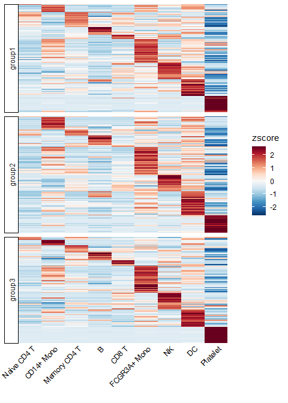
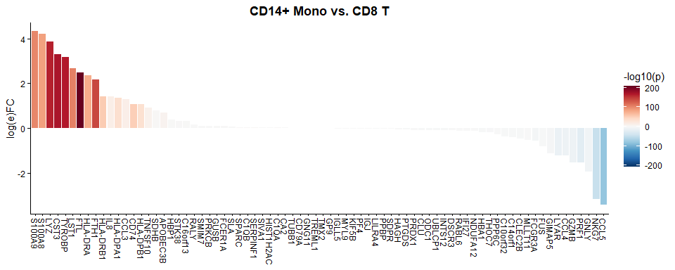
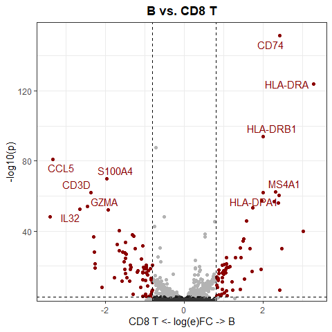
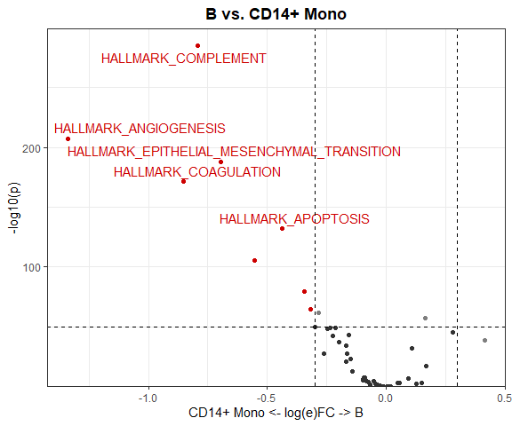
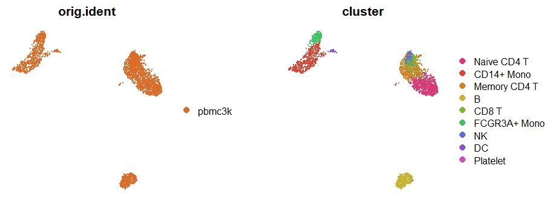
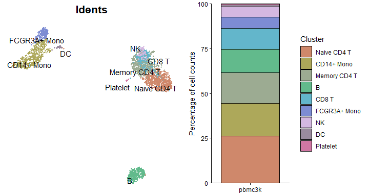

## Table of Contents

1. [Create an Enhanced Dimensional Reduction Plot](#create-an-enhanced-dimensional-reduction-plot)
2. [Generate a Heatmap Plot](#generate-a-heatmap-plot)
3. [Create Enhanced Dot Plots](#create-enhanced-dot-plots-new-in-v110) (New in v1.1.0)
4. [Create an Enhanced Violin Plot](#create-an-enhanced-violin-plot)
5. [Visualize Cluster Distribution in Samples](#visualize-cluster-distribution-in-samples)
6. [Generate a Waterfall Plot](#generate-a-waterfall-plot)
7. [Create Volcano Plots](#create-volcano-plots-new-in-v110) (New in v1.1.0)
8. [Explore Color Functions](#explore-color-functions)

## Create an Enhanced Dimensional Reduction Plot {#create-an-enhanced-dimensional-reduction-plot}


``` r
library(Seurat)
```

```
## Loading required package: SeuratObject
```

```
## Loading required package: sp
```

```
## 
## Attaching package: 'SeuratObject'
```

```
## The following objects are masked from 'package:base':
## 
##     intersect, t
```

``` r
library(SeuratExtend)
```

```
## Loading required package: SeuratExtendData
```

``` r
set.seed(2025)
```


``` r
pbmc <- readRDS("./output/pbmc3k_final.rds")
```


``` r
pbmc$cluster <- Idents(pbmc)
```

### Introduction

In Seurat, dimension reduction plots such as UMAP are typically created using `DimPlot` for discrete variables and `FeaturePlot` for continuous variables. `SeuratExtend` simplifies this process with `DimPlot2`, which automatically handles both types of variables without requiring different functions. The function retains most of the usage conventions of both `DimPlot` and `FeaturePlot` while introducing numerous additional parameters for enhanced customization.

### Basic Usage

To generate a basic dimension reduction plot, simply call `DimPlot2` with your Seurat object:


``` r
DimPlot2(pbmc)
```

<!-- -->

### Visualizing Different Variables

`DimPlot2` can handle both discrete and continuous variables seamlessly. Here's how to input different variables into the plot:


``` r
DimPlot2(pbmc, features = c("cluster", "orig.ident", "CD14", "CD3D"))
```

<!-- -->

**Note**: Starting from v1.1.0, the default color scheme for continuous variables has changed from viridis "A" to RColorBrewer "Blues". This change was made because the previous viridis-A series used black for low expression and red-yellow for high expression, which could be visually problematic - black tends to be too eye-catching while yellow can be hard to see against a white background. The new default uses light blue for low expression and deep blue for high expression, providing better visual clarity. If you prefer the previous color scheme, simply set `cols = "A"` in your function call.


``` r
DimPlot2(pbmc, features = c("CD14", "CD3D"), cols = "A")
```

<!-- -->

### Splitting by Variable

You can split the visualization by a specific variable, which is particularly useful for comparative analysis across conditions or identities:


``` r
DimPlot2(pbmc, features = c("cluster", "CD14"), split.by = "orig.ident", ncol = 1)
```

<!-- -->

### Highlighting Specific Cells

To highlight cells of interest, such as a specific cluster, you can define the cells explicitly and use them in your plot:


``` r
b_cells <- colnames(pbmc)[pbmc$cluster == "B"]
DimPlot2(pbmc, cells.highlight = b_cells)
```

<!-- -->

### Advanced Customization

For each variable, you can specify custom colors and adjust themes. For detailed information on color customization, refer to the [Explore Color Functions](#explore-color-functions) section:


``` r
DimPlot2(
  pbmc,
  features = c("cluster", "orig.ident", "CD14", "CD3D"),
  cols = list(
    "cluster" = "default", # dark theme
    "CD14" = "D",
    "CD3D" = "OrRd"
  ))
```

<!-- -->

### Adding Labels and Boxes

To further enhance the plot, you can add labels and bounding boxes to clearly delineate different groups or points of interest:


``` r
DimPlot2(pbmc, label = TRUE, box = TRUE, label.color = "black", repel = TRUE, theme = NoLegend())
```

<!-- -->

### Simplifying Labels with Indices

For plots with lengthy cluster names, you can use indices to create cleaner visualizations:


``` r
DimPlot2(pbmc, index.title = "C", box = TRUE, label.color = "black")
```

<!-- -->

### Adding UMAP Arrows (New in v1.1.0)

Starting from v1.1.0, you can add simplified axis indicators to your dimension reduction plots using the `theme_umap_arrows` function. This is particularly useful for UMAP or t-SNE plots where traditional axes are often removed to reduce visual clutter:


``` r
# Add simplified axis indicators
DimPlot2(
  pbmc, 
  features = c("cluster", "orig.ident", "CD14", "CD3D"),
  theme = NoAxes()
) + theme_umap_arrows()
```

<!-- -->

The `theme_umap_arrows` function provides several parameters for customization:

- `anchor_x/y`: Position of the arrow origin
- `line_length`: Length of the arrow lines
- `arrow_length`: Size of arrowheads
- `text_offset_x/y`: Position of axis labels
- `text_size`: Font size for labels
- `line_width`: Width of arrow lines
- `x_label/y_label`: Custom axis labels

### Multiple Feature Visualization

When visualizing multiple features simultaneously, you might want to add arrows to each subplot:


``` r
# Add arrows to each subplot
DimPlot2(
  pbmc, 
  features = c("cluster", "orig.ident", "CD14", "CD3D"),
  theme = theme_umap_arrows()
)
```

<!-- -->

### Simultaneous Display of Three Features on a Dimension Reduction Plot

In `SeuratExtend`, a unique visualization method allows for the simultaneous display of three features on the same dimension reduction plot. The functions `FeaturePlot3` and `FeaturePlot3.grid` employ a color mixing system (either RYB or RGB) to represent three different genes (or other continuous variables). This method uses the principles of color mixing to quantitatively display the expression levels or intensities of these three features in each cell.

#### RYB and RGB Color Systems

In the RGB system, black represents no or low expression, and brighter colors indicate higher levels:
{width=500px}

In the RYB system, white represents no expression, and deeper colors indicate higher expression levels:
{width=500px}

#### Examples Using RYB and RGB Systems

Here's how to display three markers using the RYB system, with red for CD3D, yellow for CD14, and blue for CD79A:

``` r
FeaturePlot3(pbmc, color = "ryb", feature.1 = "CD3D", feature.2 = "CD14", feature.3 = "CD79A", pt.size = 0.5)
```

<!-- -->

For the RGB system, with red for CD3D, green for CD14, and blue for CD79A:

``` r
FeaturePlot3(pbmc, color = "rgb", feature.1 = "CD3D", feature.2 = "CD14", feature.3 = "CD79A", pt.size = 1)
```

<!-- -->

#### Using Dark Theme (New in v1.2.0)

For improved visualization in presentations or in low-light environments, you can use the dark theme option:


``` r
FeaturePlot3(
  pbmc, 
  color = "rgb", 
  feature.1 = "CD3D", 
  feature.2 = "CD14", 
  feature.3 = "CD79A", 
  pt.size = 1,
  dark.theme = TRUE
)
```

<!-- -->

This dark theme provides better contrast for visualizing gene expression patterns, particularly when using the RGB color system where brighter colors represent higher expression levels.

#### Batch Visualization with `FeaturePlot3.grid`

`FeaturePlot3.grid` extends `FeaturePlot3` by allowing multiple plots to be generated in one go. The `features` parameter requires a vector where every three values are assigned a color (RYB or RGB) and placed together in one plot. If you wish to skip a color, use `NA` as a placeholder.

For instance, to place the following five genes into two plots using the RYB system, and skip yellow in the second plot:


``` r
DefaultAssay(pbmc) <- "RNA"

genes <- c("CD3D", "CD14", "CD79A", "FCGR3A", "LYZ")
setdiff(genes, rownames(pbmc))  # should print character(0)
```

```
## character(0)
```


``` r
DefaultAssay(pbmc)
```

```
## [1] "RNA"
```

``` r
sapply(c("CD3D","CD14","CD79A","FCGR3A","LYZ"), \(g) g %in% rownames(pbmc))
```

```
##   CD3D   CD14  CD79A FCGR3A    LYZ 
##   TRUE   TRUE   TRUE   TRUE   TRUE
```

``` r
sessionInfo()$otherPkgs[c("Seurat","SeuratObject","SeuratExtend")]
```

```
## $Seurat
## Package: Seurat
## Version: 5.3.0
## Title: Tools for Single Cell Genomics
## Description: A toolkit for quality control, analysis, and exploration
##         of single cell RNA sequencing data. 'Seurat' aims to enable
##         users to identify and interpret sources of heterogeneity from
##         single cell transcriptomic measurements, and to integrate
##         diverse types of single cell data. See Satija R, Farrell J,
##         Gennert D, et al (2015) <doi:10.1038/nbt.3192>, Macosko E, Basu
##         A, Satija R, et al (2015) <doi:10.1016/j.cell.2015.05.002>,
##         Stuart T, Butler A, et al (2019)
##         <doi:10.1016/j.cell.2019.05.031>, and Hao, Hao, et al (2020)
##         <doi:10.1101/2020.10.12.335331> for more details.
## Authors@R: c( person(given = "Andrew", family = "Butler", email =
##         "abutler@nygenome.org", role = "ctb", comment = c(ORCID =
##         "0000-0003-3608-0463")), person(given = "Saket", family =
##         "Choudhary", email = "schoudhary@nygenome.org", role = "ctb",
##         comment = c(ORCID = "0000-0001-5202-7633")), person(given =
##         'David', family = 'Collins', email = 'dcollins@nygenome.org',
##         role = 'ctb', comment = c(ORCID = '0000-0001-9243-7821')),
##         person(given = "Charlotte", family = "Darby", email =
##         "cdarby@nygenome.org", role = "ctb", comment = c(ORCID =
##         "0000-0003-2195-5300")), person(given = "Jeff", family =
##         "Farrell", email = "jfarrell@g.harvard.edu", role = "ctb"),
##         person(given = "Isabella", family = "Grabski", email =
##         "igrabski@nygenome.org", role = "ctb", comment = c(ORCID =
##         "0000-0002-0616-5469")), person(given = "Christoph", family =
##         "Hafemeister", email = "chafemeister@nygenome.org", role =
##         "ctb", comment = c(ORCID = "0000-0001-6365-8254")),
##         person(given = "Yuhan", family = "Hao", email =
##         "yhao@nygenome.org", role = "ctb", comment = c(ORCID =
##         "0000-0002-1810-0822")), person(given = "Austin", family =
##         "Hartman", email = "ahartman@nygenome.org", role = "ctb",
##         comment = c(ORCID = "0000-0001-7278-1852")), person(given =
##         "Paul", family = "Hoffman", email = "hoff0792@umn.edu", role =
##         "ctb", comment = c(ORCID = "0000-0002-7693-8957")),
##         person(given = "Jaison", family = "Jain", email =
##         "jjain@nygenome.org", role = "ctb", comment = c(ORCID =
##         "0000-0002-9478-5018")), person(given = "Longda", family =
##         "Jiang", email = "ljiang@nygenome.org", role = "ctb", comment =
##         c(ORCID = "0000-0003-4964-6497")), person(given = "Madeline",
##         family = "Kowalski", email = "mkowalski@nygenome.org", role =
##         "ctb", comment = c(ORCID = "0000-0002-5655-7620")),
##         person(given = "Skylar", family = "Li", email =
##         "sli@nygenome.org", role = "ctb"), person(given = "Gesmira",
##         family = "Molla", email = 'gmolla@nygenome.org', role = 'ctb',
##         comment = c(ORCID = '0000-0002-8628-5056')), person(given =
##         "Efthymia", family = "Papalexi", email =
##         "epapalexi@nygenome.org", role = "ctb", comment = c(ORCID =
##         "0000-0001-5898-694X")), person(given = "Patrick", family =
##         "Roelli", email = "proelli@nygenome.org", role = "ctb"),
##         person(given = "Rahul", family = "Satija", email =
##         "seurat@nygenome.org", role = c("aut", "cre"), comment =
##         c(ORCID = "0000-0001-9448-8833")), person(given = "Karthik",
##         family = "Shekhar", email = "kshekhar@berkeley.edu", role =
##         "ctb"), person(given = "Avi", family = "Srivastava", email =
##         "asrivastava@nygenome.org", role = "ctb", comment = c(ORCID =
##         "0000-0001-9798-2079")), person(given = "Tim", family =
##         "Stuart", email = "tstuart@nygenome.org", role = "ctb", comment
##         = c(ORCID = "0000-0002-3044-0897")), person(given = "Kristof",
##         family = "Torkenczy", email = "", role = "ctb", comment =
##         c(ORCID = "0000-0002-4869-7957")), person(given = "Shiwei",
##         family = "Zheng", email = "szheng@nygenome.org", role = "ctb",
##         comment = c(ORCID = "0000-0001-6682-6743")), person("Satija Lab
##         and Collaborators", role = "fnd") )
## License: MIT + file LICENSE
## URL: https://satijalab.org/seurat, https://github.com/satijalab/seurat
## BugReports: https://github.com/satijalab/seurat/issues
## Additional_repositories: https://satijalab.r-universe.dev,
##         https://bnprks.r-universe.dev
## Depends: R (>= 4.0.0), methods, SeuratObject (>= 5.0.2)
## Imports: cluster, cowplot, fastDummies, fitdistrplus, future,
##         future.apply, generics (>= 0.1.3), ggplot2 (>= 3.3.0), ggrepel,
##         ggridges, graphics, grDevices, grid, httr, ica, igraph, irlba,
##         jsonlite, KernSmooth, leidenbase, lifecycle, lmtest, MASS,
##         Matrix (>= 1.5-0), matrixStats, miniUI, patchwork, pbapply,
##         plotly (>= 4.9.0), png, progressr, RANN, RColorBrewer, Rcpp (>=
##         1.0.7), RcppAnnoy (>= 0.0.18), RcppHNSW, reticulate, rlang,
##         ROCR, RSpectra, Rtsne, scales, scattermore (>= 1.2),
##         sctransform (>= 0.4.1), shiny, spatstat.explore, spatstat.geom,
##         stats, tibble, tools, utils, uwot (>= 0.1.10)
## Suggests: ape, arrow, Biobase, BiocGenerics, BPCells, data.table,
##         DESeq2, DelayedArray, enrichR, GenomicRanges, GenomeInfoDb,
##         glmGamPoi, ggrastr, harmony, hdf5r, IRanges, limma, MAST,
##         metap, mixtools, monocle, presto, rsvd, R.utils, Rfast2,
##         rtracklayer, S4Vectors, sf (>= 1.0.0), SingleCellExperiment,
##         SummarizedExperiment, testthat, VGAM
## LinkingTo: Rcpp (>= 0.11.0), RcppEigen, RcppProgress
## BuildManual: true
## Encoding: UTF-8
## LazyData: true
## RoxygenNote: 7.3.2
## Collate: 'RcppExports.R' 'reexports.R' 'generics.R' 'clustering.R'
##         .....
## NeedsCompilation: yes
## Packaged: 2025-04-23 19:32:38 UTC; root
## Author: Andrew Butler [ctb] (<https://orcid.org/0000-0003-3608-0463>),
##         Saket Choudhary [ctb]
##         (<https://orcid.org/0000-0001-5202-7633>), David Collins [ctb]
##         (<https://orcid.org/0000-0001-9243-7821>), Charlotte Darby
##         [ctb] (<https://orcid.org/0000-0003-2195-5300>), Jeff Farrell
##         [ctb], Isabella Grabski [ctb]
##         (<https://orcid.org/0000-0002-0616-5469>), Christoph
##         Hafemeister [ctb] (<https://orcid.org/0000-0001-6365-8254>),
##         Yuhan Hao [ctb] (<https://orcid.org/0000-0002-1810-0822>),
##         Austin Hartman [ctb] (<https://orcid.org/0000-0001-7278-1852>),
##         Paul Hoffman [ctb] (<https://orcid.org/0000-0002-7693-8957>),
##         Jaison Jain [ctb] (<https://orcid.org/0000-0002-9478-5018>),
##         Longda Jiang [ctb] (<https://orcid.org/0000-0003-4964-6497>),
##         Madeline Kowalski [ctb]
##         (<https://orcid.org/0000-0002-5655-7620>), Skylar Li [ctb],
##         Gesmira Molla [ctb] (<https://orcid.org/0000-0002-8628-5056>),
##         Efthymia Papalexi [ctb]
##         (<https://orcid.org/0000-0001-5898-694X>), Patrick Roelli
##         [ctb], Rahul Satija [aut, cre]
##         (<https://orcid.org/0000-0001-9448-8833>), Karthik Shekhar
##         [ctb], Avi Srivastava [ctb]
##         (<https://orcid.org/0000-0001-9798-2079>), Tim Stuart [ctb]
##         (<https://orcid.org/0000-0002-3044-0897>), Kristof Torkenczy
##         [ctb] (<https://orcid.org/0000-0002-4869-7957>), Shiwei Zheng
##         [ctb] (<https://orcid.org/0000-0001-6682-6743>), Satija Lab and
##         Collaborators [fnd]
## Maintainer: Rahul Satija <seurat@nygenome.org>
## Repository: CRAN
## Date/Publication: 2025-04-23 22:10:02 UTC
## Built: R 4.5.0; x86_64-w64-mingw32; 2025-06-27 03:12:13 UTC; windows
## Archs: x64
## 
## -- File: C:/Users/myj23/AppData/Local/Programs/R/R-4.5.1/library/Seurat/Meta/package.rds 
## 
## $SeuratObject
## Package: SeuratObject
## Title: Data Structures for Single Cell Data
## Version: 5.2.0
## Authors@R: c( person(given = 'Paul', family = 'Hoffman', email =
##         'hoff0792@alumni.umn.edu', role = 'aut', comment = c(ORCID =
##         '0000-0002-7693-8957')), person(given = 'Rahul', family =
##         'Satija', email = 'seurat@nygenome.org', role = c('aut',
##         'cre'), comment = c(ORCID = '0000-0001-9448-8833')),
##         person(given = 'David', family = 'Collins', email =
##         'dcollins@nygenome.org', role = 'aut', comment = c(ORCID =
##         '0000-0001-9243-7821')), person(given = "Yuhan", family =
##         "Hao", email = 'yhao@nygenome.org', role = 'aut', comment =
##         c(ORCID = '0000-0002-1810-0822')), person(given = "Austin",
##         family = "Hartman", email = 'ahartman@nygenome.org', role =
##         'aut', comment = c(ORCID = '0000-0001-7278-1852')),
##         person(given = "Gesmira", family = "Molla", email =
##         'gmolla@nygenome.org', role = 'aut', comment = c(ORCID =
##         '0000-0002-8628-5056')), person(given = 'Andrew', family =
##         'Butler', email = 'abutler@nygenome.org', role = 'aut', comment
##         = c(ORCID = '0000-0003-3608-0463')), person(given = 'Tim',
##         family = 'Stuart', email = 'tstuart@nygenome.org', role =
##         'aut', comment = c(ORCID = '0000-0002-3044-0897')),
##         person(given = "Madeline", family = "Kowalski", email =
##         "mkowalski@nygenome.org", role = "ctb", comment = c(ORCID =
##         "0000-0002-5655-7620")), person(given = "Saket", family =
##         "Choudhary", email = "schoudhary@nygenome.org", role = "ctb",
##         comment = c(ORCID = "0000-0001-5202-7633")), person(given =
##         "Skylar", family = "Li", email = "sli@nygenome.org", role =
##         "ctb"), person(given = "Longda", family = "Jiang", email =
##         "ljiang@nygenome.org", role = "ctb", comment = c(ORCID =
##         "0000-0003-4964-6497")), person(given = "Anagha", family =
##         "Shenoy", email = "ashenoy@nygenome.org", role = "ctb", comment
##         = c(ORCID = "0000-0002-0537-6862")), person(given = 'Jeff',
##         family = 'Farrell', email = 'jfarrell@g.harvard.edu', role =
##         'ctb'), person(given = 'Shiwei', family = 'Zheng', email =
##         'szheng@nygenome.org', role = 'ctb', comment = c(ORCID =
##         '0000-0001-6682-6743')), person(given = 'Christoph', family =
##         'Hafemeister', email = 'chafemeister@nygenome.org', role =
##         'ctb', comment = c(ORCID = '0000-0001-6365-8254')),
##         person(given = 'Patrick', family = 'Roelli', email =
##         'proelli@nygenome.org', role = 'ctb') )
## Description: Defines S4 classes for single-cell genomic data and
##         associated information, such as dimensionality reduction
##         embeddings, nearest-neighbor graphs, and spatially-resolved
##         coordinates. Provides data access methods and R-native hooks to
##         ensure the Seurat object is familiar to other R users. See
##         Satija R, Farrell J, Gennert D, et al (2015)
##         <doi:10.1038/nbt.3192>, Macosko E, Basu A, Satija R, et al
##         (2015) <doi:10.1016/j.cell.2015.05.002>, and Stuart T, Butler
##         A, et al (2019) <doi:10.1016/j.cell.2019.05.031>, Hao Y, Hao S,
##         et al (2021) <doi:10.1016/j.cell.2021.04.048> and Hao Y, et al
##         (2023) <doi:10.1101/2022.02.24.481684> for more details.
## License: MIT + file LICENSE
## URL: https://satijalab.github.io/seurat-object/,
##         https://github.com/satijalab/seurat-object
## BugReports: https://github.com/satijalab/seurat-object/issues
## Additional_repositories: https://bnprks.r-universe.dev
## Depends: R (>= 4.1.0), sp (>= 1.5.0)
## Imports: future, future.apply, generics, grDevices, grid, lifecycle,
##         Matrix (>= 1.6.4), methods, progressr, Rcpp (>= 1.0.5), rlang
##         (>= 0.4.7), spam, stats, tools, utils
## Suggests: BPCells, DelayedArray, fs (>= 1.5.2), sf (>= 1.0.0), ggplot2,
##         HDF5Array, rmarkdown, testthat
## LinkingTo: Rcpp, RcppEigen
## Config/Needs/website: pkgdown
## BuildManual: true
## Encoding: UTF-8
## LazyData: true
## RoxygenNote: 7.3.2
## Collate: 'RcppExports.R' 'zzz.R' 'generics.R' 'keymixin.R' 'graph.R'
##         .....
## NeedsCompilation: yes
## Packaged: 2025-08-27 21:37:49 UTC; root
## Author: Paul Hoffman [aut] (ORCID:
##         <https://orcid.org/0000-0002-7693-8957>), Rahul Satija [aut,
##         cre] (ORCID: <https://orcid.org/0000-0001-9448-8833>), David
##         Collins [aut] (ORCID: <https://orcid.org/0000-0001-9243-7821>),
##         Yuhan Hao [aut] (ORCID:
##         <https://orcid.org/0000-0002-1810-0822>), Austin Hartman [aut]
##         (ORCID: <https://orcid.org/0000-0001-7278-1852>), Gesmira Molla
##         [aut] (ORCID: <https://orcid.org/0000-0002-8628-5056>), Andrew
##         Butler [aut] (ORCID: <https://orcid.org/0000-0003-3608-0463>),
##         Tim Stuart [aut] (ORCID:
##         <https://orcid.org/0000-0002-3044-0897>), Madeline Kowalski
##         [ctb] (ORCID: <https://orcid.org/0000-0002-5655-7620>), Saket
##         Choudhary [ctb] (ORCID:
##         <https://orcid.org/0000-0001-5202-7633>), Skylar Li [ctb],
##         Longda Jiang [ctb] (ORCID:
##         <https://orcid.org/0000-0003-4964-6497>), Anagha Shenoy [ctb]
##         (ORCID: <https://orcid.org/0000-0002-0537-6862>), Jeff Farrell
##         [ctb], Shiwei Zheng [ctb] (ORCID:
##         <https://orcid.org/0000-0001-6682-6743>), Christoph Hafemeister
##         [ctb] (ORCID: <https://orcid.org/0000-0001-6365-8254>), Patrick
##         Roelli [ctb]
## Maintainer: Rahul Satija <seurat@nygenome.org>
## Repository: CRAN
## Date/Publication: 2025-08-27 22:30:01 UTC
## Built: R 4.5.1; x86_64-w64-mingw32; 2025-09-24 01:57:49 UTC; windows
## Archs: x64
## 
## -- File: C:/Users/myj23/AppData/Local/Programs/R/R-4.5.1/library/SeuratObject/Meta/package.rds 
## 
## $SeuratExtend
## Package: SeuratExtend
## Type: Package
## Title: SeuratExtend
## Version: 1.2.5
## Author: Yichao Hua
## Maintainer: Yichao Hua <yichao.hua@uk-essen.de>
## Description: SeuratExtend is an R package designed to improve and
##         simplify the analysis of scRNA-seq data using the Seurat
##         object. It provides an array of enhanced visualization tools,
##         an integrated functional and pathway analysis pipeline,
##         seamless integration with popular Python tools, and a suite of
##         utility functions to aid in data manipulation and presentation.
## License: GPL (>= 3)
## Encoding: UTF-8
## LazyData: true
## RoxygenNote: 7.3.2
## VignetteBuilder: knitr
## Imports: Seurat, dplyr, remotes, rlist, mosaic, ggplot2, reshape2,
##         purrr, magrittr, tidyr, scales, ggpubr, BiocManager,
##         reticulate, glue, hdf5r
## Suggests: rgl, GSVA, GSVAdata, slingshot, AUCell, biomaRt,
##         ontologyIndex, viridis, doMC, doRNG, doParallel, foreach, mgsa,
##         GSEABase, egg, loomR, mgsa, knitr, rmarkdown, RColorBrewer
## Depends: R (>= 3.6), SeuratExtendData, SeuratObject
## Remotes: huayc09/SeuratExtendData
## Collate: 'AUCell_basic.R' 'Anndata.R' 'generics.R' 'CalcStats.R' .....
## RemoteType: github
## RemoteHost: api.github.com
## RemoteRepo: SeuratExtend
## RemoteUsername: huayc09
## RemoteRef: HEAD
## RemoteSha: 5dacd7c1e1da3bc0e78ab81d60056f6d7da3d386
## GithubRepo: SeuratExtend
## GithubUsername: huayc09
## GithubRef: HEAD
## GithubSHA1: 5dacd7c1e1da3bc0e78ab81d60056f6d7da3d386
## NeedsCompilation: no
## Packaged: 2025-09-29 18:17:19 UTC; myj23
## Built: R 4.5.1; ; 2025-09-29 18:17:24 UTC; windows
## 
## -- File: C:/Users/myj23/AppData/Local/Programs/R/R-4.5.1/library/SeuratExtend/Meta/package.rds
```


``` r
DefaultAssay(pbmc)
```

```
## [1] "RNA"
```

``` r
setdiff(c("CD3D","CD14","CD79A","FCGR3A","LYZ","NKG7"), rownames(pbmc))
```

```
## character(0)
```


``` r
# p1 <- FeaturePlot3(pbmc, feature.1 = "CD3D", feature.2 = "CD14", feature.3 = "CD79A",
#                    color = "ryb", pt.size = 0.5)
# 
# # “Skip” a channel by duplicating one gene (keeps 3 channels consistent)
# p2 <- FeaturePlot3(pbmc, feature.1 = "FCGR3A", feature.2 = "LYZ", feature.3 = "LYZ",
#                    color = "ryb", pt.size = 0.5)
# 
# p1 + p2  # patchwork
```

Using the RGB system:

``` r
# FeaturePlot3.grid(
#   pbmc,
#   features = c("CD3D", "CD14", "CD79A", "FCGR3A", NA, "LYZ"),
#   color = "rgb",
#   pt.size = 1
# )
```

#### Using Dark Theme with Grid Layout (New in v1.2.0)

You can also apply the dark theme to FeaturePlot3.grid for enhanced visualization:


``` r
# FeaturePlot3.grid(
#   pbmc, 
#   features = c("CD3D", "CD14", "CD79A", "FCGR3A", NA, "LYZ"), 
#   color = "rgb", 
#   pt.size = 1,
#   dark.theme = TRUE,
#   legend = TRUE
# )
```

The dark theme with legend enabled provides an elegant visualization that works well in presentations and publications.

#### Tips on Point Size

The background is usually white, so the choice of color system and point size can significantly affect visual perception. In the RYB system, where higher expression results in darker colors, a smaller `pt.size` is preferable to prevent overlapping points. In contrast, in the RGB system, higher expressions result in lighter colors, potentially leading to visibility issues for highly expressed cells that may blend into the white background. Here, a larger `pt.size` is recommended so that the darker, low-expression points can form a "background" to highlight the lighter, high-expression points.

## Generate a Heatmap Plot {#generate-a-heatmap-plot}

### Introduction

The `Heatmap` function provides a flexible and comprehensive way to visualize matrices, especially those produced by the `CalcStats` function. While heatmaps are excellent for visualizing overall patterns across multiple groups and features, they represent average expression levels through color intensity.

**Note:** Starting from v1.1.0, the default color scheme has changed from `c(low = muted("blue"), mid = "white", high = muted("red"))` to `"BuRd"`. This change was made to provide more vibrant visualization using RColorBrewer palettes. To revert to the previous color scheme, simply set `color_scheme = c(low = muted("blue"), mid = "white", high = muted("red"))`.

### Basic Usage

First, let's generate a sample matrix using the `CalcStats` function:


``` r
# Calculate z-scores for variable features
genes <- VariableFeatures(pbmc)
toplot <- CalcStats(pbmc, features = genes, method = "zscore", order = "p", n = 5)
```

Now, we can produce a basic heatmap:


``` r
# Create a basic heatmap
Heatmap(toplot, lab_fill = "zscore")
```

<!-- -->

### Adjusting Color Schemes

The `color_scheme` parameter allows for flexibility in visualizing data. Here are some ways to change the color theme of your heatmap:


``` r
# Viridis-A theme
Heatmap(toplot, lab_fill = "zscore", color_scheme = "A")
```

<!-- -->


``` r
# White - blue - dark green
Heatmap(toplot, lab_fill = "zscore", color_scheme = "BuGn")
```

<!-- -->

For detailed information on color customization, refer to the [Explore Color Functions](#explore-color-functions) section.

### Modifying Axis and Labels

Sometimes, the first name on the x-axis might be too long and exceed the left boundary of the plot. To prevent this issue and ensure all labels are fully visible, you can increase the space on the left side of the plot by adjusting the `plot.margin` parameter. For example, to add more space, you can specify a larger value for the left margin (`l`) like this:


``` r
Heatmap(toplot, lab_fill = "zscore", plot.margin = margin(l = 50))
```

<!-- -->

For dense matrices with many features, you might want to show only a subset of gene names:


``` r
toplot2 <- CalcStats(pbmc, features = genes[1:500], method = "zscore", order = "p")
Heatmap(toplot2, lab_fill = "zscore", feature_text_subset = genes[1:20], expand_limits_x = c(-0.5, 11))
```

<!-- -->

### Faceting the Heatmap

You can split the heatmap based on gene groups:


``` r
gene_groups <- sample(c("group1", "group2", "group3"), nrow(toplot2), replace = TRUE)
Heatmap(toplot2, lab_fill = "zscore", facet_row = gene_groups) +
  theme(axis.text.y = element_blank())
```

<!-- -->

## Create Enhanced Dot Plots (New in v1.1.0) {#create-enhanced-dot-plots-new-in-v110} 

### Introduction

While heatmaps are excellent for visualizing overall patterns, dot plots offer a complementary visualization that combines two key pieces of information:
1. The percentage of cells expressing each feature (represented by dot size)
2. The average expression level in expressing cells (represented by color intensity)

This dual representation can provide more detailed insights than a standard heatmap, particularly when expression patterns vary between cell populations.

### Basic Usage

Let's create a basic dot plot for some variable features:


``` r
# Select some variable features
genes <- VariableFeatures(pbmc)[1:10]
DotPlot2(pbmc, features = genes)
```

<!-- -->

### Grouped Features

You can organize features into groups for clearer visualization:


``` r
# Create grouped features
grouped_features <- list(
  "B_cell_markers" = c("MS4A1", "CD79A"),
  "T_cell_markers" = c("CD3D", "CD8A", "IL7R"),
  "Myeloid_markers" = c("CD14", "FCGR3A", "S100A8")
)

DotPlot2(pbmc, features = grouped_features)
```

<!-- -->

### Split Visualization

You can split the visualization by a metadata column to compare expression patterns across different conditions:


``` r
# Basic split visualization
DotPlot2(pbmc, features = genes, group.by = "cluster", split.by = "orig.ident", show_grid = FALSE)
```

<!-- -->

### Alternative Split Visualization

The split groups can be represented either by border colors (default) or by dot colors:


``` r
# Using colors instead of borders for split groups
DotPlot2(pbmc, 
         features = genes, 
         group.by = "cluster", 
         split.by = "orig.ident", 
         split.by.method = "color", 
         show_grid = FALSE)
```

<!-- -->

### Customizing Appearance

You can customize various aspects of the plot, including color schemes, dot sizes, and grid lines:


``` r
DotPlot2(pbmc, 
         features = grouped_features, 
         color_scheme = "BuRd", 
         border = FALSE,        # Remove dot borders
         show_grid = FALSE,     # Remove grid lines
         flip = TRUE)          # Flip coordinates
```

<!-- -->

## Create an Enhanced Violin Plot {#create-an-enhanced-violin-plot}

### Introduction

The `VlnPlot2` function offers a revamped version of the traditional violin plot, designed to be more space-efficient while introducing additional visualization features. Unlike the original `VlnPlot` in Seurat, this enhanced version integrates boxplots, statistical annotations, and greater flexibility in plot presentation.

### Basic Usage

Let's start with some common gene markers:


``` r
library(Seurat)
library(SeuratExtend)

genes <- c("CD3D","CD14","CD79A")
VlnPlot2(pbmc, features = genes, ncol = 1)
```

<!-- -->

### Customizing Plot Elements

You can create different variations of the plot by adjusting its components. For instance, you might want to show only the box plot with quasirandom point distribution:


``` r
VlnPlot2(pbmc, features = genes, violin = FALSE, pt.style = "quasirandom", ncol = 1)
```

<!-- -->

### Managing Point Display

For cleaner visualization, you can hide individual points while still showing outliers:


``` r
VlnPlot2(pbmc, features = genes, pt = FALSE, ncol = 1)
```

<!-- -->

Or hide both points and outliers for a minimal appearance:


``` r
VlnPlot2(pbmc, features = genes, pt = FALSE, hide.outlier = TRUE, ncol = 1)
```

<!-- -->

### Outline Style (New in v1.2.0)

You can change the violin plot style from filled to outline:


``` r
VlnPlot2(pbmc, features = genes, style = "outline", ncol = 1)
```

<!-- -->

### Adding Mean and Median Lines (New in v1.1.0)

For genes with low expression where boxplot might be hard to interpret (e.g., when median and quartiles overlap at zero), you can add mean/median lines for better visualization:


``` r
lowExprGenes <- c("CCR7", "IL7R", "TCF7")
VlnPlot2(pbmc, 
         features = lowExprGenes, 
         show.mean = TRUE,      # Show mean and median lines
         mean_colors = c("red", "blue"),  # Colors for mean and median
         cols = "light",        # Light color scheme for better visibility
         ncol = 1)
```

<!-- -->

### Split Visualization

You can group by cluster and split each cluster by samples:


``` r
VlnPlot2(pbmc, features = genes, group.by = "cluster", split.by = "orig.ident")
```

<!-- -->

### Subset Analysis

You can focus on specific cell types and arrange plots in columns:


``` r
cells <- colnames(pbmc)[pbmc$cluster %in% c("B", "CD14+ Mono", "CD8 T")]
VlnPlot2(pbmc, features = genes, group.by = "cluster", cells = cells)
```

<!-- -->

### Statistical Analysis

Add statistical annotations using the Wilcoxon test, hiding non-significant results:


``` r
VlnPlot2(pbmc, 
         features = genes, 
         group.by = "cluster", 
         cells = cells,
         stat.method = "wilcox.test", 
         hide.ns = TRUE)
```

<!-- -->

Or specify particular comparisons using t-test:


``` r
VlnPlot2(pbmc, 
         features = genes, 
         group.by = "cluster", 
         cells = cells,
         stat.method = "t.test", 
         comparisons = list(c(1,2), c(1,3)), 
         hide.ns = FALSE)
```

<!-- -->

### Using Matrix Input

You can also use `VlnPlot2` with matrices, such as AUCell scores from gene set enrichment analysis:


``` r
# Perform gene set analysis
pbmc <- GeneSetAnalysis(pbmc, genesets = hall50$human)
matr <- pbmc@misc$AUCell$genesets

# Plot the first three pathways
VlnPlot2(matr[1:3,], f = pbmc$cluster, ncol = 1)
```

<!-- -->

> **Note on Statistical Testing:** When using `stat.method` to add statistical annotations to violin plots, be aware that p-values can be artificially inflated in large single-cell datasets due to the high number of cells. This may result in statistically significant differences (small p-values) even when the biological effect size is minimal. We recommend being cautious with statistical interpretations, especially when visual differences are subtle. Consider examining log fold changes (logFC) between groups to better assess the magnitude of biological differences. Additionally, the percentage of cells expressing a marker (similar to the pct.1 and pct.2 values in Seurat's FindMarkers) is an important metric - if the difference in percentage between groups is minimal, the expression difference may be biologically negligible despite a significant p-value. Parameters like min.pct in differential expression analysis can help filter out features with low expression prevalence. For a comprehensive visualization of differences between two groups, `WaterfallPlot()` (see [Generate a Waterfall Plot](#generate-a-waterfall-plot)) can provide logFC values along with statistical significance. By default, `VlnPlot2` uses the Holm method (`p.adjust.method = "holm"`) to adjust p-values for multiple comparisons.

## Visualize Cluster Distribution in Samples {#visualize-cluster-distribution-in-samples}

### Introduction

The `ClusterDistrBar` function visualizes how clusters are distributed across different samples. It can show both absolute counts and proportions, with various customization options.

### Basic Usage

Create a basic bar plot showing cluster distribution within samples:


``` r
ClusterDistrBar(origin = pbmc$orig.ident, cluster = pbmc$cluster)
```

<!-- -->

### Absolute Cell Counts

To show absolute cell counts instead of proportions:


``` r
ClusterDistrBar(origin = pbmc$orig.ident, cluster = pbmc$cluster, percent = FALSE)
```

<!-- -->

### Normalized Proportions with Reversed Axes

For normalized data with reversed axes:


``` r
# ClusterDistrBar(origin = pbmc$orig.ident, cluster = pbmc$cluster, rev = TRUE, normalize = TRUE)
```

### Vertical Orientation

Create a vertical bar plot:


``` r
ClusterDistrBar(origin = pbmc$orig.ident, cluster = pbmc$cluster, flip = FALSE, reverse_order = FALSE)
```

<!-- -->

### Non-Stacked Display

Show bars side by side instead of stacked:


``` r
ClusterDistrBar(origin = pbmc$orig.ident, 
                cluster = pbmc$cluster, 
                flip = FALSE, 
                stack = FALSE)
```

<!-- -->

### Comparing Cluster Distribution Between Conditions (New in v1.2.0)

For comparing cluster distribution patterns between experimental conditions, `SeuratExtend` offers the `ClusterDistrPlot` function. This function extends `ClusterDistrBar` functionality by adding the ability to group samples by a condition variable, creating boxplots grouped by condition instead of stacked bars.

The function supports all parameters from `ClusterDistrBar` when using the standard bar plot mode, and inherits styling options from `VlnPlot2` when using the boxplot mode with conditions. This makes it highly versatile for different visualization needs.


``` r
# # Compare cluster distribution between conditions
# ClusterDistrPlot(
#   origin = pbmc$sample_id,
#   cluster = pbmc$cluster,
#   condition = pbmc$condition
# )
```

When the `condition` parameter is not provided, `ClusterDistrPlot` behaves exactly like `ClusterDistrBar`, providing seamless backward compatibility.

## Generate a Waterfall Plot {#generate-a-waterfall-plot}

### Introduction

Waterfall plots are powerful tools for visualizing differences between two conditions, effectively displaying metrics like gene expression differences or pathway enrichment scores. Note that starting from v1.1.0, similar to other visualization functions, the default color scheme has been updated to use more vibrant RColorBrewer palettes.

### Basic Usage

First, let's create a matrix using the `GeneSetAnalysis()` function:


``` r
pbmc <- GeneSetAnalysis(pbmc, genesets = hall50$human)
matr <- pbmc@misc$AUCell$genesets
```

Generate a basic waterfall plot comparing two cell types:


``` r
WaterfallPlot(matr, f = pbmc$cluster, ident.1 = "CD14+ Mono", ident.2 = "CD8 T")
```

```
## Warning: `label` cannot be a <ggplot2::element_blank> object.
```

<!-- -->

### WaterfallPlot Style: "segment" (New in v1.1.0)

Added a new visualization style "segment" to WaterfallPlot, providing an alternative way to display differences between conditions:


``` r
# Create a plot using the new segment style
WaterfallPlot(
  matr,
  f = pbmc$cluster,
  ident.1 = "CD14+ Mono",
  ident.2 = "CD8 T",
  style = "segment",
  color_theme = "D"
)
```

<!-- -->

### Filtering by Significance

Focus on significant differences by setting a threshold:


``` r
WaterfallPlot(
  matr, 
  f = pbmc$cluster, 
  ident.1 = "CD14+ Mono",
  ident.2 = "CD8 T",
  len.threshold = 2)
```

```
## Ignoring unknown labels:
## • colour : "tscore"
```

```
## Warning: `label` cannot be a <ggplot2::element_blank> object.
```

<!-- -->

### Gene Expression Comparison

Compare expression levels directly from a Seurat object:


``` r
genes <- VariableFeatures(pbmc)[1:80]
WaterfallPlot(
  pbmc, 
  group.by = "cluster", 
  features = genes,
  ident.1 = "CD14+ Mono",
  ident.2 = "CD8 T",
  length = "logFC")
```

```
## Using pseudocount = 1 for logFC calculation.
```

```
## Ignoring unknown labels:
## • colour : "-log10(p)"
```

```
## Warning: `label` cannot be a <ggplot2::element_blank> object.
```

<!-- -->

### Focusing on Top Features

Display only the most differentially expressed genes:


``` r
WaterfallPlot(
  pbmc, 
  group.by = "cluster", 
  features = genes,
  ident.1 = "CD14+ Mono",
  ident.2 = "CD8 T",
  length = "logFC",
  top.n = 20)
```

```
## Using pseudocount = 1 for logFC calculation.
```

```
## Ignoring unknown labels:
## • colour : "-log10(p)"
```

```
## Warning: `label` cannot be a <ggplot2::element_blank> object.
```

<!-- -->

### Using Log2 or Log10 Fold Change (New in v1.2.0)

By default, WaterfallPlot uses natural logarithm (base e) for fold change calculations. You can specify a different base using the `log.base` parameter:


``` r
# Using log base 2 for fold change calculations
WaterfallPlot(
  pbmc, 
  group.by = "cluster", 
  features = genes,
  ident.1 = "CD14+ Mono",
  ident.2 = "CD8 T",
  length = "logFC",
  log.base = "2",    # Use log2 instead of natural log
  top.n = 20)
```

```
## Using pseudocount = 1 for logFC calculation.
```

```
## Ignoring unknown labels:
## • colour : "-log10(p)"
```

```
## Warning: `label` cannot be a <ggplot2::element_blank> object.
```

<!-- -->

### Notes on LogFC Calculation

When calculating log fold changes, WaterfallPlot and VolcanoPlot (see the next section):

1. **Adds a pseudocount** to prevent issues with zero values:
   - For most data: Uses pseudocount=1 by default
   - For data with values between 0-1 (like AUCell scores): Automatically uses pseudocount=0.01
   - You can customize this value with the `pseudocount` parameter

2. **Uses natural logarithm (base e) by default**, but supports other bases:
   - `log.base = "e"`: Natural logarithm (default)
   - `log.base = "2"`: Log base 2
   - `log.base = "10"`: Log base 10
   - Any numeric value for custom bases

3. **For Seurat objects**, applies `expm1` transformation to normalized data by default:
   - This ensures consistency with Seurat's FindMarkers function
   - Can be disabled with `exp.transform = FALSE`

The formula used is: `log((mean(x[group1] + pseudocount) / mean(x[group2] + pseudocount)), base)`

## Create Volcano Plots (New in v1.1.0) {#create-volcano-plots-new-in-v110}

### Introduction

The Volcano plot is a specialized variation of the scatter plot that combines statistical significance (-log10 p-value) with magnitude of change (typically log fold change). While Waterfall plots focus on ordered visualization of differences, Volcano plots provide a comprehensive view of both the magnitude and statistical significance of changes.

### Basic Usage

Create a basic volcano plot comparing two cell types:


``` r
VolcanoPlot(pbmc, 
            ident.1 = "B",
            ident.2 = "CD8 T")
```

<!-- -->

### Customizing Thresholds

You can set custom thresholds for both axes:


``` r
VolcanoPlot(
  pbmc,
  ident.1 = "B",
  ident.2 = "CD8 T",
  x.threshold = 0.5,    # Log fold change threshold
  y.threshold = 2     # -log10(p-value) threshold
)
```

<!-- -->

### Fine-tuning Plot Parameters

Adjust quantile thresholds and number of labeled genes:


``` r
VolcanoPlot(
  pbmc,
  ident.1 = "B",
  ident.2 = "CD8 T",
  x.quantile = 0.99,    # Less stringent x threshold
  y.quantile = 0.95,    # More stringent y threshold
  top.n = 5,            # Label fewer genes
  color = c("grey20", "grey70", "darkred")  # Custom colors
)
```

<!-- -->

### Using Alternative Statistics

Using t-score instead of p-value for the y-axis can be particularly useful in single-cell analysis. Due to the large number of cells in single-cell datasets, p-values often become extremely significant, causing many genes to cluster at the top of the y-axis when using -log10(p-value). This can make it difficult to distinguish between genes that are all technically highly significant. T-scores provide better spread and can help create more informative visualizations.


``` r
VolcanoPlot(
  pbmc,
  ident.1 = "B",
  ident.2 = "CD8 T",
  y = "tscore"
)
```

<!-- -->

### Using Log2 or Log10 Fold Change (New in v1.2.0)

By default, VolcanoPlot uses natural logarithm (base e) for fold change calculations. You can specify a different base using the `log.base` parameter:


``` r
VolcanoPlot(
  pbmc,
  ident.1 = "B",
  ident.2 = "CD8 T",
  log.base = "2"    # Use log2 instead of natural log
)
```

<!-- -->

### Matrix Input

You can also use matrices, such as pathway enrichment scores:


``` r
# Using the previously calculated pathway enrichment scores
VolcanoPlot(
  matr,
  f = pbmc$cluster,
  ident.1 = "B",
  ident.2 = "CD14+ Mono",
  x.quantile = 0.8,
  y.quantile = 0.8,
  top.n = 5)
```

<!-- -->

## Tips: Choosing the Right Visualization

When visualizing gene expression or pathway activity data, different plot types serve different purposes. Here's a guide to help you choose:

1. Overview Visualizations:
   - **Heatmaps**:
     * Best for: Comparing many features across multiple groups using color intensity
     * Advantage: Compact visualization of large-scale patterns
     * Limitation: Color intensity alone may not show detailed expression patterns
   - **Dot Plots**:
     * Best for: Similar to heatmaps but with additional information
     * Advantage: Shows both expression level (color) and percent expressing cells (size)
     * Limitation: Takes more space than heatmaps

2. Two-Group Comparisons:
   - **Waterfall Plots**:
     * Best for: Ordered visualization of differences between two groups
     * Advantage: Clear ranking of most differential features
     * Limitation: Limited to two-group comparisons
   - **Volcano Plots**:
     * Best for: Combining fold change with statistical significance
     * Advantage: Shows both effect size and significance
     * Limitation: Also limited to two-group comparisons

3. Detailed Expression Analysis:
   - **Violin Plots**:
     * Best for: Detailed view of expression distribution
     * Advantage: Shows full distribution shape and statistical comparisons
     * Limitation: Space-intensive, limiting the number of features that can be shown

## Explore Color Functions {#explore-color-functions}

The `SeuratExtend` package provides comprehensive color management across all visualization functions. Each function type handles colors slightly differently depending on whether it's dealing with discrete or continuous variables.

### For Functions Handling Discrete Variables

- **DimPlot2**, **VlnPlot2**, **ClusterDistrBar** (using `cols` parameter)
  - Eight [color_pro styles](#professional-discrete-color-presets-with-color_pro): "default", "light", "pro_red", "pro_yellow", "pro_green", "pro_blue", "pro_purple", "bright" (new in v1.2.0)
  - Five [color_iwh styles](#iwanthue-color-series-color_iwh): "iwh_default", "iwh_intense", "iwh_pastel", "iwh_all", "iwh_all_hard"
  - All [RColorBrewer](#rcolorbrewer-palettes) qualitative palettes (e.g., "Set1", "Set2", "Set3", "Paired", "Dark2", "Accent", "Pastel1", "Pastel2")
  - Custom colors as vector of hex codes or color names

> **Note**: Based on user feedback, starting from v1.2.0, the default discrete color scheme has been changed to "light" to avoid color inconsistency in DimPlot2 when toggling between labeled and unlabeled displays. If you prefer to retain the original "default" (darker) color scheme for discrete variables in `DimPlot2`, you can use: `seu <- save_colors(seu, col_list = list("discrete" = "default"))`. This will set the default for all discrete variables to the darker color scheme.

### For Functions Handling Continuous Variables

- **DimPlot2** (using `cols` parameter for continuous features)
- **Heatmap**, **DotPlot2**, **WaterfallPlot** (using `color_scheme` parameter)

Available options for continuous variables:

1. Viridis Color Schemes (see [viridis palettes](#viridis-options)
   - Options "A" through "H" from the viridis package
   - Example: `cols = "D"` for the 'viridis' option

2. (New in v1.1.0) [RColorBrewer](#rcolorbrewer-palettes) Sequential Palettes
   - Options include: "Blues", "BuGn", "BuPu", "GnBu", "Greens", "Greys", "Oranges", "OrRd", "PuBu", "PuBuGn", "PuRd", "Purples", "RdPu", "Reds", "YlGn", "YlGnBu", "YlOrBr", "YlOrRd"
   - Add "-rev" suffix to reverse any palette (e.g., "Blues-rev")

3. (New in v1.1.0) [RColorBrewer](#rcolorbrewer-palettes) Diverging Palettes
   - Options include: "BrBG", "PiYG", "PRGn", "PuOr", "RdBu", "RdGy", "RdYlBu", "RdYlGn", "Spectral"
   - Add "-rev" suffix to reverse any palette

4. (New in v1.1.0) Custom Diverging Palettes
   - Additional options: "GnYlRd", "BuYlRd", "GyRd", "BuRd", "PuOr"

5. Custom Gradient Specifications
   - Three-point gradient: `c(low = "blue", mid = "white", high = "red")`
   - Two-point gradient: `c(low = "grey", high = "red")`
   - Vector of colors for custom gradient

### Recommended Color Schemes

Here are some recommended color schemes for different visualization needs in single-cell analysis:

#### For Discrete Variables (e.g., clusters, conditions)

The "default" (dark) theme and "light" color scheme from SeuratExtend's `color_pro` are particularly effective for different visualization needs:


``` r
library(cowplot)
plot_grid(
  DimPlot2(pbmc, cols = "default", theme = NoAxes() + NoLegend()),
  ClusterDistrBar(pbmc$orig.ident, pbmc$cluster, cols = "default", flip = FALSE, border = "black") +
    theme(axis.title.x = element_blank())
)
```

<!-- -->


``` r
library(cowplot)
plot_grid(
  DimPlot2(pbmc, cols = "light", theme = NoAxes() + NoLegend()),
  ClusterDistrBar(pbmc$orig.ident, pbmc$cluster, cols = "light", flip = FALSE) +
    theme(axis.title.x = element_blank())
)
```

<!-- -->

For visualizations requiring more vibrant colors with high contrast (new in v1.2.0):


``` r
plot_grid(
  DimPlot2(pbmc, features = c("orig.ident", "cluster"), cols = "bright", ncol = 2, theme = NoAxes())
)
```

<!-- -->

#### For Continuous Variables (e.g., gene expression)

the "A" or "D" color schemes from viridis:


``` r
Heatmap(toplot, lab_fill = "zscore", color_scheme = "A")
```

<!-- -->


``` r
WaterfallPlot(
  pbmc, group.by = "cluster", features = VariableFeatures(pbmc)[1:80],
  ident.1 = "CD14+ Mono", ident.2 = "CD8 T", length = "logFC",
  top.n = 20, color_theme = "D")
```

```
## Using pseudocount = 1 for logFC calculation.
```

```
## Ignoring unknown labels:
## • colour : "-log10(p)"
```

```
## Warning: `label` cannot be a <ggplot2::element_blank> object.
```

<!-- -->

You can also use various color palettes from RColorBrewer (https://r-graph-gallery.com/38-rcolorbrewers-palettes.html):


``` r
library(RColorBrewer)
markers_genes <- c(
  "MS4A1", "GNLY", "CD3E",
  "CD8A", "CCR7", "CD14",
  "FCER1A", "FCGR3A", "PPBP")
DimPlot2(
  pbmc,
  features = markers_genes,
  cols = "OrRd",
  theme = NoAxes())
```

<!-- -->


``` r
DimPlot2(
  pbmc,
  features = markers_genes,
  cols = "Spectral-rev",
  theme = NoAxes())
```

<!-- -->

### Professional Discrete Color Presets with `color_pro` {#professional-discrete-color-presets-with-color_pro}

The `color_pro` function is designed to generate professional discrete color presets, ideal for data science visualizations, particularly in fields like scRNA-seq analysis where aesthetics must not compromise the clarity and seriousness of scientific communication.

#### The Philosophy Behind `color_pro`

Choosing the right colors for scientific visualizations is crucial. Colors must be distinct enough to differentiate data points clearly but coordinated and subdued enough to maintain professionalism and avoid visual strain. 

##### What to AVOID in Scientific Plotting

1. **Coordinated but Indistinct Colors:**
   Using monochromatic schemes can reduce visual distinction, which might cause data points to blend together.

   Example of an inadvisable choice:

``` r
   DimPlot2(pbmc, cols = "Greens")
```

<!-- -->

2. **Sufficiently Distinct but Overly Saturated Colors:**
   High saturation can be visually aggressive and distracting, detracting from the scientific message.

   Example of overly saturated colors:

``` r
   DimPlot2(pbmc, cols = c("#ccffaa","#c00bff","#cfdb00","#0147ee","#f67900","#1b002c","#00e748","#e30146","#ffb1e8"))
```

<!-- -->

3. **Good Distinction and Coordination but Too Lively:**
   While certain vibrant schemes might be engaging in an advertising context, they may be considered too informal for professional journal standards. However, we recognize that sometimes higher contrast and more vibrant colors are needed for certain analyses or presentations. For these situations, we provide the "bright" color scheme (new in v1.2.0) while still recommending more subdued options for formal publications.

   Example of colors that might be too lively for formal publication but useful in other contexts:

``` r
   DimPlot2(pbmc, cols = c("#ff2026","#cf5d00","#ffd03f","#649f00","#a3f83d","#82cc58","#6645fe","#d8009c","#ff43a2"))
```

<!-- -->

While the RColorBrewer package offers some good solutions, its options are limited and support a maximum of only 12 colors. This can be inadequate for visualizing data with a larger number of clusters. The default ggplot color palette, derived from hue_pal(), can assign an arbitrary number of colors, but similarly suffers from insufficient distinction when many colors are used. This is because the default palette differentiates colors only based on hue, without utilizing luminance and saturation, which limits its effectiveness. To address these limitations, `SeuratExtend` provides `color_pro`, which includes eight color schemes: "default", "light", "red", "yellow", "green", "blue", "purple", and "bright" (new in v1.2.0). These presets are generated using the algorithm from I Want Hue (http://medialab.github.io/iwanthue/) with adjusted parameters, which is optimized for creating color palettes that are visually pleasing and distinctly separable.

#### Default Color Scheme

The "default" color scheme spans the entire hue domain but features reduced brightness and saturation, supporting 2 to 50 colors with five different presets per color. This scheme is ideal for general use where distinctiveness and subtlety are equally important.

> **Note**: In SeuratExtend v1.0.0, the "default" color scheme was the actual default setting (hence the name), representing a darker theme suitable for general visualizations. Based on user feedback, starting from v1.2.0, the "light" color scheme became the true default setting as users preferred it for better visibility, especially with labeled plots. However, we maintained the original naming convention—so "default" still refers to the darker theme. If you prefer the darker theme, you can manually specify `cols = "default"` in your function calls.

Example using the "default" color scheme:


``` r
library(cowplot)
library(SeuratExtend)
plot_grid(
  DimPlot2(pbmc, theme = NoAxes() + NoLegend(), cols = "default"),
  ClusterDistrBar(pbmc$orig.ident, pbmc$cluster, flip = FALSE, cols = "default") +
    theme(axis.title.x = element_blank())
)
```

<!-- -->

#### Light Color Scheme

The "light" color scheme also covers the entire hue range but with increased brightness and reduced saturation, making it suitable when using labels with darker texts which may require a lighter background for visibility.

Example using the "light" color scheme:


``` r
plot_grid(
  DimPlot2(pbmc, label = TRUE, repel = TRUE, theme = NoAxes() + NoLegend()),
  ClusterDistrBar(pbmc$orig.ident, pbmc$cluster, cols = "light", flip = FALSE, border = "black") +
    theme(axis.title.x = element_blank())
)
```

<!-- -->

#### Specialized Color Schemes

For color coordination that reflects the biological or categorical properties of the data, such as differentiating subtypes within a cell lineage, the specialized color schemes like "red", "yellow", "green", "blue", and "purple" offer hues confined to specific regions. These schemes support 2 to 25 colors, providing options that are both vibrant and harmonious without being overwhelming.

##### Red Color Scheme

Example using the "red" color scheme:

``` r
plot_grid(
  DimPlot2(pbmc, cols = "pro_red", theme = NoAxes() + NoLegend()),
  ClusterDistrBar(pbmc$orig.ident, pbmc$cluster, cols = "pro_red", flip = FALSE) +
    theme(axis.title.x = element_blank())
)
```

<!-- -->

##### Yellow Color Scheme

Example using the "yellow" color scheme:

``` r
plot_grid(
  DimPlot2(pbmc, cols = "pro_yellow", theme = NoAxes() + NoLegend()),
  ClusterDistrBar(pbmc$orig.ident, pbmc$cluster, cols = "pro_yellow", flip = FALSE) +
    theme(axis.title.x = element_blank())
)
```

<!-- -->

##### Green Color Scheme

Example using the "green" color scheme:

``` r
plot_grid(
  DimPlot2(pbmc, cols = "pro_green", theme = NoAxes() + NoLegend()),
  ClusterDistrBar(pbmc$orig.ident, pbmc$cluster, cols = "pro_green", flip = FALSE, border = "black") +
    theme(axis.title.x = element_blank())
)
```

<!-- -->

##### Blue Color Scheme

Example using the "blue" color scheme:

``` r
plot_grid(
  DimPlot2(pbmc, cols = "pro_blue", theme = NoAxes() + NoLegend()),
  ClusterDistrBar(pbmc$orig.ident, pbmc$cluster, cols = "pro_blue", flip = FALSE) +
    theme(axis.title.x = element_blank())
)
```

<!-- -->

##### Purple Color Scheme

Example using the "purple" color scheme:

``` r
plot_grid(
  DimPlot2(pbmc, cols = "pro_purple", theme = NoAxes() + NoLegend()),
  ClusterDistrBar(pbmc$orig.ident, pbmc$cluster, cols = "pro_purple", flip = FALSE) +
    theme(axis.title.x = element_blank())
)
```

<!-- -->

#### Generating Color Codes

The `color_pro` function can generate between 2 to 50 colors:


``` r
color_pro(n = 2)   # Example output: "#a05d49" "#6181a7"
color_pro(5)       # Example output: "#996742" "#5e824b" "#5d7880" "#7169a7" "#9f516c"
color_pro(10)      # Generates 10 colors
color_pro(20)      # Generates 20 colors
color_pro(50)      # Generates 50 colors
```

Visual demonstration of different color sets:

<!-- -->

#### Available Color Schemes

`color_pro` offers eight different styles: "default", "light", "red", "yellow", "green", "blue", "purple", and "bright". Example generating 10 colors from each style:


``` r
color_pro(10, col.space = 1)  # default
color_pro(10, 2)              # light
color_pro(10, 3)              # red
color_pro(10, 4)              # yellow
color_pro(10, 5)              # green
color_pro(10, 6)              # blue
color_pro(10, 7)              # purple
color_pro(10, 8)              # bright
```

Visual comparison:

<!-- -->

#### Sorting Options

`color_pro` supports sorting by "hue" (default) or by "difference" for enhanced distinction among colors. This feature can be specified by name or by numbers 1 or 2.

Example of sorting colors by hue and by difference:


``` r
color_pro(10, 1, sort = "hue")
color_pro(10, 1, sort = "diff")
```

Visualizing the effect of different sorting methods:

<!-- -->

#### Random Sequence Options

Each color scheme and number of colors have five different random sequences available, providing variations even within the same parameters.

Example of generating different sets from the default color scheme:


``` r
color_pro(10, 1, 1, set = 1)
color_pro(10, 1, 1, 2)
color_pro(10, 1, 1, 3)
color_pro(10, 1, 1, 4)
color_pro(10, 1, 1, 5)
```

Visualizing different random sequences:

<!-- -->

### IWantHue Color Series (`color_iwh`) {#iwanthue-color-series-color_iwh}

In addition to `color_pro`, `SeuratExtend` incorporates the `I Want Hue` algorithm to generate a series of color palettes. These palettes, known as `color_iwh`, include five default styles optimized for various visualization needs. Unlike `color_pro`, `color_iwh` does not support different sorting options and defaults to sorting by difference for maximum color distinction.

#### `color_iwh` Color Series Overview

The `color_iwh` function provides the following predefined color schemes:

- **default**: Suitable for general use with subtle color variations, supporting 2 to 20 colors.
- **intense**: Features vivid colors, supporting 2 to 30 colors, ideal for making impactful visual statements.
- **pastel**: Offers soft, soothing colors, supporting 2 to 18 colors, perfect for light-themed visualizations.
- **all**: Utilizes the full color spectrum with a soft k-means clustering approach, supporting 2 to 50 colors.
- **all_hard**: Also covers the full color spectrum but uses a hard force vector clustering method, supporting 30 to 50 colors.

#### Generating Colors with `color_iwh`

To generate colors using the `color_iwh` function, simply specify the number of colors and the style index. Here are examples of generating 10 colors from each predefined style:

Example of generating colors from each `color_iwh` style:


``` r
color_iwh(10, 1)  # default
color_iwh(10, 2)  # intense
color_iwh(10, 3)  # pastel
color_iwh(10, 4)  # all
color_iwh(30, 5)  # all_hard
```

Visual comparison of `color_iwh` palettes:

<!-- -->

### Viridis and RColorBrewer Palettes {#viridis-and-rcolorbrewer-palettes}

#### Viridis Options {#viridis-options}

The viridis package provides colorblind-friendly, perceptually uniform color scales. Here are all available options:


``` r
library(viridis)
par(mfrow=c(4,2), mar=c(1,1,2,1))
for(option in LETTERS[1:8]) {
  image(1:100, 1, as.matrix(1:100), col=viridis(100, option=option),
        main=paste0("Viridis option '", toupper(option), "'"), 
        xlab="", ylab="", axes=FALSE)
}
```

<!-- -->

#### RColorBrewer Palettes {#rcolorbrewer-palettes}

RColorBrewer provides carefully chosen color palettes for different types of data:


``` r
library(RColorBrewer)
display.brewer.all()
```

<!-- -->

### Additional Color Functions

#### Using `ryb2rgb()` to Convert RYB to RGB

The `ryb2rgb()` function translates RYB color values to RGB hex codes:


``` r
ryb2rgb(c(r = 0.3, y = 0.5, b = 0.2))
```

```
## [1] "#CCAF80"
```

Visualizing primary and secondary colors:


``` r
library(scales)
library(dplyr)

data.frame(
  red = c(1, 0, 0),
  yellow = c(0, 1, 0),
  blue = c(0, 0, 1),
  orange = c(1, 1, 0),
  purple = c(1, 0, 1),
  green = c(0, 1, 1),
  black = c(1, 1, 1),
  grey = c(0.5, 0.5, 0.5),
  white = c(0, 0, 0)
) %>%
  apply(2, ryb2rgb) %>%
  show_col()
```

<!-- -->

#### Using `save_colors` to Manage Color Settings

The `save_colors` function stores color settings within your Seurat object:


``` r
# Save color settings
pbmc <- save_colors(pbmc, col_list = list(
  "cluster" = "pro_blue",
  "CD14" = "D",
  "CD3D" = c("#EEEEEE", "black")
))

# Now, when using DimPlot2, the specified colors for 'cluster', 'CD14', and 'CD3D' are automatically applied
DimPlot2(pbmc, features = c("cluster", "orig.ident", "CD14", "CD3D"), theme = NoAxes())
```

<!-- -->

### Additional Resources

For more information about color palettes:

- RColorBrewer palettes: https://r-graph-gallery.com/38-rcolorbrewers-palettes.html
- Viridis palettes: https://cran.r-project.org/web/packages/viridis/vignettes/intro-to-viridis.html


``` r
sessionInfo()
```

```
## R version 4.5.1 (2025-06-13 ucrt)
## Platform: x86_64-w64-mingw32/x64
## Running under: Windows 11 x64 (build 22631)
## 
## Matrix products: default
##   LAPACK version 3.12.1
## 
## locale:
## [1] LC_COLLATE=English_United Kingdom.utf8 
## [2] LC_CTYPE=English_United Kingdom.utf8   
## [3] LC_MONETARY=English_United Kingdom.utf8
## [4] LC_NUMERIC=C                           
## [5] LC_TIME=English_United Kingdom.utf8    
## 
## time zone: Europe/London
## tzcode source: internal
## 
## attached base packages:
## [1] stats4    grid      stats     graphics  grDevices utils     datasets 
## [8] methods   base     
## 
## other attached packages:
##  [1] tidyr_1.3.1               DelayedMatrixStats_1.31.0
##  [3] DelayedArray_0.35.3       SparseArray_1.9.1        
##  [5] S4Arrays_1.9.1            abind_1.4-8              
##  [7] IRanges_2.43.2            S4Vectors_0.47.2         
##  [9] MatrixGenerics_1.21.0     matrixStats_1.5.0        
## [11] BiocGenerics_0.55.1       generics_0.1.4           
## [13] ggbeeswarm_0.7.2          rlist_0.4.6.2            
## [15] rlang_1.1.6               scales_1.4.0             
## [17] mosaic_1.9.2              mosaicData_0.20.4        
## [19] ggformula_0.12.2          Matrix_1.7-4             
## [21] lattice_0.22-7            dplyr_1.1.4              
## [23] ggpubr_0.6.1              reshape2_1.4.4           
## [25] ggrepel_0.9.6             viridis_0.6.5            
## [27] viridisLite_0.4.2         cowplot_1.2.0            
## [29] RColorBrewer_1.1-3        ggplot2_4.0.0            
## [31] SeuratExtend_1.2.5        SeuratExtendData_0.3.0   
## [33] Seurat_5.3.0              SeuratObject_5.2.0       
## [35] sp_2.2-0                 
## 
## loaded via a namespace (and not attached):
##   [1] RcppAnnoy_0.0.22         splines_4.5.1            later_1.4.4             
##   [4] tibble_3.3.0             polyclip_1.10-7          fastDummies_1.7.5       
##   [7] lifecycle_1.0.4          rstatix_0.7.2            globals_0.18.0          
##  [10] MASS_7.3-65              backports_1.5.0          magrittr_2.0.4          
##  [13] plotly_4.11.0            sass_0.4.10              rmarkdown_2.30          
##  [16] jquerylib_0.1.4          yaml_2.3.10              httpuv_1.6.16           
##  [19] sctransform_0.4.2        spam_2.11-1              spatstat.sparse_3.1-0   
##  [22] reticulate_1.43.0        pbapply_1.7-4            Rtsne_0.17              
##  [25] purrr_1.1.0              labelled_2.15.0          irlba_2.3.5.1           
##  [28] listenv_0.9.1            spatstat.utils_3.2-0     goftest_1.2-3           
##  [31] RSpectra_0.16-2          spatstat.random_3.4-2    fitdistrplus_1.2-4      
##  [34] parallelly_1.45.1        codetools_0.2-20         tidyselect_1.2.1        
##  [37] farver_2.1.2             spatstat.explore_3.5-3   jsonlite_2.0.0          
##  [40] progressr_0.16.0         Formula_1.2-5            ggridges_0.5.7          
##  [43] survival_3.8-3           tools_4.5.1              ica_1.0-3               
##  [46] Rcpp_1.1.0               glue_1.8.0               gridExtra_2.3           
##  [49] xfun_0.53                withr_3.0.2              fastmap_1.2.0           
##  [52] digest_0.6.37            R6_2.6.1                 mime_0.13               
##  [55] scattermore_1.2          tensor_1.5.1             dichromat_2.0-0.1       
##  [58] spatstat.data_3.1-8      data.table_1.17.8        httr_1.4.7              
##  [61] htmlwidgets_1.6.4        uwot_0.2.3               pkgconfig_2.0.3         
##  [64] gtable_0.3.6             lmtest_0.9-40            S7_0.2.0                
##  [67] XVector_0.49.1           htmltools_0.5.8.1        carData_3.0-5           
##  [70] dotCall64_1.2            png_0.1-8                spatstat.univar_3.1-4   
##  [73] knitr_1.50               rstudioapi_0.17.1        nlme_3.1-168            
##  [76] cachem_1.1.0             zoo_1.8-14               stringr_1.5.2           
##  [79] KernSmooth_2.23-26       parallel_4.5.1           miniUI_0.1.2            
##  [82] vipor_0.4.7              pillar_1.11.1            vctrs_0.6.5             
##  [85] RANN_2.6.2               promises_1.3.3           car_3.1-3               
##  [88] xtable_1.8-4             cluster_2.1.8.1          beeswarm_0.4.0          
##  [91] evaluate_1.0.5           cli_3.6.5                compiler_4.5.1          
##  [94] crayon_1.5.3             future.apply_1.20.0      ggsignif_0.6.4          
##  [97] labeling_0.4.3           plyr_1.8.9               forcats_1.0.1           
## [100] stringi_1.8.7            deldir_2.0-4             lazyeval_0.2.2          
## [103] spatstat.geom_3.6-0      mosaicCore_0.9.5         RcppHNSW_0.6.0          
## [106] hms_1.1.3                patchwork_1.3.2          sparseMatrixStats_1.21.0
## [109] future_1.67.0            shiny_1.11.1             haven_2.5.5             
## [112] ROCR_1.0-11              igraph_2.1.4             broom_1.0.10            
## [115] bslib_0.9.0
```
